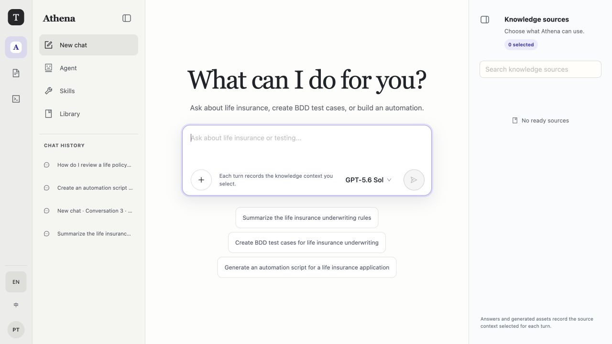
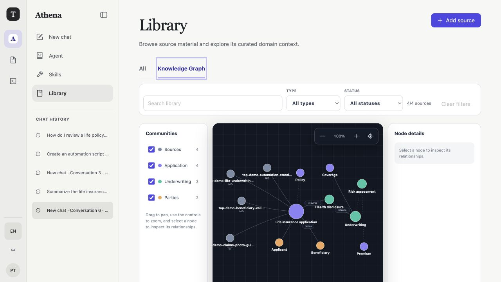
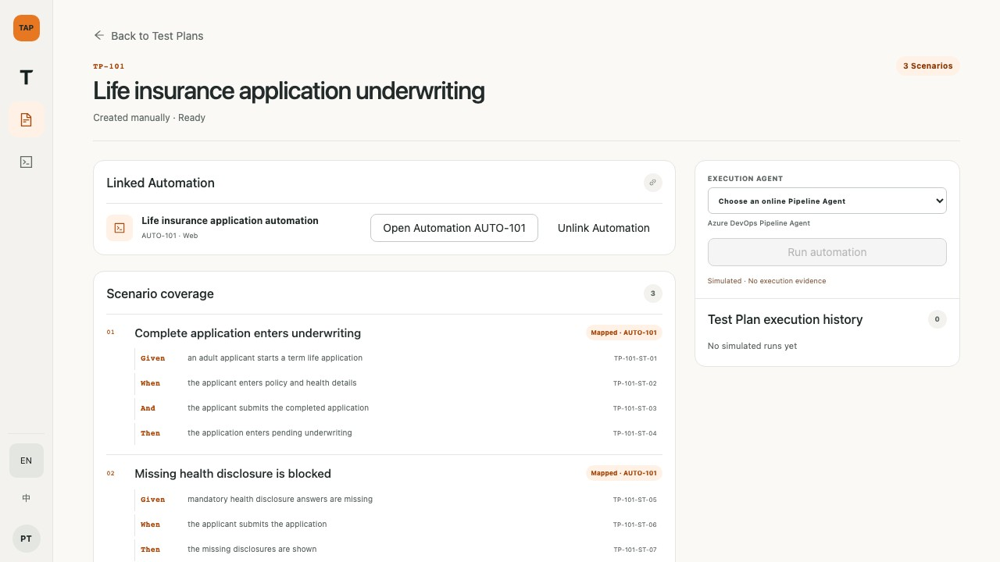
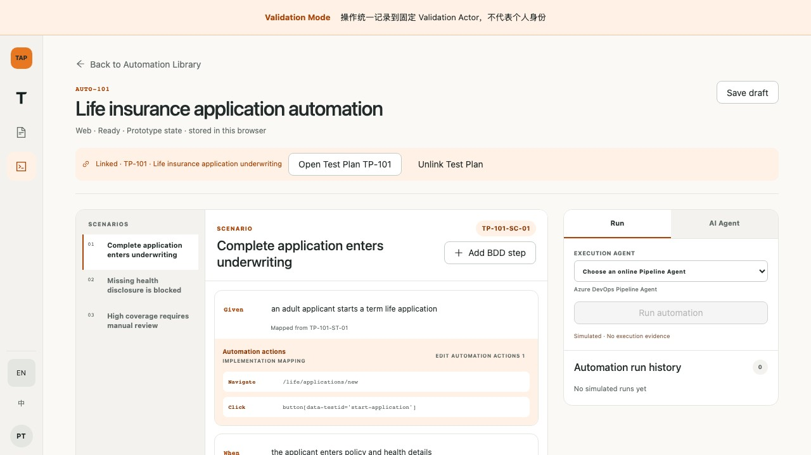
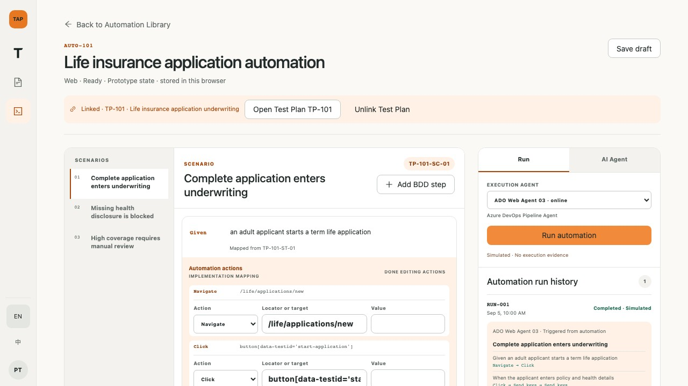
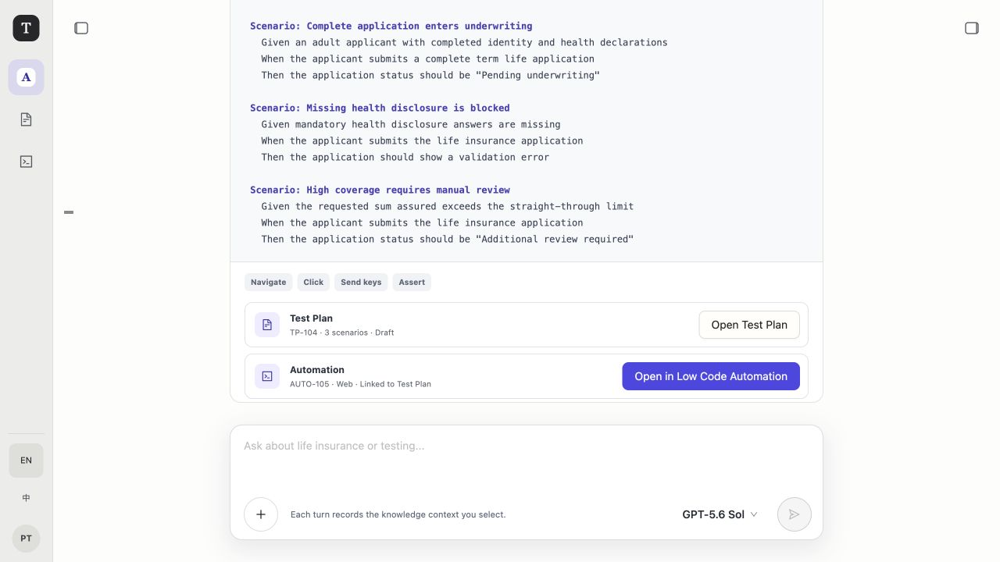

# TAP — Test Automation Platform

TAP（**Test Automation Platform**）是一套 Knowledge-first 的测试智能平台：Athena 用企业知识回答问题并生成测试设计，Test Management 保存可审查的测试资产，Low Code Automation 把 BDD 映射成可录制、可执行、可追溯的 Web 自动化。当前已接受的路线先在固定 Validation Scope 中验证知识问答、Knowledge Graph、Test Plan、Web LCA/Recorder、Playwright/Jenkins 与结果闭环；验证通过后再实现用户、RBAC、多 Project 和生产治理。

## 客户原型演示

当前纯前端交互原型展示 Athena 组合 Knowledge、AI Agent 与 Skill，生成并评审 Test Plan，再生成严格 `1:1` 关联的 Automation；BDD 步骤显式映射到 Navigate、Click、Send keys、Assert 等动作，已关联资产共享模拟 Run 历史。详细页面说明、40 张逐页截图、现场话术和客户问答见 [TAP 客户原型演示指南](docs/reference/2026-09-04-customer-prototype-demo-guide.md)，交互事实源见 [RFC-008](docs/proposals/2026-09-03-rfc-008-tap-product-shell-and-low-code-automation.md)，正式产品和技术范围见 [RFC-009](docs/proposals/2026-09-04-rfc-009-athena-knowledge-web-automation-platform.md)。

从仓库根目录启动原型：

```sh
corepack pnpm --dir apps/web dev --port 4175
```

打开 `http://127.0.0.1:4175/`。下图是建议向客户重点展示的六个页面：

| Athena 统一对话入口                                                                          | Graphify 式 Knowledge Graph                                                                    |
| -------------------------------------------------------------------------------------------- | ---------------------------------------------------------------------------------------------- |
|                       |                    |
| **已关联的 Test Plan**                                                                       | **BDD 与 Automation actions 映射**                                                             |
|  |  |
| **Web Automation 执行历史**                                                                  | **Athena 生成并关联两类资产**                                                                  |
|      |               |

演示时必须明确：Athena 中的 **AI Agent** 负责分析、生成和调整；正式路线中的 **Execution Agent** 是 Jenkins **Pipeline Agent**。截图中的 Azure DevOps 与 Mobile 是旧的模拟交互探索，不属于当前实施范围。当前 Conversation、资产和 Run 使用浏览器状态模拟，所有运行均标为 `Simulated`；这不表示已连接真实 Pipeline、浏览器、移动设备或生成真实 Execution Evidence。

## 一句话架构

TAP 以 **可信知识 + 统一测试模型（Test IR）+ TAP-managed Revision + 统一执行证据** 为核心，采用 **React + TypeScript 前端、Python + FastAPI/ASGI 后端**。MySQL 保存权威业务状态与 Outbox，Redis 只作可重建唤醒，MinIO 保存原件/Bundle/Evidence，Milvus 保存可重建 `doc` 检索投影，MySQL 同时保存 Knowledge Graph；模型经 LiteLLM，首个 Execution Provider 是外置 Jenkins。Git 是可选导出/同步 Adapter，不是发布和执行的必要事实源。

### Test IR 是什么？

`Test IR` 是 **Test Intermediate Representation** 的缩写，在 TAP 中可以直接理解为“**统一测试模型**”。它不是客户需要操作的页面，也不是 Playwright、Selenium 或 Appium 脚本，而是平台内部用于统一记录测试内容的结构化格式。

```text
Test Plan / BDD（业务上要验证什么）
                ↓
Test IR（统一记录步骤、动作、目标、预期结果和关联关系）
                ↓
Web Automation（当前生成 Playwright + TypeScript；Mobile 后置）
                ↓
Run 与执行证据（记录执行结果并追溯到原始测试步骤）
```

例如，业务人员在 Test Plan 中写下：

```text
When the applicant submits the application
```

TAP 会在统一测试模型中记录：这个步骤来自哪个 Test Plan、执行 `Click` 动作、目标是哪个提交按钮，以及预期进入 `Pending underwriting` 状态。当前 Web Automation 把它确定性生成成 Playwright + TypeScript；未来若增加其他执行框架，也必须保留同一个步骤身份和证据链。

因此，Test IR 的价值不是让客户学习一种新语言，而是让 TAP 能够做到：

- Test Plan 和 BDD 保持业务可读；
- 每个 BDD 步骤都能关联 Click、Send keys、Navigate、Assert 等自动化动作；
- 更换 Web 执行 Provider，或未来增加新的执行框架时，不必重写业务测试定义；
- Automation Run 可以追溯到对应的 Test Plan、Scenario 和 BDD Step。

面向客户演示时，可以直接使用“**统一测试模型**”这个名称；`Test IR` 只作为技术架构中的正式术语保留。

已接受的首个交付技术栈：

```text
Linux + Docker Compose + MySQL + Redis + MinIO
+ Milvus + LiteLLM + external Jenkins
+ React/TypeScript + Python/FastAPI + Playwright/TypeScript
```

## 目标

- 先让用户基于企业知识获得带引用、可核验、可恢复历史的回答和 Knowledge Graph。
- 让用户用自然语言或 BDD 创建 Test Plan 与 Web Automation，也能基于已有资产做定向更新。
- 用稳定的统一测试模型（Test IR）连接需求、BDD、脚本、Locator、Fixture、Hook、测试数据和运行证据。
- 在同一条 Run 时间线中关联 TAP Revision、Jenkins Attempt、测试结果、证据和人工审批。
- 用 provider-neutral 接口隔离模型、对象存储、Recorder 和执行系统，首个执行适配器采用 Jenkins。
- 通过 LiteLLM 统一路由 Chat、Coder、Embedding、Reranker、Vision 模型。
- 默认隔离不可信代码，限制凭证、网络和高风险工具调用。
- 在固定 Validation Scope 中先验证知识→测试设计→Web 自动化→执行结果闭环，再决定是否投入账号与生产化。
- 所有 AI、Graph 和 Recorder 输出先形成 Draft/Proposal，经确定性验证与人工发布后才成为权威 Revision。

## 非目标

- 当前不实现 Mobile/Appium、Azure DevOps、BrowserStack、Git Sync、SSO、专用 Graph DB 或 Kubernetes HA。
- 不把 DeepSeek Harness、LangGraph 或 BrowserStack 的内部对象直接暴露为 TAP 公共契约。
- 不在 MVP 阶段构建通用低代码编排器或多云调度平台。
- 不让非确定性的 Agent 判断替代确定性的测试门禁。
- 不把 Codex CLI/SDK 变成 Knowledge、授权、摄取、Milvus/Graph 写入或测试执行的必需依赖。

## 文档导航

- [Athena 知识与 Web 自动化平台架构](docs/architecture/2026-09-04-athena-knowledge-web-automation-overview.md)：当前边界、组件、数据、流程、安全、可靠性与部署。
- [RFC-009：平台设计](docs/proposals/2026-09-04-rfc-009-athena-knowledge-web-automation-platform.md)：完整产品旅程、数据模型、API、事件、质量门禁和阶段边界。
- [Athena 知识与 Web 自动化平台实施计划](docs/plans/2026-09-04-athena-knowledge-web-automation-platform.md)：V0–P1 的精确文件、TDD 步骤、命令与提交边界。
- [Athena 平台设计基线评审](docs/reviews/2026-09-05-athena-platform-design-baseline-review.md)：记录已关闭的关键问题、最终 READY 结论和“可进入 V0、尚未实现或生产就绪”的授权边界。
- TAP 平台架构简图：[draw.io 源文件](docs/architecture/2026-08-27-tap-platform-architecture.drawio) / [SVG 预览](docs/architecture/2026-08-27-tap-platform-architecture.svg)：面向管理层说明输入、统一平台、业务结果与共享底座。
- RAG 知识问答简图：[draw.io 源文件](docs/architecture/rag/2026-08-27-rag-knowledge-business-flow.drawio) / [SVG 预览](docs/architecture/rag/2026-08-27-rag-knowledge-business-flow.svg)：用知识建设与在线问答两条主线说明从数据源到可溯源回答的完整链路。
- [整体架构评审](docs/reviews/2026-08-21-architecture-review.md)：评审结论、优先级问题、整改建议与分阶段决策门禁。
- [Milvus 本地检索实验评审](docs/reviews/2026-08-27-milvus-local-search-experiment.md)：记录真实数据库、空卷重建、embedding 预算证据与严格的决策边界。
- [Athena 本地知识 Demo RFC](docs/proposals/2026-08-27-rfc-005-athena-local-knowledge-demo.md)：本地来源优先工作区、运行边界与验收标准。
- [Athena 本地知识 Demo 计划](docs/plans/2026-08-27-athena-local-knowledge-demo.md)：纵向实现步骤与确定性门禁。
- [Athena 本地知识 Demo 验收](docs/reviews/2026-08-27-athena-local-knowledge-demo.md)：本地中间件、浏览器、持久化和可选真实模型的证据记录。
- [Athena 本地回答后端 RFC](docs/proposals/2026-08-31-rfc-006-athena-local-codex-answer-backend.md)：记录 LiteLLM/Codex 独占选择、固定 Embedding 与 fail-closed 验收。
- [Athena 单智能体、无工具 Codex 决策](docs/decisions/2026-09-01-adr-018-athena-local-codex-tool-free-answer.md)：记录精确 CLI/model/catalog 契约及其本地边界。
- [历史 Phase 1 Intelligence Layer 探索](docs/proposals/2026-09-02-rfc-007-phase-1-intelligence-layer-exploration.md)：保留 durable task、Artifact、Validator 与 Review 设计；交付优先级已被 RFC-009/ADR-021 替代。
- [TAP 客户原型演示指南](docs/reference/2026-09-04-customer-prototype-demo-guide.md)：按客户讲解顺序汇总 Athena、Library、Test Management、Low Code Automation 的逐页截图、演示话术和能力边界。
- [Knowledge/RAG 基础](docs/architecture/rag/2026-08-21-foundation.md)：当前 Milvus 文档路径与历史 Azure 四索引设计的范围说明。
- [数据切片与溯源](docs/architecture/rag/2026-08-21-chunking-and-provenance.md)：稳定身份、revision lineage、Citation、删除与重建。
- [Azure AI Search 索引设计（历史/provider-specific）](docs/architecture/rag/2026-08-21-ai-search-index.md)：被替代的四索引专项参考。
- [检索调优方案](docs/architecture/rag/2026-08-21-retrieval-tuning.md)：可复用评测原则与历史 Azure 实验阶梯。
- [TAP Knowledge Chat](docs/architecture/2026-08-21-knowledge-chat-ui.md)：V1 持久 Conversation/SSE/Citation 交互输入。
- [历史 Codex Agent Runtime RFC](docs/proposals/2026-08-21-rfc-001-codex-agent-runtime.md)：已拒绝的旧 Phase 1.5 设计；可复用 Runtime 隔离原则由 RFC-007/ADR-014 保留，现行产品范围由 RFC-009 管理。
- [当前核心契约](docs/reference/2026-09-04-athena-platform-contracts.md)：Scope、Knowledge、Conversation、Test Plan、Test IR、Recorder、Jenkins Run/Evidence 和错误语义。
- [架构决策](docs/decisions/index.md)：架构决策、取舍与被覆盖的历史方案。
- [交付路线图](docs/plans/2026-08-20-roadmap.md)：从架构基线到可用 MVP 的阶段计划。
- [来源与可追溯性](docs/reference/2026-08-20-source-notes.md)：`engprod` 会话索引、官方资料和推断边界。

## 核心原则

1. **Test IR 是稳定中间层**：自然语言、BDD、低代码和脚本都映射到版本化 IR。
2. **TAP 管权威 Revision**：MySQL 管资产/版本/关系/运行事实，MinIO 管内容寻址 Bundle/Evidence，Git 仅为可选同步。
3. **执行证据统一**：Jenkins 及未来 Provider 都产出同一 Evidence 和 Step Result 模型。
4. **平台拥有控制面**：身份、策略、状态、审批、审计和归一化结果由 TAP 管理。
5. **执行端可替换**：模型、对象存储、Recorder 和 Jenkins 均通过端口接入。
6. **确定性门禁优先**：Agent 可以建议、生成和诊断，最终门禁必须落到明确规则。
7. **不可信输入默认隔离**：代码、网页内容、模型输出和第三方回调都不可信。

## 当前状态

- 架构状态：`v0.4 accepted — validation-first knowledge and web automation`
- 实现状态：`Athena local doc Q&A slice + frontend prototype implemented; v0.4 platform not implemented`
- 当前交付重点：`V0 Validation Scope and reliability baseline`
- 后续顺序：`V1 Knowledge → V2 Graph → V3 Test Design → V4 Web LCA/Recorder → V5 Jenkins → VG → P0 → P1`
- 默认仓库可见性：建议 `private`
- 下一决策点：见 [待确认项](docs/proposals/2026-08-20-open-questions.md)

## Athena 本地知识工作区

Athena 当前实现仍是来源优先的本地 Demo，不是 v0.4 完整平台。现有真实知识页面可上传、查看六阶段 ingestion、选择 ready 来源、发起单次非流式问答并打开逐条引用；没有登录、服务端 Conversation/history、SSE、停止/队列、真实 Graph 或 OCR。默认产品壳仍挂载纯前端 prototype。API、Web 和所有中间件只绑定精确 loopback；无身份验证仅适用于单机开发，不能开放到局域网或生产环境。Milvus 已被接受为目标 `doc` 检索后端，但当前本地门禁不等于生产认证、TLS、备份、容量或多 Project 隔离已经完成。

支持文本可提取的 PDF、DOCX、Markdown（MD）和 TXT。PDF 不执行 OCR；扫描件返回 `ocr-required`。服务端硬上限为每文件 `25 MiB`、最多 `50` 份未删除文档、每次回答最多选择 `20` 份 ready 文档。

首次启动：

```sh
cp .env.example .env
# 在 .env 中填写 DASHSCOPE_API_KEY，并把 ws-your-workspace-id 换成自己的 Workspace ID；不要提交该文件
make bootstrap
make demo-up
make demo-check
make demo-dev
```

已有旧 `.env` 的工作区必须重新复制模板，或至少同步下面三项；旧 OpenAI model route 会覆盖 Compose 默认值，不能继续保留：

```dotenv
LITELLM_MODEL=dashscope/qwen-plus
LITELLM_ATHENA_EMBEDDING_MODEL=dashscope/text-embedding-v4
DASHSCOPE_API_BASE=https://ws-your-workspace-id.cn-beijing.maas.aliyuncs.com/compatible-mode/v1
```

`make demo-up` 启动并初始化 MySQL、Redis、Azurite、Milvus 与 LiteLLM；`make demo-dev` 在 `127.0.0.1:8000` 运行 FastAPI，在 `127.0.0.1:5173` 运行 Vite Web，并启动 Relay 与 Athena Ingestion Worker。默认本地端口如下：

| 组件           | 默认 loopback 端口 | 职责                                                                                                    |
| -------------- | ------------------ | ------------------------------------------------------------------------------------------------------- |
| MySQL 8.4 LTS  | `23306`            | 文档/revision/job/manifest、query hash/所选 revision/citation 核验快照与 Outbox；不保存回答正文/history |
| Redis 7.4      | `26379`            | 可重建命令分发与任务唤醒                                                                                |
| Azurite Blob   | `21000`            | 原文件、normalized/chunk/embedding artifact                                                             |
| LiteLLM Proxy  | `24000`            | 固定 Chat/Embedding alias 路由                                                                          |
| Milvus         | `39530` / `29091`  | 本地 `doc` 可重建检索投影与健康端口                                                                     |
| FastAPI / Vite | `8000` / `5173`    | Knowledge HTTP API 与 Athena Web                                                                        |

以下模型选择只描述当前已实现的 RFC-006 **历史 loopback Demo**，不属于 RFC-009 V1 的唯一 ModelGateway 合同，也不能作为 V1/VG 验收证据。当前代码仍暂时在既有本地 runtime 中提供该开关；实施计划 Task 7 会把 Codex selector/Adapter 移入不挂载 RFC-009 Project API 的显式 legacy-loopback composition。V1 默认、Validation 和 Product runtime 只装配 LiteLLM ModelGateway，并对 `ATHENA_ANSWER_BACKEND=codex` fail closed。

该历史 Demo 的模型配置只来自服务端 `.env`，不在 UI 或单次请求暴露。默认及已验收的完整回答选择块为：

```dotenv
ATHENA_MODEL_BACKEND=litellm
ATHENA_ANSWER_BACKEND=litellm
ATHENA_CODEX_MODEL=gpt-5.6-sol
ATHENA_CODEX_REASONING_EFFORT=ultra
ATHENA_CODEX_TIMEOUT_SECONDS=300
ATHENA_CHAT_ALIAS=athena-chat
ATHENA_EMBEDDING_ALIAS=athena-embedding
ATHENA_EMBEDDING_DIMENSION=1536
```

在当前历史 Demo 中，默认 `ATHENA_ANSWER_BACKEND=litellm`；要复验已经实现的本机 Codex 路径，只把该值改为 `codex`，其余固定值不变，然后停止并重新运行 `make demo-dev` 使 API/Relay/Worker 重新读取同一配置。若同时修改 LiteLLM route 或 credential，还要重新运行 `make demo-up`。两个值是启动时独占选择：LiteLLM 与 Codex 不会相互 fallback、hedge 或重试到另一后端。完成 Task 7 后，这一复验改走计划中的 `make legacy-athena-codex-dev`，默认 `make demo-dev` 不再接受 Codex 直连。

无论选择哪一个回答后端，文档与查询 Embedding 都必须经 LiteLLM 固定 `athena-embedding` alias 发往阿里云百炼/DashScope `text-embedding-v4`，维度固定为 `1536`，并支持中文、英文和混合术语检索；这也是 LiteLLM 在 Codex 模式下仍为必需中间件的原因。LiteLLM `1.87.0` 回答模式另通过 DashScope provider 将 `athena-chat` 路由到百炼 `qwen-plus`。

Codex 回答模式精确要求原生 `codex-cli 0.149.0`、`gpt-5.6-sol`、`ultra`、有效的本机 ChatGPT 登录、单智能体、零工具、单 API 进程内并发 `1` 和 300 秒超时，不读取或要求 `OPENAI_API_KEY`/`CODEX_API_KEY`。

Codex CLI 只是本机调用入口，不是本地推理：query 与所选 Evidence 会发送给 OpenAI；文档和 query 的 Embedding 内容会发送给阿里云百炼。该数据边界只获准用于 loopback、无认证的单操作者本地 Demo，不得据此开放 LAN、共享或生产服务。

Codex 的请求自有 canonical model catalog 会消除内建 CodeModeOnly、多智能体和 apply-patch metadata，并与 24 个禁用 feature 及显式 plan/input/agent overrides 一起保持 Direct tool registry 为空。这个 catalog 的固定 entry schema 只保证精确 CLI `0.149.0`，不是跨版本兼容承诺；CLI、登录、feature、catalog/schema、模型或能力任何漂移都会使 readiness/request fail closed，返回 `503 answer-unavailable`，且绝不调用 LiteLLM answer。Web 对该错误只显示“回答模型暂时不可用，请稍后重试。”

LiteLLM 用 `LITELLM_BASE_URL`、`LITELLM_MASTER_KEY`、`LITELLM_MODEL`、`LITELLM_ATHENA_EMBEDDING_MODEL`、`DASHSCOPE_API_KEY` 与 `DASHSCOPE_API_BASE` 注入实际路由与凭据。在未跟踪的 `.env` 填写 key，并把脱敏 Workspace ID 替换为实际值；`.env.example` 同时列出的 API Host 与原生 `/api/v1` 地址仅供参考，Athena/LiteLLM 当前只消费 OpenAI-compatible `/compatible-mode/v1` 地址。`LITELLM_EMBEDDING_*` 只供单独批准的付费 Embedding research 使用，Athena runtime 不读取。

页面刷新会重新读取已提交的文档、ingestion/index 状态和必要的可重建状态；API/Web/Worker 进程重启与普通 Compose 停止/再次启动后也从这些持久事实恢复。当前渲染的回答只存在于 Web 页面内存，刷新会清空，本版没有历史回答恢复 API；用户可以基于仍为 `ready` 的持久来源重新提问。普通停止/再次启动保留具名卷：

```sh
make demo-down
make demo-up
make demo-dev
```

只有下面的 guarded 命令会不可逆删除精确 Compose project `tap-athena-demo` 的 MySQL、Redis、Azurite 和 Milvus 卷；命令拒绝其他 project 名称：

```sh
TAP_ATHENA_COMPOSE_PROJECT=tap-athena-demo \
  TAP_ALLOW_ATHENA_VOLUME_RESET=1 make demo-reset
```

### `demo-check` 故障定位

`make demo-check` 独立检查五个组件，只输出组件、结果和安全修复码：

| 组件 / 修复码               | 处理方式                                                                                                                                                                                                                                                                                                                                                                                                                         |
| --------------------------- | -------------------------------------------------------------------------------------------------------------------------------------------------------------------------------------------------------------------------------------------------------------------------------------------------------------------------------------------------------------------------------------------------------------------------------- |
| MySQL / `start-mysql`       | 运行 `make demo-up`；确认 `TAP_DATABASE_URL` 与迁移 head 使用默认 loopback project。                                                                                                                                                                                                                                                                                                                                             |
| Redis / `start-redis`       | 运行 `make demo-up`；确认 `TAP_REDIS_URL` 指向 `redis://127.0.0.1:26379/0`。                                                                                                                                                                                                                                                                                                                                                     |
| Blob / `start-blob`         | 运行 `make demo-up`；确认 `AZURE_STORAGE_CONNECTION_STRING` 指向 loopback Azurite，两个容器保持 private。                                                                                                                                                                                                                                                                                                                        |
| Milvus / `start-milvus`     | 为 Docker 分配至少 2 vCPU / 8 GiB，运行 `make demo-up`，并保留固定 reader/writer/provisioner 配置。                                                                                                                                                                                                                                                                                                                              |
| Models / `configure-models` | 两种模式都要在 ignored `.env` 配置 `DASHSCOPE_API_KEY`、`dashscope/text-embedding-v4` 与完整 Workspace `/compatible-mode/v1` 地址，重启 `make demo-up` 和本地角色，并确认 `athena-embedding`；LiteLLM 回答模式还要同步 `dashscope/qwen-plus` 并确认 `athena-chat`，Codex 回答模式则检查精确原生 `0.149.0`、ChatGPT 登录与 tool-free catalog/feature 契约。Codex 失败不会回退 LiteLLM，用户只收到 `answer-unavailable` 安全文案。 |

### 确定性 E2E 与真实模型 smoke

日常验收使用隔离 project、真实本地中间件和 deterministic fake 模型，不消耗 provider 配额：

```sh
make demo-e2e
```

真实 provider gate 是单独的显式 opt-in；未设置开关时两个 smoke 文件精确产生两次有意 skip，且不会进入 provider/Codex 请求体。阿里门禁验证 `athena-embedding`、1536 维、有限数值及 zh→en/en→zh 相似度；Codex 门禁验证精确 `0.149.0 + gpt-5.6-sol + ultra` 的单智能体、零工具、grounded/cited/sanitized/cleanup 契约。缺凭据、provider `401`、维度或 catalog 漂移、非法 claim/citation、工具事件和清理不确定性都算失败，不会转为 skip：

```sh
set -a
. ./.env
set +a
TAP_RUN_ATHENA_REAL_MODEL_SMOKE=1 uv run --project apps/backend pytest \
  apps/backend/tests/smoke/test_athena_real_model.py -v -rs
TAP_RUN_ATHENA_CODEX_CONFORMANCE=1 uv run --project apps/backend pytest \
  apps/backend/tests/smoke/test_athena_codex_smoke.py -v -rs
```

2026-09-01 的验收证据为：阿里 `athena-embedding` 的 zh→en 与 en→zh 门禁均通过且维度为 `1536`，`elapsed_ms=669`；Codex bootstrap 和未打补丁的生产配置均通过，最新生产复验输出 `version=0.149.0 model=gpt-5.6-sol reasoning=ultra single_agent=true grounded=true cited=true sanitized=true cleanup=true elapsed_ms=21652`，pytest 为 `1 passed in 21.71s`、exit `0`。默认无授权执行为 `2 skipped in 0.63s`、exit `0`。证据不保存 query、Evidence、回答、向量、JSONL 或登录信息。

### 实验性 Milvus 检索门禁

Milvus 已被 ADR-023 接受为目标 `doc` 检索投影，但当前仓库完成的仍只是本地、可重建且可替换的实验与知识切片，不是共享或生产部署完成证据；这里的检索实现可替换性不表示回答后端存在 fallback。固定版本与脱敏预计算向量的可复现 correctness gate 为：

```sh
make milvus-preflight

# 仅首次创建全新 volume；完成 root 轮换后不再设置该开关
TAP_ALLOW_INITIAL_MILVUS_ROOT=1 make test-milvus

# 已完成 root 轮换的既有 volume
make test-milvus

TAP_ALLOW_INITIAL_MILVUS_ROOT=1 \
  TAP_ALLOW_MILVUS_VOLUME_RESET=1 \
  make test-milvus-rebuild-empty
```

真实 embedding profile 是显式授权的付费研究入口，只能在注入未跟踪 provider 配置并单独批准后运行 `TAP_RUN_PAID_EMBEDDING_RESEARCH=1 make research-embeddings`。上述命令或单次 GREEN 只证明固定实验门禁，不表示 V1、共享环境、P0 身份或 P1 生产门禁已经通过；生命周期建议以[本次实验评审](docs/reviews/2026-08-27-milvus-local-search-experiment.md)的完整证据为准。

## 开发工作区与契约

运行时和依赖图固定为 Python 3.13.12、uv 0.10.8、Node 22.22.0、pnpm 10.15.1、`uv.lock` 与 `pnpm-lock.yaml`。从仓库根目录执行：

```sh
make bootstrap
make contracts
make check
make test
```

`make contracts` 从 FastAPI 路由元数据和公共 Pydantic 模型确定性导出并检查 `contracts/openapi/api.json` 与 `contracts/events/chat-stream.schema.json`：JSON 使用排序键、两空格缩进、一个末尾换行，且不写入时间戳。HTTP DTO 与 SSE event models 是彼此独立的模型图；浏览器可见的 SSE schema 不描述 `text/event-stream` framing。

`make contracts` 同时更新并检查 `apps/web/src/shared/api/generated/` 的 TypeScript client/type。冻结安装使用 `uv sync --frozen --all-groups` 和 `corepack pnpm install --frozen-lockfile`，不依赖全局 pnpm。
