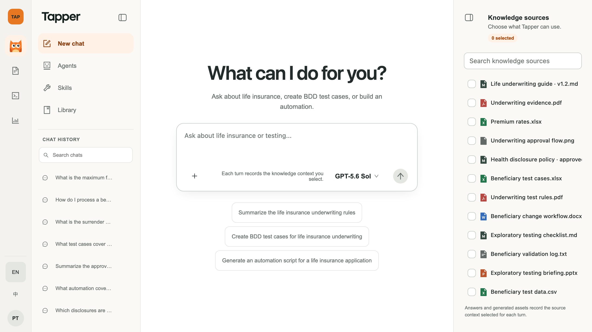
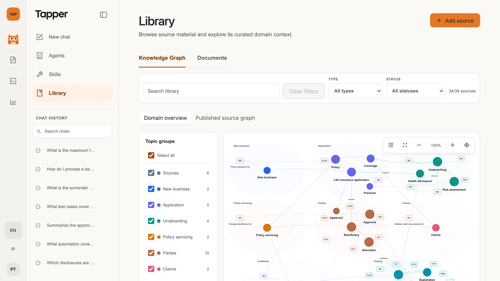
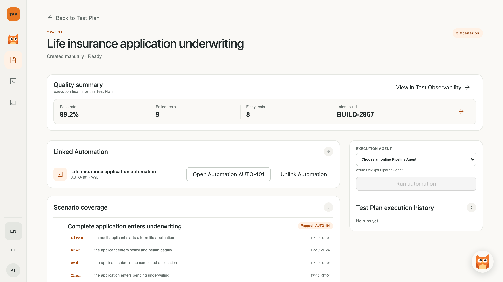
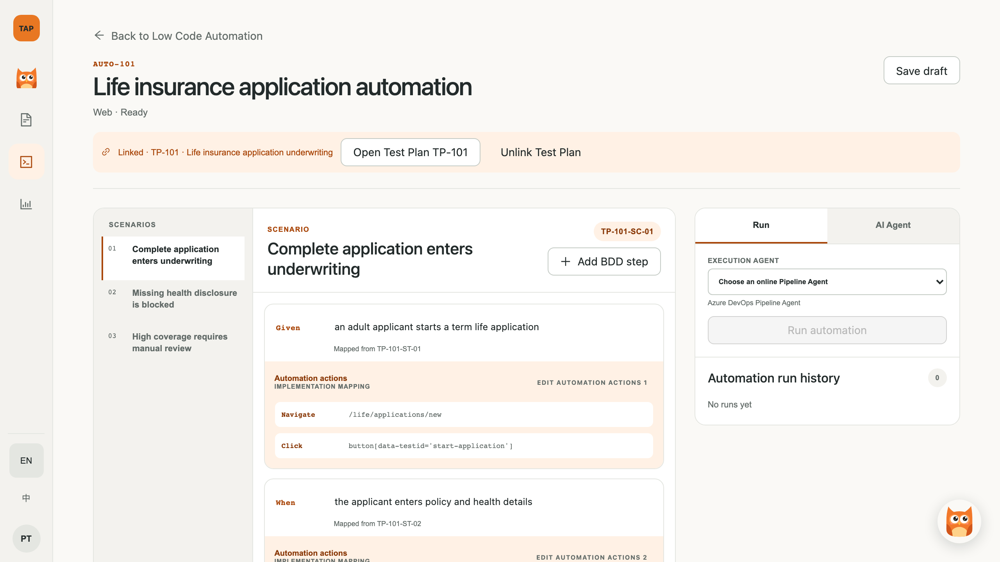
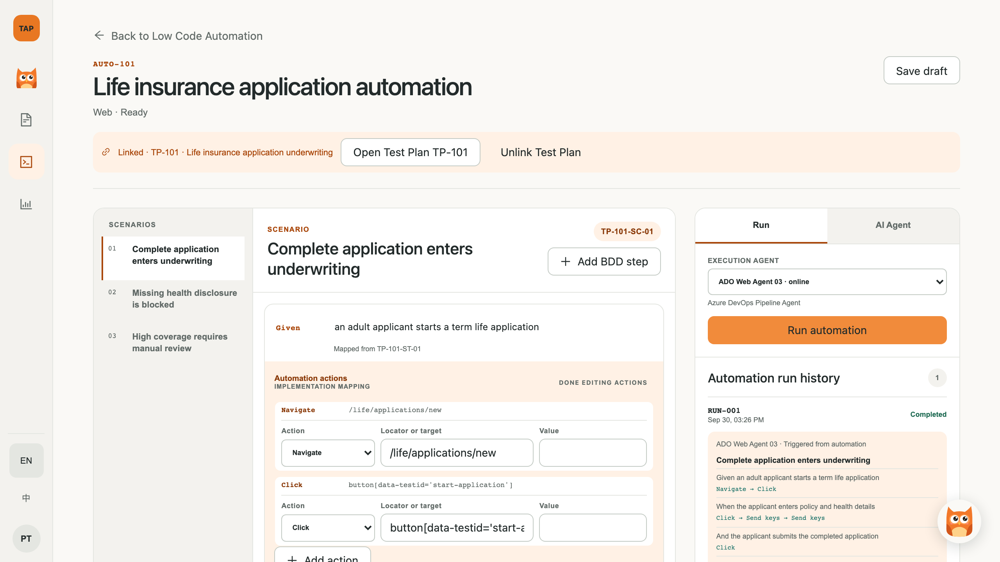
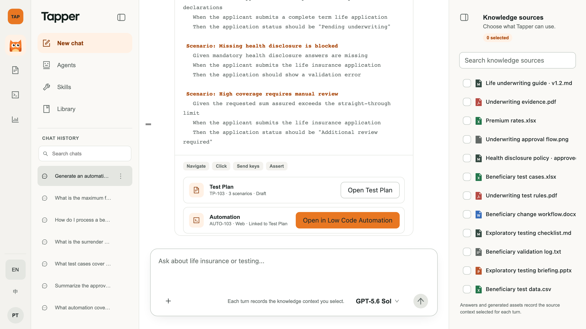

# TAP — Test Automation Platform

TAP（**Test Automation Platform**）是一套 Knowledge-first 的测试智能平台：Tapper 用企业知识回答问题并生成测试设计，Test Management 保存可审查的测试资产，Low Code Automation 把 BDD 映射成可录制、可执行、可追溯的 Web 自动化。V1 聚焦 TAP AI 的 5 项能力（可靠问答、知识图谱展示、图谱脉络分析、自定义与导入 Skills/Agents、对话可观测性），范围与验收见 [V1 总纲](docs/superpowers/plans/2026-09-29-v1-roadmap.md)。

## 最新产品原型：以 main 为准

**`main` 主分支始终承载最新已确认的完整产品原型，是唯一权威入口。** 原型变更确认后必须连同源码、资源和本节说明一起合入 `main`；不能只留在功能分支、worktree、临时目录或截图中。查看最新设计时直接使用最新 `main`，无需寻找历史分支或另一个原型项目。

完整组合原型是持续演进的唯一设计基准，固定在 `apps/web` 的 `/prototype`，入口组件为 `apps/web/src/widgets/tap/TapProductPrototype.tsx`。从仓库根目录启动：

```sh
corepack pnpm --dir apps/web dev --port 15176
```

打开 `http://127.0.0.1:15176/prototype`。后续需求必须在此基准上增量修改，保留 Tapper（New chat、Agents、Skills、Library、Knowledge Graph）、Test Management、Test Insights、Low Code Automation、跨模块关联与悬浮助手；不得另建一套原型或因近期实施范围缩窄而删除既有模块。UI 展示拟交付产品的用户界面，不放演示开关、模拟场景控件或实现说明。模块清单、截图回归与边界见[产品原型基准规范](docs/guides/2026-09-22-product-prototype-baseline.md)。

当前原型包含 Dify 式切片配置、预览与维护（保存索引后直接可用）、原件查看、知识问答引用、项目维度的 Test Insights 和数据接入。`/prototype` 是完整产品设计入口；下方独立应用入口及历史截图用于各自的实现和追溯，不代替最新原型。

Tapper 品牌形象自 2026-09-28 起为猫头鹰，替换原 Listening/Aha 啄木鸟；素材包见 [Tapper Owl](apps/tap-ai-frontend/assets/brand/tapper/owl/README.md)。

当前设计截图：[Test Insights](docs/assets/prototype-current/test-insights.png) · [知识切片维护](docs/assets/knowledge-chunks-2026-09-27/tap-chunks-after-detail.png)。实际交互以 `main` 上运行的 `/prototype` 为准。

## 文档

- [现状架构](docs/architecture.md)：代码中可验证的系统结构与已知差距。
- [产品路线图](docs/superpowers/plans/2026-10-01-product-roadmap.md)：全局版本顺序、已完成与规划中的工作。
- [V1 总纲](docs/superpowers/plans/2026-09-29-v1-roadmap.md)：V1 能力、验收标准与子项目顺序。
- [文档索引](docs/index.md)：指南、设计 spec、实施计划与架构决策。
- [历史文档归档](docs/archive/index.md)：2026-09-29 前的 RFC、计划、评审与参考，只读。

## TAP AI 独立应用

TAP AI 的前后端分别位于 `apps/tap-ai-frontend` 和 `apps/tap-ai-backend`，拥有 Tapper 问答、知识文档/图谱、模型与 Agent/Skill 资产，以及 AI 测试方案的生成、保存和评审。TAP 非 AI 应用入口保留在 `apps/web` 和 `apps/backend`；现有低代码与测试分析原型由 TAP Web 承载。公开 API 路径、数据库表、迁移链和 `TAPPER_*` 配置名在本次目录迁移中保持不变，因此已有 Tapper 数据和对象引用无需重建。

TAP AI 可在不启动 TAP 前后端的情况下运行。先执行 `make tap-ai-bootstrap` 安装 TAP AI 冻结依赖，按 `.env.example` 配置并启动本机基础服务（现有 Demo 可用 `make demo-up`，或连接自行配置的服务），执行 `make tap-ai-migrate`，再执行 `make tap-ai-dev`；这会在回环地址启动 TAP AI API、Relay、后台任务和前端。结束 `tap-ai-dev` 会清理这些应用进程；现有 Demo 的基础服务可用 `make demo-down` 停止并保留卷。`make tap-ai-api` 与 `make tap-ai-web` 可分别启动两端；`make tap-web-dev`、`make tap-backend-dev` 则分别启动 TAP 非 AI 应用。`make tap-ai-check` 和 `make tap-ai-test` 只检查 TAP AI。当前入口仍是本机无认证 Demo，不承担局域网或生产访问。

产品边界与验收见 [TAP AI 产品边界与本机独立部署](docs/archive/architecture/2026-09-15-tap-ai-product-boundary.md)。TAP AI 与 TAP 仍独立实现和部署；各独立应用入口不能替代上方完整设计基准。下方截图记录的是拆分前的页面，完整组合原型已恢复为持续演进的设计基准，这不表示相关后端能力均已实现。

当前 AI 页面截图可运行 `corepack pnpm --dir apps/tap-ai-frontend run ui:capture`：仅使用隔离的示例 API 响应，输出 6 张截图到应用的 `test-results/ui-capture/`，不改写下方历史截图；追加 `--list` 可查看采集范围。

旧版浏览器中的 Automation 编辑和模拟 Run 需按[浏览器原型工作区升级](docs/archive/architecture/2026-09-15-tap-ai-product-boundary.md#浏览器原型工作区升级)迁移：同源可自动恢复；默认端口从 5173 变为 5174 时，使用 TAP 自有的 `Local workspace` 导出/导入功能转移。

## 产品原型参考截图（2026-09-06 采集）

2026-09-06 采集时，前端交互原型以 Tapper 为统一助手入口，组合 Knowledge、AI Agent 与 Skill，生成并评审 Test Plan，再生成严格 `1:1` 关联的 Automation。BDD 步骤显式映射到 Navigate、Click、Send keys、Assert 等动作，已关联资产共享模拟 Run 历史。以下截图是视觉与交互参考，不是当前运行状态或后端能力的验收证据。

- **导航与品牌**：平台与浏览器标题使用 TAP；Tapper 使用猫头鹰标识（2026-09-28 起替换原 Listening 啄木鸟）。二级菜单为 `New chat`、`Agents`、`Skills`、`Library`，收起后保留图标导航。点击一级 Tapper 入口回到当前会话并保留草稿；新建会话使用 `New chat`。
- **知识检索**：Library 默认打开 Knowledge Graph，搜索文档、概念或实体后可点击结果定位、高亮节点并查看关系。清空搜索恢复总览；`Documents`（文档列表）提供名称、类型与状态筛选。图谱支持平移、缩放、全屏及收起辅助面板；文档节点可跳到对应来源记录，尚无原文预览。
- **跨页面助手**：Test Management 与 Low Code Automation 右下角提供 Tapper 悬浮入口，支持当前页面上下文、快捷提问、轻量对话和“在 Tapper 中继续”。悬浮入口使用猫头鹰形象，收起后收到回复时显示未读标记；回复是基于页面数据的确定性原型建议。

按业务流程组织的操作步骤、现场话术与当前能力边界见 [TAP 客户原型演示指南](docs/guides/2026-09-04-customer-prototype-demo-guide.md)。历史交互设计见 [RFC-008](docs/archive/proposals/2026-09-03-rfc-008-tap-product-shell-and-low-code-automation.md)，正式产品和技术范围见 [RFC-009](docs/archive/proposals/2026-09-04-rfc-009-tapper-knowledge-web-automation-platform.md)。使用本页上方固定 `/prototype` 入口查看当前设计。下图为其中六个页面，使用 2560×1440 无损 PNG，按整行展示，可点击图片查看原尺寸细节：

**Tapper 统一对话入口**



**Knowledge Graph**



**已关联的 Test Plan**



**BDD 与 Automation actions 映射**



**Web Automation 执行历史**



**Tapper 生成并关联两类资产**



讲解时必须明确：Tapper 中的 **AI Agent** 负责分析、生成和调整；正式路线中的 **Execution Agent** 是 Jenkins **Pipeline Agent**。截图中的 Azure DevOps 与 Mobile 是旧的交互探索，不属于当前实施范围。历史截图中的 Conversation、资产和 Run 使用浏览器状态模拟，运行标为 `Simulated`；这些历史标签不要求保留在产品 UI 中，也不表示已连接真实 Pipeline、浏览器、移动设备或生成真实 Execution Evidence。能力边界在文档与评审记录中说明。

## 一句话架构

以下为长期目标架构；V1 范围见 [V1 总纲](docs/superpowers/plans/2026-09-29-v1-roadmap.md)，现状见[现状架构](docs/architecture.md)。

TAP 以 **可信知识 + 统一测试模型（Test IR）+ TAP-managed Revision + 统一执行证据** 为核心，采用 **React + TypeScript 前端、Python + FastAPI/ASGI 后端**。MySQL 保存权威业务状态与 Outbox，Redis 只作可重建唤醒，MinIO 保存原件/Bundle/Evidence，Milvus 保存可重建 `doc` 检索投影，MySQL 同时保存 Knowledge Graph；模型经 LiteLLM，首个 Execution Provider 是外置 Jenkins。Git 是可选导出/同步 Adapter，不是发布和执行的必要事实源。

### Test IR 是什么？

`Test IR` 是 **Test Intermediate Representation** 的缩写，在 TAP 中可以直接理解为“**统一测试模型**”。它不是客户需要操作的页面，也不是 Playwright、Selenium 或 Appium 脚本，而是平台内部用于统一记录测试内容的结构化格式。

```text
Test Plan / BDD（业务上要验证什么）
                ↓
Test IR（统一记录步骤、动作、目标、预期结果和关联关系）
                ↓
Web Automation（当前生成 Playwright + TypeScript；Mobile 后置）
                ↓
Run 与执行证据（记录执行结果并追溯到原始测试步骤）
```

例如，业务人员在 Test Plan 中写下：

```text
When the applicant submits the application
```

TAP 会在统一测试模型中记录：这个步骤来自哪个 Test Plan、执行 `Click` 动作、目标是哪个提交按钮，以及预期进入 `Pending underwriting` 状态。当前 Web Automation 把它确定性生成成 Playwright + TypeScript；未来若增加其他执行框架，也必须保留同一个步骤身份和证据链。

因此，Test IR 的价值不是让客户学习一种新语言，而是让 TAP 能够做到：

- Test Plan 和 BDD 保持业务可读；
- 每个 BDD 步骤都能关联 Click、Send keys、Navigate、Assert 等自动化动作；
- 更换 Web 执行 Provider，或未来增加新的执行框架时，不必重写业务测试定义；
- Automation Run 可以追溯到对应的 Test Plan、Scenario 和 BDD Step。

面向客户演示时，可以直接使用“**统一测试模型**”这个名称；`Test IR` 只作为技术架构中的正式术语保留。

已接受的首个交付技术栈：

```text
Linux + Docker Compose + MySQL + Redis + MinIO
+ Milvus + LiteLLM + external Jenkins
+ React/TypeScript + Python/FastAPI + Playwright/TypeScript
```

## 目标

- 先让用户基于企业知识获得带引用、可核验、可恢复历史的回答和 Knowledge Graph。
- 让 TAP AI 的 Chat 与 AI Task 共用一个 LangGraph 入口、状态和审计边界：Fast Chat 保持低延迟，Durable Workflow 承载可恢复长任务，Bounded Agentic Task 承载受控复杂工具循环。
- 让用户用自然语言或 BDD 创建 Test Plan 与 Web Automation，也能基于已有资产做定向更新。
- 用稳定的统一测试模型（Test IR）连接需求、BDD、脚本、Locator、Fixture、Hook、测试数据和运行证据。
- 在同一条 Run 时间线中关联 TAP Revision、Jenkins Attempt、测试结果、证据和人工审批。
- 用 provider-neutral 接口隔离模型、对象存储、Recorder 和执行系统，首个执行适配器采用 Jenkins。
- 通过 LiteLLM 统一路由 Chat、Coder、Embedding、Reranker、Vision 模型。
- 默认隔离不可信代码，限制凭证、网络和高风险工具调用。
- 在固定 Validation Scope 中先验证知识→测试设计→Web 自动化→执行结果闭环，再决定是否投入账号与生产化。
- 所有 AI、Graph 和 Recorder 输出先形成 Draft/Proposal，经确定性验证与人工发布后才成为权威 Revision。

## 非目标

- 当前不实现 Mobile/Appium、Azure DevOps、BrowserStack、Git Sync、SSO、专用 Graph DB 或 Kubernetes HA。
- 不把 DeepSeek Harness、LangGraph 或 BrowserStack 的内部对象直接暴露为 TAP 公共契约。
- 不在 MVP 阶段构建通用低代码编排器或多云调度平台。
- 不让非确定性的 Agent 判断替代确定性的测试门禁。

## 核心原则

1. **Test IR 是稳定中间层**：自然语言、BDD、低代码和脚本都映射到版本化 IR。
2. **TAP 管权威 Revision**：MySQL 管资产/版本/关系/运行事实，MinIO 管内容寻址 Bundle/Evidence，Git 仅为可选同步。
3. **执行证据统一**：Jenkins 及未来 Provider 都产出同一 Evidence 和 Step Result 模型。
4. **平台拥有控制面**：身份、策略、状态、审批、审计和归一化结果由 TAP 管理。
5. **执行端可替换**：模型、对象存储、Recorder 和 Jenkins 均通过端口接入。
6. **确定性门禁优先**：Agent 可以建议、生成和诊断，最终门禁必须落到明确规则。
7. **不可信输入默认隔离**：代码、网页内容、模型输出和第三方回调都不可信。

## Tapper 本地知识工作区

Tapper 当前产品入口在已确认的 TAP 壳层中使用真实 Project API。Library 支持 Source create/list/detail/delete/retry、真实上传与六阶段 ingestion；Conversation 支持服务端历史、不可变 Turn 快照、可恢复 SSE、取消、引用与 Artifact Link；Knowledge Answer 可使用当前授权的 Milvus 文档证据和有界 Graph Context。Library 的 Knowledge Graph 使用真实 Snapshot/Evidence API；Tapper 可请求生成 grounded Test Plan Draft，Test Management Web 支持明细 Review 和人工发布，编辑与冲突恢复仍只具备 API 能力。本地 Milvus `doc-schema-v2` 使用 canonical Enterprise/Project/Source/Document/Revision 投影。

当前仍未交付登录、产品身份/RBAC、多 Project 产品化、OCR、Web Recorder、正式 Playwright Bundle、Jenkins 结果闭环和生产加固。API、Web 和所有中间件只绑定精确 loopback；固定 Validation 身份仅适用于验证环境，不能直接开放到局域网或生产环境。

支持文本可提取的 PDF、DOCX、Markdown（MD）、TXT 和 XLSX，并支持单张 PNG/JPEG 流程图。XLSX 的表头、公式与显示格式处理见[知识审核工作台](docs/guides/2026-09-27-knowledge-review-workbench.md)。配置 `TAPPER_VISION_MODEL` 后，视觉解析提出节点、方向和条件；人工可更正节点、箭头和条件，生成新修订重新审核；发布后流程语义经现有文字 Embedding 进入 `doc` 索引，问答按已批准连线执行有界路径校验（每次最多 20 条），原图保留供核对。未建立独立图像向量索引，真实模型识别质量仍需样本验证；边界见[流程图图片知识设计](docs/archive/reference/2026-09-27-flowchart-image-knowledge-design.md)。PDF 不执行 OCR；扫描件返回 `ocr-required`。服务端硬上限为每文件 `25 MiB`、最多 `50` 份未删除文档、每次回答最多选择 `20` 份 ready 文档。

首次启动：

```sh
cp .env.example .env
# 在 .env 中填写 DASHSCOPE_API_KEY，并把 ws-your-workspace-id 换成自己的 Workspace ID；不要提交该文件
make bootstrap
make object-store-build PLATFORM=linux/arm64
TAPPER_PARSER_PLATFORM=linux/arm64 make parser-build
make demo-up
make demo-check
make demo-dev
```

对象存储构建固定官方 MinIO 源码、Go 与 runtime 输入，在本机生成实际 image ID 和 ignored `.tapper/object-store-build.json` receipt；启动会核对 receipt、镜像与容器身份。以上命令的 `linux/arm64` 已实测；其他平台需指定对应平台并完成本机验证。MinIO 独立于 Milvus 自用存储，不发布 registry，也不把固定输入视为逐位一致重建的证明。

文档解析镜像使用固定 Python 基础镜像和 `uv.lock` 中的四个解析依赖，在本机生成 `.tapper/parser-build.json` receipt；源码、锁或构建输入变化后需要重建。`make demo-dev` 先启动私有 Unix socket 监督进程，并以真实短解析确认可执行及可回收，再启动 API、Relay、Ingestion、Conversation Generation、Graph、Test Design Worker 与 Web。每次解析使用独立无网络容器，Parser 不开放 TCP 端口；停止应用时同时回收监督进程及其任务。`.tapper/parser-runtime/<compose-project>` 保留私有 owner/image 关联，重启先按原归属清理遗留任务，再执行当前镜像自检；不要把缺少错误文件当成清理成功。

从旧版本升级：先执行 `make demo-reset` 再重新导入。旧模型名、旧 Azurite 数据与旧定位符不做迁移。

上游模型写在 `deploy/local/litellm/config.yaml` 里，`.env` 只放凭据（`DASHSCOPE_API_KEY`、`DASHSCOPE_API_BASE`）；后端角色由 `TAPPER_DEFAULT_CHAT_MODEL`、`TAPPER_EMBEDDING_MODEL`、`TAPPER_VISION_MODEL` 指向 `config.yaml` 里的 `model_name`，详见 [LiteLLM 模型目录指南](docs/guides/2026-09-29-litellm-models.md)。

`make demo-up` 启动并初始化 MySQL、Redis、MinIO、Milvus 与 LiteLLM；`make demo-dev` 在 `127.0.0.1:8000` 运行 FastAPI，在 `127.0.0.1:5173` 运行 Vite Web，并启动 Relay、Ingestion、Conversation Generation、Graph 与 Test Design Worker。默认本地端口如下：

| 组件           | 默认 loopback 端口 | 职责                                                                             |
| -------------- | ------------------ | -------------------------------------------------------------------------------- |
| MySQL 8.4 LTS  | `23306`            | Source/Document、Conversation/快照、Graph、Test Plan、Audit 与 Outbox 的权威状态 |
| Redis 7.4      | `26379`            | 可重建命令分发与任务唤醒                                                         |
| TAP MinIO      | `19000`            | 唯一对象存储：原文件、normalized/chunk/embedding artifact，独立具名卷            |
| LiteLLM Proxy  | `24000`            | 唯一模型调用路径                                                                 |
| Milvus         | `39530` / `29091`  | 本地 `doc` 可重建检索投影与健康端口                                              |
| FastAPI / Vite | `8000` / `5173`    | Knowledge HTTP API 与 Tapper Web                                                 |

模型调用只有一条路径：`ModelGateway → LiteLLM`。模型目录由 LiteLLM `GET /v1/model/info` 动态提供并缓存 60 秒，唯一配置来源是 `deploy/local/litellm/config.yaml`；新增模型只改这份配置并重启 LiteLLM，后端无需改代码或重启，详见 [LiteLLM 模型目录指南](docs/guides/2026-09-29-litellm-models.md)。

模型角色由服务端 `.env` 指定；供应商凭据与上游模型不在 UI 或单次请求暴露。会话级模型选择器列出 LiteLLM 目录中 `mode: chat` 且 `supports_response_schema: true` 的模型，新会话默认选中 `TAPPER_DEFAULT_CHAT_MODEL`，所选模型随会话提交；不在目录中的模型返回 `model-unavailable`：

```dotenv
TAPPER_MODEL_BACKEND=litellm
TAPPER_DEFAULT_CHAT_MODEL=qwen-plus
TAPPER_EMBEDDING_MODEL=text-embedding-v4
TAPPER_VISION_MODEL=qwen3-vl-plus
TAPPER_EMBEDDING_DIMENSION=1536
```

V1 文档、查询 Embedding 和回答生成都经唯一 `ModelGateway`：`TAPPER_EMBEDDING_MODEL` 发往阿里云百炼/DashScope `text-embedding-v4`，维度固定为 `1536`；`TAPPER_DEFAULT_CHAT_MODEL` 当前路由到百炼 `qwen-plus`。回答记录的是响应实际命中的上游模型（`ModelResult.actual_model`/`actual_provider`），不是配置的角色名。

LiteLLM 用 `LITELLM_BASE_URL`、`LITELLM_MASTER_KEY`、`DASHSCOPE_API_KEY` 与 `DASHSCOPE_API_BASE` 注入实际路由与凭据。在未跟踪的 `.env` 填写 key，并把脱敏 Workspace ID 替换为实际值；`.env.example` 同时列出的 API Host 与原生 `/api/v1` 地址仅供参考，Tapper/LiteLLM 当前只消费 OpenAI-compatible `/compatible-mode/v1` 地址。`LITELLM_EMBEDDING_*` 只供单独批准的付费 Embedding research 使用，Tapper runtime 不读取。

页面刷新会重新读取 Source/Document、Conversation/Turn、Answer/Evidence Snapshot、Citation、Graph Snapshot 和 Test Plan Revision；API/Web/Worker 进程重启与普通 Compose 停止/再次启动后也从 MySQL 权威状态和可重建投影恢复。普通停止/再次启动保留具名卷：

```sh
make demo-down
make demo-up
make demo-dev
```

只有下面的 guarded 命令会不可逆删除精确 Compose project `tap-tapper-demo` 的 MySQL、Redis、TAP MinIO 和 Milvus 卷；命令拒绝其他 project 名称：

```sh
TAP_TAPPER_COMPOSE_PROJECT=tap-tapper-demo \
  TAP_ALLOW_TAPPER_VOLUME_RESET=1 make demo-reset
```

### `demo-check` 故障定位

`make demo-check` 独立检查五个组件，只输出组件、结果和安全修复码：

| 组件 / 修复码               | 处理方式                                                                                                                                                                                                                                                                                                                                                                                      |
| --------------------------- | --------------------------------------------------------------------------------------------------------------------------------------------------------------------------------------------------------------------------------------------------------------------------------------------------------------------------------------------------------------------------------------------- |
| MySQL / `start-mysql`       | 运行 `make demo-up`；确认 `TAP_DATABASE_URL` 与迁移 head 使用默认 loopback project。                                                                                                                                                                                                                                                                                                          |
| Redis / `start-redis`       | 运行 `make demo-up`；确认 `TAP_REDIS_URL` 指向 `redis://127.0.0.1:26379/0`。                                                                                                                                                                                                                                                                                                                  |
| Blob / `start-blob`         | 先运行 `make object-store-build PLATFORM=linux/arm64`，核对 `.env.example` 的显式 `TAPPER_S3_*` 配置，再运行 `make demo-up`。                                                                                                                                                                                                                                                                 |
| Milvus / `start-milvus`     | 为 Docker 分配至少 2 vCPU / 8 GiB，运行 `make demo-up`，并保留固定 reader/writer/provisioner 配置。                                                                                                                                                                                                                                                                                           |
| Models / `configure-models` | 默认 V1 在 ignored `.env` 配置 `DASHSCOPE_API_KEY`、完整 Workspace `/compatible-mode/v1` 地址、`TAPPER_DEFAULT_CHAT_MODEL` 与 `TAPPER_EMBEDDING_MODEL`，重启 `make demo-up` 后确认这两个角色在 LiteLLM 模型目录中存在且能力符合要求（见 [LiteLLM 模型目录指南](docs/guides/2026-09-29-litellm-models.md)）。                                                                                |

### 确定性 E2E 与真实模型 smoke

日常验收使用隔离 project、真实本地中间件和 deterministic fake 模型，不消耗 provider 配额：

```sh
make demo-e2e
```

真实 provider gate 是单独的显式 opt-in；未设置开关时该 smoke 文件产生一次有意 skip，且不会进入 provider 请求体。门禁验证 `TAPPER_EMBEDDING_MODEL`、1536 维、有限数值及 zh→en/en→zh 相似度。缺凭据、provider `401`、维度漂移或非法 claim/citation 都算失败，不会转为 skip：

```sh
set -a
. ./.env
set +a
TAP_RUN_TAPPER_REAL_MODEL_SMOKE=1 uv run --project apps/tap-ai-backend pytest \
  apps/tap-ai-backend/tests/smoke/test_tapper_real_model.py -v -rs
```

未设置 `TAP_RUN_TAPPER_REAL_MODEL_SMOKE=1` 时默认输出 `1 skipped`、exit `0`。证据不保存 query、Evidence、回答、向量或 JSONL。

### 实验性 Milvus 检索门禁

Milvus 已被 ADR-023 接受为目标 `doc` 检索投影，但当前仓库完成的仍只是本地、可重建且可替换的实验与知识切片，不是共享或生产部署完成证据；这里的检索实现可替换性不表示回答后端存在 fallback。固定版本与脱敏预计算向量的可复现 correctness gate 为：

```sh
make milvus-preflight

# 仅首次创建全新 volume；完成 root 轮换后不再设置该开关
TAP_ALLOW_INITIAL_MILVUS_ROOT=1 make test-milvus

# 已完成 root 轮换的既有 volume
make test-milvus

TAP_ALLOW_INITIAL_MILVUS_ROOT=1 \
  TAP_ALLOW_MILVUS_VOLUME_RESET=1 \
  make test-milvus-rebuild-empty
```

真实 embedding profile 是显式授权的付费研究入口，只能在注入未跟踪 provider 配置并单独批准后运行 `TAP_RUN_PAID_EMBEDDING_RESEARCH=1 make research-embeddings`。上述命令或单次 GREEN 只证明固定实验门禁，不表示 V1、共享环境、P0 身份或 P1 生产门禁已经通过；生命周期建议以[本次实验评审](docs/archive/reviews/2026-08-27-milvus-local-search-experiment.md)的完整证据为准。

## 开发工作区与契约

运行时和依赖图固定为 Python 3.13.12、uv 0.10.8、Node 22.22.0、pnpm 10.15.1、`uv.lock` 与 `pnpm-lock.yaml`。从仓库根目录执行：

```sh
make bootstrap
make contracts
make check
make test
```

`make contracts` 从 FastAPI 路由元数据和公共 Pydantic 模型确定性导出并检查 `contracts/openapi/api.json` 与 `contracts/events/chat-stream.schema.json`：JSON 使用排序键、两空格缩进、一个末尾换行，且不写入时间戳。HTTP DTO 与 SSE event models 是彼此独立的模型图；浏览器可见的 SSE schema 不描述 `text/event-stream` framing。

`make contracts` 同时更新并检查 `apps/tap-ai-frontend/src/shared/api/generated/` 的 TypeScript client/type。冻结安装使用 `uv sync --frozen --all-groups` 和 `corepack pnpm install --frozen-lockfile`，不依赖全局 pnpm。
