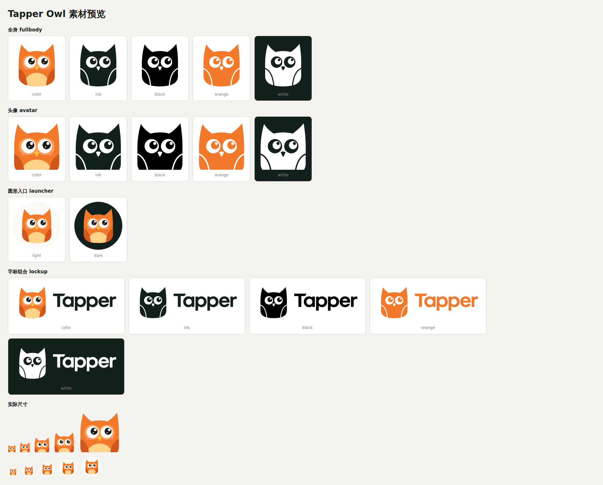

# Tapper Owl 素材包

日期：2026-09-28 · 版本：1.0

以已选定的简洁猫头鹰 v2（亮色版）为基准：正面圆身、耳羽、浅橙脸盘、右上看的大眼睛与腮红，去掉耳机。内含 **17 个 SVG、96 个 PNG**，以及预览和文件清单；不包含新的动作或表情设计。

## 素材与尺寸

| 类型                    | SVG 配色                             | PNG 尺寸                               | 用途                             |
| ----------------------- | ------------------------------------ | -------------------------------------- | -------------------------------- |
| `fullbody` 全身         | color / ink / black / orange / white | 256、512、1024、2048 px                | 品牌展示、介绍页、较大的角色插图 |
| `avatar` 头像           | color / ink / black / orange / white | 24、32、48、64、128、256、512、1024 px | 助手头像、页面中的图标入口       |
| `launcher` 圆形入口     | light / dark                         | 32、40、48、56、64、128、256、512 px   | 右下角悬浮入口及带底色的助手按钮 |
| `lockup` 图标与字标组合 | color / ink / black / orange / white | 宽 256、512、1024、2048 px             | 品牌标题、文档封面、完整标识     |

前三类 PNG 为正方形；组合版按宽度等比导出（1860:700），高度取整。SVG 可自由缩放。组合版直接复用现有 Tapper wordmark 的路径。

## 常用文件

- [全身彩色 SVG](svg/fullbody/tapper-owl-fullbody-color.svg) · [1024 px PNG](png/fullbody/tapper-owl-fullbody-color-1024.png)
- [头像彩色 SVG](svg/avatar/tapper-owl-avatar-color.svg) · [256 px PNG](png/avatar/tapper-owl-avatar-color-256.png)
- [浅色圆形入口 SVG](svg/launcher/tapper-owl-launcher-light.svg) · [56 px PNG](png/launcher/tapper-owl-launcher-light-56.png)
- [深色圆形入口 SVG](svg/launcher/tapper-owl-launcher-dark.svg) · [56 px PNG](png/launcher/tapper-owl-launcher-dark-56.png)
- [彩色字标组合 SVG](svg/lockup/tapper-owl-lockup-color.svg) · [1024 px 宽 PNG](png/lockup/tapper-owl-lockup-color-1024w.png)

## 配色与透明背景

| 名称     | 定义                                                                                                                   |
| -------- | ---------------------------------------------------------------------------------------------------------------------- |
| `color`  | 身体 `#F2782A`、翅膀 `#D2561A`、脸盘 `#FF9D52`、肚子 `#FFD28A`、嘴 `#FFC23D`、腮红 `#FF8C86`、瞳孔 `#1E1B18`；外部透明 |
| `ink`    | 墨色 `#14201D` 单色；眼白、高光、嘴和翅膀边线镂空                                                                      |
| `black`  | 纯黑 `#000000`；细节镂空                                                                                               |
| `orange` | 橙色 `#F2782A` 单色；细节镂空                                                                                          |
| `white`  | 纯白 `#FFFFFF`；细节镂空，适合深色底                                                                                   |
| `light`  | 暖白 `#FAF9F6` 圆底和彩色猫头鹰；圆形以外透明                                                                          |
| `dark`   | 墨色 `#14201D` 圆底和彩色猫头鹰；圆形以外透明                                                                          |

所有 PNG 均带真实 alpha 通道，没有烘焙的白色方底或棋盘格。圆形入口自身的圆底有意保留为实色。

## 使用建议

- 页面悬浮入口优先使用 `launcher-light` 或 `launcher-dark`，建议显示尺寸 48–64 px；56 px 可作为起点。
- 头像为全身的上部裁切，底部平直；24–32 px 时腮红和小高光会弱化，但眼睛仍可辨认。
- 彩色、墨色和橙色版适合浅色背景；深色背景使用 `white` 或圆形入口。
- 网页优先使用 SVG。使用 PNG 时选择不小于实际像素需求的尺寸，例如 56 CSS px 的 2× 屏幕可使用 128 px 文件等比显示。
- 调整整体尺寸时保持宽高比例，避免单独拉伸眼睛、嘴或字标。

## 制作与验收

SVG 为手写的平面矢量路径，没有内嵌 PNG、外链、字体依赖或脚本。PNG 由无头 Chromium 直接从对应 SVG 栅格化导出。

已逐文件检查 PNG 尺寸、alpha 通道、四角透明度和校验值，并目视检查总览及头像 24–64 px、圆形入口 32–128 px 的实际尺寸效果。未进行用户测试。2026-09-28 起已接入产品原型（导航栏头像、悬浮助手面板与右下角入口）。

- [浏览器预览与实际尺寸](preview.html)
- [素材清单与 SHA-256](manifest.json)
- [文件验证结果](validation.json)
