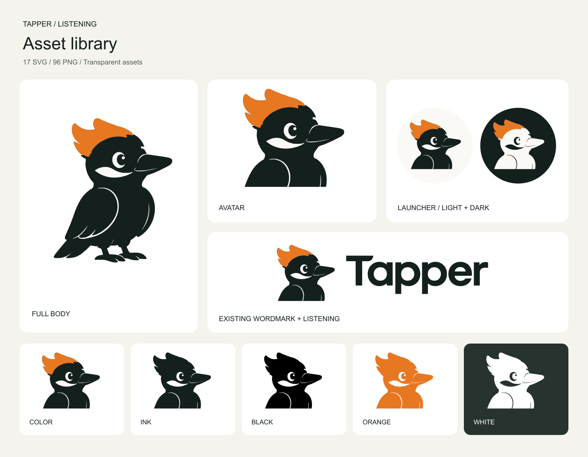

# Tapper Listening 素材包

日期：2026-09-06 · 版本：1.0

以已选定的 Listening 啄木鸟为基准，保留右向侧脸、单眼、橙冠、白颊与倾听站姿。内含 **17 个 SVG、96 个 PNG**，以及预览和文件清单；不包含新的动作或表情设计。

## 素材与尺寸

| 类型 | SVG 配色 | PNG 尺寸 | 用途 |
| --- | --- | --- | --- |
| `fullbody` 全身 | color / ink / black / orange / white | 256、512、1024、2048 px | 品牌展示、介绍页、较大的角色插图 |
| `avatar` 头像 | color / ink / black / orange / white | 24、32、48、64、128、256、512、1024 px | 助手头像、页面中的图标入口 |
| `launcher` 圆形入口 | light / dark | 32、40、48、56、64、128、256、512 px | 右下角悬浮入口及带底色的助手按钮 |
| `lockup` 图标与字标组合 | color / ink / black / orange / white | 宽 256、512、1024、2048 px | 品牌标题、文档封面、完整标识 |

前三类 PNG 为正方形；组合版按宽度等比导出，高度取整。SVG 可自由缩放。组合版直接复用现有 Tapper wordmark 的路径。

## 常用文件

- [全身彩色 SVG](svg/fullbody/tapper-listening-fullbody-color.svg) · [1024 px PNG](png/fullbody/tapper-listening-fullbody-color-1024.png)
- [头像彩色 SVG](svg/avatar/tapper-listening-avatar-color.svg) · [256 px PNG](png/avatar/tapper-listening-avatar-color-256.png)
- [浅色圆形入口 SVG](svg/launcher/tapper-listening-launcher-light.svg) · [56 px PNG](png/launcher/tapper-listening-launcher-light-56.png)
- [深色圆形入口 SVG](svg/launcher/tapper-listening-launcher-dark.svg) · [56 px PNG](png/launcher/tapper-listening-launcher-dark-56.png)
- [彩色字标组合 SVG](svg/lockup/tapper-listening-lockup-color.svg) · [1024 px 宽 PNG](png/lockup/tapper-listening-lockup-color-1024w.png)

## 配色与透明背景

| 名称 | 定义 |
| --- | --- |
| `color` | 墨色身体 `#14201D`、橙冠 `#E87722`、暖白细节 `#FAF9F6`；外部透明 |
| `ink` | 墨色单色；眼睛、白颊和线条镂空 |
| `black` | 纯黑 `#000000`；细节镂空 |
| `orange` | 橙色单色；细节镂空 |
| `white` | 纯白 `#FFFFFF`；细节镂空，适合深色底 |
| `light` | 暖白圆底和彩色头像；圆形以外透明 |
| `dark` | 墨色圆底、暖白身体、橙冠和墨色细节；圆形以外透明 |

所有 PNG 均带真实 alpha 通道，没有烘焙的白色方底或棋盘格。彩色版的眼睛与白颊保留实色。圆形入口自身的圆底有意保留为实色。

## 使用建议

- 页面悬浮入口优先使用 `launcher-light` 或 `launcher-dark`，建议显示尺寸 48–64 px；56 px 可作为起点。
- 独立头像建议显示在 48 px 或以上。24–32 px 文件用于受限空间，眼神和细线会减少；较大的品牌展示使用全身版。
- 彩色和墨色版适合浅色背景；深色背景使用 `white` 或圆形入口，避免墨色身体融入背景。
- 直接使用圆形入口文件，避免对全身版再次做圆形裁切而截断尾巴、冠尖或喙。
- 网页优先使用 SVG。使用 PNG 时选择不小于实际像素需求的尺寸，例如 56 CSS px 的 2× 屏幕可使用 128 px 文件等比显示。
- 调整整体尺寸时保持宽高比例，避免单独拉伸眼睛、喙或字标。

## 制作与验收

本包由 Listening 概念图进行轮廓转绘、曲线平滑与三色归一。SVG 使用独立可编辑的路径，头像使用矢量裁切；没有内嵌 PNG、外链、字体依赖或脚本。PNG 直接从对应 SVG 栅格化导出。

已逐文件检查 SVG 解析与渲染、PNG 尺寸、alpha 透明度和校验值，并目视检查总览及头像 24–128 px、圆形入口 32–64 px 的实际尺寸效果。未进行用户测试。

- [浏览器预览与实际尺寸](preview.html)
- [素材清单与 SHA-256](manifest.json)
- [文件验证结果](validation.json)
