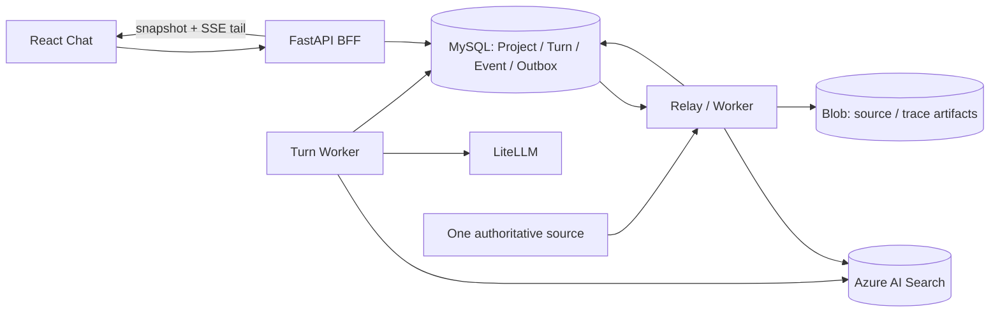

# TAP 平台整体架构评审

| 字段 | 结论 |
| --- | --- |
| 评审对象 | Architecture Baseline v0.3 及 Phase 1/1.5/2+ 配套设计 |
| 评审日期 | 2026-08-21 |
| 评审结论 | **有条件通过（Conditional Go）** |
| 可启动范围 | Phase 1 的评测契约、单租户纵向切片与技术 Spike |
| 暂不批准 | 多租户生产上线、Phase 1.5 Agent 写入链路、Phase 2+ 执行与远端 Git 发布 |

## 1. 执行摘要

TAP 的总体方向正确：以 Test IR 隔离自然语言与具体执行框架，以 Git 保存可审查资产，以 MySQL 保存运行事实，以统一 Evidence 连接执行、RCA 与审批；Knowledge Plane、Agent Runtime 和 Execution Provider 之间也有清晰的可替换端口。RAG 先行、模块化控制面配独立 Worker、确定性门禁优先等决策，能显著降低首期交付风险。

当前基线的主要问题不是“缺少更多组件”，而是**关键治理输入尚未冻结，但目标图和契约已经展开到 Phase 5**。身份与授权权威源、数据分类与区域、SLO/RPO/RTO、真实语料、Azure AI Search 容量、Test IR v1 和审批责任等仍未确定。这些输入直接影响数据模型、索引字段、缓存键、事件分区、部署区域和验收设计；如果先实现再补决策，返工风险高。

因此建议：

1. 仅批准 Phase 1 的“walking skeleton”：一个真实 Project、一种文档源、一个索引 family、BM25 baseline、完整 ACL/引用/删除链路和最小 Chat。
2. 把权限、数据治理、可靠性和评测四类决策设为进入多租户 Beta 的硬门禁。
3. Phase 1.5、Test IR、Execution 和 Commit Service 保留契约占位，不进入当前迭代的部署或基础设施范围。
4. 用可执行的 ADR、Schema、威胁模型和故障演练替代继续扩充总体架构图。

## 2. 评分卡

| 维度 | 评分 | 评语 |
| --- | ---: | --- |
| 业务与技术边界 | 4/5 | 阶段边界清晰，但首批用户、业务 Owner 与量化退出门槛未定。 |
| 模块化与可演进性 | 4/5 | 模块化单体 + 独立 Worker 合理；Phase 2+ 组件不应提前物理拆分。 |
| 数据架构 | 4/5 | Git/MySQL/Search/Blob/Redis 职责清楚；缺少逻辑 ERD、保留与恢复矩阵。 |
| 契约与一致性 | 4/5 | 幂等、Outbox、不可变 revision、事件 envelope 较完整；事件分区与投影恢复仍需 Spike。 |
| 安全与多租户 | 3/5 | fail-closed 与 PEP 思路正确；授权权威源、Blob/Redis 隔离和威胁模型尚未落地。 |
| 可靠性与运维 | 3/5 | 已描述背压、重试、对账与观测；没有批准的 SLO、RPO/RTO 和恢复 Runbook。 |
| 性能与成本 | 3/5 | 压测维度合理；真实工作负载、下游配额和单位经济模型缺失。 |
| 可交付性 | 3/5 | 路线图完整，但 Phase 1 本身仍包含过多同时变量，应进一步切薄。 |

## 3. 主要优点

### 3.1 稳定领域核心，而非绑定供应商对象

- Test IR、Run/Task/Attempt、Evidence Manifest、Citation 和 Provider Port 构成平台自有契约，避免把 BrowserStack、Agent SDK 或具体测试框架对象泄漏到公共 API。
- Test IR revision 固定到 Git commit 与内容哈希；Run 创建后冻结，重试通过新 Attempt 表达，适合审计、回放和幂等处理。
- Agent 只产生候选 Artifact，确定性 Validator、Quality Gate、Approval 和 Commit Service 持有正式写入权，信任边界合理。

### 3.2 存储职责与异步一致性方向正确

- Git、MySQL、Azure AI Search、Blob、Redis 和 Key Vault 各自承担版本源、运行事实、派生索引、大对象、短状态和秘密管理，避免多主写入。
- MySQL 事务内写领域状态与 Outbox，Redis 只承担可重建分发/租约；这比把 Redis 当事实来源更利于故障恢复。
- Retrieval/Citation 在读取旧答案、Trace 和 Artifact 时重新授权，避免把历史授权结果当永久能力票据。

### 3.3 交付顺序总体合理

- Phase 1 Chat/RAG 不依赖 Agent、Test IR 或 Grid，可以独立验收。
- Phase 1.5 是可拔掉的旁路，Phase 2 才引入 Test IR 和执行闭环，避免 Agent 成为基础检索链路的单点依赖。
- FastAPI 在线 I/O、CPU/长任务 Worker、一次 Attempt 一隔离环境的运行角色划分符合负载特征，不需要在实现前拆成大量微服务。

## 4. 关键发现与整改建议

### P0-1：授权模型尚未形成可实现的唯一事实源

**现状**：设计要求 Entra 仅作为身份起点，Project Policy 负责授权，并在 Retrieval、Citation、Tool、Artifact、Execution 和 Commit 等多个 PEP 重新授权；但 Membership、RoleBinding、EnvironmentPolicy、Entra group 同步、服务主体和职责分离仍是待设计项。

**风险**：若先实现索引、缓存和 Trace，再确定授权模型，`tenantId/projectId/group/classification/environment` 的含义与生命周期可能变化，造成越权、撤权传播不完整或大规模重建。

**进入多租户开发前必须完成**：

1. 输出 Project/Membership/RoleBinding/Classification 的逻辑模型和授权矩阵。
2. 明确 Entra group 同步方向、延迟、失败模式、删除语义与 break-glass 流程。
3. 定义 `PolicyDecision` 的输入、版本、TTL、ACL digest 算法和 fail-closed 行为。
4. 用跨 tenant、撤权、parent expansion、facet/count、cache、旧 Citation/Trace 和 Blob URL 建立负向测试集。

### P0-2：数据治理与恢复目标未冻结

**现状**：架构要求数据分级、脱敏、区域 allowlist、Blob 生命周期、法律保留、Private Endpoint 和多租户隔离，但禁止入模/入索引字段、保留周期、数据区域、PaaS 产品 SLA、RPO/RTO 仍待确认。

**风险**：这些不是部署后补充的运维参数，而会决定索引内容、模型路由、备份拓扑、加密边界、日志字段和删除 SLA。缺失时无法证明“删除完成”“撤权无泄漏”或“灾难后可恢复”。

**进入真实数据摄取前必须完成**：

- 建立按数据类别 × 存储 × 模型 Provider 的处理矩阵，明确允许字段、区域、保留、加密、备份和删除责任人。
- 定义 Git/MySQL/Search/Blob/Redis 的 SoR、备份、恢复顺序、RPO/RTO、重建来源和对账证据。
- 为 Search alias 切换、全量 rebuild、MySQL point-in-time restore、Blob 不可用和 Key Vault 不可用编写 Runbook 并演练。

### P0-3：Phase 1 缺少经批准的真实评测输入

**现状**：文档已经定义四索引、混合检索、RRF/rerank、多跳、引用和首轮建议指标，但真实语料、Owner、语言、更新频率、Golden Dataset 标注流程、模型与 Search SKU 尚未确定。

**风险**：在没有 baseline 的情况下并行引入 vector、semantic rerank、跨索引融合和多跳，无法定位收益来源，且容易用复杂度掩盖数据与切片质量问题。

**整改顺序**：

1. 选择一个高价值 Project 与一种文档 family，冻结 50–100 个问题及 ACL negative probes。
2. 先交付 BM25-only + 引用 + 删除/撤权闭环并记录质量、p95、成本。
3. 按 `vector → hybrid/RRF → rerank → parent expansion → cross-index` 一次增加一个变量。
4. 只有实验显著改善预先定义的指标时，才提升为默认 RetrievalProfile。

### P1-1：Phase 1 范围仍偏大，存在“平台先于产品”风险

**现状**：首期同时包含四种 typed parser、四索引、增量与重建、混合检索、rerank、多跳、完整 Chat、流恢复、反馈、Inspector、安全、容量、故障注入和生产运维。

**建议**：将 Phase 1 拆为三个可验收纵向切片：

- **P1-A Walking Skeleton**：单 Project、doc family、BM25、同步或单 Worker ingestion、answer/citation、最小 ACL 与删除。
- **P1-B Retrieval Quality**：vector/hybrid/rerank、第二类语料、Golden Dataset、Trace Inspector。
- **P1-C Production Hardening**：四索引、Outbox/lease/reconcile、SSE 恢复、容量、DR、安全演练。

每个切片都必须端到端可演示，禁止先分别建设“完整索引平台”“完整 Chat 平台”和“完整 Worker 平台”再集成。

### P1-2：事件顺序与恢复语义需要实现级验证

**现状**：设计同时使用 aggregate 内单调 sequence、Run sequence、REST snapshot + SSE tail、至少一次分发和多 Worker。方向正确，但尚未说明 sequence 分配热点、事务边界、并发写冲突、投影 checkpoint 和事件清理策略。

**建议**：在技术 Spike 中证明：

- 同一 aggregate 并发写入使用乐观版本或锁，冲突可重试且不重复副作用。
- snapshot 的 `lastSequence` 与 SSE cursor 在同一一致性边界生成，不丢事件、不永久重复。
- Outbox relay 崩溃、Redis 重投、Worker lease 过期和 poison message 都可通过 inbox/idempotency ledger 收敛。
- domain event、SSE projection 和审计记录有不同 schema/保留策略，不能复用一张无限增长的表。

### P1-3：成本与容量模型不足以支持技术选型

**现状**：已有并发压测建议，但没有 corpus chunk 数、每日 revision、embedding token、Search partition/replica、LLM token、SSE 活跃率和证据存储增长假设。

**建议**：建立每 Project/每 1,000 次问答的单位经济表，至少包含 ingestion、Search、embedding、rerank、generation、Blob、日志和出站流量；同时为 Quick/Deep 设置 fan-out、token、deadline 和降级预算。容量评审应基于峰值 active turns 与下游 quota，而不是 DAU。

### P1-4：Phase 2+ 的契约应保留，但不应提前固化实现

**现状**：Test IR、Agent Runtime、Execution、Device Farm、BrowserStack、GitHub App 和 Commit Service 已有丰富设计，而 Test IR v1 编译器优先级、仓库模式、审批策略与设备拓扑尚未确认。

**建议**：当前仅冻结跨阶段不变量（stable ID、immutable revision、candidate-only、Evidence hash、Provider Port）；具体 action vocabulary、编排框架、设备调度和 Git 流程通过 Phase 2 ADR 决定。避免为未来状态预建 namespace、数据库表、队列和服务。

## 5. 建议的 Phase 1 最小目标架构

部署上可以使用同一 Python 代码库的 `api-sse`、`turn-worker`、`ingestion-worker`、`relay-reconciler` 四种角色；embedding 与 index writer 在吞吐证明需要前可先作为 ingestion role 内的独立队列处理器。逻辑模块边界保留，但不为每个框创建 Deployment。Redis 仅在多副本分发、租约或 live fanout 的压测证明需要后加入关键链路；MySQL 仍是可恢复事实源。

## 6. 决策门禁

### Gate A：允许开始 Walking Skeleton

- 已确定产品 Owner、一个试点团队和一个真实 Project。
- 已批准一种语料的数据 Owner、分类、区域、模型可见性与删除规则。
- 已冻结最小 Project/Role/ACL 模型和 50–100 个 Golden Questions。
- 已选 Azure AI Search SKU/区域与一个 Embedding/Generation route，并设置成本上限。

### Gate B：允许多租户 Beta

- P0-1/P0-2 全部整改完成；ACL negative probes 的 unauthorized retrieval/answer 为 0。
- Outbox、幂等、撤权、删除、重建、断线恢复和依赖故障演练通过。
- SLO、RPO/RTO、告警、值班 Owner 和 Runbook 已批准。
- 单位成本与容量压测在预算和下游 quota 内。

### Gate C：允许 Phase 1.5 Agent POC

- Phase 1 Retrieval/Citation/ACL Contract 已冻结，关闭 Agent 后全套回归通过。
- runtime 认证、模型区域、预算、sandbox、network surface 和 Artifact 审批责任人已批准。
- Agent 只能访问固定 snapshot 和 TAP 窄工具；无 Search/MySQL/Blob/Key Vault/Git 直接凭据。

### Gate D：允许 Phase 2 执行闭环

- Test IR v1、首个编译目标、Git repository mode、stable ID/rename 和 migration ADR 已批准。
- Evidence Manifest、脱敏、保留和审批/发布职责已冻结。
- 首个 Runner 的网络、隔离、凭据、取消、重试与 orphan reconciliation 通过威胁建模和故障演练。

## 7. 评审结论

**Conditional Go**：架构基线可以作为方向性蓝图，Phase 1 可启动评测契约和单租户 walking skeleton；不得把当前文档状态解释为多租户生产设计已获批准。下一阶段最高价值工作不是新增 Agent、索引或执行组件，而是关闭三项 P0：授权唯一事实源、数据治理/恢复目标、真实评测输入。完成 Gate A 后再实施，完成 Gate B 后才进入生产级多租户验证。
