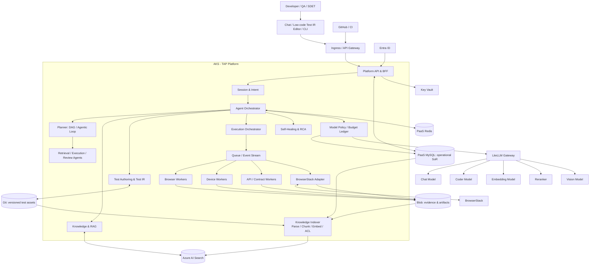
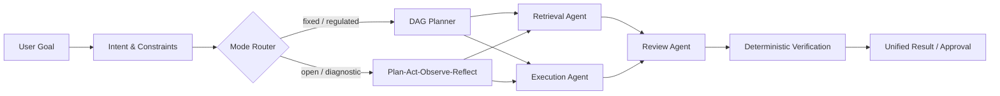
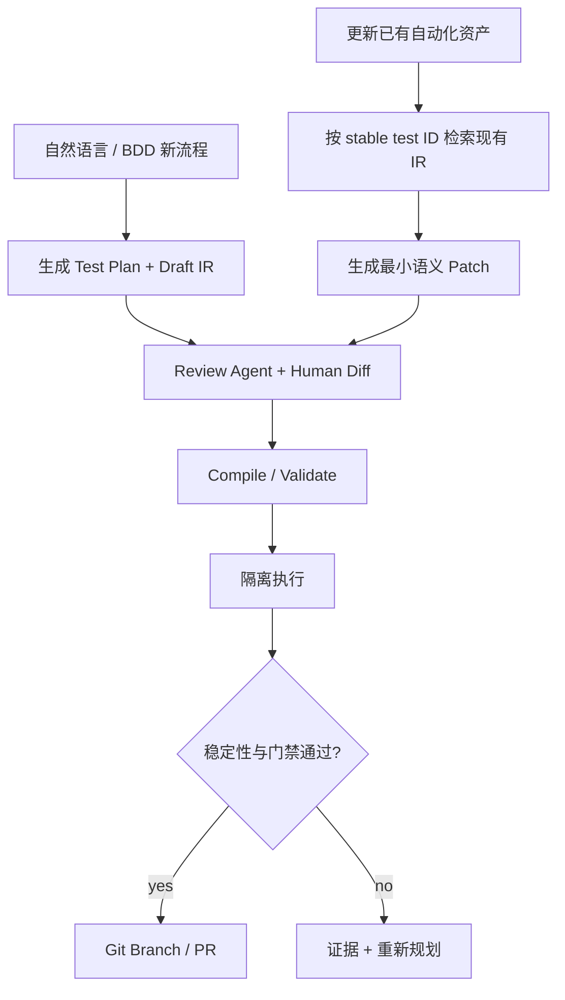
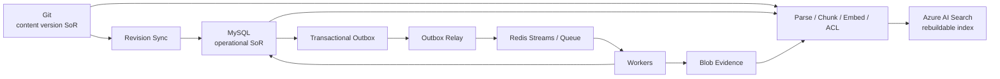
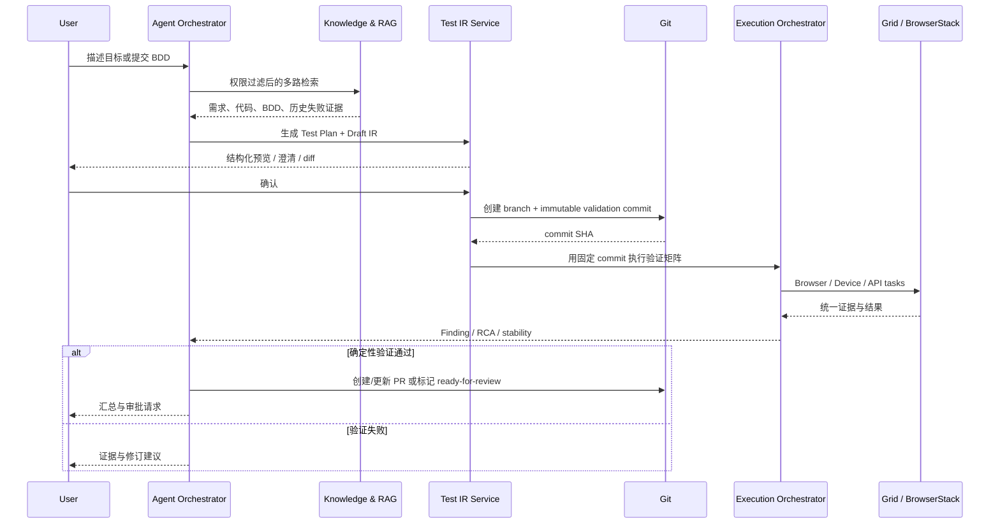

# TAP 总体技术架构

| 字段 | 值 |
| --- | --- |
| 文档状态 | Architecture Baseline v0.1，待正式评审 |
| 更新时间 | 2026-08-20 |
| 核心主线 | Test IR + Git 版本化 + 统一执行证据 |
| 部署基线 | AKS + PaaS MySQL + PaaS Redis + Azure AI Search + Blob Storage + Key Vault + LiteLLM |
| 证据边界 | 已恢复 `engprod` 三条讨论；长回复存在源端截断，详见 [来源说明](source-notes.md) |

## 1. 产品定位

TAP（Test Automation Platform）是融合 Agent 能力的自动化测试平台。它把三类产品体验组合在同一条可审计链路中：

- **Manus 式自然语言交互**：用户描述目标，主 Agent 理解意图、规划、调度子 Agent 并汇总结果。
- **BrowserStack 式测试资产管理**：低门槛管理测试流程、设备/浏览器矩阵、运行和证据。
- **Git 式可审查可编辑代码**：BDD、Test IR、脚本、Locator、Fixture、Hook 和数据模板都有版本、diff、review 与回滚。

平台既支持“从自然语言/BDD 新建流程”，也支持“定位已有资产并提交小范围修改”。二者不能混成一次无边界的代码生成。

## 2. 目标与约束

### 目标

- 自然语言或 BDD → Test Plan → Test IR → 可执行资产 → 证据 → RCA/自愈建议 → 报告/审批。
- 对 Web、移动端与 API/Contract 测试提供统一的计划、运行、证据和质量结论。
- 内网环境不依赖外部 BrowserStack 或托管 Agent；外部矩阵测试仍可利用 BrowserStack。
- 让模型、Agent 框架、执行 Provider 和检索实现都可替换。
- 每次生成、修改、执行和自愈都能追溯到用户、Git revision、模型、提示、工具、策略和证据。

### 非目标

- Agent 输出不直接成为发布硬门禁。
- Azure AI Search、Redis 和 Blob 都不是业务主记录数据库。
- 不直接 fork DeepSeek Harness 作为平台核心；其设计可借鉴，也可通过适配器试用。
- MVP 不做通用工作流产品、多云调度平台或完整设备云商业化能力。

## 3. 总体架构



### 架构分层

| 层 | 组件 | 责任 |
| --- | --- | --- |
| 体验与接入 | Chat/Low-code Editor/CLI、GitHub App、Ingress/API Gateway、Entra ID、Platform API/BFF | 自然语言、结构化编辑、认证、审批、Webhook、Check 回写 |
| Agent 控制面 | Session/Intent、Agent Orchestrator、DAG/Loop Planner、子 Agent | 理解目标、编排任务、控制上下文与权限、汇总结果 |
| 测试控制面 | Test Authoring、Test IR、Execution Orchestrator、Self-Healing/RCA | 资产生命周期、编译、调度、结果归一化、修复建议 |
| 知识面 | Ingestion、Chunking、Hybrid Retrieval、Dependency Graph | 文档/代码/BDD/失败知识的权限感知检索 |
| 模型面 | LiteLLM Gateway + TAP Model Policy | 多模型协议/路由与 TAP 自有策略、预算账本、审计分离 |
| 执行面 | Browser Grid、Device Grid、API/Contract Runner、BrowserStack | 隔离执行、矩阵调度、证据采集 |
| 数据面 | MySQL、Redis、AI Search、Blob、Git、Key Vault | 主记录、短状态、索引、对象、版本、秘密各司其职 |

## 4. Agent Orchestrator

### 4.1 双模式编排

主 Agent/Orchestrator 支持两种执行语义：

| 模式 | 适用场景 | 特征 |
| --- | --- | --- |
| 固定 DAG | 回归测试、发布门禁、标准化新建/更新流程 | 步骤、输入输出和失败策略确定，便于审计与重放 |
| Agentic Loop | 探索性测试、复杂失败归因、开放目标 | `Plan → Act → Observe → Reflect → Re-plan`，在预算与权限内动态调整 |

Loop 不能绕开平台状态机。每个动态动作仍要落为有类型的 Task/Attempt，并受 deadline、token、费用、工具和网络策略约束。开放探索得出的方案最终进入 Review Agent 或人工审批，再转入确定性 DAG 验证。



### 4.2 十大能力

1. **会话管理**：多轮 Session、状态持久化、消息队列和并发隔离。
2. **意图识别**：区分新建、更新、执行、诊断、查询与管理操作。
3. **执行规划**：选择 DAG 或 Loop，构建依赖、预算、完成条件，并在观察后受控重规划。
4. **Agent 调度**：子 Agent 注册、优先级、负载、串并行、取消和统一汇总。
5. **上下文管理**：最小装载、压缩、滑动窗口和跨 Agent 受控共享。
6. **服务发现**：查询子 Agent/模型/工具/Provider 的能力、版本与健康状态。
7. **错误控制**：超时、重试、补偿、降级、熔断、异常上抛、断点恢复和人工接管。
8. **数据流管理**：类型化 I/O、流式传递、ArtifactRef、lineage 和可复用缓存。
9. **权限控制**：RBAC、租户/项目范围、工具白名单、审批、短期凭证与敏感数据脱敏。
10. **记忆管理**：短期/长期记忆分离，支持权限感知向量检索与淘汰；长期知识必须可重建或有来源。

### 4.3 Agent Runtime 边界

Agentic Test Lab 可用 LangGraph + FastAPI 作为实验基线，企业阶段的 Agent Runtime 尚未正式选型；DeepSeek Harness 作为参考实现或可选 Runtime 适配器验证。TAP 自有端口不暴露任何框架内部对象，完整签名以 [AgentRuntime 契约](contracts.md#agentruntime) 为准。

若接入 DeepSeek Harness：固定版本、独立进程/sidecar、契约测试、feature flag；Harness session 只是外部引用。Harness 的插件/事件设计可复用思想，但文件、进程和网络隔离仍由 TAP Worker/容器策略负责。

## 5. Test Authoring 与 Test IR

### 5.1 为什么需要 Test IR

Test IR 是自然语言、BDD、低代码编辑器、执行脚本和运行证据之间的稳定中间表示。它解决：

- 同一意图编译为 Selenium/Playwright/Appium/API Runner 等不同目标。
- UI 层可以结构化编辑而不直接拼接任意脚本。
- Agent 修改可以形成语义 diff，而不是整文件重写。
- 测试资产有稳定 ID，文件移动或重命名不会切断历史。
- 自愈建议能精确指向 Locator/Step/Assertion，并经过回归验证。

### 5.2 Test IR 内容

```yaml
apiVersion: tap.dev/v1alpha1
kind: TestCase
metadata:
  id: test_checkout_happy_path
  projectId: commerce-web
spec:
  intent: "已登录用户使用信用卡完成结账"
  tags: [checkout, p0]
  preconditions:
    fixtures: [user_with_cart]
  steps:
    - id: open_checkout
      action: navigate
      target: { route: /checkout }
    - id: submit_payment
      action: click
      target: { locatorRef: checkout.submit }
  assertions:
    - type: url_matches
      value: /orders/*
  matrix:
    browsers: [chrome, safari]
  evidencePolicy:
    screenshot: on_failure
    trace: retain_on_failure
```

真实 Schema 需继续定义 typed action、secret/data reference、retry semantics、capability requirements 与版本迁移；禁止把任意 Shell 片段当通用 action。

### 5.3 新建与更新两条路径



- **新建**：先形成 Test Plan 和 Draft IR，再生成执行资产。
- **更新**：先解析稳定 Test ID 与现有 revision，只允许最小 patch；不得默认重生成整套脚本。
- 两条路径都必须经过 Schema 校验、编译、隔离执行、Review 和 Git diff。

## 6. 执行面

### 6.1 执行 Provider

| Provider | 使用范围 | 位置 |
| --- | --- | --- |
| Self-hosted Browser Grid | 内网 Web、低延迟回归、可控数据环境 | Selenium Grid 4 + Docker 起步；AKS/KEDA 扩展 |
| Self-hosted Device Grid | 内网移动端、专用实体设备 | Appium Device Farm；设备主机通过受控 Agent 接入 |
| API / Contract Runner | API、Schema、契约与集成验证 | Ephemeral Worker |
| BrowserStack Adapter | 外部浏览器/设备矩阵、供应商能力与弹性溢出 | BrowserStack Cloud + 按 Run 隔离的 Local Tunnel |

所有 Provider 实现同一个 `ExecutionProvider` 契约；BrowserStack project/build/session 只作为外部引用，不能成为 TAP 的领域 ID。

### 6.2 统一执行证据

每次 Attempt 都生成 Manifest：

- 源代码 commit、Test IR revision、编译器/Runner 镜像、环境与 matrix。
- 模型、prompt、工具、Agent Runtime 与策略版本（若包含 Agent）。
- step log、assertion、trace、screenshot、video、HAR、device log、API payload 摘要。
- Provider 原始 ID、开始/结束时间、重试关系、退出原因和资源费用。
- Artifact content hash、Blob URI、数据分级、保留期限和脱敏状态。

确定性结果与 Agent 诊断分别存储。Agent 可引用证据并生成 Finding，不能回写或覆盖原始证据。

### 6.3 自愈与 RCA

- Healenium 可作为 Locator 候选生成器，但不能自动改写 Git 主分支。
- Self-Healing 根据旧 Locator、DOM/视觉证据和历史成功样本生成候选 patch。
- RCA 聚合日志、trace、HAR、代码/BDD 变更和历史失败，输出原因、置信度与 evidence refs。
- 所有修复先在隔离矩阵重复验证；通过后形成 Git PR 和审批记录。

## 7. Knowledge & RAG

### 7.1 四类知识、四个索引

Azure AI Search 是最终企业选型。首期使用四个独立索引，避免不同类型数据共用错误的切分与排序策略：

| 索引 | 内容 | 主要检索方式 |
| --- | --- | --- |
| `kb-doc-v1` | 需求、设计、规范、手册 | Document Summary/Section Summary/Leaf Chunk、BM25 + Vector + semantic rerank |
| `kb-code-v1` | 代码、symbol、AST、调用/依赖关系 | Symbol/AST chunk、BM25 + Vector + graph expansion |
| `kb-bdd-v1` | Feature、Scenario、Step、Test IR 映射 | 结构化字段 + hybrid retrieval |
| `kb-failure-v1` | 失败指纹、证据摘要、RCA、修复与结果 | fingerprint/结构化过滤 + hybrid retrieval |

每个索引都必须包含并强制过滤：`tenantId`、`projectId`、`allowedGroupIds`、`classification`、`environment`。权限过滤在检索查询执行，不能只在生成答案后过滤。

### 7.2 Ingestion 与检索

- 结构化切片优先，固定 token 窗口只作为无结构内容的兜底。
- 文档采用 Document Summary → Section Summary → Leaf Chunk 多粒度索引；Child 精确召回后回填 Parent。
- 代码保持原语言，不转 Markdown；按 symbol/AST/语义边界切片并保存路径、语言、commit、symbol、引用关系。
- BDD 按 Feature/Scenario/Step 与 stable Test ID 切片。
- OpenAPI/AsyncAPI 按 Endpoint/Operation 切片；失败记录按 Incident 切片并携带 fingerprint、Test ID、环境、revision、证据和修复结果。
- 使用 BM25、Vector、AST/Symbol 和轻量代码—测试依赖图多路召回，经 RRF 融合后由 reranker 排序。
- 跨章节问题先拆为子问题并执行多跳检索；Context Enhancer 只补充必要 parent、邻接 symbol、相关 Test IR 与最新失败，防止上下文膨胀。

AI Search 是可重建投影。原文与大文件来自 Git/Blob，结构化运行事实来自 MySQL。

## 8. 数据与存储职责



| 存储 | 权威内容 | 禁止用途 |
| --- | --- | --- |
| PaaS MySQL | 项目、权限、Test IR catalog/projection、版本映射、Run/Attempt、RCA、自愈、审批、审计、Outbox | 大日志、视频、短期锁 |
| Git | BDD、Test IR 文件、脚本、Locator、Fixture、Hook、测试数据模板的版本源 | 运行状态、队列、秘密 |
| Azure AI Search | 文档/代码/BDD/失败的可重建 hybrid index | 主数据或权限 SoR |
| PaaS Redis | session、任务流、短锁、限流、短缓存、semantic/Embedding 缓存、Worker heartbeat | 唯一审计记录或长期事实 |
| Blob Storage | 文档原件、App 包、trace、视频、截图、HAR、日志、非权威候选 patch | 高频事务状态；候选 patch 的最终版本必须进入 Git |
| Key Vault | 模型、Git、数据库、执行 Provider 的 API key/证书及轮换 | 把明文秘密复制进 RunSpec |

### Git 与 MySQL 的一致性

- Git 是测试内容 revision 的权威源；MySQL 是目录、权限、流程和运行事实的权威源。
- 所有运行引用不可变 Git commit；MySQL 保存 `asset_id + git_commit + content_hash`。
- 内容编辑先通过 branch + immutable commit 或受控 Commit Service 完成；验证通过后再创建/更新 PR，由 Sync Worker 更新 MySQL projection 与索引。
- 不做无约束双写。写 Git 成功而投影失败时由 Reconciler 重放；索引随时可从 Git/Blob/MySQL 重建。

## 9. 模型层与 LiteLLM

LiteLLM 以无状态/配置驱动的 Gateway 方式部署，负责模型协议与供应商路由；TAP Model Policy 在 MySQL 中掌握租户策略、预算账本和审计，避免为了启用 LiteLLM 内建管理功能而悄然引入未选定的 PostgreSQL。职责如下：

- 按任务路由 Chat、Coder、Embedding、Reranker、Vision 模型。
- LiteLLM 执行协议归一化、provider routing、超时、重试和 fallback。
- TAP 执行 Tenant/Project allowlist、数据区域、token/费用预算、并发配额、prompt/model version 记录与脱敏审计。
- 本地阶段可用 Ollama；并发与吞吐增长后迁移 vLLM；上层 Agent 不改契约。

Embedding 的向量维度、索引 Schema 与模型版本必须绑定；升级时新建索引版本并后台重建，不能原地混用不同向量空间。Reranker 单独版本化模型、输入格式与评分策略，不与向量维度绑定。

若需要 LiteLLM Virtual Keys、Admin UI、精细 spend tracking 等依赖其持久化后端的功能，必须先验证其与已选 MySQL/Redis 的兼容性；验证前不把这些内建功能列为 MVP 依赖，也不额外引入 PostgreSQL。

## 10. 关键流程

### 10.1 自然语言创建测试



### 10.2 更新已有资产

1. Intent Router 识别为 `update_existing_test`，要求 stable Test ID 或通过检索消歧。
2. 加载目标 revision、相关代码/BDD、最近失败和资产依赖。
3. Agent 只生成语义 patch；Review Agent 检查范围、Schema、风险和遗漏。
4. 编译后在隔离 Runner 执行受影响测试与必要回归。
5. 证据通过后创建 Git PR；需要时由人工批准 locator/self-healing 变更。

### 10.3 PR 质量反馈

GitHub Webhook 验签和幂等 → 冻结 RunSpec 与 Git revision → 变更/风险选测 → 自建或 BrowserStack 执行 → 证据归一化 → 可选 Agent RCA → 确定性 Quality Gate → GitHub Check/评论。

## 11. 可靠性

- MySQL 状态、RunEvent 与 Outbox 同事务；Redis Stream 负责分发，不承担唯一事实。
- Webhook、队列、Provider callback 都按至少一次处理，所有 Handler 使用稳定幂等键。
- Attempt 通过 lease/heartbeat 执行；Worker 丢失后由 Reconciler 查询 Git、BrowserStack、Grid 和 Blob 再决定接管。
- Provider callback 与主动轮询并存，处理重复、乱序和丢失。
- 取消先阻止新任务，再传播至 Agent/Grid/BrowserStack；未能取消的孤儿任务持续对账和清理。
- 模型、BrowserStack、自建 Grid 各自使用 bulkhead、deadline、retry budget 和 circuit breaker。
- KEDA 只根据可观测队列与资源指标扩缩 Worker；不会扩缩物理设备本身。

建议先测量基线，再审批 SLO 数值。至少分别定义：控制面可用性、Run 建立延迟、结果收敛延迟、审计完整性、RPO/RTO、Provider 降级和成本上限。

## 12. 安全与合规

| 风险 | 控制 |
| --- | --- |
| GitHub Webhook 伪造/重放 | 签名、delivery ID、时间窗、原始载荷哈希 |
| 恶意仓库/测试代码 | 临时容器或 microVM、只读镜像、无宿主挂载、资源与 egress 限制 |
| Prompt injection | 外部文本标记、最小上下文、工具能力与内容分离、不因文本提升权限 |
| 模型/工具泄密 | Key Vault + SecretRef、短期凭证、脱敏、模型/区域 allowlist |
| BrowserStack Local 横向访问 | 每 Run/环境独立 tunnel、目标 allowlist、TTL、异常清理 |
| Agent 越权 | deny-by-default、工具网关、审批、子 Agent 不扩权 |
| RAG 越权 | tenant/project/group/classification/environment 查询前过滤 |
| 视频/HAR/日志含敏感数据 | 采集前后脱敏、Blob 加密、最短保留、访问审计 |
| 自愈污染主分支 | 候选 patch、隔离验证、Git PR、人审，不自动覆盖 |
| 多租户串扰 | MySQL tenant scope、Redis key namespace、Blob container/prefix 与 KMS 边界 |

## 13. 可观测性

- OpenTelemetry 贯穿 `conversation → plan → run → task → attempt → provider/agent session`。
- Allure 作为测试报告视图；OTel trace/log/metric 负责跨组件诊断；个人实验阶段可用 Jaeger，企业环境后端可替换。
- 必要指标：队列等待、Grid 利用率、设备占用、Provider 错误、flake、RCA 采纳率、自愈验证率、Agent token/费用、Search 命中与引用率。
- 审计事件、业务事件、调试日志分开保存与设置保留策略。

## 14. AKS 部署拓扑

建议使用逻辑隔离的 namespace/node pool：

- `tap-control`：API/BFF、Authoring、Orchestrator、RCA、Indexer。
- `tap-agent-workers`：LangGraph/可选 Harness Runtime、Tool Gateway、临时工作区。
- `tap-browser-grid`：Selenium Grid Router/nodes；若采用 Playwright，使用独立 ephemeral worker pool，不混用 Selenium Grid 协议。两者分别由 KEDA/HPA 扩缩。
- `tap-device-gateway`：管理外部 Appium device hosts；物理设备不假设运行在 AKS Pod 内。
- `tap-api-workers`：API/Contract ephemeral jobs。
- `tap-observability`：OTel Collector 与组织标准观测 Agent。

网络策略默认拒绝跨 namespace 与公网出口；访问 MySQL、Redis、AI Search、Blob、Key Vault、LiteLLM 使用 workload identity/private endpoint（具体 Azure 网络实现进入部署设计）。

## 15. 演进路径

1. **RAG Foundation**：先完成 Azure AI Search 四索引、typed ingestion、权限过滤、hybrid retrieval、引用与离线评测；以 Retrieval API/Inspector 交付，不以前置 Agent 或执行网格为目标。详见 [Phase 1 专项设计](rag-phase-1.md)。
2. **Agentic Test Lab**：复用已验证的 RAG，加入本地 Agent、Test IR、Selenium Grid 4 + Docker、Appium、Allure + OTel/Jaeger，打通 NL/BDD 到证据闭环。
3. **团队 MVP**：Git Test IR、MySQL、Redis、Blob、受控 MCP 工具、GitHub PR；自建 Grid 优先覆盖内网。
4. **企业平台扩展**：AKS/KEDA、Key Vault、LiteLLM 多模型、BrowserStack Adapter、多租户权限与审计。
5. **智能增强与规模化**：失败聚类、RCA、自愈候选、Vision、风险选测；按真实瓶颈拆分组件。

## 16. 需要进一步细化的设计

- Test IR JSON Schema、action vocabulary、编译器与 schema migration。
- Git 目录布局、branch/PR 流程、stable Test ID 与 rename/alias 规则。
- MySQL 逻辑模型与 Run/Task/Attempt 单调状态机。
- 四个 AI Search 索引 Schema、embedding/rerank 模型与权限过滤契约。
- BrowserStack Local、自建 Browser Grid、Appium Device Farm 的网络与容量设计。
- Agent Runtime 选型验证：LangGraph 基线与 DeepSeek Harness Adapter POC。
- 统一 Evidence Manifest、脱敏规则、Blob 生命周期与法律保留策略。
