# TAP 总体技术架构

| 字段 | 值 |
| --- | --- |
| 文档状态 | Architecture Baseline v0.3，待正式评审 |
| 更新时间 | 2026-09-01 |
| 核心主线 | Test IR + Git 版本化 + 统一执行证据 |
| 应用技术栈 | React + TypeScript 前端；Python + FastAPI/ASGI 后端；同一代码库按在线服务与 Worker 角色部署 |
| 部署基线 | AKS + PaaS MySQL + PaaS Redis + Azure AI Search + Blob Storage + Key Vault + LiteLLM |
| 本地验证切片 | Athena 来源优先 `doc` 问答；React/Vite + FastAPI + MySQL/Redis/Azurite/Milvus/LiteLLM；仅 loopback、无认证、无 OCR |
| 证据边界 | 已恢复 `engprod` 三条讨论；长回复存在源端截断，详见 [来源说明](../reference/2026-08-20-source-notes.md) |

## 1. 产品定位

TAP（Test Automation Platform）是融合知识检索与 Agent 能力的自动化测试平台。它把三类产品体验组合在同一条可审计链路中：

- **Codex/Claude Code 式会话交互**：按 Project/Conversation 组织工作，流式展示可观察阶段，支持中断、排队追问、资源引用与证据侧栏；不展示隐藏思维链。
- **BrowserStack 式测试资产管理**：低门槛管理测试流程、设备/浏览器矩阵、运行和证据。
- **Git 式可审查可编辑代码**：BDD、Test IR、脚本、Locator、Fixture、Hook 和数据模板都有版本、diff、review 与回滚。

平台既支持“从自然语言/BDD 新建流程”，也支持“定位已有资产并提交小范围修改”。二者不能混成一次无边界的代码生成。

## 2. 目标与约束

### 目标

- 自然语言或 BDD → Test Plan → Test IR → 可执行资产 → 证据 → RCA/自愈建议 → 报告/审批。
- 对 Web、移动端与 API/Contract 测试提供统一的计划、运行、证据和质量结论。
- 内网环境不依赖外部 BrowserStack 或托管 Agent；外部矩阵测试仍可利用 BrowserStack。
- 让模型、Agent 框架、执行 Provider 和检索实现都可替换。
- 每次生成、修改、执行和自愈都能追溯到用户、Git revision、模型、提示、工具、策略和证据。

### 非目标

- Agent 输出不直接成为发布硬门禁。
- Azure AI Search、Redis 和 Blob 都不是业务主记录数据库。
- 不直接 fork DeepSeek Harness 作为平台核心；其设计可借鉴，也可通过适配器试用。
- MVP 不做通用工作流产品、多云调度平台或完整设备云商业化能力。

## 3. 总体架构

下图表达目标能力、阶段边界和受信任写路径，不是逐条消息的运行时时序图。所有异步命令仍必须先与领域状态在 MySQL 中同事务写入 Outbox，再经 Relay/Redis 分发；Phase 1 的精确部署与恢复链路见第 7 节。

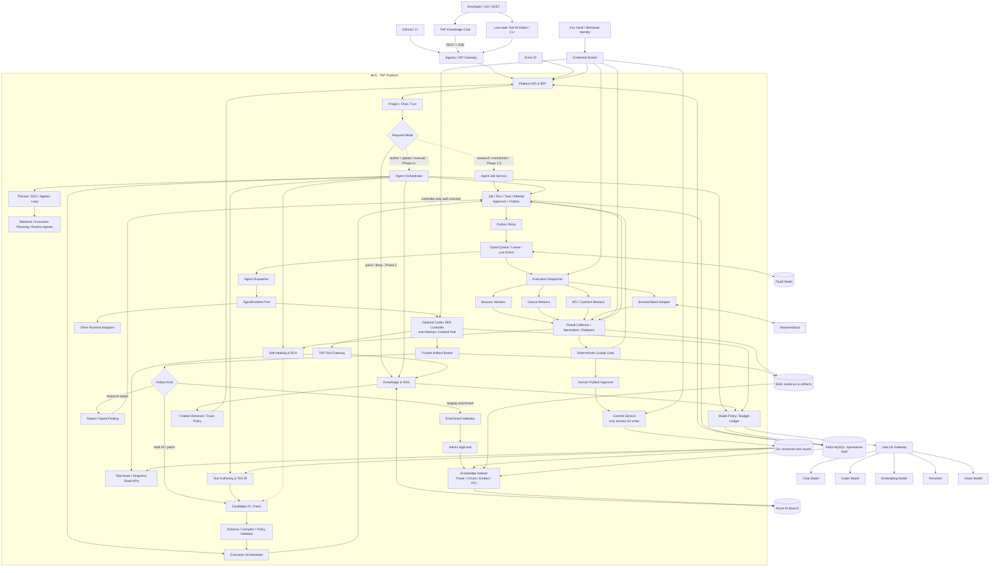

### 架构分层

| 层 | 组件 | 责任 |
| --- | --- | --- |
| 体验与接入 | Knowledge Chat/Low-code Editor/CLI、GitHub App、Ingress/API Gateway、Entra ID、Platform API/BFF | Project/Conversation、流式问答、引用、结构化编辑、认证、审批、Webhook、Check 回写 |
| Agent 控制面 | Session/Intent、Agent Orchestrator、DAG/Loop Planner、子 Agent | 理解目标、编排任务、控制上下文与权限、汇总结果 |
| 测试控制面 | Test Authoring、Test IR、Execution Orchestrator、Self-Healing/RCA | 资产生命周期、编译、调度、结果归一化、修复建议 |
| 知识面 | Ingestion、Chunking、Hybrid Retrieval、Dependency Graph | 文档/代码/BDD/失败知识的权限感知检索 |
| 模型面 | LiteLLM Gateway + TAP Model Policy | 多模型协议/路由与 TAP 自有策略、预算账本、审计分离 |
| 执行面 | Browser Grid、Device Grid、API/Contract Runner、BrowserStack | 隔离执行、矩阵调度、证据采集 |
| 数据面 | MySQL、Redis、AI Search、Blob、Git、Key Vault | 主记录、短状态、索引、对象、版本、秘密各司其职 |

### 3.1 能力地图与阶段边界

Phase 1 的 RAG 不是与 TAP 分离的一套聊天应用，而是未来平台共享的知识面、会话外壳和身份/审计底座。后续能力在同一 Project、Policy、Event、Artifact 和 Citation 模型上扩展，不重建第二套前端或私有检索链路。

| 平台能力 | Phase 1 | Phase 1.5 | Phase 2 | Phase 3+ |
| --- | --- | --- | --- | --- |
| Project、Conversation、Turn、Identity、Policy、Audit | 交付 | 复用 | 复用 | 企业治理 |
| Azure AI Search RAG、Citation、Trace、Feedback/Eval | 交付 | 作为唯一检索入口 | 供 Authoring/RCA/Agent 复用 | 规模化调优 |
| React 工作台外壳 | Knowledge Chat、Sources/Trace | Agent Job 状态 | 增加 Test IR/diff | 增加 Run/Approval/Evidence |
| Agent Runtime | 不依赖 | 可拔掉的 Codex Research/Enrichment POC | Code/Workflow Specialist | 多 Runtime/治理 |
| Test IR、编译、语义 diff | 不交付 | 不交付 | 交付 | 生产化 |
| DAG/Agentic Loop、Execution、Self-Healing/RCA | 不交付 | 仅验证端口 | Lab 闭环 | 团队/企业执行面 |
| Git branch/PR 与统一执行证据 | 只读索引来源 | 只读或 staging Artifact | 候选 patch + 验证 | 正式审批与质量门禁 |

所有阶段遵守三条边界：

1. **Knowledge Plane 可独立工作**：关闭 Agent Runtime、Test IR 或执行网格时，Phase 1 Chat/Retrieval 仍完整可用。
2. **平台能力只通过契约复用**：Agent、Authoring 和 RCA 调用同一个 Retrieval/Citation Contract；前端只调用 BFF。
3. **非确定性结果只形成候选**：Agent 的 report、Test IR、patch 和 RCA Finding 必须进入 Validator、Evidence 和 Approval 链，不能直接修改权威状态。

### 3.2 React + Python 应用架构

首版采用一个仓库、共享领域契约、多个部署角色。控制面先保持模块化，不为每个框预建微服务；只有 CPU/内存密集、长任务或需要独立扩缩的工作负载拆成 Worker 进程/Pod。

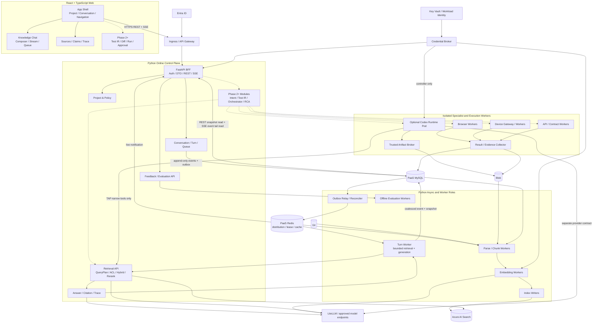

应用边界：

- **React/TypeScript** 只承载展示、交互和本地临时状态；Project、Turn、Queue、Citation、Trace、Run 与 Approval 的最终状态来自服务端。
- **FastAPI BFF** 负责认证交换、公共 DTO、幂等、REST/SSE 和当前权限重授权，不执行 parser、Embedding、本地 rerank、Agent 或测试任务。
- **Turn Worker** 执行有界 QueryPlan、检索、生成和 Citation 校验；浏览器断开只结束 BFF 流，不取消后台 Turn。
- **Ingestion Workers** 负责变更读取、typed parsing/chunking、脱敏、Embedding、删除传播和索引写入；不与 API/SSE Pod 共享 CPU/内存池。
- **Agent/Execution Workers** 一 Attempt 一隔离环境，通过 `AgentRuntime`/`ExecutionProvider` 端口接入；不直接成为 BFF 内部调用栈。
- **契约优先**：Python 以 OpenAPI/JSON Schema 发布公共 DTO，React 生成 TypeScript client/type；不得在前后端手工维护两套同名状态机。

### 3.3 部署角色与扩缩边界

首版可以共享 Python package、领域模型和迁移脚本，但至少构建不同 entrypoint/image target：

| 角色 | 主要职责 | 扩缩信号 | 禁止承载 |
| --- | --- | --- | --- |
| `web` | React 静态资源和前端路由 | HTTP 流量/CDN 命中 | 秘密、服务端 ACL、模型调用 |
| `api-sse` | FastAPI REST/SSE、认证、游标恢复、Citation/Trace 读取 | 活跃 SSE、event-loop lag、API latency | parser、Embedding、Agent、测试执行 |
| `turn-worker` | Context/QueryPlan、Retrieval、Answer、Citation validation | turn queue age、下游配额 | 长期持有浏览器连接 |
| `ingestion-worker` | fetch、parse、chunk、redact、lineage | source/parse queue age、CPU/RSS | 在线请求 |
| `embedding-worker` | batch/cache/model calls | token queue、模型配额 | API/SSE |
| `index-writer` | AI Search batch、tombstone、checkpoint | index queue、429/latency | 解析和回答 |
| `relay-reconciler` | Outbox、lease、幂等、故障对账 | outbox age、orphan count | 业务生成 |
| `agent-worker` | Codex/其他 Runtime 的隔离 Attempt | agent queue、预算、runtime quota | 生产凭据、直接索引/Git 发布 |
| `execution-worker` | Browser/Device/API 测试 Attempt | queue、grid/device capacity | 控制面状态 SoR |

这不是要求一开始建立九个独立微服务。实现初期可以把低吞吐角色合并部署，但 `api-sse`、CPU 密集 Ingestion、Agent 和不可信测试执行必须保持资源与安全隔离。

### 3.4 统一 Console 信息架构

React 应用保持一个 App Shell，并按阶段开启模块，不为 RAG 和测试平台建设两套导航：

| 模块 | 用户能力 | 后端边界 | 阶段 |
| --- | --- | --- | --- |
| Project & Access | Project、Environment、Membership、数据范围 | Project/Policy/IAM | Phase 1 最小；Phase 4 完整治理 |
| Knowledge Chat | Conversation、Quick/Deep、@resource、Citation/Trace、Feedback | Chat/Turn/Retrieval/Citation | Phase 1 |
| Agent Jobs | Research/Enrichment 状态、Artifact、审批 | Agent Job/Runtime/Artifact | Phase 1.5 |
| Test Assets | BDD/Test IR、语义 diff、compile/validation | Test Authoring/Test IR | Phase 2 |
| Runs & Matrix | RunSpec、Browser/Device/API matrix、取消/重跑 | Execution Orchestrator | Phase 2 Lab；Phase 3 产品化 |
| Evidence & RCA | Timeline、Manifest、Finding、RCA/Healing candidate | Result Pipeline/RCA | Phase 2 Lab；Phase 3+ |
| Changes & Approvals | local candidate、Publish Approval、branch/PR/Check | Validator/Approval/Commit Service | Phase 3 |
| Providers, Models & Budgets | Provider capability、模型策略、用量/配额 | Provider Registry/Model Policy | Phase 4 |
| Audit & Admin | 权限、保留、配置、审计与 Runbook | Governance/Audit | Phase 4 |

## 4. Agent Orchestrator

### 4.1 双模式编排

主 Agent/Orchestrator 支持两种执行语义：

| 模式 | 适用场景 | 特征 |
| --- | --- | --- |
| 固定 DAG | 回归测试、发布门禁、标准化新建/更新流程 | 步骤、输入输出和失败策略确定，便于审计与重放 |
| Agentic Loop | 探索性测试、复杂失败归因、开放目标 | `Plan → Act → Observe → Reflect → Re-plan`，在预算与权限内动态调整 |

Loop 不能绕开平台状态机。每个动态动作仍要落为有类型的 Task/Attempt，并受 deadline、token、费用、工具和网络策略约束。开放探索得出的方案最终进入 Review Agent 或人工审批，再转入确定性 DAG 验证。

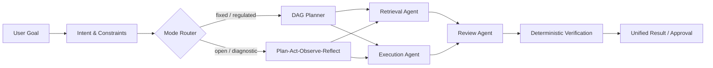

### 4.2 十大能力

1. **会话管理**：多轮 Session、状态持久化、消息队列和并发隔离。
2. **意图识别**：区分新建、更新、执行、诊断、查询与管理操作。
3. **执行规划**：选择 DAG 或 Loop，构建依赖、预算、完成条件，并在观察后受控重规划。
4. **Agent 调度**：子 Agent 注册、优先级、负载、串并行、取消和统一汇总。
5. **上下文管理**：最小装载、压缩、滑动窗口和跨 Agent 受控共享。
6. **服务发现**：查询子 Agent/模型/工具/Provider 的能力、版本与健康状态。
7. **错误控制**：超时、重试、补偿、降级、熔断、异常上抛、断点恢复和人工接管。
8. **数据流管理**：类型化 I/O、流式传递、ArtifactRef、lineage 和可复用缓存。
9. **权限控制**：RBAC、租户/项目范围、工具白名单、审批、短期凭证与敏感数据脱敏。
10. **记忆管理**：短期/长期记忆分离，支持权限感知向量检索与淘汰；长期知识必须可重建或有来源。

### 4.3 Agent Runtime 边界

Agentic Test Lab 可用 LangGraph + FastAPI 作为实验基线；企业阶段保持 Runtime 可替换。候选包括服务端 Codex SDK Adapter、DeepSeek Harness Adapter 或其他实现。TAP 自有端口不暴露任何框架内部对象，完整签名以 [AgentRuntime 契约](../reference/2026-08-20-contracts.md#agentruntime) 为准。

若接入 DeepSeek Harness：固定版本、独立进程/sidecar、契约测试、feature flag；Harness session 只是外部引用。Harness 的插件/事件设计可复用思想，但文件、进程和网络隔离仍由 TAP Worker/容器策略负责。

若接入 Codex：后台长期任务首选 Codex SDK，`codex exec` 仅用于本地 POC/CI；Codex 是异步 Specialist Runtime，一 Attempt 一隔离 Worker。Phase 1.5 只验证 Research 与 staging Knowledge Enrichment；普通 Knowledge Chat 与确定性 Ingestion 不依赖它。Phase 2 在 Test IR Schema/compiler/validator 就绪后，才增加 Draft IR 与候选 patch。所有能力通过 TAP Tool Gateway/Artifact Broker，线程、工具、sandbox 和 workspace 属于 Agent Runtime，不能把 Codex 简化成 LiteLLM 后的一个 Coder Model。详细设计见 [受控 Codex Agent Runtime](../proposals/2026-08-21-rfc-001-codex-agent-runtime.md)。

## 5. Test Authoring 与 Test IR

### 5.1 为什么需要 Test IR

Test IR 是自然语言、BDD、低代码编辑器、执行脚本和运行证据之间的稳定中间表示。它解决：

- 同一意图编译为 Selenium/Playwright/Appium/API Runner 等不同目标。
- UI 层可以结构化编辑而不直接拼接任意脚本。
- Agent 修改可以形成语义 diff，而不是整文件重写。
- 测试资产有稳定 ID，文件移动或重命名不会切断历史。
- 自愈建议能精确指向 Locator/Step/Assertion，并经过回归验证。

### 5.2 Test IR 内容

```yaml
apiVersion: tap.dev/v1alpha1
kind: TestCase
metadata:
  id: test_checkout_happy_path
  projectId: commerce-web
spec:
  intent: "已登录用户使用信用卡完成结账"
  tags: [checkout, p0]
  preconditions:
    fixtures: [user_with_cart]
  steps:
    - id: open_checkout
      action: navigate
      target: { route: /checkout }
    - id: submit_payment
      action: click
      target: { locatorRef: checkout.submit }
  assertions:
    - type: url_matches
      value: /orders/*
  matrix:
    browsers: [chrome, safari]
  evidencePolicy:
    screenshot: on_failure
    trace: retain_on_failure
```

真实 Schema 需继续定义 typed action、secret/data reference、retry semantics、capability requirements 与版本迁移；禁止把任意 Shell 片段当通用 action。

### 5.3 新建与更新两条路径

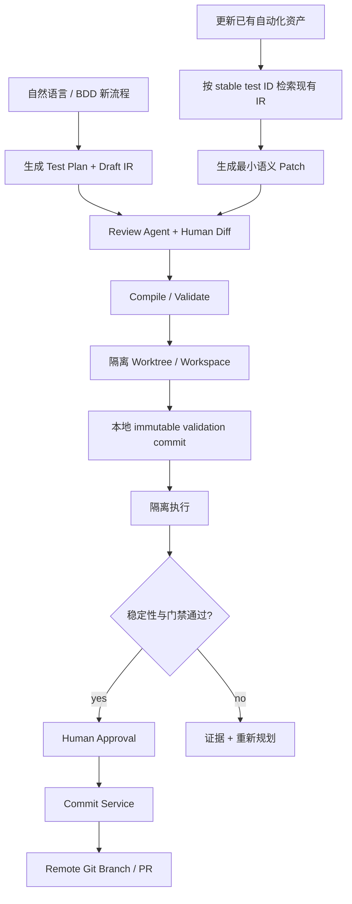

- **新建**：先形成 Test Plan 和 Draft IR，再生成执行资产。
- **更新**：先解析稳定 Test ID 与现有 revision，只允许最小 patch；不得默认重生成整套脚本。
- 两条路径都必须经过 Schema 校验、编译、本地 validation commit、隔离执行、Review 和 Git diff。
- Agent、Authoring 和 Orchestrator 都不持有远端 Git 写凭据；只有审批后的 Commit Service 能发布 branch/PR。Phase 2 Lab 可只使用本地 Git 或受控测试远端，正式 GitHub App/Check/Reconciler 在 Phase 3 交付。

## 6. 执行面

### 6.1 执行 Provider

| Provider | 使用范围 | 位置 |
| --- | --- | --- |
| Self-hosted Browser Grid | 内网 Web、低延迟回归、可控数据环境 | Selenium Grid 4 + Docker 起步；AKS/KEDA 扩展 |
| Self-hosted Device Grid | 内网移动端、专用实体设备 | Appium Device Farm；设备主机通过受控 Agent 接入 |
| API / Contract Runner | API、Schema、契约与集成验证 | Ephemeral Worker |
| BrowserStack Adapter | 外部浏览器/设备矩阵、供应商能力与弹性溢出 | BrowserStack Cloud + 按 Run 隔离的 Local Tunnel |

所有 Provider 实现同一个 `ExecutionProvider` 契约；BrowserStack project/build/session 只作为外部引用，不能成为 TAP 的领域 ID。

### 6.2 统一执行证据

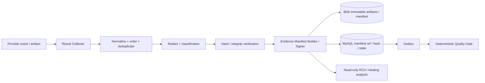

每次 Attempt 都生成 Manifest：

- 源代码 commit、Test IR revision、编译器/Runner 镜像、环境与 matrix。
- 模型、prompt、工具、Agent Runtime 与策略版本（若包含 Agent）。
- step log、assertion、trace、screenshot、video、HAR、device log、API payload 摘要。
- Provider 原始 ID、开始/结束时间、重试关系、退出原因和资源费用。
- Artifact content hash、Blob URI、数据分级、保留期限和脱敏状态。

Result Pipeline 用 provider event ID、Attempt ID、artifact hash 和 sequence 处理重复、迟到与乱序回调。Blob 保存不可变原始证据和 Manifest 对象；MySQL 保存 Manifest ID/hash、Attempt 关联、处理状态、保留策略与审计事实。Manifest/状态/Outbox 提交成功后，Quality Gate 与 RCA 才能消费。

确定性结果、Quality Decision 与 Agent 诊断分别存储。Agent 可只读引用证据并生成 Finding，不能回写、覆盖或把失败改成成功；Provider 的 `completed` 也不等于 TAP Workflow 已通过。

TAP 区分两类 evidence：Knowledge Evidence 是 `Chunk/Citation/Retrieval Trace`，用于证明回答依据；Execution Evidence 是 `Artifact/Evidence Manifest/Assertion/Finding/Quality Decision`，用于证明一次测试运行发生了什么。RCA 可以引用两类 evidence，但不能把 Retrieval score 当测试结果，也不能把 Agent Finding 当确定性 assertion。

### 6.3 自愈与 RCA

- Healenium 可作为 Locator 候选生成器，但不能自动改写 Git 主分支。
- Self-Healing 根据旧 Locator、DOM/视觉证据和历史成功样本生成候选 patch。
- RCA 聚合日志、trace、HAR、代码/BDD 变更和历史失败，输出原因、置信度与 evidence refs。
- 所有修复先在隔离矩阵重复验证；通过后形成 Git PR 和审批记录。
- Phase 2 Lab 只要求单次证据分析与候选 Locator/Test IR patch；Phase 3 产品化 Finding/审批/重跑/处置；Phase 5 再加入历史聚类、Vision、风险选测和效果反馈。

## 7. Knowledge & RAG

### 7.0 已实现的 Athena 本地纵向切片

仓库已经实现一个来源优先的 Athena 本地工作区，用来在不等待完整企业 Phase 1 的情况下验证核心用户任务。用户可上传文本可提取的 PDF/DOCX/MD/TXT，观察保存、解析、切片、Embedding、发布、ready 六阶段状态，选择最多 20 份 ready 文档发起单次非流式问答，并把每个 claim 的 citation 解析回同一文档 revision/hash/anchor 的有界原文窗口。MySQL 保存文档、job、manifest、query hash/所选 revisions 与引用核验快照，Redis 只做可恢复分发，Azurite 保存原件和派生 artifact，本地 Milvus 保存可重建的 `doc` 投影；这些快照不保存回答正文，也不形成 history。

本地运行时已把 query Embedding 与 answer generation 拆成窄端口。文档和 query Embedding 在两个真实回答模式下都必须经 LiteLLM 固定 `athena-embedding` alias 发往阿里云百炼/DashScope `text-embedding-v4`，固定为 1536 维并通过中文、英文及混合术语检索门禁。`.env` 在进程启动时独占选择 `ATHENA_ANSWER_BACKEND=litellm|codex`：默认 LiteLLM 回答另使用 `athena-chat`；Codex 只在 API answer 端口执行，不参与 worker、摄取、Embedding、检索、Milvus 写入或 Citation 解析。切换后必须重启本地运行角色，两种回答后端绝不相互 fallback。

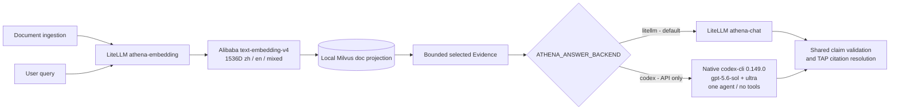

Codex 路径复用本机 ChatGPT 登录，不读取或要求 OpenAI/Codex API key；默认超时 300 秒，单 API 进程内并发固定为 1。它用请求自有 canonical catalog 消除内建 CodeModeOnly、多智能体与 apply-patch metadata，并结合 24 个禁用 feature 和显式 plan/input/agent overrides 维持空 Direct tool registry。catalog 固定 entry schema 与精确 CLI `0.149.0` 有意耦合，不提供跨版本保证；版本、登录、feature、catalog/schema、模型、事件或输出任一漂移均 fail closed 为 `answer-unavailable`，且 LiteLLM answer 调用数保持为零。Ingestion 阶段失败只在 fail/retry 状态已持久化后发出一次 `athena.ingestion.stage_failed`，日志仅含 ID、attempt、stage、安全错误码、闭合诊断/异常分类和 monotonic duration，不含内容或 provider 原文。

本机 CLI 不等于本地推理：Codex query 与所选 Evidence 会发送给 OpenAI；文档与 query 的 Embedding 内容会发送给阿里云百炼。这个经过真实 zh→en/en→zh、单智能体/tool-free、grounded/cited/sanitized/cleanup gate 的组合仍只获准用于 loopback、无认证的单操作者 Demo，不能扩展为 LAN、共享或生产声明。

这条切片复用 provider-neutral `KnowledgeAPI`、Search/Model/Citation ports、Outbox/Relay 和独立 ingestion worker，不是第二套 Demo-only RAG。浏览器刷新、应用进程重启和普通 Compose `down/up` 恢复的是文档目录与来源可用状态、ingestion/index 状态和必要的可重建状态；当前渲染回答只在页面内存中，刷新后清空，本版不提供历史回答恢复，但可基于持久的 `ready` 来源重新提问。删除与 guarded reset 使用精确项目边界。它同时明确保留以下限制：只绑定 loopback、没有身份验证/OCR/Conversation/history/SSE/stop/queue/Trace/Feedback，也没有 `code`、`bdd`、`failure` 三类本地投影和企业 ACL/Entra 治理。

因此，本地 Athena 是对来源建设、文档 ingestion、grounded answer 与 citation 完整性的已交付验证，不是完整 Knowledge Chat 或企业 RAG 的完成声明。下面的 Azure AI Search 四索引、Entra 权限、正式 Chat/SSE、评测、AKS 与生产门禁仍是 active Phase 1 基线和目标。

### 7.1 四类知识、四个索引

Azure AI Search 是最终企业选型。首期使用四个独立索引，避免不同类型数据共用错误的切分与排序策略：

| 索引 | 内容 | 主要检索方式 |
| --- | --- | --- |
| `kb-doc-v1` | 需求、设计、规范、手册 | Document Summary/Section Summary/Leaf Chunk、BM25 + Vector + semantic rerank |
| `kb-code-v1` | 代码、symbol、AST、调用/依赖关系 | Symbol/AST chunk、BM25 + Vector + graph expansion |
| `kb-bdd-v1` | Feature、Scenario、Step、Test IR 映射 | 结构化字段 + hybrid retrieval |
| `kb-failure-v1` | 失败指纹、证据摘要、RCA、修复与结果 | fingerprint/结构化过滤 + hybrid retrieval |

每个索引都必须包含并强制过滤：`tenantId`、`projectId`、`allowedGroupIds`、`classification`、`environment`。权限过滤在检索查询执行，不能只在生成答案后过滤。

### 7.2 Ingestion 与检索

- 结构化切片优先，固定 token 窗口只作为无结构内容的兜底。
- 文档采用 Document Summary → Section Summary → Leaf Chunk 多粒度索引；Child 精确召回后回填 Parent。
- 代码保持原语言，不转 Markdown；按 symbol/AST/语义边界切片并保存路径、语言、commit、symbol、引用关系。
- BDD 按 Feature/Scenario/Step 与 stable Test ID 切片。
- OpenAPI/AsyncAPI 按 Endpoint/Operation 切片；失败记录按 Incident 切片并携带 fingerprint、Test ID、环境、revision、证据和修复结果。
- 使用 BM25、Vector、AST/Symbol 和轻量代码—测试依赖图多路召回，经 RRF 融合后由 reranker 排序。
- 跨章节问题先拆为子问题并执行多跳检索；Context Enhancer 只补充必要 parent、邻接 symbol、相关 Test IR 与最新失败，防止上下文膨胀。
- 可选 Agent enrichment 只能读取固定、已授权且已脱敏的 source snapshot，输出带输入 hash 与 runtime/model/prompt/tool version 的派生候选；typed parser/chunker、ACL、稳定身份、删除传播、Index Writer 和 active corpus 发布仍是确定性 TAP Pipeline 的职责。

AI Search 是可重建投影。原文与大文件来自 Git/Blob，结构化运行事实来自 MySQL。

Phase 1 的必需实现规格拆分为：

- [数据切片与端到端溯源](rag/2026-08-21-chunking-and-provenance.md)
- [Azure AI Search 索引设计](rag/2026-08-21-ai-search-index.md)
- [检索调优方案](rag/2026-08-21-retrieval-tuning.md)
- [TAP Knowledge Chat](2026-08-21-knowledge-chat-ui.md)

Phase 1.5 的可选旁路另见 [受控 Codex Agent Runtime](../proposals/2026-08-21-rfc-001-codex-agent-runtime.md)；它不是 Phase 1 的运行依赖或出口条件。

TAP 自行解析、切片、计算稳定身份、附加 ACL/lineage 并通过 Push API 写入物理索引；AI Search 负责倒排/向量索引、filter、单索引 hybrid/RRF 与可选 semantic ranker。查询默认使用服务端可信 ACL `preFilter`，客户端和模型不能提交或覆盖安全 filter。

### 7.3 Phase 1 在线问答链路

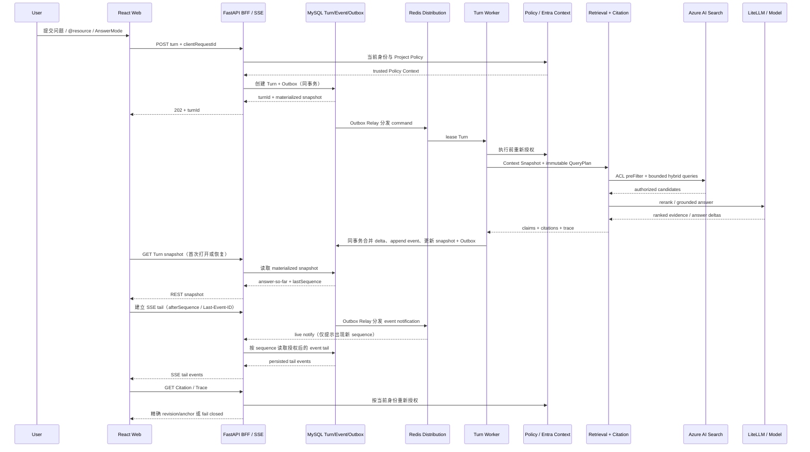

关键约束：Turn Worker 与 SSE 连接解耦；浏览器断线不取消 Turn。BFF 不为每个连接轮询或长期占用 MySQL transaction/connection。恢复时先读取 materialized Turn snapshot，再从 `lastSequence` 追尾；重放绝不再次触发 Search、模型或其他副作用。

### 7.4 Phase 1 Ingestion 链路

```mermaid
flowchart LR
    Source[Git / Blob / MySQL source revision] --> Detect[Change Detection]
    Detect --> Ledger[(MySQL Ledger + Outbox)]
    Ledger --> Relay[Outbox Relay]
    Relay --> Queue[(Redis Distribution / Lease)]
    Queue --> Fetch[Fetch + Verify immutable revision]
    Fetch --> Parse[Typed Parse / Chunk]
    Parse --> Redact[ACL / Redaction / Lineage]
    Redact --> Embed[Batch Embedding]
    Embed --> Write[Index Writer]
    Write --> Physical[AI Search physical indexes]
    Physical -->|ACK| Checkpoint[Checkpoint / Manifest]
    Checkpoint --> Ledger
    Physical --> Validate[Golden Dataset + ACL + parity]
    Validate --> Alias[Reader aliases + activeCorpusVersion]
```

解析、切片、Embedding 与索引写入使用不同的有界队列和 retry budget。大文件设置 bytes/token/RSS 限额，Embedding 按 `chunkContentHash + modelVersion` 去重并批量调用；Index Writer 只在 AI Search 确认后推进 checkpoint。全量重建与在线问答使用独立并发配额，不能让 rebuild 抢占查询容量。

## 8. 数据与存储职责

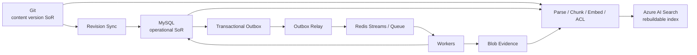

| 存储 | 权威内容 | 禁止用途 |
| --- | --- | --- |
| PaaS MySQL | 项目/权限；Chat/Turn/Queue；materialized answer、append-only domain event 与 Outbox；QueryPlan/Context Snapshot/Trace metadata；ingestion ledger/manifest；Test IR catalog/projection、版本映射、Run/Attempt、RCA、自愈、审批、反馈与审计 | 大日志、视频、每 token 一次写入、短期锁 |
| Git | BDD、Test IR 文件、脚本、Locator、Fixture、Hook、测试数据模板的版本源 | 运行状态、队列、秘密 |
| Azure AI Search | 文档/代码/BDD/失败的可重建 hybrid index | 主数据或权限 SoR |
| PaaS Redis | command/worker queue、lease、SSE live fanout、短锁、限流、短缓存、semantic/Embedding 缓存、Worker heartbeat | Chat queue 业务事实、唯一事件/审计记录或长期事实 |
| Blob Storage | 文档原件、App 包、大型 Trace/Eval Artifact、Agent report、执行 trace、视频、截图、HAR、日志、非权威候选 patch | 高频事务状态；候选 patch 的最终版本必须进入 Git |
| Key Vault | 模型、Git、数据库、执行 Provider 的 API key/证书及轮换 | 把明文秘密复制进 RunSpec |

Phase 1 中，Chat queued message、Turn 终态、answer projection、event sequence 和 Outbox 必须落 MySQL；Redis 丢失只影响实时分发，BFF 可先从 MySQL 读取 REST snapshot，再按 sequence 恢复 SSE event tail。Retrieval Trace 的授权/索引/版本/摘要元数据保存在 MySQL，大型候选与调试 Artifact 按 retention/redaction policy 进入 Blob 并以 hash 引用。模型 token delta 先合并为可重放事件，禁止每个 token 单独提交数据库事务。

### 8.1 Git 与 MySQL 的一致性

- Git 是测试内容 revision 的权威源；MySQL 是目录、权限、流程和运行事实的权威源。
- 所有运行引用不可变 Git commit；MySQL 保存 `asset_id + git_commit + content_hash`。
- 内容编辑先在隔离 worktree 形成 immutable local validation commit；确定性验证和人工审批通过后，只有 Commit Service 能发布远端 branch/PR，由 Sync Worker 更新 MySQL projection 与索引。
- 不做无约束双写。写 Git 成功而投影失败时由 Reconciler 重放；索引随时可从 Git/Blob/MySQL 重建。

### 8.2 统一事件平面与独立状态机

Chat、Agent 和测试执行共享事件基础设施与 envelope，但保持三套领域状态机，不能抽象成一套“万能 Session”：

| Aggregate | 状态机 | 主要事实 |
| --- | --- | --- |
| `ChatTurn` | queued/running/stopping/completed/abstained/canceled/failed | QueryPlan、Context Snapshot、answer、Citation、Trace、degradation |
| `AgentJob/Attempt` | queued/leased/running/waiting/cancel_requested/completed/failed/unavailable | Runtime、Policy、tool、Artifact、approval、cost |
| `TestRun/Task/Attempt` | planned/queued/dispatched/running/collecting/completed/failed/canceled | RunSpec、Provider、assertion、Evidence、Finding、quality gate |

公共 envelope 至少包含：`eventId`、`tenantId`、`projectId`、`aggregateType`、`aggregateId`、aggregate 内单调递增 `sequence`、`eventType`、`schemaVersion`、`correlationId`、`causationId`、`traceId`、`occurredAt` 和 `idempotencyKey`。`eventId` 是不透明标识，排序与断点恢复使用显式 `sequence`。

状态迁移、domain event 和 Outbox 在一个 MySQL 事务内提交；Outbox Relay 把事件至少一次分发到 Redis。消费者以 `aggregateId + sequence` 和业务幂等键去重。面向浏览器的 SSE 是领域事件的授权投影，不是 Redis 消息或模型 provider event 的原样透传；Runtime/Provider 未识别事件只能进入诊断字段，不能改变 TAP 终态。

## 9. 模型层与 LiteLLM

LiteLLM 以无状态/配置驱动的 Gateway 方式部署，负责模型协议与供应商路由；TAP Model Policy 在 MySQL 中掌握租户策略、预算账本和审计，避免为了启用 LiteLLM 内建管理功能而悄然引入未选定的 PostgreSQL。职责如下：

- 按任务路由 Chat、Coder、Embedding、Reranker、Vision 模型。
- LiteLLM 可按企业 Model Policy 执行协议归一化、provider routing、超时、重试和显式批准的 provider fallback；Athena 本地 `.env` 选择的 LiteLLM/Codex 回答后端不适用该 fallback，二者严格独占并在漂移时 fail closed。
- TAP 执行 Tenant/Project allowlist、数据区域、token/费用预算、并发配额、prompt/model version 记录与脱敏审计。
- 本地阶段可用 Ollama；并发与吞吐增长后迁移 vLLM；上层 Agent 不改契约。

Embedding 的向量维度、索引 Schema 与模型版本必须绑定；升级时新建索引版本并后台重建，不能原地混用不同向量空间。Reranker 单独版本化模型、输入格式与评分策略，不与向量维度绑定。

若需要 LiteLLM Virtual Keys、Admin UI、精细 spend tracking 等依赖其持久化后端的功能，必须先验证其与已选 MySQL/Redis 的兼容性；验证前不把这些内建功能列为 MVP 依赖，也不额外引入 PostgreSQL。

Codex Runtime 与 LiteLLM 的集成必须单独做契约验证。Codex 自定义 model provider 要求 Responses API 兼容，不能仅凭“OpenAI-compatible”就假设 streaming、tool、reasoning、compaction、取消和用量语义可用。验证通过才纳入 LiteLLM route；否则 Codex 使用受治理的 direct provider egress，并继续由 TAP Model Policy/MySQL 记录预算、用量与审计。

Athena 本地已实现路径是该企业目标之外的窄例外：LiteLLM 始终承担文档/query Embedding，回答端口才由 `.env` 在 LiteLLM 与精确本机 Codex CLI 之间选择。该 `doc` Milvus 投影和个人 ChatGPT 登录不代表 Azure AI Search 四索引、Entra、共享凭据或完整 Phase 1 已交付。

## 10. 关键流程

### 10.1 自然语言创建测试

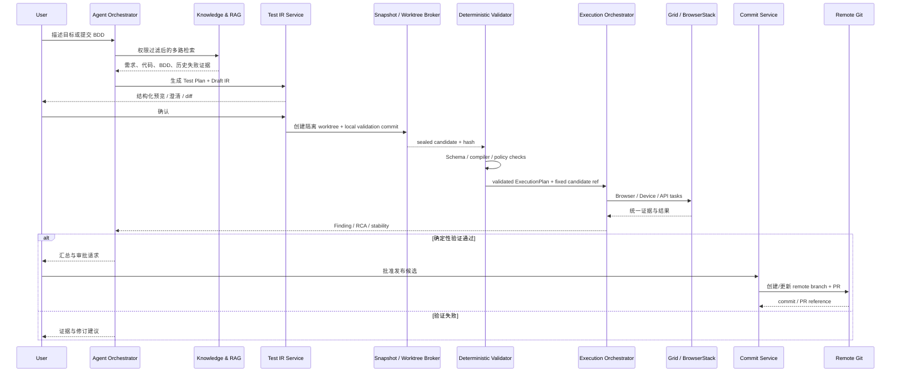

### 10.2 更新已有资产

1. Intent Router 识别为 `update_existing_test`，要求 stable Test ID 或通过检索消歧。
2. 加载目标 revision、相关代码/BDD、最近失败和资产依赖。
3. Agent 只生成语义 patch；Review Agent 检查范围、Schema、风险和遗漏。
4. 编译后在隔离 Runner 执行受影响测试与必要回归。
5. 证据通过并经人工审批后，由 Commit Service 创建 Git branch/PR；Agent 和 Orchestrator 没有远端 Git 写权限。

### 10.3 PR 质量反馈

GitHub Webhook 验签和幂等 → 冻结 RunSpec 与 Git revision → 变更/风险选测 → 自建或 BrowserStack 执行 → 证据归一化 → 可选 Agent RCA → 确定性 Quality Gate → GitHub Check/评论。

## 11. 可靠性、性能与容量

### 11.1 一致性与故障恢复

- MySQL 状态、RunEvent 与 Outbox 同事务；Redis Stream 负责分发，不承担唯一事实。
- Webhook、队列、Provider callback 都按至少一次处理，所有 Handler 使用稳定幂等键。
- Attempt 通过 lease/heartbeat 执行；Worker 丢失后由 Reconciler 查询 Git、BrowserStack、Grid 和 Blob 再决定接管。
- Provider callback 与主动轮询并存，处理重复、乱序和丢失。
- 取消先阻止新任务，再传播至 Agent/Grid/BrowserStack；未能取消的孤儿任务持续对账和清理。
- 模型、BrowserStack、自建 Grid 各自使用 bulkhead、deadline、retry budget 和 circuit breaker。
- KEDA 只根据可观测队列与资源指标扩缩 Worker；不会扩缩物理设备本身。

### 11.2 Python 在线服务与 Worker 隔离

- `api-sse` 使用 FastAPI/ASGI 与全异步 Search、HTTP、MySQL、Redis client；同步 SDK/文件解析不能阻塞 event loop。
- AKS 默认一个 Uvicorn process/Pod，通过 Pod 横向扩容；单 Pod worker 数、pool 和并发必须通过压测决定，不能用多进程掩盖阻塞调用。
- parser/chunker/OCR/AST、本地 tokenizer/reranker/Embedding、Artifact 压缩和 Agent/测试执行进入独立 process/Pod。重任务不使用进程内 `BackgroundTasks`。
- Search、Embedding、Rerank、LLM、MySQL 与 Redis 各自配置有界连接池、tenant/project semaphore、deadline、`Retry-After` 与带抖动重试；Quick/Deep 的 subquery/index fan-out 有硬上限，禁止无界 `gather`。
- MySQL 连接按 `pod replicas × pool size` 做全局预算；SSE 等待时不持有数据库连接。过载时显式排队、429/503 或降级，不能让请求无限堆积。

### 11.3 SSE 与 React 性能契约

以下是首轮压测起点，不是生产 SLO：

- Event Projection 层把 provider token 合并为稳定可重放的 `answer.delta`；初始以 `50–100ms` 或 `32–128` 字符为触发条件，目标不超过 `10–20 events/s/turn`，单事件不超过 `16KiB`。禁止每 token 一次 MySQL commit/SSE event/React state update。
- BFF 每连接使用有界缓冲；初始上限 `64–128 events` 或 `256KiB`，慢消费者断开后用 snapshot + cursor 续传。Heartbeat 初始 `15–25s`，Ingress idle timeout 至少是 heartbeat 的 `2–3` 倍。
- `GET Turn Snapshot` 返回 answer-so-far、citations、state 和 `lastSequence`；SSE 只追尾。若待重放超过 `500 events` 或 `1MiB`，服务端要求重新取得 snapshot，不能从第一条 token delta 无限回放。
- React 把 REST server state、SSE 高频状态与 composer/面板临时状态分开；按 chat/turn/message/citation/trace 规范化，delta 先进入 buffer，再按 animation frame 或最多约 `50ms` 批量提交。
- 流式 Markdown 只增量处理未闭合尾块，完成段落 memoize；代码高亮、Source preview 和 Trace 按需加载。长会话与候选列表分页并采用动态高度虚拟化，不能一次性挂载完整历史或 Trace。

### 11.4 容量与压测

“约 200 DAU、近万文档”只说明产品规模，不能直接决定容量。在线容量按峰值 active turns、SSE connections、fan-out 和下游 quota 计算；Ingestion 按 chunk/vector/token 总量、平均 revision 大小与更新速率计算。首轮至少覆盖：

1. `200/500/1000` 个 SSE 连接，分别模拟空闲与 `10%/30%/100%` 活跃比例。
2. `20/50/100` 个并发 active turns，覆盖 Quick/Deep、跨索引最大 fan-out、取消和断线恢复。
3. 四类语料全量 rebuild 与在线问答并行，验证 Search/Embedding 配额隔离和查询 p95/p99。
4. AI Search/LLM 429 与慢响应、Redis/MySQL 抖动、Pod 重启、SSE reconnect、重复消息和 checkpoint 恢复。

必须观测：active SSE、event-loop lag、TTFT、turn p95/p99、每依赖 latency/429、DB/HTTP pool wait、queue age、delta 写入率、Search throttling、LLM token/费用、worker RSS/CPU、ingestion freshness 与恢复重复率。只有 profiler 证明 Python Runtime 在完成异步化、隔离和横向扩容后仍主导 p99/成本，才局部把高连接网关或 CPU parser 改为 Go/Rust/native worker；不整体重写平台。

建议先测量基线，再审批 SLO 数值。至少分别定义：控制面可用性、Run 建立延迟、结果收敛延迟、审计完整性、RPO/RTO、Provider 降级和成本上限。

## 12. 安全与合规

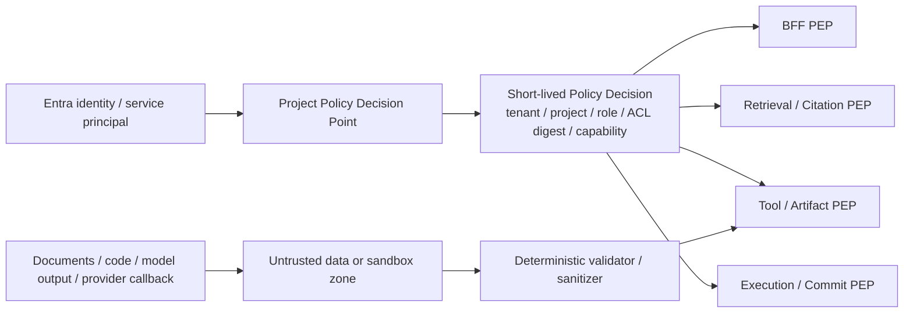

Entra 只提供身份起点；Project Policy 是决策源，BFF、Retrieval/Citation、Tool/Artifact、Execution/Commit 都是独立执行点。公共 DTO、模型和 sandbox 只能收窄 scope，不能传入 tenant/group/classification 或扩大 capability。旧 Chat/Citation/Trace、Agent tool、Artifact 发布、执行与 Git 写入分别按当前 Policy 重新授权，Policy 不可用时 fail closed。

| 风险 | 控制 |
| --- | --- |
| GitHub Webhook 伪造/重放 | 签名、delivery ID、时间窗、原始载荷哈希 |
| 恶意仓库/测试代码 | 临时容器或 microVM、只读镜像、无宿主挂载、资源与 egress 限制 |
| Prompt injection | 外部文本标记、最小上下文、工具能力与内容分离、不因文本提升权限 |
| 模型/工具泄密 | Key Vault + SecretRef、短期凭证、脱敏、模型/区域 allowlist |
| BrowserStack Local 横向访问 | 每 Run/环境独立 tunnel、目标 allowlist、TTL、异常清理 |
| Agent 越权 | deny-by-default、工具网关、审批、子 Agent 不扩权 |
| RAG 越权 | tenant/project/group/classification/environment 查询前过滤 |
| 视频/HAR/日志含敏感数据 | 采集前后脱敏、Blob 加密、最短保留、访问审计 |
| 自愈污染主分支 | 候选 patch、隔离验证、Git PR、人审，不自动覆盖 |
| 多租户串扰 | MySQL tenant scope、Redis key namespace、Blob container/prefix 与 KMS 边界 |

## 13. 可观测性

- OpenTelemetry 贯穿 `project → chat → turn → retrieval operation → query plan → context snapshot → retrieval trace`，以及后续 `workflow → run/job → task → attempt → provider/runtime`；二者通过 correlation ID 关联而不混用状态机。
- Allure 作为测试报告视图；OTel trace/log/metric 负责跨组件诊断；个人实验阶段可用 Jaeger，企业环境后端可替换。
- RAG/Chat 指标：active SSE、event-loop lag、TTFT、delta rate、断线恢复、DB/HTTP pool wait、Search latency/QPS/throttling、retrieval/rerank/context token、citation/abstain/feedback、ingestion queue/freshness/rebuild parity。
- 测试/Agent 指标：队列等待、Grid 利用率、设备占用、Provider 错误、flake、Evidence 收敛、RCA 采纳率、自愈验证率、Agent cold start/tool latency/token/费用与 Artifact seal。
- 审计事件、业务事件、调试日志分开保存与设置保留策略。

## 14. AKS 部署拓扑

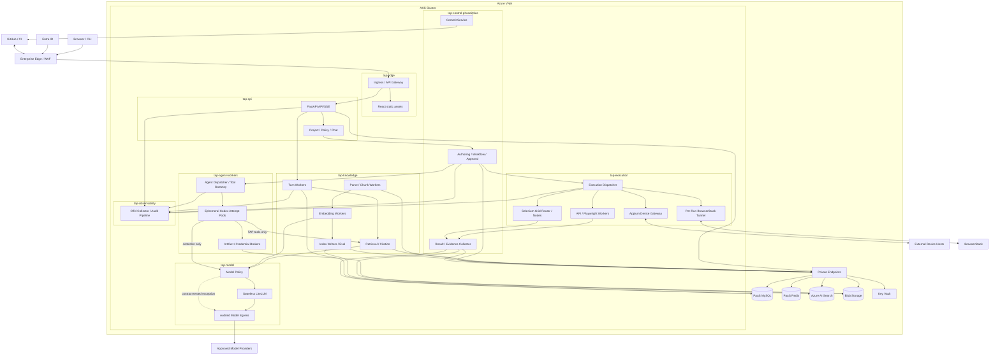

部署约束：

- `tap-api`、CPU/内存密集的 `tap-knowledge` workers、`tap-agent-workers` 和不可信 `tap-execution` 使用独立 Deployment/node pool 或至少独立资源/网络边界；Indexer 不再与 API/SSE 共用 Pod。
- Codex Attempt 使用短生命周期 Pod、无默认 ServiceAccount token、独立卷、干净 runtime home、sandbox 和 egress profile；credential 只进入可信 controller/broker，不能进入模型控制的命令环境。
- Selenium Grid 与 Playwright ephemeral worker pool 分开；物理 Appium device host 位于 AKS 外，由 Device Gateway 管理。BrowserStack Local Tunnel 按 Run 创建并限制目标/TTL。
- Namespace 与公网出口默认拒绝，只按图中路径 allowlist。PaaS 访问采用 workload identity/private endpoint；模型 provider、GitHub、BrowserStack 和被测系统通过受审计 egress。
- Phase 1 可以使用最小非生产 AKS + 现有 PaaS 验证纵向切片；Phase 4 的“企业 AKS”指多副本/多可用区、Private Link、KEDA、DR、SLO、容量与多租户硬化，不是重新实现 Phase 1 组件。

## 15. 演进路径

1. **RAG Foundation + Knowledge Chat**：先完成 Azure AI Search 四索引、typed ingestion、权限过滤、hybrid retrieval、引用、离线评测，以及可流式问答/中断/排队追问/打开证据的 Chat 页面；不以前置 Agent 或执行网格为目标。详见 [Phase 1 专项设计](rag/2026-08-21-foundation.md)。
2. **受控 Agent Runtime POC**：在不改变 Phase 1 出口条件的前提下，以 Codex SDK Adapter 验证只读 Research 与 staging Knowledge Enrichment；关闭 Runtime 时 RAG/Chat 必须完整工作。
3. **Agentic Test Lab**：复用已验证的 RAG，先定义 Test IR/validator/compiler，再加入 Codex code-edit Specialist、最小 Test Authoring/Execution/Result/RCA、本地 Git/worktree、Selenium Grid 4 + Docker、Appium、Allure + OTel/Jaeger，在单用户/单 Project Lab 打通 NL/BDD 到证据闭环。
4. **团队 MVP**：把 Lab 模块产品化为多用户可恢复服务，将 Phase 1 已用于 Chat/Ingestion 的 MySQL Outbox、Redis lease 与 Reconciler 模式扩展到 Agent/Run/Execution 并做生产硬化，同时交付 Commit Service、GitHub App/PR/Check、正式审批和自建 Grid；远端 Git 副作用只由 Commit Service 执行。
5. **企业平台扩展**：AKS/KEDA、Key Vault、LiteLLM 多模型、BrowserStack Adapter、多租户权限与审计。
6. **智能增强与规模化**：失败聚类、RCA、自愈候选、Vision、风险选测；按真实瓶颈拆分组件。

## 16. 需要进一步细化的设计

- Test IR JSON Schema、action vocabulary、编译器与 schema migration。
- Project/Membership/RoleBinding/EnvironmentPolicy，以及 Entra group sync、service principal 与职责分离管理契约。
- WorkflowPlan、DAG node/Loop action、TestPlan/ChangeSet/ValidationResult、Approval/QualityDecision、RcaReport/HealingCandidate 契约。
- Git 目录布局、branch/PR 流程、stable Test ID 与 rename/alias 规则。
- MySQL 逻辑模型与 Run/Task/Attempt 单调状态机。
- 四个 AI Search 索引的容量/SKU、embedding/rerank 模型与真实 Golden Dataset 参数校准；逻辑 Schema、权限过滤与调优流程已在 Phase 1 专项文档定义。
- BrowserStack Local、自建 Browser Grid、Appium Device Farm 的网络与容量设计。
- Agent Runtime 选型验证：Codex SDK Adapter、LangGraph 基线与 DeepSeek Harness Adapter POC；同时验证认证、Responses provider、sandbox、事件、取消、成本和隔离。
- ModelPolicyDecision、ModelInvocationRecord 与 UsageLedgerEntry 契约，以及 LiteLLM/受审计 direct-provider egress 的统一账本。
- 统一 Evidence Manifest、脱敏规则、Blob 生命周期与法律保留策略。
