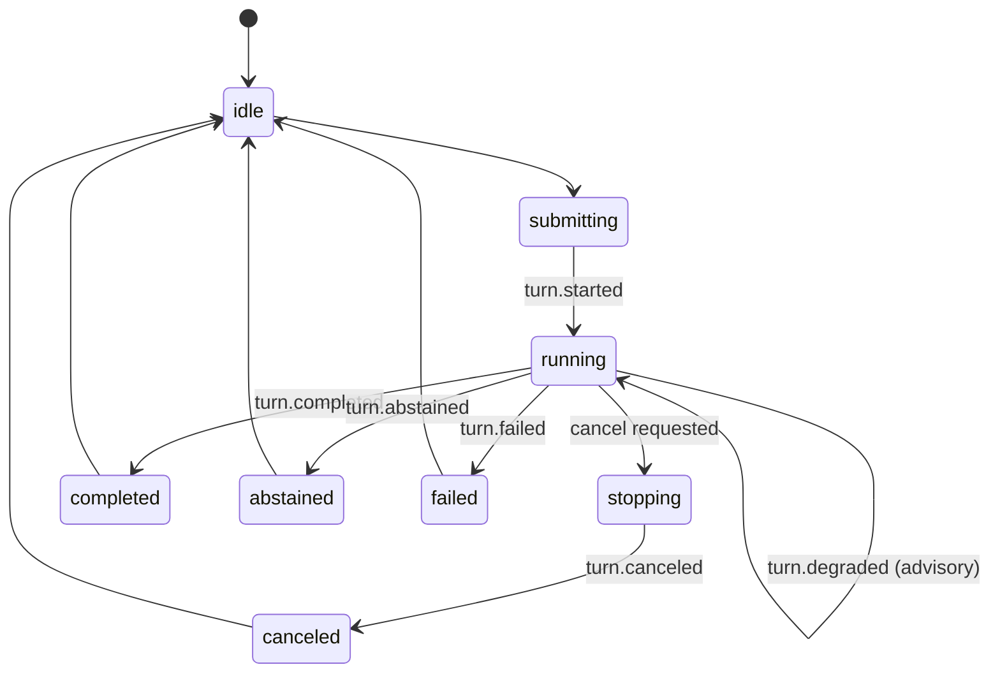

# TAP Knowledge Chat

| 字段     | 值                                                                                                        |
| -------- | --------------------------------------------------------------------------------------------------------- |
| 阶段     | RFC-009 V0–VG Knowledge-first 当前目标；正文保留 2026-08-21 完整企业交互设计                              |
| 目标     | 先用固定 Validation Scope 验收可持久、可核验的知识问答，再由 P0 补充身份/RBAC/多 Project、P1 完成生产加固 |
| 交互参考 | Codex 与 Claude Code 的项目/会话、流式状态、中断、排队追问和资源引用模式                                  |
| 边界     | 借鉴交互模型，不复制品牌、视觉资产或像素布局；V1 知识问答不执行 Shell、代码修改或测试任务                 |

> **当前范围（2026-09-04）**：[RFC-009](../proposals/2026-09-04-rfc-009-athena-knowledge-web-automation-platform.md) 与 [ADR-021](../decisions/2026-09-04-adr-021-knowledge-first-web-automation-delivery.md) 已替代 ADR-019 的交付优先级。当前先恢复真实 Knowledge Answer/Citation 与服务端 Conversation 主链，使用 Milvus `doc`、MySQL/MinIO、LiteLLM 和固定 Validation Project/Actor；P0 才增加登录、Membership/RBAC 与多 Project。正文涉及 Entra、Azure AI Search、完整 Trace/队列和企业 Policy 的部分保留为历史/后续设计，不是 V0 的已实现能力。

## 1. 产品目标

`TAP Knowledge Chat` 是 RAG 的首个正式用户面，而不是临时 Demo。用户在有权限的 Project 中发起知识问答，观察检索阶段，获得带逐条引用的回答，并能打开不可变 source revision 的原文证据。

该 Knowledge Chat 设计不把知识问答扩展为通用 Agent：没有工具执行、多 Agent 规划、Test IR 编辑、Git 写入、测试运行或审批流。后续平台可以在同一 App Shell 中增加其他能力，但不能改变这里的 Retrieval 与 Citation 契约。

RFC-007 定义的 Intelligence Task 是显式、独立的异步对象，不是聊天回答背后的隐藏路径；其独立 Lab 交付优先级已被 RFC-009/ADR-021 替代。普通知识问答仍由确定性 Retrieval Pipeline 完成；关闭生成 Runtime 不影响本页面。Test Plan/BDD/Automation Draft 按 RFC-009 的后续验证里程碑接入，并始终经过引用验证与人工发布边界。

### 1.1 Athena 本地工作区与正式 Knowledge Chat 的边界

当前仓库已交付的 Athena 本地工作区复用了本设计的来源、claim citation 和证据侧栏原则，但采用更窄的来源优先信息架构：

```text
┌─ Ready Sources ─┬──── 单次来源限定问答 ────┬─ Citation Preview ─┐
│ 搜索 / 勾选      │ 当前选中来源 / 问题       │ 文件 / revision     │
│ processing 禁选  │ 非流式 grounded answer   │ quote / anchor      │
│ failed 可重试    │ inline citation          │ 关闭后焦点返回      │
└─────────────────┴─────────────────────────┴─────────────────────┘
                  知识库：上传 / 六阶段状态 / 重试 / 删除
```

- Athena 只有固定本地知识空间，不创建 Project/Conversation，也不把回答快照冒充 Chat history。
- Athena 当前渲染回答只保存在页面内存；刷新会清空回答，但会重新读取持久的文档/ingestion/index 状态，用户可基于仍为 `ready` 的来源重新提问。本版没有历史回答恢复 API。
- 问答使用一次 JSON 响应；没有 SSE、answer delta、停止、排队追问、`@resource`、fork 或断线游标恢复。
- 普通用户可选择最多 20 份 ready 文档并打开行内引用；processing/failed/deleting 文档不可进入选择范围。
- 知识库把上传和运维从 composer 分离，直接显示 `stored → parsing → chunking → embedding → publishing → ready` 六阶段，以及失败重试与删除。
- 本地 Demo 无身份验证、Trace、Feedback 或当前 ACL 重授权，只允许精确 loopback 使用；V0–VG 使用服务端固定 Validation Scope/Policy，P0 才实现内建 Session、Membership/RBAC、历史权限收紧与受限诊断。本路线不以前置 Entra/SSO 为条件。

这一区分是产品边界，不是临时命名差异：Athena 已有切片验证“喂资料、限定来源、核验回答”；下面章节中的 durable Conversation/SSE/Citation 属于 V1 当前目标，queue、完整 Trace/Feedback 与更广资源类型属于后续扩展，身份/RBAC 属于 P0。各项不能因写在同一设计页中而被当作已经实现。

## 2. 页面布局

```text
┌─ Projects / Conversations ─┬──────────── TAP Knowledge Chat ────────────┬─ Sources / Claims / Trace ─┐
│ Project switcher            │ Project · Environment · Corpus version    │ Sources                     │
│ + New conversation          │ Scope chips                               │ Claims                      │
│ Search / pin / status       │                                           │ Retrieval Trace (restricted)│
│                             │ User question                             │                             │
│ Conversation history        │ Observable retrieval stages               │ Exact revision + anchor     │
│                             │ Streaming answer with [1] [2] citations   │ Chunk lineage               │
│                             │                                           │                             │
│                             │ Queued follow-ups                         │                             │
│                             │ @resource  /command  [composer] [stop/send]│                             │
└─────────────────────────────┴───────────────────────────────────────────┴─────────────────────────────┘
```

### 左栏：Project 与会话

- V0–VG 只显示服务端固定的 Validation Project 和其 Conversation；P0 后只列出当前 Session 用户具有 Membership 的 Project 和会话。
- Project 保存默认 `environment`、source families 与 corpus scope；客户端选择只能收窄范围，不能扩大权限。
- 支持新建、搜索、置顶和恢复会话。一个独立问题目标建议使用一个会话，避免上下文无界增长。
- 每个 turn 固化 `queryPlanId`、`contextSnapshotId`、`corpusVersion`、`retrievalProfileId`、`traceId` 和回答模型版本。

### 中栏：问答工作区

- 顶部明确展示 Project、Environment、Corpus version 和有效 scope chips。
- 回答期间展示结构化阶段：`理解问题 → 检索 → 融合 → 重排 → 组织答案 → 校验引用`。
- 阶段只展示可审计事件、命中数量、降级状态和耗时；不展示模型隐藏思维链、系统提示词或内部推理文本。
- 回答以 Markdown 流式呈现；每个实质 claim 后显示可点击的 `[1]`、`[2]` 引用。
- Composer 固定在底部，支持键盘操作、`@resource`、`/command`、发送与停止。
- Composer 提供 `Quick / Deep` AnswerMode：Quick 优先低延迟 exact/hybrid；Deep 使用有界问题拆解、Milvus 文档检索、可用时的有界 Graph 扩展与冲突检查。服务端将 AnswerMode 映射到版本化 RetrievalProfile；二者都不自动启动 Agent。

### 右栏：证据与诊断

- 默认折叠；普通用户可查看 Sources 与 Claims。
- 点击引用后打开证据卡，并定位精确 revision 与 structural anchor。
- 只有 `RAG-Diagnostics-Reader` 角色可打开完整 Retrieval Trace；Trace 每次读取重新授权并审计。

## 3. 核心交互

### 3.1 流式回答与恢复

浏览器通过 SSE 接收持久化事件。首次连接或恢复时先用 REST 读取 materialized Turn snapshot（answer-so-far、citations、state、`lastSequence`），再从 cursor 追尾；SSE wire `id` 使用十进制 `sequence`，因此浏览器的 `Last-Event-ID` 与显式 `afterSequence` 表示同一断点，不触发重新检索。若待重放超过服务端上限，统一返回 `stream_reset_required` 并重新取得 snapshot，不能从第一条 token delta 无限回放。页面同时展示稳定的 `turnId`、运行状态和降级信息。

### 3.2 中断与立即纠偏

- 生成期间“发送”变为“停止”，`Esc` 也可中断。
- 前端等待 cancel acknowledgement 后再把 turn 标记为 `canceled`；已经生成的文本保留但标记“已中断”，不能伪装成完整答案。
- 用户可在运行中选择“中断并立即发送”纠偏消息；新 turn 只能在旧 turn cancel 已确认后开始，避免输出交错。

### 3.3 排队追问

- 当前 turn 运行时，按 Enter 把消息加入 composer 上方的队列。
- 队列项可编辑、删除和调整顺序；每一项在前一 turn 完成后创建独立 turn。
- 禁止把队列内容静默拼入正在执行的 query，否则 trace、引用和幂等语义都会失真。

### 3.4 Slash command

后置 Knowledge Chat 计划支持：

| 命令        | 行为                                                               |
| ----------- | ------------------------------------------------------------------ |
| `/new`      | 新建会话                                                           |
| `/scope`    | 查看或收窄 Project、Environment、source family                     |
| `/status`   | 查看当前 turn、corpus 与检索 profile 状态                          |
| `/trace`    | 打开当前 turn 的证据摘要；完整诊断受角色限制                       |
| `/debug`    | 诊断角色临时请求可审计 debug 信息，不改变生产 profile              |
| `/feedback` | 打开结构化反馈表单                                                 |
| `/quick`    | 当前 turn 请求低延迟 AnswerMode；服务端选择版本化 RetrievalProfile |
| `/deep`     | 当前 turn 请求有界多查询、跨索引和冲突检查 AnswerMode              |
| `/fork`     | 从选定 turn 创建新会话分支，不改写原 QueryPlan/Trace               |
| `/clear`    | 清空未发送 composer 内容，不删除审计历史                           |

命令由前端解析为显式 API 操作，不能作为自然语言拼接给模型。

### 3.5 `@` 资源引用

V1 只承诺按 Project/Source 授权搜索和选择 `@doc`；下面的 `@code`、`@bdd` 与 `@failure` 是当前路线之外的历史扩展构想，不能进入 V1 验收：

```text
@doc:architecture
@code:CheckoutService.submit
@bdd:test_checkout_happy_path
@failure:payment-timeout
```

选中后生成稳定 resource chip，发送 `sourceId + requestedRevision + anchor + mode`，而不是只把展示文本塞进 prompt。`required` 要求答案必须依据该资源，`preferred` 表示优先但允许补充，`scope` 把搜索限制在该资源/结构子树。BFF 重新授权后才把它转为检索约束；无权限、revision 已删除或越出当前 Project 的引用必须 fail closed。

### 3.6 编辑、重试与反馈

- “编辑并重试”从被编辑消息创建新 turn，并保留原 turn 作为不可变历史；不能覆盖旧 trace。
- “分支会话”保存 `parentChatId + branchedFromTurnId`，可尝试不同问题、scope 或 AnswerMode；服务端据此选择新 RetrievalProfile，原回答、QueryPlan、Context Snapshot 与 Trace 保持不可变。
- 回答下方提供 👍/👎。负反馈原因至少包括：答案错误、缺少/错误引用、来源过期、敏感信息、检索遗漏、速度慢。
- 反馈绑定 `turnId + traceId + corpusVersion + retrievalProfileId`，可进入 Golden Dataset 候选；不得直接在线改变排序权重。

## 4. 引用与溯源体验

普通证据卡展示：

- 标题、source family、可安全展示的来源名。
- `sourceRevision`、structured anchor、`indexedAt`。
- 命中片段及关键词高亮。
- `chunkId`、`logicalChunkId`、`sourceContentHash`、`chunkContentHash` 和内容角色（原文或派生摘要）。
- “打开原始来源”和“查看上下文”；均经 Citation Resolver 重新授权，不把内部 Blob/Git URI 直接暴露给浏览器。

不同语料的精确定位：

| 类型    | 定位方式                                                  |
| ------- | --------------------------------------------------------- |
| 文档    | heading path、页码/bounding box 或字符 offset             |
| 代码    | `repo@commit/path#Lx-Ly` 与 symbol                        |
| BDD     | Feature → Scenario → Step 与 stable Test ID               |
| Failure | incident、run、fingerprint、时间窗口和 evidence reference |

模型只允许输出 prompt 中分配的 evidence label。服务端将 label 映射为 Citation；不存在的 label、模型生成 URL 或不属于本 turn context 的 chunk 一律拒绝。派生 summary 必须显式标为 `generated_summary` 并列出 `derivedFromChunkIds`，不能伪装成原文证据。

历史答案本身也可能含敏感内容。恢复会话、展开答案、打开引用或查看原文时都按当前 ACL 重新授权；撤权或语料权限收紧后，相关内容锁定为“权限或语料已变化，请重新回答”，不能通过旧聊天继续查看摘录。

## 5. Retrieval Trace Inspector

诊断角色可查看：

1. 原始/规范化 query、Query Class 与有界分解 query。
2. 目标 index family、physical index、schema/corpus/profile/model version。
3. server-side scope 与脱敏 ACL digest。
4. exact、sparse/BM25、dense vector 候选及 rank；Milvus hybrid 融合与可选 Graph 扩展分开显示。只有未来重新引入多索引 Provider 时才增加跨索引 RRF。
5. rerank 前后顺序、parent/adjacent/dependency expansion 和淘汰原因。
6. 最终 context、token budget、引用校验、各阶段耗时与 degraded/abstain 原因。

Trace 不显示隐藏思维链、系统提示词、原始 group IDs、秘密、完整 filter 表达式或未授权候选内容。`traceId` 只是关联标识，不是访问凭证。

## 6. 前后端 API

浏览器只访问 TAP BFF；绝不直连 Milvus、LiteLLM、MySQL、MinIO/Azurite、Jenkins 或未来的检索 Provider。

下列 URL 是 2026-08-21 的交互草案，不是当前 OpenAPI。RFC-009 的正式资源必须位于 `/api/v1/projects/{project_id}/...` 范围；实施时由 Backend 生成契约并以[当前核心契约](../reference/2026-09-04-athena-platform-contracts.md)校验语义，不能照抄下面的无 Project 路径。

```text
POST   /v1/chats
GET    /api/v1/projects/{project_id}/conversations?cursor=&limit=
GET    /v1/chats/{chatId}?cursor=&limit=
POST   /v1/chats/{chatId}/turns
POST   /v1/turns/{turnId}/fork
POST   /v1/turns/{turnId}/cancel
GET    /v1/turns/{turnId}
GET    /v1/chats/{chatId}/queue
POST   /v1/chats/{chatId}/queue
PATCH  /v1/chats/{chatId}/queue/{messageId}
DELETE /v1/chats/{chatId}/queue/{messageId}
GET    /v1/turns/{turnId}/events?afterSequence=
POST   /v1/turns/{turnId}/feedback
GET    /v1/citations/{citationId}
GET    /v1/retrieval/traces/{traceId}?cursor=&limit=
```

SSE 事件至少包括：

```text
turn.started
context.assembled
query.plan_ready
stage.started
stage.completed
retrieval.hits_ready
rerank.completed
answer.delta
citation.resolved
turn.completed
turn.abstained
turn.degraded
turn.canceled
turn.failed
```

每个事件包含不透明 `eventId`、Turn 内单调递增 `sequence`、`turnId`、`occurredAt`、`schemaVersion` 和小型 typed payload。创建 turn 必须携带 `clientRequestId` 做幂等；排序/去重/恢复使用 `sequence`，不能依赖字符串 `eventId` 排序。事件重放不能触发新的模型或检索调用。当前稳定边界见 [Athena 平台核心契约](../reference/2026-09-04-athena-platform-contracts.md#3-knowledge-与-conversation)；旧 Knowledge Chat Contract 仅保留历史细化参考。

## 7. 前端实现基线

- React 19 + TypeScript + Vite，沿用当前仓库应用壳和生成契约。
- V0–VG 由服务端固定 Validation Scope 产生可信上下文；P0 改用内建 Cookie Session + Membership Policy。Entra/企业 SSO 不在当前路线。
- REST 承担 mutation，SSE 承担单向事件和 answer delta；断线恢复依赖持久事件游标。
- 消息、引用、queue 与运行状态按服务端事实归并，不在浏览器猜测最终状态。
- 可访问性覆盖键盘、焦点管理、屏幕阅读器和非颜色状态提示。

### 7.1 状态与渲染架构

- **REST server state**：Project、Chat page、Turn snapshot、Citation/Trace page，用带 cursor 的 query cache 管理。
- **SSE 高频状态**：独立 event buffer/store，以 `(turnId, sequence)` 幂等归并；不能把整条 Chat 放入一个 Context/Redux object 并在每个 delta 广播。
- **本地 UI 状态**：composer、选中引用、面板宽度、未提交 queue 编辑，不冒充服务端事实。
- 实体按 chat/turn/message/citation/trace 规范化，完成消息 memoize；Turn 完成后用 final answer 替换热 delta buffer，只保留 snapshot 与最后 cursor。
- Markdown 流式阶段只解析未闭合尾块，完成段落缓存；代码高亮、source preview、完整 Trace 在展开后懒加载。历史 Chat 与 Trace 都用 cursor 分页，长列表采用动态高度虚拟化并保持滚动锚点。

### 7.2 首轮性能预算

以下数值用于首轮压测和代码评审，不是生产 SLO：

- Event Projection 以 `50–100ms` 或 `32–128` 字符合并模型 delta，目标不超过 `10–20 events/s/turn`，单 event 不超过 `16KiB`；浏览器按 animation frame 或最多约 `50ms` 批量提交一次。
- BFF 每连接缓冲初始上限 `64–128 events` 或 `256KiB`；慢消费者断开后续传，不建立无界内存队列。Heartbeat 初始 `15–25s`，代理 idle timeout 至少是其 `2–3` 倍。
- REST snapshot + SSE tail 的单次追尾初始上限 `500 events` 或 `1MiB`；超限执行明确的 `stream_reset_required`/snapshot 协议。
- Chat 初载建议只取最近 `40 turns`，旧历史每页 `20 turns`；Trace 候选每页 `50`、服务端最多返回 `100` 条摘要，候选正文点击后重新授权并单独获取。数值根据真实回答长度和浏览器 profiling 调整。
- 重点测量 event receive-to-paint、React commit、主线程 long task、DOM/heap、SSE 重连重复率；禁止每个 token 都 `setState`、重新 sanitize/parse 全回答或写一条数据库事务。



`turn.degraded` 只更新运行中的告警 badge，不是终态；随后必须收到 completed、abstained、canceled 或 failed。最终回答同时固化 `degradedMode` 与原因。

## 8. 安全要求

- Public Chat DTO 不接受 actor、role、enterprise、权威 Project、group IDs、classification ceiling 或任意 filter；BFF 从当前可信 ScopeProvider 与 Policy 注入，客户端选择只能收窄来源范围。
- Markdown 使用 allowlist sanitizer；代码块作为文本渲染；链接只允许批准的 URL scheme，并经 Citation Resolver 跳转，防止 XSS、伪造链接和路径泄漏。
- Cookie/session 使用 Secure、HttpOnly、SameSite 与 CSRF 防护；设置严格 CSP，禁止内联脚本和任意外域资源。
- 每次 Citation、Trace、历史 turn 与 source preview 读取都重新授权并记录审计；防止 citation/trace IDOR。
- 外部文档内容一律视为不可信数据；不得借 prompt injection 影响 ACL、工具或系统指令。Knowledge Chat 本身没有工具执行能力。

## 9. 分阶段 Knowledge Chat 验收

V1 必须验收持久 Conversation/SSE/Citation、停止与恢复；queue、Slash command、Feedback 和完整 Trace 属于后续增强，未实现时应在 Review 中明确记为 `not in current gate`，不能阻塞或冒充 V1 出口。

- 完成 `选择 Project → 新建/恢复会话 → 流式提问 → 查看活动摘要 → 打开精确引用 → 反馈` 的端到端链路。
- 刷新/断线后可从 SSE cursor 恢复，不能重复生成 turn。
- 可停止、排队、编辑或撤销追问，不产生交错回答。
- 每个非拒答实质 claim 至少一个可解析引用；引用定位到相同 source/chunk hash 的不可变 revision/anchor。
- 证据不足、冲突来源、revision mismatch、degraded mode 与 canceled 都有独立视觉状态。
- 撤权后不能从历史会话、旧引用或 Trace 读取受限内容。
- 恶意 Markdown、伪造 citation、越权 resource chip 和客户端伪造 ACL 的安全测试通过。
- 反馈能关联 Retrieval Trace 并生成可评审的 Golden Dataset 候选。

## 10. 交互参考

- [OpenAI Projects and chats](https://learn.chatgpt.com/docs/projects)：Project、相关会话与来源上下文的组织方式。
- [Anthropic Claude Code interactive mode](https://code.claude.com/docs/en/interactive-mode)：可恢复会话、运行中排队消息、中断、状态与 transcript 交互。

这些资料只用于校正公开交互事实；TAP 的视觉设计、权限模型、API 和数据契约保持独立。
