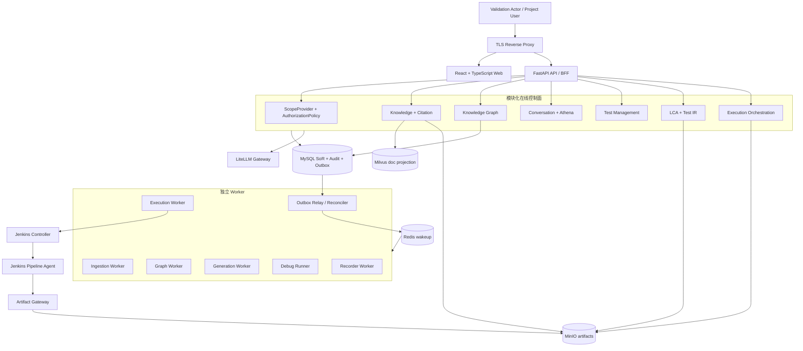
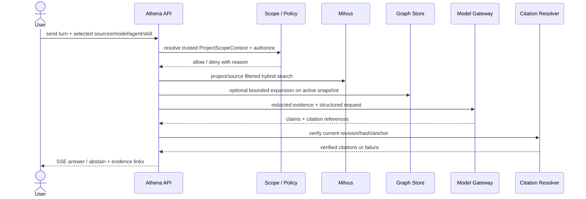
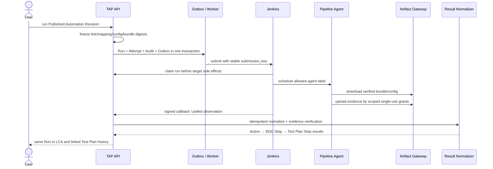

# Athena 知识与 Web 自动化平台架构

| 字段         | 值                                                                                                                           |
| ------------ | ---------------------------------------------------------------------------------------------------------------------------- |
| 文档状态     | Architecture Baseline v0.4，已接受                                                                                           |
| 生效日期     | 2026-09-04                                                                                                                   |
| 规范来源     | [RFC-009：Athena 知识与 Web 测试自动化平台设计](../proposals/2026-09-04-rfc-009-athena-knowledge-web-automation-platform.md) |
| 当前交付主线 | V0–VG：Validation-first、Knowledge-first、Web-only、Jenkins-first                                                            |
| 目标产品形态 | 单一企业、多 Project、多用户；P0 才实施身份/RBAC/多 Project                                                                  |
| 应用技术栈   | React + TypeScript；Python 3.13 + FastAPI/ASGI；MySQL、Redis、MinIO、Milvus、LiteLLM                                         |
| 部署基线     | 企业内网 Linux + Docker Compose；Jenkins Controller/Agent 外置                                                               |
| 当前实现事实 | 已有 loopback Athena `doc` 知识切片和纯前端产品原型；本架构其余能力尚未实现                                                  |

## 1. 架构目标与边界

TAP 把 Athena 的可信知识能力放在最前面，并沿一条可追溯链路逐步增加 Knowledge Graph、AI 测试设计、Web Low Code Automation、录制、Playwright 生成、Jenkins 执行和 Test Plan 结果回写。平台的核心不是一次性生成脚本，而是保存可审查、可发布、可执行和可核验的权威资产。

当前方案先验证产品闭环，再产品化账号体系：

```text
可信知识问答
  → Knowledge Graph
  → AI 生成 Test Plan / Test Case / BDD
  → Web LCA / Recorder / Test IR
  → Playwright TypeScript Bundle
  → Jenkins Pipeline Agent 执行
  → Evidence / BDD Step Result / Test Plan History
  → VG 方案验证
  → P0 用户、Session、RBAC、多 Project
  → P1 生产加固与客户 Pilot
```

当前明确不包含 Mobile/Appium、Azure DevOps、BrowserStack、Git 强制事实源、企业 SSO、专用 Graph DB、Kubernetes HA 或多企业 SaaS。这些能力只能在 P1 之后通过独立设计进入路线图。

## 2. 当前事实与目标状态

| 能力            | 当前仓库事实                                                                | v0.4 目标                                                                     |
| --------------- | --------------------------------------------------------------------------- | ----------------------------------------------------------------------------- |
| Knowledge       | 文档上传、可恢复摄取、Milvus `doc` 投影、限定来源回答与 Citation 基础已实现 | Project-scoped Source、持久 Conversation/SSE、真实脱敏/审计与质量门禁         |
| Knowledge Graph | 前端确定性 fixture                                                          | MySQL Snapshot/Node/Edge/Evidence、真实抽取 Worker 与 WebGL 探索              |
| Test Management | 浏览器内 fixture                                                            | Test Plan/Test Case/BDD Draft、人工发布与不可变 Revision                      |
| LCA             | 浏览器内 fixture、模拟 Run                                                  | 权威 Automation/Test IR、三层编辑、确定性 Playwright 生成与 Web Recorder      |
| Execution       | Azure DevOps/Mobile 仅为旧原型探索                                          | Jenkins-first Provider、Published Revision、Evidence 和 Test Plan 结果投影    |
| Identity        | loopback 固定 demo policy                                                   | V0 typed Validation Actor/Project；P0 User/Session/Membership/RBAC            |
| Deployment      | 开发 Compose 使用 MySQL/Redis/Azurite/Milvus/LiteLLM                        | TAP 独立 MinIO、Milvus、LiteLLM、自托管 Compose 与外置 Jenkins；P1 后才可生产 |

任何页面 fixture、模拟 `Passed`、fake Adapter 或单次本地 smoke 都不能被表述为目标能力已完成。

## 3. 逻辑架构



### 3.1 模块职责

| 模块             | 权威对象                                                                      | 不能承担                                 |
| ---------------- | ----------------------------------------------------------------------------- | ---------------------------------------- |
| Access / Project | Enterprise、Project、Actor Principal、Identity Context、Policy Decision       | Project 内容、模型选择或 Provider Secret |
| Knowledge        | Source、Document Revision、Chunk Manifest、Answer/Evidence Snapshot、Citation | Conversation 生命周期或 Graph 关系事实   |
| Graph            | Graph Snapshot、Node、Edge、Evidence、Inference Provenance                    | 原件、权限 SoR 或无界图遍历              |
| Chat             | Conversation、Turn、Input Snapshot、Artifact Link、SSE Event                  | Test Plan/Automation 内容副本            |
| Test Management  | Test Plan、Test Case、BDD、Revision、Citation、Assumption                     | 自动化动作或执行事实                     |
| Automation       | Automation、Test IR Action、Step Mapping、Bundle Manifest、严格 1:1 Link      | Jenkins build 状态或 Test Plan 历史副本  |
| Recorder         | Recorder Session、Captured Event、Draft Proposal                              | Published Revision 或任意代码执行入口    |
| Execution        | Environment/Target/Profile Revision、Run、Attempt、Evidence、Step Result      | Test Plan/Automation 权威内容            |
| Governance       | Audit、Retention、Tombstone、Support Access                                   | 绕过 Project Policy 的内容读取           |

### 3.2 稳定 Port

领域与应用服务只能依赖以下稳定接口，Adapter 负责具体中间件和供应商：

```python
class ScopeProvider(Protocol):
    async def current(self, request: RequestFacts) -> IdentityContext: ...

class AuthorizationPolicy(Protocol):
    async def authorize(
        self, scope: IdentityContext, action: str, resource: ResourceRef
    ) -> AuthorizationDecision: ...

class SearchPort(Protocol):
    async def search(self, request: SearchRequest) -> SearchResult: ...

class ModelGateway(Protocol):
    async def catalog(self, scope: ProjectScopeContext) -> ModelCatalog: ...
    async def chat(self, request: ChatModelRequest) -> ChatModelResult: ...
    async def embed(self, request: EmbeddingRequest) -> EmbeddingResult: ...
    async def generate_structured(
        self, request: StructuredGenerationRequest
    ) -> StructuredGenerationResult: ...

class ObjectStorePort(Protocol):
    async def put_staged(self, request: PutObjectRequest) -> StagedObject: ...
    async def promote(self, staged: StagedObject, expected_sha256: str) -> ObjectRef: ...

class RecorderPort(Protocol):
    async def allocate(self, request: RecorderAllocationRequest) -> RecorderAllocation: ...
    async def stop(self, session_id: str) -> CapturedEventManifest: ...

class ExecutionProvider(Protocol):
    async def submit(self, request: ExecutionRequest) -> ProviderRunRef: ...
    async def reconcile_submission(
        self, target: ExecutionTargetRevision, submission_key: str
    ) -> SubmissionLookup: ...
    async def get_status(self, provider_run_ref: ProviderRunRef) -> ProviderObservation: ...
    async def cancel(self, provider_run_ref: ProviderRunRef) -> ProviderObservation: ...
    async def fetch_result(self, provider_run_ref: ProviderRunRef) -> ProviderResultManifest: ...
```

Validation 和 Product 身份 Adapter、Milvus 与未来检索 Adapter、单一 LiteLLM Model Gateway、MinIO 与未来对象存储、Jenkins 与未来执行 Provider 都必须通过共同 contract tests；公共 API 不暴露 SDK 私有对象。Knowledge、Graph、Test Plan 与 Automation 只增加各自的结构化输出 Validator，不复制 alias、超时、脱敏和审计逻辑。RFC-006 的直接 Codex CLI 回答端口只保留为既有 loopback Demo 事实；V1 前必须把其 selector/Adapter 从默认 runtime/import graph 移入显式 legacy-loopback composition，后者不挂载 RFC-009 Project API、不计入 V1/VG，也不形成绕过 Model Gateway 的第二模型出口。

## 4. 数据主权与版本

| 存储    | 当前权威职责                                                                                                                      | 明确禁止                                        |
| ------- | --------------------------------------------------------------------------------------------------------------------------------- | ----------------------------------------------- |
| MySQL   | Enterprise/Project/Actor、Conversation、Knowledge ledger、Graph、Test Plan、Automation/Test IR、Run/Attempt/Result、Audit、Outbox | 存大型二进制正文或用无 Project 查询读取业务内容 |
| Redis   | 至少一次唤醒、短期 lease 辅助和可丢缓存                                                                                           | 作为任务、状态、审计或消息唯一事实源            |
| MinIO   | 原文件、标准化文本、Bundle、trace、截图、视频与日志 Evidence                                                                      | 作为权限、版本状态或资产目录事实源              |
| Milvus  | 经过发布的可重建 `doc` hybrid 检索投影                                                                                            | 原件、ACL、Graph 或业务主记录                   |
| LiteLLM | 模型协议与路由                                                                                                                    | 保存 TAP 授权、资产或预算审计事实               |
| Jenkins | 执行一个已 claim 的确定版本并回传观察/结果                                                                                        | 决定 TAP Run 终态、资产版本或 Test Plan 关系    |
| Git     | 可选导出/同步                                                                                                                     | 当前发布、执行或恢复的强制依赖                  |

Knowledge Source 是 Project 内逻辑容器，拥有多个 Document；Document 再拥有不可变 Revision。升级现有本地切片时，为每个 legacy Document 建立同 Project Source，保留 Document ID，并采用 nullable expand → backfill/校验 → FK/non-null contract。Milvus 通过新版本 collection 把旧物理 `tenant_id`/`source_id=document_id` 重建为 canonical `enterprise_id/project_id/source_id` 后原子切换 alias，不在一个 collection 混用新旧含义。

所有 Draft 都可编辑；发布动作经过确定性校验和人工确认后形成不可变 Revision。Published Automation Revision 固化 canonical Test IR、生成器版本、Runner image digest、Playwright Bundle digest 和步骤映射。正式 Run 只能引用 Published Revision，不能在提交时重新生成代码。

Test Plan 与 Automation 是可选、严格双向 `1:1`：数据库同时约束 `(project_id, test_plan_id)` 与 `(project_id, automation_id)` 唯一。关联在 Run 创建事务中冻结；事后关联不追投旧 Run，解除关联不删除历史快照。

## 5. 核心数据链路

### 5.1 可信知识问答



空白 New Chat 不落库；第一条消息同事务创建 Conversation、Turn 与不可变 Input Snapshot，并以 `conversation.turn.requested.inputSnapshotDigest` 固定发送时的 Project、Actor、model alias、Knowledge Revision、AI Agent、Skill 和检索策略。检索、Graph、回答与 Citation 核验完成后，另一事务写不可变 Answer/Evidence Snapshot，并由 `conversation.turn.completed.answerEvidenceSnapshotDigest` 引用其 digest（事件同时带 Snapshot ID）；该快照固定检索摘要、`graph_context_status`、实际使用的 Graph Snapshot ID 和 Citation Snapshot。只有 `APPLIED` 可带 Graph Snapshot ID；输入快照不得追加完成时字段。SSE 使用单调事件序号并支持 `Last-Event-ID` 恢复，取消和重试不覆盖旧 Turn 或快照。

知识上传先写受限 staging，再由无网络、非 root、CPU/RAM/时间有界的 Parser Worker 处理。入口同时校验扩展名、声明 MIME 与 magic/signature；PDF 限制页数和对象规模，DOCX 限制单 entry、总展开量与压缩比并拒绝宏、脚本和外部 relationship。当前只接受可提取文本的 PDF/DOCX/Markdown/TXT，不做 OCR。解析、Chunk Manifest、对象晋级和 Milvus 发布均通过 MySQL 状态/Outbox 可恢复；失败或恶意输入不得在 API 进程内解析，也不得访问外部 URL。

### 5.2 Knowledge Graph

Document Revision ready 后可触发独立 Graph Extraction。模型输出只形成 candidate Snapshot；Node/Edge 必须绑定可解析 Evidence，`INFERRED` Edge 还必须记录输入 Fact IDs 和推导 provenance。确定性校验通过后原子切换 active Snapshot；Graph 失败不回滚已经 ready 的文档检索。

在线回答最多做两跳、受关系类型与节点数量预算约束的图扩展。Graph 页面使用有界子图、搜索、社区筛选、邻居展开、路径高亮和 Evidence Inspector；不能把一次性全图下载或无界路径查询交给浏览器。

### 5.3 Athena 测试设计

Athena 检测到测试设计意图后，同时固定当前 Turn 的 Input Snapshot digest 与 Answer/Evidence Snapshot digest，再生成 Test Plan Draft：前者提供用户选择、Agent/Skill、模型和策略，后者提供实际检索、Graph 与 Citation Evidence。内容至少包括目标、范围、前置条件、风险、Test Case、BDD、Citation、Assumption、Unknown 和 Coverage Gap。模型只能创建 Draft；用户在 Test Management 中审查并发布不可变 Revision。

用户直接要求 Automation 时，Athena 先询问是否创建 Test Plan。Yes 路径返回 Test Plan 与 Automation 深链接并建立严格 1:1；Skip 路径只创建未关联 Automation。Conversation Turn 保存稳定 Artifact Link，不保存可漂移的资产副本。

### 5.4 Web LCA 与 Recorder

LCA 可独立使用，支持自然语言生成、空白创建、手工编辑与受控 Chromium 录制。三层编辑器保持 `BDD Step → Test IR Action → generated code lines` 双向映射；生成代码只读，AI 修改先展示 diff，再由用户 Apply/Reject。

Recorder 运行在独立非 root 隔离 Worker 中，只访问明确的非生产目标 allowlist。它去除 mousemove/focus/重复 click，连续 fill 只保留最终值，等待转为确定性条件；Locator 优先级固定为 `data-testid → role/name → label → stable text → stable CSS → XPath`。敏感输入只产生 `SecretRef`，原值不得进入事件、BDD、IR、代码、日志、截图 metadata 或模型请求。

### 5.5 Jenkins 运行与结果闭环



Run 状态必须正交表达：

- `operation_status`: `QUEUED | RUNNING | SUCCEEDED | FAILED | CANCELLED | TIMED_OUT`
- `test_outcome`: `NOT_RUN | PASSED | FAILED | INCONCLUSIVE`
- `evidence_status`: `PENDING | COMPLETE | INCOMPLETE`
- `submission_status`: `NOT_SUBMITTED | SUBMITTING | SUBMITTED | SUBMIT_UNKNOWN`

Jenkins `SUCCESS` 只是一条 Provider observation，不能直接等于测试通过。`PASSED + INCOMPLETE` 必须保留证据不完整状态。提交响应不确定时进入 `SUBMIT_UNKNOWN`，并经 Port 的 `reconcile_submission(target, submission_key)` 对账 Queue/Build；`NOT_FOUND` 在对账期限前不能证明 Jenkins 未接收，禁止二次 trigger。

## 6. 身份与授权阶段边界

### 6.1 V0–VG Validation Mode

- MySQL 先注册固定 Enterprise、Validation Project 和 typed Validation Actor Principal。
- `ValidationScopeProvider` 只从服务端配置生成 `ProjectScopeContext`；路径中的 `project_id` 必须精确匹配，Header/Cookie/DTO 不能覆盖身份或角色。
- 每个 Project Repository 强制 `project_id` filter，每次外部模型、对象存储、Recorder 或 Jenkins 副作用前再次授权。
- UI 和 Audit 持续显示 Validation Mode；该模式没有个人身份归因，也不能证明多 Project 隔离。
- 只允许验证数据、验证 Secret 和非生产目标；运行环境必须是 loopback 或受控企业内网。

### 6.2 P0 Product Identity

P0 新增 User、Argon2id 密码、Cookie Session、Membership、`PLATFORM_ADMIN` 与 Project `ADMIN/EDITOR/VIEWER`。Platform Admin 可以管理 User/Project，但默认不能读取 Project 内容。创建 Project 与首任 Project Admin 在同一事务完成；最后一个 active Project Admin 不能被删除、停用或降级。

Session Adapter 继续通过同一 `ScopeProvider`/`AuthorizationPolicy` 契约产生 `AnonymousContext | PlatformScopeContext | ProjectScopeContext`。生产装配中 Validation Adapter 必须禁用；正式 Adapter 缺失时启动失败，不能回退固定 Actor。

历史 Validation 事件保持 `identity_mode=validation`，不改写为真实用户。Validation Revision 只能历史读取或 fork；Project Admin 重新审查并发布带 `adopted_from_revision_id` 的 `PRODUCT` Revision 后才可用于产品运行。

## 7. 可靠性与安全不变量

1. 领域状态、Audit、Domain Event 与 Outbox 在一个 MySQL 事务内提交；Redis 只加速分发。
2. 消费者按业务幂等键与 aggregate sequence 去重；lease/fencing 阻止失效 Worker 写入终态。
3. Outbox/Redis 必须有 pending reclaim、acknowledged trim、dead-letter redrive 和归档；失败不能丢失 MySQL 权威工作。
4. MinIO 对象经 staging、SHA-256 校验和 manifest 晋级；API 通过 Artifact Gateway 流式访问，不暴露存储地址。
5. Milvus 与派生 Graph 可重建；删除/撤权先写 Tombstone 并使查询 fail closed，再异步清理投影和对象。
6. 模型、网页、Recorder 事件、Jenkins callback 和所有外部制品均视为不可信；Schema、大小、hash、来源与授权必须确定性验证。
7. API/Web 不挂 Docker socket，不使用 host mount；Runner 非 root、只读根文件系统、限制 CPU/RAM/时长和 egress。
8. Secret 仅以用途绑定的短期 lease/SecretRef 进入受信任执行通道，不进入业务 JSON、模型 Context、Bundle、Evidence 或日志。

## 8. 部署与发布阶段

| 阶段  | 拓扑与身份                                                                                   | 能力声明边界                                      |
| ----- | -------------------------------------------------------------------------------------------- | ------------------------------------------------- |
| V0–VG | 隔离 Compose、固定 Validation Actor/Project、独立验证 Secret、外置非生产 Jenkins             | 只能声明方案验证和技术可行性                      |
| P0    | 同一模块/Port 加 User/Session/Membership/RBAC、多 Project UI，禁用 Validation Adapter        | 可以声明产品身份与隔离通过，不等于生产就绪        |
| P1    | 独立 Staging/Production 配置、TLS/私网、Secret 轮换、OTel、备份恢复、retention、容量与 Pilot | 所有门禁和客户清单通过后才可声明 Production ready |

首个参考容量 Profile `REF-COMPOSE-01` 固定为 32 vCPU、128 GiB RAM、2 TiB SSD、1 Gbit 网络，50 Project、200 User、100 万 chunks、50 个交互会话、5 个 Recorder 和 20 个 Jenkins Run。该数值是待实测的发布门禁，不是当前吞吐承诺。

## 9. 里程碑与出口

| 里程碑 | 可独立验收的出口                                                                             |
| ------ | -------------------------------------------------------------------------------------------- |
| V0     | Scope 不可覆盖、Policy contract、Actor FK、origin/schema drift、恢复与 Outbox/Redis 运维通过 |
| V1     | 持久 Conversation/SSE、真实 Milvus/模型、引用核验与 `QUALITY-KB-01` 通过                     |
| V2     | Graph Evidence/Provenance、真实抽取、WebGL 探索与 `QUALITY-GRAPH-01` 通过                    |
| V3     | 带引用 Test Plan/BDD Draft、人工发布和 `QUALITY-TEST-01` 通过                                |
| V4     | BDD/Action/Code 映射、确定性 Bundle、真实 Web 录制/重放和隔离门禁通过                        |
| V5     | 真实 Jenkins E2E、claim fencing、重复 callback/未知提交、Evidence 与 Test Plan 投影通过      |
| VG     | 代表性知识和目标 Web 流程完成业务验收；产品负责人书面决定继续、调整或停止                    |
| P0     | Validation Adapter 禁用，Session/CSRF/RBAC/last-admin/跨 Project/origin adoption 全部通过    |
| P1     | 恢复、容量、安全负矩阵和受控客户 Pilot 全部通过                                              |

具体编码顺序、精确文件、测试与提交边界见 [实施计划](../plans/2026-09-04-athena-knowledge-web-automation-platform.md)。

## 10. 当前决策链

- [ADR-020：Validation-first 交付](../decisions/2026-09-04-adr-020-validation-first-delivery.md)
- [ADR-021：Knowledge-first Web Automation](../decisions/2026-09-04-adr-021-knowledge-first-web-automation-delivery.md)
- [ADR-022：自托管 Docker Compose](../decisions/2026-09-04-adr-022-self-hosted-compose-delivery-baseline.md)
- [ADR-023：Milvus + MySQL Graph](../decisions/2026-09-04-adr-023-milvus-mysql-knowledge-backend.md)
- [ADR-024：TAP-managed Automation Revision](../decisions/2026-09-04-adr-024-tap-managed-automation-revisions.md)
- [ADR-025：Jenkins-first Execution Provider](../decisions/2026-09-04-adr-025-jenkins-first-execution-provider.md)
- [ADR-009：MySQL Outbox + Redis 至少一次分发](../decisions/2026-08-20-adr-009-mysql-outbox-redis-delivery.md)
- [ADR-010：模块化控制面与独立 Worker](../decisions/2026-08-20-adr-010-modular-control-plane-independent-workers.md)
- [ADR-015：React/TypeScript + Python/FastAPI](../decisions/2026-08-21-adr-015-react-typescript-python-fastapi.md)

RFC-009 是完整数据模型、API、事件、质量阈值和风险说明的规范来源；本文只提供当前总体架构视图，不重复扩展 RFC 范围。
