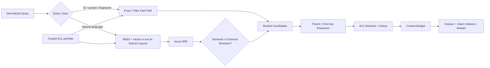

# 后置 Knowledge Plane：Azure AI Search 检索调优方案

> **阶段说明（2026-09-02）**：本文保留旧企业 RAG 阶段的检索实验设计；[ADR-019](../../decisions/2026-09-02-adr-019-phase-1-intelligence-layer-exploration.md) 已将完整 Azure AI Search 调优后置。当前 Intelligence 评测只对实际接入的 Athena `doc` 来源能力作结论。

本文定义 TAP 如何从可复现 baseline 出发，逐步调优 Azure AI Search 的全文、向量、RRF、semantic ranker、scoring profile、跨索引融合与回答上下文。目标不是“把所有高级开关都打开”，而是让每项能力在真实评测集上证明增益。

## 1. 调优原则

1. 先冻结数据、query、ACL 和答案标注，再调参数。
2. 每次实验只改变一个主要变量；chunker、embedding、index schema、query 和 prompt 分别版本化。
3. 四个 index family 与不同 query class 分开报告，不能用总体平均掩盖弱项。
4. 召回、排序、context、生成分层评测；不要用最终答案分数猜测检索问题。
5. 安全 filter 是硬边界，不属于相关性调参。
6. 只把通过离线回归和线上灰度的配置发布为新的 `retrievalProfileVersion`。
7. 默认使用稳定 API；Preview 功能全部 feature flag 化并保留关闭路径。

## 2. Query Classifier

先确定 query class，再选择检索 profile：

| Query class | 识别信号 | 默认路径 | 主要指标 |
| --- | --- | --- | --- |
| Exact identifier | Test ID、symbol FQN、commit、error code、fingerprint | keyword/filter exact → hybrid fallback | Top-1/Top-3 |
| Document QA | “如何/为什么/是什么”、自然语言概念 | doc hybrid → semantic ranker → Parent/Child | Recall/nDCG/citation |
| Code navigation | path、symbol、signature、调用关系 | exact symbol + code hybrid + 一跳关系 | symbol hit、line accuracy |
| BDD/Test asset | Feature/Scenario/Step/tag | exact stable ID + bdd hybrid | scenario hit、asset precision |
| Failure diagnosis lookup | error/fingerprint/environment | exact fingerprint + failure hybrid | incident hit、resolution precision |
| Cross-index question | code ↔ BDD ↔ failure 或跨章节 | per-index retrieval → cross-index RRF → bounded expansion | coverage、faithfulness |
| No-answer/conflict | 语料无证据或 revision 冲突 | retrieval → calibrated abstention | abstention accuracy |

分类结果只影响检索策略，不能扩大客户端的 source/tenant/project 范围。ID/symbol/fingerprint 路径禁止默认 query rewrite，避免精确标识符被改写。

## 3. 评测阶梯

每个阶梯保存完整配置、结果和差异：

| Lane | 配置 | 用途 |
| --- | --- | --- |
| B0 | BM25 only | 词法 baseline；验证 analyzer、exact、searchFields |
| B1 | Vector only | 验证 embedding、chunk 语义质量与 HNSW Recall |
| B2 | BM25 + Vector + Azure RRF | 单索引 hybrid baseline |
| B3a | B2 + Azure semantic ranker | 评估内建 L2 rerank |
| B3b | B2 + 外部 cross-encoder reranker | 与 B3a 对照；不默认双重 rerank |
| B4 | 最优单索引方案 + cross-index RRF + Parent/Child/一跳依赖 | 完整 Retrieval API |
| B5 | B4 + bounded query decomposition | 只用于确有跨章节增益的 query class |

发布规则：

- B2 必须稳定优于 B0，才能成为默认 hybrid。
- B3a 与 B3b 用同一候选集比较；默认只选择一个 rerank 路径。若叠加两者，必须单独证明收益、时延和成本。
- B4 的跨索引融合只使用 rank/RRF，不直接比较各索引的原始 `@search.score`。
- B5 仍是有上限的检索计划，不演变成 Phase 1 Agentic Loop。

## 4. 单索引默认链路



AI Search 在一个 hybrid request 中并行执行 BM25 与 vector，并用 RRF 合并。Semantic ranker 只重排已有文本候选，不替代召回；启用时把 vector `k` 的首轮候选设为 50 作为实验 baseline，再根据质量/成本调节。

Security filter 显式使用 `vectorFilterMode: preFilter`。高选择性 ACL 可能增加 HNSW 遍历与时延，因此要分别压测；不能为降低时延切到可能产生 false negative 的 post-filter 模式而不做评测。

## 5. RetrievalProfile

所有线上查询引用不可变 profile：

```yaml
retrievalProfileId: doc-qa-hybrid-v7
indexFamily: doc
apiMode: stable
query:
  analyzerPolicy: multilingual-v2
  searchFields: [title, sectionPath, content, tags]
  searchMode: any
  synonymMapVersion: domain-v3
vector:
  embeddingModelVersion: embed-multilingual-v3
  k: 50
  weight: 1.0
  filterMode: preFilter
  exhaustive: false
ranking:
  semanticConfiguration: tap-doc-semantic-v2
  scoringProfile: doc-authority-freshness-v1
  externalReranker: null
crossIndex:
  enabled: false
context:
  maxChunks: 10
  maxTokens: 7000
  parentExpansion: 2
  neighborExpansion: 1
answer:
  promptVersion: grounded-qa-v4
  abstentionPolicyVersion: abstain-v2
```

Profile 存入 Git，发布记录进入 MySQL。Retrieval Trace 必须记录实际生效值，而不只记录 profile 名称。

## 6. 调参维度

### 6.1 切片与 Embedding

- 文档 chunk size、同 section overlap、标题路径注入、table 保留方式。
- 代码 symbol 完整度、超长 symbol 拆分、signature/docstring/context 注入。
- BDD Scenario/Examples 组合方式；Failure 日志窗口和 resolution 字段。
- 原始 `content` 与 `embeddingText` 的差异；摘要是否提供稳定增益。
- Embedding 模型、维度、语言覆盖；任何切换都创建新向量空间/索引。

实验网格不要一次跑所有组合。先固定 embedding 比较 chunker，再固定最佳 chunker 比较 embedding，防止因变量混淆。

### 6.2 BM25

- Analyze Text API 验证 analyzer/tokenizer 对中文、英文、ID、symbol、path 和错误码的处理。
- 分离 exact keyword 字段与自然语言 searchable 字段。
- 调 `searchFields`、`searchMode any/all`、受控 synonym、短语/term boost。
- Scoring profile 可加权 title、symbol、signature、fingerprint、权威来源或有限 freshness；不能作为权限控制。

### 6.3 Vector

- 对抽样 query 使用 `exhaustive: true` 生成近邻 ground truth，再评估 HNSW Recall。
- 调 `k`、vector weight、HNSW profile；不要用不同算法产生的绝对 score 设统一阈值。
- 只有质量稳定后才实验 quantization、oversampling 和 rescoring。
- `filterOverride` 在 Phase 1 禁用；浏览器、模型和普通调用方都不能覆盖顶层 security filter。

### 6.4 Semantic 与 Reranker

- 每个 index family 单独排列 semantic title/keyword/content 字段。
- Doc、BDD、Failure 默认进入 B3a；Code 先验证 code summary 是否真正提升。
- Semantic ranker、外部 reranker 的候选数、top-N、时延和成本分别记录。
- Query rewrite 只作为自然语言 query 的 Preview 实验，精确 ID/产品码/symbol 路径始终关闭。

### 6.5 Cross-index 与 Context

- 每个索引内部先独立检索；应用层按 per-index rank 做 RRF。
- 为 query class 配置 family weight，但任何权重都必须有评测证据。
- Parent/Child、一跳代码关系和相邻 chunk 扩展后再次执行相同 ACL。
- 去重同 source/parent，限制每个 family 的最大贡献，避免一个长文档挤占全部 context。
- Context pack 保存顺序、chunk hash、token count 和裁剪原因；生成模型只能引用 pack 中存在的 source token。

## 7. Golden Dataset 与指标

首版至少 120 个经人工复核的问题：每个 family 至少 25 个，另有至少 20 个跨索引、无答案、冲突来源或过期 revision 样例；另运行至少 1,000 个 ACL negative probes。

| 层 | 指标 |
| --- | --- |
| Exact | Top-1、Top-3、identifier normalization errors |
| Retrieval | Recall@K、Precision@K、MRR、nDCG@10、per-family coverage、zero-result rate |
| Expansion | useful parent/edge rate、ACL rejection count、context duplication |
| Answer | citation precision/coverage、faithfulness、unsupported claim、abstention accuracy |
| Freshness | change/delete/revoke 到生效的 P50/P95/P100 |
| Performance | Search、rerank、首 token、完整回答 P50/P95、token/cost |
| Security | unauthorized candidate/context/citation/trace/history/facet count |
| Planning | intent/source-family accuracy、standalone-query correctness、required-resource hit/abstain、subquery usefulness |

首轮候选门槛：

- Exact ID/symbol/fingerprint Top-3 为 `100%`。
- 总体 `Recall@10 ≥ 0.85`，任一 family 不低于 `0.75`。
- 总体 `nDCG@10 ≥ 0.70`。
- citation precision `≥ 0.95`，citation coverage `≥ 0.90`。
- 无答案识别准确率 `≥ 0.90`，unsupported claim rate `≤ 0.02`。
- 1,000 个 ACL probes 中 unauthorized hit/context/citation/facet/trace/history 为 `0`。
- 新 profile 相比当前生产 profile 的主要指标有稳定增益，且任一 family 不出现未批准回退。

时延、撤权和成本先测真实基线，再由 Owner 批准 SLO，不把实验数值直接承诺为生产目标。

## 8. 调试与复现

诊断角色可以使用 AI Search `debug=vector|semantic|all` 获取 subscore，Retrieval Inspector 展示：

- normalized query、query class、目标 alias/physical index。
- server-compiled filter 的脱敏表示与 ACL decision ID。
- exact/BM25/vector 的候选排名和 subscore。
- Azure RRF、semantic/external rerank、cross-index RRF 前后顺序。
- Parent/edge expansion、去重、裁剪、最终 context。
- profile、corpus、schema、embedding、reranker、prompt 版本及各阶段耗时。

`debug` 增加开销，只允许诊断请求临时启用；Trace 读取每次重新授权，不能展示隐藏思维链、原始 group IDs、秘密或未授权候选正文。

复现一个线上 query 时固定：source/corpus/index aliases resolution、QueryPlan/Context Snapshot、RetrievalProfile、planner/classifier output、Embedding/reranker/prompt version、Policy Context digest 和 conversation summary lineage。

若启用 Codex enrichment，必须做 `enrichment off/on` 独立 ablation，并报告派生 summary/关系对 Recall、nDCG、citation、unsupported claim、ACL、时延与成本的增益或回退。Codex Research Agent 的任务完成率不能混入基础 Retrieval 指标；应与确定性 Deep Retrieval 在相同 query/corpus/policy 下单独对比。

## 9. 反馈闭环

Knowledge Chat 每个答案提供 👍/👎，负反馈至少包含：

- 答案错误或无依据。
- 引用错误/缺失/打不开。
- 搜不到已知资料。
- 来源过期或 revision 错误。
- 返回了不应看到的内容。
- 速度慢或结果太多/太少。

反馈绑定 `projectId + conversationId + turnId + traceId + corpusVersion + retrievalProfileId`。人工复核后进入 Golden Dataset 候选，不能直接由线上点击自动修改权重或 prompt。

发布流程：离线 ablation → 安全回归 → replay 流量影子测试 → 小比例灰度 → 指标/反馈观察 → 扩大或回滚。任一 ACL 泄漏、不可解析 citation 或主要指标超过批准回退阈值时阻断发布。

## 10. 官方依据

- [Azure AI Search relevance and ranking](https://learn.microsoft.com/en-us/azure/search/search-relevance-overview)
- [Hybrid search](https://learn.microsoft.com/en-us/azure/search/hybrid-search-overview)
- [RRF scoring and debug subscores](https://learn.microsoft.com/en-us/azure/search/hybrid-search-ranking)
- [Vector query filters](https://learn.microsoft.com/en-us/azure/search/vector-search-filters)
- [Scoring profiles](https://learn.microsoft.com/en-us/azure/search/index-add-scoring-profiles)
- [Configure semantic ranker](https://learn.microsoft.com/en-us/azure/search/semantic-how-to-configure)
- [Hybrid query tuning and filter override](https://learn.microsoft.com/en-us/azure/search/hybrid-search-how-to-query)
- [RAG information retrieval evaluation](https://learn.microsoft.com/en-us/azure/architecture/ai-ml/guide/rag/rag-information-retrieval)
