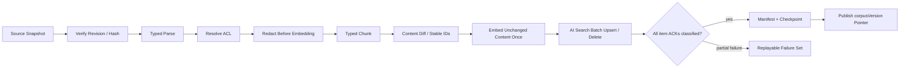

# Phase 1：数据切片与端到端溯源

本文定义 TAP 如何把 Git、Blob 和 MySQL 中的文档、代码、BDD 与失败记录转换为 Azure AI Search 中可检索、可重建、可解释的 chunk，并保证知识问答中的每条引用能够回到不可变原始版本。

## 1. 设计结论

- Azure AI Search 是四类知识的索引与检索引擎，不是内容或权限的权威源。
- TAP 在 AKS 中掌握 parser、chunker、ACL、脱敏、稳定身份、Embedding、删除传播和 manifest。
- 四类内容进入四个 chunk-centric 索引；每个 chunk 重复必要的 parent、ACL 与 provenance 字段，不依赖查询期 join。
- Phase 1 的四类语料全部走 TAP Push API，保证统一 `ChunkEnvelope`、业务 `chunkId`、ACL、manifest 与删除语义。AI Search indexer/skillset/index projection 只作为后续通用 Blob 文档 POC，不接入 active corpus。
- 自动生成的摘要只是带 provenance 的派生 chunk，不能取代原文，也不能跨 ACL 合并内容。

微软推荐的 index projection 模式同样以 chunk 为搜索文档，并在 child 上重复 parent 字段；但该机制只适用于 indexer/skillset 管线，而且 projection 的 document key 由服务生成，不能假设等于 TAP 的 `chunkId`。Phase 1 只借鉴其扁平数据形状，不采用 projection writer。若后续 POC 接入，必须使用隔离物理索引和独立 `searchDocumentKey`，显式保存它到业务 `chunkId` 的 lineage，评测通过后才能进入 active corpus。

## 2. 统一 ChunkEnvelope

所有 parser/chunker 必须产出同一逻辑契约，再映射到 `kb-doc-v1`、`kb-code-v1`、`kb-bdd-v1` 或 `kb-failure-v1`：

```yaml
schemaVersion: 1
identity:
  tenantId: tenant_123
  projectId: project_456
  sourceId: repo:checkout-service:src/payment.ts
  logicalChunkId: h_0123456789abcdef...
  chunkId: h_fedcba9876543210...
  rootId: h_...
  parentId: h_...
source:
  type: code
  uri: git://checkout-service/src/payment.ts
  revision: 0123456789abcdef
  sourceContentHash: sha256:...
  observedAt: 2026-08-21T09:00:00Z
anchor:
  kind: line_range
  value: L120-L184
chunk:
  kind: function
  level: leaf
  contentRole: source
  derivedFromChunkIds: []
  ordinal: 7
  title: authorizePayment
  content: "..."
  chunkContentHash: sha256:...
  tokenCount: 642
  language: typescript
security:
  allowedGroupIds: [group_payments]
  classification: internal
  environment: global
  aclVersion: 12
  redactionStatus: completed
pipeline:
  parser: tree-sitter-typescript
  parserVersion: "..."
  chunkerVersion: code-v1.2
  embeddingModelVersion: embed-multilingual-v3
  embeddingDimensions: 3072
  pipelineVersion: rag-ingest-v1.4
derivation: null
publication:
  indexFamily: code
  physicalIndex: kb-code-v1-20260821
  corpusVersion: corpus-2026-08-21-01
```

字段规则：

- `sourceId` 表示逻辑来源，rename/move 通过 Source Alias 记录，不靠可变 URI 维持身份。
- `anchor` 必须能定位回原件：文档使用 heading/page/offset，代码使用 symbol + line range，BDD 使用 Feature/Scenario/Step，失败记录使用 incident/evidence ref。
- `sourceContentHash` 固定完整 source snapshot，`chunkContentHash` 固定当前 chunk 文本；任何回答引用都携带两者，不能用一个多义字段替代。
- `contentRole` 只允许 `source` 或 `generated_summary`；后者必须保存 `derivedFromChunkIds`、生成模型和 prompt version。
- 所有 parser、chunker、Embedding、脱敏和 Schema 版本必须可查询，不能只写在部署配置里。
- `publication` 记录实际物理索引与 corpus；蓝绿升级后仍能解释历史答案命中了哪个索引版本。

## 3. 身份模型

逻辑身份与不可变 snapshot 身份分离：

```text
hashId(value) = "h_" + lowercaseHex(SHA-256(value))

logicalChunkId = hashId(
  tenantId | projectId | sourceId | structuralLocator | chunkKind
)

chunkId = hashId(
  logicalChunkId | sourceRevision | chunkContentHash | chunkerVersion
)
```

- 同一逻辑章节或 symbol 在新 revision 中保留 `logicalChunkId`，便于 diff、反馈迁移和新旧版本对比。
- source revision、内容或 chunker 版本变化时产生新的 `chunkId`，历史回答不会被新内容悄然改写。
- 文件 rename 先解析 alias；无法确定为 rename 时创建新 `sourceId`，不使用模糊相似度自动合并历史。
- `rootId`、`parentId` 同样采用逻辑身份；具体命中的 snapshot 通过 `chunkId` 和 `sourceRevision` 固定。
- `chunkId` 是 Azure AI Search document key，必须使用其允许的 URL-safe 字符；TAP 采用 `h_` + 64 位小写 hex，不把 `sha256:`、URI 或路径直接作为 key。

## 4. 分型切片策略

下面数值是首轮实验起点，不是生产常量。每次修改都升级 `chunkerVersion`，使用冻结 Golden Dataset 做 A/B 与回归。

| 类型 | 结构边界 | 首轮参数 | 必须保留的上下文 | 禁止做法 |
| --- | --- | --- | --- | --- |
| 文档 | Document → Section → Leaf；标题、段落、列表、表格 | Leaf 目标 350–700 tokens，硬上限约 900；仅同一 section 内 10–15% overlap | 文档标题、完整 heading path、页码/offset、发布日期、owner | 跨章节机械 overlap；把整份大文档作为一个 chunk |
| 文档摘要 | Document Summary、Section Summary | Section 120–250 tokens；Document 150–300 tokens | 被摘要 child IDs、生成模型/提示版本、ACL | 混合不同 ACL child；摘要没有回链 |
| 代码 | Repository/File → Class/Function/Method/Symbol | 一个 symbol 优先一个 chunk；超长 symbol 按语义块拆到 600–1,000 tokens，80–120 tokens overlap | repo、commit、path、FQN、signature、docstring、line range、imports/calls | 把源码转 Markdown；按固定字符长度切；索引 vendor/generated/binary/secret |
| BDD | Feature → Scenario → Step/Examples | 一个 Scenario 优先一个 leaf；通常 200–600 tokens | Feature 背景、tags、Examples、stable Test ID、Test IR ref | 把一个 Scenario 的 Steps 拆散后失去顺序 |
| 失败记录 | Incident/fingerprint → 摘要与处置 | 300–800 tokens；同一 fingerprint 的单次 Incident 保持完整 | run/attempt、test/revision、环境矩阵、错误类型、resolution、evidence refs | 索引完整 HAR、视频或未脱敏日志；把多个无关失败拼成一个 chunk |
| OpenAPI/AsyncAPI | Service → Endpoint/Operation | 每个 operation 一个 leaf；超长 Schema 独立 child | method/path、operationId、request/response schema refs、版本 | 按 PDF 页或固定窗口打散 Endpoint |

### 4.1 文档切片

1. 从 Blob 获取不可变 object version/hash。
2. 用版面解析器提取标题层级、段落、列表、表格、页码和 offset；扫描件先 OCR，并记录 OCR 置信度。
3. 以 section 为天然边界合并短段落；超过上限时按句子/段落继续拆分。
4. 表格保留表头和行组，不把表头与数据行拆开；图片只索引经批准的描述及原图引用。
5. 为 leaf 生成 Section Summary 与 Document Summary；摘要是否默认启用由评测决定。
6. 每个 child 重复 document title、heading path、ACL 与 revision，便于 AI Search 在一个索引内直接过滤和返回。

Blob 文档可将 Azure Content Understanding/Document Intelligence 作为 `DocumentStructureExtractor` 适配器；提取结果仍由 TAP 完成 ID、ACL、脱敏、manifest 和 Push API 发布。Phase 1 不让原生 AI Search projection 直接写 active index。

### 4.2 代码切片

1. 固定 Git commit，应用 include/exclude 规则并做 secret scan。
2. 用语言 parser 生成 AST、symbol、signature、docstring、imports、calls 和 test references。
3. Class/Function/Method 优先保持完整；过长 symbol 按语句块或内部函数边界拆分。
4. 在 chunk 前部注入最小结构上下文：FQN、signature、所属 class/module；源码正文保持原语言。
5. 依赖边单独保存为一跳 adjacency，边的访问也继承源 symbol ACL。

### 4.3 BDD 与失败切片

- BDD 保留 Feature background、Scenario、Examples 与 Step 顺序，并把 stable Test ID 作为 exact/filter 字段。
- Failure 先归一化 error type 与 fingerprint，再生成脱敏 Incident 摘要；原始 screenshot/log/HAR/video 仍在 Blob，只保存 `evidenceRefs + hash`。
- 失败修复后写入 fix revision、verification outcome；不要覆盖原 Incident，以便检索历史演进。

### 4.4 派生摘要的确定性

LLM summary 可能在相同输入下产生不同文本，因此不能一边实时重生成，一边承诺相同 pipeline 能重建相同 `chunkId`。TAP 使用不可变 Derivation Artifact：

```text
derivationKey = hashId(
  orderedDerivedFromChunkIds
  | sourceRevision
  | modelSnapshot
  | promptVersion
  | decodingProfile
  | redactionPolicyVersion
)
```

首次成功生成后，把 summary 文本、`chunkContentHash`、模型 snapshot、prompt、解码参数与输入 chunk IDs 固化到 Blob/MySQL manifest；同一 `derivationKey` 的重建只复用该 artifact，不再次调用模型。要重新生成必须显式升级 prompt/model/decoding/policy 版本并产生新的 derivation artifact 和 `chunkId`。如果 artifact 遗失，重建标记失败，不能悄然生成一份不同内容冒充历史摘要。

## 5. Ingestion 与发布链路



执行约束：

1. Source revision/hash 未固定前不开始切片。
2. ACL 服务不可用时 fail closed；空 group 列表不自动等于 public。
3. 脱敏在 Embedding 之前完成，避免秘密留在向量中。
4. 使用 `logicalChunkId + chunkContentHash + pipeline versions` 计算 diff，未变化内容不重复 Embedding。
5. 批量写入后逐条处理 AI Search status；成功、可重试、永久失败分开记录。
6. rename、删除、ACL 收紧产生 tombstone；在 active corpus 发布前完成对账。
7. 新 schema/embedding dimension 创建 `*-v2`；全量重建与评测通过后逐 family 更新 alias，确认传播完成，再原子切换 TAP 的 `activeCorpusVersion` 应用层指针。

Phase 1 不要求实时 CDC。Git snapshot、Blob scan/event 和 Failure Export Manifest 足以形成增量闭环；MySQL Outbox/实时事件可以在平台运行面建设后接入。

## 6. Azure AI Search 字段映射

每个 family 使用一个以 chunk 为中心的物理索引：

- key：`chunkId`，`Edm.String`，不参与全文分析；通过 key lookup/filter 精确使用。
- filterable：tenant/project/groups/classification/environment、sourceId、revision、root/parent/logical ID、tags、status、corpusVersion。
- searchable/retrievable：title、heading/symbol/scenario/fingerprint、content、keywords。
- vector：`contentVector`，维度与 `embeddingModelVersion` 固定绑定。
- sortable/facetable 只对明确的 UI/诊断需求开放，避免索引膨胀与 ACL facet 侧漏。

AI Search 没有查询期 join。Parent/Child 通过重复 parent 元数据和 `parentId/rootId` 过滤恢复；不同 index family 的结果在 TAP Retrieval Service 中按排名融合。

## 7. 溯源账本

MySQL 至少保存以下逻辑记录：

| 记录 | 关键内容 |
| --- | --- |
| `knowledge_source_revision` | sourceId、URI、revision、hash、owner、ACL/version、删除状态 |
| `ingestion_run` | 输入 snapshot、pipeline/parser/chunker/embedding/schema 版本、状态、计数、错误 |
| `chunk_manifest` | logical/chunk/root/parent ID、anchor、hash、token 数、redaction 状态 |
| `index_publication` | physical index、corpusVersion、批次 ACK、manifest hash、切换与回滚时间 |
| `retrieval_trace` | actor/ACL digest、query plan、filter、候选、subscores、最终 context、配置版本 |
| `answer_trace` | conversation/message、模型/提示版本、context hash、claims、拒答原因 |
| `citation_edge` | claimId → chunkId → sourceRevision + anchor + sourceContentHash + chunkContentHash |

完整正向链路：

```text
Source revision
→ Parse/Redaction manifest
→ logicalChunkId + immutable chunkId
→ Embedding/index publication
→ Retrieval trace and score components
→ Answer context
→ Claim-level citation
```

用户从回答反向点击引用时必须得到：来源标题、类型、不可变 revision、anchor、原文片段、chunk hash、索引 corpus、当前权限判断和“为什么命中”的可解释信号。原件已删除或用户已撤权时只显示引用失效状态，不从历史 trace 泄露内容。

## 8. 删除、重建与对账

- Source 删除：删除所有当前 `sourceId` child，并在 manifest 中记录 tombstone。
- 内容缩短：对比 logical IDs，删除不再存在的 child；不得只 upsert 新集合。
- ACL 收紧：优先更新/删除旧 chunk，再发布新 corpus；撤权 SLA 单独监控。
- Parser 失败：旧 corpus 可继续服务，但 UI 标记数据新鲜度；失败源进入可重放列表。
- 全量重建：从 Git/Blob/MySQL source manifest 生成新物理索引，按 source/chunk/hash/ACL 计数对账后切换。
- 历史索引：只保留批准的回滚窗口；不能作为绕过当前权限的历史搜索入口。

## 9. 验收标准

- 每种 source type 都能从一个答案引用反查到不可变原件位置。
- 同一 snapshot 与 pipeline version 重放，`chunkId`、数量和 hash 完全一致。
- 修改一个 section/symbol 时，只重算受影响 chunk；未变化内容不重复 Embedding。
- rename、删除、ACL 收紧、部分批次失败和 parser 升级都有自动化用例。
- 任意 parent summary、依赖边、facet、trace 与历史 corpus 都不能造成 ACL 侧漏。
- 四个物理索引可从 manifest 重建；四 alias 传播窗口不会混入新旧 corpus，应用层 active corpus pointer 发布与回滚演练通过。

## 10. 官方依据

- [Azure AI Search index projections](https://learn.microsoft.com/en-us/azure/search/search-how-to-define-index-projections)：chunk-centric index、parent 字段重复、ACL 映射及变更/删除行为。
- [Chunk and vectorize by document layout](https://learn.microsoft.com/en-us/azure/search/search-how-to-semantic-chunking)：按标题、段落和句子形成结构一致的 chunk。
- [Azure AI Search hybrid search](https://learn.microsoft.com/en-us/azure/search/hybrid-search-overview)：全文与向量并行查询及 RRF 融合。
- [Azure AI Search naming rules](https://learn.microsoft.com/en-us/rest/api/searchservice/naming-rules)：document key 的长度与允许字符。

官方能力只用于校正产品事实。四索引、稳定逻辑身份、分型 parser/chunker 和 MySQL 溯源账本是 TAP 的应用层决策。
