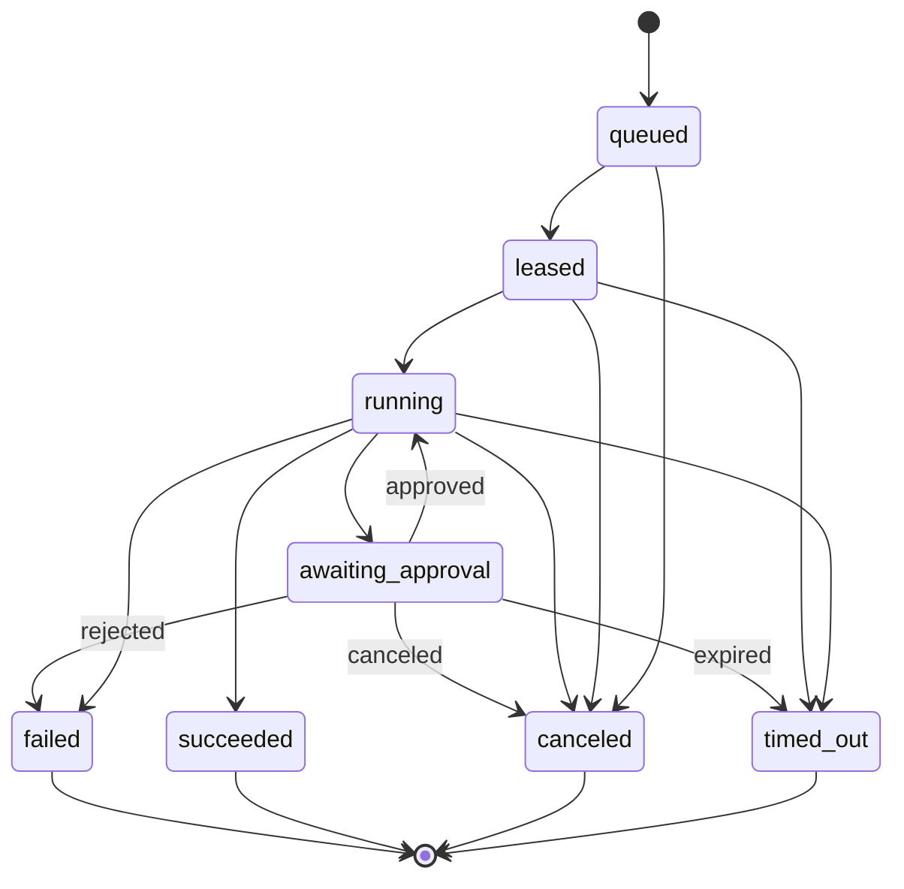

# TAP 核心契约

本页定义架构级契约，而不是最终 API。字段在实现前可以扩展，但不能破坏不可变性、幂等、租户隔离和可追溯性。框架代码、BrowserStack capability 和 Agent Runtime 对象都不能成为领域契约。

## 1. Test IR 与稳定身份

Test IR 是 Git 中版本化的核心资产。稳定身份与文件路径、名称和执行框架解耦：

```yaml
apiVersion: tap.dev/v1alpha1
kind: TestCase
metadata:
  id: test_checkout_happy_path
  projectId: commerce-web
  aliases: []
spec:
  intent: "已登录用户完成信用卡结账"
  steps:
    - id: submit_payment
      action: click
      target: { locatorRef: checkout.submit }
  assertions:
    - type: url_matches
      value: /orders/*
```

约束：

- `metadata.id` 创建后不可复用；重命名通过 alias/migration 表达。
- Test IR revision 由 Git commit + content hash 标识，不使用可变 branch 名。
- action、target、assertion、fixture 和 secret 必须是版本化 typed vocabulary。
- 自定义能力通过显式 extension namespace 表达；禁止把任意 Shell 当通用 action。
- MySQL 保存 Test catalog/projection 与 revision 映射，内容版本以 Git 为准。

## 2. RunSpec

Run 创建后冻结。任何重跑都创建新的 Attempt；改变工作流、策略或 revision 必须创建新 Run。

```yaml
apiVersion: tap.dev/v1alpha1
kind: Run
metadata:
  tenantId: tenant_123
  projectId: project_456
  idempotencyKey: github:delivery:abc123
spec:
  trigger:
    type: github.pull_request
    actor: github:user:octocat
  source:
    repository: github:owner/repo
    revision: 0123456789abcdef
    baseRevision: fedcba9876543210
  testAssets:
    - id: test_checkout_happy_path
      revision: 0123456789abcdef
      contentHash: sha256:...
  workflowRef:
    id: pr-quality
    version: 7
  policyRef:
    id: default-engineering
    version: 4
  budget:
    deadlineSeconds: 3600
    maxAgentTokens: 200000
    maxProviderMinutes: 120
  requestedCapabilities:
    - agent.analysis
    - test.web.e2e
```

## 3. Task 与 Attempt

- Task 是归一化逻辑工作项，可以来自 Workflow DAG 节点，也可以来自 Agentic Loop 某轮规划的 action。
- DAG Task 具有稳定 node key；Loop Task 必须记录 `plan_iteration`、`action_id` 与产生它的 causation event。
- Loop 在产生任何工具或外部副作用前，必须先持久化 Task/Attempt；动态规划不能绕开运行状态机。
- Attempt 是 Task 的一次物理执行，具有单调递增序号。
- 重试不能复用外部 Provider attempt ID 或 Agent session ID。
- Task 成功规则由 Workflow 定义；Attempt 终态不可修改。

下面是 **Attempt 状态机**；Task 的汇总结论由 Workflow/Plan 根据一个或多个 Attempt 计算。



未知或供应商特有状态映射为 `running` 加诊断属性，不能乐观映射为 `succeeded`。

## 4. RunEvent

```json
{
  "event_id": "evt_...",
  "event_type": "attempt.completed",
  "occurred_at": "2026-08-20T14:00:00Z",
  "tenant_id": "tenant_123",
  "run_id": "run_...",
  "task_id": "task_...",
  "attempt_id": "attempt_...",
  "sequence": 42,
  "idempotency_key": "provider:browserstack:session:...:completed",
  "actor": { "type": "system", "id": "browserstack-adapter" },
  "trace_id": "...",
  "correlation_id": "run_...",
  "causation_id": "evt_previous_...",
  "schema_version": 1,
  "data": {}
}
```

约束：

- 同一 Run 的 `sequence` 单调递增。
- Producer 重复投递相同 `idempotency_key` 不产生第二个业务事实。
- Schema 只做向后兼容扩展；破坏性变化升级 `schema_version`。
- 事件中只存小型结构化事实；大载荷进入 Blob 并用 ArtifactRef 引用。

## 5. Provider Port

### AgentRuntime

```typescript
interface AgentRuntime {
  capabilities(): Promise<CapabilitySet>;
  start(task: AgentTask, policy: RuntimePolicy): Promise<RuntimeHandle>;
  events(handle: RuntimeHandle, cursor?: string): AsyncIterable<AgentEvent>;
  respond(handle: RuntimeHandle, response: InteractionResponse): Promise<void>;
  cancel(handle: RuntimeHandle, reason: string): Promise<void>;
  result(handle: RuntimeHandle): Promise<AgentResult>;
}
```

### ExecutionProvider

```typescript
interface ExecutionProvider {
  capabilities(): Promise<CapabilitySet>;
  submit(plan: ExecutionPlan, credential: SecretRef): Promise<ProviderAttempt>;
  status(attempt: ProviderAttempt): Promise<AttemptSnapshot>;
  cancel(attempt: ProviderAttempt): Promise<void>;
  artifacts(attempt: ProviderAttempt): AsyncIterable<ProviderArtifact>;
}
```

端口不能暴露 DeepSeek Harness 的插件对象或 BrowserStack capability JSON。Provider 特有字段放入版本化 `provider_options`，领域层只读取经过声明的通用能力。

## 6. Evidence Manifest 与 Finding

每个 Attempt 对应一个不可变 Evidence Manifest：

```yaml
schemaVersion: 1
attemptId: attempt_123
source:
  repository: github:owner/repo
  commit: 0123456789abcdef
  testAssetId: test_checkout_happy_path
  testAssetRevision: 0123456789abcdef
runtime:
  provider: self-hosted-selenium
  externalId: session_456
  runnerImage: ghcr.io/example/tap-runner@sha256:...
artifacts:
  - kind: screenshot
    uri: azblob://tap-evidence/tenant/run/attempt/failure.png
    sha256: "..."
    classification: internal
    redactionStatus: completed
result:
  conclusion: failed
  exitReason: assertion_failed
```

若 Attempt 包含 Agent，还必须记录 model、prompt、tool、Agent Runtime 与 policy version。Manifest 只引用 Key Vault 中的 SecretRef，绝不保存明文秘密。

### Finding

每个 Finding 至少包含：

- `kind`：test_failure、flake、security、accessibility、agent_diagnosis、agent_suggestion。
- `severity` 与 `confidence`；确定性测试的 confidence 固定为 1。
- `source`：产生它的 Task、Attempt 和 Provider。
- `evidence_refs`：日志片段、截图、视频、测试用例或代码位置。
- `fingerprint`：跨 Run 关联同类问题的稳定指纹。
- `disposition`：open、accepted、suppressed、fixed、invalid。

Agent Finding 必须显式标记 `generated_by_agent=true`，且引用支持其判断的证据，不能伪装成测试事实。

## 7. 幂等与副作用

外部动作的幂等键模板：

```text
{tenant_id}:{run_id}:{task_id}:{attempt_no}:{action}:{action_version}
```

以下动作必须持久化 intent 后再执行：创建 GitHub Check、提交 BrowserStack session、启动 Agent Runtime、写 PR 评论、取消外部任务。执行成功后记录外部 ID；进程崩溃时由 Reconciler 查询外部状态，而不是盲目重放。

## 8. Retrieval Contract

```typescript
type SourceFamily = "doc" | "code" | "bdd" | "failure";

interface ResourceRef {
  family: SourceFamily;
  sourceId: string;
  requestedRevision?: string;
  anchor?: StructuralAnchor;
}

// 浏览器、Agent 和其他消费者只允许提交检索意图与更窄的 scope。
interface PublicRetrievalQuery {
  query: string;
  sources?: SourceFamily[];
  resourceRefs?: ResourceRef[];
  requestedEnvironment?: string;
  requestedCorpusVersion?: string;
  requestedRevision?: string;
  topK?: number;
}

// 只能由 BFF/Policy 层依据 Entra 身份和服务端事实构造。
interface RetrievalPolicyContext {
  tenantId: string;
  projectId: string;
  actor: { userId: string; allowedGroupIds: string[]; roles: string[] };
  allowedClassifications: string[];
  allowedEnvironments: string[];
  aclDigest: string;
  policyVersion: string;
  decisionId: string;
}

// 仅在服务内部传递，不能作为公共 HTTP DTO 反序列化。
interface InternalRetrievalRequest {
  query: PublicRetrievalQuery;
  policy: RetrievalPolicyContext;
  retrievalProfileId: string;
}

type StructuralAnchor =
  | { type: "document"; headingPath?: string[]; page?: number; bbox?: number[]; startOffset?: number; endOffset?: number }
  | { type: "code"; repo: string; path: string; symbol?: string; lineStart: number; lineEnd: number }
  | { type: "bdd"; featureId: string; scenarioId?: string; stepId?: string }
  | { type: "openapi"; method: string; path: string; jsonPointer: string }
  | { type: "failure"; incidentId: string; runId?: string; timeStart?: string; timeEnd?: string };

interface SourceRevisionRef {
  sourceId: string;
  sourceType: string;
  revisionKind: "git_commit" | "blob_version" | "mysql_version";
  revision: string;
  sourceContentHash: string;
  anchor: StructuralAnchor;
}

interface ChunkRecord {
  chunkId: string;                 // immutable snapshot identity
  logicalChunkId: string;          // stable identity across revisions
  rootId: string;
  parentId?: string;
  adjacentChunkIds?: string[];
  source: SourceRevisionRef;
  chunkContentHash: string;
  contentRole: "source" | "generated_summary";
  derivedFromChunkIds?: string[];
  derivation?: {
    derivationKey: string;
    modelSnapshot: string;
    promptVersion: string;
    decodingProfile: string;
    redactionPolicyVersion: string;
  };
  ordinal: number;
  tokenCount: number;
  parserVersion: string;
  chunkerVersion: string;
  pipelineVersion: string;
  aclVersion: number;
}

interface Citation {
  citationId: string;              // opaque resolver ID, not a source URL
  evidenceLabel: string;           // for example S1
  chunkId: string;
  logicalChunkId: string;
  source: SourceRevisionRef;
  chunkContentHash: string;
  contentRole: "source" | "generated_summary";
  derivedFromChunkIds?: string[];
}

interface RetrievalResponse {
  traceId: string;
  corpusVersion: string;
  retrievalProfileId: string;
  degradedMode: boolean;
  degradationReasons?: string[];
  hits: Array<{
    indexFamily: SourceFamily;
    physicalIndex: string;
    chunkId: string;
    logicalChunkId: string;
    parentId?: string;
    title?: string;
    content: string;
    language?: string;
    source: SourceRevisionRef;
    chunkContentHash: string;
    citationId: string;
    scores: { exact?: number; bm25?: number; vector?: number; rrf?: number; rerank?: number };
    aclDecisionId: string;
    schemaVersion: string;
    embeddingModelVersion: string;
    rerankerModelVersion?: string;
  }>;
}

interface RetrievalAnswerResponse {
  traceId: string;
  corpusVersion: string;
  retrievalProfileId: string;
  degradedMode: boolean;
  degradationReasons?: string[];
  answer: string;
  abstained: boolean;
  abstentionReason?: "insufficient_evidence" | "conflicting_sources" | "revision_mismatch";
  claims: Array<{
    claimId: string;
    text: string;
    citationIds: string[];
  }>;
  citations: Citation[];
}
```

- 公共请求中不得出现 `tenantId`、`projectId`、group IDs、classification、任意 ACL/filter 表达式或物理索引名。BFF 从 Entra 与 Policy 服务构造 `RetrievalPolicyContext`；`requested*` 只能与服务端允许范围取交集，不能扩大权限。
- `topK`、resource 数量、query 长度、分解次数和 context budget 均由服务端 profile 限幅；公共字段是请求偏好，不是资源或排名控制权。
- classification 由策略层转换为明确的允许集合，不能做字符串大小比较；environment 的默认语义是 `global OR requested environment`，且 requested environment 必须在允许集合中。
- 每个命中返回稳定 index family、实际 physical index、chunk/logical ID、不可变 `SourceRevisionRef`、score components、ACL decision、corpus/schema/profile/model version。物理索引从 `*-v1` 蓝绿升级到 `*-v2` 不破坏公共契约。
- `logicalChunkId` 在同一结构位置跨 revision 稳定；`chunkId` 随 source revision/content/chunker version 变化。完整生成规则见 [切片与溯源设计](chunking-and-provenance.md)。
- `chunkId` 作为 Azure AI Search document key 使用 `h_` + SHA-256 lowercase hex；不得把带冒号的 digest、URI 或路径直接作为 key。
- 非拒答结果中的每个实质 claim 必须引用至少一个当前 context 中的 `citationId`。Citation Resolver 将其解析到不可变 revision、structured anchor、`sourceContentHash` 与 `chunkContentHash`；浏览器不直接使用内部 `sourceUri`。证据不足、来源冲突或 revision 不一致时返回结构化拒答原因。
- 代码命中返回原语言 symbol/AST chunk；不得为了统一格式把源码转成 Markdown。
- Parent/Child、依赖图、facet/count 和缓存均必须再次应用同一 ACL filter；不同 ACL 的 child 不得汇总进同一个 parent summary。
- ACL/Policy 服务不可用时 fail closed；秘密/PII 必须在 Embedding 前脱敏。
- Retrieval Trace 必须绑定 tenant/project/actor 与 ACL digest；`traceId` 不具有授权语义。Trace/Inspector 读取需要重新授权、必要脱敏和审计，撤权后不能借旧 trace 绕过当前 ACL。
- Index schema 与 embedding/reranker version 一起版本化；不同向量空间不混合查询。

## 9. Knowledge Chat Contract

```typescript
interface ChatSession {
  chatId: string;
  projectId: string;               // route + current authorization decide visibility
  title: string;
  defaultSourceScope: SourceFamily[];
  defaultEnvironment?: string;
  createdAt: string;
  updatedAt: string;
  latestTurnId?: string;
}

interface ChatTurnRequest {
  clientRequestId: string;
  message: string;
  sourceScope?: SourceFamily[];
  resourceRefs?: ResourceRef[];
  requestedEnvironment?: string;
  requestedCorpusVersion?: string;
}

interface QueuedChatMessage {
  messageId: string;
  clientRequestId: string;
  afterTurnId: string;
  position: number;
  message: string;
  sourceScope?: SourceFamily[];
  resourceRefs?: ResourceRef[];
  requestedEnvironment?: string;
  requestedCorpusVersion?: string;
  createdAt: string;
  version: number;                  // optimistic concurrency for edit/reorder
}

interface ChatTurnSummary {
  turnId: string;
  clientRequestId: string;
  state: ChatTurnState;
  degradedMode: boolean;
  degradationReasons?: string[];
  corpusVersion: string;
  retrievalProfileId: string;
  traceId?: string;
  createdAt: string;
  completedAt?: string;
}

type ChatTurnState =
  | "queued"
  | "running"
  | "stopping"
  | "completed"
  | "abstained"
  | "canceled"
  | "failed";

type ChatStreamEvent =
  | { type: "turn.started"; payload: { state: "running" } }
  | { type: "stage.started"; payload: { stage: string } }
  | { type: "stage.completed"; payload: { stage: string; durationMs: number } }
  | { type: "retrieval.hits_ready"; payload: { traceId: string; authorizedHitCount: number } }
  | { type: "rerank.completed"; payload: { candidateCount: number; durationMs: number } }
  | { type: "answer.delta"; payload: { text: string } }
  | { type: "citation.resolved"; payload: { citation: Citation } }
  | { type: "turn.completed"; payload: { answer: RetrievalAnswerResponse } }
  | { type: "turn.abstained"; payload: { answer: RetrievalAnswerResponse } }
  | { type: "turn.degraded"; payload: { reason: string; availableStages: string[] } } // nonterminal advisory
  | { type: "turn.canceled"; payload: { partialAnswerRetained: boolean } }
  | { type: "turn.failed"; payload: { code: string; retryable: boolean } };

interface ChatEventEnvelope {
  eventId: string;                 // monotonic within a turn
  chatId: string;
  turnId: string;
  occurredAt: string;
  schemaVersion: number;
  event: ChatStreamEvent;
}
```

API 基线：

```text
POST   /v1/chats
GET    /v1/projects/{projectId}/chats
GET    /v1/chats/{chatId}
POST   /v1/chats/{chatId}/turns
POST   /v1/turns/{turnId}/cancel
GET    /v1/chats/{chatId}/queue
POST   /v1/chats/{chatId}/queue
PATCH  /v1/chats/{chatId}/queue/{messageId}
DELETE /v1/chats/{chatId}/queue/{messageId}
GET    /v1/turns/{turnId}/events
POST   /v1/turns/{turnId}/feedback
GET    /v1/citations/{citationId}
GET    /v1/retrieval/traces/{traceId}
```

- 浏览器只连接 TAP BFF，不能直连 Azure AI Search 或 LiteLLM。BFF 为 Chat turn 注入与 Retrieval Contract 相同的可信 `RetrievalPolicyContext`。
- `clientRequestId` 在同一 chat 内幂等；重复提交返回同一 `turnId`。SSE 事件持久化并支持 `Last-Event-ID`，重放事件不得重放检索、模型或其他副作用。
- cancel 是显式状态迁移：客户端先请求停止，收到 `turn.canceled` 后才能立即发送纠偏 turn。部分文本必须标记为已中断。
- 运行中的排队消息通过 chat-scoped Queue API 创建和列出，并用 `afterTurnId` 固定依赖；保持独立 ID、顺序和内容，不得静默拼入当前 query。编辑旧消息会创建新 turn，旧 turn/trace 保持不可变。
- `turn.degraded` 是运行中的非终态告警；最终仍必须收到 completed/abstained/canceled/failed 之一，且 `turn.completed` 中的 `degradedMode` 与 reasons 固化本次降级事实。
- `turn.completed` 的 answer 必须 `abstained=false`；`turn.abstained` 携带 `abstained=true` 的完整 AnswerResponse，保留冲突/证据不足的引用与结构化原因。
- `stage.*` 只描述可观察的系统动作、数量、耗时和状态，不传输隐藏思维链、系统提示词或内部推理文本。
- `citationId`、`traceId`、`chatId` 和 `turnId` 都不是访问凭证。恢复会话、展开历史答案、解析引用或读取 Trace 时，按当前身份/ACL 重新授权并审计；撤权后 fail closed。
- Markdown、代码块、链接和 source preview 必须经过 allowlist sanitizer 与安全 URL resolver；禁止模型生成的任意 URL 直接成为可点击引用。

页面行为与验收标准见 [TAP Knowledge Chat](knowledge-chat-ui.md)。
