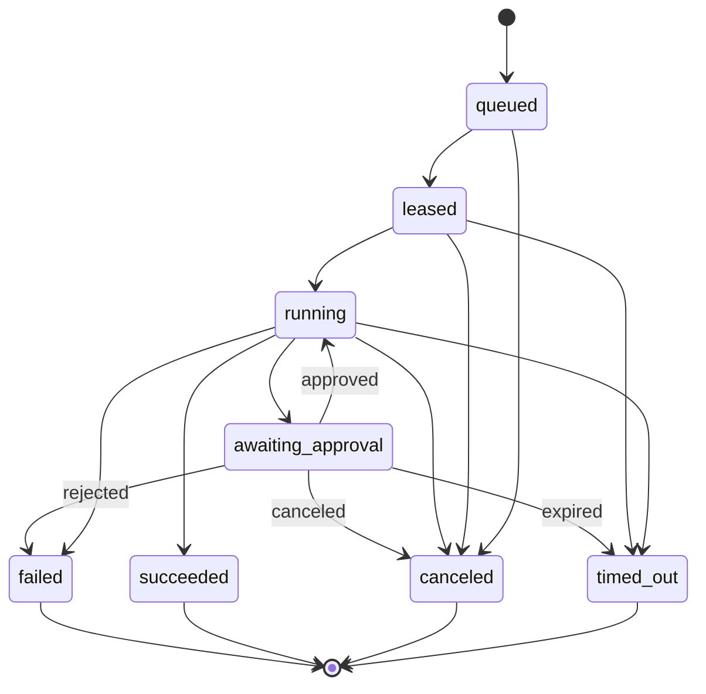

# TAP 核心契约

本页定义架构级契约，而不是最终 API。字段在实现前可以扩展，但不能破坏不可变性、幂等、租户隔离和可追溯性。框架代码、BrowserStack capability 和 Agent Runtime 对象都不能成为领域契约。

## 1. Test IR 与稳定身份

Test IR 是 Git 中版本化的核心资产。稳定身份与文件路径、名称和执行框架解耦：

```yaml
apiVersion: tap.dev/v1alpha1
kind: TestCase
metadata:
  id: test_checkout_happy_path
  projectId: commerce-web
  aliases: []
spec:
  intent: "已登录用户完成信用卡结账"
  steps:
    - id: submit_payment
      action: click
      target: { locatorRef: checkout.submit }
  assertions:
    - type: url_matches
      value: /orders/*
```

约束：

- `metadata.id` 创建后不可复用；重命名通过 alias/migration 表达。
- Test IR revision 由 Git commit + content hash 标识，不使用可变 branch 名。
- action、target、assertion、fixture 和 secret 必须是版本化 typed vocabulary。
- 自定义能力通过显式 extension namespace 表达；禁止把任意 Shell 当通用 action。
- MySQL 保存 Test catalog/projection 与 revision 映射，内容版本以 Git 为准。

## 2. RunSpec

Run 创建后冻结。任何重跑都创建新的 Attempt；改变工作流、策略或 revision 必须创建新 Run。

```yaml
apiVersion: tap.dev/v1alpha1
kind: Run
metadata:
  tenantId: tenant_123
  projectId: project_456
  idempotencyKey: github:delivery:abc123
spec:
  trigger:
    type: github.pull_request
    actor: github:user:octocat
  source:
    repository: github:owner/repo
    revision: 0123456789abcdef
    baseRevision: fedcba9876543210
  testAssets:
    - id: test_checkout_happy_path
      revision: 0123456789abcdef
      contentHash: sha256:...
  workflowRef:
    id: pr-quality
    version: 7
  policyRef:
    id: default-engineering
    version: 4
  budget:
    deadlineSeconds: 3600
    maxAgentTokens: 200000
    maxProviderMinutes: 120
  requestedCapabilities:
    - agent.analysis
    - test.web.e2e
```

## 3. Task 与 Attempt

- Task 是归一化逻辑工作项，可以来自 Workflow DAG 节点，也可以来自 Agentic Loop 某轮规划的 action。
- DAG Task 具有稳定 node key；Loop Task 必须记录 `plan_iteration`、`action_id` 与产生它的 causation event。
- Loop 在产生任何工具或外部副作用前，必须先持久化 Task/Attempt；动态规划不能绕开运行状态机。
- Attempt 是 Task 的一次物理执行，具有单调递增序号。
- 重试不能复用外部 Provider attempt ID 或 Agent session ID。
- Task 成功规则由 Workflow 定义；Attempt 终态不可修改。

下面是 **Attempt 状态机**；Task 的汇总结论由 Workflow/Plan 根据一个或多个 Attempt 计算。



未知或供应商特有状态映射为 `running` 加诊断属性，不能乐观映射为 `succeeded`。

## 4. RunEvent

```json
{
  "event_id": "evt_...",
  "event_type": "attempt.completed",
  "occurred_at": "2026-08-20T14:00:00Z",
  "tenant_id": "tenant_123",
  "run_id": "run_...",
  "task_id": "task_...",
  "attempt_id": "attempt_...",
  "sequence": 42,
  "idempotency_key": "provider:browserstack:session:...:completed",
  "actor": { "type": "system", "id": "browserstack-adapter" },
  "trace_id": "...",
  "correlation_id": "run_...",
  "causation_id": "evt_previous_...",
  "schema_version": 1,
  "data": {}
}
```

约束：

- 同一 Run 的 `sequence` 单调递增。
- Producer 重复投递相同 `idempotency_key` 不产生第二个业务事实。
- Schema 只做向后兼容扩展；破坏性变化升级 `schema_version`。
- 事件中只存小型结构化事实；大载荷进入 Blob 并用 ArtifactRef 引用。

## 5. Provider Port

### AgentRuntime

```typescript
interface AgentRuntime {
  capabilities(): Promise<CapabilitySet>;
  start(task: AgentTask, policy: RuntimePolicy): Promise<RuntimeHandle>;
  events(handle: RuntimeHandle, cursor?: string): AsyncIterable<AgentEvent>;
  respond(handle: RuntimeHandle, response: InteractionResponse): Promise<void>;
  cancel(handle: RuntimeHandle, reason: string): Promise<void>;
  result(handle: RuntimeHandle): Promise<AgentResult>;
}
```

### ExecutionProvider

```typescript
interface ExecutionProvider {
  capabilities(): Promise<CapabilitySet>;
  submit(plan: ExecutionPlan, credential: SecretRef): Promise<ProviderAttempt>;
  status(attempt: ProviderAttempt): Promise<AttemptSnapshot>;
  cancel(attempt: ProviderAttempt): Promise<void>;
  artifacts(attempt: ProviderAttempt): AsyncIterable<ProviderArtifact>;
}
```

端口不能暴露 DeepSeek Harness 的插件对象或 BrowserStack capability JSON。Provider 特有字段放入版本化 `provider_options`，领域层只读取经过声明的通用能力。

## 6. Evidence Manifest 与 Finding

每个 Attempt 对应一个不可变 Evidence Manifest：

```yaml
schemaVersion: 1
attemptId: attempt_123
source:
  repository: github:owner/repo
  commit: 0123456789abcdef
  testAssetId: test_checkout_happy_path
  testAssetRevision: 0123456789abcdef
runtime:
  provider: self-hosted-selenium
  externalId: session_456
  runnerImage: ghcr.io/example/tap-runner@sha256:...
artifacts:
  - kind: screenshot
    uri: azblob://tap-evidence/tenant/run/attempt/failure.png
    sha256: "..."
    classification: internal
    redactionStatus: completed
result:
  conclusion: failed
  exitReason: assertion_failed
```

若 Attempt 包含 Agent，还必须记录 model、prompt、tool、Agent Runtime 与 policy version。Manifest 只引用 Key Vault 中的 SecretRef，绝不保存明文秘密。

### Finding

每个 Finding 至少包含：

- `kind`：test_failure、flake、security、accessibility、agent_diagnosis、agent_suggestion。
- `severity` 与 `confidence`；确定性测试的 confidence 固定为 1。
- `source`：产生它的 Task、Attempt 和 Provider。
- `evidence_refs`：日志片段、截图、视频、测试用例或代码位置。
- `fingerprint`：跨 Run 关联同类问题的稳定指纹。
- `disposition`：open、accepted、suppressed、fixed、invalid。

Agent Finding 必须显式标记 `generated_by_agent=true`，且引用支持其判断的证据，不能伪装成测试事实。

## 7. 幂等与副作用

外部动作的幂等键模板：

```text
{tenant_id}:{run_id}:{task_id}:{attempt_no}:{action}:{action_version}
```

以下动作必须持久化 intent 后再执行：创建 GitHub Check、提交 BrowserStack session、启动 Agent Runtime、写 PR 评论、取消外部任务。执行成功后记录外部 ID；进程崩溃时由 Reconciler 查询外部状态，而不是盲目重放。

## 8. Retrieval Contract

```typescript
interface RetrievalRequest {
  tenantId: string;
  projectId: string;
  actor: { userId: string; allowedGroupIds: string[] };
  classificationCeiling: string;
  environment: string;
  query: string;
  sources: Array<"doc" | "code" | "bdd" | "failure">;
  revision?: string;
  topK: number;
}
```

- `tenantId`、`projectId`、`allowedGroupIds`、classification 和 environment 由可信身份/策略层注入，模型不能提供或放宽。
- 每个命中返回 index、document/chunk ID、source revision、score components 与 ACL decision，供引用和审计。
- 代码命中返回原语言 symbol/AST chunk；不得为了统一格式把源码转成 Markdown。
- Parent/Child 扩展和依赖图扩展必须再次应用同一 ACL filter。
- Index schema 与 embedding/reranker version 一起版本化；不同向量空间不混合查询。
