# TAP 客户演示指南：从业务知识到测试决策

更新日期：2026-09-27。本文按当前实现重新组织演示，替代原有逐页浏览脚本。面向售前、产品负责人和演示主持人；主线约 20 分钟，管理层精简版约 5 分钟。

## 1. 客户应带走的三个答案

| 客户的问题                           | 演示的业务流程                                      | 可说明的帮助                                       |
| ------------------------------------ | --------------------------------------------------- | -------------------------------------------------- |
| 资料很多、版本混乱，回答依据可信吗？ | 资料入库 → 提取核对 → 复核发布 → 引用问答           | 把可用知识与待核对资料分开，让回答能回到依据       |
| 测试设计依赖个人经验，遗漏难发现？   | 已知需求 → 测试草稿 → 人工评审 → 发布版本           | 提供可编辑的起点，并显式暴露假设、未知项和覆盖缺口 |
| 测试报告分散，失败原因难追查？       | pytest 测试结果 → 指标 → 运行/attempt → 证据 → 解释 | 在同一查询范围下看结果、找证据，减少来回翻报告     |

开场话术：

> 今天我们沿着一项业务变更走一遍：先确认团队使用的知识，再把需求整理成测试计划，最后查看已有测试结果并追查失败。重点看每一步留下什么依据，以及下一位同事如何接着工作。

不承诺未经测量的节省比例、生产规模或自动修复效果。

## 2. 演示前准备（主持人）

### 2.1 选择正确入口

| 入口                  | 用途                               | 启动与地址                                                                                           |
| --------------------- | ---------------------------------- | ---------------------------------------------------------------------------------------------------- |
| 完整产品原型          | 展示统一布局、模块导航与跨模块设计 | `corepack pnpm --dir apps/web dev --port 15176` → `http://127.0.0.1:15176/prototype`                 |
| TAP AI 运行页面       | 资料、审核、问答、测试设计         | 配好本地服务后 `make tap-ai-dev` → `http://127.0.0.1:5173/`                                          |
| TAP Insights 运行页面 | pytest/Allure 上传、指标、运行详情 | TAP API/Worker/ClickHouse 就绪后 `make tap-web-dev` → `http://127.0.0.1:5174/?module=test-insights` |

详细环境步骤见[后端指引](2026-09-27-backend-developer-onboarding.md)和[前端指引](2026-09-27-frontend-developer-onboarding.md)。原型入口本身不证明后台持久化或真实执行；运行页面与完整原型的画面可以不同，切换时应说明用途。

### 2.2 准备可重复的演示资料

流程一、二沿用原型内置的“健康告知缺失”合成场景。若切换到 TAP AI 运行页面，可另准备一份小型可提取文字的 MD/TXT，内容包含健康告知规则、异常条件和待澄清项。图片能力使用下文的脱敏 PNG 审批流程图，核对其中的节点、箭头方向、分支条件和回路。只演示资料中实际写明或图中确实画出的规则；不要现场编造引用。流程三的“身份核验/支付”pytest 报告是另一组独立样本。

准备以下状态：

1. 一份待核对资料，用于展示提取结果；如要展示原件对照，另在 TAP AI 运行页面准备原文件。
2. 一份已通过复核并发布的资料，用于稳定演示问答。
3. 一个可编辑的测试草稿及一个已发布版本，用于展示评审前后差异。
4. 同一次 pytest 运行的报告与完整来源信息：Allure Results ZIP 可用于导入步骤/附件，pytest 导出的 JUnit XML 可用于基础结果接入。来源格式、attempt 与完整历史必须按[后端指引](2026-09-27-backend-developer-onboarding.md#41-报告来源pytest--allure)确认；应按本次真实来源核对参数和重试语义。可使用[仓库 retry.xml](../../apps/backend/tests/fixtures/insights/reports/retry.xml)与[对应字段示例](../../apps/web/tests/e2e/insights-report.spec.ts)。这个报告是独立技术样本，不宣称来自前面现场生成的测试计划。
5. 可用的项目授权与未过期 token，放在本地安全配置中，投屏不展示凭证。

现场不依赖临时构造第二位复核人。独立复核用已准备的合规身份或预先完成的演示状态；固定本地身份的交接验证由隔离测试完成，不能宣称已有客户具名签字。

演示前完整排练一次：引用可打开、草稿可保存、报告收据就绪、指标筛选可用、原报告可下载。模型未配置或解释不可用时，使用已保存的合成示例展示结果，并明确为预先准备内容。

### 2.3 当前能力口径

| 能力          | 当前可以展示                                                       | 不应宣称                                                   |
| ------------- | ------------------------------------------------------------------ | ---------------------------------------------------------- |
| 可信知识      | 文字型 PDF/DOCX/MD/TXT 与 XLSX；功能分支另支持单张 PNG/JPEG 流程图解析、核对、复核发布及区域引用 | 扫描 PDF/Office 内图片 OCR、一般图片理解、图像向量检索、真实客户质量已验收 |
| 测试设计      | 生成草稿、编辑、评审、发布、持久化恢复                             | 自动生成即正确、无需业务审核                               |
| 基础 Insights | pytest XML / Allure ZIP 上传、指标、Run/attempt、步骤/附件及原报告 | 已连接客户 CI、支持 Allure HTML 站点导入、真实客户验收通过 |
| AI 解释       | 配置完整时读取授权事实，区分事实、假设和缺失信息                   | 已证实根因、自动修改或自动修复                             |
| 完整原型扩展  | Graph 浏览、Agents/Skills、Automation 配置及跨模块设计             | 自建 Web/App 执行平台、生产级主动 Agent 已交付             |

依据：[2026-09-27 交付复验](../archive/reviews/2026-09-26-trusted-knowledge-insights-delivery-gate.md)。M1–M4 **隔离模拟业务 UAT PASS，真实业务 Gate PENDING**。此次文档更新没有重跑这些验收；不把历史证据改写为本次测试。

### 2.4 截图使用说明与快速导航

主线提供 **18 张分步骤截图**；流程一另有 PDF、Excel 格式示例，以及一张合成流程图原件和两张当前原型截图。流程图图片的实际上传与视觉解析需切换到 `feat/trusted-knowledge-insights` 的 TAP AI 运行页面；原型内置解析文字只用于说明审核交互。图片保留界面中的英文按钮，旁边提供中文操作指引；点击图片可查看原图。现场演示前先说明画面来源：

| 图号 | 内容 | 画面与数据来源 |
| --- | --- | --- |
| 01–09 | 知识核对、引用、测试计划 | 当前 `/prototype`，内置示例，仅说明产品交互设计 |
| 10–15 | Allure 接入、指标、Run、失败证据与交接入口 | 实际运行界面与隔离后端，仓库合成 pytest 报告 |
| 16 | 事实、假设、缺失信息 | 当前 TAP AI 页面，自动化截图提供固定接口响应，未调用真实模型 |
| 17–18 | 图谱与自动化扩展 | 当前 `/prototype`，内置示例 |
| 流程一格式补充 | PDF 与 Excel 的统一审核工作台 | 当前 `/prototype`，内置示例 |
| 流程图图片补充 | 合成 PNG 原件、资料卡片与三栏核对画面 | 合成样本与当前 `/prototype` 固定示例；不代表真实视觉模型输出 |

**主持人须知：**图 01–09 使用“健康告知”示例；图 10–15 使用独立的“身份核验/支付”报告样本；图 16 使用另一组解释样本。三组画面展示衔接方式，不声称是同一次业务执行。图 16 的 50% 与图 12 的 66.67% 来自不同样本，不作同一查询比较。完整产品原型的文件列表包含未来设计格式，实际上传范围仍以 §2.3 为准。

按流程跳转：[知识核对](#3-流程一把业务资料变成可用知识4-分钟) → [引用与测试计划](#4-流程二从有依据的回答到可评审测试计划6-分钟) → [pytest/Allure 分析](#5-流程三把已有测试结果变成可追查的分析6-分钟) → [解释与行动](#6-流程四围绕证据请求解释形成下一步行动2-分钟)。

## 3. 流程一：把业务资料变成可用知识（4 分钟）

**业务角色：**业务分析师、知识维护者、复核人。

**业务问题：**上传的文件可能提取不完整，未经确认的资料容易被当作答案依据。

本段图 01–04 均来自当前 `/prototype` 产品壳；图 02–04 使用同一版三栏审核界面。图 01–03 操作 **Life underwriting guide · v1.2.md**；图 04 明确切换到**另一份预先批准的** **Health disclosure policy · approved.md** 展示发布结果。两份资料不能讲成同一文件的一次完整复核。

1. 进入完整产品原型的 **Library → Documents**，找到待核对的 Life underwriting guide（图 01）。该文件已预置，不现场声称刚完成上传。
2. 点击 **Review**，按左侧章节定位，在中间阅读提取文字，在右侧标记疑点或留下核对意见；完成整份资料检查（图 02）。原型图展示的是提取内容与位置，真实原件对照在 TAP AI 运行页面进行。
3. 点击 **Submit for review**。同一文件进入 **Awaiting independent review**，修订记录显示维护者已提交（图 03）。此处停在移交状态，不把维护者冒充独立复核人。
4. 关闭该文件，打开另一份**已预先独立复核**的 Health disclosure policy，点击 **Publish**。展示它的批准/发布记录以及 **Ask Tapper** 入口（图 04）。
5. 点击 **Ask Tapper** 或回到问答来源选择，进入流程二，确认本轮选用的健康告知资料是已发布版本。

下图说明业务闭环；图 01–04 是两个预置文件的演示画面，不是同一文件从提交到批准的全程实录。

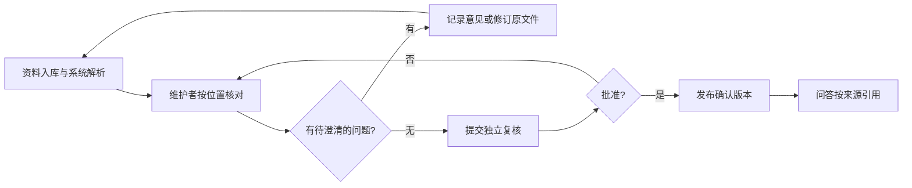
```mermaid
flowchart LR
    A[资料入库与系统解析] --> B[维护者按位置核对]
    B --> C{有待澄清的问题?}
    C -- 有 --> D[记录意见或修订原文件]
    D --> A
    C -- 无 --> E[提交独立复核]
    E --> F{批准?}
    F -- 否 --> B
    F -- 是 --> G[发布确认版本]
    G --> H[问答按来源引用]
```

**客户应看到：**待核对、已移交、已批准和已发布是不同状态；资料位置、审核修订和发布记录可追溯。原件与提取内容的并排对照属于 TAP AI 运行页面，以下产品原型截图不证明已打开真实原件。

**讲解话术：**

> 文件进入系统后，团队可以先核对提取内容，再决定哪个版本供问答使用。这样业务人员能掌握知识发布的边界，后续回答也有明确依据。

**异常演示：**如果发布被阻止，解释缺少的审核条件，不绕过校验。文字无法提取时换用准备好的文字文件，并说明本轮不含 OCR。

### 图 01｜找到需要核对的业务资料

**画面来源：**2026-09-27 当前完整产品原型，内置示例数据。

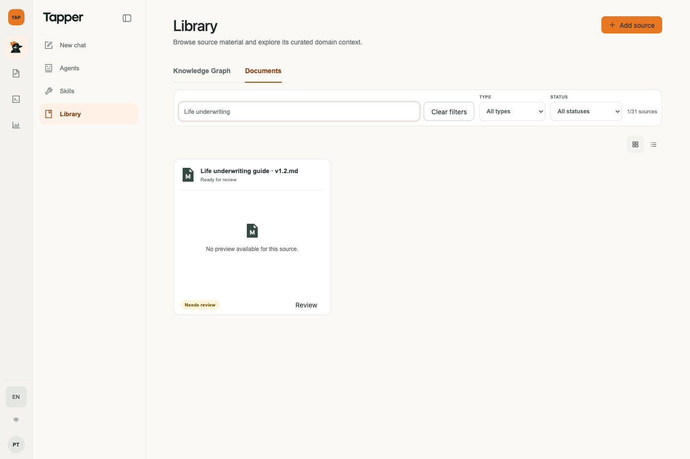

- **怎么操作：**进入 Library → Documents，在 Search library 输入 Life underwriting。
- **请客户看：**文档名称、版本、Needs review 状态和 Review 按钮；右上角 Add source 是新增入口。
- **讲解重点：**“先识别要维护的资料和版本，再开始核对，避免把未确认内容直接用于回答。”

### 图 02｜按章节检查提取内容并留下意见

**画面来源：**2026-09-27 当前完整产品原型，内置示例数据。

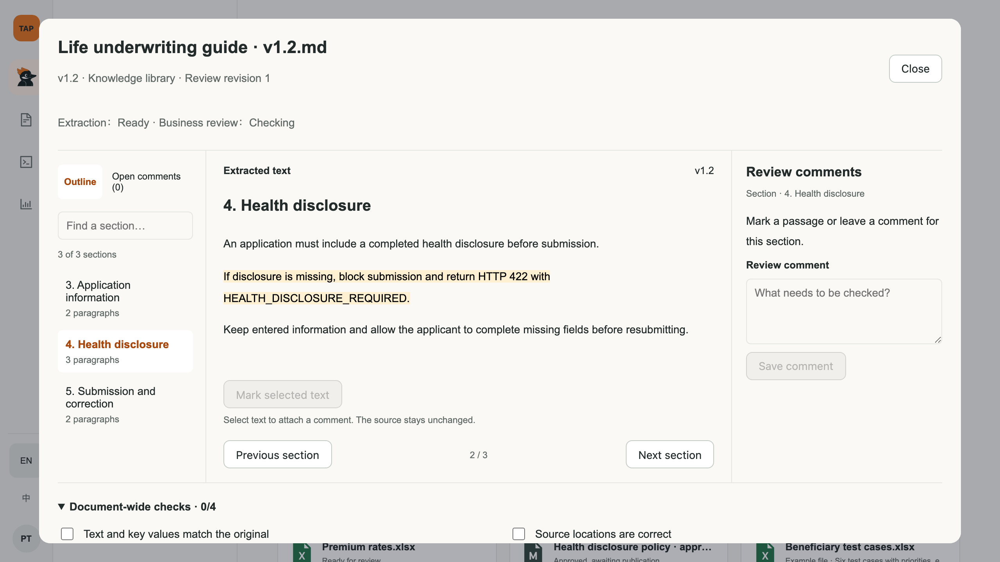

- **怎么操作：**点击 Review，在左侧目录选择章节，在中间阅读提取内容，在右侧记录核对意见，再逐项完成下方四项整份资料检查。
- **请客户看：**同一文件的名称与版本、章节位置、提取规则、意见区和整份资料检查。此图没有原文件预览。
- **讲解重点：**“关键条件、适用范围和例外都需要核对，提取完成并不等于业务确认。”

### 图 03｜提交核对，移交独立复核

**画面来源：**2026-09-27 当前完整产品原型，内置示例数据。

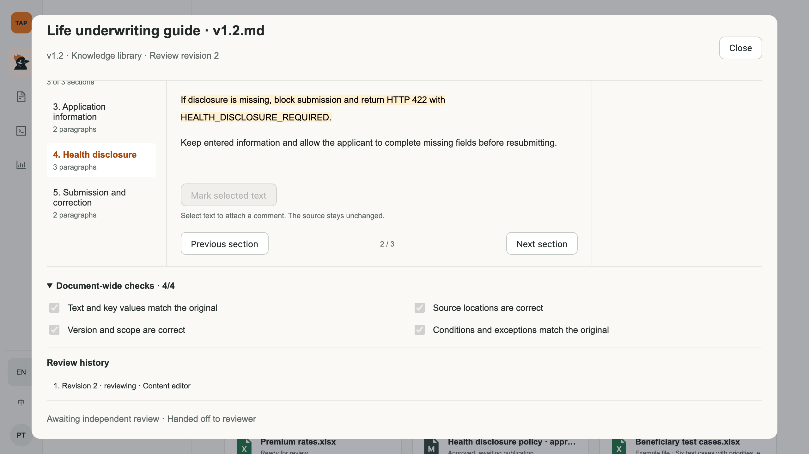

- **怎么操作：**确认四项内容后勾选并点击 Submit for review。
- **请客户看：**仍是 Life underwriting guide · v1.2.md；顶部审核修订变为 2，底部 Awaiting independent review / Handed off to reviewer，Review history 新增维护者提交记录。页面向下滚动，以便同时看到标题与移交结果。
- **讲解重点：**“维护者完成核对后还有复核环节，团队可以看清当前停在哪一步。”

### 图 04｜用另一份预先批准资料展示发布结果

**画面来源：**2026-09-27 当前完整产品原型，内置示例数据。

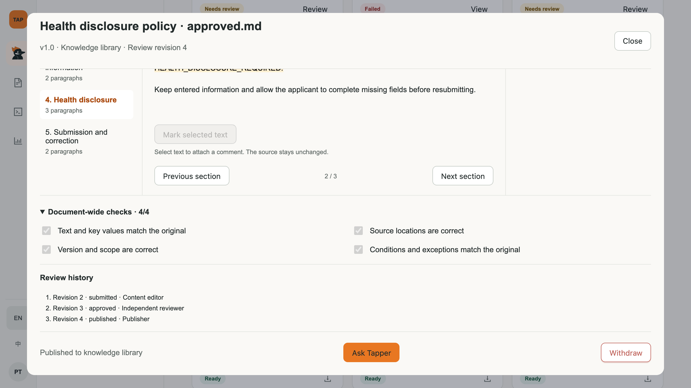

- **怎么操作：**关闭上一份文档，搜索 Health disclosure，打开另一份预置的 Health disclosure policy · approved.md，再点击 Publish。
- **请客户看：**标题已换成 approved.md；Review history 依次显示提交、独立复核批准与发布，底部出现 Published、Ask Tapper 和 Withdraw。页面向下滚动，以便同时看到标题与发布结果。
- **讲解重点：**“这是一份另行预置、已经独立复核的示例资料。它展示批准后才能发布，以及发布后可被问答引用；不代表图 03 的资料刚刚通过复核。”

### 3.1 格式补充：PDF 与 Excel 沿用同一审核工作台

主流程讲完后，仅在客户关心大文档或表格时展示下面两张**并列格式示例**。它们不是图 03–04 的后续审核状态。图 02 已展示文字文档；三种格式共用目录、位置、意见、整份检查与复核操作，阅读区分别按章节、PDF 页和工作表单元格范围呈现。

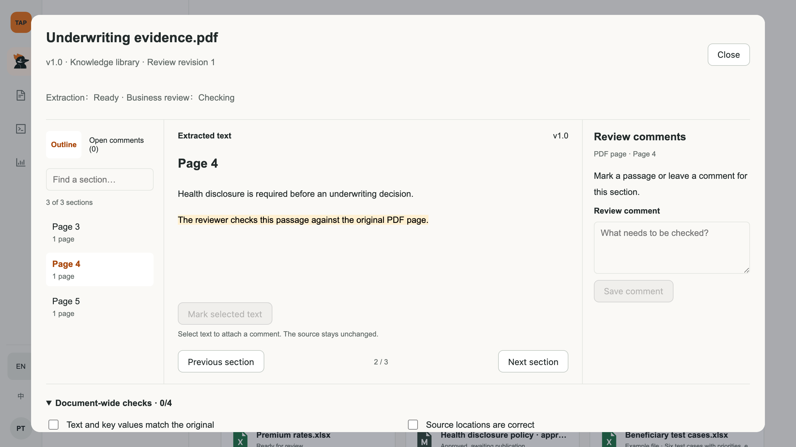

**PDF 操作：**在左侧按页进入条款，核对提取文字与页码，选取疑点并记录意见。此图只展示原型中的提取内容；真实运行页面可按授权打开 PDF 原文件并定位到对应页。

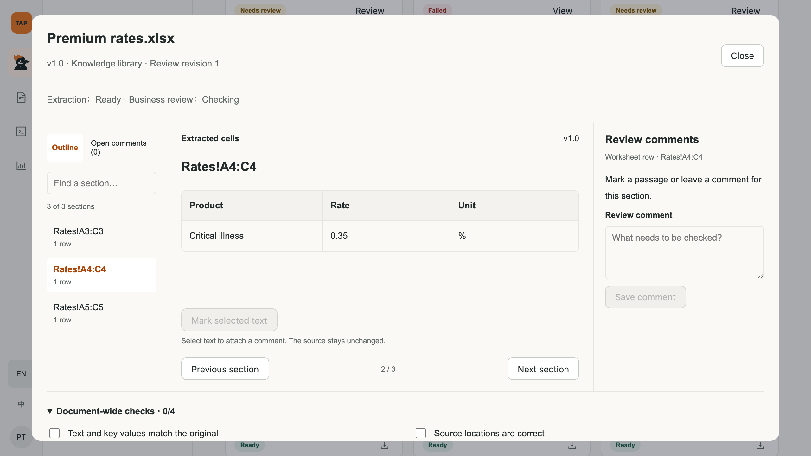

**Excel 操作：**在左侧选择工作表行及单元格范围，在表格中核对提取的表头、值与单位。真实运行页面也提供提取表格预览；公式、格式和隐藏行列须下载原工作簿核对。此图不表示已在浏览器中呈现原工作簿。

TAP AI 运行页已增加待核对/阻断/全部筛选、已加载位置搜索、前后条目导航和引文说明保存；PDF 可按授权打开原文件并按页定位，XLSX 保留工作表/单元格位置、展示提取表格并标出公式及格式风险。两套页面采用同一审核顺序；详细操作和限制见[知识审核工作台](2026-09-27-knowledge-review-workbench.md)。OCR、PDF 框选和 Excel 原件单元格直接批注尚未交付。

### 3.2 图片补充：把流程图解析成可核对的知识

这段与图 01–04 的健康告知主流程及上面的 PDF、Excel 格式示例分别讲解。示例是脱敏的**核保审批流程图**：申请人、运营、核保/合规三个泳道；健康告知补件与缴费失败两条回路；资料完整、高风险、缴费确认三处判断。供现场上传的文件是[完整 PNG 样本](../assets/customer-demo-2026-09-27/21-underwriting-approval-flow.png)，[SVG 源图](../assets/customer-demo-2026-09-27/21-underwriting-approval-flow.svg)可用于放大核对。

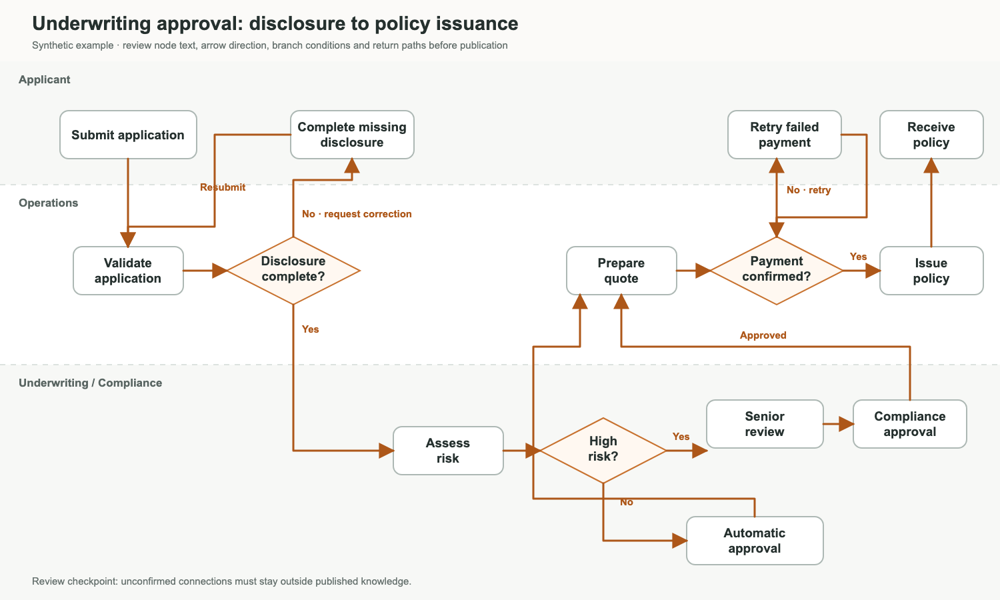

**先让客户看原图：**从提交申请进入资料校验；告知缺失则退回申请人补齐并重新校验。资料完整后进行风险评估：高风险走资深核保及合规复核，低风险走自动批准；两路汇合后生成报价。缴费失败返回重试，成功才出单。演示时请客户指出一条容易看反的箭头或条件，作为人工核对的理由。

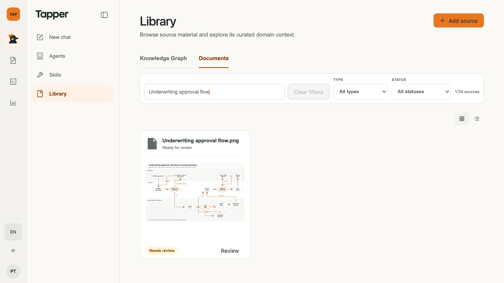

**原型操作：**进入当前 `/prototype` 的 **Library → Documents**，搜索 `Underwriting approval flow`，点击 **Review**。此处是预置样本，图中的 Ready for review 不是现场上传或真实模型运行的证据。

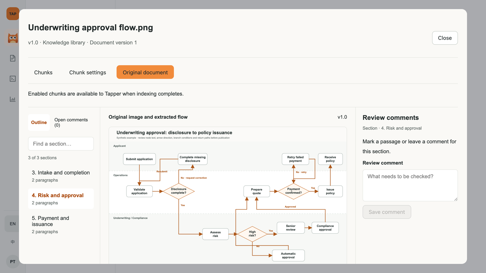

**原型核对：**左栏按受理、风险、缴费三个环节定位；中栏查看原图并点击 **Open full image** 放大，再向下滚动检查提取的路径文字；右栏留下意见。重点核对“告知缺失 → 补件 → 重新校验”“高风险 → 资深核保 → 合规复核”及“缴费失败 → 重试”的方向和条件。底部四项整份检查分别覆盖节点、箭头、条件、版本与位置。截图中的解析文字是与样本对应的固定示例，并非视觉模型在此次截图中生成。

**实际运行演示：**切换到 `feat/trusted-knowledge-insights` 的 TAP AI 运行页面，在 **Library → Add source** 上传同一 PNG，等待视觉解析，再逐项对照原图与节点、连线、条件及泳道。对无法确认的连接保留待确认或明确排除；完成维护者提交、独立复核与发布后，在 Tapper 选择已发布图片来源，询问“高风险申请通过哪几步？”并检查引用的图片区域坐标与版本。当前运行页支持单张 PNG/JPEG、上限 25 MiB；文字更正需通过新修订处理。演示前须配置已获授权的视觉模型路由和图片数据使用范围；缺少路由时不声称现场解析成功。

**客户应看到：**流程图中的步骤、方向和条件可以进入知识审核与发布流程；问答引用能回到图片区域。当前检索使用确认后的**流程语义文字**及其文字向量，尚无“以图搜图”的图像向量索引；扫描 PDF、Office 内嵌图片和任意照片不在本段范围内。真实模型对客户流程图的识别准确率和真实业务 UAT 仍待单独验证。

## 4. 流程二：从有依据的回答到可评审测试计划（6 分钟）

**业务角色：**业务分析师、测试设计人员、测试负责人。

**业务问题：**需求理解与测试设计分散，测试人员需要知道结论来自哪里、哪些问题尚未确认。

1. 进入 **Tapper / New chat**，选择健康告知主流程中图 04 的已发布来源；若刚展示了可选的图片段，先切回健康告知样本。
2. 提问：“如果健康告知缺失会怎样？”与图 05–06 的预置画面保持一致。若改用其他资料，应同步更换后续画面与讲解。
3. 打开回答引用，回到原文核对至少一条结论。若无足够依据，保留不确定性，不把推测讲成规则。
4. 通过当前测试设计入口提出：“基于这些规则生成测试计划，包含正常、异常和边界场景，并列出待确认项。”
5. 打开 **Generated Test Plan** 草稿，查看用例、引用、假设/未知项与覆盖缺口。
6. 修改一条用例的前置条件或预期结果，点击 **Save draft / 保存草稿**。
7. 展示 **Accept modified / 修改后采纳** 以及满足评审要求后的 **Approve and publish / 批准并发布**；核对发布状态。未满足要求时展示阻止原因，或使用预先完成评审的版本。

**客户应看到：**问题、引用、草稿、人工修改与发布版本组成连续工作流，发布有明确门槛。

**讲解话术：**

> 系统先给出可检查的设计起点，同时把缺失信息列出来。测试人员可以修改并评审，再形成可追溯的发布版本，让团队把时间集中在业务判断上。

**边界说明：**本段完成的是测试设计；不要把“测试计划已发布”说成“自动化测试已执行”。如展示 Graph，用于解释关联与来源导航，不承诺已验证真实业务图谱质量。

### 图 05｜选择本轮问答的知识来源

**画面来源：**2026-09-27 当前完整产品原型，内置示例数据。

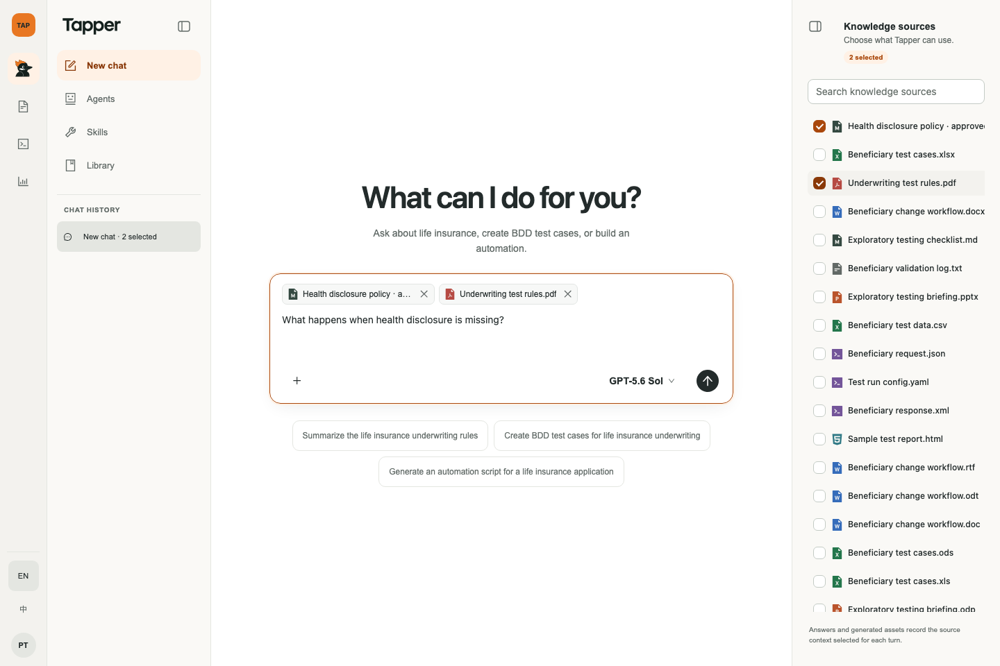

- **怎么操作：**在 Tapper 右侧勾选 Underwriting test rules.pdf，再输入图中的健康告知问题，暂不发送。
- **请客户看：**右侧 2 selected：刚发布的资料及追加选择的核保规则，以及 Message Tapper 输入框中的来源标签。
- **讲解重点：**“每轮先限定依据，让团队知道系统准备参考哪些资料。此处追加原型内置的核保规则样本，后续引用指向该核保文件。”

### 图 06｜回答给出规则和引用入口

**画面来源：**2026-09-27 当前完整产品原型，内置示例数据。

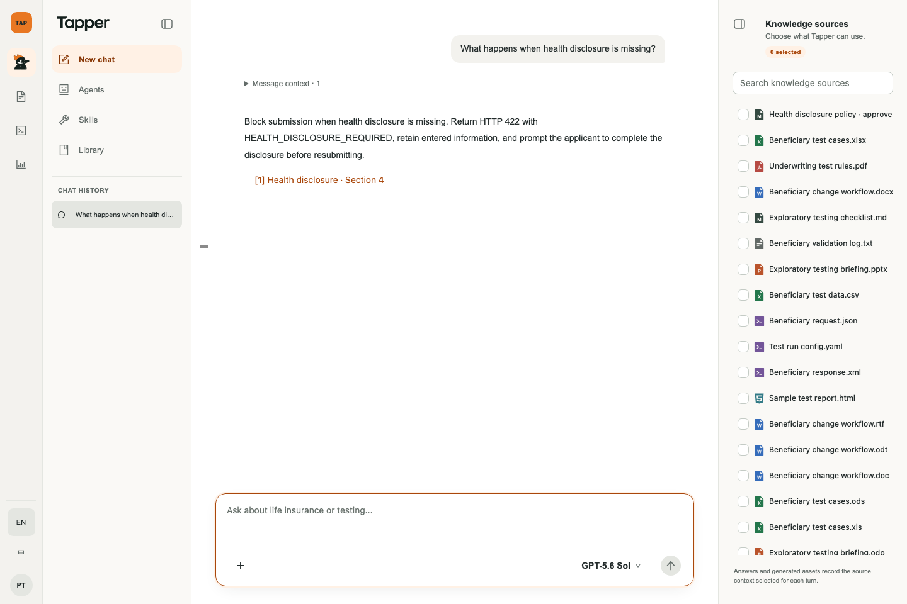

- **怎么操作：**点击 Send，等待回答完成。
- **请客户看：**回答中的阻止提交、保留已填信息，以及橙色 [1] Health disclosure · Section 4。
- **讲解重点：**“客户可以检查结论的出处；这里是原型预设回答，不代表本次真实模型推理。发送后右栏清空选择，已发送来源保留在 Message context。”

### 图 07｜打开原文验证一条结论

**画面来源：**2026-09-27 当前完整产品原型，内置示例数据。

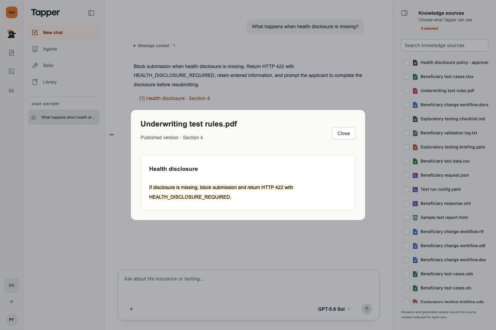

- **怎么操作：**点击回答下的 [1] 引用。
- **请客户看：**弹窗中的第 4 节及高亮原文，核对它是否支持回答中的结论。
- **讲解重点：**“从回答回到依据，业务人员可以自己检查，而不是只能接受一句结论。”

### 图 08｜把讨论转为测试计划草稿

**画面来源：**2026-09-27 当前完整产品原型，内置示例数据。

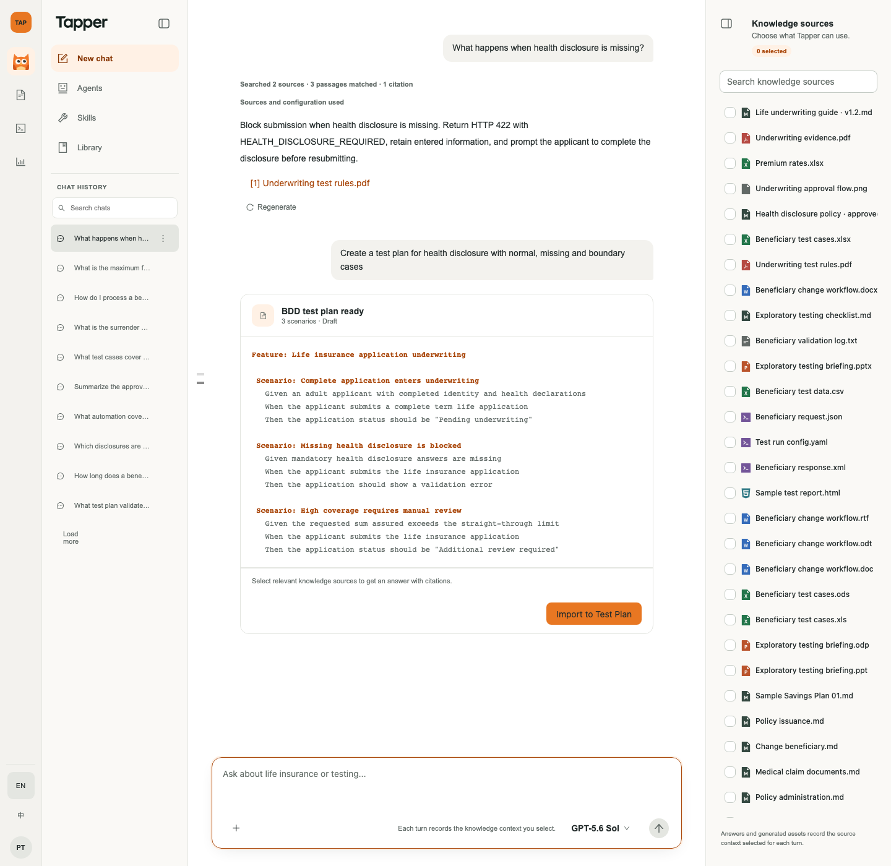

- **怎么操作：**关闭引用，重新选择核保来源，要求生成健康告知的正常、缺失和边界场景。
- **请客户看：**BDD test plan ready、3 scenarios · Draft、Given/When/Then 和 Import to Test Plan。
- **讲解重点：**“草稿提供正常与异常场景的讨论起点；例如高保额阈值仍需业务确认，不能把预设场景当作已审核要求。”

### 图 09｜进入计划详情检查覆盖与执行关联

**画面来源：**2026-09-27 当前完整产品原型，内置示例数据。

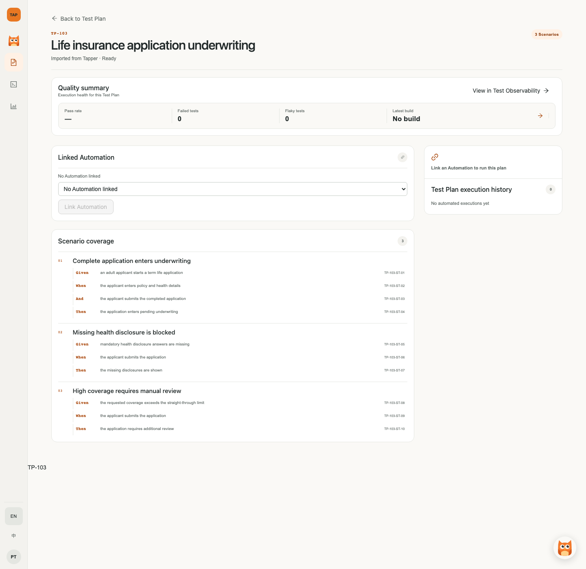

- **怎么操作：**点击 Import to Test Plan，再打开新导入的 TP-103。
- **请客户看：**Scenario coverage 中的场景和步骤；右侧执行历史为空，Linked Automation 尚未关联。
- **讲解重点：**“团队能看到计划覆盖什么，以及是否已经关联执行。当前图没有运行记录，不能当作测试通过证明。”

**运行版评审补充：**图 08–09 展示完整原型的草稿导入与计划详情，未拍摄 TAP AI 运行版的人工修改/批准发布过程。现场按本节步骤 6–7 使用已准备的运行版草稿演示；只有实际出现发布状态后才宣布发布完成。

## 5. 流程三：把已有测试结果变成可追查的分析（6 分钟）

**业务角色：**测试负责人、研发负责人。

**业务问题：**团队主要使用 pytest 执行测试、Allure 查看报告，希望从单次报告进一步汇总结果、定位运行并追溯证据。

**场景说明：**先展示准备好的 Allure 报告，说明这是团队现有的结果查看方式。随后切到 TAP 展示已实现的分析通道；本轮优先使用 Allure Results ZIP 展示步骤与附件，也可以用 pytest XML 展示基础结果。两种来源都要核对运行范围与完整历史。

1. 切到 TAP Insights 运行页面，使用演示项目打开 **Test Insights**。
2. 展开 **Upload test report**，选择 **Allure Results ZIP** 并上传本次运行的结果压缩包（或选择 **pytest JUnit XML**）；仅在确认没有遗漏 attempts 时勾选完整历史；填写来源、Run、Batch、Shard、应用/脚本版本、环境、配置、开始时间等来源字段。
3. 点击 **Upload report**，观察接收与处理状态，等到 **Ready for Insights**。说明“收到文件”和“可用于分析”是两个阶段。
4. 查看当前查询范围及指标；筛选项目/构建或时间范围，说明数值与范围绑定。
5. 打开一条 Run，查看 attempt、环境和版本信息，使用 **Download raw report** 回到原始报告。
6. 在某个 attempt 下点击 **View report evidence**，展开失败信息和步骤，打开截图或下载附件。Allure 测试与 fixture 的步骤/附件可查看；pytest XML 主要提供结果和失败文本。若包内缺少附件或来源无步骤，保留缺失提示，不补造证据。
7. 时间允许时重复上传同一报告，说明系统处理重复来源；更正流程使用更正版本并保留追踪关系。

**客户应看到：**从原报告到收据、指标、运行详情、原报告下载的闭环。

**讲解话术：**

> 团队可以从现有测试结果开始，不必先替换执行工具。我们把来源和运行条件保留下来，让负责人从汇总快速定位到需要检查的那一次运行。

**边界说明：**业务来源以 pytest + Allure 为主，两种格式均有本地接入实现；Allure 仅接收 Results ZIP，不接收生成后的 HTML 站点。文件导入不代表已连通客户 CI。fixture 中的运行名称只是样本标识；不能把单个样本外推为客户质量趋势或性能规模。

### 图 10｜选择 Allure 格式并填写来源信息

**画面来源：**2026-09-27 实际 TAP Insights 页面，本地隔离后端处理合成 pytest/Allure 报告。

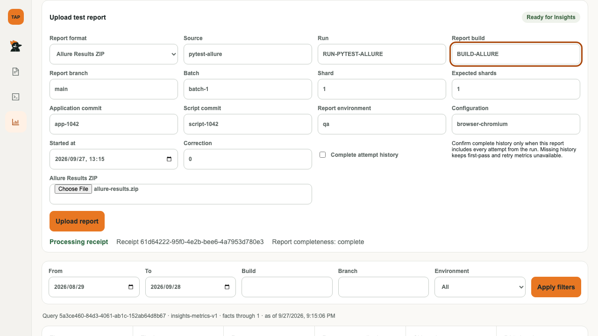

- **怎么操作：**展开 Upload test report，选择 Allure Results ZIP，选择文件并填写 Run、Build、环境和版本。核实完整历史后再勾选 Complete attempt history，点击 Upload report。
- **请客户看：**格式选择、来源字段、所选 allure-results.zip；截图拍于勾选完整历史之前，仍可看到上一份报告的收据。
- **讲解重点：**“把运行条件与结果一起保留，后续定位到的是明确的一次运行。该格式接收结果 ZIP，不是 Allure HTML 站点。”

### 图 11｜确认报告已可用于分析

**画面来源：**2026-09-27 实际 TAP Insights 页面，本地隔离后端处理合成 pytest/Allure 报告。

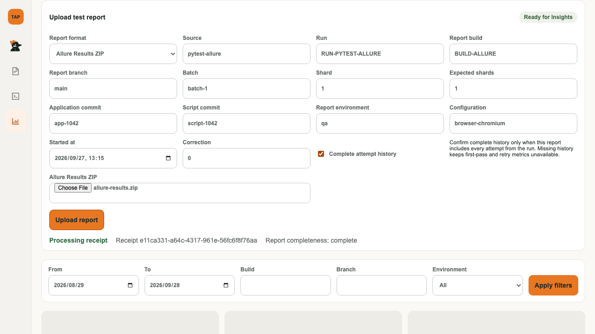

- **怎么操作：**上传后等待处理状态变为 Ready for Insights。
- **请客户看：**收据标识和 Ready for Insights 状态。
- **讲解重点：**“接收文件只是第一步，处理就绪后才能把结果用于分析。”

### 图 12｜在明确范围内阅读质量指标

**画面来源：**2026-09-27 实际 TAP Insights 页面，本地隔离后端处理合成 pytest/Allure 报告。

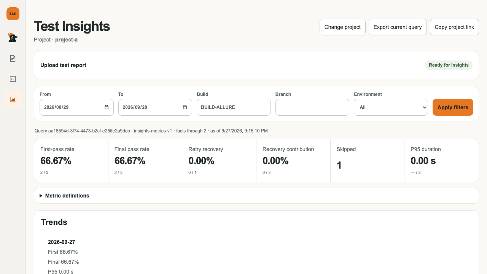

- **怎么操作：**在 Build 输入 BUILD-ALLURE，点击 Apply filters。
- **请客户看：**构建筛选范围，以及首次/最终通过率 66.67%；跳过实例独立计数。
- **讲解重点：**“样本有两个通过、一个失败、一个跳过，通过率按三个可计入结果计算。它说明当前样本，不代表客户整体质量趋势。”

### 图 13｜从运行定位到具体测试实例

**画面来源：**2026-09-27 实际 TAP Insights 页面，本地隔离后端处理合成 pytest/Allure 报告。

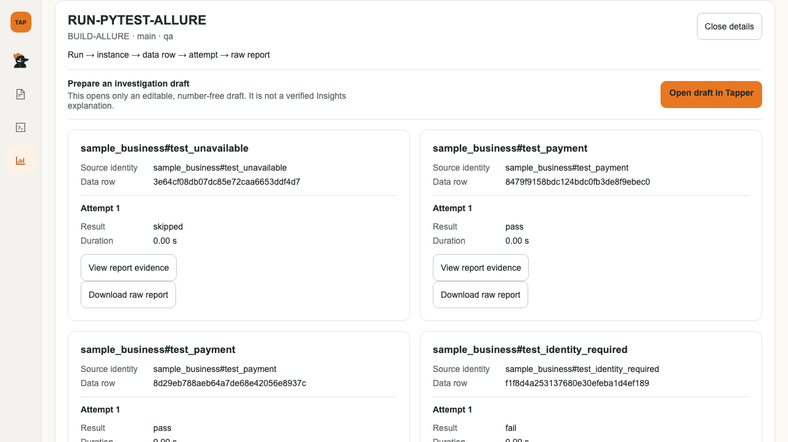

- **怎么操作：**在 Runs 表点击 Open RUN-PYTEST-ALLURE。
- **请客户看：**四个实例的 Source identity、Data row、Attempt、结果与耗时，以及 Download raw report。
- **讲解重点：**“同一个测试的参数实例要分开看；负责人可以从汇总进入具体执行证据。”

### 图 14｜展开失败步骤与附件

**画面来源：**2026-09-27 实际 TAP Insights 页面，本地隔离后端处理合成 pytest/Allure 报告。

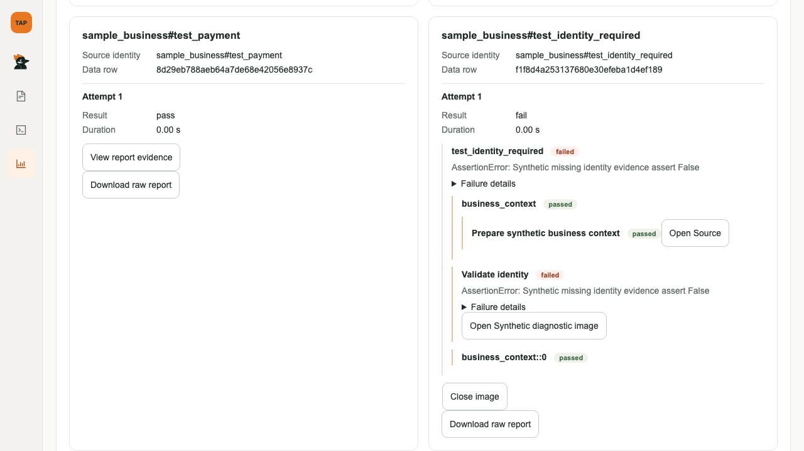

- **怎么操作：**在 test_identity_required 卡片点击 View report evidence；展开步骤，点击 Open Synthetic diagnostic image；需要原始文件时点击 Download raw report。
- **请客户看：**Validate identity 失败文本、前置 fixture 的 Prepare synthetic business context 步骤、Open Source 和附件入口。
- **讲解重点：**“失败结果带着原报告中的步骤和附件，排障人员能追查到具体检查点。图中诊断图片仅为单像素合成附件，验证读取入口，不是业务页面截图。”

如需展示响应式布局，可打开[手机页面完整截图](../assets/pytest-allure/report-mobile.png)；主线讲解优先使用上面的分步图。

## 6. 流程四：围绕证据请求解释，形成下一步行动（2 分钟）

**业务角色：**测试负责人、排障人员。

1. 在运行详情中选择 **Open draft in Tapper**。
2. 展示带来源上下文的草稿，确认目标项目和查询引用；配置就绪时提交解释请求。
3. 对照展示内容：哪些是报告事实、哪些是假设、还缺少哪些资料。
4. 用一项具体人工行动结束，例如补充失败步骤、核对环境变化、补充一条测试场景。

**讲解话术：**

> 分析可以带着证据进入讨论。系统帮助整理已知事实和待验证方向，负责人据此决定下一步检查什么。

**完成标志：**客户能指出一条事实、一个待验证假设和一项需要补充的信息。解释服务未启用时只演示上下文交接，说明本环境未执行解释；不口头补造模型结论。

### 图 15｜将当前运行带入 Tapper

**画面来源：**2026-09-27 实际 TAP Insights 页面，本地隔离后端处理合成 pytest/Allure 报告。

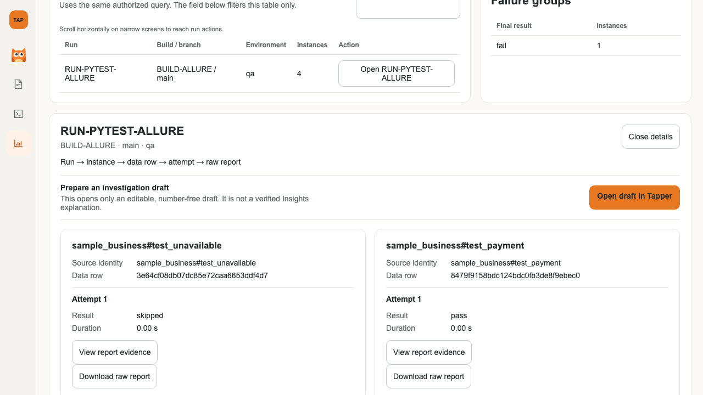

- **怎么操作：**在运行详情顶部找到 Open draft in Tapper；现场目标服务就绪时再点击。
- **请客户看：**Prepare an investigation draft 提示：打开的是可编辑、不含数值的草稿，尚不是经过核验的 Insights 解释。
- **讲解重点：**“把当前分析的问题带入讨论，减少重新描述运行范围。此图证明入口存在，不证明本次已执行模型解释。”

### 图 16｜分清事实、假设和待补信息

**画面来源：**2026-09-27 当前 TAP AI 页面，固定接口响应的界面截图；独立解释样本，非真实模型输出。

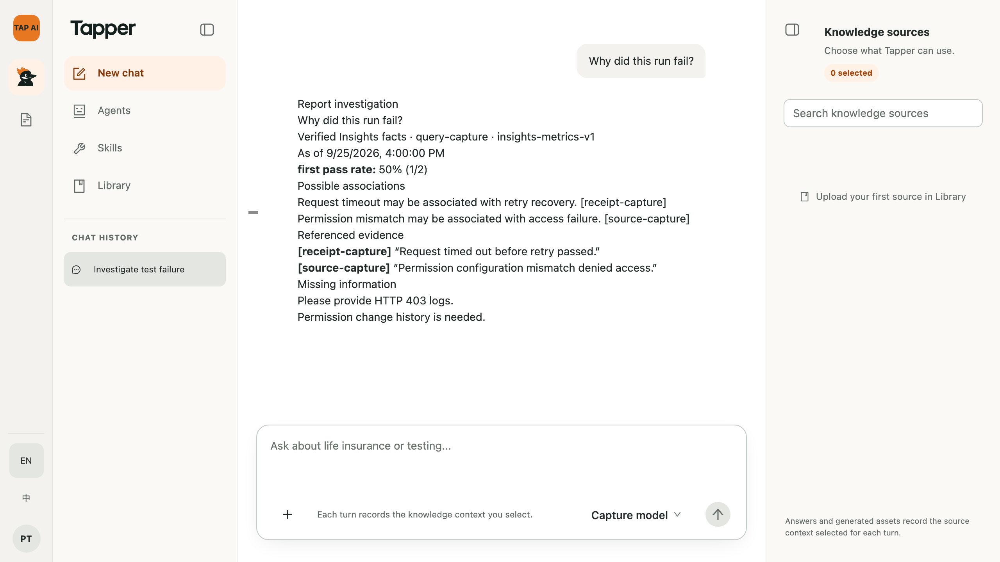

- **怎么操作：**切到预先准备的解释示例，从上到下阅读 Report investigation。
- **请客户看：**事实 first_pass_rate 50% (1/2)、Possible associations、Referenced evidence 和 Missing information。
- **讲解重点：**“超时或权限变更在这里是待验证方向。下一步应补充 403 日志和权限变更记录，再决定排查行动。”

## 7. 可选扩展：完整产品设计（2–3 分钟）

客户关心后续工作组织方式时，切回 `/prototype`：

- 在 Agents/Skills 说明可复用的工作配置。
- 在 Test Management 与 Low Code Automation 之间演示关联导航、BDD 与动作配置设计。
- 展示浮动助手如何把当前页面上下文带入 Tapper。

切换话术：“接下来展示完整产品的交互设计，帮助讨论团队未来如何组织工作。”不现场宣称配置已驱动真实浏览器/手机执行，也不把历史模拟运行当作本次 CI 结果。

### 图 17｜用图谱解释业务关联

**画面来源：**2026-09-27 当前完整产品原型，内置示例数据。

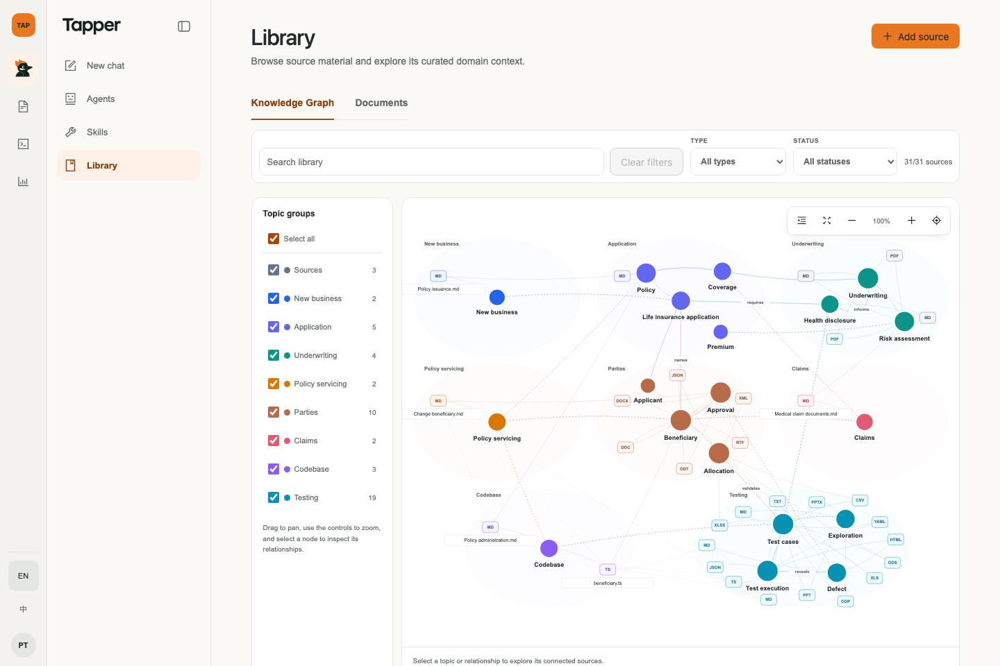

- **怎么操作：**进入 Library → Knowledge Graph，指向 Application、Health disclosure、Test cases 等关联节点。
- **请客户看：**主题分组、来源文件与节点连线；客户可按主题理解资料关系。
- **讲解重点：**“图谱用于浏览关联与导航；这里展示设计样本，不代表已验收客户知识图谱质量。”

### 图 18｜展示自动化资产的组织入口

**画面来源：**2026-09-27 当前完整产品原型，内置示例数据。

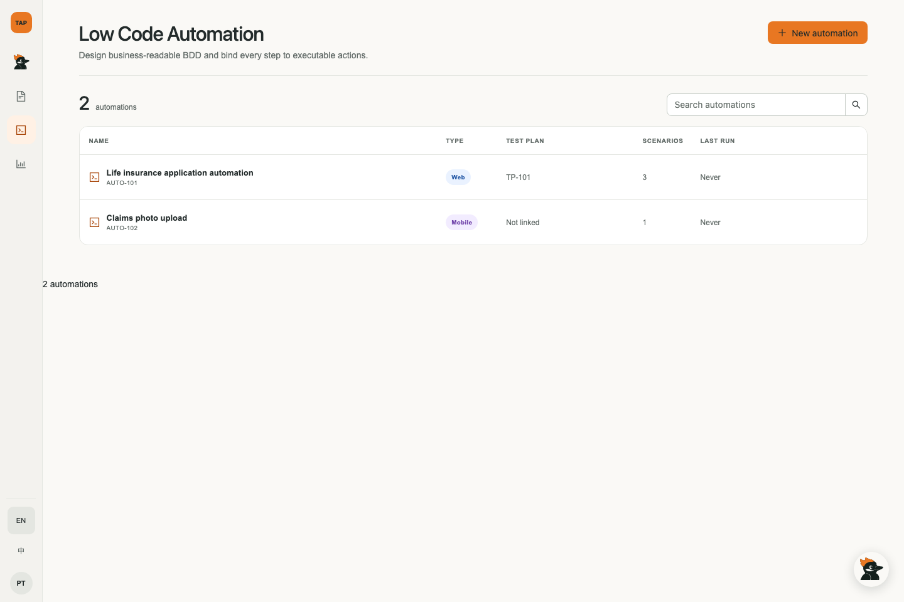

- **怎么操作：**切到 Low Code Automation，选择客户关心的 Web 或 App 自动化资产继续讨论。
- **请客户看：**自动化列表、类型和进入配置的入口。
- **讲解重点：**“测试设计后可以继续组织自动化配置；此页说明产品组织方式，真实浏览器或手机执行能力需另行验证。”

## 8. 管理层 5 分钟版本

| 时间     | 操作                                   | 业务结论                 |
| -------- | -------------------------------------- | ------------------------ |
| 1 分钟   | 打开已发布资料与一条回答引用           | 业务知识有版本与依据     |
| 1.5 分钟 | 打开测试草稿，展示缺口、修改及发布版本 | 测试设计可评审、可追踪   |
| 1.5 分钟 | 查看指标，打开一个 Run 和原报告        | 结果可以回到证据         |
| 1 分钟   | 展示解释中的待验证信息或上下文交接     | 团队能据此安排下一步检查 |

结束话术：

> TAP 把知识依据、测试设计和结果证据串起来。今天展示的是这些流程在本地隔离环境中的能力；下一步业务验收需要使用贵方获授权的资料、报告与具名复核，验证是否满足实际工作要求。

## 9. 常见问题与现场兜底

| 客户问题/现场情况        | 回答或处理                                                                                  |
| ------------------------ | ------------------------------------------------------------------------------------------- |
| 能完全替代业务复核吗？   | 不能；当前流程明确保留核对、评审与发布责任。                                                |
| 已经接入我们的 CI 吗？   | 当前支持 pytest XML 与 Allure Results ZIP 文件导入；客户 CI 连接与来源语义仍需单独验证。    |
| 为什么看不到截图或步骤？ | 先查看报告证据：pytest XML 通常不含步骤/截图；Allure ZIP 应保留原附件，缺失时需补齐来源包。 |
| 为什么不能直接发布？     | 当前身份、版本或复核条件尚未满足；展示具体阻止原因。                                        |
| 刷新后数据还在吗？       | 已有会话、审核、测试计划和报告的隔离持久化/重启验证；临时编辑状态和原型样本不作同等承诺。   |
| 可以正式上线了吗？       | 真实业务、模型质量、生产身份、规模与业务/运维/安全签字仍待验收。                            |
| 现场服务失败怎么办？     | 说明故障阶段，改用预先保存的截图/记录，标明录制时间和示例来源；不称现场操作成功。           |

## 10. 历史资料与证据使用

2026-09-06 的 44 张截图仍是历史设计资料，包含旧模型名称及模拟交互，不再作为主线讲稿或当前实现证明。历史界面可从 [README 历史展示](../../README.md)查看；当前设计规则以[完整原型基准](2026-09-22-product-prototype-baseline.md)为准。

本组截图采集于 2026-09-27，基于 `codex/pytest-allure-reports` 工作区（基线提交 `d75352a` 加未提交的 pytest/Allure 与审核工作台实现）。图 01–09、17–18 及流程一的 PDF/Excel 格式补充从干净浏览器打开当前原型并逐步操作；图 10–15 经 `make tap-insights-e2e` 的隔离环境采集；图 16 经 `apps/tap-ai-frontend` 的 `prototype:capture` 固定响应流程采集。报告样本来源见 [pytest/Allure fixture 说明](../../apps/backend/tests/fixtures/insights/pytest-allure/README.md)。本次截图没有调用真实模型，也未改变 M1–M4 真实业务 Gate 状态。

界面回归对照：[调整前报告页](../assets/pytest-allure/report-desktop.png)可见横向模块标签和拥挤的四列详情；图 12–15 为调整后的左侧导航、直接 Test Insights 入口与两列证据布局。流程一图 02–04 与 PDF/Excel 格式补充在相同 1280×720、2× 视口重采；图 03–04 已替换旧版双栏弹窗。移动端报告布局通过隔离浏览器流程检查，无横向页面溢出。

每次客户演示记录实际使用的代码版本、样本来源、已展示流程及未执行环节。模拟数据演示成功与真实业务验收通过应分别记录。
