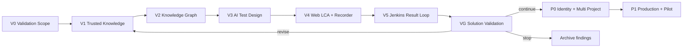

# TAP 交付路线图

TAP 当前采用 [RFC-009](../proposals/2026-09-04-rfc-009-tapper-knowledge-web-automation-platform.md) 确定的 **Validation-first、Knowledge-first、Web-only、Jenkins-first** 路线。先在固定 Enterprise、Validation Project 和 typed Validation Actor 下验证完整产品闭环；VG 通过并由产品负责人决定继续后，才投入 P0 用户/认证/RBAC/多 Project，随后用 P1 完成生产加固和受控客户 Pilot。

本路线图按依赖和可验证出口排序，不在团队人数与客户环境参数未知时虚构日历日期。每个里程碑必须有可重复的测试、真实依赖证据和 Review；只完成 UI、fixture、fake Adapter 或单次 happy path 不能进入下一阶段。

## 已交付起点

仓库已有两类可复用成果：

- Tapper loopback `doc` 知识切片：文档上传、MySQL ledger/Outbox、Redis 唤醒、Azurite Artifact、typed parse/chunk、Milvus 投影、限定来源回答和 Citation 核验基础。
- 纯前端产品原型：Tapper 两级导航、持久化的浏览器内 Conversation、Knowledge Graph 交互、Test Management、LCA、BDD/Action 映射、严格可选 1:1 和模拟 Run。

两者都不是 v0.4 目标实现：当前默认产品壳仍使用 fixture/local storage，真实回答组件尚未接回；Graph、Test Plan、Automation、Recorder、Jenkins 与正式 Evidence 后端不存在；本地 Demo 无登录、无 OCR、仅 loopback。旧原型中的 Mobile 和 Azure DevOps 只保留为历史交互探索。

## 依赖顺序

## V0：Validation Scope 与可靠性基线

### 交付

- 显式注册固定 Enterprise、Validation Project 和 typed Validation Actor Principal。
- 建立 `IdentityContext`、`ScopeProvider` 与 `AuthorizationPolicy` 共同 seam；Project Repository 强制 `project_id`，客户端不能覆盖身份或范围。
- 给现有 Knowledge、Chat、Projection、Outbox 与所有新增业务对象补齐 Project/Actor FK、`identity_mode` 和 `origin`。
- 修复 Alembic authoritative metadata 与 schema-drift 门禁。
- 完成 Redis pending reclaim/trim/redrive、Outbox 归档、上传恢复、staging scavenger 和 Milvus rebuild Operator。
- 增加 TAP 独立 MinIO Artifact Store；不能复用 Milvus 内部 MinIO。
- Web 持续显示 Validation Mode，不暗示个人归因或生产安全。

### 出口

- Scope/path/header/DTO 不可覆盖，未知 action、禁用 Actor、错误 scope/resource 和 Provider 副作用前拒绝全部通过。
- 现有数据保留式回填且所有 FK、唯一约束和 schema-drift 检查通过。
- Redis 丢失或 Worker 重启不丢 MySQL 权威工作；运维命令有界、幂等、可审计。
- Validation 构建只能运行于 loopback 或隔离内网，且配置阻止生产数据、Secret 和目标进入。

## V1：可信知识问答

### 交付

- Project-scoped Knowledge Source、Document Revision、摄取和 Milvus `doc` 混合检索。
- 持久 Search Audit 与真实 Egress Redaction，替换本地 no-op Adapter。
- 服务端模型目录，只返回启用 alias；Composer 不暴露 reasoning effort。
- 服务端 Conversation、Turn Input Snapshot、Turn Answer/Evidence Snapshot、Artifact Link、SSE 恢复和取消。
- 将 Tapper 产品壳接回真实 Knowledge Answer/Citation API；空白 New Chat 不落库，首条消息创建历史。
- 独立 `QUALITY-KB-01`：至少 100 问，泄漏 0、anchor 100%、Claim–Citation precision 100%、recall@10 ≥90%、abstain accuracy ≥90%。

### 出口

- 文档、Conversation 与 Citation 可在 API/Web/Worker/Compose 重启后恢复。
- 真实 Milvus 与经批准真实模型通过固定数据集；Fake Model 不能通过质量出口。
- 所选 Source、Project、model alias、Agent、Skill 与 policy 在不可变 Input Snapshot 固化；实际检索、Graph 状态与 Citation Snapshot 在不可变 Answer/Evidence Snapshot 固化。
- 无足够证据时稳定 abstain，不生成虚假 Citation。

## V2：Knowledge Graph

### 交付

- MySQL Graph Snapshot、Node、Edge、Evidence、Inference Provenance 和 Extraction Job。
- 真实模型 Graph Extraction Worker；候选校验通过后原子发布 active Snapshot。
- Project/Source 范围内的搜索、邻居、有界路径和 Evidence API。
- Knowledge Answer 只在 Graph ready 且授权通过时做最多两跳、受类型与数量预算约束的扩展。
- Sigma.js + Graphology + ForceAtlas2 Worker 的 WebGL 图谱、搜索、社区筛选、邻居/路径和 Evidence Inspector。
- `QUALITY-GRAPH-01`：至少 20 份真实结构文档、200 条人工判断，Evidence/Provenance 100%、EXTRACTED precision 100%、relation precision ≥90%、错误归并 ≤1%。

### 出口

- Graph 失败不阻塞文档问答，专用 Graph 查询失败返回明确不可用状态而不是空图。
- `EXTRACTED` 与 `INFERRED` 有非颜色标识；每条关系都能回到当前授权来源。
- 浏览器只加载有界子图，布局不阻塞主线程，Reduced Motion 与键盘探索可用。

## V3：AI 测试设计

### 交付

- Test Plan、Test Case、Scenario、BDD Step、Citation、Assumption、Unknown、Coverage Gap 和不可变 Revision。
- 同时绑定 Conversation Input 与 Answer/Evidence Snapshot digest 的 AI Test Design Worker；模型只创建 Draft。
- 确定性发布门禁与人工发布，Published/Superseded 不可编辑。
- Test Management Library、详情、Review 与 Tapper Artifact 深链接。
- `QUALITY-TEST-01`：至少 50 个真实业务意图、两名 Reviewer、Schema/BDD 通过率 100%、无来源事实 0、关键需求覆盖 ≥90%、无 Critical Correction Draft ≥80%。

### 出口

- 每个生成 Draft 明确区分来源事实、Assumption、Unknown 与 Coverage Gap。
- 所有 Citation 对当前 Project/Source/Revision 可解析，Graph `INFERRED` 不冒充事实。
- 并发编辑冲突稳定返回 `revision-conflict`，用户发布形成不可变 Revision 和审计事件。

## V4：Web LCA、Recorder 与 Playwright

### 交付

- Automation、BDD、Test IR Action、Locator、Wait/Assertion、Step Mapping、严格可选 1:1 和不可变 Revision。
- 三层编辑器实现 `BDD Step → Test IR Action → generated code lines` 双向高亮；AI 变更 Apply/Reject。
- 确定性 Playwright + TypeScript Generator，产生内容寻址 Bundle、参数/SecretRef schema、依赖和行映射 manifest。
- Draft Debug Worker 与正式 Run 分离；非 root、只读文件系统、CPU/RAM/时长和 egress 有界。
- 受控 Chromium Recorder、单次短期 stream ticket、noVNC、事件去噪、Locator 策略、Secret 转换和回收 Reconciler。

### 出口

- 所有 executable BDD Step 至少一个 Action、没有 orphan Action，代码与 manifest 对同一输入可重复生成相同 digest。
- 代表性非生产 Web 流程可以录制、审查、发布并稳定重放；Recorder crash/断线/超时后资源和 Secret 被回收。
- Secret 原值不出现在事件、BDD、IR、代码、模型 Context、日志或截图 metadata。
- Draft Debug 不创建正式 Run，也不进入 Test Plan Execution History。

## V5：Jenkins 执行与结果闭环

### 交付

- Environment、Execution Target、Credential Binding Profile、Run Configuration 的不可变 Revision。
- Run/Attempt、正交 operation/test/evidence/submission 状态、Run 创建事务与关联/步骤映射快照。
- provider-neutral `ExecutionProvider` 和 Jenkins Adapter，allowlist Job/Agent Label/参数/Runner/Pipeline digest。
- claim fencing、Artifact Gateway、HMAC callback inbox、polling Reconciler 与 `SUBMIT_UNKNOWN` 对账。
- Result Normalizer、Evidence 完整性、Action→BDD→Test Plan Step 投影、Run SSE 与双端 History。
- 真实 Jenkins E2E 与失败注入。

### 出口

- 重复提交、callback、polling、Worker restart 与未知提交不会产生第二次目标副作用或回退终态。
- Jenkins `SUCCESS`、测试 `PASSED` 与 Evidence `COMPLETE` 独立表达；`PASSED + INCOMPLETE` 不显示完整验收成功。
- Run 开始时有关联则同一 Run ID 出现在 LCA 与 Test Plan；无关联不投影，事后关联不追投，解除关联保留历史。
- JUnit、trace、失败截图及选配 Evidence 的 content type、大小与 SHA-256 可核验。

## VG：方案验证出口

使用代表性企业知识、经批准真实模型、真实 Milvus、真实 Graph 抽取、目标非生产 Web 系统、受控 Recorder 和非生产 Jenkins 完成端到端验收。产品负责人必须书面选择：

- `continue`：核心假设成立，进入 P0；
- `revise`：记录未达指标并回到对应 V 里程碑；
- `stop`：保留证据和复盘，不投入身份与生产工程。

VG 结果只证明单固定 Project/Actor 下的功能价值与技术可行性，不能宣称多用户隔离或 Production ready。

## P0：身份、RBAC 与多 Project 产品化

### 交付

- User、Argon2id 密码、HttpOnly/Secure/SameSite Cookie Session、CSRF、登录限流、管理员重置。
- 一次性 Platform Admin bootstrap；首次登录强制改密。
- 单一企业内 Project 创建、Membership、`ADMIN/EDITOR/VIEWER`、Project 切换与逐用户 Audit。
- Platform Admin 不隐式读取 Project 内容；Project 创建与首任 Admin 同事务，last-admin invariant fail closed。
- Validation Project 保留式交接、origin quarantine、Validation Credential 撤销/轮换和 `PRODUCT` Revision 重新发布。
- Production composition root 禁用 Validation Adapter，正式身份缺失时启动失败。

### 出口

- Session 旋转/撤销、CSRF、密码、登录限流、角色矩阵、支持访问和跨 Project 负测试全部通过，泄漏为 0。
- 切换 Project 后前端 cache 与资源彻底隔离，服务端仍是最终门禁。
- 历史 Validation Actor/事件/ID 不改写，Validation Revision 不能直接执行。

## P1：生产加固与受控客户 Pilot

### 交付

- 生产 Compose、TLS/私网、Secret envelope/轮换、最小暴露面和固定镜像 digest。
- OpenTelemetry、Prometheus/Grafana、结构化审计与容量/安全告警。
- Retention、Tombstone、legal hold 和异步跨存储清理。
- MySQL/MinIO 备份恢复、Milvus/派生 Graph 重建与 Tombstone 重放演练。
- `REF-COMPOSE-01` 容量/soak/故障注入、Staging 安全负矩阵和受控客户 Pilot 清单。

### 出口

- 授权泄漏、重复执行和数据丢失均为 0；恢复满足 RFC-009 的 RPO/RTO。
- 固定参考主机下 CRUD、检索+图、SSE、Recorder、Artifact Gateway、错误率与资源水位达到批准阈值。
- 60 分钟 mixed load、8 小时 soak、Worker/Redis/callback 故障注入和客户环境清单通过。
- 只有实际 Review 报告全部通过后，才允许声明 Production ready。

## P1 之后

Mobile/Appium、Azure DevOps、BrowserStack、Git Sync、企业 SSO、专用 Graph DB、Kubernetes HA、多企业 SaaS 与更复杂的 Agent 编排均不在当前路线。每项都需要独立 RFC/ADR，且不得弱化 Project Policy、人工发布、严格 1:1、Test IR 或统一 Evidence。

## 当前执行计划

V0–P1 的精确文件、测试、命令和提交边界见 [Tapper 知识与 Web 自动化平台实施计划](2026-09-04-tapper-knowledge-web-automation-platform.md)。旧 [Phase 1 Intelligence Core 计划](2026-09-02-phase-1-intelligence-core-implementation.md) 保留为历史技术参考，不再是当前执行计划。
