# Tapper Knowledge and Web Automation Platform Implementation Plan

> **For agentic workers:** REQUIRED SUB-SKILL: Use superpowers:subagent-driven-development (recommended) or superpowers:executing-plans to implement this plan task-by-task. Steps use checkbox (`- [ ]`) syntax for tracking.

**Goal:** 按 V0–VG 先完成固定 Validation Scope 下的可信知识问答、Knowledge Graph、AI Test Design、Web LCA/Recorder、Playwright/Jenkins 与 Test Plan 结果闭环；VG 书面通过后再实施 P0 用户/RBAC/多 Project 和 P1 生产加固。

**Architecture:** 在现有 FastAPI/React 单仓内继续采用模块化控制面，把 Ingestion、Graph、Generation、Debug、Recorder、Execution 与 Relay/Reconciler 作为独立 Worker。MySQL 保存 Enterprise/Project/Actor、业务资产、Revision、Run、Audit 和 Outbox；Redis 只作可重建唤醒；MinIO 保存内容寻址的原件、Bundle 与 Evidence；Milvus 保存可重建 `doc` 检索投影；MySQL 保存 Knowledge Graph；LiteLLM 位于模型 Port 后；Jenkins 位于 provider-neutral `ExecutionProvider` 后。V0 的 `ScopeProvider`/`AuthorizationPolicy` seam 同时服务 Validation Adapter 与 P0 Session Adapter，核心应用服务不分叉。

**Tech Stack:** Python 3.13、FastAPI、Pydantic v2、SQLAlchemy 2、Alembic、MySQL 8.4、Redis 7.4、MinIO S3 API、Milvus 2.6、LiteLLM、pytest；React 19、TypeScript、Vite、TanStack Query、Ant Design、Vitest、Testing Library、Sigma.js、Graphology、ForceAtlas2 Worker；Playwright + TypeScript、Chromium/Xvfb/noVNC、Jenkins Pipeline；Docker Compose、OpenTelemetry、Prometheus、Grafana。

**Spec:** [RFC-009：Tapper 知识与 Web 测试自动化平台设计](../proposals/2026-09-04-rfc-009-tapper-knowledge-web-automation-platform.md)

**Architecture Baseline:** [Tapper 知识与 Web 自动化平台架构 v0.4](../architecture/2026-09-04-tapper-knowledge-web-automation-overview.md)

**Contracts:** [Tapper 知识与 Web 自动化平台核心契约](../reference/2026-09-04-tapper-platform-contracts.md)

**Decisions:** [ADR-020–025 与当前有效决策](../decisions/index.md)

## Global Constraints

- 实施前先形成并记录 planning baseline SHA：父工作区中的本计划、RFC-009、Architecture Baseline、Core Contracts、ADR-020–025 与 Decisions index 必须已被 Git 跟踪且相对 `HEAD` 无 staged/unstaged 差异。执行者必须从父工作区根目录逐条执行以下完整命令；任一失败即停止：

  ```sh
  git ls-files --error-unmatch docs/plans/2026-09-04-tapper-knowledge-web-automation-platform.md docs/proposals/2026-09-04-rfc-009-tapper-knowledge-web-automation-platform.md docs/architecture/2026-09-04-tapper-knowledge-web-automation-overview.md docs/reference/2026-09-04-tapper-platform-contracts.md docs/decisions/index.md docs/decisions/2026-09-04-adr-020-validation-first-delivery.md docs/decisions/2026-09-04-adr-021-knowledge-first-web-automation-delivery.md docs/decisions/2026-09-04-adr-022-self-hosted-compose-delivery-baseline.md docs/decisions/2026-09-04-adr-023-milvus-mysql-knowledge-backend.md docs/decisions/2026-09-04-adr-024-tap-managed-automation-revisions.md docs/decisions/2026-09-04-adr-025-jenkins-first-execution-provider.md
  git diff --quiet HEAD -- docs/plans/2026-09-04-tapper-knowledge-web-automation-platform.md docs/proposals/2026-09-04-rfc-009-tapper-knowledge-web-automation-platform.md docs/architecture/2026-09-04-tapper-knowledge-web-automation-overview.md docs/reference/2026-09-04-tapper-platform-contracts.md docs/decisions/index.md docs/decisions/2026-09-04-adr-020-validation-first-delivery.md docs/decisions/2026-09-04-adr-021-knowledge-first-web-automation-delivery.md docs/decisions/2026-09-04-adr-022-self-hosted-compose-delivery-baseline.md docs/decisions/2026-09-04-adr-023-milvus-mysql-knowledge-backend.md docs/decisions/2026-09-04-adr-024-tap-managed-automation-revisions.md docs/decisions/2026-09-04-adr-025-jenkins-first-execution-provider.md
  git rev-parse HEAD
  ```

  把最后一条命令的完整 SHA 写入首个执行 Review，再从该 SHA 新建 `codex/tapper-platform-v0` 分支与独立 worktree。不得清理、覆盖或提交用户已有改动。

- 严格按 V0 → V1 → V2 → V3 → V4 → V5 → VG → P0 → P1 执行。每个里程碑 Review 通过前不得进入下一里程碑；P0 的硬前置是 VG 书面结论为 `continue`。
- 所有行为变更使用 TDD：先提交能因缺少目标行为而失败的窄测试，确认失败原因正确，再写最小实现并运行同一命令至通过。
- 每个任务结束至少执行任务列出的窄测试与 `git diff --check`。修改 DTO/OpenAPI/SSE 时执行 `make contracts`；跨模块任务执行 `make check && make test`；涉及真实中间件或浏览器的里程碑执行隔离 E2E。
- `<review-date>` 是本计划唯一允许的执行期替换标记：创建 Review 时必须以 `date +%F` 的实际评审日期替换，并同步 `docs/reviews/index.md`；不得保留字面量 `<review-date>`，也不得预写计划日期冒充实际评审日期。
- 每个新增 Alembic revision 都必须在同一 Task 中更新 `apps/backend/src/tap/platform/db/registry.py` 和 `apps/backend/tests/integration/test_upgrade_from_0005.py`，并运行该 Task 写明的字面量命令（例如 `make migration-check MIGRATION=0006_validation_identity`）及 `make schema-drift`。`migration-check` 必须在一次性 MySQL 中先执行 `uv run --project apps/backend alembic -c apps/backend/alembic.ini upgrade 0005_projection_lineage`，装载非空旧数据 fixture，再升级到指定 revision；禁止连接默认或共享数据库。
- 所有异步业务命令都使用版本化 `ProjectEventEnvelope`：领域状态、Audit 与 Outbox 同事务；事件 payload 使用封闭 Schema；未知主版本进入 dead-letter。公开 SSE/WS 是授权后的封闭投影，不能透传内部 payload、Prompt、Secret 或 Provider 原文。
- 所有 Problem Details `type` 使用契约中登记的绝对 HTTPS URI，并固定 HTTP status、`correlationId`、工作流失败的封闭 `failureStage` 与 `retryable`；日志与公开错误不得包含凭据、Provider 请求正文或敏感内容。
- Backend domain 不依赖 FastAPI、Pydantic HTTP DTO、SQLAlchemy、Redis、MinIO、Milvus、LiteLLM、Playwright、Jenkins 或 subprocess。跨 bounded context 只调用公开 application API/Port。
- Web 保持 `app/pages → widgets → features → shared`，Feature 不导入 Prototype 状态。所有公开 DTO 从 Backend 生成到 `contracts/openapi/api.json` 和 `apps/web/src/shared/api/generated/schema.ts`，不得手写镜像类型。
- 所有 Project 业务表从创建时就有非空 `project_id` 与 Actor/Origin 字段；所有 Repository 查询强制 Project filter。客户端不能传入 actor、role、enterprise 或权威 scope。
- V0–VG 只允许固定 Validation Enterprise/Project/Actor、验证数据、验证 Secret 和非生产目标；只能绑定 loopback 或受控企业内网。Validation build/configuration 不得晋级 Staging/Production。
- AI、Graph、Recorder 与 Copilot 只产生 Draft/Proposal。Published Revision 必须经过确定性验证与人工发布；Published/Superseded 不可编辑。
- 当前只实现 Web + Playwright TypeScript + Jenkins。禁止在公共 Schema、数据库或代码路径中提前加入 Mobile/Appium、Azure DevOps、BrowserStack、Git-required publish 或任意自定义代码逃生口。
- 禁止 Web/API/Worker 挂 Docker socket 或 host workspace；Runner/Recorder 非 root、只读根文件系统、固定 image digest、CPU/RAM/时长和 egress allowlist。
- Secret 只以用途绑定的短期 lease/`SecretRef` 进入受信任通道，不进入业务 JSON、模型 Context、Captured Event、BDD、Test IR、Bundle、Evidence 或日志。
- Redis、Milvus、MinIO 与 Jenkins 均不是权限或业务事实源。任何跨 MySQL/对象存储/Provider 流程都使用 digest/manifest、幂等键、lease/fencing 和 Reconciler，不宣称分布式事务。
- 真实模型、Recorder、Jenkins、容量和付费 smoke 都必须独立显式 opt-in，默认 `make test` 不得间接触发外部网络、浏览器目标或付费调用。
- 任何“完成”声明都必须链接相应测试输出和 Review 文档。Fake Adapter、UI fixture、模拟 `Passed` 或单次 happy path 不能满足里程碑出口。

---

## Delivery Map

```mermaid
flowchart LR
    V0[V0 Scope + Reliability] --> V1[V1 Trusted Knowledge]
    V1 --> V2[V2 Knowledge Graph]
    V2 --> V3[V3 AI Test Design]
    V3 --> V4[V4 Web LCA + Recorder]
    V4 --> V5[V5 Jenkins Loop]
    V5 --> VG[VG Validation]
    VG -->|continue| P0[P0 Identity + RBAC]
    P0 --> P1[P1 Production + Pilot]
```



每次迁移从当前 Alembic head `0005_projection_lineage` 顺序增加，计划内固定为 `0006`–`0024`。如果执行前仓库 head 已变化，必须先写一条仅调整本计划迁移编号的文档提交并经评审；不能制造双 head 或在代码中保留占位编号。

## V0 — Validation Scope and Reliability Baseline

### Task 1: Make Alembic metadata authoritative

**Files:**

- Create: `apps/backend/src/tap/platform/db/registry.py`
- Create: `apps/backend/tests/architecture/test_migration_metadata.py`
- Create: `apps/backend/tests/integration/test_schema_drift.py`
- Create: `apps/backend/tests/integration/test_upgrade_from_0005.py`
- Create: `scripts/check-schema-drift.py`
- Create: `scripts/check-migration.py`
- Modify: `apps/backend/migrations/env.py`
- Modify: `apps/backend/src/tap/platform/db/schema.py`
- Modify: `apps/backend/tests/architecture/test_module_boundaries.py`
- Modify: `Makefile`

**Contract:** `load_authoritative_metadata() -> MetaData` 显式导入并合并 platform Outbox、chat、knowledge document/answer/citation 与 projection table metadata；任何运行时偶然 import 都不能决定 Alembic 可见表。`make schema-drift` 在隔离 MySQL 上执行 upgrade head，再比较 ORM metadata 与数据库；除 Alembic 自己的 `alembic_version` 外，额外表、缺表、缺 column/index/constraint 均失败。`make migration-check MIGRATION=revision_id` 校验传入的字面量 revision 位于唯一线性 ancestry，创建一次性 MySQL，从 `0005_projection_lineage` 装载包含 Turn、Outbox、Document/Revision/Job/Manifest/Answer/Citation 与 projection lineage 的旧数据，再升级到指定 revision 并运行该 revision 的数据保持断言。

- [ ] 写 `test_migration_metadata.py`，断言当前 14 张 Outbox/chat/knowledge/projection 表都在 authoritative metadata；写 schema-drift 与 upgrade harness 测试，分别证明缺 projection lineage 会失败、`alembic_version` 被唯一豁免、共享/default URL 被拒绝、旧数据 fixture 非空且 revision 非法时非零退出。
- [ ] 运行 `uv run --project apps/backend pytest apps/backend/tests/architecture/test_migration_metadata.py apps/backend/tests/integration/test_schema_drift.py apps/backend/tests/integration/test_upgrade_from_0005.py -v`；预期 FAIL，原因为 registry/harness 不存在或 projection tables 未注册，而不是数据库不可用。
- [ ] 实现 `registry.py`，让 `migrations/env.py` 只从 `load_authoritative_metadata()` 取得 `target_metadata`；两个 checker 输出结构化 diff/report 且不修改共享 schema。Makefile target 内所有 Alembic 调用固定为 `uv run --project apps/backend alembic -c apps/backend/alembic.ini ...`。
- [ ] 在 `Makefile` 增加 `schema-drift` 与 `migration-check`；两者生成唯一 Compose project/database，退出时只删除自身资源，并拒绝默认 demo/production project 名或非 loopback 数据库地址。
- [ ] 运行 `make migration-check MIGRATION=0005_projection_lineage && make schema-drift && uv run --project apps/backend pytest apps/backend/tests/architecture/test_migration_metadata.py apps/backend/tests/integration/test_schema_drift.py apps/backend/tests/integration/test_upgrade_from_0005.py -v`；预期 PASS。再运行 `make check && make test && git diff --check`。
- [ ] Commit: `test(db): enforce authoritative migration metadata`

### Task 2A: Register Enterprise, Project and Actor; freeze the scope seam

**Files:**

- Create: `apps/backend/src/tap/modules/access/domain/context.py`
- Create: `apps/backend/src/tap/modules/access/domain/authorization.py`
- Create: `apps/backend/src/tap/modules/access/application/scope.py`
- Create: `apps/backend/src/tap/modules/access/application/policy.py`
- Create: `apps/backend/src/tap/modules/access/adapters/mysql.py`
- Create: `apps/backend/src/tap/modules/access/adapters/validation.py`
- Create: `apps/backend/migrations/versions/0006_validation_identity.py`
- Create: `apps/backend/tests/unit/access/test_scope_context.py`
- Create: `apps/backend/tests/contract/authorization_policy_conformance.py`
- Create: `apps/backend/tests/contract/test_validation_authorization_policy.py`
- Create: `apps/backend/tests/contract/test_alternate_authorization_policy.py`
- Create: `apps/backend/tests/integration/test_validation_identity_registry.py`
- Modify: `apps/backend/src/tap/modules/access/application/ports.py`
- Modify: `apps/backend/src/tap/modules/knowledge/application/demo_policy.py`
- Modify: `apps/backend/src/tap/platform/db/schema.py`
- Modify: `apps/backend/src/tap/platform/db/registry.py`
- Modify: `apps/backend/src/tap/entrypoints/tapper_runtime.py`
- Modify: `apps/backend/tests/integration/test_upgrade_from_0005.py`

**Core types:**

```python
IdentityContext = AnonymousContext | PlatformScopeContext | ProjectScopeContext

class ScopeProvider(Protocol):
    async def current(self, request: RequestFacts) -> IdentityContext: ...

class AuthorizationPolicy(Protocol):
    async def authorize(
        self, scope: IdentityContext, action: str, resource: ResourceRef
    ) -> AuthorizationDecision: ...
```

`0006` 创建 `enterprise`、`project`、`actor_principal`，并 seed `local` / `tapper-demo` / `tapper-local-user`，principal type 为 `VALIDATION`。`AnonymousContext` 包含服务端确定的 `enterprise_id`；Validation composition 只产生一个固定 `ProjectScopeContext`，不开放 Anonymous/Platform 业务能力。

- [ ] 先写 scope/value-object、Validation policy、第二个 in-memory policy Adapter、identity registry 与 `0005 → 0006` 非空升级测试；共同 conformance 覆盖未知 action、非法 scope/resource、跨 Project、Platform scope 读 Project 内容、禁用 Actor 与 Provider I/O 前拒绝。
- [ ] 运行 `uv run --project apps/backend pytest apps/backend/tests/unit/access/test_scope_context.py apps/backend/tests/contract/test_validation_authorization_policy.py apps/backend/tests/contract/test_alternate_authorization_policy.py apps/backend/tests/integration/test_validation_identity_registry.py apps/backend/tests/integration/test_upgrade_from_0005.py -v -k 'identity or scope or 0006'`；预期 FAIL，原因为新 context/Adapter/table/revision 不存在。
- [ ] 实现固定服务端 `ValidationScopeProvider`，把现有 `DemoCurrentPolicyVerifier` 的可信边界迁到共同 `AuthorizationPolicy`；核心 service 不出现 `if validation_mode`。
- [ ] 将 identity metadata 加入 authoritative registry；`0006` downgrade 只删除自身对象，seed 使用稳定自然键且可重放。
- [ ] 运行 `make migration-check MIGRATION=0006_validation_identity && make schema-drift && uv run --project apps/backend pytest apps/backend/tests/unit/access/test_scope_context.py apps/backend/tests/contract/test_validation_authorization_policy.py apps/backend/tests/contract/test_alternate_authorization_policy.py apps/backend/tests/integration/test_validation_identity_registry.py apps/backend/tests/integration/test_upgrade_from_0005.py -v -k 'identity or scope or 0006'`；预期 PASS。再运行 `make check && make test && git diff --check`。
- [ ] Commit: `feat(access): register validation identity scope`

### Task 2B: Backfill every existing business row into the Validation Project

**Files:**

- Create: `apps/backend/migrations/versions/0007_project_scope_backfill.py`
- Create: `apps/backend/tests/integration/test_project_scope_backfill.py`
- Modify: `apps/backend/src/tap/modules/chat/domain/models.py`
- Modify: `apps/backend/src/tap/modules/chat/application/ports.py`
- Modify: `apps/backend/src/tap/modules/chat/adapters/mysql.py`
- Modify: `apps/backend/src/tap/modules/knowledge/ports/documents.py`
- Modify: `apps/backend/src/tap/modules/knowledge/ports/answers.py`
- Modify: `apps/backend/src/tap/modules/knowledge/adapters/mysql_documents.py`
- Modify: `apps/backend/src/tap/modules/knowledge/adapters/mysql_projection.py`
- Modify: `apps/backend/src/tap/platform/db/schema.py`
- Modify: `apps/backend/src/tap/platform/db/registry.py`
- Modify: `apps/backend/src/tap/entrypoints/tapper_runtime.py`
- Modify: `apps/backend/tests/integration/test_upgrade_from_0005.py`

**Migration contract:** `0007` 以 nullable columns → bounded batch backfill → orphan/duplicate validation → Project/Actor FK 与 Project-prefixed index/unique constraint → non-null 的顺序处理当前 14 张业务表。现有 `knowledge_document.dedupe_key` 改为 `(project_id, dedupe_key)` 唯一；所有 Chat/Knowledge/Projection/Outbox repository 强制绑定 `ProjectScopeContext`。Migration 保留原主键、revision、sequence、digest、时间戳和对象 locator。

- [ ] 扩展旧数据 fixture，使每张当前表至少有一行，并写 ID/digest/sequence 保留、nullable 中间态、global dedupe constraint 被替换、跨 Project 同 digest 可共存、未知/孤儿 Actor 拒绝和 repository 无 scope 不可调用测试。
- [ ] 运行 `uv run --project apps/backend pytest apps/backend/tests/integration/test_project_scope_backfill.py apps/backend/tests/integration/test_upgrade_from_0005.py -v -k '0007 or project_scope'`；预期 FAIL，原因为 `0007` 与 Project-bound repository 尚不存在。
- [ ] 实现 `0007` 与 repository 签名；所有 read/write/filter/idempotency key 均包含 Project，Outbox 增加非空 Project/Actor/identity mode 并保留 aggregate sequence。
- [ ] 运行 `make migration-check MIGRATION=0007_project_scope_backfill && make schema-drift && uv run --project apps/backend pytest apps/backend/tests/integration/test_project_scope_backfill.py apps/backend/tests/integration/test_upgrade_from_0005.py -v -k '0007 or project_scope'`；预期 PASS。再运行 `make check && make test && git diff --check`。
- [ ] Commit: `feat(access): backfill project scoped records`

### Task 2C: Freeze Project event and Problem Details contracts

**Files:**

- Create: `apps/backend/src/tap/contracts/events.py`
- Create: `apps/backend/src/tap/contracts/problems.py`
- Create: `apps/backend/tests/contract/test_project_event_envelope.py`
- Create: `apps/backend/tests/contract/test_problem_registry.py`
- Create: `contracts/events/project-event.schema.json`
- Create: `contracts/problem-types.json`
- Modify: `contracts/events/chat-stream.schema.json`
- Modify: `contracts/openapi/api.json`
- Modify: `apps/backend/src/tap/contracts/http.py`
- Modify: `apps/backend/src/tap/contracts/chat_stream.py`
- Modify: `apps/backend/src/tap/interfaces/http/problems.py`
- Create: `apps/backend/src/tap/platform/messaging/mysql_outbox.py`
- Modify: `scripts/export_contracts.py`
- Modify: `apps/web/src/shared/api/generated/schema.ts`

**Contracts:** `ProjectEventEnvelope` 固定 `event_id/event_type/schema_version/occurred_at/scope_kind/enterprise_id/project_id/actor_id/identity_mode/aggregate_type/aggregate_id/aggregate_version/correlation_id/causation_id/idempotency_key/payload`；payload 必须匹配登记的 event type/version。Problem registry 固定绝对 URI、HTTP status、safe title/detail、`correlationId`、封闭 `failureStage` 与 `retryable`，包含 RFC 的 scope、authorization、idempotency、revision、association、mapping、answer、graph、model/search、recorder 与 execution 错误。相同 idempotency key/相同 canonical request 返回原结果；同 key/不同 request 返回 `409 idempotency-conflict`。

- [ ] 写 envelope 缺字段、未知主版本 dead-letter、内部 payload 不可公开、短 slug 不合法、URI/status 漂移、缺 `correlationId/failureStage/retryable` 和敏感 detail 拒绝测试。
- [ ] 运行 `uv run --project apps/backend pytest apps/backend/tests/contract/test_project_event_envelope.py apps/backend/tests/contract/test_problem_registry.py -v`；预期 FAIL，原因为 event/problem registry 与生成制品不存在。
- [ ] 实现唯一 event/problem registry；Outbox、HTTP 和 SSE 只引用该 registry，Web 只消费生成类型。`scripts/export_contracts.py` 生成 OpenAPI、所有公开 SSE schema、Project event schema 与 problem registry，`--check` 检测多余/缺失制品。
- [ ] 运行 `make contracts && uv run --project apps/backend pytest apps/backend/tests/contract/test_project_event_envelope.py apps/backend/tests/contract/test_problem_registry.py -v`；预期 PASS。再运行 `make check && make test && git diff --check`。
- [ ] Commit: `feat(contracts): freeze events and problem details`

### Task 3: Enforce Project HTTP paths and show Validation Mode

**Files:**

- Create: `apps/backend/src/tap/interfaces/http/scope.py`
- Create: `apps/backend/src/tap/interfaces/http/middleware/origin.py`
- Create: `apps/backend/tests/contract/test_validation_scope_http.py`
- Create: `apps/backend/tests/contract/test_origin_policy.py`
- Create: `apps/web/src/features/runtime/api/client.ts`
- Create: `apps/web/src/features/runtime/api/queries.ts`
- Create: `apps/web/src/features/runtime/components/ValidationModeBanner.tsx`
- Create: `apps/web/src/features/runtime/components/ValidationModeBanner.test.tsx`
- Modify: `apps/backend/src/tap/interfaces/http/dependencies.py`
- Modify: `apps/backend/src/tap/interfaces/http/app.py`
- Modify: `apps/backend/src/tap/interfaces/http/knowledge_service.py`
- Modify: `apps/backend/src/tap/interfaces/http/routes/knowledge_documents.py`
- Modify: `apps/backend/src/tap/interfaces/http/routes/knowledge_answers.py`
- Modify: `apps/backend/src/tap/interfaces/http/routes/citations.py`
- Modify: `apps/backend/src/tap/contracts/http.py`
- Modify: `contracts/openapi/api.json`
- Modify: `apps/web/src/shared/api/generated/schema.ts`
- Modify: `apps/web/src/features/knowledge/api/client.ts`
- Modify: `apps/web/src/features/knowledge/api/queries.tsx`
- Modify: `apps/web/src/widgets/tapper/TapperWorkspace.tsx`
- Modify: `apps/web/src/widgets/tapper/TapperWorkspace.test.tsx`
- Modify: `apps/web/src/app/App.tsx`
- Modify: `apps/web/src/app/styles.css`
- Modify: `apps/web/src/pages/TapperPage.test.tsx`
- Modify: `scripts/export_contracts.py`

**API:** Project Knowledge 路径统一为 `GET/POST /api/v1/projects/{project_id}/knowledge/documents`、`GET/DELETE /api/v1/projects/{project_id}/knowledge/documents/{document_id}`、`POST /api/v1/projects/{project_id}/knowledge/documents/{document_id}/retry`、`POST /api/v1/projects/{project_id}/knowledge/answers` 与 `GET /api/v1/projects/{project_id}/knowledge/citations/{citation_id}`，另加 `GET /api/v1/runtime-mode`。`project_id != scope.project_id` 返回 `scope-mismatch`；请求 Header/Cookie/DTO 出现身份、角色或企业覆盖字段直接拒绝。所有浏览器状态变更校验精确 Origin，不开启宽泛 CORS。

- [ ] 写 HTTP contract，覆盖正确 Project、错误 Project、伪造 `X-Actor-Id`/`X-Role`、跨源 mutation 和 runtime-mode DTO；写 Banner 可访问性/持久显示以及 Knowledge client/path/query key 包含固定 Validation Project 的测试。
- [ ] 运行 `uv run --project apps/backend pytest apps/backend/tests/contract/test_validation_scope_http.py apps/backend/tests/contract/test_origin_policy.py -v && corepack pnpm --filter @tap/web test -- --run src/features/runtime/components/ValidationModeBanner.test.tsx src/features/knowledge/api/queries.test.tsx src/widgets/tapper/TapperWorkspace.test.tsx src/pages/TapperPage.test.tsx`；预期 FAIL，原因为新路由/组件不存在且旧 client 仍调用 `/v1/knowledge/*`。
- [ ] 实现 Project path dependency、Origin gate 与 runtime-mode；旧 `/v1/knowledge/documents`、`/v1/knowledge/answers` 与 `/v1/knowledge/citations/{citation_id}` 只可在 validation/local 装配中映射同一 Scope，并在 OpenAPI 标为 deprecated。
- [ ] 实现 Banner 文案“操作统一记录到固定 Validation Actor，不代表个人身份”，不能被用户永久关闭。
- [ ] 让 runtime query 提供固定 Validation Project ID，Knowledge client/query keys 从创建时就显式接收 `project_id`；旧路径只由后端 validation compatibility router 使用，正式 Web 不调用 deprecated path。
- [ ] 运行 `make contracts && uv run --project apps/backend pytest apps/backend/tests/contract/test_validation_scope_http.py apps/backend/tests/contract/test_origin_policy.py -v && corepack pnpm --filter @tap/web test -- --run src/features/runtime/components/ValidationModeBanner.test.tsx src/features/knowledge/api/queries.test.tsx src/widgets/tapper/TapperWorkspace.test.tsx src/pages/TapperPage.test.tsx`；预期 PASS。再运行 `make check && make test && git diff --check`。
- [ ] Commit: `feat(web): expose validation scope boundary`

### Task 3A: Persist the Project Audit ledger before operator actions

**Files:**

- Create: `apps/backend/src/tap/modules/governance/domain/audit.py`
- Create: `apps/backend/src/tap/modules/governance/ports/audit.py`
- Create: `apps/backend/src/tap/modules/governance/adapters/mysql_audit.py`
- Create: `apps/backend/migrations/versions/0008_project_audit.py`
- Create: `apps/backend/tests/contract/test_project_audit_port.py`
- Create: `apps/backend/tests/integration/test_project_audit_transaction.py`
- Modify: `apps/backend/src/tap/platform/db/registry.py`
- Modify: `apps/backend/src/tap/entrypoints/tapper_runtime.py`
- Modify: `apps/backend/tests/integration/test_upgrade_from_0005.py`

**Contract:** `ProjectAuditPort.append(scope, action, resource, outcome, safe_metadata)` 只接受 `ProjectScopeContext`，正文、query、Prompt、Secret 和 Provider payload 均不允许进入 metadata。需要审计的应用事务必须通过同一 SQLAlchemy connection 同时提交业务状态、Audit 与 Outbox；失败时三者一起回滚。

- [ ] 写 scope/actor 非空、metadata 闭集与大小、敏感值拒绝、事务三写/回滚、重复 idempotency 和 `0005 → 0008` 数据保持测试。
- [ ] 运行 `uv run --project apps/backend pytest apps/backend/tests/contract/test_project_audit_port.py apps/backend/tests/integration/test_project_audit_transaction.py apps/backend/tests/integration/test_upgrade_from_0005.py -v -k 'audit or 0008'`；预期 FAIL，原因为 Audit port/table/revision 不存在。
- [ ] 实现 Audit domain/Adapter 与 `0008_project_audit`，加入 authoritative registry；只保存稳定 action/resource/outcome、correlation、actor/project、identity mode 和安全 metadata。
- [ ] 运行 `make migration-check MIGRATION=0008_project_audit && make schema-drift && uv run --project apps/backend pytest apps/backend/tests/contract/test_project_audit_port.py apps/backend/tests/integration/test_project_audit_transaction.py apps/backend/tests/integration/test_upgrade_from_0005.py -v -k 'audit or 0008'`；预期 PASS。再运行 `make check && make test && git diff --check`。
- [ ] Commit: `feat(audit): persist project audit facts`

### Task 4: Recover Redis/Outbox and expose bounded Knowledge operations

**Files:**

- Create: `apps/backend/src/tap/platform/messaging/redis_recovery.py`
- Create: `apps/backend/src/tap/platform/messaging/outbox_archive.py`
- Create: `apps/backend/src/tap/entrypoints/knowledge_operator.py`
- Create: `apps/backend/migrations/versions/0009_outbox_operations.py`
- Create: `scripts/knowledge-operator.py`
- Create: `apps/backend/tests/unit/operations/test_redis_stream_recovery.py`
- Create: `apps/backend/tests/unit/operations/test_knowledge_operator.py`
- Create: `apps/backend/tests/integration/test_outbox_archive.py`
- Create: `apps/backend/tests/integration/test_knowledge_operations_recovery.py`
- Modify: `apps/backend/src/tap/platform/messaging/redis_dispatch.py`
- Modify: `apps/backend/src/tap/platform/messaging/redis_wakeup.py`
- Modify: `apps/backend/src/tap/platform/db/schema.py`
- Modify: `apps/backend/src/tap/platform/db/registry.py`
- Modify: `apps/backend/src/tap/contracts/events.py`
- Modify: `contracts/events/project-event.schema.json`
- Modify: `apps/backend/src/tap/modules/chat/application/ports.py`
- Modify: `apps/backend/src/tap/modules/chat/adapters/mysql.py`
- Modify: `apps/backend/src/tap/entrypoints/relay_reconciler.py`
- Modify: `apps/backend/src/tap/entrypoints/tapper_runtime.py`
- Modify: `apps/backend/tests/integration/test_upgrade_from_0005.py`
- Modify: `Makefile`

**Operations:** 实现 `reclaim_pending(group, consumer, idle_for, limit)`、`trim_acknowledged(max_length)`、`redrive_dead_letters(limit)`、`archive_published(older_than, limit)`；Operator 固定支持 `recover-uploads`、`scavenge-staging --limit`、`rebuild-milvus`、`reconcile-all`，每次只作用当前 Validation Project，并通过 Task 3A 的 `ProjectAuditPort` 记录结果。`0009` 的 archive/dead-letter metadata 加入 authoritative registry；未知事件主版本只进入 dead-letter，不能被 redrive 成已知事件。

- [ ] 写 pending message、过期 lease、重复 redrive、archive batch、上传恢复、staging scavenger、Milvus rebuild、Audit 三写和 `0005 → 0009` 数据保持测试。
- [ ] 运行 `uv run --project apps/backend pytest apps/backend/tests/unit/operations/test_redis_stream_recovery.py apps/backend/tests/unit/operations/test_knowledge_operator.py apps/backend/tests/integration/test_outbox_archive.py apps/backend/tests/integration/test_knowledge_operations_recovery.py apps/backend/tests/integration/test_upgrade_from_0005.py -v -k 'recovery or archive or operator or 0009'`；预期 FAIL，原因为 recovery/operator/revision 不存在。
- [ ] 实现有界 batch、claim token、ack 后 trim 与归档；Redis 操作失败只影响唤醒延迟，Relay 仍从 MySQL 未发布 Outbox 恢复。
- [ ] 增加 `make knowledge-recover` 的显式参数校验，拒绝空 Project、负 limit 和默认生产地址。
- [ ] 运行 `make migration-check MIGRATION=0009_outbox_operations && make schema-drift && make contracts && uv run --project apps/backend pytest apps/backend/tests/unit/operations/test_redis_stream_recovery.py apps/backend/tests/unit/operations/test_knowledge_operator.py apps/backend/tests/integration/test_outbox_archive.py apps/backend/tests/integration/test_knowledge_operations_recovery.py apps/backend/tests/integration/test_upgrade_from_0005.py -v -k 'recovery or archive or operator or 0009' && uv run --project apps/backend pytest apps/backend/tests/integration/test_relay_recovery.py -v -k relay`；预期 PASS，字面量 RED 命令已转绿且 Relay 扩展场景通过。再运行 `make check && make test && git diff --check`。
- [ ] Commit: `feat(ops): recover durable knowledge dispatch`

### Task 5: Introduce provider-neutral MinIO object storage

**Files:**

- Create: `apps/backend/src/tap/platform/storage/objects.py`
- Create: `apps/backend/src/tap/platform/storage/s3.py`
- Create: `apps/backend/tests/contract/object_store_conformance.py`
- Create: `apps/backend/tests/contract/test_s3_object_store.py`
- Create: `apps/backend/tests/integration/test_minio_artifacts.py`
- Modify: `apps/backend/src/tap/modules/knowledge/ports/documents.py`
- Modify: `apps/backend/src/tap/modules/knowledge/adapters/blob_artifacts.py`
- Modify: `apps/backend/src/tap/entrypoints/tapper_runtime.py`
- Modify: `apps/backend/pyproject.toml`
- Modify: `uv.lock`
- Modify: `compose.yaml`
- Modify: `.env.example`
- Modify: `scripts/check-tapper-demo.py`
- Modify: `scripts/tapper_collection.py`
- Modify: `scripts/run-tapper-e2e.sh`
- Modify: `README.md`

**Port:** `ObjectStorePort` 提供 `put_staged`、`promote(expected_sha256)`、`open_verified`、`delete`、`scavenge_staging`；返回 opaque `ObjectRef`，任何 API/DTO 不得暴露 bucket/key/endpoint。MinIO 使用 TAP 独立 service/bucket/credential，不复用 `milvus-minio`。

- [ ] 抽取现有 Azure Blob contract 为共同 conformance，增加 digest mismatch、staging orphan、oversize、path traversal、opaque ref 和 MinIO restart 测试。
- [ ] 运行 `uv run --project apps/backend pytest apps/backend/tests/contract/test_s3_object_store.py apps/backend/tests/integration/test_minio_artifacts.py -v`；预期 FAIL，原因为 shared port/S3 Adapter 不存在。
- [ ] 固定 S3 SDK 和 MinIO image digest，实施 staging → SHA-256 verify → manifest promotion；SDK locator 只留在 Adapter。
- [ ] 将 Knowledge runtime 切到配置选择的 shared port；保留 Azure Adapter contract 但不再作为当前 Compose 默认。
- [ ] 运行 `uv run --project apps/backend pytest apps/backend/tests/contract/test_s3_object_store.py apps/backend/tests/integration/test_minio_artifacts.py -v && make demo-e2e`；预期 PASS：共同 contract、MinIO restart 与既有旅程全部通过。再运行 `make check && make test && git diff --check`。
- [ ] Commit: `feat(storage): add minio object store`

### Task 5A: Isolate document parsing and close hostile upload paths

**Files:**

- Create: `apps/backend/src/tap/modules/knowledge/adapters/isolated_parser.py`
- Create: `apps/backend/src/tap/entrypoints/tapper_parser_worker.py`
- Create: `deploy/parser/Dockerfile`
- Create: `deploy/parser/worker.py`
- Create: `apps/backend/tests/contract/test_isolated_parser.py`
- Create: `apps/backend/tests/security/test_document_upload_security.py`
- Create: `apps/backend/tests/fixtures/documents/hostile/README.md`
- Create: `scripts/build-hostile-document-fixtures.py`
- Create: `scripts/tapper-e2e-specs.json`
- Create: `apps/web/tests/e2e/knowledge-upload-security.spec.ts`
- Modify: `apps/backend/src/tap/modules/knowledge/adapters/document_parsers.py`
- Modify: `apps/backend/src/tap/modules/knowledge/application/ingestion.py`
- Modify: `apps/backend/src/tap/interfaces/http/routes/knowledge_documents.py`
- Modify: `apps/backend/src/tap/entrypoints/tapper_runtime.py`
- Modify: `compose.yaml`
- Modify: `scripts/run-tapper-dev.sh`
- Modify: `scripts/run-tapper-e2e.sh`
- Modify: `apps/backend/tests/contract/test_demo_commands.py`
- Modify: `Makefile`

**Security contract:** API 先限制 multipart 与总字节，再由非 root、只读 rootfs、无外网、无 host mount 的 Parser Worker 校验 magic/signature 与声明 MIME。PDF 固定最大页数/对象数；DOCX 固定 entry 数、单 entry 大小、总展开大小与压缩比，并拒绝宏、OLE、脚本、外部 relationship、绝对/父级路径。所有格式有 CPU/RAM/输出字节/墙钟限制；Worker 只返回规范化文本/anchor manifest，不读取 URL 或 Secret。

- [ ] 写伪扩展、MIME/signature 不符、加密/超页 PDF、zip bomb、超大 entry、宏/OLE、external relationship、路径穿越、SSRF URL、timeout/OOM/crash 和安全错误不泄漏测试；E2E 证明拒绝后 API/Worker 仍健康。
- [ ] 运行 `uv run --project apps/backend pytest apps/backend/tests/contract/test_isolated_parser.py apps/backend/tests/security/test_document_upload_security.py apps/backend/tests/contract/test_demo_commands.py -v -k 'parser or upload or e2e_manifest'`；预期 FAIL，原因为隔离 Parser、恶意 fixture 生成器或 E2E manifest 不存在，而不是浏览器或网络未启动。
- [ ] 实现 deterministic hostile fixture builder 与隔离协议；测试不得提交真实恶意载荷以外的随机大文件。Compose/dev/e2e 统一启动并健康检查 Parser Worker，网络 policy 明确拒绝外部地址。
- [ ] 运行 `uv run --project apps/backend pytest apps/backend/tests/contract/test_isolated_parser.py apps/backend/tests/security/test_document_upload_security.py apps/backend/tests/contract/test_demo_commands.py -v -k 'parser or upload or e2e_manifest' && make demo-e2e`；预期 PASS 且 E2E 报告 zero skipped/flaky。再运行 `make check && make test && git diff --check`。
- [ ] Commit: `feat(knowledge): isolate hostile document parsing`

### Task 5B: Close the V0 scope and reliability gate

**Files:**

- Create: `scripts/run-tapper-v0-gate.sh`
- Create: `apps/backend/tests/gates/test_v0_gate_report.py`
- Create: `docs/reviews/<review-date>-v0-validation-scope-reliability-gate.md`
- Modify: `docs/reviews/index.md`
- Modify: `Makefile`

**Gate:** `make gate-v0` runs schema drift, every `0006`–`0009` migration check, both authorization adapters' conformance, Project/Origin negative tests, Redis/Outbox recovery, bounded operator Audit, MinIO restart and parser security E2E. The report records planning baseline SHA, command, exit code, artifact digest and zero-skip count; missing evidence makes the gate fail.

- [ ] 写 gate report parser，并用缺 planning SHA、缺命令、skipped test 与失败 migration 的 fixtures 验证非零退出。
- [ ] 运行 `uv run --project apps/backend pytest apps/backend/tests/gates/test_v0_gate_report.py -v`；预期 FAIL，原因为 V0 gate runner/report schema 不存在。
- [ ] 实现 `scripts/run-tapper-v0-gate.sh` 和 `make gate-v0`；脚本只调用明确命令，任何 skip、缺日志或非零子命令都使总 gate 失败。
- [ ] 运行 `make gate-v0 && uv run --project apps/backend pytest apps/backend/tests/gates/test_v0_gate_report.py -v`；预期 PASS。用实际日期替换 `<review-date>`，写入证据与唯一结论 `pass | fail`；只有 `pass` 才进入 V1。再运行 `git diff --check`。
- [ ] Commit: `test(platform): record v0 validation gate`

## V1 — Trusted Knowledge and Durable Conversation

### Task 6: Add the Knowledge Source ledger and preserve existing documents

**Files:**

- Create: `apps/backend/src/tap/modules/knowledge/domain/sources.py`
- Create: `apps/backend/src/tap/modules/knowledge/application/sources.py`
- Create: `apps/backend/src/tap/modules/knowledge/adapters/mysql_audit.py`
- Create: `apps/backend/src/tap/modules/knowledge/adapters/pattern_redaction.py`
- Create: `apps/backend/migrations/versions/0010_knowledge_sources.py`
- Create: `apps/backend/tests/unit/knowledge/test_source_service.py`
- Create: `apps/backend/tests/contract/test_egress_redaction.py`
- Create: `apps/backend/tests/integration/test_project_knowledge_ingestion.py`
- Create: `apps/backend/tests/integration/test_search_audit.py`
- Modify: `apps/backend/src/tap/modules/knowledge/ports/documents.py`
- Modify: `apps/backend/src/tap/modules/knowledge/application/documents.py`
- Modify: `apps/backend/src/tap/modules/knowledge/application/ingestion.py`
- Modify: `apps/backend/src/tap/modules/knowledge/adapters/mysql_documents.py`
- Modify: `apps/backend/src/tap/modules/knowledge/adapters/milvus/audit.py`
- Modify: `apps/backend/src/tap/contracts/events.py`
- Modify: `contracts/events/project-event.schema.json`
- Modify: `apps/backend/src/tap/platform/db/registry.py`
- Modify: `apps/backend/src/tap/entrypoints/tapper_runtime.py`
- Modify: `apps/backend/tests/integration/test_upgrade_from_0005.py`

**Rules/migration:** `knowledge_source` 是用户选择的 Project 资源，一个 Source 拥有一到多个 Document；当前上传流程原子创建一个 Source 与一个 Document。`0010` 对每个旧 `knowledge_document` 创建新 legacy Source；Source ID 固定为 `src_` 加 `sha256("legacy-source-v1\0" + project_id + "\0" + document_id)` 的前 32 个小写 hex，并在 `knowledge_source_legacy_map` 保存旧 `source_id=document_id` 到新 Source ID 的映射。给 Document/Revision/Answer/Citation 加 Source FK，保留所有原 Document/Revision/Citation ID、digest/locator，再按 nullable → backfill → validate → FK/index → non-null 收紧。摄取事务写业务状态、Task 3A Project Audit 和 `knowledge.document-revision.accepted` Outbox；ready 时写 `knowledge.document-revision.ready`。Search Audit 只保存 query hash、scope、policy/version、family、候选/结果数量和拒绝原因，不保存原 query/evidence。

- [ ] 写跨 Project Source、Source/Document cardinality、删除/重试、旧 ID/Revision/Citation 保留、redaction 命中/误报、Audit 无正文、accepted/ready 事件 payload/幂等键闭集和 `0005 → 0010` 非空升级测试。
- [ ] 运行 `uv run --project apps/backend pytest apps/backend/tests/unit/knowledge/test_source_service.py apps/backend/tests/contract/test_egress_redaction.py apps/backend/tests/integration/test_project_knowledge_ingestion.py apps/backend/tests/integration/test_search_audit.py apps/backend/tests/integration/test_upgrade_from_0005.py -v -k 'source or redaction or search_audit or 0010'`；预期 FAIL，原因为 Source/Redactor/revision 不存在。
- [ ] 实现 Source ledger、事务事件、真实 pattern redactor 和持久 Audit，替换 `LocalEgressRedactor`/`LocalSearchAuditSink` no-op；把 `knowledge.document-revision.accepted/ready` 的封闭 payload 注册到唯一事件 registry，状态、Audit 与 Outbox 同事务。
- [ ] 把 Source metadata 加入 authoritative registry；migration 检测孤儿/重复映射时失败并输出安全计数，不静默生成新业务 ID。
- [ ] 运行 `make migration-check MIGRATION=0010_knowledge_sources && make schema-drift && make contracts && uv run --project apps/backend pytest apps/backend/tests/unit/knowledge/test_source_service.py apps/backend/tests/contract/test_egress_redaction.py apps/backend/tests/integration/test_project_knowledge_ingestion.py apps/backend/tests/integration/test_search_audit.py apps/backend/tests/integration/test_upgrade_from_0005.py -v -k 'source or redaction or search_audit or 0010'`；预期 PASS，且 Project event schema 含 accepted/ready payload。再运行 `make check && make test && git diff --check`。
- [ ] Commit: `feat(knowledge): scope sources and persist safe audit`

### Task 6A: Expose Source APIs and migrate the Milvus projection contract

**Files:**

- Create: `apps/backend/src/tap/interfaces/http/routes/knowledge_sources.py`
- Create: `apps/backend/tests/contract/test_knowledge_source_http.py`
- Create: `apps/backend/tests/integration/test_milvus_source_projection.py`
- Create: `apps/web/src/features/knowledge/components/KnowledgeSourcePicker.tsx`
- Create: `apps/web/src/features/knowledge/components/KnowledgeSourcePicker.test.tsx`
- Modify: `apps/backend/src/tap/contracts/http.py`
- Modify: `apps/backend/src/tap/interfaces/http/app.py`
- Modify: `apps/backend/src/tap/interfaces/http/routes/knowledge_documents.py`
- Modify: `apps/backend/src/tap/modules/knowledge/adapters/milvus_documents.py`
- Modify: `apps/backend/src/tap/modules/knowledge/adapters/milvus/filter.py`
- Modify: `apps/backend/src/tap/modules/knowledge/adapters/milvus/mapping.py`
- Modify: `apps/backend/src/tap/modules/knowledge/adapters/milvus/search.py`
- Modify: `apps/backend/src/tap/modules/knowledge/adapters/milvus/transport.py`
- Modify: `apps/backend/src/tap/operations/milvus/doc_schema.py`
- Modify: `apps/backend/tests/fixtures/milvus/doc-fixture-v1.json`
- Modify: `scripts/tapper_collection.py`
- Modify: `scripts/milvus_fixture.py`
- Modify: `scripts/export_contracts.py`
- Modify: `contracts/openapi/api.json`
- Modify: `apps/web/src/shared/api/generated/schema.ts`
- Modify: `apps/web/src/features/knowledge/api/client.ts`
- Modify: `apps/web/src/features/knowledge/api/queries.tsx`
- Modify: `apps/web/src/widgets/tapper/TapperWorkspace.tsx`

**API/projection:** `/api/v1/projects/{project_id}/knowledge/sources` 提供 create-by-upload、list、detail、delete 和 retry；Document endpoint 只处理 Source 下的具体版本/状态。Milvus 新物理 collection 使用 canonical `enterprise_id/project_id/source_id`；旧 collection 的 `tenant_id` 与 `source_id=document_id` 只作为迁移输入，经 Task 6 的 legacy map 转换，绝不进入新 schema 或公共 DTO。写入与读回闭集验证 enterprise/project/source/document/revision/chunk/anchor/digest。Schema version 变更通过新 collection → fixture/rebuild → 完整性检查 → atomic alias cutover，不能原地假定旧 row 已有新字段。

- [ ] 写 Source HTTP idempotency/Project/删除/重试、错误类型，Milvus wrong enterprise/project/source/readback、旧 `source_id=document_id` cutover、alias rollback 和 Picker 键盘/空态测试。
- [ ] 运行 `uv run --project apps/backend pytest apps/backend/tests/contract/test_knowledge_source_http.py apps/backend/tests/integration/test_milvus_source_projection.py apps/backend/tests/integration/test_milvus_search_acl.py -v && corepack pnpm --filter @tap/web test -- --run src/features/knowledge/components/KnowledgeSourcePicker.test.tsx`；预期 FAIL，原因为 Source route/UI 与闭集 projection 尚未实现。
- [ ] 实现 API、generated client 和 collection migration；`map_milvus_hit` 必须收到并核对 enterprise/project，任何字段缺失或 scope 不符返回安全的 search failure，不当作零结果。
- [ ] 运行 `make contracts && uv run --project apps/backend pytest apps/backend/tests/contract/test_knowledge_source_http.py apps/backend/tests/integration/test_milvus_source_projection.py apps/backend/tests/integration/test_milvus_search_acl.py -v && corepack pnpm --filter @tap/web test -- --run src/features/knowledge/components/KnowledgeSourcePicker.test.tsx && make test-milvus`；预期 PASS。再运行 `make check && make test && git diff --check`。
- [ ] Commit: `feat(knowledge): expose sources and scope milvus rows`

### Task 7: Introduce one governed ModelGateway and expose its catalog

**Files:**

- Create: `apps/backend/src/tap/modules/ai/domain/models.py`
- Create: `apps/backend/src/tap/modules/ai/ports/gateway.py`
- Create: `apps/backend/src/tap/modules/ai/application/catalog.py`
- Create: `apps/backend/src/tap/modules/ai/adapters/litellm.py`
- Create: `apps/backend/src/tap/interfaces/http/routes/model_catalog.py`
- Create: `apps/backend/tests/unit/ai/test_model_catalog.py`
- Create: `apps/backend/tests/contract/model_gateway_conformance.py`
- Create: `apps/backend/tests/contract/test_litellm_model_gateway.py`
- Create: `apps/backend/tests/contract/test_model_catalog_http.py`
- Create: `apps/backend/tests/architecture/test_model_gateway_composition.py`
- Create: `apps/backend/tests/unit/entrypoints/test_legacy_loopback_answer_runtime.py`
- Create: `apps/backend/src/tap/entrypoints/legacy_loopback_answer_runtime.py`
- Create: `scripts/run-tapper-legacy-codex-dev.sh`
- Create: `apps/web/src/features/knowledge/api/modelCatalog.ts`
- Create: `apps/web/src/features/knowledge/components/ModelSelector.tsx`
- Create: `apps/web/src/features/knowledge/components/ModelSelector.test.tsx`
- Modify: `apps/backend/src/tap/entrypoints/tapper_runtime.py`
- Modify: `apps/backend/src/tap/entrypoints/tapper_api.py`
- Modify: `apps/backend/src/tap/modules/knowledge/ports/search.py`
- Modify: `apps/backend/src/tap/modules/knowledge/adapters/litellm.py`
- Modify: `apps/backend/src/tap/modules/knowledge/application/retrieve.py`
- Modify: `apps/backend/src/tap/modules/knowledge/application/answers.py`
- Modify: `apps/backend/src/tap/interfaces/http/app.py`
- Modify: `apps/backend/src/tap/contracts/http.py`
- Modify: `scripts/export_contracts.py`
- Modify: `contracts/openapi/api.json`
- Modify: `apps/web/src/shared/api/generated/schema.ts`
- Modify: `apps/web/src/widgets/tap/prototype/TapperChat.tsx`
- Modify: `scripts/run-tapper-dev.sh`
- Modify: `Makefile`

**Port/API and composition:** 唯一 `ModelGateway` 提供 `catalog(scope)`、`chat`、`embed` 与 `generate_structured`；请求固定 Project scope、model alias、operation kind、schema/prompt digest、redacted context、timeout 和 idempotency key，结果记录实际 provider/model 与 usage，但不向业务 DTO 暴露 provider credential。`GET /api/v1/projects/{project_id}/ai/models` 返回允许的 alias/display name/capabilities；首个默认 display name 为 `GPT-5.6 Sol`。V1 的 Knowledge、Graph 与 Test/Automation Generation 全部依赖同一 Port/LiteLLM Adapter，`tapper_runtime.py` 和默认 `make demo-dev` 不再解析 `TAPPER_ANSWER_BACKEND=codex`，也不能导入 RFC-006 的直接 Codex Adapter。

RFC-006 的已实现路径若继续保留，必须先把现有 selector 和 `AnswerGenerationPort` 装配整体迁入显式 `legacy_loopback_answer_runtime.py`，只由 `make legacy-tapper-codex-dev` 在 loopback 启动；它不挂载 RFC-009 Project API、不能被 V1 worker/import graph 解析，也不能产生 V1 质量或里程碑证据。默认/Validation/Product composition 遇到 `TAPPER_ANSWER_BACKEND=codex` 必须 fail closed，而不是自动切到 legacy runtime。

- [ ] 写 fake 与 LiteLLM 共同 conformance，覆盖四种 operation、disabled/unknown alias、跨 Project、schema-locked output、timeout/retry、redaction-before-I/O、actual model audit 和稳定 Problem Details；写无 reasoning/provider 字段及键盘模型菜单测试。架构/运行时测试必须证明 V1 Knowledge/Graph/Test/Automation 和 `tapper_runtime.py` 都不能导入/解析直接 Codex Adapter 或 `TAPPER_ANSWER_BACKEND=codex`，默认命令不会启动 legacy composition；显式 legacy 命令则保持 loopback/fail-closed 边界。
- [ ] 运行 `uv run --project apps/backend pytest apps/backend/tests/unit/ai/test_model_catalog.py apps/backend/tests/contract/test_litellm_model_gateway.py apps/backend/tests/contract/test_model_catalog_http.py apps/backend/tests/architecture/test_model_gateway_composition.py apps/backend/tests/unit/entrypoints/test_legacy_loopback_answer_runtime.py -v && corepack pnpm --filter @tap/web test -- --run src/features/knowledge/components/ModelSelector.test.tsx`；预期 FAIL，原因为共享 ModelGateway/catalog route/component 和隔离的 legacy composition 尚不存在，或现有 `tapper_runtime.py` 仍解析 Codex selector。
- [ ] 实现共享 Port 与单一 LiteLLM Adapter；把旧 Knowledge 调用迁到该 Gateway，并从默认 runtime/import graph 移除直接 Codex selector/Adapter。若保留 RFC-006 能力，只在新建的显式 legacy loopback entrypoint/command 中装配，且不共享 RFC-009 Project API。默认 alias 不可用时明确失败，不静默 fallback。
- [ ] 运行 `make contracts && uv run --project apps/backend pytest apps/backend/tests/unit/ai/test_model_catalog.py apps/backend/tests/contract/test_litellm_model_gateway.py apps/backend/tests/contract/test_model_catalog_http.py apps/backend/tests/architecture/test_model_gateway_composition.py apps/backend/tests/unit/entrypoints/test_legacy_loopback_answer_runtime.py -v && corepack pnpm --filter @tap/web test -- --run src/features/knowledge/components/ModelSelector.test.tsx`；预期 PASS：字面量 RED 命令已转绿，V1 只有一个模型出口且 legacy loopback 仍可由专用命令独立验收。再运行 `make check && make test && git diff --check`。
- [ ] Commit: `feat(ai): add governed model gateway and catalog`

### Task 7A: Persist approved AI Agent and Skill revisions

**Files:**

- Create: `apps/backend/src/tap/modules/ai/domain/assets.py`
- Create: `apps/backend/src/tap/modules/ai/application/assets.py`
- Create: `apps/backend/src/tap/modules/ai/adapters/mysql.py`
- Create: `apps/backend/src/tap/interfaces/http/routes/ai_assets.py`
- Create: `apps/backend/migrations/versions/0011_ai_agent_skill_catalog.py`
- Create: `apps/backend/tests/unit/ai/test_agent_skill_assets.py`
- Create: `apps/backend/tests/contract/test_ai_asset_http.py`
- Create: `apps/backend/tests/integration/test_ai_asset_catalog.py`
- Create: `apps/web/src/features/knowledge/api/aiAssets.ts`
- Create: `apps/web/src/features/knowledge/components/AgentSkillSelector.tsx`
- Create: `apps/web/src/features/knowledge/components/AgentSkillSelector.test.tsx`
- Modify: `apps/backend/src/tap/contracts/http.py`
- Modify: `apps/backend/src/tap/interfaces/http/app.py`
- Modify: `apps/backend/src/tap/entrypoints/tapper_runtime.py`
- Modify: `apps/backend/src/tap/platform/db/registry.py`
- Modify: `apps/backend/tests/integration/test_upgrade_from_0005.py`
- Modify: `scripts/export_contracts.py`
- Modify: `contracts/openapi/api.json`
- Modify: `apps/web/src/shared/api/generated/schema.ts`

**Assets:** `AiAgent/AiAgentRevision` 保存允许的 system instruction digest、tool allowlist 与 output schema digest；`Skill/SkillRevision` 保存服务器批准的 instruction/template digest。所有 Revision 带 Project、creator、`identity_origin`、status、content digest 和从创建时即存在的 nullable `adopted_from_revision_id`；不允许上传 executable plugin/code。Validation catalog 由版本化服务端配置幂等 seed，API 只 list/detail 已启用 Revision。

- [ ] 写未知/禁用 Revision、跨 Project、tool/schema 越权、不可执行内容、不可变 revision、历史删除仍可解析、Validation seed 幂等和 `0005 → 0011` 数据保持测试。
- [ ] 运行 `uv run --project apps/backend pytest apps/backend/tests/unit/ai/test_agent_skill_assets.py apps/backend/tests/contract/test_ai_asset_http.py apps/backend/tests/integration/test_ai_asset_catalog.py apps/backend/tests/integration/test_upgrade_from_0005.py -v -k 'agent or skill or 0011' && corepack pnpm --filter @tap/web test -- --run src/features/knowledge/components/AgentSkillSelector.test.tsx`；预期 FAIL，原因为版本化 catalog/revision 不存在。
- [ ] 实现 ledger、Validation seed、list/detail API 与 selector；后续 Turn Input Snapshot 只保存已解析 Revision ID/digest，删除或禁用只影响新 Turn。
- [ ] 运行 `make migration-check MIGRATION=0011_ai_agent_skill_catalog && make schema-drift && make contracts && uv run --project apps/backend pytest apps/backend/tests/unit/ai/test_agent_skill_assets.py apps/backend/tests/contract/test_ai_asset_http.py apps/backend/tests/integration/test_ai_asset_catalog.py apps/backend/tests/integration/test_upgrade_from_0005.py -v -k 'agent or skill or 0011' && corepack pnpm --filter @tap/web test -- --run src/features/knowledge/components/AgentSkillSelector.test.tsx`；预期 PASS。再运行 `make check && make test && git diff --check`。
- [ ] Commit: `feat(ai): add approved agent and skill revisions`

### Task 8: Persist Conversation/Turn context and stream recoverable answers

**Files:**

- Create: `apps/backend/src/tap/modules/chat/domain/conversations.py`
- Create: `apps/backend/src/tap/modules/chat/application/conversations.py`
- Create: `apps/backend/src/tap/modules/chat/application/process_turn.py`
- Create: `apps/backend/src/tap/modules/chat/adapters/mysql_conversations.py`
- Create: `apps/backend/src/tap/entrypoints/tapper_generation_worker.py`
- Create: `apps/backend/src/tap/interfaces/http/routes/conversations.py`
- Create: `apps/backend/src/tap/interfaces/http/sse.py`
- Create: `apps/backend/migrations/versions/0012_conversations.py`
- Create: `apps/backend/tests/unit/chat/test_conversation_service.py`
- Create: `apps/backend/tests/unit/chat/test_turn_processor.py`
- Create: `apps/backend/tests/contract/test_conversation_http.py`
- Create: `apps/backend/tests/integration/test_conversation_persistence.py`
- Create: `apps/backend/tests/integration/test_chat_sse_resume.py`
- Modify: `apps/backend/src/tap/modules/chat/adapters/mysql.py`
- Modify: `apps/backend/src/tap/interfaces/http/app.py`
- Modify: `apps/backend/src/tap/contracts/http.py`
- Modify: `apps/backend/src/tap/contracts/chat_stream.py`
- Modify: `apps/backend/src/tap/entrypoints/tapper_runtime.py`
- Modify: `apps/backend/src/tap/platform/db/registry.py`
- Modify: `apps/backend/src/tap/contracts/events.py`
- Modify: `apps/backend/tests/integration/test_upgrade_from_0005.py`
- Modify: `scripts/export_contracts.py`
- Modify: `contracts/openapi/api.json`
- Modify: `contracts/events/chat-stream.schema.json`
- Modify: `contracts/events/project-event.schema.json`
- Modify: `apps/web/src/shared/api/generated/schema.ts`
- Modify: `compose.yaml`
- Modify: `scripts/run-tapper-dev.sh`
- Modify: `scripts/run-tapper-e2e.sh`

**Data/API:** `0012` 创建 `conversation`、`turn_input_snapshot`、`turn_answer_evidence_snapshot`、`turn_artifact_link`，为每个旧 `chat_turn.chat_id` 创建同 ID 的 Conversation 后才增加 FK；保留 Turn/Event/Snapshot ID、sequence、payload 与时间。API 提供 create/list/detail、append turn、events 与 cancel；首个 create 同时提交第一条消息，空白 New Chat 不落库。接受 Turn 的事务先固化不可变 Input Snapshot：Project、Actor、identity mode、model alias、Source/Document Revision、Agent/Skill Revision/digest 与 retrieval policy digest，`conversation.turn.requested` 只引用它的 `inputSnapshotDigest`。检索、Graph、回答和 Citation 核验结束后，完成事务另存不可变 Answer/Evidence Snapshot：输入 digest、回答 digest、retrieval summary、`graphContextStatus`、实际使用的可选 `graphSnapshotId` 与 Citation Snapshot，并由 `conversation.turn.completed` 引用 Snapshot ID/digest；只有 `APPLIED` 可带 Graph Snapshot ID，任何完成字段都不得回写 Input Snapshot。

- [ ] 写首条消息原子创建、后续 append、分页、刷新/重启恢复、Input 与 Answer/Evidence 双快照不可变及 digest/Turn/Project 绑定、Agent/Skill 可解析、失败回答也有闭合 retrieval/Graph/Citation 状态、Graph 状态/Snapshot ID 合法组合、取消、重复 idempotency、SSE `Last-Event-ID`、事件闭集和 `0005 → 0012` 旧 Chat 数据保持测试。
- [ ] 运行 `uv run --project apps/backend pytest apps/backend/tests/unit/chat/test_conversation_service.py apps/backend/tests/unit/chat/test_turn_processor.py apps/backend/tests/contract/test_conversation_http.py apps/backend/tests/integration/test_conversation_persistence.py apps/backend/tests/integration/test_chat_sse_resume.py apps/backend/tests/integration/test_upgrade_from_0005.py -v -k 'conversation or turn or sse or 0012'`；预期 FAIL，原因为 Conversation service/route/revision 不存在且旧 Turn route 返回 501。
- [ ] 实现 `ConversationRepository.create_with_first_turn/append_turn/list/load`、双快照 Repository、generation worker 与 `conversation.turn.requested/completed` 事件；requested payload 只带 Input digest，completed payload 带 Answer/Evidence Snapshot ID/digest；SSE `id` 等于单调 sequence，从 `Last-Event-ID + 1` 恢复。
- [ ] 确保 cancellation 不改写已完成事件，Retry 创建新处理 Attempt；未知 provider event 只能成为脱敏诊断，不能改变终态。
- [ ] 把 Conversation metadata 加入 authoritative registry；`conversation.turn.requested/completed` payload 加入事件 registry，状态、Audit、Outbox 同事务。
- [ ] 运行 `make migration-check MIGRATION=0012_conversations && make schema-drift && make contracts && uv run --project apps/backend pytest apps/backend/tests/unit/chat/test_conversation_service.py apps/backend/tests/unit/chat/test_turn_processor.py apps/backend/tests/contract/test_conversation_http.py apps/backend/tests/integration/test_conversation_persistence.py apps/backend/tests/integration/test_chat_sse_resume.py apps/backend/tests/integration/test_upgrade_from_0005.py -v -k 'conversation or turn or sse or 0012' && uv run --project apps/backend pytest apps/backend/tests/integration/test_turn_outbox.py -v -k outbox`；预期 PASS，字面量 RED 命令已转绿且 Outbox 扩展场景通过。再运行 `make check && make test && git diff --check`。
- [ ] Commit: `feat(chat): persist and stream scoped conversations`

### Task 9: Connect the Tapper shell to real Conversation and Citation APIs

**Files:**

- Create: `apps/web/src/features/conversations/api/client.ts`
- Create: `apps/web/src/features/conversations/api/queries.ts`
- Create: `apps/web/src/features/conversations/model/stream.ts`
- Create: `apps/web/src/features/conversations/components/ConversationHistory.tsx`
- Create: `apps/web/src/features/conversations/components/ConversationHistory.test.tsx`
- Create: `apps/web/src/features/conversations/model/stream.test.ts`
- Create: `apps/web/tests/e2e/knowledge-conversation.spec.ts`
- Modify: `apps/web/src/pages/TapperPage.tsx`
- Modify: `apps/web/src/pages/TapperPage.test.tsx`
- Modify: `apps/web/src/widgets/tapper/TapperWorkspace.tsx`
- Modify: `apps/web/src/widgets/tapper/TapperWorkspace.test.tsx`
- Modify: `apps/web/src/features/knowledge/components/GroundedAnswer.tsx`
- Modify: `apps/web/src/features/knowledge/components/CitationViewer.tsx`
- Modify: `apps/web/src/widgets/tap/TapProductPrototype.tsx`
- Modify: `scripts/tapper-e2e-specs.json`
- Modify: `apps/backend/tests/contract/test_demo_commands.py`
- Modify: `scripts/run-tapper-e2e.sh`

**UX:** 保留 RFC-008 的一级 Rail、Tapper 二级 Sidebar、可移除 Context chips、上箭头输入历史、Codex 式 composer/minimap/收展和模型触发器；回答、Conversation history、Source、Citation 与模型均来自真实 API。Prototype localStorage Conversation 不迁入服务端，也不再作为默认数据源。

- [ ] 写首条消息创建历史、后续轮次追加同一项、跨模块/刷新恢复、SSE reconnect/cancel、Source/Agent/Skill 删除只影响未来 Turn、上箭头召回不自动发送、Citation deep-link 和错误/空/加载态测试。
- [ ] 运行 `corepack pnpm --filter @tap/web test -- --run src/pages/TapperPage.test.tsx src/widgets/tapper/TapperWorkspace.test.tsx src/features/conversations && uv run --project apps/backend pytest apps/backend/tests/contract/test_demo_commands.py -v -k e2e_manifest`；预期 FAIL，原因为真实 Conversation client/state 或 E2E 登记尚未接入。
- [ ] 以生成类型实现 client/query/stream reducer，把默认 Tapper 页面接到真实服务；保留 Prototype 作为明确 demo fixture，不从它读取权威资产。E2E runner 注册 `knowledge-conversation.spec.ts`，检查报告至少执行该 spec 的声明用例且 zero unexpected/flaky/skipped，不再写死 `expected == 1`。
- [ ] 运行 `corepack pnpm --filter @tap/web test -- --run src/pages/TapperPage.test.tsx src/widgets/tapper/TapperWorkspace.test.tsx src/features/conversations && uv run --project apps/backend pytest apps/backend/tests/contract/test_demo_commands.py -v -k e2e_manifest && make demo-e2e`；预期 PASS：真实 Source/Agent/Skill、Conversation、SSE reconnect 与重启旅程全部通过。再运行 `make check && make test && git diff --check`。
- [ ] Commit: `feat(web): connect tapper to durable conversations`

### Task 10: Gate V1 with QUALITY-KB-01

**Files:**

- Create: `apps/backend/tests/fixtures/quality/kb/profile-v1.json`
- Create: `apps/backend/tests/quality/test_quality_kb_01.py`
- Create: `scripts/evaluate-quality-kb.py`
- Create: `docs/reviews/<review-date>-v1-trusted-knowledge-gate.md`
- Modify: `docs/reviews/index.md`
- Modify: `Makefile`

**Profile:** 至少 100 个经人工标注问题；报告绑定 dataset、policy、model alias/actual model、prompt/agent/skill/schema/evaluator digest。硬阈值：Project/未选 Source 泄漏 `0`，anchor 解析 `100%`，grounded Claim–Citation precision `100%`，recall@10 `≥90%`，abstain accuracy `≥90%`。

- [ ] 先写 evaluator 单元测试和一个故意含跨 Source 命中的 failing fixture；运行 `uv run --project apps/backend pytest apps/backend/tests/quality/test_quality_kb_01.py -v`，预期 FAIL 且明确报告 leakage/threshold，不以缺环境通过。
- [ ] 实现 deterministic report generator、dataset digest、逐 case evidence 和非零退出；默认命令只跑离线 evaluator，不调用真实模型。
- [ ] 在 `Makefile` 增加离线 `quality-kb` 与 gate `quality-kb-real`；后者要求 `TAP_RUN_QUALITY_KB_01=1`，并解析 pytest/report 断言实际 case 数 ≥100 且 zero skipped。缺授权可在普通 `make test` 中 skip，但 `quality-kb-real` 必须非零退出。
- [ ] 运行 `uv run --project apps/backend pytest apps/backend/tests/quality/test_quality_kb_01.py -v && make quality-kb && TAP_RUN_QUALITY_KB_01=1 make quality-kb-real && make test-milvus && make demo-e2e`；预期 PASS：字面量 RED 测试已转绿，所有阈值、真实模型回答 smoke、Source/Project 负矩阵与 zero-skip 证据通过。用实际日期替换 `<review-date>` 并在 Review 中记录 dataset/config/digest/命令/退出码；只有 Review `pass` 才进入 V2。
- [ ] 运行 `make check && make test && git diff --check`。
- [ ] Commit: `test(knowledge): add v1 trusted knowledge gate`

## V2 — Grounded Knowledge Graph

### Task 11: Add versioned MySQL Graph storage

**Files:**

- Create: `apps/backend/src/tap/modules/graph/domain/models.py`
- Create: `apps/backend/src/tap/modules/graph/ports/store.py`
- Create: `apps/backend/src/tap/modules/graph/application/queries.py`
- Create: `apps/backend/src/tap/modules/graph/adapters/mysql.py`
- Create: `apps/backend/migrations/versions/0013_knowledge_graph.py`
- Create: `apps/backend/tests/unit/graph/test_graph_models.py`
- Create: `apps/backend/tests/contract/test_graph_store_contract.py`
- Create: `apps/backend/tests/integration/test_mysql_graph_store.py`
- Modify: `apps/backend/src/tap/platform/db/registry.py`
- Modify: `apps/backend/tests/architecture/test_module_boundaries.py`
- Modify: `apps/backend/tests/integration/test_upgrade_from_0005.py`

**Schema:** `graph_snapshot`、`graph_snapshot_revision`、`graph_snapshot_document_revision`、`graph_node`、`graph_edge`、`graph_node_evidence`、`graph_edge_evidence`、`graph_inference_provenance`、`graph_extraction_job`。Node/Edge Evidence 分表；所有 identity 包含 Project 与 Snapshot；active Snapshot 使用唯一受约束指针，历史不可覆盖。

```python
class GraphStorePort(Protocol):
    async def active_snapshot(
        self, scope: ProjectScopeContext, source_ids: tuple[str, ...]
    ) -> GraphSnapshot | None: ...
    async def search(
        self, scope: ProjectScopeContext, query: GraphSearchQuery
    ) -> GraphSubgraph: ...
    async def neighbors(
        self, scope: ProjectScopeContext, query: NeighborQuery
    ) -> GraphSubgraph: ...
    async def bounded_path(
        self, scope: ProjectScopeContext, query: PathQuery
    ) -> GraphSubgraph: ...
```

- [ ] 写 snapshot 不可变、同 Source set 单 active、显式 `graph_active_snapshot(project_id, source_set_digest)` 唯一指针、Node/Edge identity、Evidence FK、INFERRED provenance、跨 Project、depth/node budget 和 `0005 → 0013` 数据保持测试。
- [ ] 运行 `uv run --project apps/backend pytest apps/backend/tests/unit/graph/test_graph_models.py apps/backend/tests/contract/test_graph_store_contract.py apps/backend/tests/integration/test_mysql_graph_store.py apps/backend/tests/integration/test_upgrade_from_0005.py -v -k 'graph or 0013'`；预期 FAIL，原因为 graph module/table/revision 不存在。
- [ ] 实现纯 domain 模型、Port 与 SQLAlchemy Adapter；所有查询要求 `scope`，返回有界 `GraphSubgraph`，无隐式全图方法。
- [ ] 把 Graph metadata 加入 authoritative registry；原子 publish 通过锁定/更新 pointer table 实现，不依赖 MySQL 不支持的 partial unique index。
- [ ] 运行 `make migration-check MIGRATION=0013_knowledge_graph && make schema-drift && uv run --project apps/backend pytest apps/backend/tests/unit/graph/test_graph_models.py apps/backend/tests/contract/test_graph_store_contract.py apps/backend/tests/integration/test_mysql_graph_store.py apps/backend/tests/integration/test_upgrade_from_0005.py -v -k 'graph or 0013'`；预期 PASS。再运行 `make check && make test && git diff --check`。
- [ ] Commit: `feat(graph): add versioned mysql graph store`

### Task 12: Extract, validate and atomically publish Graph snapshots

**Files:**

- Create: `apps/backend/src/tap/modules/graph/ports/extraction.py`
- Create: `apps/backend/src/tap/modules/graph/application/extraction.py`
- Create: `apps/backend/src/tap/modules/graph/domain/validation.py`
- Create: `apps/backend/src/tap/modules/graph/adapters/model_gateway_extraction.py`
- Create: `apps/backend/src/tap/entrypoints/tapper_graph_worker.py`
- Create: `apps/backend/tests/contract/test_graph_extraction_contract.py`
- Create: `apps/backend/tests/integration/test_graph_snapshot_publication.py`
- Modify: `apps/backend/src/tap/modules/knowledge/application/ingestion.py`
- Modify: `apps/backend/src/tap/modules/ai/ports/gateway.py`
- Modify: `apps/backend/src/tap/contracts/events.py`
- Modify: `contracts/events/project-event.schema.json`
- Modify: `apps/backend/src/tap/entrypoints/tapper_runtime.py`
- Modify: `compose.yaml`
- Modify: `scripts/run-tapper-dev.sh`

**Port/output:** `GraphExtractionPort.extract(GraphExtractionRequest) -> GraphExtractionDraft` 通过 Task 7 唯一 `ModelGateway.generate_structured` 实现，不持有第二个 LiteLLM client。每个 Fact 必须包含 canonical node/relation type、`EXTRACTED | INFERRED`、confidence、source revision、chunk、anchor、digest；INFERRED 还包含输入 Fact IDs 与推导 provenance。`knowledge.graph-snapshot.requested/ready` 的 payload 注册到事件闭集，状态、Audit、Outbox 同事务。

- [ ] 写 malformed structured output、未知 type、dangling edge、不可解析 Evidence、错误 digest、缺 inference lineage、重复 worker、失效 lease 和文档 ready/Graph failed 独立状态测试。
- [ ] 运行 `uv run --project apps/backend pytest apps/backend/tests/contract/test_graph_extraction_contract.py apps/backend/tests/integration/test_graph_snapshot_publication.py -v`；预期 FAIL，原因为 extraction Port/worker 不存在。
- [ ] 实现基于共享 ModelGateway 的 schema-locked extraction Adapter、candidate seal、独立 validator 与原子 active pointer 切换；Graph 失败只更新 job/snapshot，不回滚 Document Revision ready。
- [ ] 将 Graph Worker 加入 Compose，但默认 fake Adapter；真实模型必须由独立 env gate 开启。
- [ ] 运行 `make contracts && uv run --project apps/backend pytest apps/backend/tests/contract/test_graph_extraction_contract.py apps/backend/tests/integration/test_graph_snapshot_publication.py -v`；预期 PASS，包含 Worker restart/duplicate delivery。再运行 `make check && make test && git diff --check`。
- [ ] Commit: `feat(graph): publish grounded graph snapshots`

### Task 13: Add Graph APIs, bounded answer enrichment and WebGL explorer

**Files:**

- Create: `apps/backend/src/tap/interfaces/http/routes/knowledge_graph.py`
- Create: `apps/backend/tests/contract/test_graph_http.py`
- Create: `apps/backend/tests/unit/knowledge/test_graph_enrichment.py`
- Create: `apps/web/src/features/graph/api/client.ts`
- Create: `apps/web/src/features/graph/api/queries.ts`
- Create: `apps/web/src/features/graph/model/graph.ts`
- Create: `apps/web/src/features/graph/components/KnowledgeGraphCanvas.tsx`
- Create: `apps/web/src/features/graph/components/GraphInspector.tsx`
- Create: `apps/web/src/features/graph/workers/forceAtlas.worker.ts`
- Create: `apps/web/src/features/graph/components/KnowledgeGraphCanvas.test.tsx`
- Create: `apps/web/src/features/graph/components/GraphInspector.test.tsx`
- Create: `apps/web/tests/e2e/knowledge-graph.spec.ts`
- Modify: `apps/backend/src/tap/modules/knowledge/domain/models.py`
- Modify: `apps/backend/src/tap/modules/knowledge/application/retrieve.py`
- Modify: `apps/backend/src/tap/modules/knowledge/application/answers.py`
- Modify: `apps/backend/src/tap/contracts/http.py`
- Modify: `apps/backend/src/tap/contracts/chat_stream.py`
- Modify: `apps/backend/src/tap/interfaces/http/app.py`
- Modify: `scripts/export_contracts.py`
- Modify: `contracts/openapi/api.json`
- Modify: `contracts/events/chat-stream.schema.json`
- Modify: `apps/web/src/shared/api/generated/schema.ts`
- Modify: `apps/web/package.json`
- Modify: `pnpm-lock.yaml`
- Modify: `apps/web/src/widgets/tap/prototype/LibraryWorkspace.tsx`
- Modify: `apps/web/src/widgets/tap/prototype/KnowledgeGraph.tsx`
- Modify: `apps/web/src/widgets/tap/TapProductPrototype.css`
- Modify: `scripts/tapper-e2e-specs.json`
- Modify: `apps/backend/tests/contract/test_demo_commands.py`
- Modify: `scripts/run-tapper-e2e.sh`

**API/status:** list snapshots、graph query、node detail/neighbors、bounded path、node/edge evidence 均在 Project 路径。Answer 与对应 Turn Answer/Evidence Snapshot 同时保存 `graphContextStatus = APPLIED | NOT_READY | FAILED | UNAVAILABLE | NOT_SELECTED` 以及实际使用的可选 `graphSnapshotId`；只有 `APPLIED` 才可带 ID 并使用两跳以内、有 type/count budget 的扩展，Input Snapshot 保持不变。Graph 专用请求故障返回 `503 graph-unavailable`，不能伪装空图。

- [ ] 写跨 Project/Source、无 active snapshot、超预算 path、Evidence deep-link、Answer fallback/status 和 503 contract 测试；Web 写搜索、Community filter、邻居、路径、Inspector、EXTRACTED/INFERRED 非颜色标识、Reduced Motion 和大图有界加载测试。
- [ ] 运行 `uv run --project apps/backend pytest apps/backend/tests/contract/test_graph_http.py apps/backend/tests/unit/knowledge/test_graph_enrichment.py apps/backend/tests/contract/test_demo_commands.py -v -k 'graph or e2e_manifest' && corepack pnpm --filter @tap/web test -- --run src/features/graph`；预期 FAIL，原因为 route/Web feature/E2E 登记不存在。
- [ ] 实现 API 与 Answer enrichment；只把当前授权的 Graph Evidence 发送给模型，并在 Graph 不可用时保留向量回答且明确状态。
- [ ] 安装并锁定 Sigma.js、Graphology 与 ForceAtlas2；布局在 Worker，主线程只接收有界节点/边增量。Prototype SVG 不再充当真实数据视图。
- [ ] 在隔离 E2E runner 注册 `knowledge-graph.spec.ts`，覆盖真实 API、bounded subgraph、Evidence deep-link、Graph unavailable fallback 与 Worker restart；报告必须 zero skipped/flaky。
- [ ] 运行 `make contracts && uv run --project apps/backend pytest apps/backend/tests/contract/test_graph_http.py apps/backend/tests/unit/knowledge/test_graph_enrichment.py apps/backend/tests/contract/test_demo_commands.py -v -k 'graph or e2e_manifest' && corepack pnpm --filter @tap/web test -- --run src/features/graph && make demo-e2e`；预期 PASS。再运行 `make check && make test && git diff --check`。
- [ ] Commit: `feat(web): explore grounded knowledge graph`

### Task 14: Gate V2 with QUALITY-GRAPH-01

**Files:**

- Create: `apps/backend/tests/fixtures/quality/graph/profile-v1.json`
- Create: `apps/backend/tests/quality/test_quality_graph_01.py`
- Create: `scripts/evaluate-quality-graph.py`
- Create: `docs/reviews/<review-date>-v2-knowledge-graph-gate.md`
- Modify: `docs/reviews/index.md`
- Modify: `Makefile`

**Thresholds:** 至少 20 份真实结构文档与 200 条人工 Node/Edge/归并判断；Evidence/Provenance 可解析率 `100%`，EXTRACTED Edge–Evidence precision `100%`，relation precision `≥90%`，错误实体合并率 `≤1%`，INFERRED provenance 完整率 `100%`。

- [ ] 写 evaluator contract 和故意含错误合并、dangling Evidence、伪 EXTRACTED 的 failing profile；运行 `uv run --project apps/backend pytest apps/backend/tests/quality/test_quality_graph_01.py -v`，预期 FAIL 并按指标列出原因。
- [ ] 实现固定 dataset/model/prompt/schema/evaluator digest、逐判断证据和非零退出；阈值不能由模型自评得出。
- [ ] 在 `Makefile` 增加离线 `quality-graph` 与 gate `quality-graph-real`；后者要求真实模型和 MySQL Graph/Milvus，并解析报告断言 ≥20 documents、≥200 labels、zero skipped。
- [ ] 运行 `uv run --project apps/backend pytest apps/backend/tests/quality/test_quality_graph_01.py -v && make quality-graph && TAP_RUN_QUALITY_GRAPH_01=1 make quality-graph-real && make demo-e2e`；预期 PASS：字面量 RED 测试已转绿，真实 Graph profile、跨 Project/Source 负矩阵、Graph Worker restart 与 WebGL 大图性能阈值全部通过。用实际日期替换 `<review-date>` 并记录证据；只有 Review `pass` 才进入 V3。
- [ ] 运行 `make check && make test && git diff --check`。
- [ ] Commit: `test(graph): add v2 knowledge graph gate`

## V3 — AI Test Design and Published Test Plans

### Task 15: Add Test Plan revisions and deterministic publish gates

**Files:**

- Create: `apps/backend/src/tap/modules/test_management/domain/models.py`
- Create: `apps/backend/src/tap/modules/test_management/domain/validation.py`
- Create: `apps/backend/src/tap/modules/test_management/ports/repository.py`
- Create: `apps/backend/src/tap/modules/test_management/application/plans.py`
- Create: `apps/backend/src/tap/modules/test_management/application/publish.py`
- Create: `apps/backend/src/tap/modules/test_management/adapters/mysql.py`
- Create: `apps/backend/migrations/versions/0014_test_management.py`
- Create: `apps/backend/tests/unit/test_management/test_plan_revision.py`
- Create: `apps/backend/tests/unit/test_management/test_publish_gate.py`
- Create: `apps/backend/tests/integration/test_test_plan_repository.py`
- Create: `apps/backend/tests/integration/test_test_plan_publish.py`
- Modify: `apps/backend/src/tap/contracts/events.py`
- Modify: `contracts/events/project-event.schema.json`
- Modify: `apps/backend/src/tap/platform/db/registry.py`
- Modify: `apps/backend/tests/architecture/test_module_boundaries.py`
- Modify: `apps/backend/tests/integration/test_upgrade_from_0005.py`

**Schema/state:** `test_plan`、`test_plan_revision`、`test_case`、`test_scenario`、`test_plan_step`、`test_plan_citation`、`test_plan_assumption`、`test_plan_unknown`、`test_plan_coverage_gap`、`test_plan_generation_job`。Generation Job 从创建时固定非空 `project_id`、`conversation_id`、`turn_id`、`input_snapshot_digest`、`answer_evidence_snapshot_digest`、request/idempotency digest；两个 snapshot digest 必须经 Conversation Repository 验证属于同一 Turn/Project，Worker 重启或重放不得重新解析“最新”快照。Revision 为 `DRAFT | VALIDATING | PUBLISHED | SUPERSEDED`，origin 为 `VALIDATION | PRODUCT`，并从创建时包含 nullable `adopted_from_revision_id`；Published/Superseded 不可编辑，修改时 fork 新 Draft。

- [ ] 写稳定 ID、BDD 顺序、关键 expected result、Citation 当前授权、Assumption/INFERRED 不能充当事实、If-Match 冲突、重复发布、Published 不可变、Generation Job 双 digest/同 Turn/Project/篡改与重放约束、published 事件 payload 和 `0005 → 0014` 数据保持测试。
- [ ] 运行 `uv run --project apps/backend pytest apps/backend/tests/unit/test_management/test_plan_revision.py apps/backend/tests/unit/test_management/test_publish_gate.py apps/backend/tests/integration/test_test_plan_repository.py apps/backend/tests/integration/test_test_plan_publish.py apps/backend/tests/integration/test_upgrade_from_0005.py -v -k 'test_plan or publish or 0014'`；预期 FAIL，原因为模块/table/revision 不存在。
- [ ] 实现 domain、双快照绑定的 Generation Job Repository 与 `PublishTestPlan.execute(scope, test_plan_id, draft_revision_id, expected_version)`；把 `test-plan.revision.published` 封闭 payload 注册到唯一事件 registry，发布事务写状态、Audit 与 Outbox。
- [ ] 运行 `make migration-check MIGRATION=0014_test_management && make schema-drift && make contracts && uv run --project apps/backend pytest apps/backend/tests/unit/test_management/test_plan_revision.py apps/backend/tests/unit/test_management/test_publish_gate.py apps/backend/tests/integration/test_test_plan_repository.py apps/backend/tests/integration/test_test_plan_publish.py apps/backend/tests/integration/test_upgrade_from_0005.py -v -k 'test_plan or publish or 0014'`；预期 PASS，且 Generation Job 与 Project event schema 锁定双 digest/published payload。再运行 `make check && make test && git diff --check`。
- [ ] Commit: `feat(test-plan): publish immutable plan revisions`

### Task 16: Generate grounded Test Plan drafts and connect Test Management

**Files:**

- Create: `apps/backend/src/tap/modules/test_management/ports/generation.py`
- Create: `apps/backend/src/tap/modules/test_management/application/generation.py`
- Create: `apps/backend/src/tap/modules/test_management/adapters/model_gateway_generation.py`
- Modify: `apps/backend/src/tap/modules/test_management/adapters/mysql.py`
- Create: `apps/backend/src/tap/entrypoints/tapper_test_design_worker.py`
- Create: `apps/backend/src/tap/interfaces/http/routes/test_plans.py`
- Create: `apps/backend/tests/contract/test_test_design_generator.py`
- Create: `apps/backend/tests/contract/test_test_plan_http.py`
- Create: `apps/backend/tests/integration/test_test_plan_generation.py`
- Create: `apps/web/tests/e2e/tapper-test-plan.spec.ts`
- Create: `apps/web/src/features/testManagement/api/client.ts`
- Create: `apps/web/src/features/testManagement/api/queries.ts`
- Create: `apps/web/src/features/testManagement/components/TestPlanLibrary.tsx`
- Create: `apps/web/src/features/testManagement/components/TestPlanDetail.tsx`
- Create: `apps/web/src/features/testManagement/components/TestPlanReview.tsx`
- Create: `apps/web/src/features/testManagement/components/TestPlanReview.test.tsx`
- Modify: `apps/backend/src/tap/interfaces/http/app.py`
- Modify: `apps/backend/src/tap/modules/ai/ports/gateway.py`
- Modify: `apps/backend/src/tap/contracts/events.py`
- Modify: `apps/backend/src/tap/contracts/http.py`
- Modify: `scripts/export_contracts.py`
- Modify: `contracts/openapi/api.json`
- Modify: `contracts/events/project-event.schema.json`
- Modify: `apps/web/src/shared/api/generated/schema.ts`
- Modify: `apps/web/src/widgets/tap/prototype/testManagement/TestManagementWorkspace.tsx`
- Modify: `apps/web/src/widgets/tap/prototype/TapperChat.tsx`
- Modify: `apps/web/src/pages/TapperPage.tsx`
- Modify: `compose.yaml`
- Modify: `scripts/run-tapper-dev.sh`
- Modify: `scripts/tapper-e2e-specs.json`
- Modify: `apps/backend/tests/contract/test_demo_commands.py`
- Modify: `scripts/run-tapper-e2e.sh`

**Generation/API:** `TestDesignGenerationRequest` 固定 scope、conversation/turn、同一 Turn 的 `inputSnapshotDigest` 与 `answerEvidenceSnapshotDigest`、model alias、Agent/Skill Revision 与 objective；服务端重新校验两个 digest 的 Turn/Project 归属后，经唯一 `ModelGateway.generate_structured` 生成。结果必须包含目标、范围、前置条件、风险、Test Cases、BDD、Citation、Assumption、Unknown、Coverage Gap；模型只能保存 Draft。Create/publish 使用 `Idempotency-Key`，edit 使用 `If-Match`，generation 返回 202；状态、Audit、携带双 digest 的 `test-plan.generation.requested` Outbox 同事务，完成后用 Conversation Artifact Link 关联稳定 Test Plan ID/Revision/深链接。

- [ ] 写 source-grounded、无 Source、Graph INFERRED、malformed model output、duplicate job、Worker restart、双 snapshot digest 篡改/跨 Turn/跨 Project/重放、模型不得发布、HTTP idempotency/If-Match/deep-link 和 Web Review/发布可访问性测试。
- [ ] 运行 `uv run --project apps/backend pytest apps/backend/tests/contract/test_test_design_generator.py apps/backend/tests/contract/test_test_plan_http.py apps/backend/tests/integration/test_test_plan_generation.py apps/backend/tests/contract/test_demo_commands.py -v -k 'test_plan or generation or e2e_manifest' && corepack pnpm --filter @tap/web test -- --run src/features/testManagement`；预期 FAIL，原因为 generator/route/feature/E2E 登记不存在。
- [ ] 实现基于共享 ModelGateway 的 schema-locked Adapter、Worker、API 和 Web；把 Worker 加入 Compose/dev/e2e supervisor 并注册 `tapper-test-plan.spec.ts`。Test Management 与 Tapper 只共享 Artifact Link，不复制 Test Plan 内容。
- [ ] 运行 `make contracts && uv run --project apps/backend pytest apps/backend/tests/contract/test_test_design_generator.py apps/backend/tests/contract/test_test_plan_http.py apps/backend/tests/integration/test_test_plan_generation.py apps/backend/tests/contract/test_demo_commands.py -v -k 'test_plan or generation or e2e_manifest' && corepack pnpm --filter @tap/web test -- --run src/features/testManagement && make demo-e2e`；预期 PASS：Tapper→Test Plan deep-link、Worker restart 和 zero-skip E2E 全部通过。再运行 `make check && make test && git diff --check`。
- [ ] Commit: `feat(test-plan): generate and review grounded drafts`

### Task 17: Gate V3 with QUALITY-TEST-01

**Files:**

- Create: `apps/backend/tests/fixtures/quality/test-design/profile-v1.json`
- Create: `apps/backend/tests/quality/test_quality_test_01.py`
- Create: `scripts/evaluate-quality-test-design.py`
- Create: `docs/reviews/<review-date>-v3-ai-test-design-gate.md`
- Modify: `docs/reviews/index.md`
- Modify: `Makefile`

**Thresholds:** 至少 50 个真实业务意图、两名 Reviewer；Schema/BDD deterministic gate `100%`，无来源事实 `0`，关键需求覆盖 `≥90%`，无 Critical Correction Draft `≥80%`。各 reviewer 分开记录，再按预定义 adjudication 规则汇总。

- [ ] 写 evaluator 和故意混淆事实/Assumption、漏关键需求、非法 BDD 的 failing fixtures；运行 `uv run --project apps/backend pytest apps/backend/tests/quality/test_quality_test_01.py -v`，预期 FAIL 且显示具体指标。
- [ ] 实现 dataset/model/prompt/agent/skill/schema/evaluator digest、reviewer label provenance、分歧与裁决输出；模型自评不计入标签。
- [ ] 在 `Makefile` 增加离线 `quality-test-design` 和 gate `quality-test-design-real`；后者要求显式授权并解析报告断言 ≥50 cases、两名 Reviewer、zero skipped；默认 CI 不调用真实模型。
- [ ] 运行 `uv run --project apps/backend pytest apps/backend/tests/quality/test_quality_test_01.py -v && make quality-test-design && TAP_RUN_QUALITY_TEST_01=1 make quality-test-design-real && make demo-e2e`；预期 PASS：字面量 RED 测试已转绿，真实 50-case profile、跨 Source/Project 负测试与 Test Plan publish E2E 全部通过。用实际日期替换 `<review-date>` 并记录证据；只有 Review `pass` 才进入 V4。
- [ ] 运行 `make check && make test && git diff --check`。
- [ ] Commit: `test(test-plan): add v3 ai test design gate`

## V4 — Web LCA, Playwright and Recorder

### Task 18: Add canonical Automation/Test IR and strict optional 1:1

**Files:**

- Create: `apps/backend/src/tap/modules/automation/domain/models.py`
- Create: `apps/backend/src/tap/modules/automation/domain/validation.py`
- Create: `apps/backend/src/tap/modules/automation/application/ports.py`
- Create: `apps/backend/src/tap/modules/automation/application/service.py`
- Create: `apps/backend/src/tap/modules/automation/adapters/mysql.py`
- Create: `apps/backend/migrations/versions/0015_automation_test_ir.py`
- Create: `apps/backend/tests/unit/automation/test_test_ir.py`
- Create: `apps/backend/tests/unit/automation/test_revision.py`
- Create: `apps/backend/tests/integration/test_automation_ledger.py`
- Modify: `apps/backend/src/tap/platform/db/registry.py`
- Modify: `apps/backend/tests/architecture/test_module_boundaries.py`
- Modify: `apps/backend/tests/integration/test_upgrade_from_0005.py`

**Entities:** `Automation`、`AutomationRevision`、`AutomationScenario`、`AutomationBddStep`、`TestIrAction`、`LocatorCandidate`、`WaitPolicy`、`AssertionSpec`、`TestPlanAutomationLink`、`StepMapping`、`CodeBundleManifest`、`AutomationGenerationJob`、`AutomationDraftProposal`与 append-only `AutomationProposalDecision`。`0015` 必须一次创建 generation job/proposal/decision 的权威表与 Project FK；Job/Proposal 固定 `conversation_id`、`turn_id`、`input_snapshot_digest`、`answer_evidence_snapshot_digest`、base Draft digest/version、request/idempotency digest 和 proposal payload digest，两个 snapshot digest 必须属于同一 Turn/Project；Decision 有 append-only 唯一约束，使 Task 19A 无需新 migration 即可支持 Worker restart 和 Apply/Reject 重放。Action kind 使用 RFC 的完整封闭 Web 集合：`navigate/go_back/reload/click/fill/press/select_option/check/uncheck/upload_file/wait_for_url/wait_for_element/wait_for_response/assert_visible/assert_text/assert_value/assert_url/assert_download/call_fixture`；Revision 从创建时包含 origin 与 nullable `adopted_from_revision_id`。

**Constraints:** `(project_id, test_plan_id)` 与 `(project_id, automation_id)` 各自唯一；Draft 可有零 Action，发布时每个 executable BDD Step 至少一个 Action且零 orphan Action。关联冲突为 `association-conflict`，缺兼容 mapping 为 `automation-mapping-required`。

- [ ] 写 domain/schema 测试，覆盖完整 Action vocabulary、BDD/Action 顺序、orphan、跨 Project link、双向唯一、unlink/relink、If-Match、Published 不可变、generation job/proposal 双 digest 的同 Turn/Project/篡改/重放约束、decision FK/唯一约束、无 Link 时 Run snapshot 四字段全空和 `0005 → 0015` 数据保持。
- [ ] 运行 `uv run --project apps/backend pytest apps/backend/tests/unit/automation apps/backend/tests/integration/test_automation_ledger.py apps/backend/tests/integration/test_upgrade_from_0005.py -v -k 'automation or mapping or 0015'`；预期 FAIL，原因为 automation module/table/revision 不存在。
- [ ] 实现 `AutomationRepository.create_draft/get_revision/replace_draft/publish/set_link`，所有方法显式接收 `ProjectScopeContext`；关联事务同时锁定两端资产。
- [ ] 运行 `make migration-check MIGRATION=0015_automation_test_ir && make schema-drift && uv run --project apps/backend pytest apps/backend/tests/unit/automation apps/backend/tests/integration/test_automation_ledger.py apps/backend/tests/integration/test_upgrade_from_0005.py -v -k 'automation or mapping or 0015'`；预期 PASS。再运行 `make check && make test && git diff --check`。
- [ ] Commit: `feat(automation): add canonical test ir ledger`

### Task 19: Generate deterministic Playwright TypeScript bundles

**Files:**

- Create: `apps/backend/src/tap/modules/automation/ports/script_generator.py`
- Create: `apps/backend/src/tap/modules/automation/adapters/playwright_typescript.py`
- Create: `apps/backend/src/tap/modules/automation/application/publish.py`
- Create: `apps/backend/tests/contract/test_script_generator.py`
- Create: `apps/backend/tests/fixtures/automation/generator-cases-v1.json`
- Create: `apps/backend/tests/unit/automation/test_publish.py`
- Create: `apps/backend/src/tap/modules/automation/application/bundle_reconcile.py`
- Create: `apps/backend/tests/integration/test_bundle_promotion_reconcile.py`
- Create: `deploy/automation-runner/Dockerfile`
- Create: `deploy/automation-runner/package.json`
- Create: `deploy/automation-runner/runner.mjs`
- Modify: `apps/backend/src/tap/modules/automation/application/ports.py`
- Modify: `apps/backend/src/tap/modules/automation/adapters/mysql.py`
- Modify: `apps/backend/src/tap/contracts/events.py`
- Modify: `contracts/events/project-event.schema.json`
- Modify: `apps/backend/src/tap/platform/storage/objects.py`
- Modify: `apps/backend/src/tap/entrypoints/knowledge_operator.py`
- Modify: `compose.yaml`
- Modify: `Makefile`

```python
class ScriptGeneratorPort(Protocol):
    async def generate(self, request: GenerateBundleRequest) -> GeneratedBundle: ...
```

`GeneratedBundle` 固定包含 Playwright spec、parameter/SecretRef schema、fixture manifest、BDD Step→Action→code line mapping、dependency manifest、generator version、runner image digest 和 SHA-256。canonical JSON、文件名和归档排序稳定；时间戳、随机 ID 与绝对路径不得进入 digest。

- [ ] 写 golden cases、同输入重复生成、顺序扰动、非法 locator/value、禁止 `eval`/dynamic import/`process`/`fs`/任意 network/custom step、runner digest 不匹配、dry-run failure、发布事件 payload/幂等键/三写回滚，以及 promote 后 MySQL commit 失败/重试/GC 测试。
- [ ] 运行 `uv run --project apps/backend pytest apps/backend/tests/contract/test_script_generator.py apps/backend/tests/unit/automation/test_publish.py apps/backend/tests/integration/test_bundle_promotion_reconcile.py -v`；预期 FAIL，原因为 generator、固定 Runner image 与 promotion reconciler 不存在。
- [ ] 先构建并锁定非 root、只读 rootfs 的 Playwright Runner image digest；实现纯确定性 generator。发布先做 Schema/静态安全规则/Runner 内 TypeScript typecheck 与 dry-run，再 promotion，最后在一个 MySQL 事务晋级 Published Revision、写 Audit 与 `automation.revision.published` Outbox；该事件的封闭 payload 同时注册到唯一 registry。已 promotion 但无 committed manifest 的对象进入可重放 reconciliation/有界 GC，不能由 staging scavenger误处理。
- [ ] 运行 `make contracts && make automation-runner-image-check && uv run --project apps/backend pytest apps/backend/tests/contract/test_script_generator.py apps/backend/tests/unit/automation/test_publish.py apps/backend/tests/integration/test_bundle_promotion_reconcile.py -v` 两次并比较 digest；预期 PASS 且完全相同，Project event schema 含 published payload。再运行 `make check && make test && git diff --check`。
- [ ] Commit: `feat(automation): generate deterministic playwright bundles`

### Task 19A: Generate reviewable Automation Draft proposals

**Files:**

- Create: `apps/backend/src/tap/modules/automation/ports/generation.py`
- Create: `apps/backend/src/tap/modules/automation/application/generation.py`
- Create: `apps/backend/src/tap/modules/automation/domain/diff.py`
- Create: `apps/backend/src/tap/modules/automation/adapters/model_gateway_generation.py`
- Modify: `apps/backend/src/tap/modules/automation/adapters/mysql.py`
- Create: `apps/backend/src/tap/entrypoints/automation_generation_worker.py`
- Create: `apps/backend/src/tap/interfaces/http/routes/automation_generation.py`
- Create: `apps/backend/tests/contract/test_automation_generator.py`
- Create: `apps/backend/tests/integration/test_automation_generation.py`
- Create: `apps/backend/tests/integration/test_automation_diff_apply.py`
- Create: `apps/web/tests/e2e/automation-generation.spec.ts`
- Modify: `apps/backend/src/tap/modules/ai/ports/gateway.py`
- Modify: `apps/backend/src/tap/modules/automation/application/service.py`
- Create: `apps/backend/src/tap/contracts/automation_generation.py`
- Modify: `apps/backend/src/tap/contracts/events.py`
- Modify: `apps/backend/src/tap/interfaces/http/app.py`
- Modify: `apps/backend/src/tap/entrypoints/tapper_runtime.py`
- Modify: `scripts/export_contracts.py`
- Modify: `contracts/openapi/api.json`
- Modify: `contracts/events/project-event.schema.json`
- Modify: `apps/web/src/shared/api/generated/schema.ts`
- Modify: `compose.yaml`
- Modify: `scripts/run-tapper-dev.sh`
- Modify: `scripts/tapper-e2e-specs.json`
- Modify: `apps/backend/tests/contract/test_demo_commands.py`
- Modify: `scripts/run-tapper-e2e.sh`

**Flow:** natural-language request + 同一 Turn 的 `inputSnapshotDigest`/`answerEvidenceSnapshotDigest` + frozen Test Plan/Agent/Skill/model context → 服务端校验双快照的 Turn/Project/digest → `ModelGateway.generate_structured` → schema-validated `AutomationDraftProposal` → deterministic diff against the selected Draft. Request transaction writes `AutomationGenerationJob`、Audit 和携带双 digest 的 `automation.generation.requested` Outbox；Worker 通过 Task 18 的 MySQL Adapter 原子封存 Proposal payload/digest 并把 Job 转入终态。`apply(proposal_id, expected_draft_version)` 重新校验 scope/base digest，并在单事务写新 Draft version、append-only Decision、Audit 与 artifact link；Reject 只写 append-only Decision，不改 Draft。同一 request/idempotency digest 和 duplicate delivery 返回原 Job/Proposal，不重复调用模型或应用决策。模型不能 publish、link、解析 Secret 或产生任意代码。

- [ ] 写 Yes/Skip Test Plan、无 Link、malformed model output、cross Project、stale base digest、duplicate job、双 snapshot digest 篡改/跨 Turn/跨 Project/重放、Apply/Reject、模型越权 action/custom code、Worker restart 和事件 payload 测试。
- [ ] 运行 `uv run --project apps/backend pytest apps/backend/tests/contract/test_automation_generator.py apps/backend/tests/integration/test_automation_generation.py apps/backend/tests/integration/test_automation_diff_apply.py apps/backend/tests/contract/test_demo_commands.py -v -k 'automation or generation or e2e_manifest'`；预期 FAIL，原因为 generation Port/Worker/diff API 或 E2E 登记不存在。
- [ ] 实现调用 Task 7 单一 ModelGateway 的 generation Adapter、MySQL job/proposal/decision Repository、Proposal/diff、API 与 worker composition；不得创建第二个 LiteLLM client。在 E2E runner 注册 `automation-generation.spec.ts` 并断言 Yes 建立严格 1:1、Skip 创建未关联 Automation。
- [ ] 运行 `make contracts && uv run --project apps/backend pytest apps/backend/tests/contract/test_automation_generator.py apps/backend/tests/integration/test_automation_generation.py apps/backend/tests/integration/test_automation_diff_apply.py apps/backend/tests/contract/test_demo_commands.py -v -k 'automation or generation or e2e_manifest' && make demo-e2e`；预期 PASS：字面量 RED 命令已转绿，Worker restart/duplicate delivery 恢复原 Job/Proposal 且 zero skipped/flaky。再运行 `make check && make test && git diff --check`。
- [ ] Commit: `feat(automation): generate reviewable draft proposals`

### Task 20: Connect the formal Web LCA three-layer editor

**Files:**

- Create: `apps/backend/src/tap/contracts/automation.py`
- Create: `apps/backend/src/tap/interfaces/http/routes/automations.py`
- Create: `apps/backend/tests/contract/test_automation_http_contract.py`
- Create: `apps/backend/tests/integration/test_automation_http.py`
- Create: `apps/web/src/features/automation/api/client.ts`
- Create: `apps/web/src/features/automation/api/queries.ts`
- Create: `apps/web/src/features/automation/components/AutomationLibrary.tsx`
- Create: `apps/web/src/features/automation/components/AutomationDetail.tsx`
- Create: `apps/web/src/features/automation/components/BddEditor.tsx`
- Create: `apps/web/src/features/automation/components/TestIrEditor.tsx`
- Create: `apps/web/src/features/automation/components/GeneratedCodeViewer.tsx`
- Create: `apps/web/src/features/automation/components/AutomationDetail.test.tsx`
- Create: `apps/web/src/features/automation/components/AutomationGenerationPanel.tsx`
- Create: `apps/web/src/features/automation/components/AutomationGenerationPanel.test.tsx`
- Create: `apps/web/tests/e2e/automation-lca.spec.ts`
- Modify: `apps/backend/src/tap/interfaces/http/app.py`
- Modify: `apps/backend/src/tap/interfaces/http/dependencies.py`
- Modify: `scripts/export_contracts.py`
- Modify: `contracts/openapi/api.json`
- Modify: `apps/web/src/shared/api/generated/schema.ts`
- Modify: `apps/web/src/widgets/tap/TapProductPrototype.tsx`
- Modify: `apps/web/src/widgets/tap/prototype/automation/AutomationWorkspace.tsx`
- Modify: `apps/web/src/widgets/tap/TapProductPrototype.css`
- Modify: `apps/backend/tests/contract/test_demo_commands.py`
- Modify: `scripts/tapper-e2e-specs.json`
- Modify: `scripts/run-tapper-e2e.sh`

**API:** list/create Automations、get/patch Revision、publish、put/delete Test Plan link。Create/publish/link 使用 `Idempotency-Key`，Patch 使用 `If-Match`。响应只暴露 Web type，不包含 Mobile union。生成代码只读；选择 BDD Step 必须高亮 Actions 与代码行，反向选择 Action/代码行也定位所属 BDD Step。

- [ ] 写 API Project/Idempotency/If-Match/link conflict/Problem Details 测试；Web 写列表、空态、BDD edit、Action ownership、三层双向高亮、只读代码、Apply/Reject AI diff、键盘与错误态测试。
- [ ] 运行 `uv run --project apps/backend pytest apps/backend/tests/contract/test_automation_http_contract.py apps/backend/tests/integration/test_automation_http.py -v && corepack pnpm --filter @tap/web test -- --run src/features/automation`；预期 FAIL，原因为正式 API/feature 不存在。
- [ ] 实现 route/service、生成合同和正式 feature；Prototype 只保留历史 fixture，不再扩展为权威客户端。把 `automation-lca.spec.ts` 加入 E2E manifest，runner 从 manifest 逐项执行并验证 JSON report 中每个登记 spec 恰好执行一次、零 skip/flake。
- [ ] 运行 `make contracts && uv run --project apps/backend pytest apps/backend/tests/contract/test_automation_http_contract.py apps/backend/tests/integration/test_automation_http.py -v && corepack pnpm --filter @tap/web test -- --run src/features/automation && uv run --project apps/backend pytest apps/backend/tests/contract/test_demo_commands.py -v -k e2e_manifest && make demo-e2e`；预期 PASS，字面量 RED 命令已转绿且 `automation-lca.spec.ts` 实际执行。再运行 `make check && make test && git diff --check`。
- [ ] Commit: `feat(web): connect lca to automation api`

### Task 20A: Broker Validation Secrets without persisting plaintext

**Files:**

- Create: `apps/backend/src/tap/platform/security/secret_refs.py`
- Create: `apps/backend/src/tap/platform/security/secret_broker.py`
- Create: `apps/backend/src/tap/platform/security/file_secrets.py`
- Create: `apps/backend/src/tap/platform/security/mysql_secret_leases.py`
- Create: `apps/backend/migrations/versions/0016_validation_secrets.py`
- Create: `apps/backend/tests/unit/platform/test_secret_refs.py`
- Create: `apps/backend/tests/contract/test_secret_broker.py`
- Create: `apps/backend/tests/integration/test_secret_lease_lifecycle.py`
- Create: `apps/backend/tests/security/test_secret_non_disclosure.py`
- Modify: `apps/backend/src/tap/platform/db/registry.py`
- Modify: `apps/backend/src/tap/entrypoints/tapper_runtime.py`
- Modify: `apps/backend/tests/integration/test_upgrade_from_0005.py`
- Modify: `compose.yaml`
- Modify: `.env.example`

**Contract:** 业务对象只保存 `SecretRef(id, purpose, project_id, revision)`；Validation secret 原值只来自 Git-ignored、权限为 `0600` 的文件或进程环境。唯一稳定解析接口完整固定为：

```python
class SecretLeaseResolver(Protocol):
    async def acquire(
        self,
        scope: ProjectScopeContext,
        secret_ref: SecretRef,
        purpose: Literal["RECORDER", "DEBUG", "PROVIDER", "CALLBACK_VERIFY"],
        worker_lease_id: str,
        ttl_seconds: int,
    ) -> EphemeralSecretLease: ...

    async def revoke(self, lease_id: str) -> None: ...
```

`worker_lease_id` 必须由 TAP 服务端签发，并在权威 ledger 中绑定 Project、受信任 TAP worker identity、workload resource（Recorder Session、Debug Execution、Provider operation 或 Callback verification）和有效期；resource 通过该 ledger 重新解析，不是 `acquire` 的额外隐式参数。MySQL 只保存 hash、绑定、到期、使用与撤销事实，不保存 Validation 原值或可还原明文。Resolver 在 Project/purpose/worker lease/resource 映射任一不匹配、过期、重放或设施不可用时 fail closed。

- [ ] 先写 SecretRef 封闭用途、文件权限、DB 无明文、精确 Protocol 签名、scope/purpose/worker lease/TTL 绑定、`worker_lease_id` 到 workload resource 的权威映射、single-use、`revoke(lease_id)`、crash reconcile，以及 OpenAPI/Event/Audit/log/model/Bundle/Evidence 全面无原值测试；升级 fixture 从非空 `0005` 到 `0016` 并校验旧数据不变。
- [ ] 运行 `uv run --project apps/backend pytest apps/backend/tests/unit/platform/test_secret_refs.py apps/backend/tests/contract/test_secret_broker.py apps/backend/tests/integration/test_secret_lease_lifecycle.py apps/backend/tests/security/test_secret_non_disclosure.py apps/backend/tests/integration/test_upgrade_from_0005.py -v -k 'secret or 0016'`；预期 FAIL，原因为 broker/lease/revision 不存在。
- [ ] 实现 Validation file Adapter、lease ledger、原子 consume/revoke 与有界 reconciler；Compose 只挂载只读 secret file 到受信任 API/worker，不传给 Web、模型、Recorder 事件或业务表。把 revision metadata 注册到 authoritative registry。
- [ ] 运行 `make migration-check MIGRATION=0016_validation_secrets && make schema-drift && uv run --project apps/backend pytest apps/backend/tests/unit/platform/test_secret_refs.py apps/backend/tests/contract/test_secret_broker.py apps/backend/tests/integration/test_secret_lease_lifecycle.py apps/backend/tests/security/test_secret_non_disclosure.py apps/backend/tests/integration/test_upgrade_from_0005.py -v -k 'secret or 0016'`；预期 PASS。再运行 `make check && make test && git diff --check`。
- [ ] Commit: `feat(security): broker validation secret leases`

### Task 20B: Persist the Validation Environment before browser execution

**Files:**

- Create: `apps/backend/src/tap/modules/execution/domain/configuration.py`
- Create: `apps/backend/src/tap/modules/execution/application/configuration.py`
- Create: `apps/backend/src/tap/modules/execution/application/ports.py`
- Create: `apps/backend/src/tap/modules/execution/adapters/mysql_configuration.py`
- Create: `apps/backend/src/tap/contracts/execution_configuration.py`
- Create: `apps/backend/src/tap/interfaces/http/routes/execution_configuration.py`
- Create: `apps/backend/src/tap/operations/execution/bootstrap_validation_configuration.py`
- Create: `apps/backend/src/tap/entrypoints/bootstrap_validation_execution.py`
- Create: `apps/backend/migrations/versions/0017_execution_environments.py`
- Create: `apps/backend/tests/unit/execution/test_environment_lifecycle.py`
- Create: `apps/backend/tests/contract/test_execution_environment_http.py`
- Create: `apps/backend/tests/integration/test_validation_environment.py`
- Modify: `apps/backend/src/tap/platform/db/registry.py`
- Modify: `apps/backend/src/tap/interfaces/http/app.py`
- Modify: `apps/backend/src/tap/entrypoints/tapper_runtime.py`
- Modify: `apps/backend/tests/integration/test_upgrade_from_0005.py`
- Modify: `scripts/export_contracts.py`
- Modify: `contracts/openapi/api.json`
- Modify: `apps/web/src/shared/api/generated/schema.ts`
- Modify: `Makefile`

**Lifecycle:** `EnvironmentRevision` 是 Recorder、Debug 与正式 Run 共用的不可变配置，包含 base URL、locale/timezone、非秘密参数、Feature Flag、egress policy 与所需 Secret slot，不含 secret value。每个 Revision 从创建时即包含 `identity_origin=VALIDATION | PRODUCT` 与 nullable `adopted_from_revision_id`。Validation bootstrap 从 server-approved 文件幂等创建唯一非生产 enabled revision；Active/Retired 不可编辑，浏览器只能 list/get/选择已启用 revision，不能提交 URL、origin 或 Project。

- [ ] 写 Draft→enabled→retired、不可变、跨 Project、Validation origin/非生产限制、`identity_origin/adopted_from_revision_id` 封闭约束、secret value 拒绝、API Problem Details、bootstrap 幂等和 `0005 → 0017` 数据保持测试。
- [ ] 运行 `uv run --project apps/backend pytest apps/backend/tests/unit/execution/test_environment_lifecycle.py apps/backend/tests/contract/test_execution_environment_http.py apps/backend/tests/integration/test_validation_environment.py apps/backend/tests/integration/test_upgrade_from_0005.py -v -k 'environment or 0017'`；预期 FAIL，原因为 Environment domain/API/revision 不存在。
- [ ] 实现 Environment revision、Validation bootstrap 与只读 Project API；Debug/Recorder 创建时服务端重新解析 enabled revision 并冻结 digest。注册 authoritative metadata 与生成合同。
- [ ] 运行 `make migration-check MIGRATION=0017_execution_environments && make schema-drift && make contracts && uv run --project apps/backend pytest apps/backend/tests/unit/execution/test_environment_lifecycle.py apps/backend/tests/contract/test_execution_environment_http.py apps/backend/tests/integration/test_validation_environment.py apps/backend/tests/integration/test_upgrade_from_0005.py -v -k 'environment or 0017'`；预期 PASS。再运行 `make check && make test && git diff --check`。
- [ ] Commit: `feat(execution): persist validation environments`

### Task 21: Isolate Draft Debug Execution

**Files:**

- Create: `apps/backend/src/tap/modules/automation/domain/debug_execution.py`
- Create: `apps/backend/src/tap/modules/automation/application/debug.py`
- Create: `apps/backend/src/tap/modules/automation/adapters/debug_runner.py`
- Create: `apps/backend/src/tap/entrypoints/automation_debug_worker.py`
- Create: `apps/backend/src/tap/contracts/debug_execution.py`
- Create: `apps/backend/src/tap/interfaces/http/routes/debug_executions.py`
- Create: `apps/backend/migrations/versions/0018_automation_debug_execution.py`
- Create: `apps/backend/tests/unit/automation/test_debug_execution.py`
- Create: `apps/backend/tests/integration/test_debug_worker.py`
- Create: `apps/backend/tests/security/test_debug_runner_isolation.py`
- Create: `apps/web/tests/e2e/automation-debug.spec.ts`
- Modify: `apps/backend/src/tap/platform/db/registry.py`
- Modify: `apps/backend/src/tap/platform/security/secret_broker.py`
- Modify: `apps/backend/src/tap/contracts/events.py`
- Modify: `contracts/events/project-event.schema.json`
- Modify: `scripts/export_contracts.py`
- Modify: `contracts/openapi/api.json`
- Modify: `apps/web/src/shared/api/generated/schema.ts`
- Modify: `apps/backend/tests/integration/test_upgrade_from_0005.py`
- Modify: `apps/backend/tests/contract/test_demo_commands.py`
- Modify: `compose.yaml`
- Modify: `apps/backend/src/tap/entrypoints/tapper_runtime.py`
- Modify: `apps/backend/src/tap/interfaces/http/app.py`
- Modify: `scripts/run-tapper-dev.sh`
- Modify: `scripts/tapper-e2e-specs.json`
- Modify: `scripts/run-tapper-e2e.sh`
- Modify: `Makefile`

**Port/events:** `DebugRunnerPort.execute(request, lease)` 与 `cancel(debug_execution_id, lease)`；事件为 `automation.debug-execution.requested/status-changed/completed`。创建时冻结 Draft digest，Debug 记录独立于正式 `ExecutionRun`，不调用 Jenkins、不投影 Test Plan。

- [ ] 写 Draft digest、Environment Revision、lease/fencing、timeout/cancel、Worker restart、无正式 Run/Test Plan projection、非 root/read-only rootfs、无 Docker socket/host mount、资源上限、egress deny-by-default、Secret lease 回收、`0005 → 0018` 和 E2E manifest 测试。
- [ ] 运行 `uv run --project apps/backend pytest apps/backend/tests/unit/automation/test_debug_execution.py apps/backend/tests/integration/test_debug_worker.py apps/backend/tests/security/test_debug_runner_isolation.py apps/backend/tests/integration/test_upgrade_from_0005.py apps/backend/tests/contract/test_demo_commands.py -v -k 'debug or 0018'`；预期 FAIL，原因为 Debug domain/worker/revision/E2E 登记不存在。
- [ ] 实现独立 worker、固定 image digest、私网 Artifact/heartbeat 路径和目标 allowlist；Secret lease 在完成、取消、超时与 crash reconcile 后撤销。
- [ ] 把 worker 加入 dev/isolated E2E composition，把 `automation-debug.spec.ts` 加入 manifest；注册 revision metadata 与事件 schema。
- [ ] 运行 `make migration-check MIGRATION=0018_automation_debug_execution && make schema-drift && make contracts && uv run --project apps/backend pytest apps/backend/tests/unit/automation/test_debug_execution.py apps/backend/tests/integration/test_debug_worker.py apps/backend/tests/security/test_debug_runner_isolation.py apps/backend/tests/integration/test_upgrade_from_0005.py apps/backend/tests/contract/test_demo_commands.py -v -k 'debug or 0018' && make demo-e2e`；预期 PASS，且 Runner crash 场景实际执行、零 skip。再运行 `make check && make test && git diff --check`。
- [ ] Commit: `feat(automation): run isolated draft debug executions`

### Task 22A: Persist Recorder session and capture ledgers

**Files:**

- Create: `apps/backend/src/tap/modules/recorder/domain/models.py`
- Create: `apps/backend/src/tap/modules/recorder/domain/protocol.py`
- Create: `apps/backend/src/tap/modules/recorder/application/normalize.py`
- Create: `apps/backend/src/tap/modules/recorder/application/ports.py`
- Create: `apps/backend/src/tap/modules/recorder/application/service.py`
- Create: `apps/backend/src/tap/modules/recorder/adapters/mysql.py`
- Create: `apps/backend/migrations/versions/0019_recorder_sessions.py`
- Create: `apps/backend/tests/unit/recorder/test_event_normalizer.py`
- Create: `apps/backend/tests/contract/test_recorder_port.py`
- Create: `apps/backend/tests/fixtures/recorder/captured-events-v1.json`
- Create: `apps/backend/tests/integration/test_recorder_sessions.py`
- Modify: `apps/backend/src/tap/platform/db/registry.py`
- Modify: `apps/backend/src/tap/contracts/events.py`
- Modify: `contracts/events/project-event.schema.json`
- Modify: `apps/backend/tests/integration/test_upgrade_from_0005.py`
- Modify: `apps/backend/tests/architecture/test_module_boundaries.py`

**Ledger/protocol:** `RecorderPort.allocate/capture/stop/cleanup`；Session 与 captured-event ledger 以 Project/Actor、Automation Draft/base digest、monotonic sequence、lease/fencing、target policy snapshot 为界。Normalizer 输出 `RecorderDraftProposal(actions, bdd_groups, confirmations_required)`；连续 fill 仅留最终值，去 mousemove/focus/重复 click，等待转为条件。Locator 顺序固定为 `data-testid → role/name → label → stable text → stable CSS → XPath`。

- [ ] 写事件去噪、顺序、selector、固定 sleep 拒绝、敏感字段→SecretRef、Environment Revision、重复/out-of-order capture、fencing、跨 Project、stale Draft、`0005 → 0019` 数据保持和事件 schema 测试。
- [ ] 运行 `uv run --project apps/backend pytest apps/backend/tests/unit/recorder/test_event_normalizer.py apps/backend/tests/contract/test_recorder_port.py apps/backend/tests/integration/test_recorder_sessions.py apps/backend/tests/integration/test_upgrade_from_0005.py -v -k 'recorder or 0019'`；预期 FAIL，原因为 Recorder domain/ledger/revision 不存在。
- [ ] 实现纯 normalizer 与 MySQL ledger；只有已持久化且 sequence 连续的捕获事件才 ack，任何原始 secret value 在 domain 边界被替换为用途绑定的 `SecretRef`。注册 revision metadata 与封闭事件。
- [ ] 运行 `make migration-check MIGRATION=0019_recorder_sessions && make schema-drift && make contracts && uv run --project apps/backend pytest apps/backend/tests/unit/recorder/test_event_normalizer.py apps/backend/tests/contract/test_recorder_port.py apps/backend/tests/integration/test_recorder_sessions.py apps/backend/tests/integration/test_upgrade_from_0005.py -v -k 'recorder or 0019'`；预期 PASS。再运行 `make check && make test && git diff --check`。
- [ ] Commit: `feat(recorder): persist normalized capture ledger`

### Task 22B: Run Recorder in an isolated controlled browser

**Files:**

- Create: `apps/backend/src/tap/modules/recorder/adapters/playwright_chromium.py`
- Create: `apps/backend/src/tap/entrypoints/recorder_worker.py`
- Create: `deploy/recorder/Dockerfile`
- Create: `deploy/recorder/supervisord.conf`
- Create: `apps/backend/tests/security/test_recorder_isolation.py`
- Create: `apps/backend/tests/integration/test_recorder_worker.py`
- Create: `apps/backend/tests/smoke/test_real_recorder.py`
- Modify: `apps/backend/src/tap/platform/security/secret_broker.py`
- Modify: `apps/backend/src/tap/entrypoints/tapper_runtime.py`
- Modify: `compose.yaml`
- Modify: `scripts/run-tapper-dev.sh`
- Modify: `Makefile`

**Isolation:** Chromium/Xvfb/VNC/noVNC 位于独立非 root、read-only rootfs、固定 digest 的 worker；没有 Docker socket、host workspace 或任意公网，目标、Artifact/heartbeat 与代理均来自 server-approved allowlist。单 Session 有 CPU/RAM/PID/磁盘/时长上限，idle/stop/crash 必须清理浏览器、临时 profile 与 Secret lease。

- [ ] 写 image digest/non-root/read-only/no-host-mount、egress/SSRF、resource limit、worker restart、idle/max-duration cleanup、lease fencing/revoke 与目标证书失败测试。
- [ ] 运行 `uv run --project apps/backend pytest apps/backend/tests/security/test_recorder_isolation.py apps/backend/tests/integration/test_recorder_worker.py -v`；预期 FAIL，原因为受控 browser Adapter/image/worker composition 不存在。
- [ ] 实现独立 Adapter 与 worker，使用公开 CDP/WebSocket 协议而非 Playwright 私有 Codegen API；VNC 仅走应用侧单 Session tunnel，不直接暴露宿主端口。
- [ ] 运行 `make recorder-image-check && uv run --project apps/backend pytest apps/backend/tests/security/test_recorder_isolation.py apps/backend/tests/integration/test_recorder_worker.py -v`；预期 PASS。在批准非生产目标上运行 `TAP_RUN_REAL_RECORDER_SMOKE=1 uv run --project apps/backend pytest apps/backend/tests/smoke/test_real_recorder.py -v`，必须收集一个真实 click/fill/confirmation，缺授权或 skip 不计为 V4 PASS。再运行 `make check && make test && git diff --check`。
- [ ] Commit: `feat(recorder): isolate controlled chromium worker`

### Task 22C: Expose Recorder API, secure stream and Draft proposal UI

**Files:**

- Create: `apps/backend/src/tap/contracts/recorder.py`
- Create: `apps/backend/src/tap/interfaces/http/routes/recorder_sessions.py`
- Create: `apps/backend/tests/contract/test_recorder_http_contract.py`
- Create: `apps/backend/tests/security/test_recorder_stream_ticket.py`
- Create: `apps/web/src/features/automation/components/RecorderPanel.tsx`
- Create: `apps/web/src/features/automation/components/RecorderPanel.test.tsx`
- Create: `apps/web/src/features/automation/api/recorderStream.ts`
- Create: `apps/web/tests/e2e/automation-recorder.spec.ts`
- Modify: `apps/backend/src/tap/interfaces/http/app.py`
- Modify: `scripts/export_contracts.py`
- Modify: `contracts/openapi/api.json`
- Create: `contracts/events/recorder-stream.schema.json`
- Modify: `apps/web/src/shared/api/generated/schema.ts`
- Modify: `apps/web/src/features/automation/api/client.ts`
- Modify: `apps/web/src/features/automation/components/AutomationDetail.tsx`
- Modify: `apps/backend/tests/contract/test_demo_commands.py`
- Modify: `scripts/tapper-e2e-specs.json`
- Modify: `scripts/run-tapper-e2e.sh`
- Modify: `Makefile`

**API/stream:** API create/stop/get/proposal/apply/reject/stream-ticket；WSS ticket 绑定 actor/project/session、single-use、TTL ≤60 秒和精确 Origin。控制与 captured event 必须可靠、有序、可重放；视频帧显式 best-effort、有界 backpressure，可丢旧帧。Proposal 必须复用 Task 19A 的 Apply/Reject 语义，用户确认后才生成新 Draft version。

- [ ] 写 HTTP/Problem Details、ticket replay/expiry/wrong actor/project/origin、query/log redaction、断线 resume、control/event sequence、frame backpressure、Apply/Reject/stale base 和组件无障碍测试；E2E manifest 测试必须证明 Recorder spec 被登记。
- [ ] 运行 `uv run --project apps/backend pytest apps/backend/tests/contract/test_recorder_http_contract.py apps/backend/tests/security/test_recorder_stream_ticket.py apps/backend/tests/contract/test_demo_commands.py -v -k 'recorder or e2e_manifest' && corepack pnpm --filter @tap/web test -- --run src/features/automation/components/RecorderPanel.test.tsx`；预期 FAIL，原因为 API/stream/UI/E2E 登记不存在。
- [ ] 实现 API、合同生成、可靠控制流/有界视频流和 Proposal UI；把 `automation-recorder.spec.ts` 加入隔离 E2E manifest，覆盖 disconnect/resume、确认敏感字段、Apply 后重生成 deterministic Bundle。
- [ ] 运行 `make contracts && uv run --project apps/backend pytest apps/backend/tests/contract/test_recorder_http_contract.py apps/backend/tests/security/test_recorder_stream_ticket.py apps/backend/tests/contract/test_demo_commands.py -v -k 'recorder or e2e_manifest' && corepack pnpm --filter @tap/web test -- --run src/features/automation/components/RecorderPanel.test.tsx && make demo-e2e`；预期 PASS，Recorder spec 实际执行且 zero skipped/flaky。再运行 `make check && make test && git diff --check`。
- [ ] Commit: `feat(web): connect recorder proposal workflow`

### Task 22D: Close the V4 Automation and Recorder gate

**Files:**

- Create: `scripts/run-tapper-v4-gate.py`
- Create: `apps/backend/tests/contract/test_v4_gate.py`
- Create: `docs/reviews/<review-date>-v4-web-lca-recorder-gate.md`
- Modify: `docs/reviews/index.md`
- Modify: `Makefile`

**Gate:** `make gate-v4` 在隔离环境串行验证 Test IR/严格可选 1:1、Bundle 两次稳定生成、Draft Debug crash recovery、真实 Recorder、Secret 全表面负扫描以及已登记的 Automation E2E。Review 记录 planning baseline SHA、代码/runner/recorder image digest、命令/退出码/产物 locator 和人工 LCA 映射检查；任何真实 smoke 未配置、skip 或 flaky 都是非零退出。

- [ ] 写 gate contract，先在缺真实 Recorder 配置及伪造 review 日期 fixture 下运行 `uv run --project apps/backend pytest apps/backend/tests/contract/test_v4_gate.py -v`；预期 FAIL，且报告明确列出未满足前置而非写 PASS。
- [ ] 实现 `gate-v4`、证据 manifest 和 Review 校验；执行时用 `date +%F` 替换文件路径中的 `<review-date>`，并更新 reviews index。
- [ ] 运行 `uv run --project apps/backend pytest apps/backend/tests/contract/test_v4_gate.py -v && make gate-v4`；预期 PASS：字面量 RED 命令已转绿，所有必需 case 实际运行、zero skip/flake、Secret 命中为 0，并生成可校验证据 manifest。再运行 `make check && make test && git diff --check`。
- [ ] Commit: `test(automation): add v4 lca recorder gate`

## V5 — Jenkins Execution and Test Plan Result Loop

### Task 23A: Complete Execution Target and Credential Profile lifecycle

**Files:**

- Modify: `apps/backend/src/tap/modules/execution/domain/configuration.py`
- Modify: `apps/backend/src/tap/modules/execution/application/configuration.py`
- Modify: `apps/backend/src/tap/modules/execution/application/ports.py`
- Modify: `apps/backend/src/tap/modules/execution/adapters/mysql_configuration.py`
- Create: `apps/backend/src/tap/modules/execution/ports/provider.py`
- Create: `apps/backend/tests/fakes/execution_provider.py`
- Modify: `apps/backend/src/tap/contracts/execution_configuration.py`
- Modify: `apps/backend/src/tap/interfaces/http/routes/execution_configuration.py`
- Modify: `apps/backend/src/tap/operations/execution/bootstrap_validation_configuration.py`
- Modify: `apps/backend/src/tap/entrypoints/bootstrap_validation_execution.py`
- Create: `apps/backend/migrations/versions/0020_execution_targets_profiles.py`
- Create: `apps/backend/tests/unit/execution/test_configuration_lifecycle.py`
- Create: `apps/backend/tests/contract/test_execution_configuration_http.py`
- Create: `apps/backend/tests/integration/test_execution_configuration.py`
- Create: `apps/web/src/features/execution/api/configurationClient.ts`
- Create: `apps/web/src/features/execution/api/configurationQueries.ts`
- Create: `apps/web/src/features/execution/components/ExecutionSettings.tsx`
- Create: `apps/web/src/features/execution/components/ExecutionSettings.test.tsx`
- Modify: `apps/backend/src/tap/platform/db/registry.py`
- Modify: `apps/backend/src/tap/platform/security/secret_broker.py`
- Modify: `apps/backend/src/tap/interfaces/http/app.py`
- Modify: `apps/backend/src/tap/entrypoints/tapper_runtime.py`
- Modify: `apps/backend/tests/integration/test_upgrade_from_0005.py`
- Modify: `scripts/export_contracts.py`
- Modify: `contracts/openapi/api.json`
- Modify: `apps/web/src/shared/api/generated/schema.ts`
- Modify: `Makefile`

**Lifecycle:** 扩展 Task 20B 的 `EnvironmentRevision`，增加 `ExecutionTargetRevision(provider=jenkins)` 与 `CredentialBindingProfileRevision`；三者的 Revision 从创建时即包含 `identity_origin=VALIDATION | PRODUCT` 与 nullable `adopted_from_revision_id`。Target/Profile 从 Draft 严格经过 `list → verify connection → callback nonce handshake → enable`，任一步失败均不得启用。Active/Retired revision 不可编辑，变更产生新 revision。Target 固定 controller/job/agent-label/parameter schema/Pipeline/Shared Library/Runner digest/allowlist；Profile 固定 `callback_key_id`、TAP verifier `SecretRef`、Jenkins Credential ID 和有效期元数据，不含 secret。删除被引用配置只能 retire，不能破坏历史。Validation CLI 以 server-approved 配置 seed 固定非生产 revision；Web/API 不接受 `origin`、Project、secret value、Jenkins URL/Job/Agent/Pipeline 或任意 provider 字段。

本 Task 同时建立 `ExecutionProvider` Port 与只用于 unit/integration contract 的 conforming fake，让配置应用服务可以先按 Port 开发；fake 不进入 Validation/production composition，也不能把真实 Target 标记为 enabled。Task 24 必须在列出的 runtime/bootstrap/configuration/Compose 文件中显式装配 Jenkins Adapter；只有真实 verify/nonce handshake 全部通过，Validation bootstrap 才能启用 Jenkins Target/Profile。Task 28 的 fake 只能经独立测试 composition 进入一次性 E2E Project。

- [ ] 写 Draft→listed→connection verified→nonce handshake→enabled→retired、wrong key/nonce/replay/verify 失败、并发 enable、不可变历史、被引用 retire、跨 Project、Validation 不可晋级、`identity_origin/adopted_from_revision_id`、credential purpose、API Problem Details、UI stale version 和 `0005 → 0020` 数据保持测试。
- [ ] 运行 `uv run --project apps/backend pytest apps/backend/tests/unit/execution/test_configuration_lifecycle.py apps/backend/tests/contract/test_execution_configuration_http.py apps/backend/tests/integration/test_execution_configuration.py apps/backend/tests/integration/test_upgrade_from_0005.py -v -k 'configuration or target or profile or 0020' && corepack pnpm --filter @tap/web test -- --run src/features/execution/components/ExecutionSettings.test.tsx`；预期 FAIL，原因为 Target/Profile lifecycle、UI 与 revision 不存在。
- [ ] 实现 revision repository/service、Validation bootstrap、生成合同与 Project-scoped UI；connection verify 通过 `ExecutionProvider.verify_connection`，nonce handshake 要求 Jenkins 用其 Credential 对一次性 TAP nonce 签名，仅受信任 TAP API/bootstrap worker 可以服务端 `worker_lease_id` 获取 `purpose=CALLBACK_VERIFY` 的短期 lease 校验，并在完成/失败后 revoke；任何失败均不启用 revision。注册 authoritative metadata。
- [ ] 运行 `make migration-check MIGRATION=0020_execution_targets_profiles && make schema-drift && make contracts && uv run --project apps/backend pytest apps/backend/tests/unit/execution/test_configuration_lifecycle.py apps/backend/tests/contract/test_execution_configuration_http.py apps/backend/tests/integration/test_execution_configuration.py apps/backend/tests/integration/test_upgrade_from_0005.py -v -k 'configuration or target or profile or 0020' && corepack pnpm --filter @tap/web test -- --run src/features/execution/components/ExecutionSettings.test.tsx`；预期 PASS。再运行 `make check && make test && git diff --check`。
- [ ] Commit: `feat(execution): add configuration revision lifecycle`

### Task 23B: Add immutable Run and single-Attempt ledgers

**Files:**

- Create: `apps/backend/src/tap/modules/execution/domain/models.py`
- Create: `apps/backend/src/tap/modules/execution/domain/state.py`
- Create: `apps/backend/src/tap/modules/execution/application/runs.py`
- Create: `apps/backend/src/tap/modules/execution/adapters/mysql.py`
- Create: `apps/backend/migrations/versions/0021_execution_runs.py`
- Create: `apps/backend/tests/unit/execution/test_run_state.py`
- Create: `apps/backend/tests/integration/test_run_creation.py`
- Create: `apps/backend/tests/integration/test_run_rerun.py`
- Modify: `apps/backend/src/tap/modules/execution/application/ports.py`
- Modify: `apps/backend/src/tap/platform/db/registry.py`
- Modify: `apps/backend/src/tap/contracts/events.py`
- Modify: `contracts/events/project-event.schema.json`
- Modify: `apps/backend/tests/architecture/test_module_boundaries.py`
- Modify: `apps/backend/tests/integration/test_upgrade_from_0005.py`

**Entities/status:** `ExecutionRun`、恰好一个 `ExecutionAttempt(attempt_no=1)`、`RunConfigurationManifest`、`TestPlanRunSnapshot`、`ProviderObservation/Inbox`、`StepResult`、`Evidence`。正交状态固定为 RFC 的 operation/test/evidence/submission 四组；`submission_key = "{run_id}:1"` 唯一。失败后的“重跑”创建新 Run/Attempt 并设置 `rerun_of_run_id`，不得在原 Run 中新增 Attempt 或覆盖快照。

- [ ] 写状态转换、终态不回退、idempotent create、重复 request fingerprint、Published/origin/mapping/digest gate、配置 active gate、Yes/Skip link 快照、全部关联字段同时 null/non-null、单 Attempt、rerun lineage、无 Secret manifest 和 `0005 → 0021` 测试。
- [ ] 运行 `uv run --project apps/backend pytest apps/backend/tests/unit/execution/test_run_state.py apps/backend/tests/integration/test_run_creation.py apps/backend/tests/integration/test_run_rerun.py apps/backend/tests/integration/test_upgrade_from_0005.py -v -k 'run or attempt or 0021'`；预期 FAIL，原因为 Run/Attempt ledger/revision 不存在。
- [ ] 实现 `create_run(scope, command, idempotency_key)`：一个 MySQL 事务内重读 link、校验 Published Revision/mapping/origin/bundle/active config，冻结双方 Revision/link version/mapping/environment/target/profile/runner/pipeline/agent label，写 Run、唯一 Attempt、Audit 与 Outbox；`rerun` 调用同一创建路径并生成新 Run ID。
- [ ] 注册 authoritative metadata 与封闭事件，运行 `make migration-check MIGRATION=0021_execution_runs && make schema-drift && make contracts && uv run --project apps/backend pytest apps/backend/tests/unit/execution/test_run_state.py apps/backend/tests/integration/test_run_creation.py apps/backend/tests/integration/test_run_rerun.py apps/backend/tests/integration/test_upgrade_from_0005.py -v -k 'run or attempt or 0021'`；预期 PASS。再运行 `make check && make test && git diff --check`。
- [ ] Commit: `feat(execution): add immutable single attempt runs`

### Task 24: Implement the provider-neutral port and Jenkins Adapter

**Files:**

- Modify: `apps/backend/src/tap/modules/execution/ports/provider.py`
- Create: `apps/backend/src/tap/modules/execution/adapters/jenkins.py`
- Create: `apps/backend/tests/contract/execution_provider_conformance.py`
- Create: `apps/backend/tests/contract/test_execution_provider.py`
- Create: `apps/backend/tests/contract/test_jenkins_adapter.py`
- Create: `apps/backend/tests/integration/test_jenkins_configuration_wiring.py`
- Create: `apps/backend/tests/smoke/test_real_jenkins.py`
- Modify: `apps/backend/src/tap/entrypoints/tapper_runtime.py`
- Modify: `apps/backend/src/tap/operations/execution/bootstrap_validation_configuration.py`
- Modify: `apps/backend/src/tap/entrypoints/bootstrap_validation_execution.py`
- Modify: `apps/backend/src/tap/interfaces/http/routes/execution_configuration.py`
- Modify: `compose.yaml`
- Modify: `.env.example`

```python
class ExecutionProvider(Protocol):
    async def verify_connection(self, target: ExecutionTargetRevision) -> VerificationResult: ...
    async def submit(self, request: ExecutionRequest) -> ProviderRunRef: ...
    async def reconcile_submission(
        self, target: ExecutionTargetRevision, submission_key: str
    ) -> SubmissionLookup: ...
    async def get_status(self, provider_run_ref: ProviderRunRef) -> ProviderObservation: ...
    async def cancel(self, provider_run_ref: ProviderRunRef) -> ProviderObservation: ...
    async def fetch_result(self, provider_run_ref: ProviderRunRef) -> ProviderResultManifest: ...
```

Jenkins Adapter 只接受 Target Revision allowlist 的 Controller、Job、Agent label、parameter schema、immutable Pipeline/Shared Library digest 和 Runner image。Port/公开 DTO 只使用 TAP 术语，不暴露 queue item/build response shape。Validation runtime 仅在显式非生产 Jenkins 配置完整时装配该 Adapter，配置缺失或不安全时 startup/bootstrap fail closed；绝不 fallback 到 fake。只有受信任 TAP runtime/bootstrap worker 可以服务端 `worker_lease_id` 为 Controller API credential 获取 `purpose=PROVIDER` 的短期 lease，Adapter/Pipeline 不得自行解析 `SecretRef`；每次 verify/submit/poll/cancel 完成、失败或超时后都 revoke。Bootstrap 依次执行 list、`verify_connection`、一次性 callback nonce handshake 和 enable，并在一个集成测试中证明 enabled revision 实际被 Run service 解析。

- [ ] 写共同 fake conformance，以及 Jenkins auth、crumb/HTTP、queue/build mapping、`reconcile_submission → NOT_FOUND | QUEUED | STARTED`、对账期限内 NOT_FOUND 不可重提、unknown state、timeout/cancel、allowlist、redacted errors、只有受信任 TAP worker 可获取 `PROVIDER` lease 且每条路径 revoke、Adapter/Pipeline 解析拒绝、runtime 不 fallback fake、bootstrap 真实 verify/nonce/enable 和 `execution-provider-unavailable` 测试。
- [ ] 运行 `uv run --project apps/backend pytest apps/backend/tests/contract/test_execution_provider.py apps/backend/tests/contract/test_jenkins_adapter.py apps/backend/tests/integration/test_jenkins_configuration_wiring.py -v`；预期 FAIL，原因为 Jenkins Adapter 与 runtime/bootstrap wiring 不存在或共同 conformance 未满足。
- [ ] 实现 Jenkins Remote Access API Adapter，在 runtime/bootstrap/configuration route 显式注入，并把受控 Jenkins 配置加入 Compose/`.env.example`；暂时不可用返回 503，不返回模拟成功或静默 fallback。
- [ ] 运行 `uv run --project apps/backend pytest apps/backend/tests/contract/test_execution_provider.py apps/backend/tests/contract/test_jenkins_adapter.py apps/backend/tests/integration/test_jenkins_configuration_wiring.py -v`；预期 PASS。在批准 Jenkins 上运行 `TAP_RUN_REAL_JENKINS_SMOKE=1 uv run --project apps/backend pytest apps/backend/tests/smoke/test_real_jenkins.py -v`，必须通过同一 bootstrap 得到 enabled Target/Profile；缺授权只可 skip，不能计为 V5 PASS。
- [ ] 运行 `make check && make test && git diff --check`。
- [ ] Commit: `feat(execution): add jenkins provider`

### Task 25: Fence Jenkins claims and stream artifacts through TAP

**Files:**

- Create: `apps/backend/src/tap/modules/execution/application/claims.py`
- Create: `apps/backend/src/tap/modules/execution/application/artifacts.py`
- Create: `apps/backend/src/tap/contracts/provider_gateway.py`
- Create: `apps/backend/src/tap/interfaces/http/routes/provider_claims.py`
- Create: `apps/backend/src/tap/interfaces/http/routes/artifacts.py`
- Create: `apps/backend/tests/integration/test_execution_claims.py`
- Create: `apps/backend/tests/security/test_artifact_gateway.py`
- Create: `apps/backend/tests/security/test_jenkins_secret_boundary.py`
- Create: `deploy/jenkins/Jenkinsfile`
- Create: `deploy/jenkins/vars/tapRun.groovy`
- Create: `deploy/jenkins/resources/step-result.schema.json`
- Modify: `apps/backend/src/tap/platform/security/secret_broker.py`
- Modify: `apps/backend/src/tap/contracts/events.py`
- Modify: `contracts/events/project-event.schema.json`
- Modify: `apps/backend/src/tap/interfaces/http/app.py`

**API/Secret boundary:** Jenkins claim、Bundle/config download 和 Evidence upload 使用独立 Provider/Gateway 路径。这些 machine-to-machine route 使用服务端封闭 DTO 和 Shared Library contract tests，以 `include_in_schema=False` 排除于面向 Web 的 OpenAPI/生成 TypeScript client；不得因而绕过请求 schema 或 Problem Details。单次 token 绑定 target/run/submission/active claim/object/operation/max bytes/TTL；Gateway 流式访问 ObjectStore，不暴露 MinIO URL。唯一约束 + lease 只允许一个 Build 在任何目标副作用前 claim 成功。正式 Run 的每个 Automation Secret slot 必须在 enabled `CredentialBindingProfileRevision` 中映射为 Jenkins Credential ID；TAP 只向 Pipeline 传非秘密 slot/binding reference，Shared Library 只能通过 Jenkins Credentials Binding（例如 `withCredentials`）在 Agent 进程内注入 Automation Secret。Pipeline/Agent/claim/artifact 路由不得调用 `SecretLeaseResolver`、不得收到 TAP `SecretRef` 或 lease。在 Jenkins 路径中，Resolver 只由受信任 TAP execution/API worker 使用：`purpose=PROVIDER` 仅解析 Controller API credential，`purpose=CALLBACK_VERIFY` 仅解析 callback verifier key。

- [ ] 写 duplicate/stale/wrong target claim、expired/replayed token、cross-object operation、oversize、digest mismatch、range/stream、log redaction、并发双 Build、machine route 不出现于 Web OpenAPI 但仍严格验证 DTO/Problem Details、Secret slot 映射缺失阻止提交、Pipeline payload 无 TAP `SecretRef`/lease、只允许 Jenkins Credentials Binding、非 TAP worker 解析拒绝、TAP worker `PROVIDER/CALLBACK_VERIFY` 用途绑定与 revoke 测试。
- [ ] 运行 `uv run --project apps/backend pytest apps/backend/tests/integration/test_execution_claims.py apps/backend/tests/security/test_artifact_gateway.py apps/backend/tests/security/test_jenkins_secret_boundary.py -v`；预期 FAIL，原因为 claims/Gateway/Jenkins Secret boundary 不存在。
- [ ] 实现 claim fencing 与短期 capability；TAP execution worker 在 submit 前校验所有 Automation Secret slot 均有 Jenkins Credential Binding，并只在访问 Jenkins Controller API 时以服务端 `worker_lease_id` 取得 `purpose=PROVIDER` 的短期 lease。Pipeline 先 claim，再下载并校验 Bundle/config SHA-256，由 Shared Library 按非秘密 binding reference 调用 Jenkins Credentials Binding，回报实际 Pipeline/Shared Library SHA、Agent identity 和 Runner digest，最后才访问目标。TAP worker 在完成/取消/超时/crash 撤销 Controller API lease；Jenkins Automation Secret 的注入/撤销由 Jenkins Credentials Binding 生命周期负责。
- [ ] 运行 `make contracts && uv run --project apps/backend pytest apps/backend/tests/integration/test_execution_claims.py apps/backend/tests/security/test_artifact_gateway.py apps/backend/tests/security/test_jenkins_secret_boundary.py -v`；预期 PASS，双 Build 竞态只有一个 claim 成功，Pipeline 全程无 TAP `SecretRef`/lease。再运行 `make check && make test && git diff --check`。
- [ ] Commit: `feat(execution): fence jenkins claims and artifacts`

### Task 26: Reconcile signed callbacks, polling and unknown submissions

**Files:**

- Create: `apps/backend/src/tap/modules/execution/application/callbacks.py`
- Create: `apps/backend/src/tap/modules/execution/application/reconcile.py`
- Create: `apps/backend/src/tap/entrypoints/execution_worker.py`
- Create: `apps/backend/src/tap/contracts/provider_callbacks.py`
- Create: `apps/backend/src/tap/interfaces/http/routes/provider_callbacks.py`
- Create: `apps/backend/tests/security/test_jenkins_callback.py`
- Create: `apps/backend/tests/integration/test_execution_reconcile.py`
- Create: `apps/backend/tests/integration/test_submit_unknown.py`
- Create: `apps/backend/tests/fixtures/execution/callback-signature-v1.json`
- Modify: `apps/backend/src/tap/platform/security/secret_broker.py`
- Modify: `apps/backend/src/tap/contracts/events.py`
- Modify: `contracts/events/project-event.schema.json`
- Modify: `compose.yaml`
- Modify: `apps/backend/src/tap/interfaces/http/app.py`

**Signature:** Callback 是反向代理后的 machine-to-machine webhook，使用服务端封闭 DTO 且以 `include_in_schema=False` 排除于 Web OpenAPI/生成 TypeScript client；请求 schema 与稳定 Problem Details 由 callback contract/security tests 锁定。对原始 request body 先算小写十六进制 SHA-256；签名 frame 是以下完整对象按 RFC 8785 JSON Canonicalization Scheme 编码后的 UTF-8 字节：

```json
{
  "signatureVersion": "tap-jenkins-callback-v1",
  "httpMethod": "POST",
  "requestPath": "/api/v1/provider-callbacks/jenkins/{target_id}",
  "keyId": "...",
  "targetId": "...",
  "runId": "...",
  "submissionKey": "{run_id}:1",
  "timestamp": "RFC3339 UTC",
  "nonce": "...",
  "bodySha256": "..."
}
```

实际 frame 中 `{target_id}`/`{run_id}` 替换为该请求已校验的实际 ID，不增加前后缀、不做字段拼接。`timestamp` 必须是 RFC3339 UTC，字段不可缺失或隐式 normalize。受信任 TAP API worker 以 `purpose=CALLBACK_VERIFY` 获取 key ID 对应的短期 lease，用 HMAC-SHA256 对 canonical frame 签名并作常量时间比较；版本由 `signatureVersion` 选择。Callback 与 polling 都进入 `normalize_observation()`，Provider 原始状态不能直接改领域终态。

- [ ] 用语言无关 golden fixture 写 canonical frame/签名向量，并覆盖 webhook 不出现于 Web OpenAPI 但仍严格验证 DTO/Problem Details、wrong method/path/key/target/run、字段 Unicode/顺序、query 注入、expired timestamp、nonce replay、body tamper、duplicate/out-of-order callback、poll/callback race、Worker restart 和 submit HTTP unknown。
- [ ] 运行 `uv run --project apps/backend pytest apps/backend/tests/security/test_jenkins_callback.py apps/backend/tests/integration/test_execution_reconcile.py apps/backend/tests/integration/test_submit_unknown.py -v`；预期 FAIL，原因为 callback/reconciler 不存在。
- [ ] 实现 Inbox 唯一键、canonical frame verifier、观察归一化和 fencing。提交 HTTP 结果不确定时写 `SUBMIT_UNKNOWN`，先按 submission key 对账或等 callback；未证明 Jenkins 未接收前禁止 trigger 第二次。Verifier key 只经 Secret broker lease 获取并在校验后释放。
- [ ] 运行 `make contracts && uv run --project apps/backend pytest apps/backend/tests/security/test_jenkins_callback.py apps/backend/tests/integration/test_execution_reconcile.py apps/backend/tests/integration/test_submit_unknown.py -v`；预期 PASS，fault injection 后终态不回退且无重复副作用。再运行 `make check && make test && git diff --check`。
- [ ] Commit: `feat(execution): reconcile jenkins observations`

### Task 27: Normalize Evidence and project one Run into linked Test Plans

**Files:**

- Create: `apps/backend/src/tap/modules/execution/application/results.py`
- Create: `apps/backend/src/tap/modules/execution/application/projection.py`
- Create: `apps/backend/tests/unit/execution/test_result_normalizer.py`
- Create: `apps/backend/tests/unit/execution/test_result_projection.py`
- Create: `apps/backend/tests/integration/test_evidence_manifest.py`
- Create: `apps/backend/tests/integration/test_test_plan_run_projection.py`
- Modify: `apps/backend/src/tap/contracts/events.py`
- Modify: `contracts/events/project-event.schema.json`

**Flow:** Action Result → Automation BDD Step Result → Run 冻结 mapping → Test Plan Step Result。JUnit、trace、失败截图、可选视频、脱敏 console/network/pipeline log 分别验证 content type、大小与 SHA-256。`PASSED + INCOMPLETE` 保持两个独立状态。

- [ ] 写未知 Action/Step、partial result、missing required Evidence、tampered hash、无 link、事后 link、unlink 后历史、从 Test Plan/LCA 两入口发起和同一 Run ID 测试。
- [ ] 运行 `uv run --project apps/backend pytest apps/backend/tests/unit/execution/test_result_normalizer.py apps/backend/tests/unit/execution/test_result_projection.py apps/backend/tests/integration/test_evidence_manifest.py apps/backend/tests/integration/test_test_plan_run_projection.py -v`；预期 FAIL，原因为 normalizer/projection 不存在。
- [ ] 实现纯 normalizer 与幂等 projection；无 link 返回 `None`，事后 link 不追投，unlink 不删快照，两个页面查询同一 Run 主键。
- [ ] 运行 `make contracts && uv run --project apps/backend pytest apps/backend/tests/unit/execution/test_result_normalizer.py apps/backend/tests/unit/execution/test_result_projection.py apps/backend/tests/integration/test_evidence_manifest.py apps/backend/tests/integration/test_test_plan_run_projection.py -v`；预期 PASS。再运行 `make check && make test && git diff --check`。
- [ ] Commit: `feat(execution): project evidence to test plans`

### Task 28: Ship Run APIs, SSE, Web history and the real Jenkins E2E

**Files:**

- Create: `apps/backend/src/tap/contracts/execution.py`
- Create: `apps/backend/src/tap/interfaces/http/routes/runs.py`
- Create: `apps/backend/tests/contract/test_execution_http_contract.py`
- Create: `apps/backend/tests/contract/test_execution_composition_modes.py`
- Create: `apps/backend/tests/fakes/isolated_execution_composition.py`
- Create: `apps/web/src/features/execution/api/client.ts`
- Create: `apps/web/src/features/execution/api/queries.ts`
- Create: `apps/web/src/features/execution/components/RunConfigurationDialog.tsx`
- Create: `apps/web/src/features/execution/components/RunStatus.tsx`
- Create: `apps/web/src/features/execution/components/EvidencePanel.tsx`
- Create: `apps/web/src/features/execution/components/RunHistory.tsx`
- Create: `apps/web/src/features/execution/components/RunHistory.test.tsx`
- Create: `apps/web/tests/e2e/automation-jenkins.spec.ts`
- Create: `scripts/run-automation-jenkins-smoke.sh`
- Create: `scripts/run-tapper-v5-gate.py`
- Create: `apps/backend/tests/contract/test_v5_gate.py`
- Create: `contracts/events/run-stream.schema.json`
- Create: `docs/reviews/<review-date>-v5-jenkins-result-loop-gate.md`
- Modify: `apps/backend/src/tap/interfaces/http/app.py`
- Modify: `apps/backend/src/tap/interfaces/http/dependencies.py`
- Modify: `scripts/export_contracts.py`
- Modify: `contracts/openapi/api.json`
- Modify: `apps/web/src/shared/api/generated/schema.ts`
- Modify: `apps/web/src/features/execution/api/configurationClient.ts`
- Modify: `apps/web/src/features/automation/components/AutomationDetail.tsx`
- Modify: `apps/web/src/features/testManagement/components/TestPlanDetail.tsx`
- Modify: `apps/backend/tests/contract/test_demo_commands.py`
- Modify: `scripts/run-tapper-dev.sh`
- Modify: `scripts/tapper-e2e-specs.json`
- Modify: `scripts/run-tapper-e2e.sh`
- Modify: `compose.yaml`
- Modify: `docs/reviews/index.md`
- Modify: `Makefile`

**API/UX and compositions:** create/get/cancel Run 和 SSE events；SSE 支持 `Last-Event-ID`。UI 分开展示 operation、test、evidence、submission 状态，并显示 trigger surface、actor、Environment、Jenkins Pipeline Agent、Automation/Test Plan/link/mapping/config Revision snapshot。`make demo-e2e` 只能通过 `apps/backend/tests/fakes/isolated_execution_composition.py` 在一次性 Compose project 中注入 Task 23A fake；该测试 entrypoint 不被应用镜像打包，不能被 `tapper_runtime.py`、Validation 或 production 配置选中，且只能启用保留的 synthetic E2E Target/Profile。`make gate-v5` 只接受 `providerMode=jenkins`、真实 Controller/Job/Agent observation 和 Task 24 bootstrap 生成的 enabled revision；report 为 fake 或缺真实 provider evidence 时必须非零退出。

- [ ] 写 HTTP idempotency/authorization/cancel/current-attempt/SSE resume 与封闭 schema；Web 写所有状态组合、Evidence incomplete、配置选择、同一 Run 双端 History、无 link 和错误恢复；E2E manifest contract 证明 automation Jenkins spec 被登记。Composition contract 证明 fake 只能由 isolated E2E entrypoint 注入、应用镜像无 test fake、Validation/production 启动遇 fake 即失败；Gate contract 先以缺真实 Jenkins 或 fake report 运行并预期非零，不得把 skip 计为 PASS。
- [ ] 运行 `uv run --project apps/backend pytest apps/backend/tests/contract/test_execution_http_contract.py apps/backend/tests/contract/test_execution_composition_modes.py apps/backend/tests/contract/test_v5_gate.py apps/backend/tests/contract/test_demo_commands.py -v -k 'execution or composition or v5 or e2e_manifest' && corepack pnpm --filter @tap/web test -- --run src/features/execution`；预期 FAIL，原因为 Run API/SSE/UI/isolated composition/E2E/gate 不存在。
- [ ] 实现 create/get/cancel/rerun/current-attempt API、合同生成、Project-scoped React Query/SSE 和两端 History；把 execution worker 与 spec 加入 dev/isolated E2E composition，但只由测试 entrypoint 注入 fake。Jenkins smoke 只使用显式隔离非生产 Controller/Job/Agent；Controller API 与 callback verifier 的 `SecretRef` 只由受信任 TAP worker 解析，Automation Secret 只由 Jenkins Credentials Binding 注入。
- [ ] 实现 `make gate-v5`：执行 provider conformance、deterministic E2E、真实 Jenkins claim→download→execute→upload→callback→projection，并注入 duplicate/lost callback、Worker restart 与 `SUBMIT_UNKNOWN`；未配置、skip、flake、模拟结果均非零退出。执行时用 `date +%F` 替换 Review 路径 `<review-date>` 并更新 index。
- [ ] 运行 `make contracts && uv run --project apps/backend pytest apps/backend/tests/contract/test_execution_http_contract.py apps/backend/tests/contract/test_execution_composition_modes.py apps/backend/tests/contract/test_v5_gate.py apps/backend/tests/contract/test_demo_commands.py -v -k 'execution or composition or v5 or e2e_manifest' && corepack pnpm --filter @tap/web test -- --run src/features/execution && make demo-e2e && make gate-v5`；预期 PASS：字面量 RED 命令已转绿，deterministic E2E spec 只通过 isolated fake composition 实际执行，真实 Jenkins gate 记录 `providerMode=jenkins` 且 zero skip/flake。再运行 `make check && make test && git diff --check`。
- [ ] Commit: `feat(web): close the jenkins result loop`

## VG — Solution Validation Exit

### Task 29: Run the end-to-end business gate and decide continue/revise/stop

**Files:**

- Create: `apps/web/tests/e2e/tapper-web-automation-validation.spec.ts`
- Create: `scripts/run-tapper-platform-vg.sh`
- Create: `apps/backend/tests/contract/test_vg_gate.py`
- Create: `docs/reviews/<review-date>-vg-solution-validation.md`
- Modify: `apps/backend/tests/contract/test_demo_commands.py`
- Modify: `scripts/tapper-e2e-specs.json`
- Modify: `scripts/run-tapper-e2e.sh`
- Modify: `docs/reviews/index.md`
- Modify: `Makefile`

**Journey:** ingest representative approved enterprise knowledge → verify answer/citations → explore grounded Graph → ask Tapper for Test Plan → review/publish → generate/link Web Automation → inspect BDD/Action/code mapping → record/edit/publish → choose Jenkins Agent → run → verify Evidence and same Run in Test Plan history.

- [ ] 写 E2E 断言，覆盖 Yes/Skip Test Plan 路径、严格 1:1、无 link Run、recorded Secret、Jenkins unknown/duplicate callback 和证据不完整；写 manifest/gate contract，并先以缺真实配置运行 `uv run --project apps/backend pytest apps/backend/tests/contract/test_vg_gate.py apps/backend/tests/contract/test_demo_commands.py -v -k 'vg or e2e_manifest'`；预期 FAIL：gate preflight 非零且 E2E 尚未登记，不能以 fake/skip PASS。
- [ ] 实现 `scripts/run-tapper-platform-vg.sh` 的配置 preflight：代表性 dataset/model alias、Validation host/network、目标 Web allowlist、Jenkins Controller/Job/Agent/Runner/Pipeline digest、Secret/retention 与产品签字人均必须显式提供。
- [ ] 把 VG spec 加入 E2E manifest；实现 `make gate-vg`，在隔离环境依次运行 `make check`、`make test`、`make demo-e2e`、V1/V2/V3 三个真实质量 Profile、真实 Recorder smoke、真实 Jenkins smoke和完整 VG E2E；任何必需 case 未配置、未收集、skip 或 flaky 均非零退出。保存版本/digest/时延/失败注入摘要，不保存 Secret 或敏感正文。
- [ ] Review 必须逐项引用测试证据，并给出唯一结论 `continue | revise | stop`。`continue` 只授权 P0，不构成 Production ready；`revise` 指回具体 V 任务与未达指标；`stop` 封存证据并停止后续实现。
- [ ] 运行 `uv run --project apps/backend pytest apps/backend/tests/contract/test_vg_gate.py apps/backend/tests/contract/test_demo_commands.py -v -k 'vg or e2e_manifest' && make gate-vg && git diff --check`；预期 PASS：字面量 RED 命令已转绿，全部真实 gate zero skip/flake。执行时用 `date +%F` 替换 Review 路径 `<review-date>`、更新 index，并由产品负责人签署结论。
- [ ] Commit: `docs: record tapper solution validation decision`

## P0 — Built-in Identity, RBAC and Multi-Project

P0 只能在执行时生成的 `docs/reviews/<review-date>-vg-solution-validation.md` 已审结论为 `continue` 后开始（此处 `<review-date>` 必须按全局规则替换为该 Review 的实际日期）。执行者必须先确认文件名日期、正文日期、负责人和证据 manifest 一致；缺少任一项时停止，不创建 P0 migration。

### Task 30: Add User/Principal/Session persistence and one-time bootstrap

**Files:**

- Create: `apps/backend/src/tap/modules/identity/domain/models.py`
- Create: `apps/backend/src/tap/modules/identity/application/passwords.py`
- Create: `apps/backend/src/tap/modules/identity/application/users.py`
- Create: `apps/backend/src/tap/modules/identity/application/sessions.py`
- Create: `apps/backend/src/tap/modules/identity/application/platform_audit.py`
- Create: `apps/backend/src/tap/modules/identity/adapters/mysql.py`
- Create: `apps/backend/src/tap/modules/identity/adapters/mysql_platform_audit.py`
- Create: `apps/backend/src/tap/modules/identity/adapters/argon2.py`
- Create: `apps/backend/src/tap/contracts/platform_events.py`
- Create: `apps/backend/src/tap/entrypoints/bootstrap_platform_admin.py`
- Create: `apps/backend/migrations/versions/0022_users_sessions_memberships.py`
- Create: `apps/backend/tests/unit/identity/test_password_policy.py`
- Create: `apps/backend/tests/integration/test_platform_admin_bootstrap.py`
- Create: `apps/backend/tests/contract/test_platform_auth_audit.py`
- Create: `apps/backend/tests/integration/test_identity_audit_transaction.py`
- Create: `contracts/events/platform-auth-event.schema.json`
- Modify: `apps/backend/pyproject.toml`
- Modify: `uv.lock`
- Modify: `apps/backend/migrations/env.py`
- Modify: `apps/backend/src/tap/platform/db/registry.py`
- Modify: `apps/backend/tests/integration/test_upgrade_from_0005.py`
- Modify: `scripts/export_contracts.py`
- Modify: `Makefile`

**Entities/audit:** `User`、`ActorPrincipal(principal_type=USER)`、`Session`、`PlatformRole`、`ProjectMembership`、`PlatformAuthAudit`与 `LoginThrottleFact`。`0022` 一次创建 Platform/Auth Audit 与权威 login throttle 表；Audit envelope 只允许 `scope_kind=PLATFORM | ANONYMOUS`，Platform 动作 actor 非空，登录失败可以 actor 为空但必须保存安全 subject fingerprint/correlation、不得伪造 Project。Bootstrap 只在不存在 Platform Admin 时运行，从 stdin 或权限受限的 secret file 取初始密码，一个事务创建 User/Principal/role/Platform Audit，首次登录强制改密；成功后删除 bootstrap secret，再执行必须 fail closed。

- [ ] 写 Argon2id 参数、弱密码、hash verify/rehash、disabled user、重复 bootstrap、事务回滚、secret file permission/cleanup、首次改密、Platform/Anonymous audit envelope/actor 约束、三写回滚、login throttle schema 和 `0005 → 0022` 非空数据保持测试。
- [ ] 运行 `uv run --project apps/backend pytest apps/backend/tests/unit/identity/test_password_policy.py apps/backend/tests/integration/test_platform_admin_bootstrap.py apps/backend/tests/contract/test_platform_auth_audit.py apps/backend/tests/integration/test_identity_audit_transaction.py apps/backend/tests/integration/test_upgrade_from_0005.py -v -k 'identity or bootstrap or platform_auth_audit or throttle or 0022'`；预期 FAIL，原因为 identity/Platform Audit/throttle table/revision/Argon2 Adapter 不存在。
- [ ] 固定并锁定 Argon2id 实现；实现一次性 CLI、Platform/Auth Audit Port/Adapter、event schema 与 `0022` 全部表，任何密码、hash 或 bootstrap secret 不进入日志/Audit。
- [ ] 注册 authoritative metadata；运行 `make migration-check MIGRATION=0022_users_sessions_memberships && make schema-drift && make contracts && uv run --project apps/backend pytest apps/backend/tests/unit/identity/test_password_policy.py apps/backend/tests/integration/test_platform_admin_bootstrap.py apps/backend/tests/contract/test_platform_auth_audit.py apps/backend/tests/integration/test_identity_audit_transaction.py apps/backend/tests/integration/test_upgrade_from_0005.py -v -k 'identity or bootstrap or platform_auth_audit or throttle or 0022'`；预期 PASS。再运行 `make check && make test && git diff --check`。
- [ ] Commit: `feat(identity): add built in user bootstrap`

### Task 31: Secure login/logout, Cookie Session, CSRF and reset

**Files:**

- Create: `apps/backend/src/tap/contracts/session.py`
- Create: `apps/backend/src/tap/interfaces/http/routes/session.py`
- Create: `apps/backend/src/tap/interfaces/http/routes/admin_users.py`
- Modify: `apps/backend/src/tap/interfaces/http/middleware/origin.py`
- Create: `apps/backend/src/tap/interfaces/http/middleware/csrf.py`
- Create: `apps/backend/src/tap/modules/identity/adapters/redis_rate_limit.py`
- Create: `apps/backend/src/tap/modules/identity/adapters/mysql_throttle.py`
- Create: `apps/backend/tests/security/test_session_security.py`
- Create: `apps/backend/tests/security/test_csrf.py`
- Create: `apps/backend/tests/integration/test_login_rate_limit.py`
- Modify: `apps/backend/src/tap/interfaces/http/app.py`
- Modify: `apps/backend/src/tap/interfaces/http/dependencies.py`
- Modify: `apps/backend/src/tap/modules/identity/application/platform_audit.py`
- Modify: `scripts/export_contracts.py`
- Modify: `contracts/openapi/api.json`
- Modify: `contracts/events/platform-auth-event.schema.json`
- Modify: `apps/web/src/shared/api/generated/schema.ts`

**API/security:** `POST/DELETE/GET /api/v1/session`、admin create user/password reset。Cookie 为 HttpOnly/Secure/SameSite，登录与改权后 rotate，禁用 User/Session 立即失效。CSRF 覆盖所有浏览器状态变更并校验精确 Origin；连续失败短锁定并审计。P0 不提供邮件自助找回。

- [ ] 写 fixation、rotation、logout/revoke、disabled user、expired/idle/max session、cookie flags、CSRF missing/mismatch/replay、Origin、rate limit、username enumeration 和 admin reset tests。
- [ ] 运行 `uv run --project apps/backend pytest apps/backend/tests/security/test_session_security.py apps/backend/tests/security/test_csrf.py apps/backend/tests/integration/test_login_rate_limit.py -v`；预期 FAIL，原因为 session/middleware 不存在。
- [ ] 实现 Session Repository、CSRF token 绑定和 Redis 加速/MySQL 权威限流事实；每次登录成功/失败、锁定、解锁、admin reset 和 Session revoke 使用 Task 30 的 Platform/Auth Audit Port，Anonymous 失败只保存安全 fingerprint。Redis 丢失不能解除 MySQL 锁定或恢复已撤销 Session。
- [ ] 运行 `make contracts && uv run --project apps/backend pytest apps/backend/tests/security/test_session_security.py apps/backend/tests/security/test_csrf.py apps/backend/tests/integration/test_login_rate_limit.py -v`；预期 PASS，字面量 RED 命令已转绿。再运行 `make check && make test && git diff --check`。
- [ ] Commit: `feat(identity): secure built in sessions`

### Task 32: Replace Validation policy with Membership policy and Project invariants

**Files:**

- Create: `apps/backend/src/tap/modules/identity/application/scope.py`
- Create: `apps/backend/src/tap/modules/identity/application/authorization.py`
- Create: `apps/backend/src/tap/modules/project/domain/models.py`
- Create: `apps/backend/src/tap/modules/project/application/service.py`
- Create: `apps/backend/src/tap/modules/project/adapters/mysql.py`
- Create: `apps/backend/src/tap/contracts/projects.py`
- Create: `apps/backend/src/tap/interfaces/http/routes/admin_projects.py`
- Create: `apps/backend/src/tap/interfaces/http/routes/project_members.py`
- Create: `apps/backend/tests/contract/test_membership_policy.py`
- Create: `apps/backend/tests/integration/test_project_bootstrap.py`
- Create: `apps/backend/tests/integration/test_last_project_admin.py`
- Modify: `apps/backend/tests/contract/authorization_policy_conformance.py`
- Modify: `apps/backend/src/tap/interfaces/http/app.py`
- Modify: `apps/backend/src/tap/interfaces/http/dependencies.py`
- Modify: `apps/backend/src/tap/modules/identity/application/platform_audit.py`
- Modify: `scripts/export_contracts.py`
- Modify: `contracts/openapi/api.json`
- Modify: `contracts/events/platform-auth-event.schema.json`
- Modify: `apps/web/src/shared/api/generated/schema.ts`

**Rules:** Session Adapter 产生 `AnonymousContext | PlatformScopeContext | ProjectScopeContext` 并通过 V0 同一共同 contract。Project 创建与首任 active Project Admin 同事务；最后一个 active Admin 不能移除、停用或降级。Platform Admin 只管理 Platform User/Project，不隐式读取 Project 内容。

- [ ] 扩展共同 conformance，覆盖 Viewer/Editor/Admin action matrix、跨 Project、Platform scope 内容读取、禁用 membership/user、last-admin 竞态、Project bootstrap/recovery 的 Platform Audit 三写回滚和 Provider 副作用前撤权。
- [ ] 运行 `uv run --project apps/backend pytest apps/backend/tests/contract/test_membership_policy.py apps/backend/tests/integration/test_project_bootstrap.py apps/backend/tests/integration/test_last_project_admin.py -v`；预期 FAIL，原因为 Membership policy/Project service 不存在。
- [ ] 实现 Session `ScopeProvider`、Membership `AuthorizationPolicy` 与 Project service；核心 Knowledge/Graph/Test/Automation/Execution service 不新增 P0 专用授权分支。
- [ ] 运行 `make contracts && uv run --project apps/backend pytest apps/backend/tests/contract/test_membership_policy.py apps/backend/tests/integration/test_project_bootstrap.py apps/backend/tests/integration/test_last_project_admin.py -v`；预期 PASS。再运行 `make check && make test && git diff --check`。
- [ ] Commit: `feat(identity): enforce project membership policy`

### Task 33: Add login, Project switcher and administration UI

**Files:**

- Create: `apps/web/src/features/session/api/client.ts`
- Create: `apps/web/src/features/session/components/LoginPage.tsx`
- Create: `apps/web/src/features/session/components/LoginPage.test.tsx`
- Create: `apps/web/src/features/projects/api/client.ts`
- Create: `apps/web/src/features/projects/api/queries.ts`
- Create: `apps/web/src/features/projects/components/ProjectSwitcher.tsx`
- Create: `apps/web/src/features/projects/components/ProjectMembers.tsx`
- Create: `apps/web/src/features/admin/components/UserAdministration.tsx`
- Create: `apps/web/src/features/admin/components/ProjectAdministration.tsx`
- Create: `apps/web/src/features/projects/components/ProjectSwitcher.test.tsx`
- Create: `apps/web/tests/e2e/multi-project-rbac.spec.ts`
- Modify: `apps/web/src/app/App.tsx`
- Modify: `apps/web/src/app/providers.tsx`
- Modify: `apps/web/src/pages/TapperPage.tsx`
- Modify: `apps/web/src/features/runtime/api/client.ts`
- Modify: `apps/web/src/features/runtime/api/queries.ts`
- Modify: `apps/web/src/features/knowledge/api/client.ts`
- Modify: `apps/web/src/features/knowledge/api/queries.tsx`
- Modify: `apps/web/src/features/knowledge/api/modelCatalog.ts`
- Modify: `apps/web/src/features/knowledge/api/aiAssets.ts`
- Modify: `apps/web/src/features/conversations/api/client.ts`
- Modify: `apps/web/src/features/conversations/api/queries.ts`
- Modify: `apps/web/src/features/conversations/model/stream.ts`
- Modify: `apps/web/src/features/graph/api/client.ts`
- Modify: `apps/web/src/features/graph/api/queries.ts`
- Modify: `apps/web/src/features/testManagement/api/client.ts`
- Modify: `apps/web/src/features/testManagement/api/queries.ts`
- Modify: `apps/web/src/features/automation/api/client.ts`
- Modify: `apps/web/src/features/automation/api/queries.ts`
- Modify: `apps/web/src/features/automation/api/recorderStream.ts`
- Modify: `apps/web/src/features/execution/api/configurationClient.ts`
- Modify: `apps/web/src/features/execution/api/configurationQueries.ts`
- Modify: `apps/web/src/features/execution/api/client.ts`
- Modify: `apps/web/src/features/execution/api/queries.ts`
- Modify: `apps/backend/tests/contract/test_demo_commands.py`
- Modify: `scripts/tapper-e2e-specs.json`
- Modify: `scripts/run-tapper-e2e.sh`

**UX:** 普通 Project list 只包含当前 User 的 Membership。所有 React Query key 必含 `project_id`；切换时取消旧请求、清除/隔离旧 cache 和 SSE，再加载新 Project。Viewer 不渲染写/执行动作，但服务端仍为最终门禁。登录、成员、切换、空态和错误态支持键盘、焦点和屏幕阅读器。

- [ ] 写登录/强制改密、只列 membership、Project switch cache/SSE/WS isolation、Viewer UI、last-admin error、403/404 不泄漏和 accessibility tests；client contract 枚举 Knowledge Source/Conversation/Graph/Test Plan/Automation/Recorder/Execution/configuration 的全部 request/query key，漏一个即失败。
- [ ] 运行 `corepack pnpm --filter @tap/web test -- --run src/features/session src/features/projects src/features/admin && uv run --project apps/backend pytest apps/backend/tests/contract/test_demo_commands.py -v -k 'multi_project or e2e_manifest'`；预期 FAIL，原因为 UI/features 与 multi-project E2E 登记不存在；RED 阶段不直接启动无 server 的 Playwright。
- [ ] 实现生成类型 client、Session provider、Project-scoped cache 与管理界面；每个 API path、mutation invalidation、query key、SSE/WS ticket/resume key 均显式含当前 Project，切换时 abort 旧 request、关闭 stream、清除该 Project 的敏感 cache。不得把 UI hide 作为授权实现。
- [ ] 运行 `corepack pnpm --filter @tap/web test -- --run src/features/session src/features/projects src/features/admin && uv run --project apps/backend pytest apps/backend/tests/contract/test_demo_commands.py -v -k 'multi_project or e2e_manifest' && corepack pnpm --filter @tap/web test -- --run src/features/knowledge src/features/conversations src/features/graph src/features/testManagement src/features/automation src/features/execution && make demo-e2e`；预期 PASS，字面量 RED 命令已转绿，且所有 feature client 与 multi-project RBAC E2E zero skip/flake。再运行 `make check && make test && git diff --check`。
- [ ] Commit: `feat(web): add multi project product shell`

### Task 34: Adopt Validation data without forging user identity

**Files:**

- Create: `apps/backend/src/tap/modules/identity/application/adoption.py`
- Create: `apps/backend/src/tap/modules/identity/domain/support_access.py`
- Create: `apps/backend/src/tap/modules/identity/application/support_access.py`
- Create: `apps/backend/src/tap/modules/identity/adapters/mysql_support_access.py`
- Create: `apps/backend/src/tap/contracts/support_access.py`
- Create: `apps/backend/src/tap/interfaces/http/routes/support_access.py`
- Create: `apps/backend/src/tap/operations/identity/adopt_validation_project.py`
- Create: `apps/backend/src/tap/entrypoints/adopt_validation_project.py`
- Create: `apps/backend/src/tap/operations/execution/bootstrap_product_configuration.py`
- Create: `apps/backend/src/tap/entrypoints/bootstrap_product_execution.py`
- Create: `apps/backend/src/tap/platform/security/envelope_secrets.py`
- Create: `apps/backend/src/tap/platform/security/mysql_secret_store.py`
- Create: `apps/backend/src/tap/contracts/secret_management.py`
- Create: `apps/backend/src/tap/interfaces/http/routes/secrets.py`
- Create: `apps/backend/migrations/versions/0023_validation_project_adoption.py`
- Create: `apps/backend/tests/integration/test_validation_project_adoption.py`
- Create: `apps/backend/tests/integration/test_identity_origin_gate.py`
- Create: `apps/backend/tests/security/test_cross_project_matrix.py`
- Create: `apps/backend/tests/security/test_support_access.py`
- Create: `apps/backend/tests/contract/test_support_access_http.py`
- Create: `apps/backend/tests/integration/test_product_control_plane.py`
- Create: `apps/backend/tests/security/test_product_secret_management.py`
- Create: `apps/backend/tests/contract/test_secret_management_http.py`
- Create: `apps/web/src/features/secrets/api/client.ts`
- Create: `apps/web/src/features/secrets/api/queries.ts`
- Create: `apps/web/src/features/admin/components/AiAssetAdministration.tsx`
- Create: `apps/web/src/features/admin/components/AiAssetAdministration.test.tsx`
- Create: `apps/web/src/features/admin/components/ExecutionConfigurationAdministration.tsx`
- Create: `apps/web/src/features/admin/components/ExecutionConfigurationAdministration.test.tsx`
- Create: `apps/web/src/features/admin/components/SecretAdministration.tsx`
- Create: `apps/web/src/features/admin/components/SecretAdministration.test.tsx`
- Create: `apps/web/src/features/admin/components/SupportAccessAdministration.tsx`
- Create: `apps/web/src/features/admin/components/SupportAccessAdministration.test.tsx`
- Create: `docs/reviews/<review-date>-p0-identity-productization-gate.md`
- Modify: `apps/backend/src/tap/entrypoints/tapper_runtime.py`
- Modify: `apps/backend/src/tap/modules/identity/application/platform_audit.py`
- Modify: `apps/backend/src/tap/contracts/platform_events.py`
- Modify: `apps/backend/src/tap/modules/ai/application/assets.py`
- Modify: `apps/backend/src/tap/modules/ai/adapters/mysql.py`
- Modify: `apps/backend/src/tap/interfaces/http/routes/ai_assets.py`
- Modify: `apps/backend/src/tap/modules/automation/application/service.py`
- Modify: `apps/backend/src/tap/modules/automation/application/publish.py`
- Modify: `apps/backend/src/tap/modules/test_management/application/publish.py`
- Modify: `apps/backend/src/tap/modules/execution/application/runs.py`
- Modify: `apps/backend/src/tap/modules/execution/domain/configuration.py`
- Modify: `apps/backend/src/tap/modules/execution/application/configuration.py`
- Modify: `apps/backend/src/tap/modules/execution/adapters/mysql_configuration.py`
- Modify: `apps/backend/src/tap/contracts/execution_configuration.py`
- Modify: `apps/backend/src/tap/interfaces/http/routes/execution_configuration.py`
- Modify: `apps/backend/src/tap/platform/security/secret_broker.py`
- Modify: `apps/backend/src/tap/modules/project/application/service.py`
- Modify: `apps/backend/src/tap/modules/knowledge/adapters/mysql_audit.py`
- Modify: `apps/backend/src/tap/interfaces/http/app.py`
- Modify: `apps/backend/src/tap/platform/db/registry.py`
- Modify: `apps/backend/tests/integration/test_upgrade_from_0005.py`
- Modify: `scripts/export_contracts.py`
- Modify: `contracts/openapi/api.json`
- Modify: `contracts/events/platform-auth-event.schema.json`
- Modify: `apps/web/src/shared/api/generated/schema.ts`
- Modify: `apps/web/src/features/knowledge/api/aiAssets.ts`
- Modify: `apps/web/src/features/execution/api/configurationClient.ts`
- Modify: `apps/web/src/features/execution/api/configurationQueries.ts`
- Modify: `apps/web/src/app/App.tsx`
- Modify: `apps/web/src/pages/TapperPage.tsx`
- Modify: `apps/backend/tests/contract/test_demo_commands.py`
- Modify: `scripts/tapper-e2e-specs.json`
- Modify: `scripts/run-tapper-e2e.sh`
- Modify: `compose.yaml`
- Modify: `.env.example`
- Modify: `docs/reviews/index.md`
- Modify: `Makefile`

**Migration:** `0023` 保留 Validation Project、资产、Run/Evidence ID 和历史 `actor_id/identity_mode=validation`；填 Membership/配置并移交管理权。同一 revision 创建 `support_access_grant`、`support_access_approval`、`project_secret_envelope` 与 key-version/rotation metadata；Secret 表只保存 AEAD ciphertext、wrapped data key、nonce/tag、AAD digest、Project/purpose/revision/key version 与撤销事实，不保存主密钥或明文。Support grant 必须有申请人、独立批准人、Project、原因、权限闭集、到期/撤销时间；仅两个不同的 active Platform Admin 可通过 Platform-scoped API 分别 request/approve/revoke，禁止自批，未批准、过期或撤销都立即 fail closed。获得 grant 只为指定 Project/权限/时间窗产生 Project scope，不赋予成员资格或全局内容权。Validation Revision 只能历史读取或 fork。Project Admin 显式采用时产生 `PRODUCT` Revision 与 `adopted_from_revision_id`，重跑 publish/digest/Secret/Target 门禁。撤销或轮换所有 Validation Credential。

**P0 PRODUCT control plane:** Project Admin 可对 Agent/Skill 执行 create/fork/publish/retire，但只能保存非可执行 template/schema/tool allowlist；所有 `origin`/Project/Actor 由服务端设置。Environment/Target/Profile 的 provider 原始字段只能由部署端 `bootstrap_product_execution.py` 从权限受限、完整性校验的 server configuration 导入为 `PRODUCT` Draft；浏览器仅能按 Revision ID 审核、verify/nonce handshake、enable/retire，不能提交 Jenkins URL/Job/Agent/Pipeline 或 `origin`。专用 Secret endpoint 只在 TLS 或 strict loopback 上接收一次性 sensitive body，在日志/Audit/middleware 取值前立即 envelope-encrypt，响应只返回 `SecretRef`；Project Admin 可 create/new-revision/revoke，不存在 read-back 或 list value。Platform Admin 通过独立 Support Access UI/API 只能创建申请、由另一人批准或撤销；所有请求和内容访问都写 Platform 与目标 Project Audit，且不允许 UI/API 越过 grant 的权限闭集。P0 主密钥仅来自权限受限文件/Compose Secret，Task 35B 在不改 schema 的前提下实现生产轮换。

- [ ] 写 ID 保留、actor 不改写、origin quarantine、fork/adopt lineage、Credential revoke、cross-project matrix、support access 双人批准/过期/撤销/全量 Audit、PRODUCT Agent/Skill revision、server-config-only Environment/Target/Profile lifecycle、Secret envelope AAD/Project/purpose/key-version/restart/revoke/无 read-back、production composition root、`0005 → 0023` 数据保持和 P0 E2E manifest tests。
- [ ] 运行 `uv run --project apps/backend pytest apps/backend/tests/integration/test_validation_project_adoption.py apps/backend/tests/integration/test_identity_origin_gate.py apps/backend/tests/security/test_cross_project_matrix.py apps/backend/tests/security/test_support_access.py apps/backend/tests/contract/test_support_access_http.py apps/backend/tests/integration/test_product_control_plane.py apps/backend/tests/security/test_product_secret_management.py apps/backend/tests/contract/test_secret_management_http.py apps/backend/tests/integration/test_upgrade_from_0005.py apps/backend/tests/contract/test_demo_commands.py -v -k 'adoption or origin or cross_project or support or product_control or secret_management or 0023' && corepack pnpm --filter @tap/web test -- --run src/features/admin src/features/secrets src/features/execution`；预期 FAIL，原因为 adoption/support/PRODUCT control plane/Secret envelope/revision/E2E 登记不存在。
- [ ] 实现有界、可重放、带 dry-run/report 的 adoption command，以及 support grant/approval Repository、PRODUCT Agent/Skill 管理、server-config bootstrap + Project Admin 配置审核、envelope Secret store/API/UI；所有管理动作使用 Platform/Project Audit 且不把 secret body 传入 Audit。Production composition root 必须禁用 Validation Adapter；正式 Adapter/主密钥缺失时启动失败，不能 fallback 固定 Actor、Validation Secret 或 fake Provider。
- [ ] 注册 authoritative metadata，运行 `make contracts`，把 `multi-project-rbac.spec.ts` 纳入 runner；实现 `make gate-p0`，执行 migration、全 feature client contract、Session/RBAC/adoption/support/PRODUCT config/Secret 负矩阵和隔离 E2E，任何 skip/flake 非零退出。执行时用 `date +%F` 替换 Review 路径 `<review-date>` 并更新 index。
- [ ] 运行 `make migration-check MIGRATION=0023_validation_project_adoption && make schema-drift && make contracts && uv run --project apps/backend pytest apps/backend/tests/integration/test_validation_project_adoption.py apps/backend/tests/integration/test_identity_origin_gate.py apps/backend/tests/security/test_cross_project_matrix.py apps/backend/tests/security/test_support_access.py apps/backend/tests/contract/test_support_access_http.py apps/backend/tests/integration/test_product_control_plane.py apps/backend/tests/security/test_product_secret_management.py apps/backend/tests/contract/test_secret_management_http.py apps/backend/tests/integration/test_upgrade_from_0005.py apps/backend/tests/contract/test_demo_commands.py -v -k 'adoption or origin or cross_project or support or product_control or secret_management or 0023' && corepack pnpm --filter @tap/web test -- --run src/features/admin src/features/secrets src/features/execution && make gate-p0`；预期 PASS：字面量 RED 命令已转绿，泄漏为 0、zero skip/flake。再运行 `make check && make test && make demo-e2e && git diff --check`。
- [ ] Commit: `feat(identity): adopt validation data safely`

## P1 — Production Hardening and Controlled Pilot

### Task 35A: Build immutable application images and a reversible release lifecycle

**Files:**

- Create: `deploy/production/images/api.Dockerfile`
- Create: `deploy/production/images/worker.Dockerfile`
- Create: `deploy/production/images/web.Dockerfile`
- Create: `deploy/production/release.schema.json`
- Create: `deploy/production/release.example.json`
- Create: `scripts/build-production-images.sh`
- Create: `scripts/check-release-manifest.py`
- Create: `scripts/release-production.sh`
- Create: `scripts/rollback-production.sh`
- Create: `apps/backend/tests/contract/test_release_lifecycle.py`
- Create: `apps/backend/tests/security/test_application_images.py`
- Create: `.dockerignore`
- Modify: `Makefile`

**Release contract:** 三个应用镜像均以 frozen lock 构建、非 root、read-only rootfs、无开发工具/secret，并由 digest 标识。Release manifest 固定代码 SHA、API/Web/worker/Runner/Recorder digest、contract digest、数据库 `from/to` revision 与兼容窗口。`release-production` 先 preflight/backup，再运行一次性、带 advisory lock 的 Alembic migration job，等待 health/readiness 与 smoke 后才切流；`rollback-production` 只回退到 manifest 声明为 schema-compatible 的旧 image，不自动执行 downgrade。

- [ ] 写 missing/unpinned image、wrong architecture、root/writable filesystem、secret layer、dirty/untracked source、contract/migration mismatch、并发 release、failed migration/smoke 和 incompatible rollback tests。
- [ ] 运行 `uv run --project apps/backend pytest apps/backend/tests/contract/test_release_lifecycle.py apps/backend/tests/security/test_application_images.py -v`；预期 FAIL，原因为 application Dockerfile、manifest checker 与 lifecycle scripts 不存在。
- [ ] 实现 reproducible multi-stage images、SBOM/digest manifest、preflight/migration/health/smoke/cutover/rollback 状态机；所有 Alembic 调用使用 `uv run --project apps/backend alembic -c apps/backend/alembic.ini ...`，失败保留旧服务与数据库备份引用。
- [ ] 运行 `make production-images && make production-release-check && uv run --project apps/backend pytest apps/backend/tests/contract/test_release_lifecycle.py apps/backend/tests/security/test_application_images.py -v`；预期 PASS：镜像 digest/manifest 可复验，失败注入不切流且兼容 rollback 通过。再运行 `make check && make test && git diff --check`。
- [ ] Commit: `feat(deploy): build immutable release images`

### Task 35B: Harden production topology, TLS and Secret rotation

**Files:**

- Create: `deploy/production/compose.yaml`
- Create: `deploy/production/nginx.conf`
- Create: `deploy/production/env.schema`
- Create: `deploy/production/secrets/README.md`
- Create: `scripts/check-production-config.py`
- Create: `scripts/rotate-production-secret-key.py`
- Modify: `apps/backend/src/tap/platform/security/envelope_secrets.py`
- Modify: `apps/backend/src/tap/platform/security/mysql_secret_store.py`
- Create: `apps/backend/src/tap/platform/security/redaction.py`
- Create: `apps/backend/tests/security/test_secret_envelope.py`
- Create: `apps/backend/tests/security/test_production_topology.py`
- Modify: `apps/backend/src/tap/platform/security/secret_broker.py`
- Modify: `apps/backend/src/tap/contracts/secret_management.py`
- Modify: `apps/backend/src/tap/contracts/platform_events.py`
- Modify: `apps/backend/src/tap/interfaces/http/routes/secrets.py`
- Modify: `scripts/export_contracts.py`
- Modify: `contracts/openapi/api.json`
- Modify: `contracts/events/platform-auth-event.schema.json`
- Modify: `apps/web/src/shared/api/generated/schema.ts`
- Modify: `apps/backend/src/tap/entrypoints/tapper_runtime.py`
- Modify: `apps/backend/pyproject.toml`
- Modify: `uv.lock`
- Modify: `Makefile`

**Topology/rotation:** 只暴露 TLS reverse proxy；MySQL/Redis/Milvus/etcd/MinIO/LiteLLM/Worker 私网；Jenkins Agent 只经 Artifact Gateway；跨主机 mTLS。Secret 主密钥来自 Docker Secret/权限受限文件，不进入 Git 或 `.env.example`。Task 34 的 `project_secret_envelope` schema 从创建时就带 key version/wrapped data key/AAD digest；P1 轮换 CLI 先创建新 master-key version，分批 rewrap data key，校验全量可解密和无明文后才标记 active，crash 可重放，旧 key 保留到所有引用和 backup recovery window 结束。Callback/Credential profile 轮换创建新 Revision，旧 verifier key 保留到关联 Run 终结并超过 replay window，再通过审计的 retire/revoke 流程移除。

- [ ] 写 exposed port、plaintext link、default credential、unpinned image、secret env/log、envelope restart/replay/old-new-key rewrap/rotation overlap/revoke/backup-window、redaction-before-export、Validation config promotion 和 production startup fail-closed tests。
- [ ] 运行 `uv run --project apps/backend pytest apps/backend/tests/security/test_secret_envelope.py apps/backend/tests/security/test_production_topology.py -v`；预期 FAIL，原因为 production topology/checker/secret envelope 不存在。
- [ ] 实现 fail-closed config loader、基于 Task 34 持久表的 envelope key versioning/rotation/rewrap CLI、mTLS/private networks、health/readiness 和只读/非 root/资源限制；Compose 只引用 Task 35A release manifest 中的 digest，不使用 build、tag 或 `latest`。
- [ ] 运行 `make contracts && uv run --project apps/backend python scripts/check-production-config.py deploy/production/compose.yaml deploy/production/release.example.json && uv run --project apps/backend pytest apps/backend/tests/security/test_secret_envelope.py apps/backend/tests/security/test_production_topology.py -v`；预期 PASS，字面量 RED 测试命令已转绿且 Secret 管理合同制品已更新。再运行 `make production-config-check && make check && make test && git diff --check`。
- [ ] Commit: `feat(deploy): harden production topology security`

### Task 36A: Add telemetry, bounded metrics and actionable alerts

**Files:**

- Create: `apps/backend/src/tap/platform/observability/telemetry.py`
- Create: `apps/backend/src/tap/platform/observability/metrics.py`
- Create: `deploy/production/prometheus.yml`
- Create: `deploy/production/grafana/provisioning/dashboards/tap.yml`
- Create: `deploy/production/grafana/dashboards/tap-overview.json`
- Create: `deploy/production/alerts/tap.yml`
- Create: `apps/backend/tests/integration/test_observability.py`
- Modify: `apps/backend/src/tap/entrypoints/tapper_api.py`
- Modify: `apps/backend/src/tap/entrypoints/relay_reconciler.py`
- Modify: `apps/backend/src/tap/entrypoints/tapper_ingestion_worker.py`
- Modify: `apps/backend/src/tap/entrypoints/tapper_graph_worker.py`
- Modify: `apps/backend/src/tap/entrypoints/tapper_generation_worker.py`
- Modify: `apps/backend/src/tap/entrypoints/tapper_test_design_worker.py`
- Modify: `apps/backend/src/tap/entrypoints/automation_generation_worker.py`
- Modify: `apps/backend/src/tap/entrypoints/automation_debug_worker.py`
- Modify: `apps/backend/src/tap/entrypoints/recorder_worker.py`
- Modify: `apps/backend/src/tap/entrypoints/execution_worker.py`
- Modify: `deploy/production/compose.yaml`
- Modify: `apps/backend/pyproject.toml`
- Modify: `uv.lock`
- Modify: `Makefile`

**Signals:** Trace baggage 只携带有界 correlation，不把 raw Project/user/resource ID 放入 metric label。结构日志经 exporter 前 redaction；Jenkins operation、test outcome、evidence completeness 分开计量。告警覆盖 Outbox lag/dead letter、lease、parser/Recorder cleanup、callback gap、Artifact failure、quality drift、audit export lag、backup age 与容量水位。

- [ ] 写 trace correlation、cardinality budget、Secret/query/evidence redaction、每个 entrypoint metrics、alert rule syntax 和 operation/test/evidence 正交指标测试。
- [ ] 运行 `uv run --project apps/backend pytest apps/backend/tests/integration/test_observability.py -v`；预期 FAIL，原因为 telemetry/metrics/dashboard/alerts 不存在。
- [ ] 实现 OTel 与 Prometheus instrumentation、dashboard/alerts 和 `make production-rules-check`；该 target 用固定 digest 的 Prometheus image 执行 `promtool check config` 与 `promtool check rules`。
- [ ] 运行 `uv run --project apps/backend pytest apps/backend/tests/integration/test_observability.py -v && make production-rules-check`；预期 PASS。再运行 `make production-config-check && make check && make test && git diff --check`。
- [ ] Commit: `feat(platform): add production telemetry alerts`

### Task 36B: Export tamper-evident Audit segments off host

**Files:**

- Create: `apps/backend/src/tap/modules/governance/ports/audit_export.py`
- Create: `apps/backend/src/tap/modules/governance/application/audit_export.py`
- Create: `apps/backend/src/tap/modules/governance/adapters/object_audit_export.py`
- Create: `apps/backend/src/tap/entrypoints/audit_export_worker.py`
- Create: `apps/backend/tests/contract/test_audit_export_sink.py`
- Create: `apps/backend/tests/integration/test_audit_export.py`
- Create: `apps/backend/tests/security/test_audit_export_redaction.py`
- Modify: `apps/backend/src/tap/modules/governance/adapters/mysql_audit.py`
- Modify: `apps/backend/src/tap/modules/identity/adapters/mysql_platform_audit.py`
- Modify: `apps/backend/src/tap/platform/storage/objects.py`
- Modify: `apps/backend/src/tap/platform/security/redaction.py`
- Modify: `apps/backend/src/tap/entrypoints/tapper_runtime.py`
- Modify: `deploy/production/compose.yaml`
- Modify: `deploy/production/env.schema`

**Export:** Project Audit 与 Task 30 的 Platform/Auth Audit 是两条权威源流，各自以单调 Audit ID 分页、维护独立 checkpoint/segment chain，不得把 `PLATFORM | ANONYMOUS` 记录伪造成 Project Audit。每个流生成排序稳定的 NDJSON segment、前一 segment digest、范围、count、schema/exporter version 和 SHA-256 manifest；先写内容寻址对象，再用条件写更新 off-host checkpoint。重复 batch 产生同 digest，checkpoint CAS 失败可安全重试。源 Audit 永不因 export 删除；Project 内容、login credential/fingerprint、query、Prompt、Secret、Provider body 与 Evidence 原文在 exporter 前拒绝/脱敏。

- [ ] 写 Project 与 Platform/Auth 两流的分页边界、`PLATFORM | ANONYMOUS` 保真、独立 checkpoint/chain、空 batch、重复 delivery、worker crash、segment hash/count、checkpoint CAS race、off-host unavailable/backpressure、cross Project access、retention interaction 和敏感 canary tests。
- [ ] 运行 `uv run --project apps/backend pytest apps/backend/tests/contract/test_audit_export_sink.py apps/backend/tests/integration/test_audit_export.py apps/backend/tests/security/test_audit_export_redaction.py -v`；预期 FAIL，原因为 export Port/worker/manifest/checkpoint 不存在。
- [ ] 实现 sink conformance、content-addressed segment、conditional checkpoint 与独立 worker；production config 必须提供与主 MinIO 故障域不同的 TLS sink，缺失时 readiness/告警 fail closed，但不阻塞业务 Audit 写入。
- [ ] 运行 `uv run --project apps/backend pytest apps/backend/tests/contract/test_audit_export_sink.py apps/backend/tests/integration/test_audit_export.py apps/backend/tests/security/test_audit_export_redaction.py -v && make production-config-check`；预期 PASS，segment chain 可离线验证且敏感命中为 0。再运行 `make check && make test && git diff --check`。
- [ ] Commit: `feat(governance): export tamper evident audit`

### Task 37: Enforce retention, Tombstone, legal hold and deletion replay

**Files:**

- Create: `apps/backend/src/tap/modules/governance/domain/retention.py`
- Create: `apps/backend/src/tap/modules/governance/application/visibility.py`
- Create: `apps/backend/src/tap/modules/governance/application/deletion.py`
- Create: `apps/backend/src/tap/modules/governance/adapters/mysql.py`
- Create: `apps/backend/src/tap/contracts/governance.py`
- Create: `apps/backend/src/tap/interfaces/http/routes/governance.py`
- Create: `apps/backend/src/tap/entrypoints/retention_worker.py`
- Create: `apps/backend/migrations/versions/0024_retention_tombstones.py`
- Create: `apps/backend/tests/unit/governance/test_retention.py`
- Create: `apps/backend/tests/contract/test_governance_http.py`
- Create: `apps/backend/tests/integration/test_tombstone_cleanup.py`
- Create: `apps/backend/tests/integration/test_tombstone_visibility_matrix.py`
- Create: `apps/backend/tests/integration/test_restore_replays_tombstones.py`
- Modify: `apps/backend/src/tap/modules/knowledge/application/documents.py`
- Modify: `apps/backend/src/tap/modules/knowledge/application/retrieve.py`
- Modify: `apps/backend/src/tap/modules/knowledge/application/answers.py`
- Modify: `apps/backend/src/tap/modules/knowledge/application/citations.py`
- Modify: `apps/backend/src/tap/modules/chat/application/conversations.py`
- Modify: `apps/backend/src/tap/modules/graph/application/queries.py`
- Modify: `apps/backend/src/tap/modules/test_management/application/plans.py`
- Modify: `apps/backend/src/tap/modules/automation/application/service.py`
- Modify: `apps/backend/src/tap/modules/execution/application/runs.py`
- Modify: `apps/backend/src/tap/platform/db/registry.py`
- Modify: `apps/backend/src/tap/contracts/events.py`
- Modify: `apps/backend/src/tap/platform/observability/telemetry.py`
- Modify: `apps/backend/src/tap/platform/observability/metrics.py`
- Modify: `apps/backend/src/tap/interfaces/http/app.py`
- Modify: `apps/backend/tests/integration/test_upgrade_from_0005.py`
- Modify: `scripts/export_contracts.py`
- Modify: `contracts/openapi/api.json`
- Modify: `contracts/events/project-event.schema.json`
- Modify: `apps/web/src/shared/api/generated/schema.ts`
- Modify: `deploy/production/compose.yaml`
- Modify: `Makefile`

**Rules:** 删除/撤权先在一个事务写 Tombstone/Audit/Outbox 并让所有 Source/Conversation/Graph/Test Plan/Automation/Run/Evidence read/search/stream/deep-link fail closed，再异步清理 MinIO/Milvus/MySQL derived Graph/cache 并记录逐项结果。Legal hold 阻止物理删除但不恢复访问。过期 Evidence 显示 `expired`，不能显示“从未产生”。删除 Project 使用 root tombstone；children 通过 ancestor check 立即不可见，worker 有界展开并可重放。

- [ ] 写 immediate deny、全资产 visibility matrix、SSE/WS 已连接后撤权、partial cleanup/retry、idempotent replay、legal hold、restore stale projection、Evidence expiry、cross-project Tombstone、审计 export 保留和 `0005 → 0024` 数据保持测试。
- [ ] 运行 `uv run --project apps/backend pytest apps/backend/tests/unit/governance/test_retention.py apps/backend/tests/contract/test_governance_http.py apps/backend/tests/integration/test_tombstone_cleanup.py apps/backend/tests/integration/test_tombstone_visibility_matrix.py apps/backend/tests/integration/test_restore_replays_tombstones.py apps/backend/tests/integration/test_upgrade_from_0005.py -v -k 'retention or tombstone or 0024'`；预期 FAIL，原因为 policy/ledger/API/revision 与 read-path gate 不存在。
- [ ] 实现中央 `VisibilityPolicy`、Tombstone ledger/API、Worker/Reconciler 和恢复后 replay；所有列出的 application read path 在访问 Redis/Milvus/MinIO/Provider 前检查 tombstone，已打开 stream 在下一事件前重验。注册 metadata 与事件。
- [ ] 运行 `make migration-check MIGRATION=0024_retention_tombstones && make schema-drift && make contracts && uv run --project apps/backend pytest apps/backend/tests/unit/governance/test_retention.py apps/backend/tests/contract/test_governance_http.py apps/backend/tests/integration/test_tombstone_cleanup.py apps/backend/tests/integration/test_tombstone_visibility_matrix.py apps/backend/tests/integration/test_restore_replays_tombstones.py apps/backend/tests/integration/test_upgrade_from_0005.py -v -k 'retention or tombstone or 0024'`；预期 PASS。再运行 `make production-config-check && make check && make test && git diff --check`。
- [ ] Commit: `feat(governance): enforce tombstone visibility lifecycle`

### Task 38: Prove encrypted off-host backup and point-in-time recovery

**Files:**

- Create: `deploy/production/mysql/conf.d/binlog.cnf`
- Create: `deploy/production/backup/Dockerfile`
- Create: `deploy/production/backup/compose.yaml`
- Create: `deploy/production/backup/env.schema`
- Create: `deploy/production/backup/README.md`
- Create: `scripts/backup-production.sh`
- Create: `scripts/restore-production.sh`
- Create: `scripts/verify-restored-state.py`
- Create: `scripts/check-backup-config.py`
- Create: `apps/backend/tests/recovery/test_backup_restore.py`
- Create: `apps/backend/tests/recovery/test_backup_key_recovery.py`
- Create: `docs/reviews/<review-date>-production-recovery-drill.md`
- Modify: `deploy/production/compose.yaml`
- Modify: `deploy/production/env.schema`
- Modify: `docs/reviews/index.md`
- Modify: `Makefile`

**Targets:** MySQL full backup + continuous binlog 保证 RPO ≤15 分钟；versioned MinIO replication/snapshot 保证 RPO ≤1 小时；API/MySQL/object/history Graph RTO ≤4 小时，Milvus/current derived Graph RTO ≤8 小时。MySQL 备份必须覆盖 Identity、Project/Platform/Auth Audit、权威 login throttle、support grant/approval、Secret envelope ciphertext/wrapped data key/key-version metadata 与其他全部 registry metadata，且证明备份中没有 Secret 明文。Backup 使用版本化 envelope key、不可变 manifest 和与生产不同故障域的 sink；key recovery materials 双人控制、单独备份并实测新旧 key 恢复。Redis 不备份为事实；Milvus 与 derived Graph 从 MySQL/对象 manifest 重建，恢复后先重放 Tombstone 再开放流量。

- [ ] 写 production target 拒绝、本机同故障域拒绝、full+binlog PITR marker、MinIO version/checksum、manifest tamper、旧/新 key recovery、Secret 明文负扫描、Redis 空恢复、Milvus rebuild、active/history Graph、Conversation、Published Revision、Run/Evidence、Project 与 Platform/Auth Audit/export checkpoint、login throttle、support grant/approval、Secret envelope/key version 与 Tombstone replay tests。
- [ ] 运行 `uv run --project apps/backend pytest apps/backend/tests/recovery/test_backup_restore.py apps/backend/tests/recovery/test_backup_key_recovery.py -v`；预期 FAIL，原因为 backup image/config/PITR/restore verifier 不存在。
- [ ] 实现定时 full/binlog/object backup、加密 manifest/key version、off-host sink 与只允许全新隔离 Compose project 的 restore；脚本以显式 project/database/sink 参数运行并拒绝 demo/default/production target。Verifier 只读比较 ID/count/digest/active pointer/lineage/tombstone 后才允许 readiness。
- [ ] 运行 `uv run --project apps/backend pytest apps/backend/tests/recovery/test_backup_restore.py apps/backend/tests/recovery/test_backup_key_recovery.py -v && make production-backup-check && make production-restore-check`；预期字面量 RED 命令转绿，并在隔离故障域完成一次 full+binlog PITR、对象恢复、Tombstone replay 与 derived rebuild，且全部权威控制面、Audit 流与 key recovery 校验成功。用 `date +%F` 替换 Review 路径 `<review-date>`、更新 index，记录实际 RPO/RTO、版本、对象数量与 checksum；任一目标未达即非零退出。
- [ ] 运行 `make check && make test && make demo-e2e && git diff --check`；预期 PASS。
- [ ] Commit: `feat(recovery): prove encrypted point in time restore`

### Task 39: Run REF-COMPOSE-01, security matrix and controlled Pilot

**Files:**

- Create: `scripts/run-ref-compose-01.py`
- Create: `apps/backend/tests/load/ref_compose_01.py`
- Create: `apps/backend/tests/contract/test_ref_compose_gate.py`
- Create: `apps/backend/tests/security/test_staging_negative_matrix.py`
- Create: `apps/backend/src/tap/platform/runtime/quotas.py`
- Create: `apps/backend/tests/unit/platform/test_runtime_quotas.py`
- Create: `docs/reviews/<review-date>-ref-compose-01.md`
- Create: `docs/reference/2026-09-04-customer-pilot-checklist.md`
- Create: `docs/reviews/<review-date>-production-readiness-gate.md`
- Modify: `deploy/production/env.schema`
- Modify: `apps/backend/src/tap/entrypoints/tapper_runtime.py`
- Modify: `apps/web/src/features/conversations/components/ConversationHistory.tsx`
- Modify: `apps/web/src/features/automation/components/RecorderPanel.tsx`
- Modify: `apps/web/src/features/execution/components/RunStatus.tsx`
- Modify: `docs/reviews/index.md`
- Modify: `Makefile`

**Profile:** 32 vCPU、128 GiB RAM、2 TiB SSD、1 Gbit；50 Project、200 User、100 万 chunks、50 interactive sessions、5 Recorder、20 Jenkins Run；60 分钟 mixed load + 8 小时 soak，并注入 API/Worker/Redis restart、MySQL failover、object sink delay、callback loss 与 audit export outage。

**Thresholds:** 授权泄漏、重复执行、数据丢失均 `0`；CRUD p95 ≤500 ms；retrieval + graph p95 ≤1.5 s；首个 SSE event p95 ≤2 s；Recorder interaction p95 ≤250 ms；Artifact Gateway ≥50 MiB/s；非注入错误率 <1%；CPU/RAM/disk/connection/queue 水位 <85%；恢复后 Tombstone 可见性泄漏与 Audit segment chain break 均 `0`。

- [ ] 写 gate contract、负矩阵与 load harness contract；运行 `uv run --project apps/backend pytest apps/backend/tests/contract/test_ref_compose_gate.py apps/backend/tests/security/test_staging_negative_matrix.py apps/backend/tests/unit/platform/test_runtime_quotas.py -v`，以故意跨 Project、超限与缺环境 fixture 预期 FAIL，并输出具体泄漏/阈值/前置，不能吞错或 skip 成功。
- [ ] 实现只针对独立 Staging project 的 preflight、load/soak/fault injection、指标采集和签名报告校验；`make ref-compose-01` 执行 60 分钟 profile，`make ref-compose-01-soak` 执行完整 8 小时并强制校验实际持续时间/case count。两者不进入 `make test` 或默认 CI。
- [ ] 运行 `uv run --project apps/backend pytest apps/backend/tests/contract/test_ref_compose_gate.py apps/backend/tests/security/test_staging_negative_matrix.py apps/backend/tests/unit/platform/test_runtime_quotas.py -v && make ref-compose-01 && make ref-compose-01-soak && make production-restore-check`；预期 PASS：字面量 RED 命令转绿，且全部阈值、故障恢复、安全矩阵、审计链与客户 Pilot 前置通过，zero skipped/flaky。所有环境值、负责人和审批必须填写，不能复用 Validation Secret/Credential。
- [ ] 在 Production Readiness Review 中逐项链接 P0、release/rollback、恢复、容量、安全、Audit export 与 Pilot 证据；只有全部 PASS 才声明 Production ready，否则维持非生产状态并列出具体回退里程碑。执行时分别用 `date +%F` 替换两个 Review 路径的 `<review-date>`，正文日期与文件名一致并更新 index。
- [ ] 运行 `make production-readiness-gate && make check && make test && make demo-e2e && git diff --check`；预期 gate 校验证据齐全、zero skip/flake。
- [ ] Commit: `test(platform): record production readiness gates`

## Milestone Review Commands

| Gate              | Required command                                                                                                                                                                                                                                                               |
| ----------------- | ------------------------------------------------------------------------------------------------------------------------------------------------------------------------------------------------------------------------------------------------------------------------------ |
| Every task        | 该 Task 的字面量 RED 命令、字面量 GREEN 命令、`git diff --check`                                                                                                                                                                                                               |
| Contract/API task | `make contracts && make check && make test`                                                                                                                                                                                                                                    |
| V0                | `make gate-v0`                                                                                                                                                                                                                                                                 |
| V1                | `make quality-kb && TAP_RUN_QUALITY_KB_01=1 make quality-kb-real && make test-milvus && make demo-e2e`                                                                                                                                                                         |
| V2                | `make quality-graph && TAP_RUN_QUALITY_GRAPH_01=1 make quality-graph-real && make demo-e2e`                                                                                                                                                                                    |
| V3                | `make quality-test-design && TAP_RUN_QUALITY_TEST_01=1 make quality-test-design-real && make demo-e2e`                                                                                                                                                                         |
| V4                | `make gate-v4`                                                                                                                                                                                                                                                                 |
| V5                | `make gate-v5`                                                                                                                                                                                                                                                                 |
| VG                | `make gate-vg`                                                                                                                                                                                                                                                                 |
| P0                | `make gate-p0`                                                                                                                                                                                                                                                                 |
| P1                | `make production-images && make production-release-check && make production-config-check && make production-rules-check && make production-backup-check && make production-restore-check && make ref-compose-01 && make ref-compose-01-soak && make production-readiness-gate` |

## Spec Coverage Matrix

| RFC-009 concern                                                     | Plan tasks                      |
| ------------------------------------------------------------------- | ------------------------------- |
| Planning baseline, migration metadata and nonempty `0005` upgrades  | 1; every migration-bearing Task |
| Validation identity, Project seam, Audit, Outbox/Redis recovery     | 2A–5B                           |
| Parser isolation and provider-neutral object lifecycle              | 5, 5A                           |
| Source API/UI, Milvus scope, Conversation and Citation              | 6–10                            |
| Single ModelGateway and approved Agent/Skill catalog                | 7, 7A                           |
| MySQL Knowledge Graph and bounded answer enrichment                 | 11–14                           |
| Test Plan/Test Case/BDD generation, review and publish              | 15–17                           |
| Full Web Test IR, strict optional 1:1 and deterministic Bundle      | 18–20                           |
| Automation generation, Validation Secret broker and Debug           | 19A, 20A, 21                    |
| Recorder ledger, isolated browser, secure stream/UI and gate        | 22A–22D                         |
| Execution config lifecycle, single Attempt/current route            | 23A, 23B, 28                    |
| Jenkins provider, claim, canonical callback, Evidence/projection    | 24–28                           |
| Deterministic/real E2E wiring and solution validation decision      | 9, 13, 16, 19A–22D, 28–29       |
| Built-in auth/RBAC and every Project-scoped Web client              | 30–34                           |
| Immutable deploy/rollback, TLS, Secret rotation and observability   | 35A–36A                         |
| Audit export, Tombstone, backup/PITR, capacity and controlled Pilot | 36B–39                          |

## Plan Completion Rules

- V0–VG 完成后若 VG 不是 `continue`，本计划停在 Task 29；不得因后续任务已写入文档而提前实现 P0/P1。
- 每个 Review 只记录实际执行结果；未运行项写 `not run`，不能复制期望值作为证据。
- Migration、Schema、OpenAPI、SSE、Web generated type 与部署配置必须在最终 diff 中同步；不存在“代码稍后补文档”或“文档先宣称已实现”。
- 完整实施最终需运行 `make contracts && make check && make test && make demo-e2e && make gate-vg && make gate-p0 && make production-readiness-gate && git diff --check`，再分别附上所有显式真实依赖、质量、恢复、容量与 Pilot gate 的结果；若 VG 结论不是 `continue`，按首条规则停在 `make gate-vg`，不得运行 P0/P1 targets。
- 本计划完成前，README 的实现状态只能逐里程碑更新；RFC-009 保持 `accepted`，不能仅因部分任务完成改为 `implemented`。
