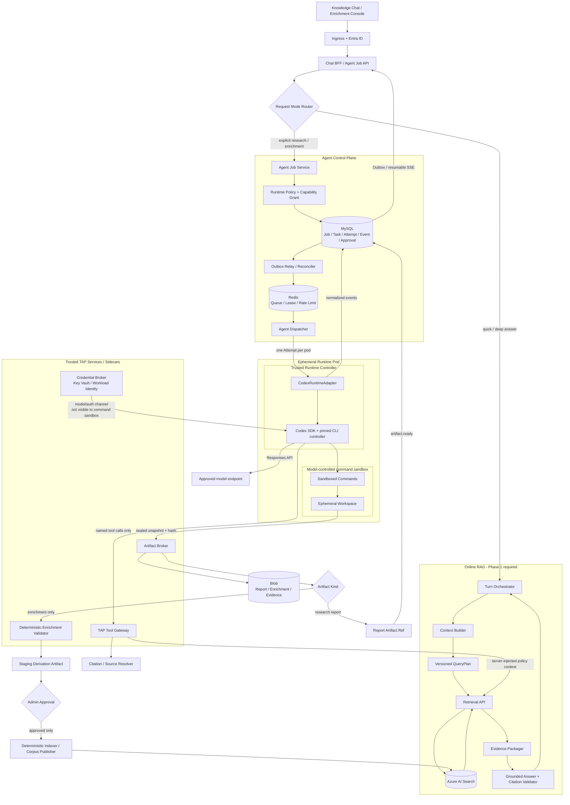

# TAP 受控 Codex Agent Runtime

| 字段 | 值 |
| --- | --- |
| 状态 | Phase 1.5 Research/Enrichment proposed baseline；不作为 Phase 1 RAG 出口条件 |
| 结论 | 可以在 TAP 后台嵌入 Codex，但只能作为可替换、隔离、异步的 Specialist Runtime |
| 首选接入 | 隔离 `agent-worker` 内使用稳定版 Python `openai-codex` / `AsyncCodex` + pinned runtime，置于 TAP `AgentRuntime` 端口之后 |
| 核心边界 | 在线知识问答不依赖 Codex；所有检索仍经 TAP Retrieval API；Phase 1.5 只做 Research/Enrichment，Test IR/代码生成待 Phase 2 |

## 1. 决策摘要

TAP 不把 Codex CLI 直接嵌入 Knowledge Chat BFF，也不让它替代 Azure AI Search、Query Planner、权限过滤或 Citation。系统保留两条互不绑死的路径：

1. **在线 RAG 路径**：普通问答和 Quick/Deep 检索走确定性的 Context Builder、Retrieval API、Evidence Packager 与 Answer Service。
2. **异步 Agent Job 路径**：Phase 1.5 只有显式深度调查或受控知识加工才启动隔离的 Codex Worker。Test IR/流程与候选代码生成可以复用同一 Runtime 边界，但要等 Phase 2 先交付 Test IR Schema、compiler 和 validator。

Codex 是 `AgentRuntime` 的一个实现，不是 TAP 领域模型。Job、Task、Attempt、Policy、Approval、Artifact、Citation 和 Audit 仍由 TAP 定义；更换 Runtime 不得改变公共 API。

## 2. 阶段架构



关键隔离点：

- `Online RAG` 即使关闭、限流或替换 Codex Runtime 也必须完整工作。
- Codex 不能直接连接 Azure AI Search、MySQL、Blob、Key Vault 或生产 Git；检索只能调用 TAP 窄工具，Artifact 只能由可信 Broker 上传。
- Agent Job 是独立 Task/Attempt，不复用 Chat turn 状态机，也不能把 CLI transcript 当业务事实。
- 用户看到的是检索、工具、验证、审批等可观察事件，不展示隐藏思维链。

## 3. 为什么首选 SDK，而不是直接起 CLI 子进程

| 接入方式 | 适用范围 | TAP 决策 |
| --- | --- | --- |
| Codex SDK | 服务端启动、继续和恢复 coding thread；内部工具与工作流集成 | **首选**。Python TAP Worker 使用稳定版 `openai-codex`/`AsyncCodex`，封装为 `CodexRuntimeAdapter` 并固定 Adapter/package/CLI image digest；Phase 1.5 以 headless、fail-closed 能力为准 |
| `codex exec` | 一次性脚本、CI、定时任务和本地 PoC | 只用于 POC、离线评测与简单批处理，不作为长期多租户服务协议 |
| Codex App Server | 需要完整会话、审批、steer/fork 和细粒度流式事件的深度客户端 | 仅列为后续 POC。官方目前将 app-server command 与 WebSocket transport 标记为 experimental/unsupported for production；若试验只在 Worker 内用 stdio/Unix socket，不形成生产承诺，也不让前端直连 |
| Codex MCP Server | Codex 只是更大 Agent 编排中的一个 Specialist | 作为后续互操作选项；Phase 1.5 不为引入 MCP 而重写 Orchestrator |

OpenAI 官方将 Codex SDK 定位为把本地 Codex Agent 集成进 CI/CD、内部工具、工作流和应用的服务端接口；非交互模式 `codex exec` 定位于脚本与 CI；App Server 则用于认证、会话历史、审批和流式 Agent 事件等深度集成。TAP 采用这些公开边界，但自行负责多租户、状态、审计和领域契约。

当前官方 Python SDK 要求 Python 3.10+，稳定包名为 `openai-codex`，发布包带 pinned Codex CLI runtime，并为异步应用提供 `AsyncCodex`。TAP 因此不需要在 Python BFF 内手工管理 raw CLI/App Server；SDK 只运行在独立 `agent-worker`/Attempt Pod，BFF 继续通过 `AgentRuntime`/Job API 与它解耦。

SDK 文档公开保证的核心是 thread start/continue/resume，不把 App Server 的 approval/steer/interrupt/event 能力自动归因于所有 SDK Adapter。Phase 1.5 先协商 Runtime feature set：headless SDK 使用 `approval_policy=never`、最小 sandbox 与越界 fail closed；只有未来经单独验证且声明 `interactiveResponses=true` 的 Adapter 才能接 TAP brokered interaction。Artifact 发布的人审属于 TAP Workflow，不依赖 Provider 内部 approval。

## 4. 请求路由与允许场景

| 请求 | 默认执行路径 | Codex 权限 |
| --- | --- | --- |
| 普通知识问答 | Retrieval API → Answer Service | 不启动 Codex |
| 跨文档复杂问答 | 有界 QueryPlan / 多跳检索 | 默认不启动；用户显式选择 Research 后可用只读 Codex Job |
| 知识摄取 | Typed parser/chunker 的确定性 Pipeline | Codex 只能生成分类、摘要、parser/data-quality 改进建议 Artifact；Phase 1.5 不生成代码/patch，也不能直接发布 active corpus |
| 新测试流程（Phase 2） | Retrieval API → Draft Test IR → 编译/验证 | Test IR v1/validator/compiler 就绪后，Codex 才可在隔离 workspace 生成 Draft IR 和候选代码 |
| 更新已有测试（Phase 2） | 固定 revision 检索 → 最小语义 patch | Test IR/Git 契约就绪后，Codex 只修改指定 worktree 并输出 diff 与证据 |
| RCA/复杂调查 | Evidence refs → 只读分析 | 可使用只读工具；结论标记为 Agent Finding |
| Git 发布、生产操作 | Commit/Execution Service | Codex 无直接权限；必须经过 TAP Policy、确定性检查和审批 |

以下能力禁止直接暴露给 Codex：

- Azure AI Search 原生 Query DSL、任意 MySQL SQL、Blob account key 或 Key Vault secret value。
- 生产分支 push、PR merge、部署、删除索引、修改 ACL、关闭质量门禁。
- 任意公网访问、宿主文件系统、Docker socket、Kubernetes API 和跨项目共享目录。
- Web search、Apps/connectors/plugins、非 TAP MCP、Browser/Computer Use、Codex cloud task 和任意用户级工具发现；这些通道不受 command network proxy 统一保护，必须分别禁用。
- 用户 `CODEX_HOME`、个人配置/认证、未固定版本的 skill/plugin，以及 repo `.codex` 对服务策略的覆盖；项目说明只能作为不可信工作输入，不能成为 capability 配置。
- 通过检索文本、仓库文件或 Prompt 请求扩大工具、网络、Tenant、Project 或 Classification 权限。

## 5. 受控工具面

Phase 1.5 的 Codex 只看到一个平台注册、固定版本的 TAP Tool Gateway/MCP，接口为：

```text
tap.search_knowledge(query, sourceFamilies, resourceRefs, mode)
tap.resolve_citation(citationId)
tap.read_source_snapshot(sourceId, revision, anchor)
tap.propose_enrichment(kind, inputRefs, output)
```

Phase 2 在 Test IR v1、compiler/validator 和 Git 语义 diff 就绪后，才增加：

```text
tap.lookup_test_asset(stableTestId, revision)
tap.validate_test_ir(draft)
tap.compile_test_ir(draft, target)
tap.run_workspace_checks(checkProfileId)
tap.propose_patch(diff, evidenceRefs)
```

约束：

- Tool Gateway 从 Agent Job 的可信 Policy Snapshot 注入 tenant/project/actor/ACL；模型只能收窄范围。
- `search_knowledge` 复用 Phase 1 Retrieval Contract、Retrieval Profile、Trace 和 Citation，不在 Agent 内实现另一套 RAG。
- Citation、source snapshot 和历史结果每次按当前权限重新授权；Job 创建时的 ACL snapshot 只用于审计，不能维持已撤销权限。
- 工具返回有大小和 token 上限；大对象只返回受控 ArtifactRef。
- `propose_enrichment` 只创建 staging artifact；Agent 没有 Index Writer 或 active corpus publish 工具。
- `validate` 与 `compile` 是确定性服务；模型不能伪造它们的成功状态。
- `run_workspace_checks` 只提交固定 `checkProfileId` 给独立隔离的 Validator Worker；不在 Codex Pod 内执行可由模型篡改的门禁命令。

## 6. Phase 2 代码与流程生成链路

下面的链路回答“能否用 Codex 生成流程和代码”：可以，但它依赖 Phase 2 先冻结 Test IR v1、compiler/validator、Git layout 和语义 diff，不属于 Phase 1.5 的交付。Phase 2 只在本地 Git/worktree 或受控测试远端验证；正式生产 Commit Service/GitHub App/PR 副作用在 Phase 3 开放。

```text
用户目标 / BDD
→ 创建 AgentTask + RuntimePolicy
→ 固定 source revision、retrieval profile、tool/skill/runtime/model version
→ 创建隔离的 local branch/worktree
→ Codex 调用 TAP Retrieval API 检索已有资产
→ 生成 Draft Test IR；必要时生成 Framework Code 候选
→ 本地 immutable validation commit
→ Schema / compiler / lint / unit / affected-test 确定性验证
→ 保存 patch、日志、引用、模型与工具版本到 Evidence Manifest
→ 人工审批
→ Phase 2：保留批准的 local/test ChangeSet，不使用生产 Git 凭据
→ Phase 3：Commit Service 才能发布远端 branch 并创建/更新 PR
```

失败或取消时不发布远端分支。重试创建新的 Attempt 和新 worktree，不能复用可变 workspace；验证失败只返回候选和证据，不能把失败代码写入权威资产。Phase 2 的 local/test facade 不持有生产 Git credential，也不计为团队 PR 流程验收。

## 7. Phase 1.5 Agent Job 契约映射

```yaml
kind: AgentTask
metadata:
  tenantId: tenant_123
  projectId: project_456
  taskId: task_789
spec:
  purpose: knowledge_research
  inputRefs:
    - kind: source_snapshot
      id: src_123
      revision: 0123456789abcdef
      contentHash: sha256:...
  runtimeRef: codex-sdk@pinned-version
  policyRef: agent-research-readonly@v1
  retrievalProfileRef: deep-doc-code@v3
  capabilities:
    - knowledge.read
    - workspace.read
  budgets:
    deadlineSeconds: 1800
    maxTurns: 20
    maxTokens: 150000
    maxToolCalls: 100
  completion:
    requiredArtifacts: [report, evidence_manifest]
```

Runtime-specific thread/session ID 只作为外部引用写入 Attempt。TAP 至少持久化：

- Job/Task/Attempt 状态、幂等键、租约、deadline、取消与审批。
- runtime/SDK/CLI image、model、reasoning 配置、prompt、skill、tool 和 policy version。
- source/corpus/retrieval profile、Citation、Retrieval Trace 与 ACL decision refs。
- 每个工具调用的类型、参数摘要、结果 hash、耗时和授权结果。
- report/enrichment/日志的 ArtifactRef 与 content hash；Phase 2 再扩展 patch/IR/测试结果。
- token、费用、重试、降级、终止和人工采纳结果。

不默认保存隐藏推理；日志中的 Prompt、源内容、命令输出和秘密按角色脱敏与分级保留。

浏览器/BFF 的创建、查询、取消、SSE 恢复、幂等和状态机见 [Phase 1.5 Agent Job API](../reference/2026-08-20-contracts.md#phase-15-agent-job-api)。公共请求不能选择 Runtime、sandbox、工具或网络。

## 8. 沙箱、多租户与网络

每个 Attempt 使用独立短生命周期 Pod/Container：

- 独立 workspace、临时卷、PID namespace 和资源配额；不同 tenant/project 不共享可写卷、进程、runtime state 或 `CODEX_HOME`。
- Runtime Pod 设置 `automountServiceAccountToken: false`；Agent/command 容器不挂载 Kubernetes SA/WIF projected token。只有可信 Credential/Tool/Artifact sidecar 显式挂载各自最小 projected identity，且不会把 token、socket 或 secret path 暴露到 command sandbox。
- 知识调查与 enrichment 使用 `read_only`；Phase 2 生成候选 patch 才允许 `workspace_write`。服务模式禁止 `full_access`。
- Rootless、只读基础镜像、seccomp/AppArmor、无宿主挂载、无 Docker socket、有限 CPU/内存/PID/磁盘/时间。
- Codex 使用平台生成的干净、只读 runtime home 与固定 config/image；不加载个人 auth/config、用户 plugins/connectors/skills。repo `.codex`/plugin 配置被隔离，项目说明仅作为不可信任务内容，不能覆盖 RuntimePolicy。
- 若未来 POC raw App Server，Adapter 使用显式 method allowlist，并禁止可在 sandbox 外执行的 `thread/shellCommand`、experimental `process/spawn` 及任何未协商方法；浏览器永不直连 App Server。
- Shell 子进程显式使用 `shell_environment_policy.inherit="none"`、最小 include allowlist、`ignore_default_excludes=false`、不加载 shell profile；只注入 `PATH/LANG/TMPDIR` 等非秘密。Provider key/access token 只存在于可信 controller/credential broker 的不可读位置，不进入子进程 env、workspace、命令行或 Artifact。
- 模型控制的 Shell 默认无公网（`commandNetworkAllowlist=[]`）；依赖下载使用预构建镜像，或由独立、固定 profile 的 Dependency Proxy Job 完成。
- Command network proxy 只约束脚本/子进程，不能代替其他通道策略。Phase 1.5 分别禁用 web search、Apps/connectors/plugins、非 TAP MCP、Browser/Computer Use 和 cloud tasks；唯一允许的 MCP/Tool endpoint 是平台注册的 TAP Tool Gateway。
- TAP Tool Gateway 使用 controller 持有的 Job-scoped capability，校验 job/tenant/project/capability/tool/audience；模型控制的 Shell 拿不到该 credential，也不能发任意 RPC。
- Artifact Broker 在 Runtime 停止写入后封存 workspace snapshot、计算 hash 并上传 Blob；Agent/command 容器没有 Blob credential 或上传网络。
- Prompt injection 只能影响候选文本，不能改变 RuntimePolicy、工具授权、网络策略、审批或 Citation 规则。
- 并发、token、费用和工具调用按 tenant/project/runtime 分桶限流；队列使用公平调度与超时。

控制进程访问模型/auth 端点不等于给模型生成的 Shell 开公网。两者使用不同 mount、环境、进程/网络策略和审计；安全测试必须验证仓库脚本无法读取 controller 环境、`/proc`、projected token、auth socket 或 sidecar credential。

上述凭据隔离是必须由 POC 证明的安全门，而不是由配置文字自动保证。Direct WIF 路线要求 controller 与模型命令位于不同 container/PID/filesystem 边界；若无法做到，则使用 Credential Broker/本地代理，由 broker 持有上游凭据，Agent 只得到 job-scoped、audience-bound 能力，且 command sandbox 看不到代理 socket/token。

## 9. 认证与模型路由

### 个人 Lab

- POC 可使用 OpenAI API key，但只注入可信 runtime wrapper/credential broker，不写入仓库、Prompt、workspace 或 Agent 可读日志。
- 不使用个人 ChatGPT 浏览器登录作为共享后台服务凭据。

### 企业 AKS

- 两条认证路线必须分开评测、配置和审计，不能在同一 Job 内混用：
  1. **API Platform/custom provider 路线**：应用级 API key 或 LiteLLM/approved provider credential，由 Key Vault + Credential Broker 提供。
  2. **Managed ChatGPT Workspace 路线**：Workspace Agent/Codex access token，或 Workspace 管理员显式开通并完成 principal 映射的 workload identity federation。
- Workload identity federation 当前是 managed ChatGPT Workspace 的 Beta 能力；Azure/AKS workload identity 本身不自动等价于 Codex 凭据，必须完成 Workspace enablement、federation rule 和 subject mapping。
- 凭据绑定服务主体、namespace、audience 和最小 scope；轮换、撤销和费用审计由平台负责。
- 若使用 API key，按应用/环境拆分并由 Key Vault、egress proxy 和 credential broker 管理，不能让模型控制的子进程继承明文 key。

### 与 LiteLLM 的关系

Codex CLI 支持配置自定义 model provider，但公开配置要求 provider 兼容 Responses API。TAP 不能仅因 LiteLLM 提供 OpenAI-compatible endpoint 就假定 Codex 的 streaming、tool、reasoning 和 compaction 语义完全兼容：

1. 先用契约测试验证完整 Responses stream、工具调用、错误、重试、取消、用量和模型能力。
2. 通过后可把 Codex Runtime 纳入 LiteLLM/approved provider route。
3. 未通过时，Codex Runtime 作为受治理的 direct OpenAI egress exception；TAP MySQL 仍记录预算、用量和审计，不能悄悄绕过 Model Policy。

## 10. 状态、取消与恢复

- 启动 Runtime 前先在 MySQL 持久化 Task/Attempt 和 Outbox event；Redis 只负责分发与 lease。
- Adapter 先协商 event/cancel/resume/interaction feature。Provider 有事件流时映射为 TAP AgentEvent；没有时由 Adapter 只发可验证的进程/工具/Artifact 生命周期事件。未知 Provider 事件只进诊断字段，不改变成功语义。
- 浏览器断线不取消 Job；BFF 用持久事件和 cursor 恢复 SSE。
- 用户取消先进入 `cancel_requested` 并停止新工具调用；支持 cooperative cancel 时通知 Runtime，否则 Dispatcher 终止隔离 Worker，最后保存可安全封存的 partial artifacts 和明确终态。
- Worker 丢失时 Reconciler 检查 Runtime handle、workspace artifact 和远端副作用；不盲目重放。
- Retry 创建新 Attempt；相同 source revision、policy 与输入可比较，但 Agent 输出不假设字节级确定。
- Phase 1.5 不承诺跨 Pod 恢复 Codex 私有 thread/runtime state；Pod 丢失后以新 Attempt 重试，TAP Job/Event/Artifact 仍可恢复。未来若启用 thread resume，必须经 Artifact Broker 保存租户隔离、加密、带 runtime version/hash 的状态，并通过兼容性与保留策略评审。
- Runtime 不可用或缺少所需 feature 时，在线 RAG 正常服务；Agent Job 进入 `unavailable` 或留在有界队列，不降级为越权工具执行。

## 11. 分阶段落地

### POC：本地验证

- 用 `codex exec` 或 SDK 对只读示例 corpus 执行受控 Research 与 enrichment 建议。
- 验证 sandbox、取消、超时、结构化结果、费用、日志脱敏和 Prompt injection 用例。
- 不连接生产语料、生产 Git 或真实秘密。

### Phase 1.5A：只读 Research Agent

- 采用 Codex SDK Adapter，一 Job 一 Pod。
- 只开放 `search/resolve/read snapshot`；对比普通 Deep Retrieval 的质量、成本和时延。
- 只有跨文档调查显著受益时才保留该路径。

### Phase 1.5B：Knowledge Enrichment

- 对固定、已授权、已脱敏的 source snapshot 生成分类、摘要、关系或 parser/data-quality 建议。
- 输出 staging Derivation Artifact + Evidence Manifest，经类型、ACL、来源覆盖与质量 Validator 以及管理员审批后，才交给确定性 Indexer 发布；Agent 不直写 active corpus。

### Phase 2+

- Phase 2 先交付 Test IR v1、validator/compiler、Git layout 与语义 diff，再增加 `code-edit` Profile，生成 Draft Test IR、local validation commit、patch 与 Evidence Manifest；只在 local/test facade 完成审批与验证。
- Phase 3 才由正式 Commit Service 使用生产 Git credential 发布 remote branch/PR，并接入 GitHub App、Check、Outbox 与 Reconciler。
- 在 Retrieval 与 AgentRuntime Contract 不变的前提下，可 POC App Server 深度事件、Codex MCP Specialist、多 Runtime 路由和受控 Agentic Loop；App Server 当前不形成生产承诺。
- 任何测试执行或外部写操作都单独做权限、幂等、安全和评测门禁。

## 12. POC 退出门槛

- 关闭 Codex Runtime 时，Phase 1 Knowledge Chat、Retrieval API、Ingestion 和 Citation 全部通过回归。
- 在批准的跨租户、Prompt injection、恶意仓库和撤权对抗测试集及观测窗口中，unauthorized retrieval、workspace/Artifact 跨租户暴露和凭据读取检测数为 **0**。
- POC 样本中 100% Agent 检索经过 TAP Retrieval API，并带 Trace/Citation/ACL decision。
- POC 样本中 100% report/enrichment 来自固定 input revision/hash，具备 runtime/model/prompt/tool/policy/output-schema version 与 content hash。
- 取消、超时、Pod 丢失、SDK 升级和模型失败均得到可审计终态；对已定义外部副作用做 Reconciler 对账，测试窗口内无未解释孤儿副作用。
- Enrichment 未经 Validator 和管理员审批不进入 active corpus；Agent 没有 Index Writer/publish 权限。
- 相比确定性 Deep Retrieval 基线，Research 任务完成率提升足以覆盖新增时延、费用和运维复杂度；Enrichment 通过独立 off/on ablation 验收。
- Phase 2 候选即使通过确定性验证和人工审批，也只保留在 local Git/worktree 或受控测试远端，不得进入生产远端 Git；Phase 3 启用正式 Commit Service 后才可按发布门禁创建/更新 remote branch/PR，Agent 始终不具备 merge 权限。

## 13. 官方依据与事实边界

- [Codex SDK](https://learn.chatgpt.com/docs/codex-sdk)
- [Codex App Server](https://learn.chatgpt.com/docs/app-server)
- [Non-interactive mode](https://learn.chatgpt.com/docs/non-interactive-mode)
- [Codex authentication](https://learn.chatgpt.com/docs/auth)
- [Agent approvals and security](https://learn.chatgpt.com/docs/agent-approvals-security)
- [Configuration reference](https://learn.chatgpt.com/docs/config-file/config-reference)
- [Workload identity federation](https://learn.chatgpt.com/docs/enterprise/workload-identity)

公开资料确认 Codex SDK 可用于内部工具/应用和服务端 coding thread，CLI 支持脚本/CI，App Server 协议提供深度客户端事件与审批，但其 command/WebSocket transport 当前被标为 experimental/unsupported for production。Codex 提供 sandbox/approval、可配置的子进程环境和程序化认证方式；command network proxy 不覆盖 web search、connectors/plugins、MCP、Browser/Computer Use、cloud task 或 model/auth 流量，因此 TAP 对这些 surface 分别 deny by default。本文的一 Job 一 Pod、TAP Tool Gateway、Test IR 优先、Git 审批链、多租户隔离与 Phase 1.5 分期是 TAP 的工程决策，不是对 OpenAI 内部部署的描述。
