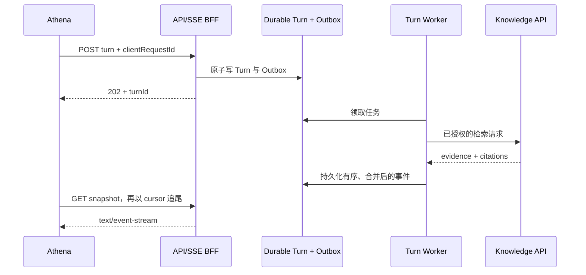

# RFC-003：Phase 1 应用工程结构

## 摘要

本 RFC 定义 Phase 1 的前后端工程结构、模块依赖、契约生成、流式通信、测试与性能边界。TAP 采用单仓库、单 Python package、多运行角色的模块化单体；Web 采用 Vite、React、TypeScript、Ant Design 与 Tailwind CSS。`Athena` 是 TAP Knowledge Chat 的产品名和可嵌入 UI 外壳，后端领域仍使用 `chat` 与 `knowledge`，避免产品命名渗入稳定契约。

本 RFC 细化 [ADR-013](../decisions/2026-08-21-adr-013-phase-1-knowledge-chat.md) 与 [ADR-015](../decisions/2026-08-21-adr-015-react-typescript-python-fastapi.md)，不替代既有 [Knowledge Chat](../architecture/2026-08-21-knowledge-chat-ui.md) 和 [RAG Foundation](../architecture/rag/2026-08-21-foundation.md) 行为契约。

## 背景

仓库目前只有文档，尚无应用、测试或构建工具。Phase 1 既要尽快交付知识库问答，又要为 Athena 嵌入 TAP 各页面、以及未来测试用例生成等能力复用 RAG 留出清晰边界。若现在按页面堆放代码，前端状态、Chat 领域和检索实现会迅速耦合；若过早拆仓库或微服务，又会增加契约发布、部署和排障成本。

## 目标

- 给出可直接落地的 Phase 1 目录、依赖方向和本地命令。
- 让 Athena 同时支持独立页面与未来的全局嵌入，不复制 Chat 实现。
- 让 Chat 和未来业务能力通过稳定的 Knowledge 应用接口复用 RAG。
- 从同一 Pydantic 契约代码库生成 OpenAPI、SSE JSON Schema 和 TypeScript 类型。
- 在首版固化安全、可恢复流式传输、背压和可观测性边界。
- 用单元、集成、契约、架构、端到端和负载测试保护这些边界。

## 非目标

- 本 RFC 不实现应用，也不确定每个依赖的最终版本。
- 不交付 Phase 1.5 Agent Runtime、Test IR、测试执行或用例生成功能。
- 不预建未来模块、共享组件包或独立微服务。
- 不把首轮容量基线承诺为生产 SLO；SLO 必须由压测和生产数据校准。

## 方案

### 仓库布局

```text
tap/
├── apps/
│   ├── web/
│   └── backend/
├── contracts/
│   ├── openapi/api.json
│   └── events/chat-stream.schema.json
├── deploy/
├── loadtests/
├── scripts/
├── docs/
├── Makefile
└── README.md
```

首版不建立 `packages/`。只有出现第二个 TypeScript 消费者或独立发布需求时，才把生成客户端或 UI 抽成 package。`deploy/` 只保存实际存在角色的部署定义，禁止以空目录模拟未来架构。

### Web：功能优先，Athena 可嵌入

```text
apps/web/
├── src/
│   ├── app/                     # 路由、Provider、全局装配
│   ├── pages/                   # 路由页面
│   ├── widgets/athena/
│   │   ├── AthenaPanel.tsx
│   │   └── AthenaLauncher.tsx
│   ├── features/chat/
│   │   ├── api/
│   │   ├── components/
│   │   ├── hooks/
│   │   ├── markdown/
│   │   ├── state/
│   │   └── stream/
│   ├── shared/
│   │   ├── api/generated/       # 生成物，禁止手改
│   │   ├── lib/
│   │   └── ui/
│   └── test/
└── tests/e2e/
```

依赖只能沿 `app/pages → widgets → features → shared` 向下。`features` 之间不得读取彼此内部文件；跨功能复用通过公开入口或后端契约完成。Ant Design 负责表单、抽屉、弹窗等复杂交互，Tailwind 负责布局、间距和少量视觉组合；仅在需要统一 TAP 语义时封装 `shared/ui`，不批量包装整个组件库。

Phase 1 先提供 Athena 独立页面。`AthenaPanel` 不读取路由、DOM 或宿主页面内部状态；宿主通过类型化 props 传入上下文和打开状态。以后应用壳层可全局挂载 `AthenaLauncher`，各页面仍复用同一 Panel 与 Chat feature。

REST 服务端状态由 TanStack Query 管理；SSE 高频事件进入独立、可按 `(turnId, sequence)` 幂等归并的 store/buffer；面板开关、选中 citation 等瞬时 UI 状态留在组件附近。禁止每个 token 更新整棵 Chat 状态树。

### Backend：模块化单体，多角色运行

```text
apps/backend/
├── pyproject.toml
├── alembic.ini
├── migrations/
├── src/tap/
│   ├── bootstrap/
│   │   ├── config.py
│   │   ├── container.py
│   │   └── lifecycle.py
│   ├── entrypoints/
│   │   ├── api_sse.py
│   │   ├── turn_worker.py
│   │   ├── ingestion_worker.py
│   │   ├── embedding_worker.py
│   │   ├── index_writer.py
│   │   └── relay_reconciler.py
│   ├── interfaces/
│   │   ├── http/
│   │   │   ├── routes/
│   │   │   ├── schemas/
│   │   │   └── sse/
│   │   └── messaging/
│   │       └── schemas/
│   ├── modules/
│   │   ├── access/
│   │   ├── projects/
│   │   ├── chat/
│   │   └── knowledge/
│   │       ├── api.py           # 模块公开应用接口
│   │       ├── domain/
│   │       ├── application/
│   │       ├── ports/
│   │       └── adapters/
│   └── platform/
│       ├── db/
│       ├── messaging/
│       ├── observability/
│       ├── security/
│       └── clients/
└── tests/
    ├── unit/
    ├── integration/
    ├── contract/
    └── architecture/
```

`entrypoints` 只装配依赖和启动进程。`api-sse`、`turn-worker`、`ingestion-worker`、`embedding-worker`、`index-writer` 与 `relay-reconciler` 共享代码和迁移，但以独立命令及 Pod 运行。`api-sse` request handler 只执行非阻塞异步 I/O；解析、Embedding、本地 rerank 等 CPU/内存密集任务不得进入 API event loop。

领域层不依赖 FastAPI、数据库、Azure SDK 或 HTTP Pydantic DTO。`platform` 提供低层技术能力，业务语义转换留在模块 adapter；不得新增 `common`、`utils`、`services` 等无所有权的全局杂物目录。

Chat 只能调用 `knowledge/api.py` 暴露的应用接口，不读取 Knowledge 的表、索引或 adapter。未来测试用例生成应由自己的业务 endpoint/module 调用同一 Knowledge 接口，不能借用 Chat endpoint 或 Athena 内部状态。内部调用必须携带由 BFF/Policy 层从 Entra 身份和服务端事实构造的可信 `RetrievalPolicyContext`；持久任务只保存主体与策略决定引用，不保存浏览器 DTO 或访问令牌，worker 在检索前验证或刷新策略。所有调用者执行相同的对象级授权、数据范围限制、审计与提示注入防护，服务身份不能代替最终用户授权。

### 契约与生成链路

FastAPI 路由元数据及公共 Pydantic 模型是唯一人工维护的线上契约代码库；其中 HTTP DTO 与 SSE event models 是不同子图，分别机械导出：

```text
Python/Pydantic ──┬──> contracts/openapi/api.json ──> TypeScript client
                 └──> contracts/events/chat-stream.schema.json ──> event union
```

`chat-stream.schema.json` 描述浏览器可见的 SSE event envelope 和 event union，不描述 `text/event-stream` framing；它不得成为第二份手写模型。公共 `operationId` 使用稳定的 `domain_action` 命名，例如 `chat_create_turn`，不得因 Python 函数重命名而变化。生成器、Node、pnpm 与 Python/uv 版本必须固定；生成物提交仓库，CI 重新生成并要求无 diff。这是 TAP 为跨语言评审和可复现构建选择的仓库策略，并非唯一行业做法。

新增可选字段通常兼容；删除或重命名字段、收紧约束、改变状态或响应语义属于 breaking change。事件 envelope 或 union 的破坏性变化必须升级 `schemaVersion`；HTTP API 的破坏性变化必须经过 RFC/ADR、显式 API versioning 与弃用周期。手写 TanStack Query key、缓存失效和 mutation 编排，但不得修改生成客户端。

宿主传给 Athena 的 `ContextAnchor` 是生成的封闭判别联合，只包含当前已实现的资源类型；不使用开放的 `kind: string`。浏览器不能提交 tenant、ACL、搜索过滤器或权威 revision。服务端对每次使用重新授权，并解析当前请求可见的不可变 revision。敏感或临时上下文改用服务端短期 handle，并绑定用户、会话、资源、宿主功能/用途、授权版本和过期时间；上下文切换或授权变化使旧 handle 失效，handle 仍不能替代当前授权检查。未来未保存草稿必须通过显式、字段白名单和大小受限的 DTO 传入，不得抓取页面 DOM。

### Turn、SSE 与错误语义



断开浏览器连接不取消 Turn；取消必须使用显式命令。每个可恢复 SSE event 使用 `id: <sequence>`，同时提供 typed payload、心跳和明确的 `turn.completed`、`turn.abstained`、`turn.failed` 或 `turn.canceled` 终态。浏览器侧 envelope 至少保留 `eventId`、`sequence`、`turnId`、`occurredAt` 和 `schemaVersion`；wire `id` 复用十进制 `sequence`，不替代不透明的 `eventId`。恢复先读 snapshot；fetch adapter 记录 event ID，并以显式 `afterSequence` 为主要重连 cursor，只有客户端主动镜像 `Last-Event-ID` 时两者才等价。重复事件去重，缺口或超出保留上限时执行有界 reset。慢浏览器只能丢弃自己的 live tail 并断开续传，不能阻塞 worker 或持久写入；只有续传时发现 replay 超限才要求重新 snapshot。

Phase 1 使用基于 `fetch` 的 SSE adapter，以便携带 BFF 所需认证信息并读取建流前的 HTTP 错误；wire format 仍遵守 `text/event-stream`。代理必须禁用响应缓冲，心跳间隔低于基础设施 idle timeout，并优先使用 HTTP/2。

REST 错误严格使用 RFC 9457 `application/problem+json`。真实 HTTP 状态是权威；body 中可选的数字 `status` 出现时必须与之相同。客户端按 TAP 控制的稳定 `type` URI 分支，不解析 `title` 或 `detail`，Phase 1 不增加含义含混的 `code`/`errorCode` Problem Details 扩展：

```json
{
  "type": "https://tap.example/problems/turn-capacity-exceeded",
  "title": "Turn capacity exceeded",
  "status": 429,
  "detail": "No turn slot is currently available.",
  "instance": "urn:uuid:00000000-0000-0000-0000-000000000000"
}
```

示例使用保留域名 `tap.example`；生产 `type` 必须位于 TAP 控制的稳定 HTTPS 命名空间。客户端遇到未知 `type` 时按 HTTP 状态类别执行通用兜底。

重试同时依据 HTTP 状态、`type` 和 `Retry-After`。若建流前发现 replay cursor 已失效，返回 HTTP `409` 及 type 为 `.../stream-reset-required` 的 Problem Details，客户端重新获取 snapshot；这将在 RFC 接受后替换现有 `409 application/json` `StreamResetRequired` 表示。建流后无法再返回 Problem Details，改发 typed `stream.reset_required` 控制事件或业务终态事件；连接关闭只代表传输中断。SSE event-specific payload 字段由事件 schema 单独治理，不属于 Problem Details 扩展。Trace Context 和请求日志负责关联诊断，`instance` 只标识本次问题实例。

### 性能与可靠性基线

Phase 1 先固化结构性约束和测量，不做无数据支持的缓存、拆服务或语言重写：

- API 全链路异步 I/O；CPU 重任务隔离进程；队列、连接池、重试、buffer、分页和 fan-out 全部有界。
- provider delta 每 `50–100ms` 或 `32–128` 字符合并，单 Turn 不超过 `10–20 events/s`，单事件不超过 `16KiB`。
- 浏览器按 animation frame 或约 `50ms` 批量提交渲染，Markdown 只增量解析尾块，长历史和 Trace 使用虚拟化。
- 单次 replay 初始上限为 `500 events` 或 `1MiB`；单连接 BFF buffer 为 `64–128 events` 或 `256KiB`。live buffer 超限时断开该慢消费者并允许续传，只有 replay cursor 超限时走 reset。
- 压测至少覆盖 `200/500/1000` 个 SSE 连接和 `20/50/100` 个活跃 Turn；记录 receive-to-paint、首个可见 delta、p95/p99、事件循环延迟、队列深度、重连重复率、DOM/heap 与慢消费者数量。
- `traceparent`、`clientRequestId`、`turnId`、provider request ID 和 outbox sequence 贯穿 API、worker、Knowledge 与流式投影。

这些数值是首轮回归与容量验证基线；达到真实 SLO 后再由数据调整池大小、Pod 数、HPA、缓存或局部 runtime。

### 测试、开发命令与 CI

Web 使用 Vitest 与 Testing Library，测试与功能文件同目录；跨页面流程放入 Playwright `tests/e2e/`。Backend 使用 pytest，按 unit、integration、contract、architecture 分层。`loadtests/` 分离 REST、SSE、browser 和组合 scenario。

必须覆盖事件乱序、重复、缺口、重连和慢消费者；Outbox 幂等及 worker 重启；对象级越权、上下文切换、citation 重授权；检索内容提示注入和 Markdown XSS；Athena 在不同宿主页切换上下文。架构测试阻止跨层和跨模块内部导入。小型性能回归进入 CI，峰值、故障和 soak 测试作为发布或架构门禁。

脚手架完成后，根目录统一提供：

```sh
make bootstrap   # 按 lockfile 安装 pnpm 与 uv 依赖
make dev         # 启动 Web、API/SSE 和 Phase 1 workers
make check       # lint、format check、typecheck、架构检查
make test        # 前后端单元、集成与契约测试
make contracts   # 导出 schema 并生成 TypeScript 客户端
make e2e         # 运行 Playwright 用户流程
make build       # 生成可发布构建
make loadtest    # 运行选定容量场景
```

CI 使用相同命令和 frozen lockfile；`make contracts` 后必须 `git diff --exit-code`，并执行 OpenAPI/JSON Schema breaking-change 检查。

## 替代方案

- **前后端分仓或后端微服务**：隔离更强，但 Phase 1 会提前承担版本发布、远程调用和运维成本；达到独立团队、扩缩容或故障域门槛后再拆。
- **独立 `packages/api-client`**：只有一个 Web 消费者时增加无效发布边界；出现第二个 TypeScript 消费者时再提取。
- **Next.js**：适合 SSR、SEO 或服务端组件需求；当前 Athena 是认证后的嵌入式应用，Vite 的运行模型和部署面更小。如需求改变，另行决策。
- **原生 `EventSource`**：自动重连简单，但难以满足当前认证 header 和建流前 Problem Details 处理；因此 Phase 1 选 fetch-based adapter。

## 风险与缓解

- 模块化单体可能退化为跨层调用：用公开模块 API、导入规则和 architecture tests 阻断。
- Ant Design 与 Tailwind 可能互相覆盖：限定职责、集中 token，并在真实 Athena 页面做视觉回归。
- 生成物产生噪音 diff：固定工具版本、关闭时间戳、稳定排序，并由 CI 校验确定性。
- SSE 重放和慢消费者可能放大资源：合并 delta、限制 replay/buffer、显式 reset，不让 socket 反压生产者。
- 客户端上下文可能导致 BOLA 或提示注入：把 anchor 当作不可信 selector，每次服务端授权；检索文本按不可信数据隔离、校验和审计；Markdown 使用 allowlist sanitizer。
- 公共 Knowledge 接口可能成为绕过策略的捷径：所有调用者执行相同授权、范围限制和审计，内部网络不视为信任边界。
- 权限撤销后历史流可能泄露旧内容：snapshot、event tail、历史答案、citation 与 Trace 每次按当前权限重授权；若当前权限不覆盖该 Turn 的授权快照则 fail closed，不重放旧文本。

## 迁移或发布方式

仓库尚无实现，因此无需兼容旧代码路径。接受本 RFC 后，先同步相关 architecture/reference 文档，包括把建流前 reset 响应统一为 RFC 9457；再按纵向切片建立工具链与契约、最小 Turn/Outbox/Snapshot/SSE、Athena 页面、Knowledge 检索和嵌入接口。每个切片只创建当期使用的目录与运行角色，并通过对应测试后再扩展；详细顺序由后续实施计划定义。

## 验收标准

- 实际目录和依赖方向符合本 RFC，且没有未来功能的空模块。
- Athena 可作为独立页面运行，也能通过稳定 props 在宿主页挂载。
- Chat 与其他业务只能通过 Knowledge 公开应用接口使用 RAG。
- OpenAPI、SSE schema 和 TypeScript 类型可从同一模型确定性再生，CI 能发现漂移和 breaking change。
- REST Problem Details、SSE resume/reset/终态和 ContextAnchor 安全规则均有契约测试。
- 单元、集成、架构、E2E 和容量测试覆盖已列出的关键故障场景。
- README 与贡献指南记录真实可运行命令，不把规划中的目录或工具描述为已实现。

## 未决问题

无阻塞性未决问题。具体依赖版本、生产 SLO 和容量参数在实施计划与基准测试中确定，但不得改变本 RFC 的模块、契约和安全边界。

## 参考实践

- [OpenAPI Specification](https://spec.openapis.org/oas/latest.html) 与 [FastAPI Client Generation](https://fastapi.tiangolo.com/advanced/generate-clients/)：稳定操作标识和客户端生成。
- [Pydantic JSON Schema](https://docs.pydantic.dev/latest/concepts/json_schema/)：从同一模型图导出 schema。
- [WHATWG Server-sent events](https://html.spec.whatwg.org/multipage/server-sent-events.html)：SSE framing、event ID、恢复和心跳语义。
- [RFC 9457 Problem Details](https://www.rfc-editor.org/rfc/rfc9457.html)：HTTP API 机器可读错误。
- [OWASP API1:2023 Broken Object Level Authorization](https://owasp.org/API-Security/editions/2023/en/0xa1-broken-object-level-authorization/) 与 [OWASP LLM Prompt Injection](https://genai.owasp.org/llmrisk/llm01-prompt-injection/)：上下文授权和检索内容信任边界。
- [W3C Trace Context](https://www.w3.org/TR/trace-context/)：跨组件追踪传播。
