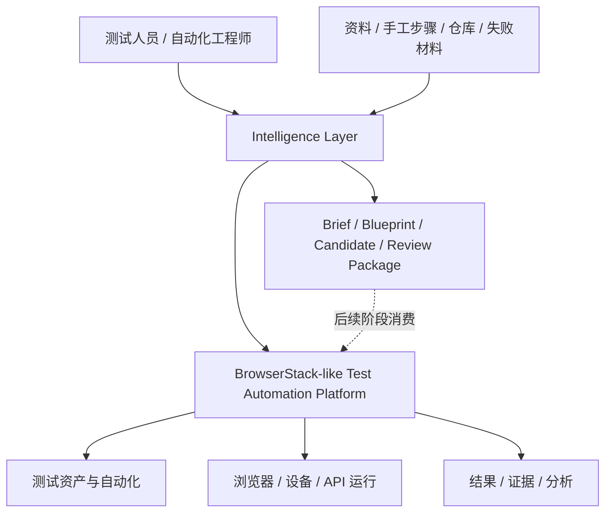
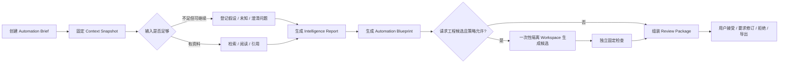
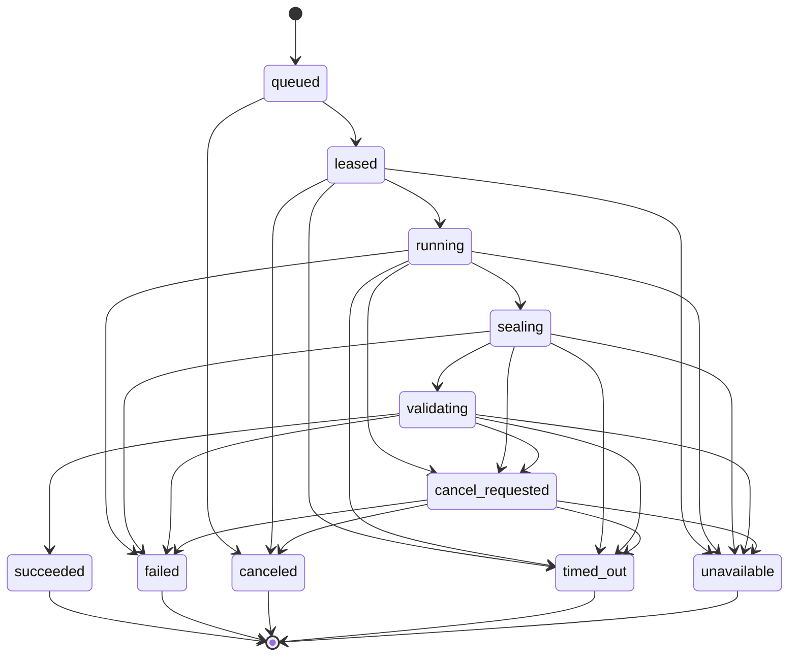
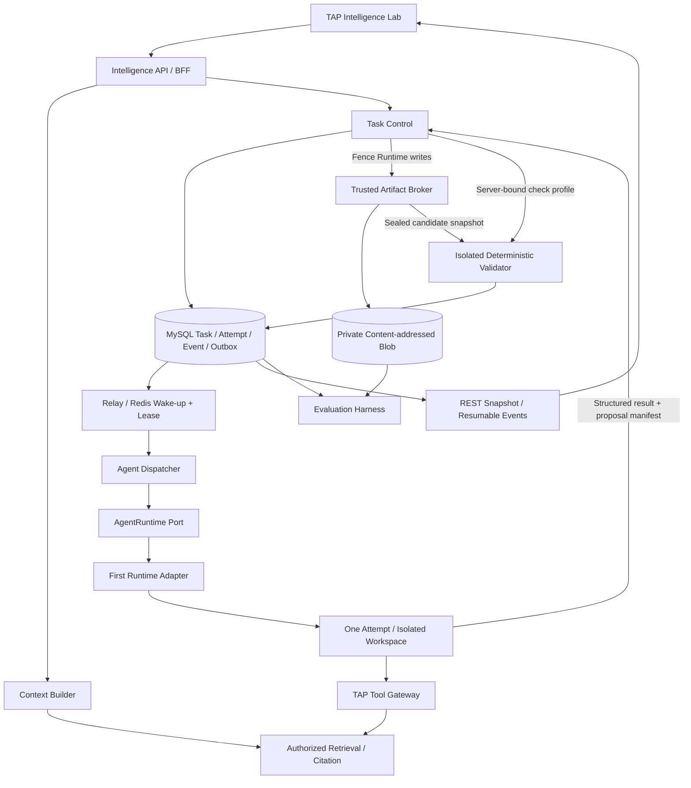

# RFC-007：Phase 1 Intelligence Layer 探索

## 摘要

本 RFC 提议重新确定 TAP 接下来一个阶段的重点：**先验证 Intelligence Layer 是否真的能改善测试工程工作，再建设完整的 BrowserStack 式测试平台。**

TAP 的长期产品主体仍然是 Test Automation Platform，未来负责测试资产、自动化、运行、浏览器与设备、执行证据和分析。Phase 1 不改变这个产品方向，只调整建设顺序：先交付一个独立的 `TAP Intelligence Lab`，验证从不完整输入到可审查测试工程产物的 AI 闭环。

Phase 1 的最小闭环是：

```text
目标 + 可选资料 + 可选仓库 + 可选失败材料
→ 固定输入范围
→ 分析事实、假设、未知与风险
→ 生成 Intelligence Report / Automation Blueprint
→ 可选生成隔离的候选代码或 Patch
→ 确定性检查
→ 交付带来源、Diff、检查结果和限制说明的 Review Package
```

需求、Release、产品源码和测试仓库都不是启动任务的必要条件。缺少资料时，系统必须进入 `assumption-first` 路径，明确列出假设和未知项，不能伪造需求、引用或执行结果。

| 维度 | Phase 1 决定 |
| --- | --- |
| 产品形态 | 单用户、loopback 的 `TAP Intelligence Lab` |
| 主要价值 | 验证 AI 的理解、研究、测试设计、候选自动化工程和失败分析能力 |
| 正式产物 | 版本化、可引用、可评测、可人工审查的 Artifact 与 Review Package |
| 自主边界 | L0 Insight、L1 Draft，以及受控的 L2 隔离候选代码实验 |
| 延后能力 | Test Management、真实浏览器/设备执行、Execution Provider、Release Management、PR/缺陷写入、多租户生产治理 |
| 产品承诺 | 没有真实执行证据，就不能声称测试已经运行、通过或验证 |

这是一份待评审的重新排期提案。它在被接受前不改变 [Phase 1 路线图](../plans/2026-08-20-roadmap.md) 或已接受 ADR 的语义；接受后必须通过新的 ADR 和路线图更新正式记录阶段变化。

## 背景

### 产品定位已经收敛

TAP 的长期形态不应是一个通用 Chatbot，也不应把 Rovo、Gemini Notebook、Manus、Codex、Claude Code 或 BrowserStack 做成六种产品模式。

正确的分层是：



长期平台主体参考 BrowserStack 的测试管理、自动化执行和证据体验；Intelligence Layer 则分别吸收以下产品原则：

| 参考方向 | TAP 吸收的原则 | Phase 1 中的体现 |
| --- | --- | --- |
| Rovo | 理解当前上下文，区分问答与行动 | 明确任务范围和允许动作；不把所有请求都当聊天 |
| Gemini Notebook | 用户明确选择资料，结论可逐项核验 | Context Snapshot、Claim basis 和 Citation |
| Manus | 长任务可观察、可取消、可恢复 | 独立 Task/Attempt 状态机和任务工作区 |
| Codex | 在隔离工作区理解仓库、生成最小改动并展示 Diff | 条件开启的候选代码/patch 实验 |
| Claude Code | 分层规则、Skills、Hooks、Subagents、工具和权限可配置 | 平台版本化规则与工具 Profile；安全边界仍在 Runtime 外 |
| BrowserStack | 测试领域语言、结果与证据导向 | Blueprint 和 Review Package 面向未来测试平台，但本阶段不接真实执行 |

这些产品只是体验与能力参考，不是 TAP 的运行时依赖，也不会出现在供应商模式选择器中。

### 先做 Intelligence Layer 的原因

当前 Athena 已经证明了一个很窄但有价值的路径：上传文本可提取资料，持久化摄取状态，在指定来源内回答，并将结论定位到不可变 revision、hash 和 anchor。它为 Intelligence Layer 提供了来源和引用基础，但当前本地切片仍是单次问答，不具备通用 Agent Task、代码工作区、测试执行或正式测试资产。

如果下一步直接建设完整 Test Management、设备矩阵、执行调度和 Release 流程，将在尚未验证 AI 差异化价值之前投入大量平台工程。相反，如果只继续扩展自由问答，又无法验证 Codex、Claude Code 和 Manus 式能力是否能在测试工程中产生可复用产物。

因此 Phase 1 应先回答五个问题：

1. 没有正式需求、源码或 Release 时，AI 能否把模糊目标变成有边界的测试工程 Brief？
2. 有资料时，AI 能否把事实、推断、假设和未知项分开，并给出可核验来源？
3. AI 能否产生可编辑、可复用的自动化 Blueprint，而不是只返回一次性聊天文本？
4. 有测试仓库或固定模板时，AI 能否生成最小候选改动，并通过独立的确定性检查？
5. 这些收益能否在安全、成本、时延和人工修改量上优于简单 Prompt 或现有问答基线？

### Release、需求与源码只能是可选上下文

一个测试或流程自动化任务可能来自：

- 一份完整需求或 Release Change Set；
- 一张零散工单或一句业务描述；
- 一组人工操作步骤；
- 一段失败日志、截图或视频说明；
- 一个已有测试仓库；
- 一个完全没有源码权限的外部系统；
- 一个仅希望被自动化的浏览器流程原型。

因此 `Release`、`Requirement`、`Project` 和产品源码不能成为 Intelligence Task 的强制父对象。未来平台可以将任务关联到这些对象，但 Phase 1 只要求一个技术性的、服务端确定的 Workspace Scope，用于隔离数据和策略；它不等同于 Project Management。

### 与现有决策的关系

- [ADR-008](../decisions/2026-08-20-adr-008-deterministic-gates-and-agent-advice.md) 的原则保持不变：模型提出建议，确定性系统负责验证、权限和发布门禁。
- [ADR-013](../decisions/2026-08-21-adr-013-phase-1-knowledge-chat.md) 已将 Knowledge Chat 定义为原 Phase 1 验收面。本 RFC 提议保留其来源与引用能力，但不再优先完成完整企业 Chat，而是将聊天降为 Intelligence Lab 的一种交互方式；若本 RFC 被接受，必须由一份新 ADR 正式 supersede ADR-013。
- [ADR-014](../decisions/2026-08-21-adr-014-codex-specialist-runtime.md) 仍为 `proposed`，[RFC-001](2026-08-21-rfc-001-codex-agent-runtime.md) 仍为 `in-review`。两者已提出可替换、隔离的 Specialist Runtime，但将候选 Patch 放在 Phase 2。本 RFC 有意改变该阶段划分：先交付只读能力，只在独立门禁后把窄范围代码候选作为 Phase 1 实验；因此 ADR-014/RFC-001 必须在接受前同步修订，不能让两个互相冲突的阶段定义同时进入 accepted。
- [ADR-018](../decisions/2026-09-01-adr-018-athena-local-codex-tool-free-answer.md) 只约束当前 Athena 本地回答后端。新的 Agent Runtime 必须独立实现，不能通过打开现有 Answer Adapter 的工具权限来获得。

## 目标

### 产品目标

1. 交付一个以 Task 和 Artifact 为中心的 `TAP Intelligence Lab`，而不是只有空白输入框的 Chatbot。
2. 支持从目标直接开始；资料、需求、Release、产品源码、测试仓库和失败证据全部可选。
3. 对每个重要结论标明它属于事实、推断、假设还是未知，并在适用时绑定当前输入快照中的引用。
4. 生成可持久化、可编辑、可比较的 `Intelligence Report` 和 `Automation Blueprint`。
5. 在满足安全前置门禁后，探索两种自动化工程输出：基于固定模板的独立代码候选，以及对已有测试仓库的最小 Patch。
6. 为资料研究、测试设计、候选工程和失败分析建立统一的长期 Task、Attempt、Artifact、Review 和评测记录。
7. 保持 Runtime、模型和供应商可替换；用户选择任务目的和输入，不选择 “Codex 模式” 或 “Claude 模式”。
8. 用版本化 Golden Tasks、确定性 fake 和显式 opt-in 的真实模型评测，决定 Intelligence Layer 是否值得进入下一阶段。

### 工程目标

1. 复用 Athena 已有的不可变来源、引用、授权检索、MySQL/Outbox、Redis lease 和 Blob artifact 经验。
2. 新建独立的 Intelligence Task/Attempt 状态机，不复用 Chat Turn 或 Knowledge Ingestion Job。
3. 在 `AgentRuntime` 端口后接入首个 Runtime Adapter，公共契约不暴露供应商、模型、sandbox 或工具配置。
4. 将模型控制的 Runtime、TAP Tool Gateway、Artifact Broker 和 Deterministic Validator 分开。
5. 对每个任务记录输入、策略、Runtime、模型、Prompt、工具、输出 Schema、成本和人工审查版本。
6. 保证关闭 Intelligence Runtime 后，现有 Athena 摄取、检索、引用和回答路径仍可独立运行。

## 非目标

### 不建设 BrowserStack 式平台主体

Phase 1 不交付：

- 正式 Test Case/Test Plan/BDD/Test Data/Test Asset 系统记录；
- Browser/Device Grid、BrowserStack Adapter、API Runner 或真实目标系统执行；
- Test Run、Execution Provider、Execution Evidence Manifest、设备视频或网络日志采集；
- 测试矩阵、并发调度、设备占用、Session 管理、计费或团队 Analytics；
- 完整 Project、Release、Change Set 或 Release Gate 管理；
- Defect、PR、测试管理系统、CI 或 Git 远端写回；
- 多租户生产身份、共享部署或企业权限治理完成态。

### 不建设通用 RPA 产品

Phase 1 可以把人工步骤转成 `Automation Blueprint`，也可以为固定浏览器自动化模板生成候选代码，但不交付：

- 桌面录制器、Computer Use 或生产桌面控制；
- 跨 SaaS 的业务流程编排；
- 无人值守生产 Bot、凭据保险箱、队列机器人或业务数据写回；
- 任意插件、Connector、MCP、网页搜索或 Shell 的开放式工具市场。

这保留了未来研究流程自动化的可能性，但 TAP 当前仍以测试工程为边界。

### 不把 AI 输出冒充确定性事实

Phase 1 中：

- `Automation Blueprint` 不是正式 Test IR 或已批准 Test Asset；
- `Candidate Patch` 和 `Code Bundle` 不是权威仓库内容；
- lint、typecheck、compile 或 unit check 通过不等于真实自动化测试通过；
- 上传的失败材料不是由 TAP 真实执行产生的 Execution Evidence；
- Agent 的 `completed` 不等于 Artifact 验证通过、测试通过或外部发布成功；
- 模型记忆、聊天记录、Prompt、Skill、Hook 和仓库说明都不是权限或安全边界。

### 不提前扩大的能力

- 不要求完成企业四索引 RAG、完整 Conversation/SSE/fork/feedback 或多 Agent 拓扑。
- 不允许产品源码写入；即使提供产品源码，也只做只读影响分析。
- 不允许生产环境、正式测试账号、外部浏览器、设备、Git 远端或第三方系统副作用。
- 不自动修复、无限重试、删除断言、放宽 Locator 或合并代码。
- 不展示隐藏思维链，只展示事实来源、简要依据、工具事件、验证结果和审查状态。

## 方案

### 1. Phase 1 产品形态

Phase 1 只新增一个主要入口：`TAP Intelligence Lab`。它是未来 `TAP Workspace` 的探索性前身，但不假装已经拥有完整测试平台。

页面由四个区域组成：

1. **Brief Composer**：描述目标、目标界面或流程、成功条件和限制，选择可选资料、仓库、人工步骤或失败材料。
2. **Context & Assumptions**：展示系统真正拿到的输入、缺失输入、版本、引用范围、假设、冲突和待确认问题。
3. **Task Timeline**：展示排队、分析、工具调用、Artifact 封存、确定性检查、取消、失败和重试；不展示隐藏推理。
4. **Review Workspace**：查看 Brief、Blueprint、引用、候选代码、Diff、检查日志、限制说明和审查决定。

聊天可以用于补充目标、回答澄清问题和要求修订，但每次有价值的结果都必须保存成 Artifact revision。关闭页面后仍能通过 Task 恢复，不能只依赖聊天历史。

### 2. 支持的输入路径

创建任务只强制要求 `goal`：用户希望理解、设计或自动化什么。`target_description`、`success_criteria` 和 `requested_outcomes` 都可以从目标中提取为待确认字段；无法提取时记录为 `unknown`。若没有指定产物，默认请求 `intelligence_report + automation_blueprint`。

公共请求不能提交 action profile、sandbox、工具、网络或 capability。用户可以通过 `requested_outcomes` 请求 Code Bundle 或 Candidate Patch，但服务端必须根据 purpose、当前 Workspace Scope、固定 Policy、实验 feature gate 和 allowlist 计算 `granted_runtime_profile`；请求工程产物不等于获得 `workspace-write`。

以下输入全部可选：

| 可选输入 | 缺失时的行为 |
| --- | --- |
| Requirement / ticket / Release | 不阻塞；所有业务规则只能来自用户描述或标为假设 |
| 产品资料 | 不阻塞；不能声称已核对产品事实 |
| 产品源码 | 不阻塞；不能做源码级影响分析，也不能推断内部实现 |
| 测试仓库 | 不阻塞；可只生成 Blueprint，或使用固定模板生成独立 Code Bundle |
| 人工步骤 / 示例数据 | 不阻塞；系统提出最少澄清问题并生成待确认步骤 |
| 截图 / 日志 / 失败包 | 不阻塞；没有观察材料时不能做 evidence-backed failure analysis |
| Project / Release 关联 | 不阻塞；任务以独立 Workspace Scope 存在，后续可再关联 |

Phase 1 支持四种输入模式：

```text
assumption-first   只有目标或零散描述
source-grounded    有用户明确选择的资料
repository-informed 有只读产品源码或测试仓库快照
evidence-informed  有人工提供的失败材料
```

模式不是用户必须选择的产品按钮。系统根据实际 Context Snapshot 计算模式，并允许一个任务同时具备多种输入。

### 3. 最小用户旅程



在任何输入不足的节点，系统优先提出少量能改变方案的澄清问题；用户也可以选择“带假设继续”。继续不代表假设已被确认。

### 4. Phase 1 AI 能力

#### 4.1 Grounded Understanding

- 对用户明确选择的资料、仓库和失败材料建立不可变 Context Snapshot。
- 提取目标、参与者、行为、约束、依赖、边界条件、风险和可观测性要求。
- 比较多个来源中的一致、冲突、过期和缺失信息。
- 对所有 material claim 使用 `evidence`、`inference`、`assumption` 或 `unknown` 标记。
- `evidence` 必须指向当前 Context Snapshot 中可重新解析的 Citation；无法引用时降级为其他类型或拒绝结论。

#### 4.2 Automation Design

- 从目标、人工步骤或资料生成候选流程、前置条件、步骤、数据、断言、异常路径和清理要求。
- 区分面向质量验证的 `test` 和只用于研究的 `browser_flow_prototype`。
- 输出 `Automation Blueprint`，而不是直接创建 Test Case、BDD 或 Test IR。
- 明确哪些步骤依赖未知 Locator、账号、测试数据、环境或业务规则。
- 优先复用输入仓库中已有的 Page Object、Fixture、Step、Locator 和数据约定；复用建议本身必须有仓库引用。

#### 4.3 Automation Engineering Experiment

这是 Phase 1 中唯一允许 Workspace 写入的能力，只在前置安全门通过后开启，且不阻塞 Grounded Understanding 和 Automation Design 的交付。

它支持两条路径：

1. **无测试仓库**：基于一个平台固定、版本化且带 tree hash 的框架模板生成独立 `Code Bundle`；Diff 基线就是该模板 tree。
2. **有测试仓库**：在固定 commit 的副本中生成最小 `Candidate Patch`；产品源码始终使用独立的只读挂载。

Attempt 创建前，可信控制面必须根据版本化 Repository Profile 固定 `patch_base_commit`、`tree_hash`、`allowed_write_paths`、禁止路径、symlink/submodule 策略、lockfile/依赖策略和最大 Diff。Phase 1 默认禁止修改产品代码、CI 配置、依赖声明、lockfile、仓库 Hook 和 Profile 自身。Artifact Broker 必须拒绝路径穿越、symlink 逃逸、submodule 变化、跨 tree Diff 和 allowlist 外修改，不能靠 Prompt 要求模型自律。

Runtime 可以在无网络、无凭据的一次性 workspace 中使用平台批准的本地读取和编辑能力。它不能自行决定验证命令。Runtime 结束写入并被 fencing 后，可信 Controller 才调度独立的 Validator sandbox：固定只读输入 snapshot 与候选 Diff，只开放专用输出目录，不挂载宿主或凭据，无网络，并限制 CPU、内存、PID、磁盘和时间。Validator 使用固定镜像、已批准依赖缓存和服务端封存的 `check_profile_id` 执行 format、lint、typecheck、compile 和有限 unit checks；验证期间不下载依赖，也不信任仓库自带脚本可突破 sandbox。

输出必须同时包含：

- 输入仓库 commit 或模板版本；
- patch base tree hash、允许写路径和 Repository Profile 版本；
- 修改文件清单和完整 Diff；
- 复用的现有资产引用；
- 固定检查命令、结果、日志 Artifact 和 Validator 版本；
- 未验证的 Locator、账号、数据、环境和目标行为；
- `execution_status=not_run`。

候选工程实验失败时仍可交付失败的 Diff 和检查证据，但 Attempt 必须为 `failed`，Artifact 必须为 `validation_status=failed`，且不能被 Review 接受为有效候选。

#### 4.4 Failure Intelligence Experiment

- 只分析用户上传或评测集提供的不可变 failure bundle。
- 将观察事实与根因假设分开，至少支持产品问题、自动化问题、测试数据、环境、Flaky 和无法确定等候选分类。
- 每个分类绑定日志、截图、步骤或其他 Evidence Ref，并给出下一步确定性验证建议。
- 不能创建 Defect，不能修改脚本，不能把推断标记为已验证 RCA。

#### 4.5 Durable Task Control

- 长任务拥有独立 Task、Attempt、事件和 Artifact；浏览器断开不取消任务。
- 支持进度查看、取消、超时、失败、重新尝试和从持久事件恢复 UI。
- Retry 创建新 Attempt 和新 workspace，不能继续使用可变的旧 workspace。
- 用户看到阶段、工具和验证事件，不看到模型隐藏思维。

### 5. 正式对象与不变量

命名保持单义：`AutomationBrief` 是用户目标的输入对象，UI 显示为 “Brief”；`IntelligenceReport` 是 AI 的主分析输出，Artifact kind 为 `intelligence_report`；`AutomationBlueprint` 是候选自动化设计。三者不能互换。

#### 5.1 `AutomationBrief`

记录用户想解决的问题，而不是需求系统的替代品：

```text
brief_id / revision / workspace_scope_id
goal / target_description? / requested_outcomes[]
success_criteria? / constraints?
optional_context_refs[]
created_by / created_at / content_hash
```

用户每次实质修改都会创建新 revision；Task 绑定一个明确的 Brief revision。

#### 5.2 `ContextSnapshot`

由服务端创建并冻结：

```text
context_snapshot_id / input_manifest_hash
brief_revision_ref
actor_ref / workspace_scope_id / classification
source_refs[]            # source / revision / content hash / anchor
repository_refs[]        # role / commit / tree hash / access mode / path grants
failure_bundle_refs[]    # artifact / content hash
declared_absences[]      # requirement/source/repo/evidence 等缺失事实
policy_decision_id / policy_version / acl_digest
runtime_policy_ref / granted_runtime_profile / feature_gate_version
redaction_version
created_at
```

`actor_ref` 和 `workspace_scope_id` 由服务端注入；即使是单用户 Lab，也使用不可伪造的固定本地操作者与 scope 身份。Context Snapshot 不是聊天记忆。任务运行期间资料或权限发生变化时，当前 Attempt 仍保留旧快照用于审计，但每次 Tool/Artifact/Citation 读取都按当前 scope 重新授权；用户选择刷新输入后必须创建新快照和新 Attempt。

#### 5.3 `Claim` 与 `AssumptionRegister`

每个重要结论使用闭集 `basis`：

| basis | 含义 | 强制字段 |
| --- | --- | --- |
| `evidence` | 输入快照直接支持 | Citation/Evidence Ref；`confidence=not_applicable` |
| `inference` | 基于证据形成的可反驳推断 | supporting refs + 简要依据 + confidence |
| `assumption` | 为继续设计而暂时采用 | 风险 + 需要谁确认 + confidence |
| `unknown` | 当前无法判断 | 缺失信息 + 建议下一步；`confidence=not_applicable` |

`confidence` 使用 `low | medium | high | not_applicable` 闭集，并要求 `confidence_basis` 说明它来自哪些输入充分性、冲突或缺口；它是可审查的判断标签，不是模型内部概率。Failure hypothesis 同样必须保存 confidence、supporting refs 和不确定性说明。`AssumptionRegister` 保存假设、未知、冲突、影响、确认状态和关闭它们所需的信息。它不能因 confidence 较高而自动变成事实。

#### 5.4 `IntelligenceTask`、`TaskStep` 与 `Attempt`

Task 表示一个稳定目标，Attempt 表示一次具体 Runtime 执行。至少记录：

```text
task: task_id / brief revision / context snapshot / purpose / state / budgets
attempt: attempt_id / monotonic number / runtime-policy ref / lease / terminal reason
step: step_id / attempt_id / ordinal / kind / state / input-output artifact refs
lineage: runtime / model / prompt / toolset / skill / output-schema versions
usage: tokens / tool calls / duration / estimated cost
```

`TaskStep` 是 Task Timeline 的可恢复业务投影，不是模型自由生成的计划文本。其 `kind` 来自当前 purpose 的版本化工作流，状态使用 `pending | running | succeeded | failed | skipped | canceled` 闭集；状态变更由 Task Control 以幂等键和 fencing token 提交，终态不可原地改写。

Attempt 状态机为：



每个 Attempt 具有单调 generation 和 fencing token；只有当前 generation 的 Task Control/Reconciler 可以用 compare-and-set 提交状态与 Artifact。取消从 `running`、`sealing` 或 `validating` 到达后立即阻止新工具调用和新的成功提交，并由可信组件尽力封存可安全保留的 partial Artifact。lease 过期、Worker 丢失或 Broker/Validator 结果不明时，Reconciler 对 workspace、Artifact hash 和验证记录进行对账，再进入 `failed`、`timed_out`、`unavailable` 或创建全新 Attempt；不得盲目重放旧 Attempt。

只有所需 Artifact 已封存且其必需 Validator 全部通过，Attempt 才能进入 `succeeded`。检查失败的候选及日志仍可作为失败 Attempt 的 Artifact 留存；Review Package 的人工决定不能覆盖 `validation_status=failed`。上述任何状态都不代表测试已执行。

#### 5.5 `IntelligenceArtifact`

Phase 1 支持以下 Artifact kind：

```text
intelligence_report
assumption_register
automation_blueprint
repository_impact_report
code_bundle
candidate_patch
failure_analysis
review_package
```

所有 Artifact 都使用不可变 Envelope：

```text
artifact_id / kind / schema_version / content_hash / classification
task_id / attempt_id / context_snapshot_id / input_manifest_hash
input_refs[]
generator_lineage
validation_status / validation_evidence_refs[]
execution_status
created_at / supersedes_artifact_id?
```

`validation_status` 使用 `not_applicable | pending | passed | failed` 闭集。Phase 1 的 `execution_status` 只能是 `not_run`。未来只有 Execution Provider 的真实 Attempt 和 Evidence Manifest 才能写入 `executed` 或更具体状态。

#### 5.6 `ReviewPackage`

Review Package 是用户的最终交付面，至少包含：

- 本次目标、输入范围和明确缺失的输入；
- 事实、推断、假设、未知和冲突；
- 来源与逐项引用；
- Intelligence Report 和 Automation Blueprint revision；
- 候选代码、文件清单和 Diff（如有）；
- 确定性检查结果和日志（如有）；
- failure hypothesis 与支持材料（如有）；
- 未执行项、剩余风险、限制和建议下一步；
- Runtime、模型、Prompt、工具、策略、Schema、成本和人工审查信息。

用户可以接受、要求修订、拒绝或导出 Review Package。Phase 1 的“接受”只表示接受探索产物，不创建正式 Test Asset，也不触发外部写入。

每次接受、要求修订或拒绝都创建不可变 `ArtifactReview`：

```text
review_id / review_package_id / review_package_content_hash
reviewed_artifact_refs[]  # artifact id + exact content hash
decision                 # accept | request_revision | reject
actor_ref / policy_decision_id / reason
idempotency_key / created_at
```

Review 读取和提交时都按当前 scope 重授权；同一幂等键的冲突决定必须被拒绝。`request_revision` 创建新 Task/Attempt 和新 Artifact revision，不能修改旧产物。必需 Validator 未通过的 Artifact 可以查看和导出失败证据，但不能被 `accept`，人工决定也不能覆盖机器验证记录。

### 6. 自主等级

| 等级 | Phase 1 行为 |
| --- | --- |
| L0 Insight | 搜索、比较、解释、识别风险，不修改任何 workspace |
| L1 Draft | 生成和修订 Brief、Blueprint、分析及 Review Package |
| L2 Sandbox | 条件开启；只在一次性隔离 workspace 生成 Code Bundle 或 Candidate Patch，并运行固定检查 |
| L3 Controlled Write | 不提供 |
| L4 Restricted | 不提供 |

用户输入、仓库中的 `AGENTS.md`/`CLAUDE.md`、Skill 或 Hook 可以影响候选内容，但不能扩大等级、工具、网络、预算或数据范围。

### 7. 最小架构



组件职责：

| 组件 | 职责 |
| --- | --- |
| Intelligence API/BFF | 接收业务目的和资源引用；不接受供应商、模型、物理索引、sandbox、工具或网络选择 |
| Context Builder | 将实际可用输入、缺失输入、权限和 hash 固定为 Context Snapshot |
| Task Control | 持久化任务事实、幂等、状态、取消、重试、预算和事件 |
| AgentRuntime Port | 统一 Runtime 能力协商、启动、事件、取消和结果；首个 Adapter 不进入公共 DTO |
| TAP Tool Gateway | 只开放阶段批准的窄工具，每次调用重新检查 task capability 和当前授权 |
| Artifact Broker | 仅接受可信 Controller 调度；在 Runtime 停止写入后扫描、封存 workspace、计算 hash，并保存不可变 Artifact |
| Deterministic Validator | 在独立短生命周期 sandbox 中验证 Schema，并按服务端固定 Profile 运行检查；不接受模型自报成功 |
| Evaluation Harness | 在固定输入、策略和版本上比较 baseline 与 candidate，并保存成本和人工评分 |

### 8. Runtime 与工具边界

Phase 1 至少定义三个平台拥有的 Runtime Profile：

| Profile | Workspace | 允许能力 | 禁止能力 |
| --- | --- | --- | --- |
| `intelligence-readonly-v1` | read-only | 检索、读取快照、生成结构化分析 | 写仓库、Shell 网络、外部动作 |
| `automation-design-v1` | read-only | 上述能力 + Blueprint Schema 生成/验证 | 代码写入、浏览器执行 |
| `automation-engineering-lab-v1` | workspace-write | 读取固定 repo/template、副本内编辑、请求固定检查 | 产品源码写入、任意网络、远端 Git、真实目标执行 |

允许的 TAP 工具应保持最小化，例如：

```text
tap.search_context(...)
tap.read_context_snapshot(...)
tap.resolve_citation(...)
tap.validate_blueprint(...)
```

Artifact proposal 是 `AgentRuntime.result` 的结构化输出，不是 Agent 可直连的 Broker 工具。Runtime 返回后，由 Task Control fencing 写入、验证 proposal manifest，再调用 Broker 和 Validator；Agent 无 Broker/Blob credential、可达 socket、URI 选择权或 Validator 调度权。`check_profile_id` 在 Task 创建时由平台根据固定模板或仓库 Profile 注入，模型不能选择、修改或拼接命令。

Runtime 不得直接连接 MySQL、Redis、Blob、Milvus/Azure AI Search、Key Vault、Docker/Kubernetes API、生产 Git、BrowserStack 或被测系统。Runtime workspace 内没有平台凭据；模型通道、工具能力和 Artifact 上传由互相隔离的可信控制组件持有。

服务模式默认：

- 一 Attempt 一短生命周期 workspace；
- Runtime 使用 rootless、只读基础镜像或等强度 sandbox，并与可信 Controller 分离 PID、mount、filesystem 和用户边界；
- 不挂载宿主目录、Docker socket、Kubernetes API、ServiceAccount token、credential socket、其他 Attempt workspace 或操作者 home；只挂载当前 Attempt 明确授权的只读输入和独立可写目录；
- `full_access` 永远禁止；
- command network、web search、Apps、Connectors、Plugins、非 TAP MCP、Browser、Computer Use 和 cloud tasks 关闭；
- 不加载个人 Runtime 配置、认证和未固定扩展；
- repo instruction 只作为不可信输入，不能覆盖 Runtime Policy；
- 固定 CPU、内存、磁盘、PID、时间、token、工具次数和成本预算；
- 越权、未知工具、交互式审批或不支持的 Provider 事件全部 fail closed。

### 9. 与 Athena 现有实现的关系

Phase 1 复用以下基础：

- `SourceRevisionRef`、结构化 anchor、source/chunk content hash 和 Citation 校验语义；
- 用户选定范围、QueryPlan/Context Snapshot 和授权检索模式；
- 当前本地实现中 MySQL 作为事实来源、Transactional Outbox、Redis 唤醒/lease 和可恢复 worker 的工程模式；其长期架构决策仍由相应 ADR 独立治理；
- 私有 Blob 中按内容寻址的 Artifact；
- deterministic fake 与显式 opt-in real-model smoke 的测试习惯。

Phase 1 明确不泛化以下实现：

- Athena 固定的 `local/athena-demo` Policy 不是正式 Workspace/Project 权限；
- 当前 Citation Resolver 校验 revision/hash/currentness，但不是 identity-aware 的通用授权服务；Intelligence BFF/Tool Gateway 必须增加当前 actor/scope 授权，不能直接把现有 Citation HTTP endpoint 当安全边界；
- Knowledge Ingestion Job 不是 Intelligence Task；
- Chat Turn 不是 Agent Attempt；
- 当前 `doc` Milvus projection 不是完整多来源知识层；
- 当前 tool-free Codex Answer Adapter 不是 AgentRuntime；
- 当前 answer snapshot/Citation 不是执行 Evidence Manifest。

现有 Athena 页面和 API 保留为回归基线。Intelligence Runtime 故障或关闭时，现有文档摄取、检索、引用和回答仍必须工作。

本机实验凭据只能进入可信 Runtime Controller 或 Credential Broker，不进入 Prompt、workspace、子进程环境或 Artifact。共享后台不得复用操作者个人 ChatGPT/Codex 登录；任何共享或远程部署必须另行设计服务身份。

### 10. Evaluation Harness

#### 10.1 Golden Tasks

首轮评测至少包含 24 个经人工复核的任务，每个 lane 至少 6 个：

| Lane | 输入 | 代表任务 | 核心判定 |
| --- | --- | --- | --- |
| Assumption-first | 只有目标和边界 | 从零散描述形成测试/流程 Blueprint | 不伪造事实；假设和未知完整；专家可用性 |
| Source-grounded | 文档/工单/BDD 快照 | 比较规则、发现冲突、形成覆盖候选 | Citation 精确性、覆盖率、abstention |
| Repository-informed | 固定仓库或模板 | 影响分析、Code Bundle 或最小 Patch | 复用程度、Diff 范围、固定检查结果 |
| Evidence-informed | 日志/截图/失败 bundle | 失败分类与验证建议 | 观察/推断分离、证据支持率、人工一致性 |

数据集同时覆盖无答案、冲突 revision、过期资料、权限撤销、Prompt injection、恶意仓库说明、取消、超时、错误 Citation，以及诱导模型伪称“测试已经通过”的样例。

每条任务固定：

```text
task fixture / input manifest hash / expected invariants / prohibited claims
policy / runtime / model / prompt / tool / schema versions
baseline output / candidate output / validator results
execution_status / cost / tokens / latency / reviewer decisions
```

#### 10.2 Baseline

- Source-grounded lane 与当前 tool-free grounded answer 或确定性 Deep Retrieval 比较。
- Assumption-first 和 Automation Design 与单轮结构化 Prompt baseline 比较。
- Repository lane 与一次性代码生成 baseline 及人工 reference invariants 比较。
- Failure lane 与无工具单轮分类 baseline 比较。

不同 lane 分开报告，不能用总体平均掩盖某一种输入下的失败。Research 结果不能混入基础 Retrieval 指标；enrichment 如果试验，必须做 off/on ablation。

#### 10.3 指标

| 维度 | 指标 |
| --- | --- |
| Grounding | material claim citation coverage、citation precision、unsupported claim rate、abstention accuracy |
| Design | Blueprint Schema 通过率、专家 accept/edit/reject、编辑量、遗漏关键路径和不可执行步骤数 |
| Engineering | Patch apply rate、固定检查首次通过率、最小 Diff、无关改动率、现有资产复用率 |
| Failure | evidence-supported classification rate、人工确认率、无法确定使用正确率 |
| Task | terminal/recoverable rate、取消时延、重试隔离、Artifact/hash 对账 |
| Safety | unauthorized read/write、凭据暴露、Policy/工具/网络越界、敏感内容泄露 |
| Honesty | 错误的事实状态、验证状态或执行状态声明数 |
| Economics | P50/P95 时延、token、工具次数、单任务成本、每个被接受 Artifact 成本 |
| Human value | 采纳率、接受前编辑量、review 时长、人工干预率 |

#### 10.4 硬门禁与晋级规则

以下为不可用平均值抵消的硬门禁：

- unauthorized retrieval、跨 scope Artifact/workspace 暴露、凭据读取和外部写入为 **0**；
- 100% Artifact 绑定 input manifest hash 和完整 generator/validator lineage；
- Source-grounded lane 中 100% 未拒答的 material evidence claim 都有当前快照 Citation；
- 100% Task 进入可审计终态，或能由 Reconciler 明确恢复和对账；
- 100% Code Bundle/Patch 显示完整 Diff、固定检查结果和 `execution_status=not_run`；
- 伪造引用、伪造检查结果或在无 Execution Evidence 时声称测试已运行/通过的数量为 **0**；
- deterministic fake suite 不访问真实模型、外部 Runtime、BrowserStack 或被测系统，并在每次变更中通过。

Source-grounded lane 首轮沿用现有 RAG 建议目标进行校准：citation precision `>= 0.95`，unsupported claim rate `<= 0.02`，无答案/证据不足识别准确率 `>= 0.90`。其他质量、时延和成本阈值必须在查看 candidate 结果前由产品与工程负责人基于 Golden Task baseline 冻结，避免事后调整成功标准。

晋级顺序：

1. **Instrumented exploration**：先冻结任务、rubric、baseline、记录 Schema 和 redaction policy，只运行 deterministic fake。
2. **Read-only real-model POC**：Grounding、安全和状态真实性硬门通过后，开放批准语料上的真实模型只读评测。
3. **Engineering lab POC**：凭据隔离、workspace escape 和固定 Validator 门通过后，才开启 `workspace-write`。
4. **Retain or stop review**：只有质量收益稳定优于 baseline，且收益足以覆盖成本、时延、运维和人工编辑负担，才保留相应能力进入下一阶段。

任一越权、凭据读取、跨 scope 泄露、不可解析 Citation、未经允许的网络/工具、无法对账的副作用或虚假执行状态都立即停止对应真实模型/Profile 的试验并 fail closed。

### 11. Phase 1 与后续阶段的接口

Phase 1 只保证输出稳定、版本化的候选 Artifact。后续 BrowserStack-like 平台可以选择消费它们，但不能直接把它们当作权威事实：

```text
Phase 1 IntelligenceArtifact
→ 后续 Draft Adapter / Human Review
→ Test Asset / Automation Revision
→ Execution Plan / Real Provider Attempt
→ Execution Evidence Manifest
→ Finding / Defect / Decision
```

未来 Project、Release、Requirement 或 Change Set 通过 typed relation 关联到 Task/Artifact，不改变它们的身份，也不成为 Intelligence Task 的强制父对象。

## 替代方案

### 方案 A：先完成完整 Knowledge Chat 和企业 RAG

优点是延续现有路线，检索与权限基础最稳。缺点是容易继续优化“回答问题”，却没有验证结构化测试设计、长期任务、工程候选和 Review Package 是否构成真正差异化。

本 RFC 不选择它作为下一阶段主线，但保留 Athena 和 Knowledge/Citation 基础，不丢弃已有成果。

### 方案 B：先建设完整 BrowserStack-like 平台

优点是领域对象和执行闭环更完整。缺点是设备、Session、资产、调度、证据和团队治理投入巨大，会推迟 Intelligence Layer 的价值验证。

本 RFC 将其作为后续产品主线，而不是 Phase 1 范围。

### 方案 C：Phase 1 只做 Research Agent，不生成 Blueprint 或候选工程产物

优点是安全边界最小，并与现有 Phase 1.5 设计最接近。缺点是仍可能退化为“更长时间运行的 Chatbot”，无法验证 Codex/Claude Code 式工程能力。

本 RFC 选择先交付只读理解与设计，再以独立安全门条件开启工程实验。工程实验失败或被关闭时，不影响核心探索路径。

### 方案 D：直接建设通用多 Agent 或 UiPath-like RPA 平台

优点是想象空间大。缺点是产品边界、工具权限、运行环境和评测目标都会失控，也偏离 BrowserStack-like Test Automation Platform 的主体方向。

本 RFC 不采用该方案。

### 方案 E：把 Codex、Claude Code、Manus 等做成用户模式

优点是演示直观。缺点是把供应商实现泄漏到产品概念中，造成重复 UI、迁移困难和不一致的安全语义。

本 RFC 只允许平台在 `AgentRuntime` 后选择 Adapter，用户不选择供应商模式。

## 风险与缓解

| 风险 | 缓解 |
| --- | --- |
| 无资料时生成“伪需求” | 强制 Claim basis 和 Assumption Register；无来源时禁止 evidence claim |
| Intelligence Lab 变成泛化聊天 | Task 必须有 requested outcome，并收敛为正式 Artifact revision |
| 为了展示 AI 而过早引入完整测试平台 | Phase 1 明确没有正式 Test Asset、Run、Provider、Release 或外部写入 |
| 代码候选被误认为已验证 | Validator 与 Runtime 分离；强制 Diff、检查证据和 `execution_status=not_run` |
| Agent 通过仓库文本或 Prompt 越权 | Runtime Policy、工具、网络和凭据在 Agent 外；repo instructions 只作为不可信输入 |
| 当前 Athena demo 安全假设被带入共享服务 | Phase 1 保持 loopback 单用户；正式身份/多租户需独立安全设计后才能共享 |
| Agent Task 与 Chat/Ingestion 状态混用 | 新建独立 Task/Attempt/Event 表和状态机，只复用 Outbox/lease 模式 |
| Artifact 污染未来权威测试资产 | Phase 1 Artifact 均为 candidate；未来必须经过 Adapter、Validator 和人工接纳 |
| 供应商锁定 | 公共 API 不暴露 Provider；Runtime 通过 capability 协商并保留 baseline/off 开关 |
| 评测只挑成功案例 | 版本化 Golden Tasks，包含无答案、攻击、取消、失败和诱导假绿样例；按 lane 单报 |
| 成本和延迟不可控 | Task budgets、分层模型/Profile、token/tool limits 和单位采纳成本指标 |
| 工程实验拖累核心能力 | workspace-write 是后置可关闭 Profile，不阻塞 read-only Brief/Blueprint 路径 |

## 迁移或发布方式

### P1.0：契约与评测先行

- 冻结 `AutomationBrief`、`ContextSnapshot`、Claim basis、Artifact Envelope 和 Review Package v1。
- 建立四个 lane 的 Golden Tasks、baseline、rubric、禁止声明和 deterministic fake。
- 明确 `execution_status` 与确定性检查语义。
- 冻结两个独立命令契约：`make intelligence-eval` 只运行 deterministic fake；`make intelligence-real-smoke` 是独立 opt-in 真实模型测试，不被 `make test` 或 `make demo-e2e` 间接调用。

### P1.1：Grounded Intelligence

- 将 Athena 的来源选择、revision/hash/anchor 和 Citation 能力接入 Context Builder。
- 交付 assumption-first 与 source-grounded 两条路径。
- 生成版本化 Intelligence Report、Assumption Register 和 Automation Blueprint。

### P1.2：Durable Agent Task

- 建立独立 Task/Attempt/Event/Outbox、取消、超时、重试和 Artifact Broker。
- 在 `AgentRuntime` 后接入首个只读 Adapter。
- 交付任务时间线、Artifact Review 和评测记录。

### P1.3：条件开启的实验 Lane

- 先开放 immutable failure bundle 的只读 Failure Intelligence。
- 先冻结单一 Test Automation Repository Profile v1：Git layout、template/base tree、允许写路径、禁止路径、symlink/submodule、lockfile/依赖策略、patch apply、文件/符号级 semantic diff 和固定检查 Profile。
- 完成凭据隔离、workspace escape、网络、Broker path scan、patch policy 和独立 Validator sandbox 门禁后，开放 Code Bundle/Candidate Patch 实验。escape 测试必须证明恶意仓库/脚本无法读取宿主、Controller 环境、相邻进程 `/proc`、credential socket、操作者 home 或其他 Attempt workspace。
- 工程 Profile 独立开关；关闭后 P1.1/P1.2 全部回归仍通过。

### P1.4：阶段决策

- 在固定版本和观察窗口运行真实模型评测。
- 分 lane 形成质量、安全、成本、时延和人工采纳报告。
- 对每项能力作出 `retain`、`revise` 或 `stop` 决定。
- 只有保留的 Artifact contract 才进入 BrowserStack-like 平台阶段。

### 文档治理迁移

本 RFC 被接受后，下一步必须：

1. 新建 ADR（预计 ADR-019），以 `supersedes: [ADR-013]` 正式记录 Phase 1 从完整 Knowledge Chat 优先转为 Intelligence Layer Exploration；同时将 ADR-013 更新为 `superseded` 并把 `superseded-by` 指向新 ADR，不能原地改写 ADR-013 的决策语义；
2. ADR-014 当前仍为 `proposed`，可在接受前修订为本 RFC 的 Runtime 阶段边界；RFC-001 当前仍为 `in-review`，必须同步修订或进入 `rejected`，不能保留“Patch 只在 Phase 2”与本 RFC 并行生效；
3. 同步 README、总体架构、路线图、核心契约和术语；
4. 将实现计划作为独立 Plan 编写，不把任务清单塞入本 RFC；
5. 保留 Athena 已实现状态和限制，不把本 RFC 的目标描述成当前已交付能力。

发布只面向本机 loopback Lab。不得扩大监听地址、共享用户、接入生产资料或宣称企业可用，除非另有身份、授权、网络和数据治理设计。

## 验收标准

### 产品验收

- 用户只提供 `goal` 时也能创建任务；无法从目标提取的 target、success criteria 和 outcome 使用安全默认值或标为 `unknown`，并得到明确标记假设/未知的 Report 与 Blueprint。
- Requirement、Release、产品源码或测试仓库缺失均不会阻止核心旅程。
- 有资料时，每个 material evidence claim 都能跳转到任务绑定的不可变输入 revision。
- 用户可以在刷新页面后恢复 Task、查看 Artifact revision，并接受、要求修订、拒绝或导出 Review Package。
- 用户界面不出现供应商模式，不把 Chat history 当正式产物，也不把内部 Agent 拓扑作为普通用户概念。

### 工程验收

- Intelligence Task/Attempt 与 Chat Turn、Ingestion Job 使用独立状态机和持久化身份。
- Runtime 启动前已持久化 Task、Attempt、Context Snapshot、Policy 和预算；Redis 只做可重建分发与 lease。
- 所有 Artifact 在 Runtime 停止写入后由 Broker 封存并计算 hash，再由独立 Validator 记录结果。
- 工程实验只修改一次性测试 workspace；产品源码、远端 Git、真实系统和外部服务零写入。
- Code Bundle/Candidate Patch 始终包含完整 Diff、固定检查证据、未验证项和 `execution_status=not_run`。
- Runtime 关闭或不可用时，现有 Athena 摄取、检索、引用和回答回归仍通过。

### 安全与真实性验收

- 批准的攻击集内 unauthorized retrieval、跨 scope 泄露、凭据读取、未批准工具/网络和外部副作用均为零。
- Runtime 与 Validator 的 escape 测试证明无法读取宿主挂载、Controller 环境、ServiceAccount/credential socket、相邻进程信息或其他 Attempt workspace。
- 缺少资料时不生成伪 Citation；缺少失败材料时不声称已完成 evidence-backed RCA。
- 没有真实 Execution Provider Attempt 与 Evidence Manifest 时，任何页面、API 或 Artifact 都不显示“测试已运行/通过/验证”。
- 取消、超时、Runtime 丢失和验证失败都有可审计终态，并能完成 workspace 与 Artifact 对账。

### 评测验收

- 至少 24 个 Golden Tasks 按四个 lane 单独报告，不用总体均值掩盖弱项。
- deterministic fake 覆盖 Schema、Claim basis、Citation、状态、取消、越权、注入、Artifact 封存和虚假执行状态。
- RFC-007 新增的 `make intelligence-real-smoke` 显式 opt-in：未设置 `TAP_RUN_INTELLIGENCE_REAL_MODEL_SMOKE=1` 时，该命令对应的 Intelligence smoke 模块精确产生一个有意 skip；启用后任何路由、版本、安全、引用或清理失败都必须失败而不是转为 skip。它不改变现有 Athena real-model/Codex smoke 的命令和 skip 语义。
- 阶段报告包含相对 baseline 的质量收益、人工编辑量、时延、成本和 stop/retain 决策。

### 仓库验收

- 新增行为遵循 TDD，先运行窄测试，再按风险运行 `make check`、`make test`、`git diff --check` 和相关本地 E2E。
- 所有公共契约由生成链维护，不在 Web 端复制 DTO。
- 文档、Mermaid、相对链接、生命周期元数据和 implemented/proposed 边界通过审查。

## 未决问题

| 问题 | 建议默认值 | 何时必须决定 |
| --- | --- | --- |
| 首个 AgentRuntime Adapter | Codex 作为首个实验 Adapter，但只能位于 provider-neutral port 后；保留关闭开关 | P1.2 实施计划前 |
| 首个自动化工程 Profile | Playwright + TypeScript，使用固定模板和固定 check profile | P1.3 工程实验前 |
| 是否在 Phase 1 接收浏览器录制 | 暂不做录制器；先接收人工步骤、截图和脱敏 failure bundle | P1.1 UX 冻结前 |
| 是否允许产品源码参与 | 允许固定 revision 只读分析；永不修改产品源码 | P1.3 安全设计前 |
| Artifact 导出格式 | 人类可读 Markdown + 机器可读 JSON manifest；代码另附 archive/patch | P1.1 契约冻结前 |
| 非 Grounding 指标的晋级阈值 | 在 unblinded candidate 结果前，依据 24-task baseline 冻结 | 首次真实模型评测前 |
| 通用 RPA 是否成为未来产品线 | Phase 1 只记录需求与实验反馈，不承诺；BrowserStack-like 测试平台仍是主线 | Phase 1 阶段评审时 |
