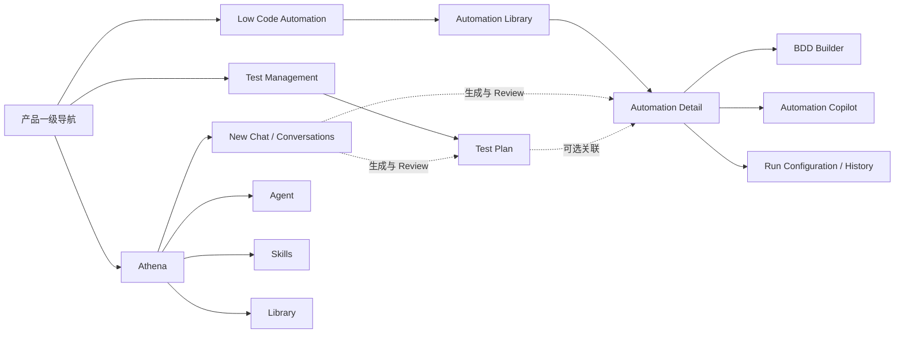
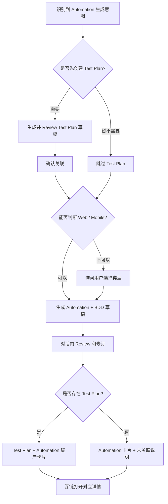

# RFC-008：TAP 产品壳层与 Low Code Automation 交互原型

## 摘要

本 RFC 是 TAP 当前产品原型和交互需求的持续事实源，记录两级产品导航、Low Code Automation 资产工作区，以及 Athena 生成 Test Plan 和 Automation 的协作流程。

本 RFC 只定义产品目标与纯前端原型合同，不表示相关后端、持久化资产、Execution Provider、浏览器 Agent 或移动设备已经进入当前 Phase 1。当前阶段边界仍由 [RFC-007](2026-09-02-rfc-007-phase-1-intelligence-layer-exploration.md) 和 [ADR-019](../decisions/2026-09-02-adr-019-phase-1-intelligence-layer-exploration.md) 约束：没有真实 Provider Attempt 和 Execution Evidence 时，不得声称自动化已经执行、通过或验证。

### 状态词典

| 状态             | 含义                                      |
| ---------------- | ----------------------------------------- |
| `confirmed`      | 用户已经明确提出或批准，原型应据此设计    |
| `proposed`       | 推荐设计，尚待用户确认                    |
| `unresolved`     | 会影响交互或数据模型，仍需用户选择        |
| `prototype-only` | 只用页面内 fixture 和模拟状态验证体验     |
| `future-target`  | 长期产品目标，不属于当前 Phase 1 交付承诺 |

## 背景

现有 Athena 交互原型已经包含聊天、会话历史、Agent、Skills、Library、Test Management 和一个 Low Code Automation 步骤编辑器。连续原型评审进一步确认了两个方向：

1. `New Chat`、`Agent`、`Skills`、`Library` 不应继续与产品模块平铺，而应收敛到 Athena 的上下文导航中。
2. Low Code Automation 不应在点击顶层入口后直接展示硬编码的 `Life insurance application automation`。它应先进入 Automation 资产工作区，再由用户打开或新建具体 Automation。

当前实现仍把 Automation 表达为一份页面内步骤数组：没有 Automation 集合、稳定身份、Web/Mobile 类型、执行目标、Test Plan 关系、资产级对话或运行记录。Athena 生成结果也保存为聊天 Turn 中的步骤快照，而不是指向同一个 Automation 资产。因此，本轮不是标题调整，而是产品信息架构和原型状态模型的扩展。

本 RFC 与 [Athena 交互原型实施计划](../plans/2026-09-02-athena-interaction-prototype.md) 及 [Low Code Automation 交互原型实施计划](../plans/2026-09-03-low-code-automation-interaction-prototype.md) 配套：RFC 记录“产品应该怎样工作”，Plan 只记录“如何实现获批范围”。长期阶段安排仍见 [TAP 交付路线图](../plans/2026-08-20-roadmap.md)。

当前实现差距与调整优先级见 [Low Code Automation 交互原型评审](../reviews/2026-09-03-low-code-automation-prototype-review.md)。

## 目标

### 已确认需求

| ID        | 状态        | 需求                                                                                                                                                                                                                                                                                                                                                                                                                                                                                                                                                                                                                                                 |
| --------- | ----------- | ---------------------------------------------------------------------------------------------------------------------------------------------------------------------------------------------------------------------------------------------------------------------------------------------------------------------------------------------------------------------------------------------------------------------------------------------------------------------------------------------------------------------------------------------------------------------------------------------------------------------------------------------------- |
| `NAV-001` | `confirmed` | 产品一级导航保留 Athena、Test Management、Low Code Automation；Athena 自身承载 New Chat、Agent、Skills、Library。                                                                                                                                                                                                                                                                                                                                                                                                                                                                                                                                    |
| `NAV-002` | `confirmed` | 点击 Athena 后，在一级导航右侧显示 Athena 上下文菜单，体验上像在 TAP 中嵌入一个完整的 Manus 式工作区，而不是把所有入口平铺在同一层。                                                                                                                                                                                                                                                                                                                                                                                                                                                                                                                 |
| `NAV-003` | `confirmed` | Athena 上下文 Sidebar 采用 Codex 式菜单反馈：`New chat` 使用方框铅笔图标、透明背景和普通菜单文字，不使用黑色主按钮；Agent、Skills、Library 的当前项使用整行浅灰圆角背景，不显示紫色侧边线，Hover 使用更浅的灰色，键盘 Focus 保留清晰描边。                                                                                                                                                                                                                                                                                                                                                                                                           |
| `NAV-004` | `confirmed` | 最左 `68px` 产品一级 Rail 始终保留，不参与收起；Athena 二级 Sidebar 使用 Codex 式面板图标收展。图标必须表达当前状态：面板收起时对应侧只显示窄线，展开时对应侧显示更宽的面板留白，左右两侧互为镜像。展开时按钮位于 Sidebar 标题区，收起后移动到工作区左上角，点击后恢复 Sidebar 与按钮焦点。收展采用同一短时曲线与外层裁切，不使用透明度叠影。                                                                                                                                                                                                                                                                                                        |
| `AUT-001` | `confirmed` | Low Code Automation 默认展示 Automation 列表和总数；点击一项进入该 Automation 详情。                                                                                                                                                                                                                                                                                                                                                                                                                                                                                                                                                                 |
| `AUT-002` | `confirmed` | Automation 详情展示可编辑的 BDD 测试步骤，用户既可手动调整，也可与详情内的平台 Agent 对话调整。                                                                                                                                                                                                                                                                                                                                                                                                                                                                                                                                                      |
| `AUT-003` | `confirmed` | Web Automation 执行前选择 Execution Agent；Execution Agent 即 Azure DevOps Pipeline Agent。Mobile Automation 执行前选择设备及 iOS/Android 平台。                                                                                                                                                                                                                                                                                                                                                                                                                                                                                                     |
| `AUT-004` | `confirmed` | 新建 Automation 时可以选择类型并手写 BDD，也可以只描述要完成的目标后点击 `✨`，由平台分析意图并生成 BDD。                                                                                                                                                                                                                                                                                                                                                                                                                                                                                                                                            |
| `AUT-005` | `confirmed` | 平台应从意图推断 Web 或 Mobile；无法可靠判断时必须让用户选择类型，不能静默猜测。                                                                                                                                                                                                                                                                                                                                                                                                                                                                                                                                                                     |
| `AUT-006` | `confirmed` | Test Plan 与 Automation 采用可选、严格双向 `1:1`：一个 Test Plan 最多关联一个 Automation，一个 Automation 也最多关联一个 Test Plan；未关联是合法状态。                                                                                                                                                                                                                                                                                                                                                                                                                                                                                               |
| `AUT-007` | `confirmed` | 同一个 Mobile Automation 可以支持 iOS、Android 或两者；BDD 保持共用，每次 Run 选择一个具体设备，平台差异进入实现绑定。                                                                                                                                                                                                                                                                                                                                                                                                                                                                                                                               |
| `AUT-008` | `confirmed` | Athena 中的 Agent 是负责理解、生成和调整的 AI Agent；Web Automation 的 Execution Agent 即 Azure DevOps Pipeline Agent，两者必须分开建模和呈现。                                                                                                                                                                                                                                                                                                                                                                                                                                                                                                      |
| `AUT-009` | `confirmed` | Automation Copilot 对 BDD 的调整先展示建议差异，由用户 Apply 或 Reject，不静默覆盖手工编辑。                                                                                                                                                                                                                                                                                                                                                                                                                                                                                                                                                         |
| `AUT-010` | `confirmed` | 当前纯前端原型提供一次单目标的模拟 Run、状态和有限日志，并明确标记 `Simulated`；不生成或暗示真实执行证据。                                                                                                                                                                                                                                                                                                                                                                                                                                                                                                                                           |
| `AUT-011` | `confirmed` | 每个 Automation BDD Step 必须显式关联其一个或多个实现动作；`Click`、`Send keys`、`Navigate`、`Wait`、`Assert` 等动作在对应 BDD Step 下展示和编辑，不能作为与业务步骤无关的独立列表。                                                                                                                                                                                                                                                                                                                                                                                                                                                                 |
| `AUT-012` | `confirmed` | 已关联 Automation 的 Test Plan 可以直接发起 Automation Run；只要 Run 开始时存在关联，无论从 Test Plan 还是 Automation 详情发起，同一个 Run 都进入 Automation Run History 和 Test Plan Execution History。未关联 Run 不产生 Test Plan 执行记录，后续解除关联也不删除历史快照。                                                                                                                                                                                                                                                                                                                                                                        |
| `ATH-001` | `confirmed` | Athena 识别到生成 Automation 的意图后，先询问用户是否需要生成 Test Plan。                                                                                                                                                                                                                                                                                                                                                                                                                                                                                                                                                                            |
| `ATH-002` | `confirmed` | 用户选择需要时，Athena 先生成 Test Plan，再引导生成 Automation；选择不需要时可直接生成未关联 Automation。                                                                                                                                                                                                                                                                                                                                                                                                                                                                                                                                            |
| `ATH-003` | `confirmed` | Yes 路径完成后，Athena 同时给出 Test Plan 与 Automation 的可点击入口；Skip 路径只给出 Automation 入口并明确未关联 Test Plan。Automation 入口直接打开对应详情。                                                                                                                                                                                                                                                                                                                                                                                                                                                                                       |
| `ATH-004` | `confirmed` | 用户可以在 Athena 对话中 Review 生成结果，也可以进入 Automation 详情继续调整并执行。                                                                                                                                                                                                                                                                                                                                                                                                                                                                                                                                                                 |
| `ATH-005` | `confirmed` | 对话历史遵循一条 Conversation 一条历史记录：空白 New Chat 不进入历史；首条消息发送后立即创建历史项并以首条消息生成标题；后续轮次追加到同一项。当前项始终可见且高亮，跨模块、刷新和重新打开页面后可恢复。                                                                                                                                                                                                                                                                                                                                                                                                                                             |
| `ATH-006` | `confirmed` | Composer 中已选择的 Knowledge、AI Agent 与 Skill 必须显示为可移除标签；每项提供明确的删除按钮，删除只影响当前 Conversation 后续消息的上下文，不改写历史 Turn 已记录的上下文。                                                                                                                                                                                                                                                                                                                                                                                                                                                                        |
| `ATH-007` | `confirmed` | 产品一级 Rail 的 Athena 入口使用白色背景的 `A` 替代聊天气泡图标，紫色只保留在一级入口的外层选中态。该入口是页面中唯一的 `A` 品牌徽标；Athena 二级 Sidebar 标题、欢迎区和每条 Assistant 消息均不重复显示头像式 `A`。                                                                                                                                                                                                                                                                                                                                                                                                                                  |
| `ATH-008` | `confirmed` | Athena Composer 使用 Codex 式模型触发器：输入框底部只显示当前模型名称和下拉箭头，不显示前置闪电；所有模型名称以 `GPT-` 开头，只提供模型选择，不显示或提供 Fast、Ultra 或其他推理强度。模型选择属于单个 Conversation，新对话默认 `GPT-5.6 Sol`，当前纯前端原型不宣称真实调用对应模型。                                                                                                                                                                                                                                                                                                                                                                |
| `ATH-009` | `confirmed` | 右侧 Knowledge sources 可以独立收起和展开；使用与左栏同语法、右侧镜像且能区分展开/收起状态的面板图标，收起后按钮移动到聊天区右上角并释放完整列宽，已选来源和搜索状态不丢失。两侧面板共用同一短时收展曲线、裁切和减弱动态效果规则。窄屏采用右侧遮罩抽屉，并支持 Escape、背景 inert、滚动锁定与焦点恢复。                                                                                                                                                                                                                                                                                                                                              |
| `ATH-010` | `confirmed` | Athena 对话视口左缘按用户已发送的问题生成 Codex 式短线 minimap：每个 Turn 对应一条横向短线，刻度组在可用视口内垂直居中并使用 `14px` 节拍；默认刻度为 `12 × 4px`、`#dbdbdb`，全部固定在距聊天区左缘 `14px` 的同一左锚点。滚动对应的当前刻度保持相同尺寸，只加深为 `#8a8a8a`，不得让邻近刻度永久扩散。仅在 Hover 或键盘 Focus 时，目标及相邻刻度按 `12 / 14 / 18 / 24 / 34 / 24 / 18 / 14 / 12px` 从同一左边缘向右形成紧凑鱼眼放大，目标刻度为 `#222529` 并显示问题预览。点击平滑跳转到对应 Turn，当前项随点击与滚动更新。对话继续支持键盘、触控板和滚轮滚动，但不同时显示浏览器原生滚动条；导航自身也不产生第二条滚动条。减弱动态效果时改为即时跳转。 |
| `ATH-011` | `confirmed` | 当问题总数超过输入框上方对话内容区按 `14px` 节拍可容纳的数量时，minimap 不压缩刻度也不继续向屏幕外或输入框区域增长，而是进入固定高度的滑动窗口。可见容量根据 Transcript 行从页面顶部到 Composer 上沿的真实高度动态计算并取奇数，刻度组在该区域内垂直居中并与 Composer 至少保留 `32px` 安全间距；窗口尺寸、Composer 高度或上下文标签换行变化时通过 `ResizeObserver` 重新计算。窗口默认围绕当前问题居中，在首尾处自然钳制。主对话滚动会让窗口重新跟随当前问题；在 minimap 上滚轮可浏览相邻隐藏节点。窗口上下端使用无独立滚动轨道的渐隐续接刻度，Hover/Focus 显示隐藏问题数量，点击按一页移动。minimap 只挂载当前窗口内的问题按钮，不生成第二条滚动条。 |
| `LIB-001` | `confirmed` | Library 的默认列表页签命名为 `All`，并提供关键词搜索、Type 与 Status 条件筛选、结果数量和清空筛选；搜索与筛选可以组合使用。                                                                                                                                                                                                                                                                                                                                                                                                                                                                                                                          |
| `LIB-002` | `confirmed` | Knowledge Graph 使用 Graphify 式高密度关系图体验：圆形节点、社区聚类、节点度数大小、社区筛选、搜索高亮、节点详情、关系溯源以及缩放/平移/重置；当前原型使用确定性 fixture，不宣称运行真实图谱抽取或布局引擎。                                                                                                                                                                                                                                                                                                                                                                                                                                         |
| `VIS-001` | `confirmed` | Test Management 与 Low Code Automation 必须以当前 Athena 视觉语言为基准，共用页面背景、字体层级、边框、圆角、按钮、状态色和间距，不建立彼此独立的暖色或杂志化视觉主题。                                                                                                                                                                                                                                                                                                                                                                                                                                                                              |
| `DOC-001` | `confirmed` | 后续每轮原型设计和产品需求都必须同步到项目文档；已确认、提议和未决内容必须分开记录。                                                                                                                                                                                                                                                                                                                                                                                                                                                                                                                                                                 |

### 产品目标

1. 让产品一级导航表达稳定业务模块，让 Athena 二级导航表达聊天和智能能力上下文。
2. 把 Automation 从一次性生成结果升级为可查找、可编辑、可关联、可配置和可重复运行的资产。
3. 让手写 BDD、自然语言生成和对话式修订共用同一个 Automation，而不是产生互相覆盖的副本。
4. 让 Athena 成为跨 Test Plan 与 Automation 的编排入口，同时保持两个资产各自可独立进入和管理。
5. 让所有生成、修改和执行状态都能区分草稿、建议、已保存资产、模拟运行与真实证据。

## 非目标

### 当前原型不承诺

- 不新增 Test Plan、Automation、Run、Agent 或 Device 后端 API；当前纯前端原型只允许用浏览器本地存储模拟会话与原型资产恢复，不能把它描述为服务端持久化。
- 不接入真实浏览器、移动设备、BrowserStack、Azure DevOps Pipeline、执行网格或生产凭据。
- 不把页面内 `Passed`、日志或进度 fixture 描述成真实执行证据。
- 不实现跨浏览器或跨设备矩阵、并发调度、重试策略、视频/HAR/截图采集或计费。
- 不在本 RFC 中改变 Release Management、Project、权限、多租户或生产部署范围。
- 不把 Athena Catalog 中用于理解、生成和调整的 `AI Agent` 等同于执行 Web Automation 的 Azure DevOps Pipeline Agent。

### 阶段边界

本 RFC 可以用 `prototype-only` 数据演示未来完整旅程，但不能据此改写已接受的 ADR-019。如果未来要把正式 Test Asset 或真实 Browser/Device Execution 提前到当前 Phase 1，必须新建替代 ADR，并同步 RFC-007、路线图、架构、契约和 README。

## 方案

### 1. 信息架构

下一版原型采用“资产优先的统一 Automation Builder”。Athena 是意图理解和编排入口；Low Code Automation 是 Automation 的系统工作区。两处操作同一个资产身份。



#### 一级产品 Rail（`confirmed`）

- 桌面原型使用窄的固定一级 Rail，当前视觉基准宽度为 `68px`。
- 一级入口只放 Athena、Test Management、Low Code Automation 等产品模块。
- 选择 Test Management 或 Low Code Automation 时，Athena 上下文菜单收起，主内容区全部用于对应模块。

#### Athena 上下文 Sidebar（`confirmed`）

- 点击 Athena 后，在一级 Rail 右侧展开上下文 Sidebar，当前视觉基准宽度为 `236px`。
- Sidebar 提供 `New chat`、Agent、Skills、Library 和会话历史。
- 再次进入 Athena 时恢复最近使用的 Athena Surface，而不是无条件跳回空白聊天。
- 窄屏使用遮罩抽屉；支持 Escape 关闭、焦点恢复、背景不可交互和页面滚动锁定。
- 最左产品 Rail 始终常驻。Sidebar 展开时，面板按钮位于其标题区；收起后相同按钮移动至工作区左上角。按钮保持 `44px` 交互目标、`aria-controls`、`aria-expanded` 与双向焦点恢复。图标在收起态把对应侧压缩为窄线，在展开态为对应侧保留清晰面板区域；左右图标严格镜像。
- Athena Sidebar 与 Knowledge sources 共用一套短时指数缓出曲线。面板内容保持稳定尺寸并由外层裁切，宽度和位移同步变化，不叠加不同步的透明度动画；`prefers-reduced-motion` 时取消过渡。
- 产品一级 Rail 的 Athena 入口以 `A` 取代聊天气泡，并作为页面中唯一的 Athena `A` 徽标。该徽标使用白色背景，紫色只表达一级入口的外层选中态；Sidebar 标题只显示 `Athena` 文本，聊天欢迎区和 Assistant Turn 不再重复显示 `A`。
- `New chat` 是普通导航动作：使用方框铅笔图标、透明背景和普通字重，不使用黑色填充。Agent、Skills、Library 的选中态使用整行浅灰圆角底，不使用紫色侧边线；Hover 和键盘 Focus 仍提供可辨识反馈。

#### 对话视口与 Knowledge sources（`confirmed`）

- Knowledge sources 是独立的右侧上下文面板，桌面视觉基准宽度为 `300px`。展开按钮位于面板标题左侧；收起后，镜像面板按钮移动到聊天区右上角，聊天主列获得释放的空间。
- 收展只改变面板呈现，不卸载来源内容或清空当前 Conversation 的来源选择与面板搜索条件。
- `820px` 及以下不把 Knowledge sources 堆叠到聊天下方；它从右侧作为遮罩抽屉出现，并与 Athena 左侧抽屉互斥。Escape、遮罩点击、背景 inert、页面滚动锁定和触发按钮焦点恢复与左侧抽屉一致。
- 有对话 Turn 时，聊天区左缘显示 Codex 式短线 minimap。每个用户问题生成一个可聚焦横线；刻度组整体垂直居中，所有默认横线等长并固定在同一左锚点。滚动当前项只改变颜色，不改变长度或带动邻近项。Hover/Focus 时才从同一左边缘向右形成 `14 / 18 / 24 / 34px` 的紧凑局部鱼眼放大并预览完整问题；点击定位对应 Turn，滚动时更新当前项。
- 跳转默认使用平滑滚动；`prefers-reduced-motion: reduce` 时使用即时定位。键盘、触控板和滚轮仍可正常浏览对话，但原生滚动条保持不可见，minimap 自身也不得产生可见滚动条或第二套轨道。
- 问题数量未超过容量时，minimap 继续显示全部刻度。超过容量后，按“输入框上方 Transcript 高度减去 `64px` 安全区，再除以 `14px` 节拍”计算奇数槽位，并为上下续接各保留一个槽位；当前问题尽量保持在窗口中部，首尾处钳制。
- 滚动主对话时，窗口跟随当前问题；滚轮悬停在 minimap 上时，每次向相应方向移动三个问题。上下渐隐续接刻度的提示显示被隐藏的问题数量，点击后移动一个可见问题页。窗口变化不产生独立滚动容器，只挂载当前可见问题按钮。

#### Composer 上下文与模型（`confirmed`）

- 已选 Knowledge、AI Agent 与 Skill 以紧凑标签呈现，并保留类型差异。
- 每个标签提供可聚焦的删除按钮及可读名称；删除后立即从当前 Conversation 的选择集合移除。
- 已发送 Turn 使用发送时捕获的来源引用，不因后续移除 Composer 标签而改变。
- Composer 底部右侧使用 Codex 式紧凑触发器，视觉结构为 `当前模型 + 下拉箭头`，不显示前置闪电；展开后只列出 `GPT-5.6 Sol`、`GPT-5.6 Terra`、`GPT-5.6 Luna`、`GPT-5.5` 与 `GPT-5.4`。
- 不在该触发器或菜单中显示 Fast、Ultra、reasoning effort 或模式说明；Execution/Pipeline Agent 也不进入该菜单。
- 模型选择保存在当前 Conversation；新建 Conversation 默认 `GPT-5.6 Sol`，切换历史 Conversation 时恢复各自选择。显示名称调整不改变内部模型 ID；旧版浏览器快照缺少模型字段时迁移为默认模型。
- 当前原型只验证选择、恢复与交互，不连接或切换真实模型服务。

#### Athena Library 与 Knowledge Graph（`confirmed`）

- Library 使用 `All / Knowledge Graph` 两个页签；`All` 是资产全集，不把表现形式写成 `Thumbnail list`。
- `All` 工具栏提供关键词搜索、Type 和 Status 筛选、结果数量与清空筛选。关键词匹配名称、类型和描述，所有条件采用交集语义。
- Knowledge Graph 保持 Athena 浅色页面壳层，在内部使用高对比深色画布呈现圆形节点、关系边和社区聚类；该画布不是简单的左右树状图。
- 节点大小反映连接度，颜色反映 Community；搜索命中时高亮匹配节点并弱化其他节点，Community 可以独立显示或隐藏。
- 用户可以缩放、平移和重置视图，点击节点后在 Inspector 查看名称、类型、Community、连接数及相邻关系。
- 关系标记 `EXTRACTED` 或 `INFERRED`，明确区分抽取事实与推断关系；当前数据与布局均为确定性原型 fixture，不代表真实 Graphify 服务或知识抽取已经接入。

#### 跨工作区视觉一致性（`confirmed`）

- Athena 当前的中性浅色背景、蓝青强调色、紧凑圆角、细边框和无衬线信息层级是 Test Management 与 Low Code Automation 的视觉事实源。
- LCA 与 Test Management 保留既有资产列表、BDD、执行与关联结构，但移除独立的暖纸色、珊瑚色和编辑出版式视觉主题。
- 深色只作为 Knowledge Graph 的数据画布材质存在，不扩散到产品导航或其他业务工作区。

#### 对话历史（`confirmed`）

- `New Chat` 先创建一个空白草稿；只有首条消息成功发送后才新增一条历史记录，避免产生空白历史噪音。
- 同一 Conversation 的所有后续消息继续追加到同一历史项，不按单条消息拆分。
- 当前 Conversation 不能从历史列表中过滤掉；它应保持可见并使用选中态表达当前位置。
- 切换到 Test Management 或 Low Code Automation 再返回 Athena 时，恢复最近打开的 Conversation、全部 Turn 和上下文选择。
- 行业目标是按用户与 Project 服务端持久化。当前纯前端原型使用版本化浏览器本地存储模拟刷新恢复，并在数据损坏或 schema 不兼容时安全回退到初始空白会话。

### 2. Automation Library

点击 Low Code Automation 时必须先进入 Library，不直接打开任何示例详情。

```text
Low Code Automation · 12 automations                  [+ New automation]

[Search automations]  [Type: All]  [Status: All]  [Test Plan: All]

Name                         Type     Test Plan    Scenarios   Last run
Life insurance application   Web      TP-104       3           Never
Claims photo upload           Mobile   Not linked   2           Failed
```

#### `confirmed`

- 页面显示 Automation 总数和资产列表。
- 点击既有项进入对应详情。
- `+ New automation` 进入新建流程。
- 未关联 Test Plan 是合法状态，而不是错误。
- 列表项至少显示名称、Web/Mobile 类型、Test Plan 关联状态和 Scenario 数量。

#### `proposed`

- 列表支持名称搜索，并按 Type、Status、Test Plan 关联状态筛选。
- Status、最近运行和更新时间等扩展列待后续确认。
- 空状态同时提供 `Create manually` 与 `Ask Athena` 两个入口。

### 3. New Automation

新建使用完整页面或宽抽屉，不使用信息过载的小弹窗。

```text
New automation

What do you want to automate?
[ Describe the goal.................................. ] [✨ Generate BDD]

Automation type
[ Detect automatically ]  [ Web ]  [ Mobile ]

Test Plan
[ No Test Plan / Select an available Test Plan ]

[Create blank automation]                         [✨ Generate draft]
```

#### 手动路径（`confirmed`）

1. 用户选择 Web 或 Mobile。
2. 用户可选择一个 Test Plan，也可保持未关联。
3. 创建空白 Automation 后，在详情中手写 BDD。

#### AI 生成路径（`confirmed`）

1. 用户在标题或目标输入中描述想要完成的事情。
2. 点击 `✨` 后，平台分析意图并生成 BDD 草稿。
3. 平台推断类型；可以判断时展示 `Detected: Web/Mobile` 并允许修改。
4. 无法判断时停在当前流程，让用户明确选择 Web 或 Mobile 后继续。

#### 推荐细化（`proposed`）

- 输入标签使用 `Goal / Describe what to automate`，平台从目标中自动提炼标题；仅写标题仍可触发生成。
- 不展示没有校准依据的“置信度百分比”。
- 单个 Automation 只对应 Web 或 Mobile；同时包含两个渠道时先询问用户创建哪一个。

### 4. Automation Detail

```text
Low Code Automation / AUTO-104

Life insurance application                       [Draft] [Save] [Run]
Web · Linked to TP-104 · Created by Athena · Last run: Never

┌ Scenarios ─────┬ BDD Builder ───────────────────┬ Copilot | Run ──────┐
│ Happy path     │ Scenario: Submit application   │ 与平台 Agent 对话    │
│ Validation     │ Given ...                      │ 建议先 Review 再应用  │
│ Error handling │ When ...                       │                     │
│ + Add scenario │ Then ...                       │ [Reject] [Apply]    │
└────────────────┴────────────────────────────────┴─────────────────────┘
```

#### `confirmed`

- 详情显示该 Automation 的 BDD 测试步骤。
- 用户可手动增加、修改、删除步骤。
- 详情内始终有与平台 Agent 对话的入口，用于解释或调整当前 Automation。
- 用户可以从详情配置执行目标并发起执行。

#### BDD 与实现绑定（`confirmed`）

- 用户层主结构采用 `Feature → Scenario → Given/When/Then/And`。
- 每个 BDD Step 使用稳定 ID，并通过 `bddStepId` 关联一个有序的实现动作链；一个 BDD Step 可以对应零个、一个或多个动作。
- `Navigate`、`Click`、`Send keys`、`Select`、`Wait`、`Assert`、Locator 和 Value 属于对应 BDD Step 的 `Automation actions / Implementation binding`，不能脱离 BDD 作为另一个无关步骤列表。
- 默认视图在 BDD Step 下直接显示动作摘要；展开后编辑动作类型、Locator 和 Value。业务文本和技术动作保持层级差异，但映射关系无需切换页面即可看见。
- Generated Script 是只读辅助视图，由 BDD 和实现绑定派生。
- Agent 修改先显示差异，由用户 `Apply` 或 `Reject`，不静默覆盖手工内容。
- 右侧面板用 `Copilot / Run` 页签减少同时出现的控制数量。

### 5. 执行配置

执行目标属于每次 Run。当前原型每次运行都显式选择目标，只展示配置、状态和模拟日志；是否允许 Automation 保存默认目标留待真实执行设计确认。

#### Web Automation（`confirmed`）

```text
Execution agent · Azure DevOps Pipeline
[ ado-web-agent-03 · Online ]

[Run automation]
```

- 未选择可用 Agent 时禁用 Run，并就地说明原因。
- Execution Agent 即 Azure DevOps Pipeline Agent，使用独立的 `ExecutionAgent` 语义和状态，不复用 Athena Catalog AI Agent。
- 当前原型只使用 Agent fixture 和模拟状态，不连接 Azure DevOps 或触发真实 Pipeline。

#### Mobile Automation（`confirmed`）

```text
Supported platforms   [iOS ✓] [Android ✓]
Run platform          [iOS / Android]
Device     [iPhone 15 · Available]

[Run automation]
```

- 同一个 Mobile Automation 可以支持 iOS、Android 或两者，并共用业务 BDD。
- 每次 Run 只选择一个受支持平台下的具体设备；未选择平台或设备时禁用 Run。
- 设备列表按 iOS/Android 过滤，并显示 Available、Busy、Offline。
- 平台差异通过步骤的 iOS/Android 实现绑定表达，不复制 Test Plan 或业务 BDD。
- 初版不提供一次选择多个设备的执行矩阵。

### 6. Test Plan 关联

#### 已确认边界

- 关联是可选的；Automation 可以独立存在。
- 关联后，Test Plan 和 Automation 详情都应显示可点击的对方资产。
- Athena 先生成 Test Plan 时，随后生成的 Automation 应自动使用已确认的关联关系。

#### 确认关系（`confirmed`）

Test Plan 与 Automation 采用可选、严格双向 `1:1`：一个 Test Plan 最多关联一个 Automation，一个 Automation 也最多关联一个 Test Plan。一个 Test Plan 的多个测试场景映射为同一个 Automation 内的多个 BDD Scenario；Web 与 Mobile 两套实现分别建立两组 Test Plan / Automation。

选择关联对象时，已经被其他资产占用的 Test Plan 或 Automation 不再作为可选项；解除关联后才重新可选。

#### Test Plan 执行入口与记录（`confirmed`）

- Test Plan 已关联 Automation 时，详情页显示 `Run automation`；未关联时不提供可运行按钮，并显示 `Link an Automation to run this plan`。
- Test Plan 发起 Run 时复用 Automation 的目标配置：Web 选择 Azure DevOps Pipeline Agent，Mobile 选择受支持的平台和 Device。
- `AutomationRun` 是唯一运行事实。它在开始时快照 `automationId`、`testPlanIdAtRun`、`triggeredFrom`、执行目标和步骤映射，Test Plan Execution History 是对该事实的关联视图，不复制一份可漂移的结果。
- 只要 Run 开始时 `testPlanIdAtRun` 非空，同一个 Run ID 无论从 Automation 还是 Test Plan 发起，都同时显示在 Automation Run History 与对应 Test Plan Execution History。
- Run 开始时未关联 Test Plan，则只进入 Automation Run History。之后建立关联不会回填旧 Run；之后解除关联也不会删除已经归档到 Test Plan 的历史快照。
- Test Plan 记录显示 Scenario、BDD Step 与动作级状态，使用户可以从执行结果追溯到业务步骤和 `Click`、`Send keys` 等实现动作。

### 7. Athena 编排与资产交接



#### 对话行为（`confirmed`）

1. 自动化意图不能立即跳过 Test Plan 问询。
2. 用户选择需要 Test Plan 时，Athena 先生成和 Review Test Plan，再进入 Automation。
3. 用户明确跳过时，不重复追问，直接创建未关联 Automation。
4. Yes 路径生成完成后返回 Test Plan 和 Automation 两个可点击入口；Skip 路径只返回 Automation，并显示未关联状态。
5. 用户可继续在 Athena 中 Review，也可打开 Automation 详情编辑与执行。

#### 资产卡片（`confirmed`）

```text
Test Plan
TP-104 · 3 scenarios · Draft
[Review Test Plan]

Automation
AUTO-104 · Web · 3 scenarios · Ready to configure
[Open and run]
```

- 卡片显示稳定资产 ID、类型、状态和场景数，而不只是一条文本链接。
- 从 Athena 进入详情时可显示 `Back to Athena`，返回原会话上下文。
- Athena 与详情 Copilot 的修改都指向同一 Automation ID，不复制资产。

### 8. 资产身份、状态与深链

#### 最小概念模型（`confirmed`）

| 对象                   | 核心字段                                                                                                                        |
| ---------------------- | ------------------------------------------------------------------------------------------------------------------------------- |
| `Automation`           | ID、标题、Web/Mobile 类型、来源、状态、可选 Test Plan ID、BDD Scenarios、实现绑定、更新时间                                     |
| `TestPlan`             | ID、标题、Scenarios、来源、状态、可选 Automation ID                                                                             |
| `BddScenario`          | ID、标题、可选 Test Plan Scenario ID、Given/When/Then/And Steps                                                                 |
| `BddStep`              | ID、Keyword、业务文本、可选 Test Plan Step ID、按顺序关联的 Implementation Action IDs                                           |
| `ImplementationAction` | ID、BDD Step ID、动作类型、Locator/Target、可选 Value 与平台差异                                                                |
| `ExecutionTarget`      | Web Azure DevOps Pipeline Agent，或 Mobile OS + Device                                                                          |
| `AutomationRun`        | ID、Automation ID、运行开始时的可选 Test Plan ID、触发入口、Target、场景/步骤/动作结果、状态、开始/结束时间、模拟或真实证据标记 |
| `ArtifactRef`          | Athena Turn 指向 Test Plan 或 Automation 的类型与 ID                                                                            |

Athena Turn 应保存 `ArtifactRef`，不再保存可覆盖现有编辑的 Automation 步骤快照。

#### 页面位置（`confirmed`）

```text
/athena/conversations/:conversationId
/test-management/plans
/test-management/plans/:testPlanId
/low-code/automations
/low-code/automations/new
/low-code/automations/:automationId
```

原型可以先用等价的页面内位置状态模拟，但交互必须保持稳定 ID 和列表/详情语义，以便后续替换为真实路由。

### 9. 状态、响应式与可访问性

- Library、创建、详情、对话生成和执行配置都要覆盖 Loading、Empty、Error 和 Disabled 原因。
- 对话历史必须覆盖空白 New Chat、首轮入列、当前项选中、跨模块恢复、本地恢复失败回退和无历史空态。
- 生成 BDD 时应显示可取消的进行状态；类型不明属于需要用户输入，不是系统错误。
- Run 按钮的禁用原因必须可见且能被屏幕阅读器理解。
- 所有核心操作支持键盘，交互目标至少 `44px`，焦点样式清晰，状态不只依赖颜色。
- 移动端将详情右栏变成全屏抽屉，Scenario 列表收敛为选择器，避免出现多重窄侧栏。
- 原型运行结果必须明确标识 `Simulated`，不能使用会让用户误以为真实目标已验证的措辞。

### 10. 文档维护方式

从本 RFC 起，原型与产品需求按以下规则持续落地：

1. 不逐字复制聊天；把有效内容转成带 ID 的 Requirement、Decision、Rationale、Status 和 Acceptance Criteria。
2. 用户明确批准后，把条目从 `proposed` 或 `unresolved` 更新为 `confirmed`，并在变更记录中标日期。
3. 未回答的问题只进入“未决问题”，不能写成已经决定的产品事实。
4. 产品交互变更更新本 RFC；实施步骤写入 Plan；正式架构决策进入 ADR。
5. 如果新决定与已接受 ADR 冲突，创建 superseding ADR，不改写旧 ADR 的决策语义。

## 替代方案

### A. 资产优先的统一 Builder（推荐）

Web 与 Mobile 共用 Library、BDD、Test Plan 关联和 Copilot，只在执行目标上分流。优点是资产身份和用户心智稳定；代价是详情页必须通过清晰分栏和响应式收敛控制复杂度。

### B. Chat-first 生成工作台

所有 Automation 都从对话创建和编辑。首次生成轻量，但会与 Athena 重复，也不利于列表管理、长期维护和重复执行。

### C. Web 与 Mobile 两套独立工作室

可分别深度定制执行配置，但会重复实现 BDD、Test Plan、Copilot 和历史记录，并割裂同一种 Automation 资产，因此不建议用于当前原型。

## 风险与缓解

| 风险                                               | 缓解                                                                               |
| -------------------------------------------------- | ---------------------------------------------------------------------------------- |
| 把 Athena 和 Automation Detail 做成两个编辑器      | 两处只操作同一资产 ID；Athena 负责编排，Detail 负责长期管理和执行                  |
| 把 BDD 与底层点击动作混为一层                      | BDD 保持业务可读；Action/Locator/Value 进入实现绑定或 Advanced                     |
| BDD 与技术动作分区后失去对应关系                   | 每个 BDD Step 内联展示有序动作链，并以稳定 ID 关联步骤与动作                       |
| `Agent` 名称造成 AI Agent 与 Pipeline 执行节点混淆 | 固定使用 `AI Agent` 与 `Execution Agent`，分别建模并展示所属上下文                 |
| AI 修改覆盖手工编辑                                | 修改以差异呈现，用户 Apply 后形成新 revision                                       |
| 原型模拟状态被误解为真实执行                       | 显示 `Simulated`，不生成真实 Evidence 或通过声明                                   |
| 多栏详情在小屏不可用                               | Copilot/Run 抽屉化，Scenario 列表收敛为选择器                                      |
| 用户误选已关联资产并破坏 `1:1`                     | 选择器排除已占用资产，关联两端同时更新，并支持显式解除关联                         |
| 同一 Run 在两边复制后结果漂移                      | 只保存一个 `AutomationRun`；Test Plan Execution History 按运行开始时的关联快照投影 |
| 当前会话因选中态过滤而从历史消失                   | 历史列表始终包含所有已有首轮消息的 Conversation，当前项只通过选中态区分            |
| 浏览器本地状态损坏导致原型不可用                   | 使用版本化存储、结构校验和安全回退；正式产品仍需服务端 Conversation API            |

## 迁移或发布方式

### 原型迭代

1. 将 Low Code Automation 顶层落点从单份硬编码详情改为 Automation Library。
2. 引入页面内 Automation 集合、稳定 ID、列表/新建/详情位置状态和 fixture。
3. 将现有技术动作编辑器包在 BDD Scenario 模型下，保留脚本预览作为辅助视图。
4. 增加 Web/Mobile 类型与模拟执行目标配置。
5. 增加详情 Copilot 和 Athena 多轮编排状态，聊天 Turn 改存 ArtifactRef。
6. 增加 Test Plan 双向链接，并按可选、严格双向 `1:1` 约束关联选择。
7. 建立 BDD Step → Implementation Action 的内联映射，并让 Test Plan 与 Automation 使用同一 Run 记录。
8. 修复对话历史过滤规则，并用版本化浏览器本地存储模拟刷新恢复。
9. 完成桌面、移动端、键盘、空/错/禁用状态与回归验证。

设计批准后应为上述范围建立独立实施 Plan，不能仅依赖本 RFC 直接实施。

### 长期产品发布

真实持久化、Execution Provider、浏览器 Agent、移动设备和 Evidence Manifest 必须在后续阶段单独设计契约、安全边界、权限、凭据、调度、恢复和审计，并通过新的 Plan/ADR 获批。

## 验收标准

### 文档验收

- 本 RFC 能区分已确认需求、推荐设计、纯前端原型和长期产品目标。
- 所有未决问题保持可见，没有把用户尚未回答的选项写成结论。
- 后续实施 Plan、原型页面和测试都能引用稳定 Requirement ID。
- 每次用户批准或改变方向后，RFC 的条目状态和变更记录同步更新。

### 产品原型验收

- 点击 Athena 展开其上下文菜单；点击其他产品模块不会继续占用 Athena Sidebar 宽度。
- Athena Sidebar 中的 `New chat` 使用方框铅笔图标且没有黑色背景；Agent、Skills、Library 的当前项使用整行浅灰圆角背景且没有紫色侧边线。
- Athena Sidebar 的 `New chat`、Agent、Skills、Library 使用 Codex 式连续列表：四项共用同一菜单项几何和等距垂直节奏，`New chat` 不设置额外下间距。
- 产品一级 Athena 入口使用白色 `A` 替代聊天气泡，二级 Athena 标题不再重复 `A`；页面中只有一个 Athena `A` 徽标，紫色只用于一级入口的外层选中态。
- 最左产品 Rail 始终可见；Athena Sidebar 的 Codex 式按钮在展开时位于标题区、收起时位于工作区左上角，并在两个方向恢复焦点。收起态图标只保留对应侧窄线，展开态图标显示更宽面板区域。
- Knowledge sources 可独立收展；收起后聊天区释放 `300px` 列宽，来源选择和搜索条件保持，右上角镜像按钮可恢复面板。左右面板使用同一无透明度叠影的同步收展动效。
- 对话中每条用户问题都在左缘生成一个 `12 × 4px` 横向短线，按 `14px` 节拍组成垂直居中的刻度组；全部刻度左边缘对齐。滚动当前项只变深，默认态不得出现邻近长度梯度。Hover/Focus 时目标项与三层邻近项按 `34 / 24 / 18 / 14px` 向右展开并显示预览；点击定位对应 Turn，当前项随点击和滚动更新；浏览器原生滚动条与导航自身滚动条均不可见。
- Athena Composer 显示 Codex 式模型选择器；触发器没有闪电，只显示 `GPT-` 前缀的模型名称和下拉箭头。菜单只包含模型，没有 Fast、Ultra 或其他推理强度；选择跟随 Conversation 保存，新对话默认 `GPT-5.6 Sol`。
- 点击 Low Code Automation 首先看到带总数的 Automation Library，而不是具体寿险 Automation 标题。
- 用户可以新建 Web 或 Mobile Automation，手写 BDD 或使用 `✨` 生成草稿。
- 类型无法判断时必须停下来让用户选择。
- Automation 详情可手动编辑 BDD，也可通过 Copilot 提议并 Review 修改。
- 每个 BDD Step 下能直接看到并编辑其 `Click`、`Send keys` 等实现动作；删除或新增动作不会失去所属 BDD Step。
- Web 运行要求选择 Execution Agent；Mobile 运行要求选择 OS 和 Device。
- 同一个 Mobile Automation 可支持 iOS、Android 或两者，每次模拟 Run 选择一个具体设备。
- Automation 可以保持未关联 Test Plan；关联后两端都可跳转。
- 已关联 Test Plan 可以直接运行 Automation；同一 Run ID 同时出现在 Automation Run History 和 Test Plan Execution History，并可追溯到 Scenario、BDD Step 与实现动作。
- 未关联 Run 不产生 Test Plan 执行记录；后续关联不回填，解除关联不删除既有执行历史。
- Athena 的 Automation 流程先询问是否创建 Test Plan；Yes 完成后显示 Test Plan 与 Automation 资产卡片，Skip 完成后只显示 Automation 卡片和未关联说明。
- 从 Athena 打开的 Automation 与 Library 中的同 ID 资产是同一份数据。
- 首条消息发送后出现且高亮一条 Conversation 历史；同一 Conversation 的后续消息不新增历史项，跨模块和刷新后仍可恢复。
- Athena composer 为空且不处于 IME 组字时，按上方向键只填入当前 Conversation 最近一次已发送内容，不自动发送；已有草稿、无历史和跨 Conversation 场景保持原状。
- 所有运行状态明确为模拟，不声称产生真实执行证据；本地恢复只表示原型数据恢复，不表示后端资产已经交付。

## 未决问题

当前前端原型范围没有阻断实施计划的未决问题。Library 复合筛选、空状态中的额外 `Ask Athena` 入口、目标输入文案、默认执行目标和批量/矩阵运行仍是非阻断的后续细化项；在获得新的产品确认前保持 `proposed`。

## 变更记录

| 日期       | 状态         | 内容                                                                                                                                                                                  |
| ---------- | ------------ | ------------------------------------------------------------------------------------------------------------------------------------------------------------------------------------- |
| 2026-09-03 | `confirmed`  | New Chat、Agent、Skills、Library 收敛到 Athena；采用一级产品 Rail + Athena 上下文 Sidebar。                                                                                           |
| 2026-09-03 | `confirmed`  | Low Code Automation 定义为 Automation Library、创建、详情、BDD、执行配置和详情对话的资产工作区。                                                                                      |
| 2026-09-03 | `confirmed`  | Athena 在 Automation 意图下先询问 Test Plan，再生成并返回两个资产入口。                                                                                                               |
| 2026-09-03 | `confirmed`  | 所有后续原型设计与产品需求都必须同步落地到项目文档。                                                                                                                                  |
| 2026-09-03 | `confirmed`  | Test Plan 与 Automation 采用可选、严格双向 `1:1`；任一侧最多关联对方一个资产。                                                                                                        |
| 2026-09-03 | `confirmed`  | 同一个 Mobile Automation 可支持 iOS、Android 或两者；BDD 共用，每次 Run 选择一个具体设备。                                                                                            |
| 2026-09-03 | `confirmed`  | Athena AI Agent 与 Web Execution Agent 分开；Execution Agent 即 Azure DevOps Pipeline Agent，不额外引入 Agent Pool / Execution Profile 产品概念。                                     |
| 2026-09-03 | `confirmed`  | 批准 Low Code 内容层的结构性调整：资产库、稳定 ID/深链、BDD Builder、Copilot 差异确认、执行配置、模拟 Run 与 Athena 编排。RFC 进入 `in-review`。                                      |
| 2026-09-03 | `confirmed`  | 产品方案无阻断未决项，RFC 进入 `accepted`；代码实施由独立 Low Code Automation Plan 管理。                                                                                             |
| 2026-09-03 | `confirmed`  | 明确 Athena Yes/Skip 的交付卡片差异，并确认 Library 的最小列表项字段；扩展列和额外空状态入口仍保持 `proposed`。                                                                       |
| 2026-09-03 | `confirmed`  | 每个 BDD Step 内联关联有序实现动作；关联资产的同一 Run 同步投影到 Automation 与 Test Plan 历史，未关联 Run 不进入 Test Plan，解除关联保留历史快照。                                   |
| 2026-09-03 | `confirmed`  | 对话历史采用行业通用 Conversation 语义：首轮后入列、同会话多轮合并、当前项可见高亮，并在跨模块与刷新后恢复；纯前端原型使用版本化浏览器本地存储模拟。                                  |
| 2026-09-03 | `confirmed`  | Athena Composer 采用 Codex 式模型选择器，只显示模型、不提供 Fast/Ultra；模型跟随 Conversation 保存且默认 `GPT-5.6 Sol`。一级 Athena 入口的聊天气泡同时替换为 `A`。                    |
| 2026-09-03 | `confirmed`  | 一级与二级导航中的 Athena `A` 徽标统一使用白色背景；紫色只保留在一级 Athena 入口的外层选中态。                                                                                        |
| 2026-09-03 | `confirmed`  | Athena 模型触发器移除前置闪电；触发器与菜单中的模型名称统一增加 `GPT-` 前缀，内部模型 ID 和 Conversation 持久化语义不变。                                                             |
| 2026-09-03 | `confirmed`  | `New chat` 改为方框铅笔图标和透明菜单项；Athena 二级菜单的选中态改为 Codex 式整行浅灰圆角背景，并移除紫色侧边线。                                                                     |
| 2026-09-03 | `confirmed`  | Athena 二级菜单改用 Codex 式连续等距节奏；`New chat` 与 Agent、Skills、Library 共用同一菜单项几何，不再保留额外下间距。                                                               |
| 2026-09-03 | `confirmed`  | Athena 空 composer 支持上方向键召回当前 Conversation 最近一次已发送内容；只填入而不发送，并保护已有草稿、IME 组字和跨 Conversation 边界。                                             |
| 2026-09-03 | `confirmed`  | 最左产品 Rail 常驻；Athena Sidebar 与 Knowledge sources 采用 Codex 式对称面板按钮换位交互，窄屏使用互斥抽屉。二级 Athena 标题移除重复 `A`，对话新增问题导航轨、悬浮预览和 Turn 跳转。 |
| 2026-09-03 | `confirmed`  | 对话导航严格对齐 Codex：移动到聊天左缘并改为长短横线 minimap，隐藏原生与导航自身滚动条；面板图标按展开/收起状态改变对应侧面积，左右镜像；两侧收展统一为同步裁切动效并移除透明度叠影。 |
| 2026-09-03 | `superseded` | 曾将 Codex minimap 解释为共享水平中心锚点并向两侧伸缩；该解释已被后续逐像素校准替代。                                                                                                 |
| 2026-09-03 | `confirmed`  | Codex minimap 改为垂直居中的等距刻度组：默认 `12 × 4px` 且统一左对齐，滚动当前项只变深；仅 Hover/Focus 时按 `20 / 28 / 40 / 52px` 从左锚点向右形成局部鱼眼放大。                      |
| 2026-09-03 | `confirmed`  | 长对话 minimap 改为视口自适应的固定高度滑动窗口；当前问题自动居中跟随，上下渐隐续接可显示隐藏数量并翻页，滚轮可浏览隐藏节点，且不增加第二条滚动轨道。                                 |
| 2026-09-03 | `confirmed`  | Minimap 垂直节拍由 `20px` 收紧为 `16px`；Hover/Focus 鱼眼最大长度由 `52px` 收敛至 `40px`，三层邻近刻度同步调整为 `30 / 22 / 16px`。                                                   |
| 2026-09-03 | `confirmed`  | Minimap 再收紧为 `14px` 垂直节拍；Hover/Focus 鱼眼最大长度调整为 `34px`，三层邻近刻度调整为 `24 / 18 / 14px`。                                                                        |
