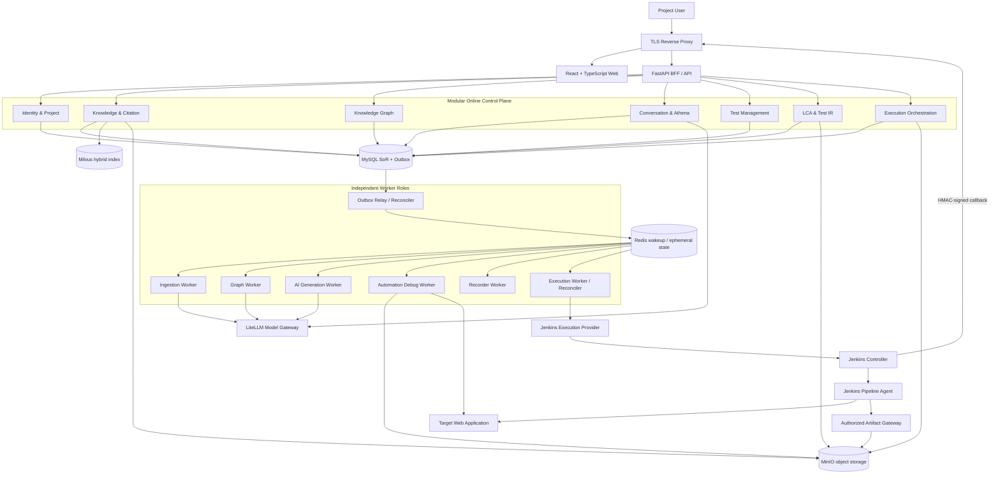
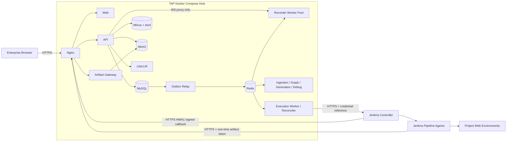
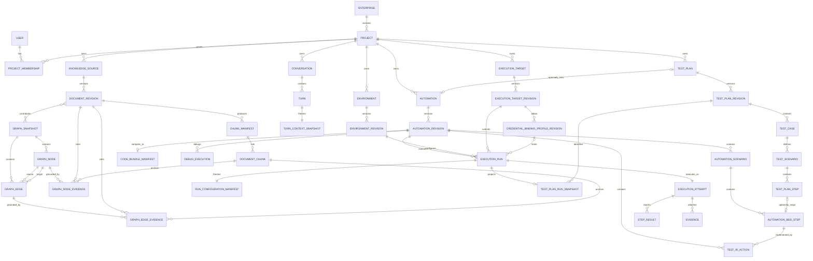
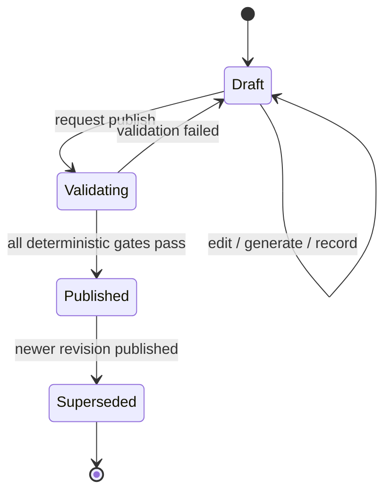
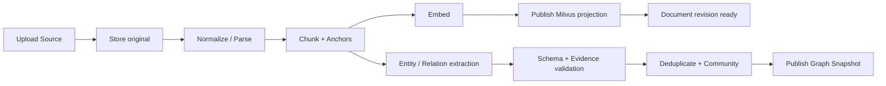
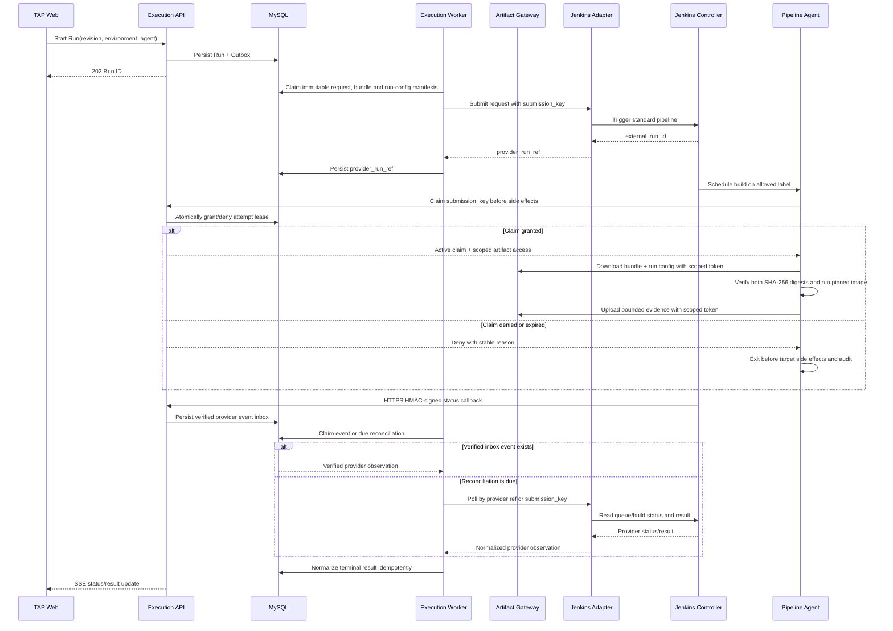

# RFC-009：Athena 知识与 Web 测试自动化平台设计

## 1. 文档目的与事实边界

本文提出 TAP 下一阶段的产品与技术设计。该方案已在设计对话中逐节确认，目前进入书面审阅；RFC 被接受后，才成为架构基线与实施计划的依据。交付主线按以下顺序推进：

```text
可信知识问答
  → Knowledge Graph
  → AI 生成 Test Plan / Test Case
  → Web Low Code Automation
  → Web 录制与 Playwright TypeScript
  → Jenkins 执行与 Test Plan 结果闭环
```

本文描述的是**待书面确认的目标设计**，不是当前完成状态。当前仓库真实实现仍是较窄的 Athena 本地知识切片，以及使用浏览器状态和 fixture 的产品交互原型：

- Backend 已实现文档摄取、MySQL 账本、Outbox/Redis 唤醒、Milvus `doc` 检索、LiteLLM 模型端口、grounded answer 和引用核验基础。
- Web 已实现 Athena、Library、Knowledge Graph、Test Management 和 Low Code Automation 的交互原型。
- 当前默认 `AthenaPage` 挂载的是 `TapProductPrototype`；它只复用真实文档列表，发送消息、Graph、Test Plan、Automation 和 Run 仍是本地原型状态。真正调用 Knowledge Answer/Citation API 的 `AthenaWorkspace` 尚未接回默认产品壳。
- Project、用户认证、服务端 Conversation、真实 Knowledge Graph 抽取、正式 Test Plan/Automation 后端、Recorder Worker、Jenkins Provider 和真实 Execution Evidence 尚未完成。
- 在对应发布门禁通过前，原型中的 `Passed`、Run、Graph、Agent 和资产都不得描述为生产实现或真实执行证据。

RFC 接受后将替代旧的“Phase 1 先做独立 Intelligence Lab”交付优先级，并将 Athena 可信知识能力重新放在第一位。旧文档仍保留为历史决策和实验依据。

## 2. 产品范围

### 2.1 目标

第一阶段建设一套可供单一企业内部多项目、多用户使用的测试智能平台：

1. 用户能够上传和管理项目知识，并获得有来源、可核验、可恢复历史的回答。
2. 用户能够用 Graphify 式关系图探索知识实体、关系、社区和来源证据。
3. Athena 能根据知识与对话生成可审查的 Test Plan、Test Case 和 BDD 草稿。
4. LCA 作为独立功能，支持自然语言生成、手工设计和录制 Web 操作。
5. 每个 BDD Step 都能追溯到 Test IR Action、生成的 Playwright 代码、Step Result 和 Evidence。
6. Jenkins 作为首个 Execution Provider，使用用户选择的 Pipeline Agent 执行确定版本的 Automation。
7. 已关联 Automation 的正式执行结果进入 Test Plan 执行历史；未关联执行只保留在 LCA。
8. 所有知识、对话、测试资产、运行和证据都在 `project_id` 范围内授权和审计。

### 2.2 第一阶段明确包含

- 单一企业、多 Project、多用户。
- 内建账号密码认证和简单 RBAC。
- PDF、DOCX、Markdown、TXT 的文本摄取；延续当前无 OCR 边界。
- Milvus 文档混合检索和 MySQL Knowledge Graph。
- 服务端持久化 Conversation、Turn 和上下文快照。
- Athena AI Agent、Skill、Knowledge 和模型选择。
- Test Plan、Test Case、BDD、Automation、Test IR 和不可变发布版本。
- Web Automation，生成目标固定为 Playwright + TypeScript。
- 受控 Chromium Web 录制。
- Jenkins Provider、Pipeline Agent 选择、运行状态和 Evidence 回传。
- Linux + Docker Compose 企业内网部署基线。

### 2.3 第一阶段明确不包含

- Mobile Automation、iOS/Android 设备或 Appium。
- 企业 SSO、SAML、OIDC、Entra ID 或多身份源联邦。
- Azure DevOps Execution Provider；接口保留但不实施。
- 专用图数据库、无限深度图遍历或通用本体管理平台。
- 浏览器扩展或对用户本机 Chrome 的控制。
- Git 作为 Automation 的强制事实源；Git 只保留为后续导出/同步适配器。
- 多企业 SaaS、计费、多云调度或高可用 Kubernetes 基线。
- AI 自动发布 Test Plan/Automation，或用模型结论替代确定性门禁。

## 3. 采用方案与架构原则

### 3.1 采用模块化平台方案

TAP 保存知识、对话、Test Plan、Automation Revision 和 Run 的权威状态；Jenkins 只执行明确提交给它的版本。在线控制面继续采用模块化单体，耗时或需要资源隔离的工作拆为独立 Worker。

采用该方案的原因：

- 最大化复用当前 FastAPI、React、MySQL、Redis、Milvus、对象存储和 LiteLLM 实现。
- LCA 面向非开发者时不强制暴露 Git、分支和提交概念。
- Test Plan、BDD、Test IR 和 Run 的权威状态使用同一版本模型；MySQL 领域状态、Audit 与 Outbox 在同一事务提交，对象制品以 digest/manifest 原子晋级，Provider 结果由幂等 Reconciler 最终收敛。方案不宣称跨 MySQL、MinIO 与 Jenkins 的分布式事务。
- 通过 Port 和契约保留未来拆分服务、增加 Azure DevOps 或同步 Git 的能力。
- 避免第一阶段提前承担微服务治理、分布式事务和 Kubernetes 运维成本。

### 3.2 未采用的方案

| 方案                           | 不采用原因                                                        |
| ------------------------------ | ----------------------------------------------------------------- |
| Git/Jenkins 作为事实源         | 低代码用户必须理解仓库流程；BDD、Test IR 与代码容易形成多事实源。 |
| 从第一天拆分全量微服务         | 当前规模不需要，且会显著扩大部署、事务、监控和故障排查面。        |
| 由模型直接生成并执行框架代码   | 缺少稳定 Test IR、确定性验证和逐步骤追溯。                        |
| 第一阶段同时支持 Web 与 Mobile | 会同时引入设备、平台差异、Appium 和移动证据链，延迟核心闭环。     |

### 3.3 持久原则

1. **Knowledge first**：知识问答和证据能力先独立可用，再被测试生成复用。
2. **Project is the authorization boundary**：客户端只能收窄范围，不能扩大访问权限。
3. **Test IR is canonical**：BDD 表达业务意图，Test IR 表达可执行语义，Playwright 代码是可重建制品。
4. **Draft is not authority**：AI、录制和手工编辑先产生 Draft，人工发布后才形成不可变版本。
5. **Evidence before claims**：回答、Graph Fact、生成建议和执行结论都必须链接可验证证据。
6. **Provider-neutral core**：模型、检索、对象存储、录制和执行实现位于稳定 Port 之后。
7. **AI Agent is not a Pipeline Agent**：Athena AI Agent 负责理解和生成；Jenkins Pipeline Agent 负责运行。

## 4. 核心产品旅程

### 4.1 知识问答与图谱探索

1. Project Editor 上传知识文件或创建 Knowledge Source。
2. Ingestion Worker 保存原件、生成标准化文本、切块、Embedding 和 Milvus 投影。
3. Graph Worker 从同一 Document Revision 抽取实体与关系，并绑定原文 Evidence。
4. 文档检索索引 ready 后即可问答；Graph Snapshot 完成后独立原子发布，不阻塞基本问答。
5. 用户在 Athena 中选择 Knowledge、AI Agent、Skill 和模型后发送问题。
6. 服务端使用当前 Membership 构造可信检索策略，执行 Milvus hybrid search 和有界图扩展。
7. 回答经过 claim/citation 验证；无法获得充分证据时明确 abstain，不伪造引用。
8. 用户可从回答引用或 Knowledge Graph 节点/边打开精确原文位置。

### 4.2 Athena 生成测试资产

1. Athena 识别生成测试用例或自动化的意图。
2. 若用户直接要求 Automation，Athena 先询问是否需要生成 Test Plan。
3. 用户选择“需要”时，平台基于当前知识上下文生成 Draft Test Plan、Test Case 和 BDD，并标注引用、假设、风险和未覆盖项。
4. 用户在 Test Management 或 Athena 对话中审阅，发布后形成不可变 Test Plan Revision。
5. Athena 引导生成关联的 Draft Automation，并返回 Test Plan 与 Automation 深链接。
6. 用户选择“不需要”时，Athena 直接调用 LCA 创建独立 Draft Automation。

### 4.3 独立 LCA 创建与录制

LCA 不依赖 Athena 或 Test Plan。用户可以：

- 描述目标并点击 `✨` 生成 Web BDD、Test IR 和 Playwright Draft。
- 创建空白 Automation，手工编辑 BDD 和动作。
- 点击“开始录制”，在平台提供的受控 Chromium 会话中操作目标网站。

录制结束后，系统先产生去噪后的 Test IR Action，再分组生成 BDD 和 Playwright TypeScript。用户在三层编辑器中审查映射，或在 Automation 对话框中让 AI Agent 提议变更。AI 变更必须以差异形式 Apply/Reject，不能静默覆盖手工内容。

### 4.4 执行与 Test Plan 回写

1. 用户选择环境、Published Automation Revision 和 Jenkins Pipeline Agent。
2. TAP 校验 Published Revision 已固化的 Bundle digest，并在同一事务中创建 Run、冻结关联/步骤映射与非秘密 Run Configuration Manifest，再写入 Execution Request；正式运行不临时重新生成代码或读取可变环境配置。
3. Jenkins Adapter 触发标准 Pipeline，Pipeline Agent 下载并校验 Bundle 后执行。
4. Jenkins 回传 JUnit、Playwright trace、截图、视频和脱敏日志。
5. Result Normalizer 将结果映射到 BDD Step 与 Test IR Action。
6. 只要 Run 开始时 Automation 与 Test Plan 已关联，且运行的是 Published Revision，该正式 Run 就同时进入 Automation Run History 和 Test Plan Execution History，**不受从哪个页面发起影响**。
7. 未关联 Run 不产生 Test Plan 记录；后续建立关联也不追溯投影旧 Run。
8. 后续解除关联不删除历史 Run 中保存的关联快照。
9. Draft Debug Run 只进入 LCA 调试历史，不进入 Test Plan 正式记录。

## 5. 总体架构



### 5.1 运行角色

| 运行角色                    | 责任                                                      | 不能承担的责任                            |
| --------------------------- | --------------------------------------------------------- | ----------------------------------------- |
| Web                         | 页面渲染、交互、客户端缓存和可访问性                      | 权限决策、密钥、直接访问数据库或 Provider |
| API/BFF                     | DTO、认证授权、同步命令与查询、SSE、受控 Artifact Gateway | 长时间模型任务、浏览器执行                |
| Outbox Relay/Reconciler     | 可靠分发、lease、超时与状态修复                           | 业务内容生成                              |
| Ingestion Worker            | 解析、切块、Embedding、检索投影                           | 回答生成、测试执行                        |
| Graph Worker                | 实体/关系抽取、去重、社区和 Snapshot 发布                 | 无证据的权威事实写入                      |
| AI Generation Worker        | 回答、Test Plan、BDD、Test IR 候选生成                    | 发布、正式执行结论                        |
| Automation Debug Worker     | 在隔离 Playwright 中执行 Draft Snapshot                   | 创建正式 Run、向 Test Plan 投影结果       |
| Recorder Worker             | 隔离 Chromium、串流、事件捕获和回收                       | 保存明文密码、直接发布 Automation         |
| Execution Worker/Reconciler | 异步提交/取消、轮询、Provider 事件处理、结果归一          | 执行任意未发布内容、接收未验证公网回调    |

## 6. 部署设计

### 6.1 第一阶段生产基线

目标部署为企业内网 Linux 主机上的 Docker Compose。该基线是低运维成本的首个正式交付配置，不宣称高可用：



部署约束：

- 只有反向代理对用户网络开放；MySQL、Redis、Milvus、etcd、MinIO、LiteLLM 和 Worker 只在私有容器网络可达。Jenkins Agent 的 Bundle/Evidence 流量经过反向代理上的专用 Artifact Gateway 路由，不能直连 MinIO。
- TLS 在反向代理终止；内部 Provider 连接在跨主机时也必须使用 TLS。
- Jenkins 独立部署。TAP 不管理 Jenkins Controller 生命周期，只验证连接与所需能力。
- Recorder 使用固定容量的预置 Worker 池；不把 Docker Socket 暴露给 Web/API。按需容器调度留待后续独立设计。
- 数据卷、备份目录和日志目录使用显式路径与容量告警。
- 镜像、Milvus/PyMilvus、Playwright 浏览器和 Runner Image 均固定版本，不使用 `latest`。
- 第一阶段 Milvus Standalone 扩容为 Distributed 时按导出/重建投影、校验、切流设计，不假设可以原地在线升级。
- 迁移 Kubernetes 时保持相同 Port、镜像和状态职责，不把 Kubernetes 对象写进领域模型。

### 6.2 环境矩阵

| 环境       | 身份与网络                       | 依赖                                                       | 允许的数据与用途                     |
| ---------- | -------------------------------- | ---------------------------------------------------------- | ------------------------------------ |
| Local      | 精确 loopback；本地 demo policy  | Docker Compose；deterministic model 可选                   | 脱敏 fixture、开发和快速回归         |
| CI         | 隔离的临时 Compose project       | 真实 MySQL/Redis/MinIO/Milvus；Fake Model/Jenkins/Recorder | 版本化 fixture、确定性门禁           |
| Staging    | TLS、真实 Project RBAC、私网服务 | 真实 Milvus、模型、Recorder、Jenkins Agent                 | 脱敏或批准的预生产数据、发布候选验证 |
| Production | TLS、最小权限账号、审计、备份    | 固定版本的全部运行角色和真实 Provider                      | 企业 Project 数据与正式 Run          |

任何只在 Local/CI 通过的能力不得标记为 Staging/Production ready。Production 发布必须使用与 Staging 相同的镜像 digest 和 schema migration，只允许配置与凭据不同。

### 6.3 数据职责

| 数据类别                                                  | 权威存储                                                         | 说明                                                         |
| --------------------------------------------------------- | ---------------------------------------------------------------- | ------------------------------------------------------------ |
| User、Project、Membership、RBAC                           | MySQL                                                            | 认证授权事实                                                 |
| Document、Revision、Ingestion、Manifest                   | MySQL                                                            | 原件和派生文件内容保存在对象存储                             |
| Chunk 检索投影                                            | Milvus                                                           | 可重建，不是内容事实源                                       |
| Graph Node/Edge/Snapshot/Provenance                       | MySQL                                                            | 已发布 Graph 历史事实；重抽取产生新 Snapshot，不替代备份恢复 |
| Conversation、Turn、Context Snapshot                      | MySQL                                                            | 每轮绑定发送时的选择和引用                                   |
| Test Plan、BDD、Automation、Test IR                       | MySQL                                                            | 资产身份、草稿、版本和映射                                   |
| Environment、Execution Target、Credential Binding Profile | MySQL                                                            | 配置使用不可变 Revision；Run 只引用确定版本                  |
| Run Configuration Manifest                                | MySQL + 可选 MinIO 数据制品                                      | 冻结目标 URL、非秘密参数与数据 digest，不含 Secret value     |
| Playwright Bundle、Evidence                               | MinIO                                                            | 内容寻址并在 MySQL 保存 digest/manifest                      |
| Debug Execution、短期诊断                                 | MySQL + MinIO                                                    | 与正式 Run 分表、短期保留、不投影 Test Plan                  |
| Run、Attempt、Step Result、Audit                          | MySQL                                                            | append-oriented 运行和审计事实                               |
| Queue wakeup、短期 lease/cache                            | Redis                                                            | 可重建，不是唯一事实源                                       |
| Runtime Secret                                            | Jenkins Credential（正式 Run）/ TAP 加密 Secret（平台内 Worker） | 业务模型只保存用途受限的 `SecretRef`                         |

## 7. 模块边界与稳定 Port

### 7.1 领域模块

| 模块               | 公开责任                                                                 | 主要依赖                                  |
| ------------------ | ------------------------------------------------------------------------ | ----------------------------------------- |
| Identity & Project | 登录、Session、User、Project、Membership、Role、授权上下文               | MySQL、Password Hasher、Audit             |
| Knowledge          | Source、Document Revision、Ingestion、Search、Answer、Citation           | SearchPort、ModelGateway、ObjectStorePort |
| Graph              | Graph Snapshot、Node、Edge、Evidence、邻居/路径查询                      | GraphStorePort、ModelGateway              |
| Conversation       | Conversation、Turn、Context Snapshot、Artifact Link、SSE                 | Knowledge、Graph、AI Catalog              |
| Test Management    | Test Plan、Test Case、BDD、Revision、发布                                | Knowledge Citation、Audit                 |
| Automation         | Automation、Test IR、Playwright Bundle、1:1 Link、发布                   | ScriptGeneratorPort、ObjectStorePort      |
| Recorder           | Recorder Session、Live Stream、Captured Event、Draft 构建                | RecorderPort、Automation                  |
| Execution          | Environment、Execution Target、Run、Attempt、Evidence、Result Projection | ExecutionProvider、ObjectStorePort        |

模块不直接导入具体 Provider Adapter。跨模块命令使用应用服务；长任务通过 MySQL Outbox 触发，不能让浏览器直接向 Redis 发布权威命令。

### 7.2 Provider-neutral Port

| Port                  | 最小职责                                         | 第一实现                        |
| --------------------- | ------------------------------------------------ | ------------------------------- |
| `ModelGateway`        | Chat、Embedding、结构化生成、模型目录            | LiteLLM                         |
| `SearchPort`          | Hybrid Search、Project Filter、版本与 provenance | Milvus                          |
| `GraphStorePort`      | Snapshot、Node/Edge、Neighbors、Bounded Path     | MySQL                           |
| `ObjectStorePort`     | 文档、Bundle、Evidence 的读写和短期 URL          | MinIO/S3 API                    |
| `RecorderPort`        | allocate、stream、capture、stop、cleanup         | Playwright Chromium Worker      |
| `ScriptGeneratorPort` | Test IR 验证并生成框架代码                       | Playwright TypeScript Generator |
| `ExecutionProvider`   | verify、submit、status、cancel、fetch result     | Jenkins Adapter                 |

`ExecutionProvider` 的领域请求只使用 TAP 术语，不泄漏 Jenkins Job 对象：

```text
verify_connection(target)
submit(execution_request) -> provider_run_ref
get_status(provider_run_ref) -> normalized_status
cancel(provider_run_ref)
fetch_result(provider_run_ref) -> provider_result_manifest
```

未来 Azure DevOps Adapter 实现相同 Port，不改变 Automation、Run 或 Test Plan 模型。

以上七个 Port 是本阶段需要保持稳定的领域集成边界。Secret 存储与解析属于平台安全设施：业务对象只持有用途受限的 `SecretRef`。正式 Jenkins Run 只接受 Execution Target 中已验证的 Jenkins Credential Binding；TAP 托管 Secret 仅供 API/Provider、Recorder 和 Debug Worker 的平台内路径通过受限内部解析器访问，不新增第八个业务 Provider Port。

## 8. 核心数据模型



### 8.1 身份与并发规则

- 所有 Project 业务表都包含 `project_id`；仓储接口没有无 Project 的普通查询方法。
- 外部可见 ID 使用不可猜测 ID 或带前缀 ID；数据库自增键不作为授权依据。
- 修改 Draft 使用 `version`/ETag 乐观并发，冲突返回 `409`，不能最后写入静默覆盖。
- 发布操作创建或锁定不可变 Revision，并保存内容 digest、创建者和时间。
- Run 固定 `automation_revision_id`、Bundle SHA-256、Runner Image digest、`environment_revision_id`、`execution_target_revision_id`、Pipeline/Shared Library version 与 digest、Agent Label、Credential Binding Profile Revision，以及可选 Test Plan 关联快照。Queued/Running Run 不读取这些资产的 mutable head。
- `RUN_CONFIGURATION_MANIFEST` 在 Run 创建事务内冻结目标 base URL、locale/timezone、非秘密环境参数、Feature Flag、Test Data Artifact reference/digest、允许 egress 与所需 Secret Slot 名称；Manifest 本身不含 Secret value，并保存 canonical JSON SHA-256。
- 提交前只重新验证已固定的 Revision 仍未被禁用/撤权且 digest 匹配；Project Admin 后续编辑会创建新配置 Revision，只影响新 Run。Jenkins 回传实际 Pipeline SCM revision、Shared Library revision、Agent identity 和 Runner Image，任何与请求不一致的值都使结果进入基础设施失败/不可采信状态。

### 8.2 Test Plan 与 Automation 严格可选 1:1

`test_plan_automation_link` 同时具有以下约束：

```text
UNIQUE(project_id, test_plan_id)
UNIQUE(project_id, automation_id)
```

关联双方必须属于同一 Project。建立、替换或解除关联需要该 Project 的 Editor 或 Project Admin 权限，并写 Audit Event。若目标已被另一资产占用，返回 `409 association-conflict`，UI 必须展示冲突资产链接，不能自动解除旧关联。

资产关联不等于把两边的 BDD 行直接共用同一数据库记录。Test Plan Revision 和 Automation Revision 分别拥有自己的稳定 Step ID；Automation Revision 保存可选的 `test_plan_step_id ↔ automation_bdd_step_id` 映射。执行时先把 Action Result 汇总为 Automation BDD Step Result，再通过该版本化映射投影到 Test Plan：未映射的 Test Plan Step 显示 `Not automated`，Automation 额外的准备/清理 Step 仍保留在 LCA Run 中但不伪造成 Test Plan Step。

关联发生在稳定资产身份上，步骤映射则必须绑定确定的双方 Revision：

- 已关联 Automation 的 Published Revision 保存目标 `test_plan_revision_id`、Step Mapping 和 Mapping Digest。
- 把两个已有资产关联起来不会修改其旧 Revision；若还没有兼容映射，关联状态显示 `Mapping required`，只能创建/调试新的 Automation Draft，不能发起正式 Run。
- 从 Test Plan 当前 Revision 点击执行时，只能选择明确映射到该 Revision 的 Published Automation Revision；没有兼容版本时显示 `Automation out of date` 并引导更新，而不是把结果套到最新步骤。
- 从 LCA 发起正式 Run 时，使用所选 Automation Revision 已固定的 Test Plan Revision。Run 在开始事务内保存 Link、双方 Revision 和 Step Mapping Snapshot；因此触发入口不会改变结果投影规则。
- Test Plan 发布新 Revision 不改写旧 Automation Revision 或历史 Run；旧组合只保留历史解析，新的正式 Run 被阻止，直到发布映射到当前 Published Test Plan Revision 的兼容 Automation Revision。

创建正式 Run 的事务必须重新读取当前 Link，并验证 Automation Revision 中的目标 `test_plan_id` 与 Link 一致、目标 Test Plan Revision 为 Published、Mapping Digest 与发布清单一致。验证通过后，Run 固定保存 `test_plan_id`、`test_plan_revision_id`、`step_mapping_digest` 和 Link version；没有 Link 时四者为空且不投影，Link 存在但不兼容时返回 `409 automation-mapping-required`。因此关联替换、并发解除或旧映射都不能把结果投影到错误的 Test Plan。

### 8.3 Revision 状态



- Draft 可调试执行，但结果只进入 LCA Debug History。
- Published 和 Superseded Revision 都不可编辑。修改时创建一个具有新 Revision ID 的 Draft，并保存其来源 Revision；这不是旧 Revision 的状态回退。
- Superseded Revision 仅用于历史 Run 解析，第一阶段不能发起新的正式 Run；需要修改或重跑时从其 fork 新 Draft 并重新发布。
- Test Plan 和 Automation 分别发布；关联的是稳定资产身份，Run 保存当时双方 Revision 快照。
- 已关联 Test Plan 尚无 Published Revision 或所选 Automation Revision 没有兼容映射时，只允许 Automation Debug Run；正式 Run 必须同时固定一个兼容的 Published Test Plan Revision。

## 9. Knowledge 与 Knowledge Graph

### 9.1 摄取流程



摄取使用现有 MySQL 账本、Outbox、lease 和可恢复 Worker 模式。关键规则：

- `source_content_hash`、`revision_id` 和 `chunk_content_hash` 提供幂等身份。
- 原件、标准化文本、Chunk Manifest 和 Embedding Manifest 可从对象存储恢复。
- 新检索投影完成前保留旧 active revision；alias/snapshot 切换原子化。
- Graph 构建失败不撤销已经 ready 的文档检索；Graph 独立重试并显示状态。
- 删除或撤权先在 MySQL 生效，查询立即 fail closed，再异步清理检索和图投影。

### 9.2 Milvus 生产目标

第一阶段将已有 Milvus `doc` 路径升级为目标生产检索后端，但在生产门禁通过前不能把本地实验描述为生产完成。

- 每个检索实体保存 `enterprise_id`、`project_id`、授权元数据、document/revision/chunk identity、anchor 和内容 digest。
- 查询过滤器只能由服务端从当前 Membership 与 Project Policy 编译，不能接受浏览器或模型提供的原始 filter。
- Dense、BM25、hybrid 和任何补充读取使用等价 filter；结果返回后再次核验 project/revision/provenance。
- 一次请求绑定一个确定的 physical collection/schema/corpus/model version，alias 切换期间不能混读版本。
- Milvus 是可重建投影；MySQL 和对象存储才保存知识事实与重建 manifest。
- 从 Standalone 迁移到 Distributed 采用新集群重建、双读校验和受控 alias/cutover；回滚保留旧投影，不把迁移设计成原地在线升级。
- 第一阶段只承诺文档 family。代码、BDD 和 failure family 在有真实检索需求后独立扩展。

逻辑 family 的第一阶段映射固定如下：

| Logical family | 第一阶段物理目标                                 | 行为                                            |
| -------------- | ------------------------------------------------ | ----------------------------------------------- |
| `doc`          | `kb_doc_active` alias → 版本化 Milvus collection | 唯一启用的在线检索 family                       |
| `code`         | 无                                               | 显式请求时在 Provider I/O 前 fail closed        |
| `bdd`          | 无                                               | Test Plan/BDD 先保存在 MySQL，不进入知识检索    |
| `failure`      | 无                                               | Run/Evidence 先按结构化资产查询，不进入知识检索 |

这不是“四索引已经完成”的声明，而是第一阶段主动收窄。后续启用新 family 必须定义 schema、切块、ACL、质量评测和独立发布门禁。

### 9.3 在线问答

在线回答顺序固定为：

1. 验证 Session、Membership、Project 和用户选择的 Source。
2. 生成有界 Query Plan 和查询向量。
3. 执行 Milvus BM25 + dense hybrid retrieval。
4. 仅当当前 Project/Source 存在可授权的 active Graph Snapshot 时，根据命中实体做最多两跳、受类型和数量预算约束的 Graph Expansion。
5. 去重、RRF/rerank，并构造只包含已授权 Evidence 的 Context Snapshot；同时保存 `graph_context_status` 与使用的 Snapshot ID。
6. 经 `ModelGateway` 生成结构化回答。
7. 对 claim、citation、revision、anchor 和当前权限进行确定性验证。
8. 验证失败则返回受控错误或证据不足，不把 Provider 故障伪装成正常零召回。

`graph_context_status` 使用 `APPLIED | NOT_READY | FAILED | UNAVAILABLE | NOT_SELECTED`。普通 Knowledge Chat 在非 `APPLIED` 时继续使用文档检索回答，并在响应/Context Snapshot 中明确标记“Graph enrichment 未使用”及原因；只有 active Snapshot 查询成功且返回零关系时，才能表达“未找到相关关系”。用户显式执行 Graph 邻居/路径查询时，`FAILED/UNAVAILABLE` 返回稳定 `503 graph-unavailable`，不能降级成空图。

### 9.4 Graph 数据与体验

Graph 事实模型：

| 对象           | 关键字段                                                                  |
| -------------- | ------------------------------------------------------------------------- |
| Graph Snapshot | `project_id`、版本、来源 Revision 集合、状态、digest                      |
| Node           | 稳定 canonical key、label、type、community、degree、confidence            |
| Edge           | source node、target node、relation type、`EXTRACTED/INFERRED`、confidence |
| Node Evidence  | node、document revision、chunk、anchor、支持文本 digest                   |
| Edge Evidence  | edge、document revision、chunk、anchor、支持文本 digest                   |

Node 与 Edge 使用独立 Evidence 关联表，避免一条证据记录被错误要求同时隶属两种 Fact；两类记录可以指向同一 Chunk/Anchor，但各自保存独立置信度和抽取 provenance。

第一阶段查询限制为邻居、过滤、搜索和有界路径，不建设任意图查询语言。`INFERRED` Edge 必须在 UI 中显式标识，不能当作原文事实；测试生成使用它时必须作为假设显示。

前端使用 WebGL 图渲染方案，推荐 `Sigma.js + Graphology`：

- ForceAtlas2 在 Web Worker 中运行，避免阻塞主线程。
- 实施时固定经过兼容性和性能门禁的稳定 Sigma/Graphology 精确版本；不得默认采用 alpha、beta 或 `latest`。
- 节点大小表达连接度，颜色表达 Community。
- 支持缩放、平移、重置、搜索高亮、Community 筛选、邻居展开和路径高亮。
- Inspector 展示 Node/Edge 类型、置信度、相邻关系和 Evidence 深链接。
- 大图先返回摘要子图，按需扩展；不一次向浏览器发送整个企业图谱。

## 10. Athena 与持久化 Conversation

### 10.1 Conversation 规则

- `New chat` 先创建客户端空白草稿；首条消息成功提交后才持久化 Conversation，避免空历史噪音。
- 一次 Conversation 对应一条历史记录，后续 Turn 追加到同一记录。
- 切换页面、刷新或服务重启后恢复 Conversation、Turn 和选择上下文。
- Composer 为空且不处于 IME 组字时，按一次上方向键只填入当前 Conversation 最近一条用户已发送内容，不自动发送；已有草稿、无历史或切换到其他 Conversation 时保持当前输入不变。已发送 Turn 以服务端为准。
- 每个 Turn 保存发送时的 `model_alias`、Knowledge Source/Revision、AI Agent、Skill、Project、检索策略摘要和 Citation Snapshot。
- 之后移除 Knowledge、Agent 或 Skill 只影响下一 Turn，不能改写历史 Turn。

### 10.2 模型、AI Agent 与 Skill

- 模型菜单由后端 Model Catalog 返回，只显示当前部署启用的 Codex 模型名称；不显示 Fast、Ultra 或 reasoning effort。
- 新 Conversation 使用服务端 `default_model_alias`，首个交付配置为 `GPT-5.6 Sol`。若该 alias 被停用，Project Admin 必须先指定另一个已启用的 Codex 模型；历史 Conversation 显示 unavailable 并要求用户明确改选，不能在发送时静默 fallback。
- UI 显示名与内部 model alias 分离；Conversation 保存 alias，审计保存实际 provider/model 解析结果。
- AI Agent 是允许的系统指令、工具权限和输出 Schema 配置，不是 Jenkins Agent。
- Skill 是版本化、服务器批准的指令/模板资源。第一阶段不允许普通用户上传任意可执行插件代码。
- 生成 Test Plan/Automation 时保存 Agent、Skill、模型和知识 Context Snapshot，保证结果可审计。

### 10.3 流式与取消

Chat、生成和 Run 状态使用 SSE。每个流事件带单调序号；客户端断线后使用 `Last-Event-ID` 恢复。取消只停止仍可停止的 Attempt，已持久化的 Turn、Draft 或 Evidence 不回滚。

## 11. Test Management

### 11.1 Test Plan 结构

一个 Test Plan Revision 至少包含：

- 目标、范围、前置条件和风险。
- Test Case 集合。
- 每个 Test Case 的 BDD Scenario 与 Given/When/Then Step。
- 来源 Citation、Assumption、Unknown 和 Coverage Gap。
- 发布验证结果和版本 digest。

AI 生成只创建 Draft。发布门禁至少验证：

- 必填字段和稳定 Step ID。
- 引用存在、当前用户可访问且 revision 未损坏。
- 同一 Scenario 的 BDD 顺序和关键预期完整。
- 没有把 Assumption 或 `INFERRED` Graph Edge 表述为已验证事实。
- 严格 1:1 关联没有冲突。

### 11.2 执行记录

Test Plan Execution History 是 Run 的投影，不创建另一份相互独立的结果事实。投影显示：

- Automation、Automation Revision、Test Plan Revision、Link version 和 Step Mapping Digest 快照。
- Trigger Surface、发起人、环境、Pipeline Agent 和时间。
- `operation_status`、`test_outcome`、`evidence_status`，以及 Scenario/Step 结论、Evidence 和失败原因。
- 关联在 Run 开始后的变化不会改写历史。

## 12. Low Code Automation 与 Test IR

### 12.1 LCA 是独立功能

Automation 可以没有 Test Plan，也可以不经过 Athena 创建。LCA 提供 Library、New Automation、Automation Detail、Automation Copilot、Recorder、Run Configuration 和 History。

Draft 的“调试执行”使用提交时冻结的 Draft Snapshot，由平台内置 Automation Debug Worker 在固定 Playwright Runner Image 中隔离运行。它保存独立的 `debug_execution`、短期诊断和 Draft digest，不创建正式 `EXECUTION_RUN`，不调用 Jenkins，也不向 Test Plan 投影；M4 先交付这条本地调试路径，M6 才开放 Published Revision 的 Jenkins 正式执行。

### 12.2 Test IR Action

第一阶段支持以下 Web Action：

| 类别            | Action                                                                           |
| --------------- | -------------------------------------------------------------------------------- |
| Navigation      | `navigate`、`go_back`、`reload`                                                  |
| Interaction     | `click`、`fill`、`press`、`select_option`、`check`、`uncheck`、`upload_file`     |
| Synchronization | `wait_for_url`、`wait_for_element`、`wait_for_response`                          |
| Assertion       | `assert_visible`、`assert_text`、`assert_value`、`assert_url`、`assert_download` |
| Composition     | `call_fixture`                                                                   |

每个 Action 包含稳定 ID、所属 BDD Step、目标语义、Locator Candidates、参数/Secret Ref、等待策略、断言和生成代码位置。一个 BDD Step 映射一个或多个 Action；不能存在没有 BDD 所属关系的普通录制动作。

ER 模型允许未完成 Draft 暂时拥有零个 Action；发布门禁要求每个可执行 BDD Step 至少映射一个有效 Action，且不存在 orphan Action。纯说明性内容必须建模为 Scenario 描述或 Note，不能伪装成无实现 Step。

Test IR 是权威可编辑模型。生成代码默认只读并可重建。第一阶段不提供任意 TypeScript、`eval`、动态 import、`process`/`fs`、任意网络请求或 `custom_playwright_step` 逃生口；`call_fixture` 只能引用 Project Admin 允许的版本化 Fixture Catalog 条目。标准 Action 无法表达的场景必须阻止发布并进入 Action Schema 扩展评审，不能通过修改生成文件绕过映射与安全门禁。

### 12.3 代码生成与发布

`ScriptGeneratorPort` 输入固定 Automation Revision 和 Generator Version，输出：

- Playwright TypeScript Spec。
- 参数与 Secret Ref Schema。
- Fixture 与数据模板。
- BDD/Test IR/代码行映射 Manifest。
- `package.json`/lockfile 或与固定 Runner Image 匹配的依赖 Manifest。
- 静态验证、类型检查和受控 dry-run 结果。

发布时计算 Bundle SHA-256 并写入 `CODE_BUNDLE_MANIFEST`。相同输入和 Generator Version 必须产生相同语义制品；时间戳等非确定字段不进入 digest。

Draft Debug 可为冻结的 Draft Snapshot 生成临时 Bundle；该 Bundle 明确标为非发布制品并按短期策略回收。正式 Run 只能装载 Published Revision 已记录的 `CODE_BUNDLE_MANIFEST`，启动时重新校验 digest，不能临时生成或替换内容。

Automation Debug Worker 以非 root、只读根文件系统、无宿主机挂载/Socket、固定 CPU/内存/时长配额运行。网络仅能访问 Project Admin 配置的目标 Environment allowlist 与必要的 TAP Artifact/heartbeat 端点；Secret 使用用途绑定 lease 注入并在结束时销毁。M4 门禁必须覆盖 DNS/重定向绕过、未批准 Fixture、敏感字段脱敏、超时取消、容器回收和并发配额。

## 13. Web Recorder

### 13.1 会话拓扑

1. 用户在 LCA 请求 Recorder Session。
2. Recorder Worker 分配隔离、非持久化 BrowserContext 的 Playwright + Chromium 容器和临时 Session Token。
3. 浏览器画面通过 noVNC/WebSocket 嵌入 LCA；第一阶段不安装本地扩展。
4. Worker 使用 `browserContext.addInitScript`/受控 binding 捕获 DOM 交互，并结合 Playwright 页面、导航、下载和网络事件补全语义。
5. 停止后 Worker 关闭外部访问、生成 Captured Event Manifest 并回收容器。

不得依赖 Playwright 未承诺稳定的内部 Codegen API。Recorder 捕获层通过仓库自有协议测试锁定行为。

### 13.2 动作清洗

- 合并连续输入，只保留最终值。
- 去除无业务意义的 mousemove、focus 和重复点击。
- 为导航、异步 UI 和下载建议确定性等待，禁止无理由固定 sleep。
- 将录制事件分组到 BDD Step；不确定时要求用户确认，而不是编造业务含义。
- 选择器优先级：`data-testid` → ARIA role/name → label → stable text → stable CSS；XPath 仅作最后兜底。
- 保存多个 Locator Candidate 和生成理由，重放失败时可重新选择。

### 13.3 Secret 与隔离

- `input[type=password]`、已配置敏感字段和令牌值永不进入事件、BDD、Test IR、代码、截图元数据或日志。
- 敏感输入转换为 `SecretRef`，由 Project Admin 映射到 Jenkins Credential 或 TAP 加密 Secret。
- Recorder Session 设置最大时长、空闲超时、允许域名/网络策略和最大上传大小。
- Session 结束、超时或 Worker 崩溃后由 Reconciler 回收容器和临时凭据。

## 14. Jenkins 执行

### 14.1 Execution Target

Project Admin 配置 Jenkins Controller、API Token 凭据引用、标准 Pipeline Job/Shared Library、允许的 Agent Label、默认 Runner Image 和可用环境。Environment、Execution Target 和 Credential Binding Profile 每次修改都创建不可变 Revision；普通用户只能从已启用的授权版本中选择，不能提交任意 Jenkins URL、Job、Pipeline ref 或 Label。

标准 Pipeline Job 只作为稳定 Bootstrap：实际 Jenkinsfile/Shared Library 必须解析到不可变 SCM commit SHA 或内容 digest（人类可读 tag 仅作显示），并与 Execution Target Revision 的 `pipeline_contract_version`、允许参数 Schema 一起保存。无法证明 Pipeline 版本、Runner Image digest 或 Credential Binding Profile Revision 的 Target 不能进入 Production Run。

Credential Binding Profile Revision 对 callback 明确保存 `callback_key_id`、TAP verifier `SecretRef`、Jenkins Credential ID 和有效期元数据。启用前，验证 Job 必须用该 Jenkins Credential 对 TAP nonce 签名并通过 API 验证，证明两端密钥配对；Run 固定 Profile Revision 与 `callback_key_id`。轮换会创建新 Profile Revision，旧 TAP verifier key 至少保留到引用它的所有 Run 终结并超过 callback replay window，之后才可撤销。密钥值始终只存在两端 Secret Store，不进入 MySQL 业务字段或 Pipeline 参数。

### 14.2 提交流程



Jenkins 参数至少包含：

- TAP `run_id`、`submission_key`、一次性 claim token 和 callback URL；callback HMAC key 由 Jenkins Credential 注入，不作为普通参数传递。
- Bundle 短期 URL 与 SHA-256。
- Run Configuration Manifest 短期 URL 与 SHA-256。
- Runner Image digest、Pipeline/Shared Library immutable ref 与 digest。
- Environment Revision 和 Execution Target Revision，不包含环境变量值。
- Jenkins Credential Binding Profile；只传非秘密的 profile/reference，不传 TAP SecretRef 或明文值。
- Pipeline Agent label。
- Evidence upload URL 与大小/类型限制。

Bundle、Run Configuration Manifest 与 Evidence URL 都指向 TAP Artifact Gateway，并携带单次、短 TTL、绑定 `run_id`/`submission_key`/有效 claim/对象/操作/大小的 scope；URL 不暴露 MinIO 内网地址。Gateway 校验 scope 后才流式访问对象存储，重复提交按对象 digest 幂等处理。

### 14.3 状态与幂等

正式 Run 不使用一个字段同时表达基础设施、测试结论和证据完整性，而是保存三个正交状态：

```text
operation_status: QUEUED → RUNNING → SUCCEEDED | FAILED | CANCELLED | TIMED_OUT
test_outcome:     NOT_RUN | PASSED | FAILED | INCONCLUSIVE
evidence_status:  PENDING | COMPLETE | INCOMPLETE
```

| Provider/Runner 事实                        | operation_status | test_outcome       | evidence_status      |
| ------------------------------------------- | ---------------- | ------------------ | -------------------- |
| Runner 正常结束，结构化结果完整且断言全通过 | `SUCCEEDED`      | `PASSED`           | 按必需 Evidence 校验 |
| Runner 正常结束，存在有效断言失败           | `SUCCEEDED`      | `FAILED`           | 按必需 Evidence 校验 |
| Provider/Runner 故障，未产生可信测试结果    | `FAILED`         | `NOT_RUN`          | `INCOMPLETE`         |
| 故障、取消或超时发生在部分 Step 已执行之后  | 对应终态         | `INCONCLUSIVE`     | 通常为 `INCOMPLETE`  |
| 必需 Evidence 缺失但结构化测试结果仍可验证  | 保留实际操作终态 | 保留确定性测试结论 | `INCOMPLETE`         |

BDD/Test IR Step Result 使用 `PASSED | FAILED | SKIPPED | NOT_RUN | INCONCLUSIVE`。Jenkins 自身的 `SUCCESS/FAILURE/UNSTABLE/ABORTED` 只作为 Provider Observation 保存，不能直接等同于 TAP 的 `operation_status` 或 `test_outcome`；Normalizer 结合退出阶段、JUnit/Step Result 与 Evidence Manifest 做确定性映射。Test Plan 展示测试结论和证据完整性，不能用 “Run succeeded” 代替 “Test passed”。

- `idempotency_key` 防止用户重试创建重复 Run。
- 第一阶段每个正式 Run 只拥有一个 append-only Execution Attempt（保留 `attempt_no=1` 便于未来扩展），其唯一 `submission_key = run_id:1`，并持久化 `NOT_SUBMITTED | SUBMITTING | SUBMITTED | SUBMIT_UNKNOWN`。该 key 作为 Jenkins 参数、回调字段和查询条件贯穿全程。
- Trigger 请求返回不确定时进入 `SUBMIT_UNKNOWN`；Reconciler 先按 `submission_key` 查询 Queue/Build 或等待 callback，禁止盲目再次触发。到达对账期限仍无法证明“未被 Jenkins 接收”时，以基础设施失败结束该 Attempt，不自动启动可能重复产生外部副作用的替代 Attempt。
- 标准 Jenkins Pipeline 在下载 Bundle 或访问目标站点前，必须携 `submission_key` 向 TAP 申请一次性执行 claim；TAP 通过唯一约束和 lease 只允许一个 Build 获得该 Attempt。重复或过期 Build 在产生测试副作用前退出。第一阶段不在同一 Run 内创建替代 Attempt；用户选择 Rerun 时创建新的 Run，并保存 `rerun_of_run_id`，旧 Attempt/Step Result/Evidence 保持不可变且不与新 Run 混合。
- `provider_run_ref` 在同一 Execution Target 内唯一。
- Callback 和 Polling 使用相同终态归一器，重复或乱序消息不能回退终态。
- Jenkins callback 只进入反向代理后的 API webhook inbox；Pipeline 使用 Execution Target 绑定的 Jenkins Credential 对 `target_id + run_id + submission_key + timestamp + nonce + body_digest` 做 HMAC-SHA256。API 验证 key ID、target/run 绑定、恒定时间签名、时间窗和 nonce 唯一性后才持久化事件，私网 Adapter 不暴露公网入口。Execution Worker 对已验证 Inbox 与 Polling Observation 使用同一归一器。
- Provider 暂时不可用返回 `503 execution-provider-unavailable`，不能生成模拟成功结果。
- 取消是尽力而为；TAP 保存请求时间、Provider 响应和最终观测状态。

### 14.4 Evidence

第一阶段支持：

- JUnit/XML 或结构化 Step Result。
- Playwright trace。
- 失败截图。
- 可选视频。
- 脱敏 console、network summary 和 Pipeline log。

Evidence 使用内容类型、大小、SHA-256、创建者、Run/Attempt 和 retention class 建档。浏览器不能通过可预测对象路径直接访问 MinIO，必须经授权 API 或短期签名 URL。

Execution Target Revision 声明该环境的 Required Evidence Policy。只有 Manifest 中所有必需对象完成大小、类型与 SHA-256 校验后，`evidence_status` 才能进入 `COMPLETE`；测试已通过但证据不完整时仍显示 `PASSED + INCOMPLETE`，且不能作为完整客户验收证据。

## 15. HTTP API 与事件契约

### 15.1 API 资源边界

目标 API 以 Project 为路径和授权边界：

```text
/api/v1/session
/api/v1/projects
/api/v1/projects/{project_id}/members
/api/v1/projects/{project_id}/knowledge/sources
/api/v1/projects/{project_id}/knowledge/documents
/api/v1/projects/{project_id}/knowledge/answers
/api/v1/projects/{project_id}/knowledge/graph/snapshots
/api/v1/projects/{project_id}/conversations
/api/v1/projects/{project_id}/test-plans
/api/v1/projects/{project_id}/automations
/api/v1/projects/{project_id}/automations/{automation_id}/debug-executions
/api/v1/projects/{project_id}/recorder-sessions
/api/v1/projects/{project_id}/runs
/api/v1/projects/{project_id}/execution-targets
/api/v1/provider-callbacks/jenkins/{target_id}
/api/v1/provider-claims/jenkins/{target_id}
```

- 命令型 `POST` 支持 `Idempotency-Key`。
- 更新 Draft 使用 `If-Match`/ETag。
- 异步操作返回 `202` 和稳定 Task/Run ID。
- 错误使用 RFC 9457 Problem Details，并提供稳定 `type`、安全消息和 correlation ID。
- 公开 DTO 由 Backend Schema 生成 OpenAPI 和 Web Client Type，禁止前后端手写漂移类型。

### 15.2 Outbox 事件

首批领域事件：

```text
knowledge.document-revision.accepted
knowledge.document-revision.ready
knowledge.graph-snapshot.requested
knowledge.graph-snapshot.ready
conversation.turn.requested
conversation.turn.completed
test-plan.generation.requested
test-plan.revision.published
automation.generation.requested
automation.revision.published
automation.debug-execution.requested
automation.debug-execution.status-changed
automation.debug-execution.completed
recorder.session.requested
recorder.session.completed
execution.run.requested
execution.run.status-changed
execution.run.completed
```

事件 Envelope 固定 `event_id`、`event_type`、schema version、occurred_at、enterprise/project/actor、aggregate ID/version、correlation/causation ID。消费者按 `event_id` 幂等；未知主版本进入 dead-letter，不静默忽略。

### 15.3 Recorder WebSocket 例外

REST/SSE/Transactional Outbox 仍是业务命令、状态和历史的权威通信方式。Recorder 画面与低延迟输入是唯一需要 WebSocket 的第一阶段例外：

```text
POST /api/v1/projects/{project_id}/recorder-sessions/{session_id}/stream-ticket
WSS  /api/v1/projects/{project_id}/recorder-sessions/{session_id}/stream?ticket={single_use_ticket}
```

- `stream-ticket` 受 Session、CSRF、Project Membership、Recorder Session ownership/state 校验，ticket 只绑定一个 user/project/session、单次消费且 TTL 不超过 60 秒。
- WebSocket Upgrade 必须经同一 TLS Proxy，校验精确 Origin 并在握手后立即消费 ticket；Proxy/API 日志对 ticket query 强制脱敏，浏览器不能得到 Worker 私网地址。
- 断线宽限期内，客户端重新调用 REST 获取新 ticket 并接回同一 Recorder Session；旧 ticket 不可重放，超过宽限期按 Recorder 状态机结束。
- 画面帧、光标和键盘输入走有界内存队列；拥塞时可以丢弃旧画面帧，但不能丢失已确认的 Captured Event 或状态命令。超过背压阈值时关闭连接并返回稳定 close code，权威事件仍通过 Worker/Outbox 持久化。
- noVNC 流只用于实时交互，不自动成为 Evidence；任何保留的截图/事件都需经过敏感区域处理、Project retention 和审计规则。

## 16. 认证、授权与审计

### 16.1 内建认证

- 密码使用 Argon2id 哈希，配置最小长度和常见泄漏密码拒绝策略。
- Web 使用 HttpOnly、Secure、SameSite Cookie Session，并启用 CSRF 防护。
- 登录和敏感操作有速率限制；连续失败触发短期锁定和审计。
- 第一阶段由 Platform Admin 创建用户或发起密码重置，不实施邮件自助找回。

### 16.2 角色

| 角色           | 权限摘要                                                                                   |
| -------------- | ------------------------------------------------------------------------------------------ |
| Platform Admin | 用户、全局配置、备份/恢复、平台审计；不默认读取所有 Project 内容，受显式支持访问审计约束。 |
| Project Admin  | Project 成员、Knowledge、Environment、Jenkins Target、Secret Ref 和 Project 审计。         |
| Editor         | 创建、编辑、生成、发布 Test Plan/Automation，录制和执行。                                  |
| Viewer         | 查看已授权知识、图谱、测试资产、Run 和 Evidence；不能修改或执行。                          |

Project 内角色明确继承为 `Project Admin ⊃ Editor ⊃ Viewer`。Platform Admin 是独立的平台角色，不隐式继承任何 Project 内容权限；读取 Project 内容必须同时具有普通 Project Membership，或取得有期限、记录原因且全量审计的支持访问授权。

| Project 资源操作                                       | Viewer | Editor | Project Admin |
| ------------------------------------------------------ | ------ | ------ | ------------- |
| 查看授权资源、知识问答、Graph、历史与 Evidence         | 允许   | 允许   | 允许          |
| 创建 Source、上传 Revision、重试摄取或 Graph           | 禁止   | 允许   | 允许          |
| 创建/编辑/生成/发布/关联测试资产，录制、调试和正式执行 | 禁止   | 允许   | 允许          |
| 成员、Environment、Execution Target、Secret、Retention | 禁止   | 禁止   | 允许          |
| 永久删除 Project 数据或执行 Project 级恢复             | 禁止   | 禁止   | 允许          |

Platform Admin 独占用户生命周期、平台级配置、备份/恢复和平台审计。每个 API 资源×动作都从上述矩阵生成允许/拒绝测试；“Admin”字样不能替代明确的 Project Membership 检查。

授权至少在 API 应用服务入口和 Repository 查询条件两层执行。任何跨 Project ID、嵌套资源归属不一致或当前 Membership 缺失都 fail closed。

### 16.3 Secret

- Jenkins API Credential、callback HMAC key、TAP 加密 Secret 和一次性 claim token 不进入普通业务表明文字段。
- TAP 托管 Secret 使用 envelope encryption；主密钥通过 Docker Secret/受限文件注入，不存入 Git 或 `.env.example` 实值。
- 正式 Jenkins Run 的所有 Automation Secret Slot 必须在 Execution Target 中映射为 Jenkins Credential Binding。TAP 只发送非秘密 Binding Profile/Reference，由受控 Jenkins Shared Library 使用 Credentials Binding 注入；未映射 Slot 阻止提交，TAP 加密 Secret 不发送给 Jenkins Agent。
- TAP 加密 Secret 只供平台内 API/Provider、Recorder 和 Automation Debug Worker。内部解析器校验 Project、用途、Worker lease 与短 TTL 后注入临时内存或受限进程环境；任务结束立即撤销，值不得写入 Artifact、模型 Context、事件或日志。
- 日志、Trace、Problem Details、模型 Context、BDD、Test IR 和代码包都执行统一脱敏规则。

### 16.4 不可信内容与模型边界

- 上传文档、检索片段、网页 DOM、console/network 内容和模型输出全部视为不可信数据；它们不能修改 System Policy、Project Authorization、Tool Allowlist、Secret scope 或发布规则。
- 工具调用和资源读取在应用服务中重新执行 Project/RBAC/参数校验。模型只能提出 Draft/Command Candidate，不能直接发布、创建正式 Run、解析 Secret 或扩大检索范围。
- Parser/Recorder/Debug Worker 使用隔离进程或容器；上传执行 MIME/签名校验、压缩展开与页数限制，禁用宏/脚本和外部引用自动获取，避免 zip bomb、SSRF 与解析器逃逸扩大影响。
- Context Builder 使用明确的数据边界并剔除 Secret；Prompt Injection、越权引用、恶意文件和恶意网页进入 Security/Model Evals 负矩阵。

### 16.5 Audit Event

必须审计登录、成员/角色、知识上传/删除、Graph Snapshot 发布、AI 生成、Draft 应用、发布、关联变更、Recorder、Debug Execution、正式 Run、取消、Evidence 下载、Jenkins/Secret 配置和管理性数据导出。

## 17. 可靠性与一致性

### 17.1 通用异步状态

Ingestion、Graph、Generation、Recorder、Debug Execution 和正式 Execution 使用一致的外部操作状态语义：

```text
QUEUED → RUNNING → SUCCEEDED | FAILED | CANCELLED | TIMED_OUT
```

领域内部可以有更细阶段，但前端不得把 Worker 心跳或 Redis 消息当作完成事实。

### 17.2 事务与恢复

- 领域状态、Audit Event 和 Outbox 在同一 MySQL 事务提交。
- Worker 使用 lease、fencing token 和幂等写入；重复分发不能重复发布 Revision 或 Run。
- Redis 丢失后由 MySQL Outbox/Reconciler 重建待处理任务。
- Provider callback、SSE 和网络请求均按至少一次到达设计。
- 用户可见失败包含安全错误码、失败阶段和可重试性，不暴露凭据或 Provider 内部请求正文。

### 17.3 主要失败语义

| 场景                    | 行为                                                                                                                           |
| ----------------------- | ------------------------------------------------------------------------------------------------------------------------------ |
| 模型不可用              | 当前回答/生成失败，可重试；不切换到未授权模型，不保存伪造内容。                                                                |
| Milvus 不可用           | 返回 search unavailable；不把故障表示为“没有证据”。                                                                            |
| Graph 未 ready/抽取失败 | 普通知识问答以 `graph_context_status=NOT_READY/FAILED` 继续文档检索；Graph 专用查询返回明确状态并可独立重试。                  |
| Graph 查询服务不可用    | 普通知识问答记录 `UNAVAILABLE` 并展示部分上下文提示；Graph 专用查询返回 `503 graph-unavailable`，不伪装为空关系。              |
| Recorder 断线           | 短期允许重连；超过 TTL 终止并保存已确认事件，未完成 Draft 明确标识。                                                           |
| Jenkins callback 丢失   | Polling Reconciler 查询状态；超时后 `operation_status=FAILED/TIMED_OUT`，测试结论按是否已有可信结果为 `NOT_RUN/INCONCLUSIVE`。 |
| Evidence 上传不完整     | `evidence_status=INCOMPLETE`；保留可验证的测试结论，但不能宣称完整验收通过。                                                   |
| 1:1 关联冲突            | `409` 并返回可访问冲突资产引用；不自动覆盖。                                                                                   |
| Draft 并发编辑          | `409 revision-conflict`，用户选择重新加载或基于新版本重放变更。                                                                |

## 18. 可观测性、备份与容量

### 18.1 可观测性

统一结构化字段至少包含 `request_id`、`project_id`、`conversation_id`、`job_id`、`automation_revision_id`、`run_id` 和 `provider_run_id`。

监控指标包括：

- API 延迟、错误率、Session 和权限拒绝。
- Outbox 延迟、队列深度、Worker lease、重试和 dead-letter。
- 解析/Embedding/Graph 抽取耗时和失败率。
- Milvus 查询延迟、候选数、零召回和映射拒绝数。
- 模型 token、延迟、失败、引用验证拒绝和 abstention。
- Recorder 活跃会话、分配等待、断线和回收失败。
- Jenkins 排队/运行耗时、Agent 利用、`operation_status` 分布、测试通过率和 Evidence 完整率分别统计。

使用 OpenTelemetry 输出 Trace/Metric；第一阶段 Compose 基线使用 Prometheus/Grafana，企业现有平台可通过标准 OTLP/Prometheus 接口替换。具体观测产品不进入领域接口。

### 18.2 备份与恢复

- MySQL：每日全量加增量/日志策略，定期恢复演练。
- MinIO：版本化 Bucket、生命周期策略和异机备份；原件与 Evidence 分开 retention class。
- Milvus：定期快照，同时保留从 MySQL/MinIO Manifest 重建能力。
- Redis：不依赖其备份恢复权威状态。
- Graph：随 MySQL 备份，也可从 Document Revision 重新抽取；重抽取产生新 Snapshot，不改写旧 Snapshot。

第一阶段 Docker Compose 不承诺无中断高可用。首个正式交付的内部服务目标固定为：

- 月度可用性目标 `99.5%`，不含已公告维护窗口；这是服务目标，不是 HA 承诺。
- MySQL 权威状态 `RPO ≤ 15 分钟`，MinIO 原件/Bundle/Evidence `RPO ≤ 1 小时`。
- API、MySQL、对象存储以及 MySQL 内已发布的历史 Graph Snapshot `RTO ≤ 4 小时`；Milvus 检索投影与从恢复后账本重新发布的当前 Graph 派生视图 `RTO ≤ 8 小时`。模型重抽取只会创建新 Snapshot，不能代替旧 Snapshot 的 MySQL 备份恢复。
- 每个发布候选至少执行一次隔离恢复演练；未达到目标时不能对客户声明相应 SLA。

### 18.3 生命周期与删除

- Project Admin 在平台上限内配置 Document、Conversation、Debug Artifact、Run Evidence 和 Audit 的 retention class；默认值及客户例外必须在 Production 配置清单中留痕。
- 删除或撤权先在 MySQL 事务中写 Tombstone、Audit 与清理 Outbox，使 API/Search/Graph 立即 fail closed；Worker 再按 manifest 清理 MinIO、Milvus、Graph 投影和缓存，并持久化逐项结果。
- 法务保留（legal hold）阻止物理删除但不恢复普通用户访问；只有授权管理员可设置/解除并必须审计。
- 备份中的已删除数据按备份保留窗口自然淘汰；恢复后必须重放 Tombstone/删除账本，不能让已删除内容重新可见。
- Published Revision 和历史 Run 的不可变性不等于永久保留；retention 到期后保留最小审计/摘要事实，并把已清理 Evidence 明确显示为 `expired`，不能显示为“从未产生”。

### 18.4 初始容量保护

- 第一轮容量验收 Profile 为：单企业最多 `50` 个活跃 Project、`200` 个用户、`50` 个并发交互 Session、`1,000,000` 个 active document chunks；每次 Graph 查询最多返回 `2,000` 个 Node 与 `5,000` 条 Edge。
- 单个 Recorder Worker Host 的基线为最多 `5` 个并发 Session；Jenkins 并发由 Project Execution Target 配额控制，默认最多 `20` 个排队或运行中的 Run。
- 单文件仍采用当前 `25 MiB` 服务端上限；每个 Run 的 Evidence 默认上限 `2 GiB`，视频可由 Project Admin 关闭或设置更低 retention。
- 每 Project 的文档数量、Conversation 上下文、AI 并发、Recorder 并发、Run 并发和 Evidence retention 均由服务端配置上限，但配置不能超过该部署完成容量验证的上限。
- 浏览器只加载分页资产和有界 Graph 子图。
- Recorder 和 Jenkins Agent 并发分别限流，排队状态对用户可见。
- 达到配额返回明确错误，不通过隐藏截断改变测试含义。

上述数字是首个配置保护值，不是已经验证的容量承诺。Production 门禁使用可复现的 `REF-COMPOSE-01` 基准；硬件或依赖拓扑变化后必须重跑：

| 基准项          | `REF-COMPOSE-01` 固定条件                                                                                                                                                   |
| --------------- | --------------------------------------------------------------------------------------------------------------------------------------------------------------------------- |
| TAP Host        | 32 vCPU、128 GiB RAM、2 TiB 可用企业级 NVMe、1 Gbit/s 双向网络；Linux x86_64；固定 Compose/Image digest                                                                     |
| 外部依赖        | Jenkins Controller/Agent、目标 Web 环境和模型 Provider 在独立主机；网络 RTT/带宽随报告记录                                                                                  |
| 数据集          | 50 Project、200 User、1,000,000 个 1536 维 active document chunk、版本化 10k-node/30k-edge Graph fixture                                                                    |
| 60 分钟混合负载 | 50 个交互 Session（60% Knowledge Chat、20% Library/Graph、20% 测试资产 CRUD/生成状态查询）、持续摄取 2 个 25 MiB 文档、5 个 Recorder Session、20 个 Jenkins Run 状态/证据流 |
| 稳定性负载      | 完成混合负载后继续 8 小时 soak；期间注入一次 Worker 重启、Redis 重启和 Jenkins callback 丢失                                                                                |

通过阈值固定为：授权错误 `0`、数据丢失/跨 Project 泄漏 `0`、非预期重复测试执行 `0`、非模型 CRUD API `p95 ≤ 500 ms`、Milvus 检索加有界图扩展（不含 Embedding/LLM）`p95 ≤ 1.5 s`、SSE 状态传播 `p95 ≤ 2 s`、LAN Recorder 输入到画面确认 `p95 ≤ 250 ms`、Artifact Gateway 聚合吞吐 `≥ 50 MiB/s`、非注入错误率 `< 1%`，且 CPU/内存/磁盘水位持续低于 `85%`。模型首 token 与完整回答单独按所选 Provider/模型报告，不混入平台检索延迟；报告必须保存原始负载配置、镜像 digest、结果与瓶颈。

## 19. 测试与发布门禁

### 19.1 测试层次

| 层次              | 必须验证                                                                                |
| ----------------- | --------------------------------------------------------------------------------------- |
| Domain Unit       | 1:1 唯一约束、Revision、Draft/Published、结果投影、RBAC、状态机、幂等                   |
| Adapter Contract  | Milvus、LiteLLM、MinIO、Recorder、Script Generator、Jenkins 的共同成功/失败契约         |
| Integration       | MySQL 事务、Outbox/Redis、ACL 负矩阵、alias/snapshot、callback/polling、Evidence digest |
| Deterministic E2E | 上传 → 引用问答 → Graph → Test Plan → Automation → 发布 → Jenkins Stub → Test Plan 结果 |
| Real-system Smoke | 真实模型、真实 Milvus、真实 Jenkins Agent、真实 Playwright 目标站点                     |
| Security          | 跨 Project、CSRF、Session、上传、Secret、回调伪造、对象访问、日志泄密                   |
| Recovery          | 服务/Worker/Jenkins 重启、重复消息、断网、取消、超时、备份恢复                          |
| Accessibility     | 键盘、焦点、屏幕阅读器、非颜色状态、Reduced Motion、响应式布局                          |

### 19.2 真实数据质量 Profile

Fake Model 只用于确定性回归，不能通过 M1–M3 的质量出口。每个 Quality Report 固定数据集版本、Project Policy、模型 alias/实际模型、Prompt/Agent/Skill、Schema 和评测代码 digest；不满足最小样本量即视为门禁未执行。

| Profile            | 最小评测集                                                                 | 通过阈值                                                                                                                                                                                  |
| ------------------ | -------------------------------------------------------------------------- | ----------------------------------------------------------------------------------------------------------------------------------------------------------------------------------------- |
| `QUALITY-KB-01`    | 至少 100 个代表性问题，包含可回答、冲突、越权和应 abstain 项，人工标注来源 | 跨 Project 泄漏 0；Citation anchor 可解析 100%；已输出 grounded Claim–Citation 语义支持 precision 100%；retrieval recall@10 ≥90%；应 abstain 项准确率 ≥90%                                |
| `QUALITY-GRAPH-01` | 至少 20 份真实结构文档、200 条人工标注 Node/Edge/归并判断                  | 可见 Evidence/Provenance 可解析 100%；已发布 `EXTRACTED` Edge–Evidence 语义支持 precision 100%；关系类型 precision ≥90%；错误实体合并率 ≤1%；`INFERRED` 标识及输入 provenance 完整率 100% |
| `QUALITY-TEST-01`  | 至少 50 个带风险、正/负路径和边界条件的真实业务意图，由两名 Reviewer 判定  | Schema/BDD deterministic gate 100%；无来源事实 0；关键需求覆盖率 ≥90%；无需 Critical Correction 的 Draft ≥80%                                                                             |

阈值按每个 Profile 分开报告，不能用高分 Project 抵消低分 Project，也不能把模型自评当作人工标签。数据或模型变更超过已批准兼容范围时必须重跑相应 Profile。

### 19.3 关键验收标准

1. 同一用户无权限访问另一个 Project 的文档、回答、Graph、Conversation、Test Plan、Automation、Run 或 Evidence。
2. 刷新和服务重启后，已提交 Conversation、Turn、资产和运行记录仍可恢复。
3. 每个 Knowledge Answer Claim 都能打开支持该 Claim 的当前可访问 Citation；证据不足时回答必须 abstain，不能把“证据不足”当成一种无来源 Claim。
4. 每条 `EXTRACTED` Graph Edge 都能打开原文 Evidence；每条 `INFERRED` Edge 都显式标识并链接输入 Fact/推导 provenance，且在没有原文支持时不能作为已验证事实生成测试结论。
5. Athena 能生成带引用、假设和风险的 Draft Test Plan，并在人工发布后返回稳定链接。
6. LCA 能从自然语言、手工和录制三条路径得到同一种 BDD/Test IR/Playwright Draft。
7. 每个 BDD Step 能高亮对应 Action、代码和 Step Result。
8. Published Automation 的 Bundle 可用 digest 复现；Run 记录固定 Revision、镜像和环境。
9. 真实 Jenkins Pipeline Agent 能执行 Bundle 并回传完整 Evidence。
10. Run 开始事务验证并固定当前 Link、`test_plan_id`、双方 Revision 和 Step Mapping Digest；兼容的 Published Automation 无论从 Test Plan 还是 LCA 发起，都只创建一个 Run 并在两处展示同一事实，不兼容映射被阻止。
11. Provider 故障、Test Outcome 与 Evidence 完整性以独立字段展示；`PASSED + INCOMPLETE` 不得被标为完整验收成功，权限变化也不能把不可访问证据伪装成正常无证据。

## 20. 现有实现复用与迁移

### 20.1 直接演进

- `apps/backend/src/tap/modules/knowledge/` 的领域、应用、Port 和 Adapter 分层。
- 文档 Parser、Chunker、Embedding、Milvus Document Index 和检索 Adapter。
- MySQL Document/Answer/Citation 账本、Blob Artifact Store、Outbox 与 Relay/Reconciler。
- LiteLLM 的 Query Embedding 与 Answer Generation Port 分离。
- grounded output、Citation Resolver 和 HTTP Problem Details 基础。
- `apps/web/src/features/knowledge/` 的 Library、Answer、Source、Citation 组件。
- `apps/web/src/widgets/tap/prototype/` 已确认的信息架构和交互语言。

### 20.2 必须迁移而非误当已完成

- 当前 `demo_policy`、loopback 信任和固定 local actor 不能进入多用户生产路径。
- 当前页面级 Answer 和原型 local storage 不能作为持久 Conversation。仓库虽已有 MySQL Turn/Outbox primitive，但运行时未组装 Chat Processor、SSE 和 History，现有 Turn HTTP 路径仍不是可用产品接口。
- 当前 Graph fixture 不能作为 Graph Extraction 或 Graph Store 实现证据。
- 当前 Test Plan/Automation/Run fixture 不能直接迁入生产表，除非通过显式 seed/migration 并继续标记 demo。
- 当前模拟 Run 不能转成正式 Run 或 Evidence。
- 现有 Milvus 本地实验通过正确性门禁，但生产仍需 TLS、Secret、监控、备份、容量和真实 Project RBAC 门禁。
- 当前 `recover_uploads()`、staging scavenger 和 Milvus rebuild primitive 尚未接入启动/定时运维流程；生产化必须提供 Reconciler 与显式 Operator 命令。
- 当前 Redis consumer 没有 pending-entry reclaim/stream trimming/redrive，Outbox 也缺少长期归档策略；M0/M1 必须补齐，不能只依赖 MySQL polling 掩盖消息加速链退化。
- 当前本地 Egress Redactor 是 no-op，Search Audit Sink 不持久化；生产路径必须替换为真实脱敏和审计 Adapter。
- 当前 Alembic metadata 装配未覆盖全部 Milvus projection metadata；新增领域表前必须先让 migration autogenerate/schema-drift 检查覆盖全部权威表。

### 20.3 迁移顺序

1. 引入 User/Project/Membership，并把 Knowledge API 的固定 policy 改为 Session 驱动 policy。
2. 补齐 migration metadata/schema drift、Redis pending reclaim/trim/redrive、Outbox 归档、上传恢复、staging scavenger 和 Milvus rebuild 运维入口。
3. 保持现有本地 Demo 测试可运行，同时新增带 Project 的 schema/API。
4. 把文档、回答快照和 Citation 迁入 Project scope；旧 demo 数据放入显式 Demo Project。
5. 建立持久 Conversation，并将 Athena 产品壳从本地回答 fixture 接到真实 Answer/Citation API。
6. 依次增加 Graph、Test Management、Automation、Recorder 和 Execution 模块。
7. 每个模块先通过确定性 Adapter/Stub，再打开真实模型、Milvus、Recorder 或 Jenkins 门禁。

## 21. 交付里程碑

本节定义依赖和验收顺序，不在未知团队人数下虚构日历日期。详细编码任务由后续实施计划分解。

| 里程碑                | 交付                                                                                                   | 出口门禁                                                                                       |
| --------------------- | ------------------------------------------------------------------------------------------------------ | ---------------------------------------------------------------------------------------------- |
| M0 Project 与生产基线 | 认证/RBAC/Project、完整 migration metadata、对象存储、Compose、审计/Outbox 运维骨架                    | ACL 负矩阵、schema drift、Session、备份恢复、Redis reclaim/trim/redrive 与 Outbox 归档门禁通过 |
| M1 可信知识问答       | 摄取/Milvus 生产化、上传恢复/staging scavenger/rebuild、持久 Conversation/SSE、真实脱敏/审计、模型目录 | 重启/摄取恢复、引用核验、真实 Milvus/模型及 `QUALITY-KB-01` 通过                               |
| M2 Knowledge Graph    | 真实模型 Graph 抽取、Snapshot、Evidence/Provenance、查询和 WebGL UI                                    | Evidence 解析、推断标识及 `QUALITY-GRAPH-01` 通过                                              |
| M3 AI 测试设计        | Test Plan/Test Case/BDD、Revision、Athena 生成和深链接                                                 | 带引用 Draft、人审发布、权限及 `QUALITY-TEST-01` 通过                                          |
| M4 Web LCA            | Test IR、三层编辑、Playwright Generator、1:1 Link、隔离 Debug Worker                                   | BDD/Action/Code 映射、可重复制品、egress/Secret/Fixture/回收门禁通过                           |
| M5 Web Recorder       | 受控 Chromium、noVNC、捕获、去噪、Selector、Secret Ref                                                 | 真实流程稳定重放，WS 鉴权/背压、egress、脱敏和回收门禁通过                                     |
| M6 Jenkins 与发布加固 | Execution Provider、Pipeline Agent、Evidence、结果投影、观测和恢复                                     | 真实 Jenkins E2E、未知提交/重复 callback/claim fencing、复现性与恢复演练通过                   |

Mobile、SSO、Azure DevOps、Git Sync、专用 Graph DB 和 Kubernetes HA 只能在 M6 出口之后通过独立设计进入路线图。

## 22. 决策与相关文档

### 22.1 RFC 接受时必须同步的决策

| 决策/同步动作                       | 作用                                                                               | 对既有决策的处理                                                                                                                    |
| ----------------------------------- | ---------------------------------------------------------------------------------- | ----------------------------------------------------------------------------------------------------------------------------------- |
| Knowledge-first Web Automation 阶段 | 将 M0–M6 设为当前交付顺序                                                          | 替代 ADR-019；保留其 durable task、artifact、validator 等可复用思想，不继续以独立 Intelligence Lab 为出口                           |
| Self-hosted Compose 交付基线        | Linux + Docker Compose、内建 RBAC、MinIO、Milvus、LiteLLM、Jenkins                 | 替代 ADR-002 的 Azure 必选部署基线                                                                                                  |
| Milvus + MySQL Graph 知识后端       | TAP 继续管理 parsing/chunking/provenance，Milvus 管 `doc` 检索投影，MySQL 管 Graph | 替代 ADR-005 和 ADR-012；保留 provider-neutral `SearchPort`                                                                         |
| TAP-managed Automation Revision     | MySQL 管资产/版本，MinIO 管 Bundle，Git 变为可选同步                               | 替代 ADR-001 和 ADR-004 中 Git 必须为测试内容事实源的部分，同时保留 Test IR 与统一 Evidence                                         |
| Jenkins-first Execution Provider    | Provider-neutral core 后的第一个正式执行适配器                                     | 新 ADR 替代 ADR-006 的 Selenium Grid/Appium/AKS 第一阶段实现与顺序，同时重述并保留自建、可替换 Provider、统一 Test IR/Evidence 原则 |
| 接受 MySQL Outbox + Redis 交付决策  | 状态/Audit/Outbox 同事务，Redis 仅作至少一次低延迟分发                             | 将仍为 `proposed` 的 ADR-009 推进为 `accepted`，补 `related-rfcs: [RFC-009]`；若评审要求拆出新增运维语义，再由新 ADR 承接           |
| 接受模块化控制面与独立 Worker 决策  | 保持控制面模块化、耗时/隔离任务独立扩缩                                            | 将仍为 `proposed` 的 ADR-010 推进为 `accepted`，补 `related-rfcs: [RFC-009]`                                                        |

ADR 必须一项决策一份文档，并双向维护 `supersedes`/`superseded-by`；已有 proposed ADR 按治理状态机接受并补关联。书面 RFC 被接受前不创建替代 ADR、不推进 ADR-009/010，也不修改旧 ADR 语义。

### 22.2 相关文档

- 产品交互事实源：[RFC-008：TAP 产品壳层与 Low Code Automation 交互原型](../proposals/2026-09-03-rfc-008-tap-product-shell-and-low-code-automation.md)。若本 RFC 被接受，冲突范围以 RFC-009 为准：`AUT-003` 的 Web Provider 从 Azure DevOps 改为 Jenkins，其 Mobile 部分以及 `AUT-005` 的 Web/Mobile 类型推断、`AUT-007` 全部后移到 M6 之后；`AUT-008` 保留 AI Agent 与 Pipeline Agent 分离，但首个 Pipeline Provider 改为 Jenkins。`ATH-008` 与最近一次消息上键召回语义继续有效。
- 当前实现事实源：[RFC-005：Athena 本地知识工作区 Demo](../proposals/2026-08-27-rfc-005-athena-local-knowledge-demo.md)。
- 当前 Backend 装配入口：[`athena_runtime.py`](../../apps/backend/src/tap/entrypoints/athena_runtime.py)；Knowledge 模块：[`apps/backend/src/tap/modules/knowledge/`](../../apps/backend/src/tap/modules/knowledge/)。
- 当前默认 Web 产品壳：[`AthenaPage.tsx`](../../apps/web/src/pages/AthenaPage.tsx) 与 [`TapProductPrototype.tsx`](../../apps/web/src/widgets/tap/TapProductPrototype.tsx)；真实知识组件入口：[`AthenaWorkspace.tsx`](../../apps/web/src/widgets/athena/AthenaWorkspace.tsx)。
- Milvus 实验证据：[Milvus 本地检索实验评审](../reviews/2026-08-27-milvus-local-search-experiment.md)。
- 文档治理：[TAP 文档治理规范](../reference/2026-08-22-document-governance.md)。
- RFC 接受后必须创建替代 ADR，并同步 [架构决策索引](../decisions/index.md)、总体架构、README 和路线图；在此之前不得把既有 Azure/Git/Intelligence 决策静默改写为已替代。

### 22.3 外部技术依据

- Knowledge Graph 体验以 [Graphify](https://graphify.com/) 与其[公开仓库](https://github.com/Graphify-Labs/graphify)为交互参考；具体前端采用 [Sigma.js](https://www.sigmajs.org/docs/) 的 WebGL 图渲染与 Graphology 数据模型，[ForceAtlas2](https://graphology.github.io/standard-library/layout-forceatlas2.html) 放入 Worker。实现必须固定测试通过的稳定版本，不跟随预发布版本或 `latest`。
- Recorder 使用 Playwright 官方支持的隔离 [BrowserContext](https://playwright.dev/docs/api/class-browsercontext) 与[页面事件](https://playwright.dev/docs/events)构造自有捕获协议；实时画面采用 [noVNC](https://github.com/novnc/noVNC) 的 WebSocket VNC 客户端能力。内部 Codegen API 不作为稳定依赖。
- Jenkins Adapter 只依赖官方 [Remote Access API](https://www.jenkins.io/doc/book/using/remote-access-api/) 与版本化 [Jenkinsfile/Pipeline 参数](https://www.jenkins.io/doc/book/pipeline/jenkinsfile/)，并使用 API Token、allowlist Job 和受限 Agent Label。
- Milvus 方案依据其官方[能力与安全概览](https://milvus.io/docs/overview.md)和[认证说明](https://milvus.io/docs/authenticate.md)设置认证、TLS、RBAC、备份与检索门禁。官方[组件与部署说明](https://milvus.io/docs/main_components.md)区分 Standalone 和 Distributed，因此扩容按新环境重建与切流设计，而非假设原地在线升级。

## 23. 风险与缓解

| 风险                                         | 影响                         | 缓解与门禁                                                                                                           |
| -------------------------------------------- | ---------------------------- | -------------------------------------------------------------------------------------------------------------------- |
| M0–M6 范围过大                               | 长期没有可独立验收的客户价值 | 严格按知识问答→Graph→测试设计→LCA→Recorder→Jenkins 逐里程碑交付；前一出口未过不并行宣称后一能力完成                  |
| 检索、Graph 或模型生成错误                   | 错误答案或测试设计被当作事实 | Citation/Provenance、`INFERRED` 标记、结构化验证、abstain、真实数据评测与人工发布共同门禁                            |
| 动态 DOM 导致录制脚本脆弱                    | 回放不稳定、维护成本高       | Test IR、Locator Candidate、确定性等待、录制去噪、固定目标回放集与 Selector 稳定性指标                               |
| Draft 代码或 Secret 被滥用                   | 数据外泄或内网横向访问       | 第一阶段无任意代码逃生口；Fixture allowlist、非 root 隔离、目标 egress allowlist、用途绑定 Secret lease 与脱敏负测试 |
| Jenkins 提交结果不确定或回调重复             | 重复测试副作用、错误终态     | `submission_key`、`SUBMIT_UNKNOWN` 对账、Pipeline preflight claim、无盲目重试、Inbox/Polling 同一幂等 Normalizer     |
| MySQL、MinIO、Milvus 与 Jenkins 无分布式事务 | 状态与制品短暂不一致         | MySQL 状态/Audit/Outbox 同事务、digest/manifest 晋级、lease/fencing 和 Reconciler；UI 展示明确中间/失败状态          |
| 单机 Compose 达到资源上限                    | 延迟、排队或恢复目标失守     | 配额、`REF-COMPOSE-01` 容量门禁、备份恢复演练；超过基线时先垂直扩容，再按新 RFC 迁移 Distributed/Kubernetes          |
| 新方向与既有 Azure/Git ADR 冲突              | 实现和客户叙述出现双重事实源 | 本 RFC 接受后逐项创建 superseding ADR，并同步旧 ADR、Architecture、README 与 Roadmap，未同步前不宣称新基线生效       |

## 24. 未决问题

没有阻止本 RFC 进入接受评审的产品或架构未决问题。以下属于每个客户环境在实施计划和 Staging 验收前必须填写的部署输入，不得用默认猜测绕过：

- 实际 Linux 主机规格、存储/备份位置、TLS 域名和企业观测平台接入。
- 可用 Codex 模型 alias、默认模型、LiteLLM Provider 与数据出境策略。
- 每 Project 的文档、模型、Graph、Recorder、Run 和 Evidence 配额/retention。
- 允许的目标 Web Environment、Recorder/Debug egress allowlist 与测试数据策略。
- Jenkins Controller、标准 Job/Shared Library、Agent Label、Runner Image 和 Credential Binding Profile。

这些输入只能在本文允许的配置范围内取值；若需要弱化 Project 隔离、人工发布、证据链、Secret 边界、严格 1:1 或 Web-only/Jenkins-first 范围，必须重新评审 RFC/ADR，不能作为部署参数静默改变设计。

本设计的任何实现完成声明都必须指向相应测试、真实依赖门禁和 Review 文档；仅完成 UI 或 fake Adapter 不得把目标状态改写为已交付。
