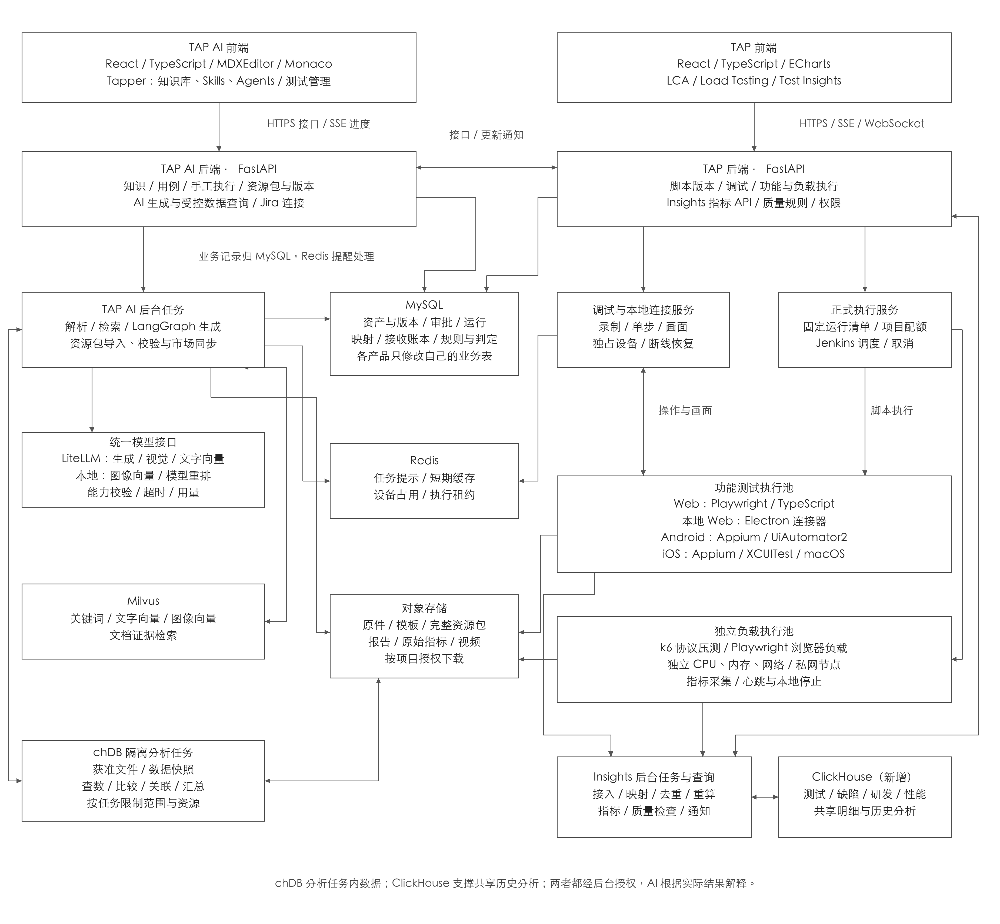

# RFC-011：知识、测试管理、三端自动化、Test Insights 与负载测试

## 摘要

**这套方案要把“看懂需求、设计测试、执行测试、发现问题、跟进改进”连起来。** BA 确认业务规则，QA 设计和验证测试，开发根据证据修复问题，项目负责人据此判断交付风险。AI 帮助查资料、算数据、写草稿和排查问题；业务规则、测试预期和发布决定仍由负责的人确认。

平台提供五项能力：知识问答、测试管理、Web/iOS/Android 自动化、Test Insights（测试与质量分析）、Load Testing（负载测试）。**已有资料、用例、脚本和外部测试报告都可以接入，各能力也可以单独使用。** RAG 只是其中“先找依据，再回答或生成”的方法，不是整个平台的名称。

本文是 `draft` 目标设计。已有基础、需要新增的能力和待验证的条件分别列出；图中的组件不代表已经部署完成。

### 用一个项目看完整过程

以下以“投保系统调整产品费率，并准备发布 Web 和 App 新版本”为例，数值与场景均为说明用的假设。

| 环节 | 谁做什么 | 系统帮助什么 | 留下什么结果 |
| --- | --- | --- | --- |
| 1. 说清改了什么 | BA 提供新旧条款、费率表和流程图，确认产品、渠道、生效日期及本次范围 | 读取文字、表格和图片，标出差异与读不清的地方；问答能回到原件 | 经确认的需求清单和资料版本 |
| 2. 确认数据与规则 | BA/QA 核对费率、适用条件和边界 | chDB 比较新旧费率表、关联产品配置、汇总或查重复；Milvus 找到相关条款 | 可核对的差异明细、原单元格及条款依据 |
| 3. 设计并评审测试 | QA 选择正常、边界、异常场景，BA 复核业务预期 | AI 根据需求清单生成草稿；测试管理保留独立用例和版本，列出覆盖缺口 | 评审后的用例、测试计划和执行安排 |
| 4. 在真实系统中验证 | QA 手工执行，或录制/编辑自动化步骤；开发提供稳定定位和测试环境 | Web 用 Playwright、App 用 Appium 执行；每个平台分别检查操作和结果 | 手工结果、可复用脚本、截图和失败证据 |
| 5. 验证高峰承载能力 | 团队确认目标业务量、响应时间和错误上限 | k6 模拟接口业务量，Playwright 验证浏览器体验；使用独立发压资源 | 实际达到的负载、响应时间、错误和性能结论 |
| 6. 判断风险并改进 | QA/开发处理失败，负责人检查本次发布风险 | ClickHouse 关联历次测试、需求覆盖、缺陷、构建和性能数据；Insights 展示结果，AI 解释证据 | 未验证需求、未修复问题、趋势和按规则计算的质量检查结果 |

例如费率算错时，团队应能从失败截图找到脚本、用例、需求和当时的费率表；修复后重新测试，原失败仍保留。**资料变化也沿这条关系提醒相关用例和脚本重新确认。** 不要求每个需求都自动化，也不要求每个项目都做负载测试。

### 为什么这样分工

| 设计选择 | 要解决的实际问题 | 本方案的处理 |
| --- | --- | --- |
| 从需求生成时，先写清用例 | 文档能说清业务规则，却不能告诉系统当前按钮在哪里 | 用例写清“测什么、怎样算对”；连接真实应用后，再确定操作步骤和定位 |
| 查依据与算数据分开 | 找到几段相关文字，不能证明已经读完十万行表格 | Milvus 找文字/图片证据；chDB 对获准的完整数据做筛选、比较、关联和计算 |
| chDB 与 ClickHouse 配合 | 一次性核对文件与团队反复查历史，数据寿命和资源需求不同 | chDB 在隔离任务内分析文件或结果快照；ClickHouse 提供持续积累、多人共享的分析。两者能力有重叠，这是项目分工，不是工具只能做这些 |
| 保留 MySQL 和对象存储 | 审批、当前运行状态需要及时准确；原件、视频需要完整留存 | MySQL 管业务记录；对象存储放原件与证据；ClickHouse 承担大量历史数据分析 |
| LiteLLM、LangGraph、Jenkins 各管一件事 | 调模型、多步生成、安排测试机器是三种工作 | LiteLLM 统一模型调用；LangGraph 组织多步生成，配合持久化记录支持暂停和继续；Jenkins 安排正式测试，交互调试直接连执行服务 |
| AI 草稿与正式版本分开 | 生成内容可能有误，运行中的内容也不能随编辑变化 | 人工确认后发布固定版本；每次执行记录所用版本，失败和重试分开保留 |
| 功能测试与负载测试分开 | 验证一次操作正确，与验证高峰业务量下仍可用，目标不同 | 功能执行重在操作与检查；负载执行重在业务量、延迟和错误，使用独立资源避免互相干扰 |
| Skills/Agents 保存完整包 | 一套测试方法可能依赖脚本、参考资料和模板，单段提示词不够 | Skill 保存可复用做法及文件；Agent 配置角色和可用工具，复用这些 Skills；运行固定版本 |

chDB 是可嵌入程序的分析引擎；ClickHouse 是可独立部署的分析数据库，二者都支持比上述例子更广的数据分析用途。[chDB 官方说明](https://clickhouse.com/docs/chdb)、[ClickHouse 官方说明](https://clickhouse.com/docs/get-started/about/intro)。具体部署、授权与查询方式见第 3.6 节。

### 本次需要对齐的交付安排

先把一条真实业务流程从资料、用例走到执行证据，再逐步扩展平台和高级能力。第一批交付知识核对、数据查询和测试管理；第二批接真实 Web 自动化与基础 Insights；之后分别完成移动端、完整质量分析和负载测试。Skills/Agents 可并行推进，详见“迁移或发布方式”。团队试点前须先完成共同的身份、项目权限、测试环境和数据准备。

收益用实际项目衡量：BA 核对资料的时间、QA 从需求到可执行测试的时间、生成内容的采纳与修改量、失败定位时间、回归耗时和未覆盖需求。试点前记录基线，试点后按相同范围比较；本文不预先承诺节省比例或交付日期。

**宣讲先读以上三部分，再按业务主流程图展开；具体组件、异常规则和验收细节用于答疑与实施。** 十一张图均有可编辑源文件：[下载 draw.io（十一页）](../assets/rfc-011/2026-09-17-platform-design.drawio)。

## 背景

| 当前实现 | 需要优化 |
| --- | --- |
| PDF/DOCX/MD/TXT 文字解析、结构分段、Milvus 关键词与向量混合检索已有基础 | 补逐页完整性检查、图片/扫描件与 Excel 图形解析、图像检索、模型重排和原文定位，详见第 3.4 节 |
| 测试计划内嵌 BDD 用例、版本与发布校验已有基础 | 补独立用例库、三类模板、业务评审、执行周期、手工结果、数据集和 Jira 协作 |
| Web 自动化以交互原型与模拟运行为主 | 接真实操作录制、界面元素定位、脚本生成、调试和运行记录 |
| 移动端尚未打通完整流程 | 补 App 管理、设备连接与操作、Android/iOS 分别执行 |
| Test Analytics 使用固定示例数据 | 改为真实报告接入、统一指标、失败处理、发布质量检查和五类工程质量分析 |
| 负载测试尚未建立完整领域和执行链 | 新增 k6 协议/Playwright 浏览器负载、专用执行池、全局统计和基线比较 |
| 表格与平台数据尚无统一 AI 查询路径 | 新增 chDB 文件查询及获准的 ClickHouse 指标接口，不让模型自由连接数据库 |
| Skills/Agents 前端只编辑名称、描述和指令，导出单个 Markdown；后端已有版本只读接口 | 扩展完整资源包、文件树编辑、后端草稿、导入、市场同步与运行兼容检查，详见第 3.8 节 |

核对入口：[知识适配器](../../apps/tap-ai-backend/src/tap/modules/knowledge/adapters/litellm.py)、[计划生成器](../../apps/tap-ai-backend/src/tap/modules/test_management/adapters/model_gateway_generation.py)、[自动化原型](../../apps/web/src/legacy/automation/AutomationWorkspace.tsx)、[分析原型](../../apps/web/src/legacy/TestAnalyticsWorkspace.tsx)。当前完成状态仍以 [V2/V3 更正评审](../reviews/2026-09-14-v2-v3-gate-correction.md) 为准。

## 目标

用户上传资料后，可以得到有出处的回答，生成并评审测试计划，管理独立用例与手工执行，把用例变成经真实应用验证的三端脚本或负载场景，再通过 Test Insights 查看结果与改进质量。文档、用例、脚本和运行证据能够相互追溯。

## 非目标

不承诺“上传文档即得到无需核验的可运行脚本”；不让 AI 修改结果检查条件来掩盖失败；不自建通用 Agent 编排平台或商业设备云。Skills/Agents 管理服务于 Tapper，不等同于完整复刻 Claude Code 运行环境或自建公共插件市场。

## 方案

### 1. 业务流程

#### 1.1 主要使用场景

[查看 SVG](../assets/rfc-011/2026-09-17-business-flow.svg)。图中方框表示业务步骤，不代表独立菜单。资料在 Tapper 的知识库中管理，问答在 Tapper 对话中完成；生成计划也可从测试管理直接发起，用户不必先聊天。Test Insights 接收外部测试报告，不要求测试由 TAP 生成。

生成用例前，先从选定资料形成需求清单，由用户确认范围和版本。覆盖率以这份清单为分母，逐条关联用例，不以本轮检索命中的内容作为全部需求。Insights 的问题和资料变化回到需求/用例复核，用于更新和改进测试。

| 场景 | 用户从哪里开始、怎么完成 | 异常或需要人工处理时 |
| --- | --- | --- |
| 新资料入库 | 在 Tapper 工具区打开知识库→上传文档、图片或 Excel→按内容解析→对照原件检查→按项目审核要求发布 | 扫描页、流程箭头、表格和连线分别检查；缺失或不确定内容明确标出，只重试问题部分 |
| 严格知识审核 | 业务人员逐片核对和标注→独立复核→发布批准版本→供正式问答与生成使用 | 未审核、被退回、过期或撤回内容不能进入正式检索；资料更新后重新核对受影响切片 |
| 知识问答 | 在 Tapper 对话中选择知识来源→提问→查看回答及原文；可继续追问，每轮记录所用来源版本 | 没有依据就说明缺少资料；相互矛盾的来源同时列出，不代替用户猜答案 |
| Skills/Agents 导入与编辑 | 在现有技能/智能体入口新建，或从文件夹、ZIP、Git、市场导入→查看文件和兼容情况→编辑与试运行→发布并选择使用 | 缺少依赖或不支持的配置阻止启用受影响资源；草稿不进入正式运行 |
| 市场更新与本地定制 | 检查来源更新→查看文件、配置和权限差异→生成候选版本→验证后切换；需要修改市场资源时创建自定义副本 | 更新失败继续使用旧版；不覆盖自定义修改，运行中任务仍固定原版本 |
| 从资料生成计划 | 从 Tapper 对话或测试管理发起→选资料、平台和范围→确认需求清单→生成→在测试管理编辑并评审发布 | 缺少规则时列出待补问题；未覆盖需求保留在清单中，不能隐藏 |
| 修改或复用已有用例 | 打开已发布版本→复制为草稿→修改→评审新版本 | 原版本及其运行记录保留；不适合自动化的用例可以手工执行，结果通过测试管理系统接入 |
| Web 自动化 | 选用例、网址、测试账号和数据→连接浏览器→录制或 AI 生成步骤→试跑 | 元素找不到或预期结果不清楚时停在该步骤，由用户补充定位或业务规则 |
| Android/iOS 自动化 | 选用例、安装包、设备和系统版本→安装与连接→录制或生成→分别验证 | 包不能安装、权限弹窗或设备离线单独提示；一个平台通过不等于其他平台通过 |
| 调试与发布 | 编辑步骤→执行到指定步骤或完整试跑→检查证据→发布脚本版本 | 试跑失败保存现场；修改后重新验证，不能靠删除检查条件得到通过 |
| 手工执行与 Jira 协作 | 测试管理选定用例版本和配置→分配执行→逐步记录结果、附件与缺陷；Jira 内复用同一资产 | 用例状态、评审状态与执行结果分开；同步冲突、附件缺失和权限不足不能静默忽略 |
| 负载测试 | 确认性能要求→创建 API/浏览器场景→低负载调试→固定负载/门槛/预算→专用节点执行→分析与基线比较 | 目标负载未达、数据未齐、节点失联或超预算明确处理；停止必须确认发压进程已终止 |
| AI 查询表格和指标 | 在 Tapper/Insights 明确资料、日期与口径→受控检索或计算→查看数字与来源 | 不能将相似片段、截断行数、旧指标或一对多关联重复计数当作完整答案 |
| 正式回归与导出 | 选已发布脚本、应用版本、环境、数据和设备→提交运行；也可导出后在兼容环境执行 | 排队、运行、取消、失败分别显示；响应丢失先查原任务，重试保留首次结果 |
| 资料或界面变化 | 资料更新或定位失效→查看受影响用例/脚本→确认适用或修订→复跑 | 未复核内容标为待确认，旧运行结果不计为新版本验证成功 |
| 任务暂停与恢复 | 生成中离页、刷新或等待人工确认→回到原任务继续 | 保存已完成内容；服务重启从保存处恢复，取消后释放设备和后台资源 |
| 外部数据接入 | 连接 CI、测试管理、缺陷或代码质量系统→确认项目与用例对应关系→查看同步结果 | 同一运行多路上报只计一次；关系未确认、附件缺失、数据延迟分别显示 |
| 质量分析与改进 | 筛选项目/版本/平台/时间→查看指标→进入具体运行或缺陷→分配处理→复核改进 | 质量检查未通过或数据不足时说明原因；订阅告警只按用户配置发送 |

#### 1.2 生成、试跑与异常处理

[查看 SVG](../assets/rfc-011/2026-09-17-generation-recovery-flow.svg)。计划与脚本都先形成草稿，再由用户确认发布。生成失败、业务测试失败、设备故障分别处理；任务暂停和取消不会把未完成的内容标为成功。

### 2. 页面与交互

沿用现有导航层级：TAP AI 的产品入口为 **Tapper、测试管理**；知识库位于 Tapper 工具区，与智能体、技能并列。知识问答是 Tapper 的对话能力，不另建入口。TAP 保留自动化工作台，新增 Load Testing 工作区，运行报告统一归入 Test Insights。

| 位置 | 用户操作 | 关键反馈 |
| --- | --- | --- |
| TAP AI → Tapper | 在对话右侧选择知识来源，或通过输入框“从知识库添加”→提问或发起生成 | 共用知识库已有资料；回答带出处；无依据和资料冲突明确提示；保留会话与每轮来源 |
| Tapper 工具区 → 知识库 | 上传、查看、管理资料；在资料详情中核对切片、标注、提交复核和发布 | 原件/切片/审批记录并列；定位问题页、图片区域、单元格；普通模式显示部分可用，严格模式只使用批准版本 |
| Tapper 工具区 → 技能 / 智能体 | 列表中新建、导入或打开市场；详情提供预览、编辑、配置和版本，左侧文件树、右侧文件内容 | 显示来源、版本、依赖和兼容情况；保存草稿与发布分开；脚本、模板及嵌套目录完整保留 |
| TAP AI → 测试管理 | 用例库、计划、评审和执行视图；手工/导入/AI 创建用例，组建周期并记录手工或自动结果 | 用例独立版本，计划与执行固定引用；需求覆盖、评审、结果及 Jira 同步分别可追溯 |
| TAP → 自动化工作台 | 选择用例和平台→连接真实应用→录制或 AI 生成→调试→发布运行 | 左侧步骤、中间应用、右侧配置/证据；支持脚本查看与导出 |
| TAP → Load Testing | 创建场景→调试→配置负载与门槛→运行/停止→报告与基线 | API/浏览器/混合模式明确；独立发压资源，实际负载与数据完整性可见 |
| TAP → Test Insights | 查看质量总览→筛选→查看失败或指标明细→分类处理并跟进 | 保留项目、版本、平台、环境、时间筛选；显示样本数和数据截至时间 |

知识库负责管理资料，Tapper 对话负责使用资料，两者共享来源、版本和引用，不重复上传或建立另一套知识库。测试管理直接生成与 Tapper 对话发起生成使用同一后台流程；对话中的结果链接到同一份计划，继续编辑和评审。当前导航依据：[侧边栏](../../apps/tap-ai-frontend/src/widgets/tap/prototype/PrototypeSidebar.tsx)、[对话与知识库集成](../../apps/tap-ai-frontend/src/widgets/tap/TapProductPrototype.tsx)。

文档更新和修复生成新版本，不覆盖已发布内容。来源变化时，关联需求、用例和脚本标为“待复核”；用户确认继续适用或创建修订，历史运行仍绑定原版本，不能算作新需求已验证。生成任务可离页恢复；缺少数据显示“未接入/不完整”，不能显示假正常。界面复用现有组件，支持键盘操作和文字状态。

### 3. 技术架构

#### 3.1 模块和调用关系

[查看 SVG](../assets/rfc-011/2026-09-17-technical-architecture.svg)。图为目标架构。chDB、ClickHouse、LangGraph、复杂文件处理、图像检索、本地连接器及负载执行均有新增工作；图中没有“新增”标记也不代表已经实现，现状以本文章节及代码核对入口为准。

TAP AI 负责知识、测试管理（含手工执行）和 AI 生成；TAP 负责自动化/负载执行与 Test Insights。两者保留独立前后端，通过接口调用和更新通知交换数据：TAP AI 提交待确认的步骤，并在允许的范围内请求试跑；TAP 返回界面信息、运行状态和证据。沿用两个产品边界，是为了让知识与测试设计可独立使用，执行机器和报告分析也可独立扩展；共用登录与项目对应关系，使用户能沿同一用例跳转。可以共用存储服务，但各自只修改自己负责的表和文件。

| 位置 | 选型 | 用途与决定 |
| --- | --- | --- |
| 前端 | React、TypeScript、Vite、Ant Design；Insights 增加 ECharts | 沿用现有应用，新增真实数据图表，支持点击查看明细 |
| Skills/Agents 编辑 | **MDXEditor + Monaco Editor（新增）**；沿用 Ant Design、react-markdown、rehype-sanitize | 文件树与配置表单；Markdown 可视化编辑；源码与差异查看；按需加载，不引入 docu.md，详见第 3.8 节 |
| 后端 | Python、FastAPI | 沿用；接口处理用户请求，独立后台任务处理耗时工作 |
| 复杂 AI 流程 | **LangGraph（新增）** | 在后台任务中组织生成与修复；先验证一个流程的暂停和恢复，不另建 AI 任务平台 |
| 模型调用 | **统一模型接口 + LiteLLM（沿用）** | 后端统一调用生成、视觉理解与现有文字向量模型；图像向量/重排接专用适配器，统一记录模型、用量和结果 |
| 复杂文件解析 | **PaddleOCR PP-StructureV3 + openpyxl/文件内部 XML + 页面渲染（新增）** | 图片/PDF 识别版面、文字和表格，Excel 同时读取单元格及图形连线；沿用简单文字解析，详见第 3.4 节 |
| 图片理解与检索重排 | **Qwen3-VL-Plus + Qwen3-VL-Embedding-2B / Reranker-2B（新增）** | 分别负责看懂复杂图、检索原图、对候选证据重新排序；输出仍须检查来源与完整性 |
| 知识检索 | **Milvus（沿用并扩展）** | 关键词、文字向量和图像向量共同检索；文字与图像使用分开的索引，查询后融合排序 |
| 任务内数据分析 | **chDB（新增）+ Parquet** | 在 TAP AI 后台计算本次获准文件，例如查询费率表、比较配置版本、核对跨表关系和汇总明细；Excel 先解析成便于计算的表格文件，详见第 3.6 节 |
| 业务数据 | MySQL | 内容版本、知识标注/审批/发布清单、任务、运行状态、问题处理、质量检查结果与操作记录 |
| 任务与缓存 | 现有任务记录、待发送通知 + Redis + 后台任务 | 复用 TAP AI 已有的任务与可靠通知机制；TAP 执行/Insights 后台处理仍需建设，不能把基础机制当成现成功能 |
| 文件证据 | 现有对象存储接口 | 原文、报告、脚本包、日志、截图与视频 |
| 共享历史数据分析 | **ClickHouse（新增，必选）** | 从基础 Insights 阶段接入测试历史，逐步接入覆盖、缺陷、CI、代码质量与性能数据，支持关联、汇总和趋势分析，供多人看板与 AI 查询，详见第 3.6 节 |
| Web 自动化 | Playwright + TypeScript | 定位页面元素、执行操作、检查结果并记录执行过程 |
| 本地录制与调试客户端（图中“本地 Web 连接器”） | **Electron + Playwright（新增）** | 安装在测试人员电脑上，连接 TAP 工作台与本机测试浏览器，录制、调试并访问本机可达的内网站点；使用托管浏览器时无需安装，详见第 5.4 节 |
| 移动自动化 | Appium + WebdriverIO + TypeScript | Android 使用 UiAutomator2，iOS 使用 XCUITest |
| Web 视觉与无障碍 | Playwright 截图比较 + axe-core | 保存人工批准的截图基准、比较阈值和无障碍规则版本，结果独立展示 |
| 协议负载 | **k6 + TypeScript/JavaScript（新增）** | 专用 Linux 压测池；浏览器负载/体验用独立 Playwright 池，不能共享功能测试配额 |
| Jira Cloud 内嵌入口 | **Forge Custom UI + Remote** | 使用现有测试管理 API；校验安装身份和双方项目权限，Data Center 单独 REST 适配 |
| 调度与设备 | Jenkins + 独立调试与执行服务 | Jenkins 安排正式测试；录制、单步调试直接连接调试服务；iOS 使用专用 macOS/Xcode 机器 |

后端服务沿用 Linux/Compose，执行测试的机器独立部署；当前演示只允许本机访问，团队使用前加入统一登录和项目权限。模型密钥和设备访问凭证只在后端管理。

#### 3.2 服务之间传什么

图中的方框是职责划分，不要求每个方框部署为独立服务。接口相当于约定好的交接单：传什么、谁负责、失败后怎么查，都要事先明确。两套后端分别保持模块化应用，耗时工作由各自的后台任务执行。

| 调用方向 | 传递内容与方式 | 关键约束 |
| --- | --- | --- |
| 前端→各自后端 | HTTPS 接口：资料、问题、计划、步骤和运行请求；SSE 持续返回任务进度 | 后端检查当前用户的项目权限；前端不直连数据库或模型供应商 |
| Skills/Agents 前端→资源管理→后台任务 | 完整包、来源地址、固定提交、文件修改和发布请求；返回文件树、兼容报告与版本 | 导入/同步只生成草稿；已发布包不可变，脚本仅在隔离环境显式执行，市场凭证不返回前端 |
| 知识处理→存储/模型 | 原件、页面图片、结构化表格进对象存储；文字/图像索引进 Milvus；版本、解析状态、关系和定位进 MySQL | 按页/区域检查遗漏；严格模式须独立复核批准后发布；替换资料生成新版本，删除后立即停止提供该资料 |
| 问答→知识检索→模型 | 先限定权限与来源→关键词/文字/图像检索及表格/关系查询→融合重排→补齐证据→通过 LiteLLM 生成回答 | 每次扩展上下文均检查权限与版本；回答可定位原页、图片区域或单元格，不能用旧缓存绕过权限 |
| 生成任务→LangGraph→业务模块 | 确认后的需求、检索结果和当前步骤；保存每阶段进度与待确认问题 | 模型只生成草稿；用户评审和正式发布由业务接口处理 |
| TAP AI↔TAP | 带项目、内容版本和请求编号的接口：请求界面信息/试跑，返回步骤草稿、运行状态和证据引用 | TAP 检查可操作的应用与设备；重复请求不重复运行 |
| 调试前端↔调试服务 | WebSocket 传操作和确认，画面通过独立视频/截图通道返回 | 每台设备只允许一个控制者；断线后重新确认界面，过期连接释放设备 |
| 正式执行→Jenkins→执行机器 | 固定脚本包、应用版本、参数和凭证引用；通过结果回传和状态查询取得进度 | 调试直接调用调试服务；正式默认执行固定步骤，只有显式配置的动态 AI 块调用模型且受动作/预算约束；机器只能访问允许的测试环境 |
| 执行/外部来源→Insights | 带来源、项目、用例、运行、重试编号和时间的报告；大文件存对象存储 | 先保存接收记录，再处理和统计；支持重试、补传和重新计算 |
| TAP AI→文件计算 / Insights查询 | 受限查询结构、获准资料/结果快照、固定指标及筛选 | chDB 不持平台数据库凭证；ClickHouse 查询由 TAP 服务授权；结果附计算范围和查询编号 |
| TAP AI 测试管理↔TAP 执行 | 固定用例/周期/实例/脚本/配置/数据行 ID；接收每次尝试与稳定步骤 ID 的结果 | 手工结果归测试管理，技术运行归 TAP；通过事件到 Insights，重复回执不重复计数 |
| 负载执行→采集→Insights | 固定运行/分片/批次编号、实际负载、原始指标或可合并统计量、阶段和健康状态 | 统一测量窗；缺分片/未达负载不通过；停止经执行节点确认 |
| Insights→TAP AI | 已获权限的指标、计算范围、样本数和证据引用 | AI 解释事实与可能原因，不生成权威数字，也不决定质量检查通过 |

#### 3.3 数据存放与部署

| 位置 | 保存什么 | 由谁负责 |
| --- | --- | --- |
| MySQL | 资料/需求/用例/脚本版本、知识切片与标注/审批/发布清单、解析清单、流程节点与关系、证据位置、任务进度、报告接收记录、权限和质量规则 | 两个产品分别维护自己的表；LangGraph 进度保存需通过暂停/恢复验证 |
| MySQL + 对象存储（资源管理） | MySQL 保存 Skills/Agents 来源、版本、依赖、发布状态、文件清单和校验值；对象存储保存完整包及原始文件 | TAP AI；任务固定引用包版本，文件按项目授权读取，不默认送入知识向量索引 |
| Redis | 等待处理的任务提示、短期缓存和设备占用信息 | 后台任务与调试服务；持久业务记录仍在 MySQL |
| 对象存储 | 原件、页面/图片裁剪、结构化表格与解析文件、脚本包、原始报告、日志、截图与视频 | 各产品保存自己的文件；下载时检查权限 |
| Milvus | 文本与关键词索引、独立图像向量索引，以及来源版本和证据编号 | TAP AI 知识模块；可从原件与解析结果重新建立，不混用不同模型的向量 |
| chDB | 任务内的文件、数据快照及计算结果；输入和可追溯输出按规则保存在对象存储，授权与批准记录在 MySQL | TAP AI 的隔离计算任务；按任务准备、计算和清理，不作为多用户主库 |
| ClickHouse | 统一格式的手工/自动化/负载/缺陷/流程/代码质量记录与汇总结果 | TAP Insights；根据来源记录补录、更正和重新统计 |

部署按四类资源理解：**应用服务、存储服务、文件/AI 处理资源、测试执行资源**。Linux/Compose 承载前后端、后台任务及数据服务；ClickHouse 为独立服务，chDB 随隔离计算任务加载，LangGraph 为后台程序使用的库，均不要求安装到用户电脑。OCR、Office 转换及图像模型单独配置处理资源，图像模型的硬件与容量先实测；Web/Android 执行机器独立管理，iOS 使用 macOS/Xcode 机器。本地 Web 录制才需要测试人员安装连接器。设备连接、账号、测试数据准备与清理归执行服务管理，避免上一次运行影响下一次。团队部署使用企业统一登录（OIDC），模型密钥和设备凭证不写入步骤、导出脚本或日志。请求、生成任务和测试运行使用关联编号，便于查明失败发生在哪个环节。

#### 3.4 复杂文件解析与准确检索

例如流程图写着“金额超过限额转人工审批”，只读出两个框的文字还不够，还要读对箭头方向、限额和适用条件。这里分四步：**读出内容 → 对照原件查遗漏 → 按问题找到完整依据 → 回答并指出出处**。OCR 是把图片里的字读出来；图像模型帮助理解图形；检索负责找相关内容；重排负责把最相关的候选证据放在前面。

**先确认文件内容读全，再建立索引；检索时同时考虑文字、图像和结构关系。** 向量只是找到候选资料的一种手段，不能替代原文、表格计算或流程关系检查。本节为确定新增的目标能力，现有演示尚不支持图片、Excel 与 OCR。

[查看 SVG](../assets/rfc-011/2026-09-17-knowledge-processing-retrieval.svg)。上半部分是文件入库，下半部分是用户提问后的检索；沿用 Tapper 与知识库的现有入口。

##### 3.4.1 当前缺口与技术选型

当前 [PDF 解析器](../../apps/tap-ai-backend/src/tap/modules/knowledge/adapters/document_parsers.py)只提取文字：纯图片 PDF 返回 `ocr-required`，混合 PDF 中没有文字的页面会跳过；DOCX 主要提取段落与表格文字。[分段器](../../apps/tap-ai-backend/src/tap/modules/knowledge/adapters/document_chunker.py)保留基本结构，但长表格仍按文字长度切分。[Milvus 调用](../../apps/tap-ai-backend/src/tap/modules/knowledge/adapters/milvus/transport.py)已有关键词/向量检索及排名融合，尚未接入下面的图像索引和模型重排。

| 环节 | 采用的技术 | 分工与边界 |
| --- | --- | --- |
| 原生文字与页面预览 | 沿用 pypdf、python-docx；新增 pypdfium2、LibreOffice 无界面转换 | 简单文字直接读取；PDF 渲染原页，Office 在隔离进程中生成预览；原件不覆盖，转换差异必须标出。[PDF 渲染接口](https://pypdfium2.readthedocs.io/en/stable/python_api.html)、[Office 转换参数](https://help.libreoffice.org/latest/en-US/text/shared/guide/start_parameters.html) |
| 扫描件、版面与表格 | PaddleOCR PP-StructureV3 | 处理旋转、倾斜、阅读顺序、文字位置、表格行列和合并单元格；不把 OCR 文字顺序当作流程箭头方向。[官方能力说明](https://www.paddleocr.ai/main/en/version3.x/pipeline_usage/PP-StructureV3.html) |
| Excel 数据与图形 | openpyxl 只读数据 + OOXML（文件内部 XML）提取图形、连接线和对象位置 | 单元格解析与图形解析分别进行；不能仅靠 openpyxl 宣称图形完整。[openpyxl 限制](https://openpyxl.readthedocs.io/en/stable/tutorial.html)、[Excel 连接线结构](https://learn.microsoft.com/en-us/dotnet/api/documentformat.openxml.drawing.spreadsheet.connectionshape?view=openxml-3.0.1) |
| 复杂图理解 | Qwen3-VL-Plus，经统一模型接口和 LiteLLM 调用 | 输入原图/裁剪、OCR 与原生结构，输出带位置的节点、箭头、条件和疑点；用于复杂区域，不重复识别所有普通文字页。[模型入口](https://qwen.ai/apiplatform)、[LiteLLM 供应商适配](https://docs.litellm.ai/docs/providers/dashscope) |
| 图像检索与统一重排 | Qwen3-VL-Embedding-2B、Qwen3-VL-Reranker-2B | 自部署推理服务，由统一模型接口的专用适配器调用；前者对原页/图块建立向量，后者重新比较问题与候选文字/图片的相关性，不依赖 LiteLLM 未验证的接口兼容性。[Embedding](https://huggingface.co/Qwen/Qwen3-VL-Embedding-2B)、[Reranker](https://huggingface.co/Qwen/Qwen3-VL-Reranker-2B) |
| 文字检索与结构查询 | 沿用 text-embedding-v4、Milvus BM25 + 向量；MySQL 关系记录、chDB 受控表格计算 | 现有文字向量保持 1536 维；新增图像向量使用 2048 维独立索引；表格查数与流程查关系走确定的查询逻辑，不再增加图数据库 |

OCR、Office 转换、图像向量与重排部署在独立处理进程/推理服务，避免阻塞 API；分别固定依赖与模型版本，不强塞进现有 Python 3.13 API 环境。视觉调用设像素、页数、超时和费用上限；解析不执行宏、不刷新外部数据连接。原始图片发送给模型也遵守项目的数据外发权限。

##### 3.4.2 不同文件怎么处理

| 文件情况 | 处理方式 | 必须保留的内容 |
| --- | --- | --- |
| 普通 PDF、Word、Markdown、TXT | 按标题、段落、列表、表格读取；逐页检查是否另有图片或图形，不能“能读到文字就结束” | 章节、阅读顺序、页码/段落位置、表格与图片的关联说明 |
| 纯扫描 PDF、图文混合 PDF、PNG/JPEG 图片 | PDF 逐页渲染；图片旋转/纠偏、版面分析、OCR 和表格识别；与文字层去重，疑难区域再交给视觉模型 | 原页、文字坐标、表格结构、图片区域；某一页无文字不等于空白页 |
| 纯图片流程图、泳道图 | 先看全图，再对小字与交叉线局部放大；识别节点、起终点、方向、分支条件、泳道归属和回路，合并裁剪间的连接 | “节点 A→条件→节点 B”的关系及原图位置；交叉不一定连接，双向箭头和无方向线分别记录；不确定连线不猜测 |
| Excel 数据、复杂表头与跨表引用 | 按工作表读取表区、合并单元格、多级表头、单位、公式、缓存值及引用；保留隐藏行列/工作表的存在并由用户确认检索范围 | 工作表名、单元格范围、表头、公式与值的区别；缓存缺失或可能过期明确标记，不把公式字符串当成计算结果 |
| Excel 里的流程图、关系连线、嵌入图片 | 同时解析单元格、DrawingML 图形/文本框/连接端点及分组坐标，并渲染区域交叉检查；嵌入图片走图片流程 | 原生连接关系优先；只有空间接近而没有端点关系的线交给视觉分析并标为待确认；公式依赖与业务流程箭头分开保存 |

首批新增格式为 PNG/JPEG、扫描 PDF、XLSX 和 CSV；CSV 须确认编码、分隔符、表头和列类型，并保留原始行号。旧版 XLS 先在隔离环境转为 XLSX 并比较转换前后可取得的工作表/对象清单，无法完成清点则标记待复核。转换失败或 SmartArt/OLE 等对象无法完整还原时明确标记，不静默丢弃。超宽 Excel 按表区/图形范围分块渲染，保留全局概览与分块坐标，不把整张表缩成看不清文字的一页，也不只读取打印区域。

##### 3.4.3 怎样发现信息缺失、怎样保存知识

- **建立解析清单。** 清点每页、工作表和可检测的表格/图片/图形，逐项记录“已解析、失败、待确认、用户排除”。检查空白提取、乱码、低清晰度、表头缺失、悬空连线、节点/端点不一致及渲染裁切。模型自报置信度不能单独决定内容可用；自动检查不能证明完全无遗漏，复杂样本仍须人工对照原件。
- **在现有知识库中复核。** 原件与解析结果并排，点击疑点高亮页内区域或单元格。用户可改错字、补分支条件、纠正连线、重试指定区域，修改保存新版本。普通模式下已检查区域可先发布为“部分可用”；严格模式须完成第 3.5 节的独立复核。未确认内容不作为确定答案或测试预期，来源中存在缺口时回答必须提示。
- **按内容结构分段。** 段落带章节；表格按行组拆分并重复多级表头、单位和必要脚注；跨页表先确认续表关系；流程按节点及相邻关系保存，保留完整关系供查询。短摘要用于查找主题，不能代替原表、原图或完整业务规则。
- **同一证据保留多种表示。** 原件/图片/结构化表格放对象存储，状态、定位与关系放 MySQL；OCR 文字、图的描述和关系说明进入文字索引；符合发布范围的原页/图块进入独立图像索引，避免完全依赖可能漏字的 OCR。部分区域获准时使用裁剪或遮罩图，不能将整页未获准像素带入正式检索，详见第 3.5.3 节。每条记录关联来源版本、页码与区域坐标，或工作表与单元格/对象编号；保留“原生提取、模型推断、人工确认”的区别。
- **完整发布与增量更新。** 文件、页/区域和处理配置均记录内容指纹，未变化的内容复用；变更区域重新解析与向量化并重算受影响关系。一个版本的文字、图像、关系索引全部就绪后才切换可见版本；部分可用版本也固定其可见清单，不能混入半写入结果。切换模型、维度或分段规则时重建对应索引后切换，旧引用仍定位旧版原件。

##### 3.4.4 怎样检索得准、响应得快

| 顺序 | 后台处理 | 解决的问题 |
| --- | --- | --- |
| 1. 限定范围 | 先检查项目权限、所选来源与版本；多轮追问只在这些范围内补全指代 | 防止跨项目、跨版本或未选择来源的内容混入 |
| 2. 判断问题需要什么 | 普通问答查文字；流程题查节点/关系；数值汇总、对比与筛选查结构化表格；选中来源含图片时同时查询图像索引 | 不能只凭问题中有没有“图片”二字决定是否检索原图 |
| 3. 多路找候选 | Milvus BM25 保留编号、术语和精确词；文字向量找近义表达；图像向量用同一图像模型编码问题后查询原页/图块 | 中文分词与业务词典需验证；不同向量空间各自搜索，不能直接比较相似度数值 |
| 4. 合并并重新排序 | 沿用排名融合（RRF，按各路名次合并），再用 Reranker 比较问题与候选内容；按证据编号去重，同时保留所选范围内相互冲突的来源/版本 | 排名融合不是模型重排；模型分数只用于相关性排序，不等于事实正确率 |
| 5. 补齐完整证据 | 命中段落后补父章节/相邻段；命中表格补表头、单位和相关行；命中节点后查前后关系与分支条件 | 展开内容仍检查权限/版本；路径过长分段读取，达到数量上限时提示不完整，不臆造后续路径 |
| 6. 核对并回答 | 复杂图用原图裁剪与提取关系共同核对；表格筛选、关联和聚合由第 3.6 节的受控 chDB 任务执行，业务公式用已验证的计算函数，记录完整输入范围与规则；模型根据证据组织回答 | 计算前取全所需行与关联表；缺行、单位冲突、未支持公式或外部引用缺失时不输出完整汇总。数字不能靠相似片段猜，结论可点击原页/图片区域/单元格 |

[Milvus 混合检索](https://milvus.io/docs/multi-vector-search.md)与[全文检索](https://milvus.io/docs/full-text-search.md)是检索基础；表格查询、关系扩展、模型重排和引用核对由 TAP AI 知识模块补齐。图像检索失败须显示能力降级；若问题依赖图片且无可靠文字证据，不能继续给出确定答案。

**性能控制：** 沿用快速/深入两档。先以合并后的候选上限 20/50、重排后的证据上限 10/20 为起点评测；图片候选在同一预算内，每路保留最低名额，避免纯文字挤掉全部图片。深入检索最多拆成 3 个子问题，共享总候选、时间和费用预算；普通问答不启动循环工作流。OCR/向量入库批量执行并限制并发，在线检索与后台解析使用不同队列；原图按需读取，重排批量推理、设置像素和输入长度上限。缓存键包含权限、来源版本、模型和检索配置，资料删除/权限变更立即失效，不能仅按问题文字缓存答案。

长表汇总和完整流程读取不受“前 10/20 条相似片段”限制，改走受权限约束的分批结构查询，并设置独立的行数、节点数与时间上限；超限返回范围不完整。模型只提交允许的筛选/聚合参数，不执行模型临时生成的 Python 代码。

##### 3.4.5 用真实样本验证，而不是只看回答是否流畅

建立至少 100 份代表性文件、200 道人工标注问题的回归集，覆盖扫描/混合 PDF、纯图流程、复杂 Excel、跨页表、中文术语、跨版本冲突、无答案和越权问题；每个重点类型至少 20 道。标注正确证据、预期答案、节点/连线/条件与表格关键值；按文件划分调参集和独立验收集，不能用模型自己的打分代替人工标注。

| 检查项 | 首版验收目标（目标值，尚无实测结果） |
| --- | --- |
| 内容完整性 | 验收集人工标注的页面与关键区域 100% 有解析或明确失败/待确认记录，不能静默消失；文字错误率单独报告 |
| 表格与流程 | 关键单元格的值、单位、表头对应正确率 ≥98%；流程连线的起点、终点、方向、条件全部正确才计为正确，精确率和召回率均 ≥95% |
| 候选是否找到正确依据 | 深入检索前 50 个候选覆盖 ≥95% 的人工标注证据（Recall@50）；重排后前 10 个覆盖 ≥90%，分文件类型统计并检查多证据问题 |
| 答案与引用 | 人工判定答案正确且证据充分的比例 ≥90%；实际引用定位正确率 ≥98%；无答案/资料冲突正确提示率 ≥95%；未知关键条件不生成确定测试预期 |
| 权限与更新 | 验收集中越权命中为 0；删除、权限撤销和版本切换后无过期证据泄漏；旧会话引用按当前访问权限读取 |
| 速度与成本 | 在固定硬件、10 万文本块/1 万图块、10 个并发查询下，普通检索 P95 ≤3 秒、含图检索 P95 ≤8 秒（均含重排，不含回答生成与额外视觉核对）；同时报告完整响应 P95、超时率、每页解析与每问成本 |

每次调整解析器、向量模型、分段或重排，均对比“现有混合检索”“加模型重排”“再加图像与结构查询”的同一套样本，分别定位漏解析、未召回、排序差或回答错。未达标的文件类型不能标为完整支持；低质量原件提供局部重传/人工补充路径，并将用户纠错加入后续回归集。

##### 3.4.6 对现有实现的改造位置

| 现有位置 | 必要改造 |
| --- | --- |
| 文件类型校验、解析器和解析后台进程 | 接受新增格式，增加按页/对象清单、OCR/Excel/视觉处理及局部重试；保留现有资源与超时限制 |
| 内容分段、索引发布与 MySQL 记录 | 保存结构化表格、关系、区域坐标与审核状态；增加图像索引及同一版本的完整发布 |
| 检索编排与 Milvus 适配器 | 从现有单一文字索引扩展到文字/图像独立查询、融合重排、表格计算与关系扩展；保留每一路的来源和权限约束 |
| 引用校验、接口契约与前端引用查看器 | 在现有文字偏移之外增加页内区域、单元格范围和图形对象定位；模型描述标为提取结果，不能伪装成原文引句；同步 `contracts/` 和生成类型 |
| Tapper 工具区知识库 | 在现有资料详情中增加解析清单、原件对照、纠错与局部重试；Tapper 回答中展示部分可用状态及图表引用，不新增顶层入口 |

#### 3.5 高准确性场景：知识切片的人工核对与发布

审核强度按项目风险配置：普通资料由负责人检查后发布；关键金额、适用条件等需要更严格把关。知识审核确认“系统是否读对资料”，用例评审确认“测试是否设计正确”，脚本试跑确认“操作是否能执行”，三者分别留下记录。金融保险等要求严格核对的项目启用**严格审核模式**：`解析草稿→人工核对和标注→独立复核→建立正式索引→发布→正式检索`。审批后仍需抽检和纠错；AI 可以提出标注建议，不能替人批准。

##### 3.5.1 审核什么、在哪里审核

业务切片按“完整条款、表格规则、流程分支”组织，不为了凑固定字数拆掉条件和例外。审阅人可合并/拆分切片、补标题、纠正 OCR、标出适用条件和来源范围；一个切片可以关联多页、多单元格及多条连线。下游检索可再拆小块，但每块都必须绑定已批准的业务切片及原件位置，补齐条件后才能用于生成。

| 现有知识库内的位置 | 操作与反馈 |
| --- | --- |
| 资料列表 / 待我审核 | 显示待核对、待复核、已发布、需重审及负责人；可按产品、资料版本、关键字段和问题筛选 |
| 左侧原件 | 原文页、流程图或工作表；点击切片或字段时高亮对应区域，支持放大和跨页对照 |
| 中间切片 | 显示提取原文与修订内容的差异；支持合并/拆分、表头修正、连接端点纠正，补充说明与原文分开保存 |
| 右侧核对与标注 | 产品/地区/渠道、有效期、术语、前提、例外、金额/币种/单位、比例、期间、边界条件与公式；关键项逐项确认，缺来源不能批准 |
| 底部提交与复核 | 保存草稿、提交复核、退回并说明原因、批准当前版本；同时显示未处理问题和受影响的用例/脚本，不以“全选通过”代替关键规则核对 |

例如核对“等待期 90 天”，还需同时确认产品版本、适用责任、起算日期、自然日/工作日、例外以及边界当天如何处理；原件未写明的内容标记“待澄清”，不能靠模型补齐。表格的数值、币种、单位、表头和脚注一起核对；流程的节点文字、方向、条件及例外路径一起核对。人工新增的解释必须注明作者和依据，不能伪装成原文条款。

##### 3.5.2 角色、状态与版本

| 环节 | 规则 |
| --- | --- |
| 编校 | 资料负责人或业务专家核对切片，处理全部阻断问题后提交；可分配不同章节，但保留交叉条款依赖 |
| 独立复核 | 复核人不得参与当前版本的编校，包括最后一次编辑；复核完整差异、关键字段和关联条件，批准或退回；管理员不能绕过这个条件直接发布 |
| 发布 | 项目发布人选择已批准且索引已就绪的版本；可由复核人兼任发布人，但不能破坏编校与复核分离。严格模式不自动发布“解析成功”的草稿 |
| 状态 | 草稿→待核对→待复核→已批准→已发布；退回进入待核对；修改、到期、撤回分别产生需重审、已过期、已撤回状态并记录原因 |
| 批准绑定 | 批准绑定切片版本、内容指纹、原件版本与位置、关键标注、依赖条款、审核人和时间；界面提交带版本号，过期页面的审批请求被拒绝 |
| 变更影响 | 修改原文、切片、公式、连线、适用范围或关键标注会使相关批准失效；相邻条件和跨表依赖一并检查。仅重新计算相同内容的向量可复用批准；模型生成的新描述或分段造成语义变化必须重审 |
| 时效与撤回 | 同时保存系统版本与业务生效/失效时间；查询明确“按哪个日期/产品版本”。正式默认使用当前有效批准版，历史查询须明确选择且有权限；被撤回内容不能作为新生成依据 |

严格模式的发布范围必须先确认，缺失的关键条款、例外和跨表依赖会阻断该范围发布；不因其他切片已审核就宣称整份资料可用。普通模式与严格模式在项目级配置，降低审核要求必须有权限并留下变更记录，不能在一次问答中临时绕过。

##### 3.5.3 如何防止未审核内容混入生成

MySQL 保存切片、字段标注、问题、审批记录、关系依赖和发布清单；对象存储保存不可变原件与修订对照。待审内容与正式检索范围隔离，只有发布任务能把批准版本加入正式清单；Milvus 查询同时限定项目、来源版本、审核状态和有效期，返回后再次对照 MySQL 当前发布清单。父段落补齐、图像检索、关系扩展、表格计算和缓存命中都执行同样检查，不能通过“补上下文”带入草稿。

**图像按实际包含的区域授权。** 整页图像只有在所含区域及依赖全部获准时才能用于正式检索；同页混有未审、过期或撤回区域时，生成仅含获准区域的裁剪/遮罩图，再生成图像向量、描述并用于重排或视觉核对，不能只过滤证据编号而继续向模型发送整页。每张派生图绑定区域、依赖和版本；任一区域撤回或变更，使关联派生图、描述、向量及缓存失效，重新生成后方可使用。裁剪造成关键条件或连线缺失时，阻断该证据的正式使用。

发布前冻结清单、写入并验证全部索引，再切换 MySQL 可见版本；撤回先停止授权读取并使缓存失效，再清理索引。正在生成的回答在交付前再次检查所用版本；如依据已撤回或失效，停止交付并提示重新生成。草稿检索仅供有权限的审核人预览，页面明确标记“审核预览”，结果不能直接发布为正式用例或脚本。

金额、费率、日期和期间优先由已核对的结构化字段与公式计算，并核对单位、精度和舍入方式；规则不完整或冲突时停止给出确定结论。严格项目可指定必须复核的生成内容类型：生成后先标“待业务复核”，批准前不能正式发布或用于执行，知识审核与生成结果审核分别记录。

每次回答、计划、用例和自动化检查条件记录所用切片版本、原件位置、模型及生成配置。资料变更后列出受影响内容并标为待复核；历史结果保留，不覆盖原审批记录。审核任务用现有任务记录和 MySQL 状态流转实现，等待人工不占用后台处理程序，也无需单独引入审批平台。

##### 3.5.4 怎样衡量准确性和采纳率

审核完成率与知识正确率分别统计。严格模式要求发布范围内的关键规则逐项核对、独立复核及来源定位全部完成；验收集中的已发布关键金额、比例、日期、单位、适用条件和例外不得存在已知错误。仍保留抽检、投诉纠错、紧急撤回和重新生成流程，不能把“有人点过批准”当作永远正确。

生成内容按实际评审对象记录“原样采纳、修改后采纳、拒绝、待评审”。原样采纳率＝原样采纳数/已评审数，总采纳率＝（原样采纳数＋修改后采纳数）/已评审数；已评审数只含前三类，待评审单独展示。同一对象以最终评审结果计数，按回答、用例、脚本分别统计，并展示样本量、资料/模型版本和时间范围，不能混算来抬高指标。

拒绝或修改要区分“原件缺失、解析错误、切片缺上下文、检索错误、生成错误、业务规则变化、表达偏好”。用户纠错先进入知识修订草稿，核对通过后才能成为正式知识；被采纳的生成内容、脚本试跑通过或较高采纳率都不能自动证明原知识正确。发布前回归至少覆盖自审拦截、并发编辑、条件被拆开、索引半发布、撤回时正在生成、过期缓存、公式/关系依赖失效和历史日期查询。

#### 3.6 AI 查文档、查表格与查测试数据

**chDB 负责一次任务中的数据分析；ClickHouse 负责持续积累、供团队共享的数据分析。** 在本项目中，前者处理获准文件和数据快照，后者先接入测试、需求覆盖、缺陷、研发流程、代码质量及性能历史。 两者都是通用的数据分析工具，不限于用例计数或通过率。以下是本项目的职责划分，AI 根据实际查询结果组织回答。

| 对比项 | chDB：任务内数据分析 | ClickHouse：共享历史数据分析 |
| --- | --- | --- |
| 是什么 | 可嵌入程序的分析引擎，使用 ClickHouse 技术；本设计作为后台任务调用的程序库 | 独立运行的分析数据库服务，适合大量记录的统计与汇总 |
| 在哪里运行 | TAP AI 服务器的隔离任务内；“嵌入式”不表示安装在用户电脑上 | TAP 服务端，供 Test Insights 及获准的数据查询接口访问 |
| 处理什么数据 | 本次选择的文件表格、已经获准的平台查询结果快照；Excel 先解析、核对，再转换为 Parquet（便于批量计算的表格文件格式） | 持续接入的手工/自动化测试结果、缺陷状态变化、代码质量与压测指标，保留跨项目、版本及时间的历史 |
| 具体用途 | 查询费率/配置、比较新旧版本、核对跨表关系、统计金额与重复记录；用例计数只是其中一个例子 | 分析测试稳定性、需求覆盖、缺陷修复周期、CI 效率、代码质量和压测趋势，支持跨来源与版本对比 |
| 数据如何保留 | 原件和获准表格保存在对象存储；任务临时文件用完清理，计算结果和来源记录按项目政策保存，不建设另一份长期共享指标库 | 测试明细及汇总按保留政策持续保存，供多人反复筛选、钻取、比较和重算 |
| 用户如何使用 | 上传或选择资料后直接提问，无需手工选择数据库或写查询语句 | 在 Test Insights 查看图表，或向 AI 询问历史测试数据；二者使用同一指标定义 |

两条典型数据路径：

- **文件查数：** 上传 Excel → 解析与核对 → 形成获准表格文件 → chDB 筛选、计数或比较差异 → AI 解释并引用原单元格。
- **测试分析：** 执行报告持续回传 → 校验、对应与去重 → ClickHouse 保存和统计 → Test Insights 看板或 AI 返回指标与运行依据。

**chDB 可以解决哪些问题：** 文件可以来自知识库或当前对话，包括 Excel、CSV，以及从 PDF 等资料中正确提取并核对的表格；复杂公式仍由已验证的计算函数处理。

| 用户提供的数据 | 用户的问题 | 查询与计算结果 |
| --- | --- | --- |
| 保险费率表 | “35 岁、保额 50 万，对应哪条费率？” | 按产品、年龄区间和保额匹配记录，返回费率及原始单元格；条件缺失或匹配多条时先澄清 |
| 新旧两版产品配置表 | “哪些限额和费率发生了变化？” | 按产品编号比较，列出新增、删除及修改前后的值 |
| 需求表和测试用例表 | “哪些需求没有对应的用例？” | 按已确认的需求编号关联，列出未匹配项；仅代表所选文件中的映射情况 |
| 交易明细 | “各渠道总金额是多少？哪些流水号重复？” | 按明确币种、金额单位和重复规则，返回汇总及对应明细 |

它的价值是让 AI 对完整数据准确查数、比较和关联，而不是让模型从少量检索片段猜答案。文件解析负责读对数据，人工审核负责确认数据，chDB 负责计算，AI 负责解释。

**ClickHouse 可以解决哪些问题：** 接收经授权、统一标识和校验后的持续数据，供 Test Insights 看板、质量规则和 AI 查询共同使用。

| 平台积累的数据 | 用户的问题 | 查询与分析结果 |
| --- | --- | --- |
| 多次测试执行及重试记录 | “哪些用例经常首次失败、重试又通过？” | 按版本和环境统计波动情况，列出运行证据；不能仅据此断言失败原因 |
| 需求、用例关系和执行快照 | “这个版本还有哪些需求没有测试覆盖或没有执行结果？” | 按统一编号关联，列出覆盖与执行缺口；未建立映射的记录单独提示 |
| Jira 缺陷状态变化 | “高优先级缺陷平均多久修好？积压是否在增加？” | 按约定起止状态计算修复时长，展示数量和趋势；无历史的数据不补造 |
| CI 作业与代码质量快照 | “构建耗时是否变长？覆盖率和严重问题数如何变化？” | 按项目、分支、版本和时间展示趋势，支持定位对应构建 |
| 负载测试请求与事务指标 | “同样压力下，新版本是否更慢？” | 对比延迟分位数、吞吐量和错误率，同时显示负载与环境条件 |

ClickHouse 提供统计与关联能力；指标定义、数据接入、权限和原因判断由平台服务及分析流程负责。它也能处理业务数据和文件，但本设计不因此新增通用经营分析产品；新增长期数据来源须先明确用途、权限、指标和保留规则。

以下两个例子分别说明“完整数据计算”和“跨来源分析”。输入均为已核对的假设数据。

**chDB 实例：核对新旧费率，而不只是数用例。** BA 选择两份 Excel，并确认按产品编号、渠道和年龄段匹配，费率单位均为“元/每万元保额”：

| 产品 / 渠道 / 年龄段 | 旧版费率 | 新版费率 | chDB 计算的差额（新－旧） |
| --- | --- | --- | --- |
| A / 线上 / 30–39 岁 | 120 | 135 | +15 |
| A / 柜面 / 30–39 岁 | 150 | 150 | 0 |
| B / 线上 / 30–39 岁 | 200 | 180 | −20 |

用户问“哪些费率变了，相关测试要检查什么？”chDB 返回 A 线上增加 15、B 线上减少 20，并列出两份文件的单元格；知识检索再找生效日期及适用条款；AI 据此提出测试草稿，QA/BA 确认预期。相同方法也可核对交易账单、找重复流水、比较配置、关联需求与用例。计算范围内缺表、匹配多条或单位不一致时先处理疑点；十万行表也按完整范围计算，超限明确报错。

**ClickHouse 实例：把测试、缺陷和效率放在一起看。** 假设两个版本在相同环境、同一组 100 个用例下得到以下历史快照；通过率只取首次已完成的执行：

| 指标 | 上一版本 | 当前版本 | 数据来自哪里 |
| --- | --- | --- | --- |
| 首次通过数 / 已完成数 | 90 / 100 | 95 / 100 | 测试执行报告 |
| 发布检查时仍未解决的高优先级缺陷 | 1 | 3 | Jira 状态历史与版本映射 |
| 一轮回归总耗时 | 80 分钟 | 100 分钟 | 运行起止记录 |

用户问“当前版本质量是不是更好了？”ClickHouse 按统一规则计算：首次通过率从 90% 到 95%，但未解决的高优先级缺陷多了 2 个，回归多花了 20 分钟。Insights 展示三项结果及明细，AI 解释“有改善也有风险”，项目负责人按发布要求判断。还可以继续关联需求覆盖、代码质量和性能趋势；缺少某类来源就明确显示缺数据。数据库负责查数，指标规则由平台定义，业务结论需要结合证据判断。

**为什么本设计保留两者：** 准确查询与计算是必要能力，chDB 是实现选择，并非 RAG 必备组件。ClickHouse 也能分析文件；选择 chDB 是为了让临时文件计算在独立任务内运行，分别限制资源、权限和生命周期，一次性资料无需全部装入平台指标库。平台历史数据则统一留在 ClickHouse，方便多人查询和复用指标。两者不是主从同步，也不要求每个问题都依次调用：只查文件用 chDB，只查平台指标用 ClickHouse，需要文件与平台数据对照时才关联授权结果快照。该选择复用 ClickHouse 的查询技术，本项目不再增加 DuckDB；兼容版本和查询子集仍须实测。

**与现有存储的区别：** MySQL 保存用例、审批、版本和任务当前状态；Milvus 找相关文字/图片证据；chDB/ClickHouse 负责对完整获准数据查数与计算。两者不能补回 OCR 漏字或替代人工核对，也不是向量数据库。

依据：[chDB 官方说明](https://clickhouse.com/docs/chdb)、[chDB 查询 Parquet](https://clickhouse.com/docs/chdb/guides/querying-parquet)、[ClickHouse 官方介绍](https://clickhouse.com/docs/get-started/about/intro)。以上为本项目部署与使用方式，不代表 chDB 只能临时使用或 ClickHouse 只能存测试数据。

##### 3.6.1 用户不用选择数据库

资料有两种使用方式：**对话临时分析** 使用当前用户有权且明确选定的文件，先核对解析结果，答案标明“本次分析”，不自动变为团队正式知识；**正式知识问答和测试生成** 使用项目发布范围，严格项目须先独立复核。临时上传不能绕过正式发布要求。

Tapper 和 Insights 的提问入口先显示本次范围：项目、资料版本、日期、应用版本及指标口径。后台按问题分流，回答统一附证据；遇到“本月”“通过率”“金额”等歧义先明确时区、分母、币种等条件。

| 用户问题 | 实际查询路径 |
| --- | --- |
| “这份条款有哪些免责条件？” | Milvus 文字/图像检索→取回已批准原文、表头或流程关系→生成带引用回答 |
| “这两份 Excel 各渠道保费总额相差多少？” | 读取获准表格版本→chDB 按确认字段筛选、关联与聚合→返回差异、单位、行数及原单元格定位 |
| “过去 30 天哪个版本首次失败最多？” | Insights 已定义的首次结果指标→ClickHouse→返回分母、时间范围、数据截至时间与运行明细 |
| “本次上传的高风险需求中，哪些没有回归证据？” | 已核对需求表→按稳定需求/用例 ID 查询 Insights 覆盖事实→chDB 关联→区分未覆盖、未映射和数据未齐；禁止仅按标题相同自动合并 |
| “这个执行任务现在是否取消？” | 查询所属业务服务的当前状态；不能以可能延迟的 ClickHouse 副本判定操作是否已完成 |

##### 3.6.2 后端怎么实现

- **先准备可计算的资料。** 沿用第 3.4、3.5 节解析与审核；把有效表头、类型、单位、公式结果及来源行编号固化为 Parquet，保存原件版本、工作表/单元格映射及内容指纹；同步建立经核对的数据说明，列明业务名称/别名、字段含义、单位、主键和允许关联关系，模型不能自行猜测关联键。Excel 的样式、图形和连线继续保留在原解析结果中，不能因转成表格而丢失。chDB 不执行 Excel 宏或替代完整公式引擎。
- **增加统一数据查询模块。** TAP AI 负责理解问题、检索证据和文件查询；通过 TAP Insights 的接口请求获准指标，不能直连或改写 TAP 数据库。模型只提交结构化的来源、字段、筛选、分组、聚合和排序；后端从允许的查询模板生成参数化 SQL，不执行模型任意生成的 SQL/Python。已有指标必须复用指标目录，不另算一个同名“通过率”；不启用 chDB 自带的直接问答执行入口，模型调用继续经过统一模型接口和 LiteLLM。
- **文件计算放隔离任务。** chDB 在受资源限制的独立进程/容器中运行；后端先核验权限，按用途检查发布状态，只提取本次获准的行与列生成快照；正式生成限已发布范围，临时分析限当前会话授权范围，不能整本夹带未批准或无权访问的工作表；只挂载本任务的只读数据，禁用外部网络和额外凭证，不允许任意文件路径、URL、远程表函数、系统表或自定义函数。任务结束删除临时文件；不在 FastAPI 请求进程里加载用户查询。
- **平台查询受服务端约束。** ClickHouse 使用只读身份、按项目授权的视图/行策略和固定查询限额；项目范围由服务端身份确定，不信任模型传来的项目编号。限制扫描行/字节、内存、并发、输出和耗时；超限报错，不将中断后的部分计数当总数。chDB 没有自动继承服务器权限，数据送入前必须重新裁定。
- **跨来源先缩小再关联。** 大规模历史筛选和聚合留在 ClickHouse；经权限检查的结果快照才交 chDB，与文件按明确 ID/时间口径关联。记录双方快照及映射版本。超过任务预算转后台完整计算或提示缩小范围，不能截取前几千行后给出“全部”的结论；不同步的数据明确显示各自截至时间。
- **数字与依据分开保存。** 金额和费率使用确认的 Decimal 精度、单位及舍入规则；日期保存时区，空值不默认当零，去重键和关联基数明确，防止一对多关联放大金额。结果保留查询编号、批准资料版本、指标版本、筛选、扫描行数、映射关系与计算结果；模型负责说明，不能改写计算值。展示前再次检查权限及资料撤回状态。

chDB 与 ClickHouse 同源不代表各版本在空值、Decimal、时间和函数支持上完全一致，必须固定并验证使用的子集。[ClickHouse Decimal](https://clickhouse.com/docs/reference/data-types/decimal)、[查询资源限制](https://clickhouse.com/docs/concepts/features/configuration/settings/query-complexity)、[行访问策略](https://clickhouse.com/docs/reference/statements/create/row-policy)。本设计将受控查询结构、文件范围检查和进程隔离组合使用；数据库只读配置不替代这些应用层限制。

##### 3.6.3 怎么证明有效

用同一套人工核对的数据对比“只检索片段”和“检索＋结构查询”：跨表汇总、重复行、一对多关联、空值、金额舍入、跨时区、旧版本、缺失映射、越权与撤回。数值计算在已声明类型/舍入规则下与核对结果一致，聚合可回溯完整输入范围；首轮按 10 万/100 万行和 1/5 个并发记录耗时、内存及拒绝超限的行为，不预先宣称快多少倍。在现有 Python 3.13/Linux 任务环境中验证固定安装包、取消与资源回收；chDB/ClickHouse 兼容性、查询范围和权限用真实引擎验证，不能仅让模型自评答案。

#### 3.7 模型、流程与分析的分工

**LiteLLM：放在后端业务服务与模型之间。** 调用顺序为 `后端接口或后台任务 → 统一模型接口 → LiteLLM → 模型`。文档入库时生成文本向量；检索前生成问题向量；检索后生成回答；生成计划、脚本草稿和分析解释时也通过它。解析、检索、执行和质量检查由对应业务模块负责。

统一模型接口负责检查允许使用的能力、输入输出和调用记录；LiteLLM 负责连接生成、视觉理解及现有文字向量模型供应商。新增的自部署图像向量与重排服务通过专用适配器调用，也由统一模型接口记录，不强制绕行 LiteLLM；OCR/文件解析由解析服务执行。重试次数、超时和费用上限由统一模型接口控制，LiteLLM 不重复进行自动重试。

**LangGraph：局部引入复杂生成流程。** 首先用于两条流程：

- 测试计划：需求清单确认→分批检索→生成用例→按清单检查覆盖→补齐遗漏→人工评审。
- 自动化：查看界面→生成自动化步骤定义→检查→试跑→分析失败→在次数限制内修正。

Insights 需要多步调查问题时也可使用 LangGraph；普通问答、文档处理、固定脚本执行与指标计算继续走现有流程。任务管理负责排队、开始和结束；LangGraph 负责步骤顺序、条件判断、暂停和继续；MySQL 保存业务内容及版本。

现有后台程序每次领取计划生成任务的有效期是 60 秒。引入多步骤流程后，要分段执行：运行时定期确认仍在处理，并遵守总时限；等待人工或外部结果时，把已完成步骤和进度保存到数据库，让后台程序处理其他任务，收到回复后继续。一个任务同一时间只允许一个程序处理；恢复前检查原请求是否已执行，防止重复运行或发布。先验证进度保存、超时、取消和恢复，再扩展其他流程，并限制修复次数与总费用。

例如生成计划已经完成一半，接着要等 BA 确认规则：LangGraph 记录停在哪一步、使用哪些输入；业务服务记录谁能确认；后台任务释放计算资源，确认后再继续。**接入 LangGraph 本身不等于已经实现重启恢复。** 必须接持久化检查点（保存每一步状态的记录），并核对外部试跑是否已经发生，防止恢复时重复执行。[LangGraph 持久化说明](https://docs.langchain.com/oss/python/langgraph/persistence)

本项目优先验证与现有 MySQL 配合的检查点适配；适配器来源、兼容版本、并发与恢复可靠性是实施前验证项，不能仅保存一个任务状态字段就算完成，也不在本 RFC 中默认为此新增 PostgreSQL。ClickHouse 的职责、示例与查询路径统一见第 3.6 节。

#### 3.8 Skills 与 Agents：完整资源包、编辑与市场同步

例如团队有一套“保险条款测试设计方法”，包括检查清单、样例用例和数据核对脚本：**Skill 把做法和这些文件一起保存；Agent 定义负责的任务、可用工具和所用 Skills。** 项目可以复用同一套方法，再按需要创建自己的版本。它们是可复用的工作方法与配置，不等同于模型本身，也不保证模型每次输出正确。

编辑时，业务人员用可视化 Markdown 编辑器写说明，开发用源码编辑器改脚本和配置；预览只显示内容。选用 MDXEditor、Monaco 和现有 react-markdown，文件、权限、版本与执行由 TAP AI 管理，不引入 docu.md 或另一套文档平台。

当前 [CatalogWorkspace](../../apps/tap-ai-frontend/src/widgets/tap/prototype/CatalogWorkspace.tsx) 的草稿只有名称、描述、指令，持久化模式下自定义草稿仍保存在浏览器；[catalogMarkdown](../../apps/tap-ai-frontend/src/widgets/tap/prototype/catalogMarkdown.ts) 只导出单个 Markdown。[后端资源接口](../../apps/tap-ai-backend/src/tap/interfaces/http/routes/ai_assets.py) 已有已批准 Agent/Skill 版本的只读查询，应在现有版本机制上扩展，不能把替换编辑器当作完整资源管理已交付。

[查看 SVG](../assets/rfc-011/2026-09-17-skills-agents-management.svg)。上方是导入到使用的业务流程，下方是现有应用内的技术分工；方框不表示新增独立服务。

##### 3.8.1 管理什么、如何导入

| 对象 | 保存和处理方式 |
| --- | --- |
| Skill | 以含 `SKILL.md` 的完整目录为单位，保留 `scripts/`、`references/`、`assets/`、`templates/` 及其他嵌套文件、相对路径和许可证；单文件 Skill 也是合法输入 |
| Agent | 保存原始配置与指令，按来源格式映射模型、工具权限和关联 Skills；关联固定 Skill 版本，不能把不同平台的 Agent 格式当成统一标准 |
| 插件包 | 保存多个 Skills、Agents、共享脚本、插件清单及其他文件；通过清单和受限目录识别资源。资源可分别启用，但保留包级路径与依赖，不能只复制选中的 `SKILL.md` |
| 市场来源 | 支持 Git 仓库与 Claude marketplace 格式；分别保存市场目录版本、插件来源/实际提交、依赖锁定清单及文件校验值，不把市场目录提交当作插件版本，也不把市场当作统一的通用 API |

导入入口为“上传文件/文件夹或 ZIP”“从 Git 导入”“从市场安装”。流程统一为：**选择来源 → 识别完整文件与依赖 → 显示兼容报告 → 保存草稿 → 编辑和试运行 → 发布启用**。私有来源使用后端凭证引用；远程拉取限制来源、重定向、大小及超时，不执行仓库安装脚本。可选择包内资源，但跨资源引用须解析到固定版本；引用不明、依赖缺失、循环依赖或名称冲突必须在启用前处理。

导入先保留原始内容，再形成 Tapper 可执行配置；不支持的字段不得静默删除。兼容报告区分“可用、待配置、不支持”：Claude 专属工具、模型名称、Hooks、MCP 和环境变量分别检查。首批支持标准 Skill 及可映射的 Agent；Hooks 和插件自带 MCP 仅保存并显示未适配，不随安装自动启用，依赖它们的资源不得宣称可运行。Superpowers 按完整包识别，并逐项标记能力，不承诺复制目录即可完整复现其宿主行为。

格式依据：[Agent Skills 规范](https://agentskills.io/specification)、[Claude 插件结构](https://code.claude.com/docs/en/plugins-reference)、[Claude Agents](https://code.claude.com/docs/en/sub-agents)、[市场清单](https://code.claude.com/docs/en/plugin-marketplaces)、[Superpowers](https://github.com/obra/superpowers)。

##### 3.8.2 预览与编辑的明确选型

沿用 Tapper 工具区的“技能、智能体”列表，增加新建、导入、市场入口及来源/版本/兼容状态。详情提供“预览、编辑、配置、版本”；编辑采用**左侧文件树、右侧内容、顶部保存草稿/试运行/发布**。市场资源默认只读，定制时创建副本；内置资源同样不直接覆盖。

| 内容 | 组件与交互 |
| --- | --- |
| Markdown | **MDXEditor** 可视化编辑；切换到 **Monaco Editor** 编辑源码或比较版本。两种视图共享同一份 Markdown，不另存一份富文本作为正式内容 |
| 指令与配置 | Ant Design 表单编辑名称、描述及支持的 Agent 配置；与源文件同步，未知字段保留，表单修改不能重建并丢弃原 front matter |
| 脚本、JSON、YAML | **Monaco Editor** 提供源码、语法高亮与差异查看；校验结果由后端返回，不把高亮正常当作脚本可执行 |
| Markdown 预览 | 沿用 **react-markdown + rehype-sanitize**，补充 GFM 表格、代码高亮和隔离的 Mermaid 渲染；包内图片与链接按路径及权限读取 |
| 图片、Office 模板与其他文件 | 图片可预览；Office 复用受控预览能力，未支持格式提供文件信息、替换与下载，不把二进制模板转成 Markdown 编辑 |
| 文件树与版本 | Ant Design Tree；新增、上传、重命名、移动、删除，操作后检查可识别引用；显示整个包的文件增删改及权限/依赖变化，支持完整 ZIP 导出 |

Markdown 中不支持的扩展语法转到源码模式，禁止静默丢失；未知文件原样保留，未修改文件保持字节一致。导入内容不执行 MDX/JSX、原始 HTML 或脚本；Mermaid 禁用可执行交互和外部资源。编辑器按需加载，源码编辑面向桌面浏览器；移动端保留预览、下载及简单配置，不承诺 Monaco 移动编辑。自动保存显示已保存/失败，采用草稿版本号防止多人覆盖；冲突时比较后再保存。

选型依据：[MDXEditor](https://mdxeditor.dev/editor/docs/overview)、[源码与差异视图](https://mdxeditor.dev/editor/docs/diff-source)、[Markdown 解析错误处理](https://mdxeditor.dev/editor/docs/error-handling)、[Monaco Editor](https://github.com/microsoft/monaco-editor)。本方案统一用 Monaco 处理文件源码和差异，不再启用 MDXEditor 内置的另一套源码编辑视图。

##### 3.8.3 版本、同步与执行

| 环节 | 确定规则 |
| --- | --- |
| 草稿与发布 | 后端保存草稿；试运行绑定草稿快照，文件或执行配置变更使原验证失效。通过校验和项目发布权限检查后生成不可变包版本，再启用；任务绑定包、Agent、Skill 及依赖版本，不读取运行中变化的“最新文件” |
| 市场同步 | 手动或按项目配置定时检查更新；分别解析市场目录、插件及依赖的来源，分支/标签固定到实际提交，形成完整版本清单。即使目录提交不变，也检查所跟踪插件/依赖是否更新；明确固定提交的引用保持固定。按插件及依赖的解析版本清单与内容摘要判断候选是否变化，相同结果不重复建版；目录检查记录单独保存。验证后由有权限的人切换，失败保留旧版 |
| 本地定制与回滚 | 自定义副本保留来源及基准版本，上游更新只展示差异，不能覆盖本地修改。来源/包名/资源路径组成身份以避免同名冲突；可切回仍可用的已发布版本，保留历史记录 |
| 文件读取与脚本执行 | 默认只加载名称/描述，选中 Skill 后读取指令，参考资料按需读取；Agent 显式预载的 Skills 单独计入上下文预算。按原始包路径只读挂载文件，输出写任务目录；脚本只在隔离容器执行，固定依赖与镜像、工具/网络/凭据范围、时间与资源上限；取消须终止进程 |
| 权限与撤回 | 导入不执行脚本或激活 Hooks/MCP；包声明的权限只能申请，不能扩大项目权限。新增权限重新确认；停用阻止新任务，安全撤回还阻止旧任务继续读取或执行，不能用固定版本绕过撤回 |

Skill 模板与脚本默认作为版本文件使用，不自动进入 Milvus 知识索引。需要作为业务资料检索时，显式导入知识库并遵守同一项目授权与知识审核流程。

##### 3.8.4 后端改造与交付验收

| 位置 | 最小扩展 |
| --- | --- |
| TAP AI 资源模块与 FastAPI | 在现有版本查询上增加导入任务、文件树/内容、草稿修改、兼容报告、试运行、发布、启停、完整包导出及来源更新接口；所有读写与下载检查项目权限 |
| MySQL + 对象存储 | MySQL 保存市场目录版本、插件/依赖实际来源与提交、资源身份、版本、文件清单/校验值、兼容报告、发布与使用记录；对象存储保存完整原包、不可变文件及导出包；文件落定并验证校验值后再发布 |
| 现有后台任务 + Redis | 拉取来源、解包校验、同步、预览和打包，沿用任务进度与重试，不引入第二套任务系统；检查路径越界、符号链接逃逸、重复路径及解压数量/大小上限 |
| TAP AI 隔离执行任务 | 负责资源试运行与获准脚本执行，复用部署基础但独立限制文件、网络和进程；不在 API 进程执行，也不与正式测试/压测共享运行目录或配额 |

第一批完成完整包导入/导出、文件树编辑、后端草稿与发布，以及标准 Skill/可映射 Agent 的真实试运行；第二批增加 Git/市场发现与同步、自定义副本差异和回滚。这两批是 Skills/Agents 内部交付批次，可与全平台计划并行。两批均为本设计范围。现有浏览器草稿由用户选择迁入后端，失败保留原稿；成功持久化后才停止依赖本地副本。

验收至少覆盖带嵌套脚本、图片及 Excel 模板的 Skill，带共享文件/多资源的插件，以及 Agent 对固定 Skill 的引用；未编辑包导入再导出保持文件内容、路径与必要执行属性，所有文件变化计入包校验值。验证源码与可视化切换、未知字段保留、链接修复、并发冲突、依赖缺失和宿主不兼容提示；市场目录未变但插件/依赖更新仍能发现，相同解析结果不重复建版；更新不覆盖定制、旧任务版本不漂移、撤回生效。路径攻击、预览脚本注入、跨项目读取和脚本超时均须被阻止；演示导入成功不能替代真实资源执行证据。

### 4. Test Management：从用例资产到执行闭环

**测试管理回答“测什么、谁来测、测到哪里了”。** 例如同一个投保用例可以用于本周 Web 回归和下周 App 回归：用例保存做法，计划说明本次目标与范围，执行周期列出本轮要测的版本/环境/数据，执行结果记录每一次实际发生的情况。把它们分开，才能复用用例而不覆盖历史结果。

测试管理保留在 **TAP AI → 测试管理**，扩展现有计划列表，不另建一套同名产品。当前已有计划修订、BDD 用例、引用、生成任务和发布校验；用例仍嵌在计划修订中，页面主要是列表、详情和“批准并发布”，尚不是完整用例库或手工执行系统。[领域模型](../../apps/tap-ai-backend/src/tap/modules/test_management/domain/models.py)、[发布校验](../../apps/tap-ai-backend/src/tap/modules/test_management/domain/validation.py)、[评审页面](../../apps/tap-ai-frontend/src/features/testManagement/components/TestPlanReview.tsx)

对标范围包含独立 Test Management 与 Jira App；每页能力、限制及二者差异见[测试管理逐页分析](../reviews/2026-09-17-browserstack-test-management-page-analysis.md)。TAP 采用一份用例资产、多个操作入口；Jira 内的操作仍调用同一业务服务。

#### 4.1 对象与页面

| 页面 / 对象 | 用户完成什么 | 明确的规则 |
| --- | --- | --- |
| 用例库 | 文件夹、标签、搜索、筛选、批量编辑；创建、导入、AI 生成、复制、归档 | 用例有稳定编号与独立版本，不再只存在某份计划里；重名不合并，移动文件夹不改变身份 |
| 用例详情 | 普通步骤＋预期、BDD、文字说明三种模板；前置条件、数据、优先级、负责人、自定义字段、附件与来源 | 普通用例不强迫写 Given/When/Then；可执行用例必须有明确检查条件，模板转换预览损失；富文本说明不能直接冒充自动化动作 |
| 复用与数据 | 引用公共测试步骤、参数、数据集；查看引用位置与版本差异 | 公共步骤是测试设计资产，自动化模块是执行资产，两者关联但不等同；已发布用例固定引用版本，升级须显式确认 |
| 测试计划 | 确认需求、范围、策略、环境、风险、进入/退出条件、负责人、日期与关联用例 | 保留现有“测试设计计划”的意义；计划按发布/迭代组织多个执行周期，不能把计划本身当一次执行 |
| 执行周期 | 选择用例版本、应用版本、环境/设备、数据行、人员与时间，预览实际执行数 | 支持逐行配对或明确的多数据集组合；先预览用例×数据组合×配置数并限制膨胀。固定用例清单与组合；筛选条件可用于下次选例，本轮执行不随“最新用例”暗中变化 |
| 执行台 | 手工逐步记录通过/失败/阻塞/跳过、实际结果、附件和缺陷；批量领取与恢复 | 每个用例×配置×数据行为独立实例；未执行不当通过，关键步骤失败不能汇总为通过；关闭周期锁定结果，更正以新记录保留原因 |
| 自动化关联 | 用例可关联 Web/App/负载测试的脚本和关键检查步骤；发起运行并回看结果 | TAP 持有技术运行，测试管理持有业务执行实例；按稳定 ID 和版本映射，不按同名或成功 CI 作业自动认领通过 |
| 覆盖与缺陷 | 查看需求→用例→本次执行→缺陷；筛出缺用例、未执行、失败和需复核需求 | 需求覆盖、自动化覆盖、执行结果分别展示；仅有脚本不代表已验证，资料/需求变更标记受影响版本 |

左侧保留用例目录/筛选，中间列表或执行步骤，右侧显示详情、来源和缺陷；计划、执行周期、评审是测试管理内的视图。新建入口同时提供手工、导入、AI 生成；空页面不再强制先去 Tapper 聊天。长任务显示进度和可恢复状态，部分导入失败逐行列出；权限不足与没有数据分别提示，操作保留键盘路径与文字状态。

#### 4.2 评审、导入和 Jira 协作

| 流程 | TAP 设计 |
| --- | --- |
| 生成与评审 | 从资料、需求/Jira issue、已有用例或测试管理直接发起；先确认范围，AI 生成可编辑草稿。逐条标注采纳、修改或拒绝，独立保存业务评审记录；严格项目关键预期须由非作者独立复核；修改已送审内容后原审批失效，导入与 API 写入执行相同发布规则。AI 不自动批准、覆盖或合并已有用例 |
| 版本管理 | 版本保存草稿/已发布/已归档状态，评审另记待审/通过/退回，与执行结果分开；批注、退回、修订差异和审批人可追溯。恢复旧版生成新草稿；运行固定原版本，不被后续修订覆盖 |
| 导入 / 迁移 | CSV/Excel/API 导入先做字段、层级、身份、模板、附件映射和试导入；保存来源系统 ID、批次、去重键、失败清单，可重试失败项；按来源产品/部署版本列明可迁对象、日期范围和附件覆盖。附件/历史/账号无法迁移时明确缺口，不能只看用例数量就宣称完整迁移 |
| 导出 / 跨项目复制 | 按权限导出固定版本及附件清单；导出有来源/版本信息。跨项目复制先预览关联依赖，重新授权数据与凭证，不暗中共享秘密；历史执行不变成新项目的已通过结果 |
| Jira 需求和缺陷连接 | 配置 Jira 实例、项目、需求/缺陷类型和字段；保留实例＋项目＋issue ID 映射、变更历史与同步游标。需求来源归 Jira、测试用例归 TAP；冲突显示差异，删除/断连不抹掉历史证据 |
| Jira 内操作 | Jira Cloud 通过 Forge Custom UI＋Remote 后端提供需求关联、用例/执行概览和受权限控制的操作；复用 TAP AI 测试管理 API。校验安装身份、Jira 用户及 TAP 项目权限，不能仅凭邮箱相同自动授予访问权 |
| 同步与权限 | webhook 与定期补查共同处理丢失、重复和乱序；按版本校验、防止回写循环；同步失败显示最后成功时间与重试入口。Jira 可读不等于 TAP 可读；解绑后撤销连接，已留存证据按项目保留政策处理 |

Forge 是 Jira Cloud 扩展的技术选择，Remote 请求需要验证应用身份；Jira Data Center 单独做 REST 连接适配，不宣称可复用 Cloud 内嵌应用。[Forge Remote](https://developer.atlassian.com/platform/forge/remote/)、[验证 Remote 请求](https://developer.atlassian.com/platform/forge/remote/essentials/#verifying-remote-requests)

#### 4.3 技术归属与现有数据迁移

**TAP AI 测试管理模块** 在 MySQL 保存用例/版本、测试设计公共步骤、字段/数据集、需求关系、评审、计划、执行周期、手工结果与 Jira 映射；附件仍走对象存储。**TAP 执行模块** 保存自动化/负载脚本、调试和实际运行，接收固定版本的执行请求并回传逐步证据。**Test Insights** 接收两者的发布/执行/更正事件，计算统一覆盖与结果；不反过来修改用例业务状态。

现有 `TestPlanRevision.cases` 保留历史快照；迁移时按“项目＋原计划＋修订＋case ID”建立映射，拆出独立用例身份和版本，避免把不同计划中的相同标题或局部 ID 合并。新计划引用确定的用例版本并保存发布快照；旧引用链接仍能定位原证据。现有只支持 BDD 的模型与发布校验按模板扩展，原 BDD 规则继续生效；结构校验通过与人工批准分别记录。

接口补齐用例/版本、批量导入、评审、执行周期、手工结果、需求映射、共享步骤和同步任务；沿用项目授权、版本冲突检查、幂等请求和可靠事件记录。验收至少覆盖跨计划复用、并发编辑、退回后重审、普通步骤/BDD 发布、部分导入重试、逐配置执行、关闭后更正、重复回调、Jira 断连与跨项目权限。

测试管理按全平台交付批次验收：第 1 批完成用例、评审、计划/手工执行、导入及基础 Jira REST 需求/缺陷连接；自动化结果映射随第 2 批接入；Forge 的 Jira 内嵌操作在第 4 批交付，不作为第 1 批完成条件。

### 5. Web 与 App 低代码自动化（LCA）

**低代码自动化就是把录制、可视化编辑和 AI 辅助结合起来，减少手写脚本。** 例如“输入保额→点击试算→检查保费”，用例描述正确结果，自动化步骤定义（Test IR）保存操作、目标和检查条件，最后生成可执行脚本。Web、Android、iOS 共用管理方式，各自验证定位和执行能力；低代码仍需要清楚的业务预期、测试数据和真实试跑。

完整来源、逐页功能与限制、TAP 对应设计见[BrowserStack LCA 逐页分析](../reviews/2026-09-17-browserstack-lca-page-analysis.md)。该附录逐项保留已读、重定向、死链与待核实情况，主文档按用户流程组织设计。用户提供的 [Sneak Peak 视频](https://www.youtube.com/watch?v=oOuogmSO5yI)本轮遇到 YouTube 访问验证，未取得可播放内容或字幕，不作为已观看证据。

#### 5.1 工作台和完整使用流程

入口仍为 TAP 的**自动化工作台**，进入后选择 Web、Android 或 iOS；Web 的移动浏览器测试与原生 App 测试分别配置。系统从资料中找业务规则和预期结果，再从真实页面/设备确认操作目标。**自动化步骤定义** 记录“做什么、操作哪里、怎样算成功”，由录制、表单编辑或 AI 生成，三种方式修改同一份步骤，不另造一套语言。

| 用户所处阶段 | 交互与完成条件 |
| --- | --- |
| 选择或新建 | 从已发布用例、空白测试或模板开始；选项目、平台、应用版本、环境和测试数据，已有用例保留需求及批准知识切片的引用 |
| 连接应用 | Web 选择托管浏览器或本地连接器；App 上传/选择安装包并选设备。先检查可达性、签名/安装、设备占用和能力，再进入编辑器 |
| 录制与编辑 | 左侧步骤/模块，中间真实浏览器或设备画面，右侧当前步骤的定位、输入、变量和检查条件；录制时同步产生可编辑步骤，暂停录制允许整理与排除无关操作 |
| AI 协助 | 用户输入目标或引用用例，先展示草稿、缺少的业务规则与拟执行动作；在已连接的应用中验证定位。严格项目的预期来自批准知识，AI 不自行补业务规则 |
| 调试 | 支持从头、单步、执行到选定步骤、暂停/继续、断点和重新连接；显示当前变量及使用的测试数据行。跳过前置步骤时检查应用状态，不能假定登录/数据准备已完成 |
| 发布与运行 | 真实试跑后评审脚本可执行性，发布不可变版本；业务断言失败不自动阻止发布，须按下述规则保留缺陷与失败证据。选套件、浏览器/设备矩阵、数据集、执行顺序、并发、环境与计划时间，确认后提交正式运行 |
| 报告与维护 | 进入 Test Insights 查看批次→测试→数据行→步骤，定位截图、视频、日志和失败原因；修复保存新版本，比较后复跑；可导出脚本及所需资源 |

空列表显示三种创建方式；连接中可取消；断线暂停操作并显示最后确认状态；定位到多个元素时先高亮供选择；某项设备能力不支持时禁用并说明原因。耗时操作显示进度和可恢复任务，平台/包/数据发生变化时提示需要重新验证。脚本视图作为工作台内的切换页，步骤编辑和脚本版本之间的同步边界明确展示。

**脚本发布状态与业务测试结果分开。** 未解决的定位、变量、依赖或执行器故障须修复后再验证；脚本正确执行并发现产品缺陷时，可以经有权限的人评审后发布进入回归，必须关联缺陷、保存失败证据和发布理由。记录实际验证范围与未到达步骤，未执行不标通过；后续业务运行仍按原断言判失败，不能通过放宽断言或发布操作改写结果。

#### 5.2 Web 与 App 共用的能力

| 能力 | TAP 设计 |
| --- | --- |
| 步骤管理 | 插入、删除、复制、排序、启停、备注、前后置清理；保存操作目标、输入、结果检查、超时和失败处理。区分失败停止、失败后继续、警告后继续，关键检查失败仍使测试失败；动作按可操作条件等待，固定等待单独配置。清理块在失败/取消后尽力执行，清理失败单独记录 |
| 结果检查 | 元素存在/可见/文本/属性、变量比较、数字范围及图像检查；等待与检查分开。金额、日期、比例和业务条件使用明确规则；视觉差异与无障碍结果有独立状态，不混作功能断言通过 |
| 定位与修复 | 保存主要定位、候选定位、截图和界面结构；先用稳定标识，再用语义/属性，坐标为最后手段且标风险。修复建议展示旧/新目标差异，关键检查条件不得删除或放宽 |
| 变量、数据与密钥 | 局部/模块输入输出/项目变量、运行参数、数据集、提取值和受控数据函数；明确覆盖顺序：运行参数→数据行→测试默认→项目默认，模块参数显式传入。密钥只保存引用，日志/画面按规则遮挡，运行结束清理 |
| 条件与循环 | 可视化 if/else、计次/按数据循环，显示块范围和条件取值；循环次数、总时长及嵌套深度有上限。平台不支持的结构在保存与运行前拦截 |
| 可复用模块 | 登录、搜索等公共步骤可抽成带输入输出的模块；测试绑定模块版本，升级前显示影响列表并试跑，避免编辑一次悄悄改变所有已发布测试 |
| API 与数据准备 | 配置请求、鉴权引用、状态码/响应检查与 JSON 字段提取；调用发生在哪台执行机器、能否访问私网必须明确。准备数据与清理数据独立记录，不把凭证写入步骤 |
| 测试组织 | 文件夹、标签、搜索、复制、版本比较/恢复、测试集与执行块；个人试跑和正式发布区分权限，重试记录与首次结果分开 |
| 执行与协作 | 本地/托管执行、并行/串行、按设备和数据组合展开、按时区定时运行、仅重跑失败项、取消；块间依赖与失败传播显式配置，默认只影响当前设备；服务账号/API令牌、权限内分享、问题关联、测试管理映射与通知 |

以上为 TAP 的统一设计，不把 BrowserStack 的产品限额直接当平台上限。所有可配置上限进入后台策略，并在界面显示；不同平台支持的动作、检查和导出能力由同一份能力清单驱动。

#### 5.3 App LCA：移动端专属设计

| 能力组 | 功能与交互 | 技术与限制 |
| --- | --- | --- |
| App 版本与安装 | 上传 APK/IPA、识别包名/版本/平台、选择已有包、更新包后试跑；显示安装和启动失败原因 | 对象存储保存不可变安装包；Appium 安装/启动。iOS 签名、权限与 app groups 作为该包版本的配置，换包必须复核 |
| 设备与真实环境 | 按系统/版本/机型筛选，显示可用/占用/离线；会话前设置方向、语言及支持的环境参数 | 每台设备独占控制，租约到期释放；画面与命令分别传输，重连先刷新界面树与应用状态 |
| 录制与自然语言 | 点击、长按、输入、滑动/滚动、返回、隐藏键盘、轮式选择器、深链、等待；自然语言步骤转成用户能检查的动作、定位与参数 | Android 用 UiAutomator2，iOS 用 XCUITest；WebdriverIO 统一 TypeScript 执行；原生界面与 WebView 显式切换上下文 |
| App 生命周期 | 启动/终止、重置数据、前后台切换、系统弹窗、权限处理；显示操作是否会清空状态 | 按系统和设备服务适配，不能把 Android 的能力默认套到 iOS；测试准备、测试过程、清理分别记录 |
| 检查与数据提取 | 原生元素/文本/属性检查，提取界面值供后续步骤使用；复杂画面补截图检查 | 定位歧义需确认；图片文本识别不是金额/保单规则正确性的充分证据，仍需明确值与原规则 |
| 生物识别和图片注入 | 选择模拟成功/失败的认证结果，或选择用于相机扫码/拍摄流程的测试图片；显示设备能力 | 接设备服务的公开能力，不能仅凭 Appium 宣称真机指纹/相机注入通用可用；不支持时阻断运行，而非跳过后算通过 |
| 条件、循环、数据集与模块 | 采用共用编辑器；调试时选择具体数据行，正式运行显示每行×设备结果 | 保留平台能力校验；模块版本固定，数据规模/循环上限独立配置；不把“调试首行成功”当作整个数据集通过 |
| 私网与设备服务 | 连接内部 App 后端，配置隧道/代理、域名范围和设备服务账号；进入会话前测试连通性 | 私网访问、API 步骤访问和画面通道分别检查，不能从一个通道可用推断其他都可用 |

BrowserStack 文档明确列出图片注入、iOS 配置等条件；逐页分析保留这些限制。TAP 对 React Native、Flutter、Ionic、WebView 和特殊设备能力分别实测标记“支持/实验/不支持”，不因能启动 App 就宣称所有控件可录制。App LCA 的核心不是把 Web 画面换成手机截图，而是增加安装包、设备会话、系统动作与平台能力管理。

#### 5.4 Web LCA：网页专属设计

**本地录制与调试客户端（架构图中称“本地 Web 连接器”）是安装在测试人员 macOS/Windows 电脑上的桌面程序，负责打开测试浏览器、记录操作和回放调试。** 用户仍在 TAP Web 工作台管理用例、步骤和报告；桌面客户端负责操作本机浏览器。普通网页受浏览器权限和同源规则限制，不能直接接管另一个网站的页面并任意录制、操作；连接器在用户授权后，通过 Playwright 启动和控制独立测试浏览器。Electron 负责桌面程序、连接状态与升级，Playwright 负责浏览器操作；录制事件到步骤的转换由 TAP 实现。[浏览器同源限制](https://developer.mozilla.org/en-US/docs/Web/Security/Defenses/Same-origin_policy)、[Playwright 浏览器支持](https://playwright.dev/docs/browsers)

**BrowserStack 也有对应能力，但录制客户端与内网隧道是两种工具：**

| 工具 | 做什么 | 浏览器在哪里运行 |
| --- | --- | --- |
| BrowserStack LCA 桌面客户端 | 打开 Chrome，记录点击和输入，生成步骤并在本机回放 | 测试人员电脑 |
| BrowserStack Local 程序 | 建立网络隧道，让云端测试访问公司内网网站；Web LCA 要求使用 Local binary | BrowserStack 云端 |
| TAP 本地录制与调试客户端（本设计） | 连接 TAP 工作台，录制操作、回放步骤并回传截图与日志 | 测试人员电脑 |

例如，“在我电脑上录制公司内网的登录流程”用录制客户端；“让云端浏览器运行这个内网流程”还需要内网隧道或具备内网访问能力的执行节点。**安装录制客户端不等于已经打通云端到内网的连接。** Electron + Playwright 是 TAP 的技术选择，不代表 BrowserStack 内部采用相同技术。[BrowserStack 录制与本地回放](https://www.browserstack.com/docs/low-code-automation/get-started/create-test)、[BrowserStack 云端访问内网](https://www.browserstack.com/docs/low-code-automation/local-testing)。

它完成三件事：**录制** 点击、输入等操作并回传步骤；**调试** 接收单步/回放命令并返回界面、日志和截图；**使用本机网络** 访问本机开发服务或公司 VPN/内网站点，前提是该测试浏览器确实可达且项目允许访问。

例如测试人员能通过公司 VPN 打开内部投保系统，而平台服务器无法直接访问：在工作台选择“本地浏览器” → 启动连接器并授权当前项目 → 打开独立测试浏览器 → 登录测试账号并录制投保流程 → 回到工作台编辑步骤、试跑并保存证据。步骤和版本仍由平台保存，不保存在某个人电脑里作为唯一副本。

| 使用场景 | 浏览器在哪里运行 | 是否需要本地连接器 |
| --- | --- | --- |
| 本机开发、只能通过个人 VPN 访问的测试环境、希望现场录制调试 | 测试人员电脑 | 需要；工作台显示连接状态，关闭程序或电脑休眠后不能继续执行 |
| 平台执行机器可以访问的环境，使用托管录制与调试 | TAP 管理的执行机器 | 不需要；工作台直接使用托管浏览器 |
| 每晚回归、多人共享或 CI 正式执行 | Jenkins 调度的专用执行节点 | 不依赖个人电脑；节点须具备自己的测试网络、账号与依赖 |

本地连接器主动连接 TAP 会话服务，接收授权命令并回传步骤与证据。它不自动把用户 VPN 共享给服务器；服务端 API/数据库步骤仍需单独检查网络。本地录制成功也不代表正式执行节点可访问同一系统，提交正式运行前须再次检查。它是本设计确定新增的本地录制/调试能力，当前原型尚未实现。

| 能力组 | 功能与交互 | 技术与限制 |
| --- | --- | --- |
| 录制与本地回放 | 托管浏览器可直接开始；本地场景通过桌面连接器启动干净的测试浏览器，支持连接状态、版本和健康检查 | 新增 Electron + Playwright 连接器（macOS/Windows），复用 React 界面；不把个人浏览器登录态默认复制到测试。管理仍在 Web 工作台，不另建一套资产库 |
| 页面动作与定位 | 点击/双击/悬停、输入/选择、键盘、滚动、拖拽、上传文件、相似元素选择、页面弹窗 | 默认语义定位/测试标识；保存 iframe、Shadow DOM 与目标路径，复杂组合和自定义控件先做录制能力检查 |
| 多页面与复杂画布 | 多标签/弹窗自动关联步骤；富文本编辑器保留最终内容与验证；canvas 可用元素周边锚点、区域/图像或显式坐标 | 不把 canvas 坐标和画面比例绑定隐瞒成稳定 DOM 定位；录制最终富文本内容不等于逐项验证工具栏功能 |
| 数据与高级动作 | 共用变量/数据集；自定义 JavaScript、受控 JS 库、API/数据库查询、跨测试共享数据 | 用户脚本与库须版本化、限时并限制网络范围；数据库走独立只读连接器，UI 只保存凭证引用。并行测试的数据隔离与共享范围显式配置 |
| 邮件、验证码与文件 | 测试邮箱收取/打开邮件、提取链接与验证码；测试账号 TOTP；上传下载、文件存在/文件名/内容验证 | 邮箱、TOTP 密钥和文件通过测试资源服务提供；超时/重复邮件/格式不支持分别报错，不依赖真实用户手动收信 |
| 真实环境与私网 | 浏览器/版本/分辨率、语言/区域、地理位置、代理、浏览器参数与内网站点 | 浏览器访问、服务端 API 和数据库连通性分别检查；地区限制及可用参数由执行提供方能力决定 |
| 功能、视觉、无障碍 | 功能断言、截图基准比较、设计稿参考与无障碍扫描独立配置和查看；首次建立基准标为“待审核”，不能算视觉验证通过 | Web 视觉比较使用 Playwright 截图与明确阈值/遮罩，基准需人工批准；无障碍采用 axe-core 并展示规则版本，不能把自动扫描结果当完整人工审查 |
| 跨浏览器与移动 Web | 配置 Chrome/Edge/Firefox/WebKit 和移动视口矩阵；需要真实移动浏览器时单独选设备服务 | Playwright WebKit/移动模拟不能标成原生 Safari/真机测试；真实 Safari 与移动浏览器通过单独执行适配器验证。[Playwright 浏览器范围](https://playwright.dev/docs/browsers) |
| 发布、分享与导出 | 固定测试/模块/数据/浏览器版本；比较变更，按角色授权分享、导出；批量导出提供结果清单 | 默认项目内分享；对外分享按项目规则启用。导出前列出动态 AI、私网连接、专属设备、视觉服务等依赖或不支持项 |

桌面连接器仅接收已授权项目的会话命令，校验来源和短期会话凭证，不对局域网开放控制端口；页面内容运行在隔离浏览器中，不能获得桌面 Node 权限。升级、代理、离线、连接器与服务端版本不兼容都要有明确反馈。[Electron 安全边界](https://www.electronjs.org/docs/latest/tutorial/security)

#### 5.5 AI 步骤、定位修复与脚本导出的边界

**固定步骤为默认，动态 AI 步骤单独标识。** 固定步骤在创作时由 AI 协助生成，回放按确认后的操作和预期执行；动态 AI 块在每次回放时观察当前界面并决定操作，必须显式启用，显示模型、允许动作、最大步数、超时和预算，保存每次实际执行路径。严格回归的金额、责任、期间等业务检查固定为明确断言，不能由动态 AI 自行决定是否通过。

这一区分来自 [App AI 步骤](https://www.browserstack.com/docs/app-lca/create-tests/generate-ai-steps)和 [Web AI 步骤](https://www.browserstack.com/docs/low-code-automation/test-recording/browserstack-ai/ai-interactions)的回放行为。TAP 的“转为固定步骤”保存新版本并保留原稿；含公共模块时列出引用关系，逐项选择升级，不自动改写全部测试。

自愈先尝试已批准的候选定位，再提出新目标；新目标有歧义时停止并等待确认。允许试跑修复的项目也需把“修复后通过”单独显示，保存原失败和前后截图；变更结果检查条件必须回到用例评审。运行中临时修复不能悄悄写回已发布版本。

TAP 自有步骤导出为 Playwright / WebdriverIO + Appium TypeScript 项目，附依赖锁定、测试数据模板、环境参数与运行说明。动态 AI 块必须先转为固定步骤，或显式选择依赖 TAP 运行服务的导出方式；无法导出的动作不能被静默删除。自定义脚本作为独立代码步骤保存，不能承诺任意手改代码都能完整还原为可视化步骤。

BrowserStack Web 文档的导出是 `.side`/Nightwatch，且列有不可导出的能力；这不能当作获取其 Playwright/Appium 创作引擎的接口。TAP 只按已证实的公开接口做第三方执行/报告等集成，自建步骤编辑与脚本生成。[官方导出说明](https://www.browserstack.com/docs/low-code-automation/advanced-use-cases/export-tests)

#### 5.6 技术模块和现有实现的改造

| 模块 / 位置 | 负责什么 | 必须补齐的内容 |
| --- | --- | --- |
| `apps/web` 自动化工作台 | 项目测试库、统一步骤编辑器、平台配置与报告入口 | 当前 `AutomationWorkspace.tsx` 主要是 BDD/动作表单和模拟运行；新增真实画面、录制事件、调试状态、模块/数据/套件管理 |
| `apps/backend` 自动化模块 | App/测试/模块/数据集/版本、权限和套件运行 | 当前后端入口仅有健康检查；需新增持久化业务接口，不把原型的完成状态当作真实执行 |
| 调试服务 + 本地连接器 | 会话创建、操作录制、界面结构、画面流、断点和资源释放 | Web 用 Playwright 并实现录制事件、元素上下文和远程画面协议，不能把 codegen 当成现成多人工作台；App 用 Appium；操作带会话/步骤/顺序编号，避免断线重连重复点击；设备与浏览器状态由执行端确认 |
| 步骤检查与脚本生成 | 校验动作/平台能力、变量作用域、模块依赖、控制流与导出依赖 | 自有结构化步骤转换为 TypeScript；运行前锁定全部版本，并检查循环、未定义变量、缺失密钥和不支持动作 |
| TAP AI + LangGraph | 根据批准知识生成/解释步骤、分析定位失败；执行获准的动态 AI 块 | 通过 TAP 接口获取界面/试跑证据；限定应用、动作、时长与成本，不直接写执行数据库 |
| 执行服务 + Jenkins | 正式调度、队列、并发配额、浏览器/设备矩阵、数据行、重试与取消 | 固定运行清单；回调丢失通过查询对账；停止后释放设备，保留每次尝试和不确定状态 |
| 测试资源与连接器 | API、数据库、邮件/TOTP、文件、私网隧道、设备特殊能力 | 按项目配置权限与凭证引用，运行前检查依赖；能力不支持时阻断而不是伪造成功 |
| Test Insights | 实时状态、逐步证据、版本/设备/数据维度、失败分析与外部关联 | 统一报告接入 ClickHouse；视频/日志/截图存对象存储，人工归因与质量规则存 MySQL |

每次运行固定测试、模块、脚本、App/网址发布版本、数据集、环境和执行器版本；事件保存测试/数据行/步骤/重试/时间与证据引用。录制、单步调试与正式运行共用动作语义和结果格式，调试直接连接会话服务，正式运行经 Jenkins；两者都由 TAP 做权限和能力检查。

#### 5.7 交付与验收

| 顺序 | 功能范围 | 验收重点 |
| --- | --- | --- |
| L1：真实创作与回放 | Web/App 录制、手工/自然语言编辑、固定 AI 生成、定位/断言、变量/密钥、基础调试、版本、套件和证据 | Web、Android、iOS 各完成登录→业务操作→明确检查→失败定位；真实服务与设备证据可追溯 |
| L2：可复用回归 | 模块、条件/循环、数据集、执行块、API准备、重置/权限、并发/定时/重跑、CI和脚本导出 | 模块升级不污染旧版；每个数据行/设备分别计数；导出可复跑，缺依赖可检测 |
| L3：高级与集成 | 动态 AI、受控自愈、移动特殊能力、数据库/邮件/TOTP/文件检查、复杂画布、视觉/无障碍、设计稿/缺陷/测试管理集成 | 每项有平台能力清单、失败路径、权限和费用边界；实验能力单独标记，未实测不宣称覆盖 |

三阶段均属于目标范围，逐页附录中的功能不能因放到 L3 就从验收清单消失。BrowserStack 的订阅额度、设备规模和实验功能成熟度只作产品事实参考；TAP 的容量与支持范围以自身验证为准。

### 6. Test Insights：执行排错与整体质量分析

一个 Test Insights 入口提供两层视图：**执行报告回答“这次为什么失败”**，**质量分析回答“产品与团队的质量趋势如何”**。参考 Test Reporting & Analytics 与 Quality Engineering Insights 的逐页分析见[研究附录](../reviews/2026-09-17-browserstack-test-insights-page-analysis.md)。两层共用指标定义和权限，不能把测试通过率当作完整研发质量。

**Test Insights 是用户使用的测试与质量分析功能，ClickHouse 是支撑它的分析数据库。** 它支撑执行报告和质量工程分析两层视图，覆盖测试稳定性、需求覆盖、缺陷、CI 效率、代码质量与性能趋势，具体问题示例见第 3.6 节。 安装 ClickHouse 不等于实现 Test Insights：指标规则、权限、报表和失败分析仍需由平台开发。

| 组成 | 职责 |
| --- | --- |
| ClickHouse | 保存测试、覆盖、缺陷、CI、代码质量和性能历史，执行筛选、关联、汇总与趋势查询 |
| Test Insights 后端 | 定义指标规则、检查项目权限、查询 ClickHouse，关联用例、缺陷及运行证据 |
| Test Insights 页面 | 展示报表和趋势图，支持筛选、比较及查看失败详情 |
| AI 分析 | 调用相同指标接口，结合日志证据解释结果，区分事实与推断 |

数据路径：**测试执行 → 报告校验、映射与去重 → ClickHouse → Test Insights 指标接口 → 页面或 AI 回答。** 视频、截图和原始日志保存在对象存储，由运行记录关联。

例如，某周支付模块共有 100 次首次结果为通过、失败或执行错误的执行，其中 90 次通过，页面显示“首次通过率 90%”。**ClickHouse 按查询计算出 90 和 100；Test Insights 决定采用首次结果、如何处理重试和哪些记录计入分母。** 看板与 AI 使用同一规则，并展示统计范围和数据截至时间。日常看板由 ClickHouse 支撑；任务中需要核对文件或关联获准的数据快照时使用 chDB，详见第 3.6 节。

#### 6.1 页面和业务流程

| 视图 | 用户操作与反馈 |
| --- | --- |
| 运行报告 | 按项目、稳定构建名称、应用版本、分支、平台、环境与时间筛选；展开批次→测试实例→数据行/重试→步骤，联动 trace、日志、截图与视频；看到真实状态及证据缺失原因 |
| 失败工作台 | 按相同错误、失败步骤和环境分组；对比最近成功与首次失败；分配负责人、标记产品/脚本/环境原因、评论、关联缺陷并复核。组内仍可展开原始失败，AI 分类可被人工纠正 |
| 测试健康 | 分别查看重试后恢复、跨次波动、新失败、持续失败、耗时异常、被隔离测试及过期处理项；标签显示命中规则和历史样本，不用“AI 判断不稳定”代替证据 |
| 发布质量检查 | 选择发布与规则版本→核对必需运行、报告完整性及数据截至时间→查看通过/不通过/数据不足；CI 接收可追溯的检查结果；人工豁免必须记录人、理由和有效范围 |
| 质量总览 | 产品/团队/发布视图，按五类能力查看原始指标、目标、趋势、贡献项和待办；点击指标到需求、用例、缺陷、作业或代码质量记录 |
| 自定义看板 | 从获准指标目录选图表、分组、筛选和时间窗口，保存个人/共享视图；权限内分享与导出，定时邮件/Slack/Webhook按用户配置发送 |
| AI 分析 | 用自然语言问原因、变化和改进方向；第 3.6 节先查实际数据，再取相关证据，分别展示事实、推断和缺失数据。引用可回到具体运行，不能由模型编数字或批准发布 |

#### 6.2 覆盖的功能与明确口径

| 质量域 | TAP 功能 | 口径边界 |
| --- | --- | --- |
| 覆盖与需求 | 需求覆盖、关键需求覆盖、用例自动化比例、关键用例自动化比例、覆盖变化 | 需求覆盖＝有发布用例关联的需求/确认范围内需求；另算需求验证通过率。自动化比例按有效脚本映射计算；代码覆盖来自代码工具，三者不混算 |
| 缺陷与质量 | 缺陷严重性、环境分布、逃逸/重开、待解决年龄、解决时间、缺陷密度 | 保留发现阶段、版本和状态历史；逃逸率分母与发布窗口明确；密度按需求量或代码量分别命名，缺分母不输出假数字 |
| 自动化效果 | 首次/最终通过率、波动、持续失败、耗时、使用频率、隔离与维护成本 | 调试与正式回归分开；隔离/静音只改变明确选定的选例、通知或门禁范围，不删除失败事实；同时展示含/不含隔离的分母，有负责人、到期日和恢复验证 |
| 开发测试效率 | 需求/缺陷状态周期、开发到测试等待、作业持续时间、排队、交付频率和返工 | 先映射开发/测试/部署作业和业务状态；成功 CI 作业不代表测试通过，缺少 JUnit 等实际结果时仅统计作业指标 |
| 代码质量 | 行/分支覆盖、bugs、漏洞、code smells、重复率、复杂度、技术债与变化 | 接入 SonarQube 等实际字段与规则版本，项目/分支/提交映射明确；未接入显示缺数据，不能从测试报告推算 |

质量评分采用 TAP 自有、公开且版本化的公式，不声称复现 BrowserStack 专有归一化。总分用于观察变化，关键缺陷和必需测试的发布条件单独检查，不能被其他高分抵消。先展示上述原始指标；项目配置各指标的目标、不可接受值及方向，线性归一化到 0–100 并截断边界，再按权重汇总。各域及域内权重由业务和质量负责人按项目风险评审确定、合计分别为 100%，本文不设未经业务确认的默认权重。目标未配置或必需域缺数据时不出总分，不能重新分摊剩余权重制造看似改善；不同规则版本的分数不直接排名。

| 指标 / 判断 | 计算规则 |
| --- | --- |
| 首次通过率 | 首次通过的执行实例数 / 首次终态为通过、失败或执行错误的实例数；跳过、阻塞、取消、未执行和未知另列，缺报告不自动计入已完成 |
| 重试后最终通过率 | 同一执行清单及配置下，按每实例最后一次有效尝试取状态；分母与首次统计的实例范围一致，首次失败记录保留 |
| 重试恢复率 | 首次失败/执行错误且最后一次有效尝试通过的实例数 / 首次失败/执行错误的实例数；显示是否开启重试及次数策略，不直接叫“Flaky 真值” |
| 跨次波动 | 在相同测试身份、可比版本/环境和窗口内观察通过/失败转换；保存窗口、最小样本、阈值和规则版本，条件不一致或样本不足只提示调查 |
| 新失败 / 持续失败 | 按固定窗口比较错误指纹及连续失败次数；更换归组规则保留旧标签与生效时间，不能重写历史为“原来就知道” |
| 耗时异常 | 以同口径历史分布的阈值判断，显示基线样本及排除项；样本少不报警，阈值与运行时长分开呈现 |
| 发布质量检查 | 固定规则＋固定发布/数据清单，必需结果齐全后判定；同步滞后、映射不明或报告缺失为数据不足。后续补报或更正形成新的判定，不覆盖旧判定 |

#### 6.3 采集、身份、去重与存储

`来源连接/报告上传→先保存原件和接收记录→校验与映射→形成统一记录→ClickHouse→指标 API→看板/AI/质量检查`。原始执行结果与人工纠正/治理结论分别保存，看板明确使用哪种口径，人工标记不能覆盖原失败证据。测试的准备/清理钩子单独记录，不默认增加用例分母；分类保留稳定代码与可变显示名称，改名不改变历史统计。沿用已有任务、可靠事件记录与 Redis 调度，不因接入新来源再引入一套消息或工作流平台。

| 数据 | 保存与处理 |
| --- | --- |
| 运行身份 | 保存来源系统、项目、稳定构建名称/分支、业务执行周期、技术运行 ID、用例及版本、配置、数据行、尝试号、稳定步骤 ID；应用提交与测试脚本提交分别记录，PR/发布检查按明确提交关联，不能回退到时间相近的最新运行；没有业务用例映射的外部测试保留来源身份并显示待映射，不按名称强合并 |
| 证据关联 | 优先按运行/尝试/请求或 trace 编号关联；仅时间重叠的日志标为候选，注明采集等级与缺失范围，AI 不能将共现当作因果 |
| 接收与恢复 | TAP/Jenkins/SDK/JUnit/Allure 接入先保存到对象存储与 MySQL 接收账本；分片/重试保留批次与校验值，重复回调不重复统计；失败上传重传报告，不重跑业务测试替代补传 |
| ClickHouse 事实 | 测试尝试、步骤、缺陷状态变化、CI 作业、覆盖快照、代码质量快照及压测时序；携带来源版本/更正号。查询取唯一最新有效记录，不能等待后台合并后才“最终去重” |
| 汇总与更正 | 高频查询建立按项目/日期/运行的汇总；迟到、删除和更正触发受影响范围重算或替换汇总。不能对可能重复/被更正的明细直接累加，导致不可逆重计数 |
| MySQL 业务记录 | 连接配置、项目/用例映射、同步游标、接收状态、人工归因、负责人、隔离/豁免、评分/门禁规则及每次判定；两产品各自拥有原业务表，不互相直接写库 |
| 对象存储证据 | 原始报告、日志、截图、视频、trace/HAR 和导出；按项目授权下载，敏感内容脱敏；分别配置事实、日志、视频与附件的保留期限，过期证据显式标记，不因此删除原测试结论 |

连接器先支持 TAP 手工/自动化/负载结果、Jenkins、JUnit/Allure、Jira、SonarQube，再按统一接口接 TestRail/Zephyr、GitHub Actions/GitLab/Azure Pipelines/Bitbucket 等来源。每个连接器明确增量字段、历史范围、限流、删除与失效规则；API 无历史的数据不能根据当前状态补造过去。BrowserStack 按已核实的公开接口接入，控制台能看不代表 API 能导出全部附件。

#### 6.4 权限、技术模块与验收

TAP FastAPI 新增报告接入、来源连接、指标目录/查询、失败处理和质量规则模块；后台任务负责解析、映射、聚合及重算；React/ECharts 复用当前分析布局并移除固定示例数据；当前 [分析模型](../../apps/web/src/legacy/testAnalyticsModel.ts) 中的样例趋势不能作为真实历史与指标依据。ClickHouse 从基础 Insights 阶段必选；chDB 支持任务内的获准数据分析，涉及平台指标时复用同一口径。

项目/团队权限在列表、钻取、AI 查询、导出和分享同样执行；公开链接默认关闭。数据与执行区域、模型允许范围及敏感字段规则分别配置，区域内存储不等于模型调用也在同一区域。持续同步显示最后成功时间、完整性和待映射数量，零数据不能显示质量正常。汇总卡片与明细使用同一筛选范围；仅用于表格展示的筛选须明确标注，不能让用户误以为顶部数字同步变化。

验收覆盖同一次运行多路上报、同名不同测试、参数化用例、多次重试、乱序/迟到/更正、SDK断线和缺附件；核对每项指标的分母、截止时间和规则版本。AI 归因与人工标签分列，隔离/豁免可过期；缺报告不能通过门禁，缺数据不能生成完整总分。所有指标可沿查询编号追到原始记录，并验证跨项目查询、分享及导出隔离。

### 7. Load Testing：负载测试

**负载测试回答“业务高峰时，系统还能否满足要求”。** 例如测试 100 个用户同时办理投保，与每秒开始 100 次投保业务，是不同的目标；必须先确认业务量、允许延迟和错误上限，再设计负载。k6 直接模拟接口请求，适合制造业务量；Playwright 打开真实浏览器，能检查页面体验但消耗更多资源，所以两者按场景配合使用。

在 **TAP → Load Testing（负载测试）** 新增独立工作区，复用测试管理的性能需求、用例和 Insights 报告，不把功能测试的并行运行当压测。当前仓库没有完整负载测试领域或真实执行链，本节均为新增设计。BrowserStack 各页支持的脚本、场景、指标、API 和限制见[负载测试逐页分析](../reviews/2026-09-17-browserstack-load-testing-page-analysis.md)。

#### 7.1 技术选择

**协议压测确定使用 k6 + TypeScript/JavaScript；真实浏览器负载与体验探针使用独立 Playwright 池。** k6 产生 API/业务事务负载，Playwright 可运行少量体验探针，或在经过容量校准后运行明确数量的真实浏览器用户。提供 API、浏览器、混合三种模式，两类结果分别计算、按同一运行关联。App 的服务端接口也走协议压测，不用大量 Appium 真机堆并发。

JMeter、Gatling、Locust 的现有脚本不列为 TAP 首期原生执行能力，不承诺任意格式无损转换；对标页中的多引擎能力明确列为差异。k6 与已有 TypeScript 脚本体系接近、具备并发用户与到达率两类模型，优先形成一套可验证的负载语义；当前部署不为此新增 Kubernetes 或第二调度平台。[k6 负载模型](https://grafana.com/docs/k6/latest/using-k6/scenarios/concepts/open-vs-closed/)、[阈值](https://grafana.com/docs/k6/latest/using-k6/thresholds/)

#### 7.2 用户使用流程

| 阶段 | 操作与反馈 |
| --- | --- |
| 明确性能要求 | 从测试管理的已发布需求/用例开始，也可新建；选择接口/业务事务、目标环境和测试目的。记录峰值、业务比例、p95/p99、错误预算及持续时间，未知项待确认，AI 不自行编并发数 |
| 创建场景 | 手工请求、OpenAPI、已有 k6 脚本或脱敏 HAR 生成草稿；编辑请求顺序、变量、token/CSRF/动态 ID 提取、业务断言、数据与清理。HAR 需剔除第三方噪音，URL 只能作为起点，不能等同完整业务流 |
| 配置负载 | 选择并发用户或到达率、预热/稳定/峰值/恢复/长稳阶段、思考时间、业务比例、地域、数据分片及资源预算；同时预览目标曲线和所需资源 |
| 低负载调试 | 1 个虚拟用户或少量迭代校验请求、变量、断言、数据隔离和日志脱敏；失败定位到具体请求。调试成功不代表容量达标 |
| 评审发布 | 固定场景、脚本、引擎镜像、数据、环境、门槛、负载模型及测量窗口；确认授权目标、资源上限与停止规则，发布不可变版本 |
| 运行与监控 | 显示排队、预检、预热、测量、降载、清理状态；实时查看目标/实际负载、请求速率、延迟、错误及发压机 CPU/内存/网络，提供明确停止入口 |
| 分析与比较 | 报告区分运行完成、性能达标和数据完整；按接口/事务/阶段/地域排查，关联服务器指标与浏览器体验。选可比运行作为基线，查看回归和配置差异；AI 给依据与建议，不修改门槛 |

浏览器场景可从已有 LCA 的固定版本导入，或在现有录制工作台创作；导入时校验业务循环、等待和数据隔离，动态 AI 步骤不能直接进入正式测量。浏览器模式记录用户数、业务事务及实际取得的 Web Vitals/网络/步骤指标，不能把一次没有交互的页面加载当作测到了所有体验指标。

工作区包含“场景库、配置与脚本、运行、报告与基线”视图。配置页按请求、数据、负载、检查条件组织；运行页实时图注明暂定数据，断线保留最后时间并允许重新连接，不能一直显示旧图像仍在更新。高级探索允许用户显式调整负载并留下事件，但修改过的运行不能冒充固定配置的基线验证。

#### 7.3 负载与统计不能混淆

例如 p95 响应时间为 2 秒，表示本次统计中约 95% 的请求在 2 秒内完成；它与平均响应时间不同。并发用户数表示同时参与业务的用户数，到达率表示每秒新开始多少次业务，吞吐量表示实际完成多少请求或事务。报告分别展示这些数值，才能判断压力是否达到、系统是否变慢。

| 内容 | TAP 规则 |
| --- | --- |
| 并发用户模型 | 固定/逐步变化的虚拟用户数；用户完成一次业务后再开始下一次。服务变慢会降低实际到达率，这不是固定请求速率测试 |
| 到达率模型 | 默认用于 k6 协议场景，固定/逐步变化的**业务迭代开始数/秒**；一个迭代可含多个请求。目标迭代率、实际迭代率、HTTP 请求数/秒和完成事务数/秒分别显示，不能将 100 迭代/秒直接标为 100 RPS |
| 目标未达成 | 发压机不足、丢弃迭代或分片失联须标负载未达成/数据不足；服务在较低实际负载下变快不能判目标容量通过 |
| 多机 / 多地域 | 全局负载按分片分配并校验总和，固定数据分片、统一测量窗和启动条件；禁止每节点重复执行全部用户数。显示实际起跑偏差与地域分布 |
| 延迟与分位数 | 分别记录 HTTP、业务事务、连接/TLS/首字节及浏览器指标；p95/p99 从完整原始样本或同精度可合并统计量计算，不能平均每台机器/每分钟的 p95 |
| 错误与吞吐 | 全局错误率＝错误请求总数/请求总数，平均延迟＝总耗时/样本数；吞吐按同一实际测量窗计数/时长。按每个请求明确预期 HTTP 状态与业务断言，二者分别统计，不能一律将非 200 判错；重试请求计入实际流量 |
| 阶段与门槛 | 预热/降载及准备清理默认不计入稳定阶段门槛，并在报告中可查；k6 checks 必须关联阈值，不能以存在检查语句等同失败会阻断 CI |
| 最终结论 | 完成、不通过、取消、执行故障是运行事实；达标/不达标/无法判定是性能结论。缺数据、缺必需门槛、提前终止、负载不足均不能自动通过 |

基线绑定场景、环境、应用/数据、地域、引擎和测量窗口。比较时先展示这些差异，不把不同负载或缺失分片的报告直接排名；设置/替换基线需有权限并保留记录。浏览器探针有独立生命周期，不能因一个短探针结束而提前结束协议测量窗。

#### 7.4 执行、数据与停止机制

| 模块 | 技术与职责 |
| --- | --- |
| TAP AI | 从已批准资料和性能要求生成“负载场景定义”草稿，提出参数化、关联和检查建议；通过 LiteLLM 调用模型，复杂生成用 LangGraph。正式测量期间不由模型修改脚本或负载 |
| TAP API + MySQL | 保存目标/环境、场景版本、数据与凭证引用、运行/分片清单、配额、门槛、基线及操作记录；提交、停止和报告处理均有幂等编号 |
| Jenkins + 专用执行池 | 正式运行分配固定 k6 镜像与脚本包；Linux 容器的 CPU/内存/网络与功能测试、AI、TAP 服务及被测系统分离。首批单机校准，分布式由同一运行清单切分并等待各片完成，不将多个独立 CLI 自动视为完整分布式能力 |
| 浏览器负载适配 | TAP 自建 Playwright 用户生命周期、业务循环、并发限额、步骤计时、网络和实际可测体验指标采集；独立池校准容量。直接运行功能脚本不具备这些压测能力，首批浏览器模式只承诺并发用户模型 |
| 私网发压节点 | 部署在获准目标网络内，主动连接 TAP 控制面，按项目及目标范围领取任务；这是 TAP 自有能力，不能从 BrowserStack 的出口 IP 白名单文档推断其已经提供同样代理 |
| 结果采集 | k6 原始指标输出由同节点采集程序分批持久化、编号并重传；ClickHouse 保存请求/事务统计、时间窗与发压机健康数据，对象存储保留原始批次及脱敏样本。高负载使用经校验的可合并统计量，界面说明精度；不只上传最终 summary |
| 服务器指标 | 连接已有 Prometheus 或 APM 服务，保存来源、采样时间和查询范围的快照；与负载时间轴关联，缺失或延迟明确显示。不要求再搭建一套通用监控平台 |
| 全局质量判断 | 按清单核对预期分片、批次及完成标记，在固定封账时限内收齐后由 Insights 统一计算门槛并回传 Jenkins；超时生成不完整报告与无法判定的终态，不无限等待或默认成功；单节点退出码为 0 不能代表全局达标。迟到/更正产生新的报告与判定版本 |

停止必须由执行节点落实：用户停止、总时长/请求数/预算上限、服务错误红线、发压机失能或控制面租约到期，都先停止新迭代，再限时等待在途请求结束，最终强制退出。界面显示“停止中”，收到节点确认或经失联处置后才给最终状态；Jenkins 作业被取消不等同压测进程已停。心跳间隔、失联上限、收尾时限写入运行清单并实测验证。

目标按项目登记域名/IP/端口/协议、允许时段和资源上限；运行时 DNS 变化、重定向和导入脚本的外部请求仍须核对。凭证短时下发，HAR、请求响应、脚本日志和附件统一脱敏；脚本与依赖打包固定，运行容器不临时下载任意依赖。查看报告、启动、停止和管理凭证分别授权。

#### 7.5 交付与验收

全平台第 5 批中的负载测试再分两步：第一步打通 k6 HTTP(S)、两类负载模型、低负载调试、发布、专用单机运行、停止、ClickHouse 指标/阈值和基线比较。第二步完成固定分片/多地域、私网节点、服务器指标快照、真实浏览器负载/混合运行及高级场景；不同能力逐项标记支持范围，不能由单机冒烟成功宣称全覆盖。

验收使用已知请求/事务数据核对错误率、吞吐及全局分位数；覆盖动态 token、数据隔离、服务变慢、目标负载未达、缺分片/补传、停止/Jenkins取消/控制面失联、基线不可比和凭证脱敏。容量以真实发压机与采集开销校准，不照搬供应商每节点用户数；任何 AI 建议都不能自动降低已批准性能要求。

## 替代方案

Skills/Agents 采用完整包管理与 MDXEditor + Monaco 文件编辑，不引入 docu.md 或通用在线 IDE；也不采用只保存 `SKILL.md`、同步时覆盖本地修改的简化方案。

数据查询选 chDB + ClickHouse，DuckDB 不纳入；文件解析/图像检索仍走原流程。负载执行选 k6 协议及 Playwright 浏览器，不将所有供应商脚本引擎并列接入。

直接“文档→代码”虽然简单，但无法保证定位与结果检查条件正确，因此采用“知识→用例→真实应用→自动化步骤定义→脚本”。复杂生成选择 LangGraph，普通任务保留现有后台处理方式；测试分析固定采用 ClickHouse，容量按实际负载配置，不再保留先用 MySQL 分析再迁移的路线。

保留现有 React/FastAPI、MySQL/Milvus、Playwright/Appium。PostgreSQL + pgvector 适合新项目评估组件合并，Maestro 可作为轻量流程的备选执行器；本项目暂不迁移，也不同时引入 Temporal 或第二套工作流平台。

## 风险与缓解

| 风险 | 处理 |
| --- | --- |
| 文档提取错误或模型编造 | 原件定位、字段/条件核对、严格模式独立复核、版本发布隔离；关键用例另行评审 |
| 文档描述与产品能力不一致 | 逐页附录保留冲突与限制；动态 AI、特殊设备、导出和私网能力分别实测，不由首页宣传推断 |
| 生成脚本不可用或修复掩盖失败 | 真实应用试跑、保留失败证据、禁止弱化结果检查条件 |
| 流程恢复或报告重放重复执行/计数 | 用唯一编号识别同一次请求，重复请求不重复执行；重复报告不重复统计，指标可重新计算 |
| 数据不足、分析延迟或越权 | 明确不完整状态，服务端项目授权，质量检查不默认放行 |
| 图片、表格或连线解析遗漏 | 逐页/对象清点、原件对照、文字和图像双路检索；不确定关系待确认，解析成功不等于知识完整 |
| 外部资源不兼容、文件丢失或脚本越权 | 完整包与原配置保留、兼容报告、候选版本验证、隔离执行及发布权限检查；不支持的宿主能力不能静默跳过 |

## 迁移或发布方式

**以下是依赖顺序，不是已承诺的工期。** 团队先选一条代表性业务流程贯穿验收，再按已明确的能力逐项扩展；第 5.7 节的 L1–L3 表示自动化能力深度，Web 在第 2 批交付，Android/iOS 在第 3 批分别交付，不能把三端 L1 当成第 2 批完成条件。

**各批次共用的前置条件：** 确认跨产品的登录身份、项目与用例编号、接口契约、凭证管理和结果回传方式；准备真实资料、测试账号/数据及环境；验证备份恢复和模型数据使用范围。团队入口开放前完成统一登录与项目授权验收。当前回环、无认证演示不能直接开放为团队环境。该前置工作与第 1 批准备并行，不能留到所有功能完成后补做。

| 顺序 | 主要改造 | 完成标志 |
| --- | --- | --- |
| 1. 知识、测试管理与受控文件查询 | 建立解析/检索评测集，补 OCR、Excel 结构/连线、图像检索与重排、切片审核及 chDB 文件查询；补独立用例、评审、计划/手工执行、导入、基础 Jira REST 连接及 LangGraph 恢复 | 第 3.4–3.5 节、第 3.6 节文件查询和第 4 节基础用例/手工流程达标；真实资料可生成有出处、可编辑发布的计划；暂停恢复不重复执行。自动结果映射及 Forge 不在本批验收 |
| 2. Web 自动化 + 基础 Insights | 按第 5.7 节分批补 Web 步骤版本、托管调试与本地连接器、脚本生成、Jenkins 与运行证据；接测试管理自动结果映射，真实报告进入 ClickHouse，补第 3.6 节平台指标及文件联合查询 | 从用例到运行、报告及真实指标可追溯，多路上报不重复计数，文件与平台数据联合查询可核验 |
| 3. Android / iOS | App、设备池、平台动作/定位、数据与模块、生命周期及特殊能力；依第 5.7 节分批验收，生成和修复设置次数、时长上限 | 两个平台分别真实运行、导出和复跑 |
| 4. 完整 Insights 与协作 | 工程连接、五类质量分析、评分、规则/告警、Forge Jira 内嵌操作；优化 ClickHouse 查询和重算 | 补齐第 4.2 节 Jira 内操作与安装身份/双方权限验收；逐项验证指标分母、缺数据/更正和连接故障，不以页面存在算完成 |
| 5. Load Testing | 按第 7 节交付 k6 协议闭环，再完成浏览器/混合、分布式与私网；接同一 Insights | 实际负载/全局统计可校准，节点失联可停，缺数据不能通过；功能/负载资源隔离 |
| 与第 1 批并行：Skills/Agents | 按第 3.8 节先完成资源包、编辑及真实运行，再完成 Git/市场同步和定制升级 | 文件与配置不丢失；版本、依赖、兼容情况及执行权限可追溯，市场同步不自动覆盖启用版本 |

Insights 数据接入可与自动化并行，不必等待移动端完成。改动归属：AI 能力在 `apps/tap-ai-*`，执行与 Insights 在 `apps/backend`、`apps/web`，跨产品接口在 `contracts/`，部署在 `deploy/`。按项目增量启用，保留原有内容和存储数据；模拟数据不混入真实报告。

知识审核与 LCA 均沿用项目权限；项目可限定数据区域与允许使用的模型，原件、页面截图和界面数据发给视觉模型前执行同样检查，不把执行机器在内网等同于模型数据也留在内网。

本文接受后再同步相关 ADR、现行架构和路线图；本次不改写 [ADR-027 产品边界](../decisions/2026-09-15-adr-027-tap-ai-product-app-boundary.md) 或已有阶段完成状态。

## 验收标准

| 范围 | 必须验证 |
| --- | --- |
| 知识与设计 | 回答/用例引用可定位；覆盖按确认的完整需求清单核对；来源变化标记相关需求、用例和脚本待复核，旧结果不能证明新需求通过 |
| 复杂文件与检索 | 按第 3.4 节验收扫描页、流程分支/回路、Excel 连线/跨表公式、图片证据与表格计算；报告分类型完整性、召回率、答案正确率和延迟，不以文件上传成功代替解析验收 |
| 人工审核 | 编校者不能复核本版；内容/条件变更使相关批准失效；草稿、撤回和过期内容不能经缓存、父段落或图表查询混入正式生成；同页混合审核状态时，图像向量、重排与视觉核对只处理获准裁剪/遮罩图，撤回使派生产物失效；交付前再次核验；采纳率分母可追溯 |
| Skills/Agents | 按第 3.8 节验证完整包导入/导出、文件树编辑、原始字段与模板保留、后端草稿、并发冲突、真实执行、市场候选更新/回滚、依赖版本及项目隔离；未支持宿主能力明确提示 |
| 三端自动化 | 按第 5 节及逐页附录逐项验收，未交付项明确显示；三端各有真实录制/创作、单步调试和完整运行证据；已确认产品缺陷的脚本可评审发布并在正式回归中保留真实失败，脚本故障不能借此绕过验证；模块/数据/设备版本可追溯；导出前检查能力且导出后可复跑 |
| 动态 AI 与修复 | 固定与动态步骤明确区分；预算耗尽或歧义时停止；不修改关键检查预期；静态转换可回到旧版本；视觉首次基准不标为已通过 |
| 测试管理 | 独立用例版本、三类模板、评审、导入部分失败、手工执行/关闭更正、数据组合、Jira 权限/同步及技术运行映射实际走通 |
| AI 数据查询 | chDB 与 ClickHouse 同口径计算可追溯，完整行范围/Decimal/关联基数正确；临时分析标明范围且不能绕过正式知识发布；越权、任意文件/网络、撤回、资源超限被阻止；模型不能修改计算数字 |
| 负载测试 | 第 7 节三种模式逐项标记成熟度；两类负载模型、采集/全局百分位、实际负载、停止/失联、报告完整性和可比基线有真实证据 |
| LangGraph | 运行超过 60 秒的多步任务、人工/外部等待、程序中断与取消均可恢复或终止；等待不占用后台处理程序，恢复不重复执行，循环与成本有上限 |
| Test Insights | 功能逐项有证据；同一运行的多来源报告只计一次、重试分开、同名不同用例不误合并；尚未确认对应关系、延迟到达或缺失的数据明确展示 |
| 质量检查与权限 | 通过、不通过、数据不足均说明原因；跨项目读取、分享、导出和 AI 查询均检查访问权限；通知可去重和追踪 |
| 容量与恢复 | 基础 Insights 验收须包含真实报告进入 ClickHouse 并生成指标的完整过程；记录数据量、并发、查询延迟及数据备份和重新生成分析数据的结果，用于容量配置 |

第 1.1 节各场景均需实际走通；额外验证部分文档失败、资料无答案、评审退回、设备断线、任务取消、服务重启、重复报告和数据延迟。界面原型、模拟运行与真实模型/设备的验收记录分别保存。

## 未决问题

以下输入由对应角色共同确认；它们影响工作量、成本和验收，不能由 AI 代填。

| 需要确认 | 建议负责角色 | 影响什么 |
| --- | --- | --- |
| 首个试点流程、需求范围、代表性文件、审核强度与预期答案 | BA、QA、业务负责人 | 知识与生成质量能否评估，哪些内容必须人工复核 |
| 测试应用/账号/数据、内网连通性、iOS 构建签名和设备 | 开发、QA、运维 | 是否能真实录制、执行和复跑 |
| LangGraph 检查点适配、模型部署资源、chDB 安装兼容性 | 开发、架构与运维 | 恢复机制是否可靠，部署与运行成本是否可接受 |
| Jira/CI/代码质量权限、历史数据范围和稳定编号映射 | 开发、QA、数据源负责人 | 哪些分析有真实依据，能追溯多久 |
| 性能目标、允许发压的环境/时段、资源预算 | 业务负责人、性能 QA、运维 | 怎样算容量达标，以及需要多少执行资源 |
| 数据规模、区域、保留期限、恢复目标与模型外发范围 | 项目负责人、运维、安全负责人 | 部署容量、权限、证据保存和恢复方案 |
| 发布门槛、质量评分规则、试点成功标准及人力排期 | 交付负责人、QA、业务负责人 | 如何验收、何时推广，避免用一个总分代替发布判断 |

缺少真实资料或环境时可以验证结构和交互，对应能力仍标为待验证。本文不改变已有阶段的完成状态。

参考：[App LCA](https://www.browserstack.com/docs/app-lca)、[Test Reporting & Analytics](https://www.browserstack.com/docs/test-reporting-and-analytics)、[质量工程看板](https://www.browserstack.com/docs/quality-engineering-insights/features/pre-built-dashboards)、[Code Health](https://www.browserstack.com/docs/quality-engineering-insights/metrics/code-health)、[综合质量评分](https://www.browserstack.com/docs/quality-engineering-insights/features/net-quality-score)、[LiteLLM](https://docs.litellm.ai/docs/simple_proxy)、[LangGraph](https://docs.langchain.com/oss/python/langgraph/overview)、[ClickHouse](https://clickhouse.com/docs/get-started/about/intro)。
