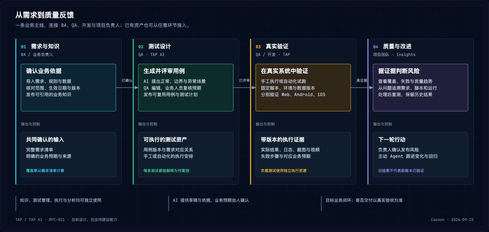
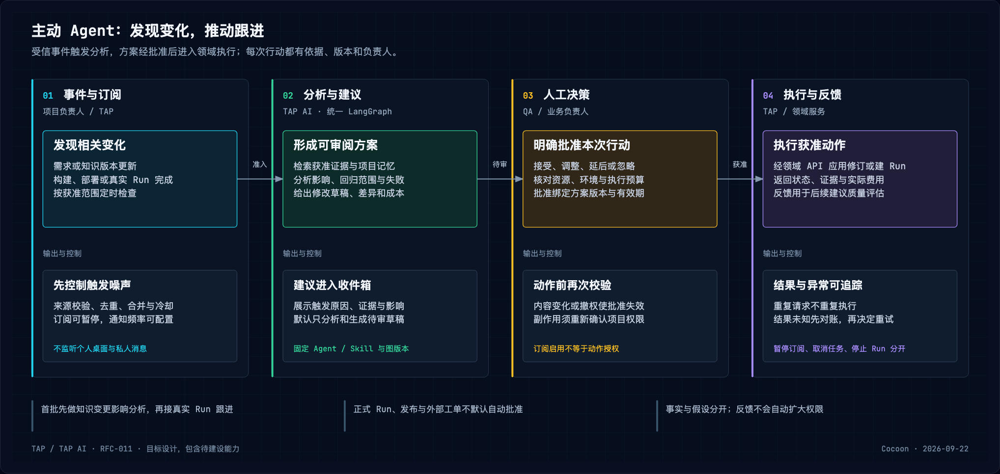
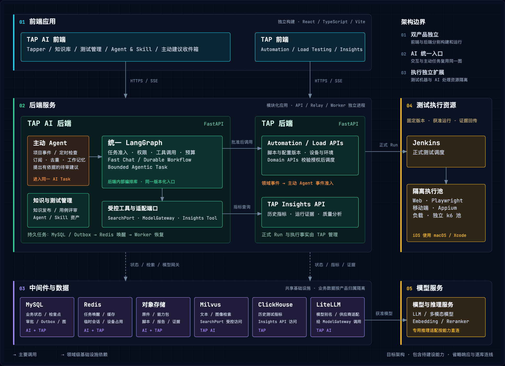

# RFC-011：TAP AI 测试平台方案

## 摘要

**让团队从需求变化出发，得到可核对的测试方案、真实执行证据和下一步行动。** TAP AI 帮助理解资料、设计测试和跟进变化；TAP 负责自动化、负载执行与质量分析。业务规则和正式行动由负责人确认，资料、用例、脚本与运行结果可以逐层追溯。

平台的核心价值有三点：

- **设计有依据。** 回答和用例能够定位到原文；遗漏、冲突与不确定内容明确交给人核对。
- **执行有证据。** 测试在真实应用中验证，失败能够追到步骤、版本和业务预期。
- **变化有人跟进。** 主动 Agent 发现需求、构建和测试结果变化，提出影响分析与回归建议，经批准后推动处理。

知识问答、测试管理、自动化、Test Insights、负载测试既能串成闭环，也能独立使用；已有用例、脚本和外部报告均可接入。

> **文档状态：目标设计，RFC 仍为 `draft`。** 图中能力不代表已经实现。方案讲解可按“业务场景 → 主动 Agent → 系统架构 → 交付路线”阅读；开发契约和完整验收集中在文末的三个专题。

## 背景

现有基础已覆盖文字资料解析、混合检索、测试计划版本与发布校验，但从资料到真实执行、再到持续质量反馈的链路仍需建设。

| 已有基础 | 本方案补齐什么 |
| --- | --- |
| PDF / DOCX / MD / TXT 文字处理与知识问答 | 复杂图片、扫描件、Excel、完整性检查和严格知识审核 |
| 测试计划与内嵌用例、版本及发布基础 | 独立用例资产、业务评审、手工执行、数据组合和协作 |
| 自动化与分析交互原型 | 真实 Web / App 执行、运行证据、统一指标与负载测试 |
| 部分 Agent / Skill 配置和版本接口 | 完整资源包、统一 AI 编排、主动事件与建议闭环 |

现状依据见 [V2/V3 更正评审](../reviews/2026-09-14-v2-v3-gate-correction.md)及[产品边界](../architecture/2026-09-15-tap-ai-product-boundary.md)。本方案不改变已有阶段的完成状态。

## 目标

以一条真实业务流程验证：团队能够从已确认的需求生成并评审测试，在真实环境中执行，依据结果判断风险，并在后续变化发生时收到有依据的改进建议。收益以资料核对时间、测试准备时间、采纳与修改量、失败定位时间、回归耗时和未覆盖需求衡量；试点前后采用相同范围比较。

## 非目标

本期不承诺无人核验即可运行的自动测试，不让 AI 改写业务预期或自动批准发布。平台不扩展为通用 Agent 托管平台、个人桌面监听工具、公共插件市场或商业设备云；移动端、完整质量分析与高级负载能力按依赖分批交付。

## 方案

### 1. 用一次业务变更说明完整体验

以“投保系统调整产品费率，并发布 Web 与 App 新版本”为例。业务人员提供新旧规则，QA 确认测试范围，开发提供可测试环境，负责人根据证据判断风险。

| 团队要完成的事 | 用户看到的结果 |
| --- | --- |
| BA 核对新旧条款与费率表 | 有出处的差异、适用条件和待确认问题 |
| QA 确认需求范围并设计测试 | 可编辑用例、覆盖关系和评审后的测试计划 |
| QA 手工执行或连接真实应用试跑 | 固定版本的步骤、实际结果、截图与失败证据 |
| QA / 开发处理问题，负责人判断风险 | 未测需求、未解决失败、质量趋势和复测结果 |
| 后续资料或构建发生变化 | 主动 Agent 提出的影响范围、回归建议与待审修订 |

例如一条费率断言失败，团队应能从失败截图找到脚本、用例、需求和当时使用的费率表。修复与重试保留原始结果，旧版本通过不能证明新需求已经验证。覆盖率以用户确认的完整需求清单为分母。

### 2. 主动 Agent

**主动 Agent 让平台在变化发生时提出行动建议。** 它消费获准的项目事件和受控定时检查，复用同一套 AI 编排、知识、权限和工具。建议统一进入项目收件箱，显示触发原因、依据、影响、方案差异及预计成本。

| 优先场景 | Agent 交付的建议 | 人的决定 |
| --- | --- | --- |
| 需求或知识版本变化 | 受影响用例、脚本及修订草稿 | 确认适用性，批准或调整修订 |
| 新构建或部署进入测试环境 | 建议回归范围、资源与预计成本 | 确认环境和范围，批准正式 Run |
| 测试失败或重复失败 | 证据聚合、可能原因与处理建议 | 核实归因，批准后续处理 |

订阅默认只允许分析和生成独立待审草稿。正式 Run、资产发布和外部工单经领域 API 执行，动作前再次检查权限、方案版本与批准有效期。版本变化或撤权会使旧批准失效；重复事件合并，结果未知先对账。工作记忆帮助理解项目状态，但不替代批准知识。

首批先交付知识变更影响分析与建议收件箱；接入真实 Run 和 Insights 后，再扩展回归与失败跟进。订阅可暂停，建议可忽略或延后，噪声和实际收益都纳入试点评估。

### 3. 系统分工

TAP AI 与 TAP 各自拥有独立前后端，通过正式 API 和领域事件协作。统一身份与项目映射让用户能沿同一条业务链切换；共享基础设施不改变各自的数据归属。

| 领域 | 负责什么 | 关键边界 |
| --- | --- | --- |
| 前端应用 | TAP AI 的知识、测试管理与主动建议；TAP 的自动化、负载与 Insights | 前端访问各自后端，不直接连接模型或数据库 |
| 后端服务 | TAP AI 理解与设计；TAP 管理技术运行、执行证据与指标 | LangGraph 是 TAP AI 后端内部编排库，模块不等于独立服务 |
| 中间件与数据 | MySQL 保存业务状态，Redis 唤醒任务，对象存储保留原件与证据；Milvus 支撑知识检索，ClickHouse 支撑历史分析 | 各产品维护自己的业务数据；ClickHouse 为待建设目标 |
| 测试执行资源 | Jenkins 调度正式测试，Playwright / Appium / k6 执行 | 调试直连执行服务；功能与负载资源隔离，三端分别验证 |
| 模型服务 | 提供语言、多模态与检索重排能力 | 通过 ModelGateway 及获准适配器调用，记录预算与用量 |

Chat 与主动/人工发起的 AI Task 进入同一版本化 LangGraph：Fast Chat 低延迟回答，Durable Workflow 处理可恢复长任务，Bounded Agentic Task 在预算内推理与调用工具。任务等待、重启和重复唤醒必须安全恢复；LangGraph、模型网关与测试调度各有职责。

### 4. 从资料到可信测试资产

资料先检查完整性，再按项目要求审核与发布。正式回答和生成只使用当前获准版本，引用能回到原页、图块或单元格。严格模式下，编校者不能复核自己修改的版本；撤回、过期和来源变更会阻止继续使用相关知识。

AI 按问题选择三类事实来源：条款与原文走知识检索，平台历史指标走 TAP Insights API，确有完整文件计算需求时才启用隔离文件分析。模型不能用检索片段猜汇总，也不能改写权威指标。

生成的测试先进入草稿，QA 核对正常、边界与异常场景，业务人员确认预期。发布后成为独立、可复用的用例资产；不适合自动化的用例可以手工执行。Agent / Skill 则保存团队可复用的方法、模板和脚本，任务固定使用已发布版本。

入口沿用现有产品结构：知识库、智能体和技能位于 Tapper 工具区，问答与主动建议在 Tapper 中使用；测试管理也能直接发起生成，无需先聊天。

### 5. 真实执行与质量判断

自动化必须连接真实应用，核对操作、定位、数据和业务断言后再评审发布。Web、Android、iOS 分别验收。正确发现产品缺陷的脚本可以带证据评审发布；脚本故障仍须修复，不能靠删除检查条件得到通过。

Test Insights 接收本平台与外部报告，用稳定的运行和用例身份去重，保留首次结果与重试。团队既能钻取一次失败，也能查看覆盖、缺陷、构建、代码质量与性能趋势。质量判断明确区分**通过、不通过、数据不足**；AI 解释证据与假设，负责人作出发布决定。

负载测试先确认业务量、延迟和错误门槛，再用独立资源验证实际承载。负载未达、分片缺失或提前停止不能算容量通过；全局百分位从完整样本或可合并统计量计算，停止必须由执行节点落实。

### 6. 开发专题与流程图

主文说明产品与架构决策，以下专题保留实现和验收依据，状态与本 RFC 一致。

| 专题 | 开发需要查什么 |
| --- | --- |
| [AI、知识与主动 Agent](../reference/2026-09-22-rfc-011-ai-knowledge-design.md) | 知识解析/检索/审核、三类事实路径、Agent/Skill、主动准入与授权、质量阈值 |
| [测试管理与执行](../reference/2026-09-22-rfc-011-testing-execution-design.md) | 用例模型与迁移、手工结果、Web/App LCA、负载模型、运行与停止语义 |
| [Insights、跨产品契约与恢复](../reference/2026-09-22-rfc-011-insights-contracts-design.md) | 指标分母与身份去重、接口边界、数据归属、图版本/检查点/幂等、团队部署 |

[浏览方案与全部流程图](../assets/rfc-011/2026-09-22-platform-design-review.html) · [下载可编辑 draw.io（12 页）](../assets/rfc-011/2026-09-17-platform-design.drawio) · [架构图 HTML / 导出](../assets/rfc-011/2026-09-22-platform-technical-architecture.html)。图册沿用统一的 Cocoon 领域分区、颜色与留白，每张图独立说明一件事。

## 替代方案

| 取舍 | 决定及理由 |
| --- | --- |
| 上传资料后直接生成并运行脚本 | 先确认业务预期，再连接真实应用验证，避免把资料理解错误带入执行 |
| 每类任务建立一套 AI 流程 | Chat 与 AI Task 共享版本化编排、权限、状态和证据，执行方式按任务选择 |
| 让 AI 直接查业务数据库 | 使用受控工具和正式 API，指标口径、项目授权与查询依据由服务端负责 |
| 一个数据库或执行池承载所有工作 | 按事务状态、知识检索、历史分析与测试资源分工，独立扩展并保留可追溯关系 |

统一编排的目标决策见 [ADR-029](../decisions/2026-09-18-adr-029-langgraph-ai-interaction-task-orchestrator.md)，产品边界见 [ADR-027](../decisions/2026-09-15-adr-027-tap-ai-product-app-boundary.md)。已有本机 Codex Answer Adapter 保持独立，不改写为本目标架构。

## 风险与缓解

| 主要风险 | 如何控制 |
| --- | --- |
| 资料遗漏、知识过期或 AI 推断错误 | 原件清点、人工核对、固定版本、可定位引用；事实与假设分开 |
| 提醒过多、建议过期或动作越权 | 订阅与降噪、方案版本及批准有效期、动作前授权、预算与幂等 |
| 恢复时重复执行、报告重复或缺失 | 持久状态与 Outbox、运行身份去重、外部副作用对账、数据完整性状态 |
| 示例或模拟能力被误认为已交付 | 原型、真实模型、真实设备分别留验收记录；缺数据不显示正常或通过 |
| 团队环境与模型数据外发不受控 | 统一登录、项目权限、凭证管理和数据区域策略在团队试点前验收 |

## 迁移或发布方式

先选择一条代表性业务流程贯穿验证，再逐项扩展。以下是依赖顺序，不是工期承诺。

| 批次 | 交付重点 | 进入下一阶段的依据 |
| --- | --- | --- |
| 1. 可信知识与测试设计 | 统一 AI 入口、Fast Chat / Durable Workflow、知识核对、独立用例与手工执行、基础 Jira REST | 真实资料能形成有出处、可评审发布的测试；长任务可离页并安全恢复 |
| 2. Web 与基础 Insights | 真实 Web 调试和运行、自动结果映射、Insights API / ClickHouse、受限 Agentic 任务 | 用例、脚本、执行证据和真实指标完整关联，重复上报不重复计数 |
| 3. Android / iOS | 设备、安装包、平台动作、调试、导出与复跑 | 两个平台分别具备真实运行证据 |
| 4. 完整 Insights 与协作 | 工程连接、五类质量分析、规则与告警、Forge Jira 内嵌操作 | 指标分母、数据缺失、更正和双方权限逐项验证 |
| 5. Load Testing | 先 k6 协议闭环，再浏览器、混合、分布式与私网能力 | 实际负载与统计可校准，失联可停，缺数据不放行 |

Skills/Agents 资源包与主动 Agent 随第 1–2 批推进：先知识变更建议与收件箱，再接真实回归和失败跟进。Insights 数据接入可并行准备；低风险动作预授权后续单独启用。自动化 L1–L3 表示能力深度，不代表三端在第 2 批同时完成。

所有批次共同先行准备身份/项目映射、接口契约、凭证、真实样本与环境，以及恢复和备份验证。当前回环、无认证的本机演示不能直接开放为团队环境。按项目增量启用，保留既有内容和存储数据，模拟报告不进入真实分析。

## 验收标准

| 需要证明的价值 | 验收证据 |
| --- | --- |
| 资料真正可用 | 回答及测试引用可定位；解析完整性、检索和答案质量达到专题中的分类型目标 |
| 测试真正可执行 | 真实应用上的步骤、结果与证据；各平台单独验收，断线/失败/取消均可解释 |
| 主动 Agent 值得信任 | 建议有依据、批准可追溯、重复事件不重复行动；同时衡量有效建议率、噪声、时延和费用 |
| 质量判断可复核 | 指标分母与查询编号可追溯，重试独立、报告去重，缺数据明确阻断结论 |
| 平台能稳定协作 | 项目隔离、等待与恢复、撤权、重复唤醒、未知响应对账、备份与重算有真实记录 |
| 团队获得实际收益 | 与试点前相同范围比较核对、准备、定位和回归耗时，不预先承诺节省比例 |

完整功能、指标阈值和异常验收见三个开发专题。界面原型通过不能代替真实模型、真实设备或生产规模验证。

## 未决问题

| 试点前需要确认 | 负责角色 |
| --- | --- |
| 首个业务流程、资料样本、审核强度、预期答案与成功标准 | 业务负责人、BA、QA |
| 应用、账号、数据、内网条件、iOS 签名与设备 | 开发、QA、运维 |
| 主动订阅范围、负责人、通知频率、预算和批准有效期 | QA、项目负责人、安全负责人 |
| 图版本与恢复策略、模型别名、跨产品授权及接口版本 | 架构、开发、运维 |
| Jira / CI / 代码质量权限、历史范围与编号映射 | 数据源负责人、开发、QA |
| 性能目标、发压窗口、容量与费用、数据保留及模型外发范围 | 业务负责人、性能 QA、运维、安全负责人 |
| 发布门槛、人员投入和分批排期 | 交付负责人、业务负责人 |

缺少真实资料或环境时，对应能力保留“待验证”状态。技术选型、来源链接与具体输入要求随开发专题维护。
