# Phase 1：RAG Foundation

| 字段 | 值 |
| --- | --- |
| 状态 | Phase 1 delivery baseline |
| 目标 | 构建可评测、权限安全、可追溯、可增量更新，并能通过聊天完成知识问答的企业 RAG 垂直切片 |
| 核心技术 | Git、Entra ID、AKS、Azure AI Search、MySQL、Redis、Blob、Key Vault、LiteLLM、React/TypeScript |
| 主要用户面 | TAP Knowledge Chat、Retrieval API、Citation/Trace Inspector |

## 1. 阶段目标

第一阶段不追求完整 Test Automation 闭环，而是先证明后续 Agent、Test IR 生成、失败 RCA 都能共享一套可靠检索底座：

- 文档、代码、BDD、失败记录按各自结构正确解析和切片。
- 四个 Azure AI Search 索引可从 Git、Blob、MySQL 权威源重建。
- 全文、向量、AST/Symbol 和轻量依赖关系能组合检索。
- 每次检索在查询前执行 tenant/project/group/classification/environment 权限过滤。
- 每个结果和生成结论都带可定位到 source revision 的引用。
- 检索质量、权限、时延、成本和数据新鲜度都有可重复评测。
- 用户能在 Project/Conversation 中流式提问、中断或排队追问，并从逐条引用打开精确证据。

## 2. 非目标

Phase 1 不以以下能力作为出口条件：

- Agentic Loop、多 Agent 调度或自动任务规划。
- Test IR 编译器、低代码测试编辑器和测试代码生成。
- Browser Grid、Device Grid、BrowserStack 或 API Runner 执行。
- Self-Healing、RCA 自动闭环和代码/Locator 自动修改。
- 通用知识图谱、模型微调或跨云检索平台。
- Shell/工具执行、代码编辑、Git 写入、测试运行和通用 Agent 产品能力。

Phase 1 的 Knowledge Chat 是可持续使用的 RAG 用户面和正式出口条件；它聚焦知识问答，不在本阶段扩展为通用 Agent 或 Test Automation 工作台。

## 3. Phase 1 架构

```mermaid
flowchart LR
    subgraph Sources[Authoritative Sources]
      Git[Git<br/>Code / BDD / Test Assets]
      Blob[Blob<br/>Documents / Evidence]
      MySQL[(MySQL<br/>Catalog / Failure Metadata / ACL)]
    end

    subgraph AKS[AKS - RAG Foundation]
      BFF[Knowledge Chat BFF]
      Detect[Change Detection]
      Fetch[Fetch + Verify Revision]
      Classify[Classify + ACL + Redact]
      Parse[Typed Parsers]
      Chunk[Typed Chunkers]
      Enrich[Summary / Symbol / Dependency Enrichment]
      Embed[Embedding Client]
      Write[Index Writer]
      Ledger[Ingestion Ledger / Checkpoint]

      API[Retrieval API]
      Query[Query Classifier / Decomposer]
      Filter[Trusted ACL Filter Builder]
      Hybrid[Parallel Hybrid Retrieval]
      Fuse[RRF / Cross-index Fusion]
      Rerank[Reranker]
      Context[Parent / Graph Expansion + Context Budget]
      Cite[Citations / Retrieval Trace]
      Answer[Grounded Answer / Abstain]
      Resolver[Citation Resolver]
      TracePolicy[Restricted Trace Policy]
    end

    Web[TAP Knowledge Chat Web] -->|REST + SSE| BFF
    BFF --> API
    BFF --> ChatDB[(MySQL<br/>Chats / Turns / Events)]

    Git --> Detect
    Blob --> Detect
    MySQL --> Detect
    Detect --> Fetch --> Classify --> Parse --> Chunk --> Enrich --> Embed --> Write
    Write --> Search[(Azure AI Search<br/>4 versioned indexes)]
    Search -->|Upsert ACK| Ledger
    Ledger --> MySQL

    Embed -->|Model call| LiteLLM[Stateless LiteLLM Gateway]
    Rerank -->|Model call| LiteLLM
    Answer -->|Model call with context| LiteLLM
    KeyVault[Key Vault] --> LiteLLM
    Redis[(Redis<br/>Locks / Short Cache)] --> API
    Identity[Entra ID / Trusted Policy] --> API
    Identity --> Filter

    API --> Query --> Filter --> Hybrid
    Filter --> Search
    Search --> Hybrid --> Fuse --> Rerank --> Context --> Cite
    Cite --> Answer -->|Answer deltas + citations| BFF
    Cite --> Resolver --> BFF
    Cite --> TracePolicy --> BFF
    BFF -->|SSE / citation response| Web
    BFF --> Resolver
```



Indexer、解析、切片、Embedding、权限元数据和删除传播均由 TAP 在 AKS 中控制。Azure AI Search 是可重建索引，不负责替代原始内容或 ACL 权威源。

专项实现设计：

- [数据切片与端到端溯源](chunking-and-provenance.md)
- [Azure AI Search 索引设计](ai-search-index-design.md)
- [检索调优方案](retrieval-tuning.md)
- [TAP Knowledge Chat](knowledge-chat-ui.md)

## 4. 四索引设计

### 4.1 公共字段

每个索引至少包含：

| 字段 | 用途 |
| --- | --- |
| `chunkId` / `logicalChunkId` | 不可变 snapshot 主键 / 跨 revision 的逻辑切片身份 |
| `tenantId` / `projectId` | 强制租户与项目过滤 |
| `allowedGroupIds` | Entra/group security trimming |
| `classification` / `environment` / `aclVersion` | 数据分级、环境边界与权限版本 |
| `sourceType` / `sourceUri` / `sourceId` / `anchor` | 权威来源和可解析引用 |
| `sourceRevision` / `sourceContentHash` / `chunkContentHash` | 原始 snapshot 版本、切片完整性、去重和审计 |
| `rootId` / `parentId` / `chunkLevel` / `corpusVersion` | Parent/Child、多粒度上下文与原子语料快照 |
| `title` / `content` / `language` / `tags` | 全文检索与展示 |
| `contentVector` / `embeddingModelVersion` | 向量检索与模型迁移 |
| `parserVersion` / `chunkerVersion` / `schemaVersion` / `pipelineVersion` | 可重复重建与蓝绿升级 |
| `indexedAt` / `deleted` / `parserStatus` / `redactionStatus` | 新鲜度、删除、对账与安全审计 |

逻辑身份与 snapshot 身份分开计算：

```text
hashId(value) = "h_" + lowercaseHex(SHA-256(value))
logicalChunkId = hashId(tenantId | projectId | sourceId | structuralLocator | chunkKind)
chunkId = hashId(logicalChunkId | sourceRevision | chunkContentHash | chunkerVersion)
```

`chunkId` 作为 AI Search document key 只使用允许的 URL-safe 字符；URI、冒号前缀和路径不直接进入 key。

### 4.2 类型专用字段与切片

| 索引 | 切片单元 | 专用字段 |
| --- | --- | --- |
| `kb-doc-v1` | Document Summary → Section Summary → Leaf Chunk；固定 token 仅兜底 | docType、sectionPath、page/offset、effectiveDate |
| `kb-code-v1` | Repository/File → Class/Function/Method/Symbol；代码保持原语言 | repo、commit、path、language、symbol、kind、signature、line range、imports/calls |
| `kb-bdd-v1` | Feature → Scenario → Step | featureId、scenarioId、stableTestId、stepKeyword、tags、automationRefs |
| `kb-failure-v1` | 一个 Incident/失败指纹一个逻辑单元，证据大文件只保留引用 | incidentId、fingerprint、testId、runId、errorType、status、evidenceRefs、resolution |

OpenAPI/AsyncAPI 内容进入 `kb-doc-v1` 或独立逻辑 source type，但必须按 Endpoint/Operation 切片，不能按固定页长切分。

## 5. Ingestion Pipeline

### 5.1 标准流程

1. Git webhook/scan、Blob event/scan、MySQL Outbox 发现 revision 变化。
2. 用 `sourceUri + sourceRevision + sourceContentHash` 幂等去重。
3. 从权威源读取内容并校验 revision 未漂移。
4. 从可信策略源计算 tenant/project/group/classification/environment；权限服务不可用时 fail closed，空 ACL 不自动解释为公开。
5. 按 source type 选择 parser/chunker；结构化边界优先，token window 只兜底。
6. 生成 parent/child、summary、symbol 和轻量依赖边，并在 Embedding 前完成秘密/PII 脱敏；不同 ACL 的 child 不合并为同一个 parent summary。
7. 经无状态 LiteLLM Gateway 调用固定版本 Embedding 模型；未变化的 `chunkContentHash` 不重复 Embedding。
8. 批量 `mergeOrUpload` 到目标版本索引并保存 Ingestion Manifest。
9. 在 MySQL 更新 checkpoint、数量、hash、失败原因与 trace ID。
10. rename、删除或权限收紧时写 tombstone，并在批准的新鲜度窗口内从索引移除/更新；部分批次失败进入可重放清单，禁止静默丢失。

### 5.2 Ingestion Manifest

每次批次保存：source revision、parser/chunker/embedding/schema version、输入/输出数量、失败记录、index target、开始/结束时间、`sourceContentHash`/`chunkContentHash` 和操作者。相同输入与版本必须生成相同 chunk IDs。

### 5.3 索引升级

- Schema、chunker 或 embedding 发生不兼容变化时创建 `*-v2`，不原地混合向量空间。
- 后台全量重建并运行同一评测集。
- 四个 reader alias 逐个更新并等待传播确认，不宣称跨 alias 原子性；传播期间 turn 继续固定旧 `corpusVersion`，新索引只会产生可见 degraded/零结果，禁止放宽 filter 混合新旧数据。全部 alias 收敛后再原子发布 TAP `activeCorpusVersion` 应用层指针，并保留快速回滚窗口。
- 旧索引只在新索引质量、ACL 和数据对账通过后清理。

## 6. Retrieval Pipeline

1. API 从可信身份上下文注入 tenant、project、groups、classification ceiling 和 environment；模型不能传入或放宽这些字段。Policy 将 classification ceiling 转换为明确的允许集合，不进行字符串大小比较；environment 只允许 `global OR requested environment`。
2. Query Classifier 判断 doc/code/bdd/failure 单索引或多索引检索。
3. ID、stable Test ID、symbol 和 fingerprint 查询先走 exact/filter fast path；复杂或跨章节问题再拆成有上限的子问题，禁止无界 Agentic search loop。
4. 每个目标索引执行 BM25 + Vector hybrid query；代码额外使用 symbol/path/signature 信号，BDD/Failure 使用结构化字段和 fingerprint。
5. Azure AI Search 在单索引内做 hybrid/RRF；TAP Retrieval Service 按 per-index rank 做跨索引 RRF，不直接比较不同索引的原始 score。
6. Reranker 对候选重排；记录模型、输入格式和分数，不将其与 embedding 版本混淆。
7. 根据 Parent/Child 和轻量代码—测试依赖边补充必要上下文；parent、依赖边、facet/count 和补充 chunk 均再次应用同一 ACL。
8. 去重、控制 token budget，并生成带不可变 `source revision + structured anchor + sourceContentHash + chunkContentHash + chunkId` 的 Citation；内部 URI 经 resolver 重新授权后才可打开。
9. Retrieval Trace 保存 tenant/project/actor、ACL digest、query plan、filters、候选、分数、丢弃原因、最终 context、版本与耗时；内容按 trace retention/redaction policy 保存。

Phase 1 默认不缓存检索结果；若评测后启用，cache key 必须包含 tenant、project、ACL digest、classification、environment、corpus/index/model version，撤权与删除必须同步失效。

## 7. Retrieval 与 Knowledge Chat API

Phase 1 至少交付：

```text
POST /v1/retrieval/search
  -> ranked chunks + citations + retrieval trace id

POST /v1/retrieval/answer
  -> answer + claim-level citations + retrieval trace id

GET /v1/retrieval/traces/{id}
  -> query plan / filters / candidates / scores / final context
```

`answer` 是 Knowledge Chat 的正式回答接口；`search` 是后续 Agent、Test Authoring 和 RCA 依赖的稳定检索契约。两者共享同一可信 Policy Context、Retrieval Profile、Trace 和 Citation 模型。

Answer 服务只能使用返回的 context；证据不足、来源冲突或 revision 不一致时必须拒答或显式提示冲突。正式请求/响应字段见 [Retrieval Contract](contracts.md#8-retrieval-contract)。

Knowledge Chat 通过 BFF 提供 Project/Conversation、流式回答、中断、排队追问、`@resource`、逐条引用和反馈。浏览器不得直连 AI Search 或 LiteLLM；公开请求不能携带 tenant/group/classification/filter。正式 Chat/SSE 契约见 [Knowledge Chat Contract](contracts.md#9-knowledge-chat-contract)，页面行为见 [TAP Knowledge Chat](knowledge-chat-ui.md)。

Retrieval Inspector 需要展示：原始 query、分解 query、脱敏 ACL digest、各检索通道 rank/score、RRF/rerank 前后顺序、parent expansion、最终 context 和引用跳转。普通用户只看 Sources/Claims；完整 Trace 仅限诊断角色。

`traceId` 只是关联标识，不能作为访问凭证。`GET /traces/{id}` 和 Inspector 每次读取都必须从当前 Entra 身份重新校验 tenant/project/actor 或受限诊断角色，并按当前 ACL fail closed；默认脱敏 query、group/filter 细节、候选内容和秘密。撤权后不得通过旧 trace、引用或 Inspector 继续读取原文，所有读取都进入审计日志。

## 8. 评测体系

### 8.1 Golden Dataset

按四类语料建立版本化评测集，覆盖：

- 精确术语、ID、错误码和 symbol 查询。
- 同义表达和语义查询。
- 跨章节、多跳和 code → BDD/test 关联查询。
- 新建与更新已有测试资产所需的检索场景。
- 无答案、冲突版本、过期内容和引用定位。
- 跨 tenant/project/group/classification/environment 的攻击性权限用例。
- 更新、删除、权限收紧和索引重建后的新鲜度用例。

每条样例保存 query、actor/ACL、期望 source/chunk、可接受答案要点、禁止出现内容和数据集 revision。

首版冻结集建议至少包含 120 个经人工复核的问题：每个索引至少 25 个，另有至少 20 个跨索引、无答案、冲突来源或过期 revision 问题；另运行至少 1,000 个 ACL negative probes，覆盖 parent、依赖边、facet/count、缓存、删除和撤权侧漏。

### 8.2 指标

| 维度 | 指标 |
| --- | --- |
| Retrieval | Recall@K、MRR、nDCG、per-index/source coverage、zero-result rate |
| Answer | citation precision/recall、faithfulness、unsupported claim rate、版本正确性 |
| Security | unauthorized hit/answer count、filter bypass、trace 中敏感信息泄漏 |
| Freshness | change/delete/ACL update 到生效的 P50/P95 |
| Reliability | ingestion success、重复 chunk、checkpoint recovery、rebuild parity |
| Performance | retrieval/rerank/answer latency、tokens、embedding/query cost |

所有结果必须分别报告四类索引，不能只用总体平均掩盖代码或失败知识的弱项。

### 8.3 Phase 1 出口标准

硬门槛：

- 权限对抗测试中 unauthorized retrieval/answer 为 **0**。
- 100% 最终 context 具备不可变 `source revision + structured anchor + sourceContentHash + chunkContentHash + chunkId`。
- 相同 source revision 重跑无重复 chunk；中断后可从 checkpoint 恢复。
- 四个索引都能从 Git/Blob/MySQL 重建，并与 Ingestion Manifest 对账。
- 删除、权限收紧、秘密脱敏与索引版本回滚通过演练。
- Retrieval API、Knowledge Chat 和 Inspector 可在不依赖 Agentic Loop 的情况下独立使用。
- Chat 完成 `选择 Project → 新建/恢复会话 → 流式提问 → 打开精确引用 → 反馈` 的端到端链路；支持停止、排队追问与断线续传。
- Citation、Trace 和历史会话每次按当前 ACL 重新授权，撤权后无法从旧内容读取受限证据。

建议的首轮质量目标（需用真实 Golden Dataset 校准后批准）：

- 总体 `Recall@10 ≥ 0.85`，且任一语料类型不低于 `0.75`。
- Exact ID/symbol/fingerprint 查询 Top-3 命中率为 `100%`，总体 `nDCG@10 ≥ 0.70`。
- 有答案样例的 citation precision `≥ 0.95`。
- 无答案/证据不足识别准确率 `≥ 0.90`，unsupported claim rate `≤ 0.02`。
- Hybrid + rerank 在主要指标上稳定优于 BM25-only baseline。
- 时延、新鲜度与成本先建立基线，再由产品/平台负责人批准 SLO；不以实验数据直接承诺生产值。

## 9. 实施顺序

### P1.0：数据契约与评测先行

- 确认 source owner、ACL owner、代表性语料和删除策略。
- 固化公共字段、四索引 v1 Schema、chunk ID、Ingestion Manifest 和 Retrieval Trace。
- 先建立 Golden Dataset 与 BM25-only baseline，避免无评测调参。

### P1.1：Typed Ingestion

- 先打通 `kb-doc-v1` 与 `kb-bdd-v1` 的端到端增量链路。
- 再加入代码 AST/Symbol parser 和 `kb-code-v1`。
- 最后接失败 Incident、证据摘要和 `kb-failure-v1`。

### P1.2：Hybrid Retrieval

- 权限过滤、BM25 + Vector、cross-index fusion、rerank。
- Parent/Child、context budget、代码—测试依赖扩展和有界多跳。
- Search/Answer API、Citation Resolver 和受限 Retrieval Inspector。

### P1.3：Knowledge Chat 与生产化

- 实现 Project/Conversation、REST + SSE、流式回答、停止、队列追问、`@resource`、Sources/Claims drawer 和反馈。
- 离线回归、Chat E2E、ACL/删除/重建演练、恶意 Markdown/citation IDOR、容量和故障注入。
- OTel trace、dashboard、告警、Runbook、成本与配额。
- 通过出口标准后冻结 Retrieval Contract，供 Phase 2 使用。

## 10. 第一批待确认输入

1. 四类语料各自的真实样例、规模、语言、Owner 和更新频率。
2. Entra group 与 tenant/project/classification/environment 的权威映射来源。
3. Azure AI Search SKU、区域、网络方式和容量预算。
4. Embedding/Reranker 模型、向量维度、语言覆盖和数据区域。
5. Git/Blob/MySQL 的增量变更机制及删除/权限收紧目标窗口。
6. Golden Dataset 的标注人、评审流程和每类最低样例数。
7. 哪些字段、文件类型、日志或证据禁止进入索引和模型。
