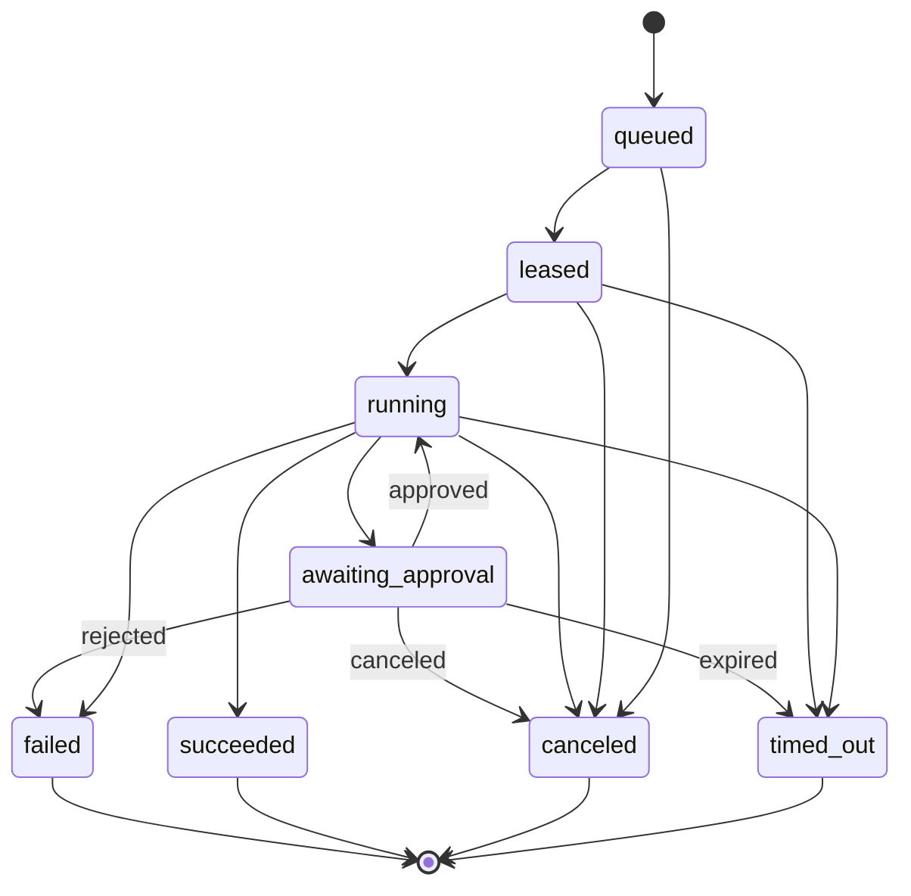
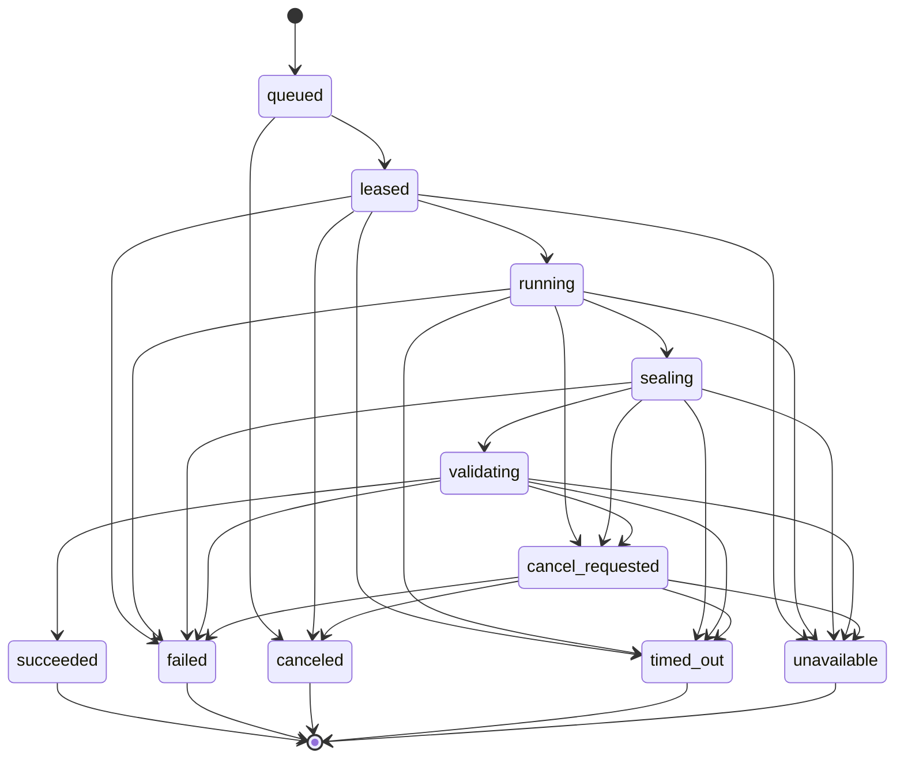

# TAP 核心契约（历史 Intelligence-first 版本）

本页保留 2026-08-20 至 2026-09-02 的 Intelligence-first 契约演进，不再是当前实施入口。当前架构级契约见 [Athena 知识与 Web 自动化平台契约](2026-09-04-athena-platform-contracts.md)；历史内容仍可作为 durable task、artifact、validator 与通用幂等模式的参考。

> **历史阶段入口（2026-09-02）**：当时的 Phase 1 实施入口是[第 5 节的 Intelligence Contract](#phase-1-intelligence-contract)。该优先级已经被 RFC-009/ADR-021 替代；本文中的 Git 强制事实源、Project 非必需和 Test IR/Run 后置不适用于当前基线。

## 1. Test IR 与稳定身份（Phase 2+）

Test IR 是 Git 中版本化的核心资产。稳定身份与文件路径、名称和执行框架解耦：

```yaml
apiVersion: tap.dev/v1alpha1
kind: TestCase
metadata:
  id: test_checkout_happy_path
  projectId: commerce-web
  aliases: []
spec:
  intent: "已登录用户完成信用卡结账"
  steps:
    - id: submit_payment
      action: click
      target: { locatorRef: checkout.submit }
  assertions:
    - type: url_matches
      value: /orders/*
```

约束：

- `metadata.id` 创建后不可复用；重命名通过 alias/migration 表达。
- Test IR revision 由 Git commit + content hash 标识，不使用可变 branch 名。
- action、target、assertion、fixture 和 secret 必须是版本化 typed vocabulary。
- 自定义能力通过显式 extension namespace 表达；禁止把任意 Shell 当通用 action。
- MySQL 保存 Test catalog/projection 与 revision 映射，内容版本以 Git 为准。

## 2. RunSpec（Phase 2+）

Run 创建后冻结。任何重跑都创建新的 Attempt；改变工作流、策略或 revision 必须创建新 Run。

```yaml
apiVersion: tap.dev/v1alpha1
kind: Run
metadata:
  tenantId: tenant_123
  projectId: project_456
  idempotencyKey: github:delivery:abc123
spec:
  trigger:
    type: github.pull_request
    actor: github:user:octocat
  source:
    repository: github:owner/repo
    revision: 0123456789abcdef
    baseRevision: fedcba9876543210
  testAssets:
    - id: test_checkout_happy_path
      revision: 0123456789abcdef
      contentHash: sha256:...
  workflowRef:
    id: pr-quality
    version: 7
  policyRef:
    id: default-engineering
    version: 4
  budget:
    deadlineSeconds: 3600
    maxAgentTokens: 200000
    maxProviderMinutes: 120
  requestedCapabilities:
    - agent.analysis
    - test.web.e2e
```

## 3. 执行 Task 与 Attempt（Phase 2+）

- Task 是归一化逻辑工作项，可以来自 Workflow DAG 节点，也可以来自 Agentic Loop 某轮规划的 action。
- DAG Task 具有稳定 node key；Loop Task 必须记录 `plan_iteration`、`action_id` 与产生它的 causation event。
- Loop 在产生任何工具或外部副作用前，必须先持久化 Task/Attempt；动态规划不能绕开运行状态机。
- Attempt 是 Task 的一次物理执行，具有单调递增序号。
- 重试不能复用外部 Provider attempt ID 或 Agent session ID。
- Task 成功规则由 Workflow 定义；Attempt 终态不可修改。

下面是 **Attempt 状态机**；Task 的汇总结论由 Workflow/Plan 根据一个或多个 Attempt 计算。



未知或供应商特有状态映射为 `running` 加诊断属性，不能乐观映射为 `succeeded`。

## 4. RunEvent（Phase 2+）

```json
{
  "event_id": "evt_...",
  "event_type": "attempt.completed",
  "occurred_at": "2026-08-20T14:00:00Z",
  "tenant_id": "tenant_123",
  "run_id": "run_...",
  "task_id": "task_...",
  "attempt_id": "attempt_...",
  "sequence": 42,
  "idempotency_key": "provider:browserstack:session:...:completed",
  "actor": { "type": "system", "id": "browserstack-adapter" },
  "trace_id": "...",
  "correlation_id": "run_...",
  "causation_id": "evt_previous_...",
  "schema_version": 1,
  "data": {}
}
```

约束：

- 同一 Run 的 `sequence` 单调递增。
- Producer 重复投递相同 `idempotency_key` 不产生第二个业务事实。
- Schema 只做向后兼容扩展；破坏性变化升级 `schema_version`。
- 事件中只存小型结构化事实；大载荷进入 Blob 并用 ArtifactRef 引用。

MySQL 中持久化的领域事件共享内部 envelope：`eventId`、`workspaceScopeId`、`aggregateType`、`aggregateId`、aggregate 内单调 `sequence`、`eventType`、`schemaVersion`、`correlationId`、`causationId`、`traceId`、`occurredAt`、`idempotencyKey` 与 typed payload。只有在对象确实属于 Project/tenant 时才附加 `projectId` / `tenantId` 关系；当前 Intelligence Task 不要求这些父对象。不同 aggregate 保持各自状态机。面向浏览器的事件是授权后的领域投影，可省略内部 scope/policy 字段，但必须保留 opaque `eventId` 和 `sequence`。

## 5. Provider Port

### Phase 1 Intelligence Contract

当前 Phase 1 契约由 [RFC-007](../proposals/2026-09-02-rfc-007-phase-1-intelligence-layer-exploration.md) 和 [ADR-019](../decisions/2026-09-02-adr-019-phase-1-intelligence-layer-exploration.md) 约束。它不以 Project、Release、Requirement 或仓库作为强制父对象；P1.0–P1.2 的公共创建请求只要求 `goal`，另外只接受可选人工步骤和用户选择的 `ready` Knowledge Source。公共 OpenAPI/JSON Schema 由 Pydantic 生成；Runtime wire Schema 另行按下述 `openai-structured-outputs-subset-v1` 生成和检查，不能直接复用公共导出。以下为实施前必须保持的架构不变量。

```typescript
type RequestedOutcome =
  | "intelligence_report"
  | "automation_blueprint"
  | "repository_impact_report"
  | "code_bundle"
  | "candidate_patch"
  | "failure_analysis";

interface CreateIntelligenceTaskRequest {
  clientRequestId: string;
  goal: string;
  targetDescription?: string;
  requestedOutcomes?: RequestedOutcome[];
  successCriteria?: string[];
  constraints?: string[];
  manualSteps?: Array<{
    ordinal: number;
    instruction: string;
    expectedOutcome?: string;
  }>;
  optionalContextRefs?: Array<{ kind: "knowledge_source"; sourceId: string }>;
}

interface IntelligenceCommandRequest {
  clientRequestId: string;
}

interface ArtifactReviewRequest {
  clientRequestId: string;
  decision: "accept" | "request_revision" | "reject";
  reason: string;
  reviewPackageContentHash: string;
}

interface AutomationBrief {
  briefId: string;
  revision: number;
  workspaceScopeId: string;
  goal: string;
  targetDescription?: string;
  requestedOutcomes: RequestedOutcome[];
  successCriteria: string[];
  constraints: string[];
  manualSteps: Array<{
    ordinal: number;
    instruction: string;
    expectedOutcome?: string;
  }>;
  optionalContextRefs: Array<{ kind: string; id: string }>;
  createdBy: string;
  createdAt: string;
  contentHash: string;
}

interface ContextSnapshot {
  contextSnapshotId: string;
  contentHash: string;
  briefRevisionRef: { briefId: string; revision: number; contentHash: string };
  actorRef: string;
  workspaceScopeId: string;
  classification: string;
  sourceRefs: Array<{
    sourceId: string;
    revision: string;
    contentHash: string;
    anchor: unknown;
  }>;
  repositoryRefs: Array<{
    repositoryId: string;
    role: "product_source" | "test_repository";
    commit: string;
    treeHash: string;
    accessMode: "read_only";
    pathGrants: string[];
  }>;
  failureBundleRefs: Array<{ artifactId: string; contentHash: string }>;
  declaredAbsences: string[];
  policyDecisionId: string;
  policyVersion: string;
  aclDigest: string;
  runtimePolicyRef: string;
  grantedRuntimeProfile:
    | "intelligence-readonly-v1"
    | "automation-design-v1"
    | "automation-engineering-lab-v1";
  featureGateVersion: string;
  redactionVersion: string;
  createdAt: string;
}
```

`actorRef`、`workspaceScopeId`、Policy、Profile、feature gate 和权威 revision/hash 全部由服务端解析与注入。公共请求不得接受 provider、model、Runtime Profile、sandbox、tool、network、capability、ACL 或物理索引字段。Create、cancel、retry、context-refresh 和 review 均以当前 scope + operation + route resource + `clientRequestId` 做幂等；服务端在业务变更同一事务中持久化 canonical request hash 与结果 resource/status。相同 key/相同 request replay 原结果，相同 key/不同 request 返回 `409 idempotency-conflict`。

P1.0–P1.2 的 `repositoryRefs` 和 `failureBundleRefs` 必须为空；显式请求 `repository_impact_report`、`code_bundle`、`candidate_patch` 或 `failure_analysis` 时返回稳定的 `409 outcome-not-enabled`，不得静默降级。Context Builder 另外生成一个单独哈希、大小受限且持久化的 Runtime 投影。所有带 `contentHash` 的对象都对“不含自身 `contentHash` 字段”的 canonical payload 计算 SHA-256，不能把 digest 写回待哈希字节形成循环：

```typescript
interface RuntimeContextExcerpt {
  evidenceLabel: string;
  sourceDisplay: { title: string; kind: string };
  sourceId: string;
  revision: string;
  contentHash: string;
  anchor: unknown;
  authorizedText: string;
  excerptContentHash: string;
  truncated: boolean;
}

interface RuntimeContextPacket {
  runtimeContextPacketId: string;
  contextSnapshotRef: { contextSnapshotId: string; contentHash: string };
  declaredAbsences: string[];
  selectionPlan: {
    strategyVersion: "brief-relevance-v1";
    normalizedQuery: string;
    sourceRefs: Array<{
      sourceId: string;
      revision: string;
      contentHash: string;
    }>;
    maxExcerpts: number;
    maxBytes: number;
  };
  excerpts: RuntimeContextExcerpt[];
  truncation: {
    wasTruncated: boolean;
    omittedExcerptCount: number;
    omittedByteCount: number;
  };
  contentHash: string;
}

interface RuntimeProposalSchemaBinding {
  schemaId: string;
  kind: "intelligence_report" | "assumption_register" | "automation_blueprint";
  schemaVersion:
    | "intelligence-report-v1"
    | "assumption-register-v1"
    | "automation-blueprint-v1";
  jsonSchemaDraft: "2020-12";
  schemaDialectProfile: "openai-structured-outputs-subset-v1";
  schemaBytesHash: string;
}

interface ProposalSchemaRegistryRefV1 {
  registryVersion: "runtime-proposal-schema-registry-v1";
  contentHash: string;
}

interface ProposalSchemaRegistryEntryV1 extends RuntimeProposalSchemaBinding {
  canonicalSchemaBytes: Uint8Array;
}

interface ProposalSchemaRegistryV1 {
  registryVersion: "runtime-proposal-schema-registry-v1";
  entries: [
    ProposalSchemaRegistryEntryV1,
    ProposalSchemaRegistryEntryV1,
    ProposalSchemaRegistryEntryV1,
  ];
  contentHash: string;
}

type ModelLineageV1 =
  { mode: "none" } | { mode: "service_profile"; modelProfileRef: string };

interface RuntimeLineageV1 {
  schemaVersion: "runtime-lineage-v1";
  runtimeProfileRef: string;
  runtimeVersion: string;
  runtimeContractVersion: "agent-runtime-v1";
  grantedRuntimeProfile: "intelligence-readonly-v1" | "automation-design-v1";
  model: ModelLineageV1;
  instructionProfileVersion: "intelligence-invocation-v1";
  toolsetVersion: string;
  policyVersion: string;
  contentHash: string;
}

interface EffectiveRuntimeBudgetV1 {
  version: "runtime-budget-v1";
  deadlineSeconds: number;
  maxContextBytes: number;
  maxOutputBytes: number;
  maxEvents: number;
  maxProposals: number;
  maxInputTokens: number;
  maxOutputTokens: number;
  maxToolCalls: number;
}

interface InputManifest {
  briefRef: { briefId: string; revision: number; contentHash: string };
  contextSnapshotRef: { contextSnapshotId: string; contentHash: string };
  runtimeContextPacketRef: {
    runtimeContextPacketId: string;
    contentHash: string;
  };
  runtimePolicyRef: string;
  featureGateVersion: string;
  redactionVersion: string;
  effectiveBudget: EffectiveRuntimeBudgetV1;
  runtimeLineage: RuntimeLineageV1;
  proposalSchemaRegistryRef: ProposalSchemaRegistryRefV1;
  proposalSchemas: RuntimeProposalSchemaBinding[];
  contentHash: string;
}

interface RuntimeBriefProjection {
  briefRef: { briefId: string; revision: number; contentHash: string };
  goal: string;
  targetDescription?: string;
  successCriteria: string[];
  constraints: string[];
  manualSteps: Array<{
    ordinal: number;
    instruction: string;
    expectedOutcome?: string;
  }>;
  requestedProposalKinds: Array<
    "intelligence_report" | "assumption_register" | "automation_blueprint"
  >;
}

interface RuntimeInvocationEnvelopeV1 {
  schemaVersion: "runtime-invocation-v1";
  runtimeInvocationId: string;
  brief: RuntimeBriefProjection;
  contextPacket: RuntimeContextPacket;
  inputManifestRef: { contentHash: string };
  runtimeLineage: RuntimeLineageV1;
  proposalSchemaRegistryRef: ProposalSchemaRegistryRefV1;
  proposalSchemas: RuntimeProposalSchemaBinding[];
  effectiveBudget: EffectiveRuntimeBudgetV1;
  contentHash: string;
}

interface RuntimeOutputSchemaRecordV1 {
  rootSchemaVersion: "runtime-proposals-root-v1";
  schemaDialectProfile: "openai-structured-outputs-subset-v1";
  runtimeInvocationRef: { runtimeInvocationId: string; contentHash: string };
  inputManifestHash: string;
  proposalSchemaRegistryRef: ProposalSchemaRegistryRefV1;
  canonicalSchemaBytes: Uint8Array;
  schemaBytesHash: string;
}
```

`brief-relevance-v1` 是纯整数、无模型的确定性选择算法。它按 `goal`、`targetDescription`、`successCriteria`、`manualSteps` 的固定字段与数组顺序连接文本，做 Unicode NFKC、`casefold`、换行统一和连续空白折叠；tokenizer 将非东亚 Unicode 字母数字连续串和每个 CJK/Hiragana/Katakana/Hangul code point 作为 token，其他标点为空格。候选 excerpt 使用同一规范化；分数是 `100 × 共同相邻 token 二元组数 + 10 × 共同唯一 token 数`。只保留正分候选，按分数降序，再按 source ID、revision、anchor canonical bytes、excerpt content hash 的 UTF-8 字节升序打破平局；来源输入顺序不得影响结果。按该全序贪婪装入完整 excerpt，预算按最终 excerpt canonical JSON 的 UTF-8 bytes 计，不截断正文；超预算项记录 omitted count/bytes，零命中时返回空 excerpts 和 `no_relevant_excerpt` 缺失事实。选中项按最终顺序分配 `ev-0001` 起的 label。策略的规范化、评分、排序、预算和 label 必须由 committed golden vectors 锁定。

`selectionPlan.normalizedQuery` 保存上述规范化查询；其 source refs、策略版本和预算参与 packet hash。P1.2 的 proposal Schema registry 是平台持有、append-only、按内容寻址的闭集，三项 binding 始终按 Report、Assumption Register、Blueprint 固定顺序且精确绑定 canonical Schema bytes。修改任一 Schema bytes 必须创建新 Schema/registry version，旧 hash 必须永久可读。Input Manifest 在 Brief、Snapshot、packet、Runtime lineage 与 registry/三个 proposal Schema hash 都存在后计算；Runtime Invocation Envelope 最后生成，并嵌入有界 Brief 投影与完整 packet，所以 goal-only 任务即使没有 excerpt 也能把用户目标交给 Runtime。Controller 随后从 exact registry bytes、invocation hash 和 manifest hash 确定性渲染并持久化自包含的 `RuntimeOutputSchemaRecordV1`；该后生成记录不反向进入 invocation，避免循环。

`RuntimeContextPacket`、`RuntimeInvocationEnvelopeV1` 和 per-invocation root output Schema 的 canonical bytes 作为 append-only 私有记录随 Attempt 输入事务保存，分别以 ID/hash 读取；事件、日志和公共 API 不返回其中的授权正文。Retry 只有在即时重授权通过时才让新 Attempt 复用同一 packet/manifest/invocation/root-Schema refs，Context refresh 则创建新的输入四元组和 root Schema。Adapter 的 stdin 恰好是一份已校验的 `RuntimeInvocationEnvelopeV1` canonical JSON（一个文档、一个结尾换行）；Codex 的单一 `--output-schema` 文件来自 hash-matched `RuntimeOutputSchemaRecordV1`，不得通过第二段 stdin、环境变量、临时 Prompt 或额外文件传递 Context/Schema。Runtime 只能引用 `evidenceLabel`，不能生成公共 Citation ID；可信控制面在 Artifact 封存时把 label 绑定到 Snapshot 中的 revision/hash/anchor，再分配 Artifact-scoped Citation ID。

Claim 使用 discriminated union，不使用大量可空字段的万能类型：

```typescript
interface ProposedEvidenceClaim {
  claimKey: string;
  basis: "evidence";
  text: string;
  evidenceLabels: string[];
  confidence: "not_applicable";
}

interface ProposedInferenceClaim {
  claimKey: string;
  basis: "inference";
  text: string;
  supportingEvidenceLabels: string[];
  rationale: string;
  confidence: "low" | "medium" | "high";
  confidenceBasis: string;
}

interface ProposedAssumptionClaim {
  claimKey: string;
  basis: "assumption";
  text: string;
  risk: string;
  confirmationOwner: string;
  confirmationQuestion: string;
  confidence: "low" | "medium" | "high";
  confidenceBasis: string;
}

interface ProposedUnknownClaim {
  claimKey: string;
  basis: "unknown";
  text: string;
  missingInformation: string[];
  suggestedNextStep: string;
  confidence: "not_applicable";
}

type ProposedClaim =
  | ProposedEvidenceClaim
  | ProposedInferenceClaim
  | ProposedAssumptionClaim
  | ProposedUnknownClaim;

interface EvidenceClaim {
  claimId: string;
  basis: "evidence";
  text: string;
  citationRefs: string[];
  confidence: "not_applicable";
}

interface InferenceClaim {
  claimId: string;
  basis: "inference";
  text: string;
  supportingCitationRefs: string[];
  rationale: string;
  confidence: "low" | "medium" | "high";
  confidenceBasis: string;
}

interface AssumptionClaim {
  claimId: string;
  basis: "assumption";
  text: string;
  risk: string;
  confirmationOwner: string;
  confirmationQuestion: string;
  confidence: "low" | "medium" | "high";
  confidenceBasis: string;
}

interface UnknownClaim {
  claimId: string;
  basis: "unknown";
  text: string;
  missingInformation: string[];
  suggestedNextStep: string;
  confidence: "not_applicable";
}

type Claim = EvidenceClaim | InferenceClaim | AssumptionClaim | UnknownClaim;

type IntelligenceArtifactKind =
  | "intelligence_report"
  | "assumption_register"
  | "automation_blueprint"
  | "repository_impact_report"
  | "code_bundle"
  | "candidate_patch"
  | "failure_analysis"
  | "review_package";

type ArtifactProducerLineageV1 =
  | {
      producerKind: "runtime";
      runtimeLineage: RuntimeLineageV1;
      runtimeOutputSchemaHash: string;
    }
  | {
      producerKind: "controller";
      componentProfileRef: string;
      componentVersion: string;
      sourceRuntimeLineage: RuntimeLineageV1;
      runtimeOutputSchemaHash: string;
    };

interface ValidationBindingV1 {
  validatorProfileRef: string;
  validatorVersion: string;
  validationPolicyVersion: string;
}

interface IntelligenceArtifactEnvelope {
  artifactId: string;
  kind: IntelligenceArtifactKind;
  revision: number;
  schemaVersion: string;
  contentHash: string;
  classification: string;
  taskId: string;
  attemptId: string;
  contextSnapshotId: string;
  inputManifestHash: string;
  inputRefs: Array<{
    kind: string;
    id: string;
    revision: string;
    contentHash: string;
  }>;
  producerLineage: ArtifactProducerLineageV1;
  validationPlan:
    | { mode: "not_applicable" }
    | { mode: "required"; binding: ValidationBindingV1 };
  executionStatus: "not_run";
  createdAt: string;
  supersedesArtifactId?: string;
  recordContentHash: string;
}

interface ArtifactValidationV1 {
  schemaVersion: "artifact-validation-v1";
  validationId: string;
  taskId: string;
  attemptId: string;
  artifactId: string;
  artifactContentHash: string;
  binding: ValidationBindingV1;
  status: "passed" | "failed";
  issueCodes: string[];
  evidenceRefs: string[];
  recordedGeneration: number;
  createdAt: string;
  contentHash: string;
}

interface IntelligenceArtifactViewV1 {
  artifact: IntelligenceArtifactEnvelope;
  validationSummary: {
    status: "not_applicable" | "pending" | "passed" | "failed";
    validationRefs: Array<{ validationId: string; contentHash: string }>;
    evidenceRefs: string[];
  };
  viewHash: string;
}

interface IntelligenceReportV1 {
  kind: "intelligence_report";
  schemaVersion: "intelligence-report-v1";
  title: string;
  summary: { text: string; claimRefs: string[] };
  claims: Claim[];
  sections: Array<{
    sectionKind:
      "scope" | "findings" | "risks" | "limitations" | "recommendations";
    title: string;
    claimRefs: string[];
  }>;
  nextSteps: Array<{
    stepId: string;
    instruction: string;
    basisClaimRefs: string[];
  }>;
}

interface AssumptionRegisterV1 {
  kind: "assumption_register";
  schemaVersion: "assumption-register-v1";
  claims: Claim[];
  assumptions: Array<{
    entryId: string;
    claimRef: string;
    impact: string;
    state: "open";
  }>;
  unknowns: Array<{
    entryId: string;
    claimRef: string;
    impact: string;
    state: "open";
  }>;
  conflicts: Array<{
    conflictId: string;
    claimRefs: string[];
    impact: string;
    resolutionQuestion: string;
    state: "open";
  }>;
}

interface AutomationBlueprintV1 {
  kind: "automation_blueprint";
  schemaVersion: "automation-blueprint-v1";
  title: string;
  automationKind: "test" | "business_process" | "mixed";
  objective: { text: string; claimRefs: string[] };
  claims: Claim[];
  preconditions: Array<{
    itemId: string;
    text: string;
    basisClaimRefs: string[];
  }>;
  dataRequirements: Array<{
    itemId: string;
    text: string;
    basisClaimRefs: string[];
    sensitive: boolean;
  }>;
  steps: Array<{
    stepId: string;
    ordinal: number;
    stepKind:
      | "navigate"
      | "interact"
      | "observe"
      | "assert"
      | "wait"
      | "branch"
      | "cleanup"
      | "manual_checkpoint";
    instruction: string;
    expectedOutcome?: string;
    basisClaimRefs: string[];
  }>;
  exceptionPaths: Array<{
    pathId: string;
    trigger: string;
    handling: string;
    expectedOutcome?: string;
    basisClaimRefs: string[];
  }>;
  cleanupRequirements: Array<{
    itemId: string;
    text: string;
    basisClaimRefs: string[];
  }>;
  unresolvedClaimRefs: string[];
}

interface PassedValidationRefV1 {
  validationId: string;
  validationContentHash: string;
  binding: ValidationBindingV1;
  status: "passed";
}

interface ReviewedArtifactPinV1 {
  artifactId: string;
  revision: number;
  schemaVersion: string;
  contentHash: string;
  validation: PassedValidationRefV1;
}

interface ReviewPackageGenerationSummaryV1 {
  sourceRuntimeLineage: RuntimeLineageV1;
  runtimeOutputSchemaHash: string;
  assembler: {
    componentProfileRef: "review-package-assembler-v1";
    componentVersion: string;
  };
  proposalSchemaRegistryRef: ProposalSchemaRegistryRefV1;
  proposalSchemas: RuntimeProposalSchemaBinding[];
}

interface AttemptUsageV1 {
  schemaVersion: "attempt-usage-v1";
  taskId: string;
  attemptId: string;
  inputTokens?: number;
  outputTokens?: number;
  toolCalls: number;
  durationMs: number;
  estimatedCost?: {
    amountDecimal: string;
    currency: string;
    pricingProfileVersion: string;
  };
  measurementStatus: "measured" | "partially_measured" | "not_measured";
}

interface ReviewPackageV1 {
  kind: "review_package";
  schemaVersion: "review-package-v1";
  overview: {
    text: string;
    claimRefs: Array<{ artifactId: string; claimId: string }>;
  };
  inputScope: {
    selectedSourceCount: number;
    excerptCount: number;
    declaredAbsences: string[];
    wasContextTruncated: boolean;
  };
  artifacts: {
    intelligenceReport: ReviewedArtifactPinV1;
    assumptionRegister: ReviewedArtifactPinV1;
    automationBlueprint: ReviewedArtifactPinV1;
  };
  keyClaimRefs: Array<{ artifactId: string; claimId: string }>;
  remainingRiskClaimRefs: Array<{ artifactId: string; claimId: string }>;
  unresolvedClaimRefs: Array<{ artifactId: string; claimId: string }>;
  nextSteps: Array<{
    stepId: string;
    instruction: string;
    basisClaimRefs: Array<{ artifactId: string; claimId: string }>;
  }>;
  generationSummary: ReviewPackageGenerationSummaryV1;
  usageSummary: AttemptUsageV1;
  executionDisclosure: {
    code: "target_execution_not_performed";
    unexecutedItems: string[];
  };
}

type Phase1CoreArtifactBodyV1 =
  | IntelligenceReportV1
  | AssumptionRegisterV1
  | AutomationBlueprintV1
  | ReviewPackageV1;

interface IntelligenceArtifactDetailV1 {
  view: IntelligenceArtifactViewV1;
  body: Phase1CoreArtifactBodyV1;
}

interface ProposedIntelligenceReportV1 {
  kind: "intelligence_report";
  schemaVersion: "intelligence-report-v1";
  title: string;
  summary: { text: string; claimKeys: string[] };
  claims: ProposedClaim[];
  sections: Array<{
    sectionKind:
      "scope" | "findings" | "risks" | "limitations" | "recommendations";
    title: string;
    claimKeys: string[];
  }>;
  nextSteps: Array<{
    stepId: string;
    instruction: string;
    basisClaimKeys: string[];
  }>;
}

interface ProposedAssumptionRegisterV1 {
  kind: "assumption_register";
  schemaVersion: "assumption-register-v1";
  claims: ProposedClaim[];
  assumptions: Array<{
    entryId: string;
    claimKey: string;
    impact: string;
    state: "open";
  }>;
  unknowns: Array<{
    entryId: string;
    claimKey: string;
    impact: string;
    state: "open";
  }>;
  conflicts: Array<{
    conflictId: string;
    claimKeys: string[];
    impact: string;
    resolutionQuestion: string;
    state: "open";
  }>;
}

interface ProposedAutomationBlueprintV1 {
  kind: "automation_blueprint";
  schemaVersion: "automation-blueprint-v1";
  title: string;
  automationKind: "test" | "business_process" | "mixed";
  objective: { text: string; claimKeys: string[] };
  claims: ProposedClaim[];
  preconditions: Array<{
    itemId: string;
    text: string;
    basisClaimKeys: string[];
  }>;
  dataRequirements: Array<{
    itemId: string;
    text: string;
    basisClaimKeys: string[];
    sensitive: boolean;
  }>;
  steps: Array<{
    stepId: string;
    ordinal: number;
    stepKind:
      | "navigate"
      | "interact"
      | "observe"
      | "assert"
      | "wait"
      | "branch"
      | "cleanup"
      | "manual_checkpoint";
    instruction: string;
    expectedOutcome: string | null;
    basisClaimKeys: string[];
  }>;
  exceptionPaths: Array<{
    pathId: string;
    trigger: string;
    handling: string;
    expectedOutcome: string | null;
    basisClaimKeys: string[];
  }>;
  cleanupRequirements: Array<{
    itemId: string;
    text: string;
    basisClaimKeys: string[];
  }>;
  unresolvedClaimKeys: string[];
}

interface RuntimeProposalsRootV1 {
  schemaVersion: "runtime-proposals-root-v1";
  invocationContentHash: string;
  inputManifestHash: string;
  proposalSchemaRegistryHash: string;
  intelligenceReport: ProposedIntelligenceReportV1;
  assumptionRegister: ProposedAssumptionRegisterV1;
  automationBlueprint: ProposedAutomationBlueprintV1;
}

interface ArtifactReview {
  reviewId: string;
  taskId: string;
  reviewPackageId: string;
  reviewPackageContentHash: string;
  reviewPackageValidation: PassedValidationRefV1;
  reviewedArtifactPins: ReviewedArtifactPinV1[];
  decision: "accept" | "request_revision" | "reject";
  actorRef: string;
  policyDecisionId: string;
  reason: string;
  idempotencyKey: string;
  requestHash: string;
  taskStateVersionBefore: number;
  taskStateVersionAfter: number;
  successorTaskId?: string;
  createdAt: string;
}
```

`AttemptUsageV1.durationMs` 从 Controller 提交 matching activation ack 的单调时钟时刻计到持久化 matching `RuntimeResultRecord` 前的时刻，向下取整为整数毫秒；prepare/register/authorization 时间不计入，未激活的 launch 不产生 `AttemptUsageV1`。

Runtime 的三个 `Proposed*V1` Schema 与公开 body 字段逐项对应，但 `claims` 使用 `ProposedClaim`，所有 `claimRefs`/`basisClaimRefs`/`unresolvedClaimRefs` 使用局部 `claimKey`，且 evidence/inference 只能使用 `evidenceLabel`。Broker 校验完整引用图、分配服务端 Claim/Citation ID 并作一次确定性替换；Runtime 不能选择公共 ID。Runtime wire Schema 是独立、版本化的 `openai-structured-outputs-subset-v1` 契约，不能直接导出公共 Pydantic/OpenAPI Schema：根节点必须是 object，三个 proposal 使用三个必填命名属性，所有 object 属性都进入 `required` 且设置 `additionalProperties: false`，逻辑可选值以必填 nullable 字段表示，嵌套变体只使用受支持的 `anyOf`。Schema subset linter 必须拒绝 `prefixItems`、tuple validation、root `anyOf`、`allOf`、`not`、条件关键字、外部 `$ref` 和未登记关键字/规模；动态 invocation/manifest/registry hash 使用单值 `enum` 固定。原始模型 JSON 在 typed parsing 前还必须拒绝重复 key。Adapter 把通过 wire 校验的 nullable 值规范化为严格 `Proposed*V1`/领域值，再交给 Proposal Validator；属性出现顺序不构成业务身份。单一 `RuntimeProposalsRootV1` Schema 内联三份 proposal Schema 为 `$defs`，并拒绝额外字段、缺失命名区段或 hash 替换。`ReviewPackageV1` 只能由 Controller 从三个已封存且验证通过的 Artifact、对应 Envelope/validation、Input Manifest 和 `AttemptUsageV1` 组装，永远不是 Runtime proposal；其三个命名 pin 必须分别匹配一个 Report、Assumption Register 和 Blueprint，且每个 pin 包含独立的 passed validation ref。`generationSummary` 逐字复用 Input Manifest 中的 `RuntimeLineageV1`、registry/schema bindings 和 per-invocation root Schema hash；deterministic Runtime 使用 `model.mode=none`，真实模型仅保存不透明服务端 Profile ref。

`AttemptUsageV1` 由可信 Controller 用单调时钟、Tool Gateway 审计计数和 Runtime token observation 一次性构造并随 `RuntimeResultRecord` 保存；Runtime 不能自行决定 `toolCalls` 或 `durationMs`。两项平台计数是有限非负整数，`0` 只表示平台实际观察为零。`measurementStatus` 只描述 `{inputTokens, outputTokens, estimatedCost}` 三个可选维度：三项全有为 `measured`，存在一至两项为 `partially_measured`，三项全无为 `not_measured`。成本对象必须整体出现，`amountDecimal` 匹配 `0|[1-9][0-9]*(\.[0-9]{1,9})?`，币种为三个大写字母，并固定 pricing Profile version；不得用 JSON float、缺币种或零值占位表达未知。

供应商 wire 子集不能表达的 `artifact-body-limits-v1`、唯一性和引用图规则不因此弱化；它们必须在 wire parse/nullable 规范化后立即由 Proposal Validator 确定性执行，失败时不得进入 result persistence 或 Artifact sealing。

`IntelligenceArtifactEnvelope.contentHash` 是不可变 body hash，`recordContentHash` 是 Envelope 自身 hash；两者都不因后续验证到达而变化。P1.0–P1.2 的 validation plan 要么明确 `not_applicable`，要么恰好固定一个 required `ValidationBindingV1`；它不保存 `pending/passed/failed`，也不允许空集合造成 vacuous pass。同一 Artifact/body/Validator binding 只能追加一个结果且不能以相反结果覆盖；查询层组合 Envelope 和该 exact validation row 形成 `IntelligenceArtifactViewV1`，并用 `recordContentHash + validation content hash` 计算 ETag/view hash。授权后的 `IntelligenceArtifactDetailV1` 另外返回四种 P1.0–P1.2 body 中恰好一种；服务端必须重算 canonical body hash，核对 kind/schema/`Envelope.contentHash` 后才返回。Blob locator、staging locator 和存储凭据永远不进入公共 View 或 Detail。P1.3 若需组合多个 Validator，必须升级契约而不能扩大该 v1 cardinality。

四个 body 都拒绝未知字段并遵守同一 `artifact-body-limits-v1`：canonical JSON 不超过 1,048,576 bytes；单个普通字符串为去除首尾空白后的 1–4,096 UTF-8 bytes，标题/名称最多 256 bytes；Report 含 1–128 个 Claim、1–5 个不重复 section kind 和最多 32 个 next step，每个 Claim 最多 8 个唯一 Citation/evidence ref；Assumption Register 的 claims/assumptions/unknowns/conflicts 各最多 128 项，四个数组可同时为空以明确表达“无假设”；Blueprint 含 1–300 个 Claim、1–256 个连续编号 step，其他列表各最多 64 项，`automationKind=test` 时至少有一个带 `expectedOutcome` 的 `assert`；Review Package 的三个 Artifact pin 恰好各一个，其 Claim ref/next step 列表各不超过 128/64 项，proposal Schema binding 恰好三项且顺序固定。Token、工具调用和耗时是非负整数；估算成本若存在则满足上述 decimal/currency/pricing 原子约束。所有 ID/key 在各自 body 内唯一，所有内部 ref 必须解析到本 body；Review Package 的跨 Artifact ref 必须解析到三个 pin 所固定的精确 Artifact/hash。任何悬空、重复、跨 Task 引用都 fail closed。

Validator 还必须执行语义引用规则：Report 的每个 Claim 至少被 summary、section 或 next step 引用；Assumption/unknown entry 分别只能引用相同 basis 的 Claim，conflict 至少引用两个不同 Claim；Blueprint 的 objective、precondition、data、step、exception 和 cleanup 项各至少有一个 basis Claim，`unresolvedClaimRefs` 只能指向 assumption/unknown。建议与风险不因引用了证据就变成已执行结论，禁止 `passed`、`verified`、`executed` 等无 Execution Evidence 的状态表达。

大产物使用持久化封存日志，而不是“先写 Blob、再尽力补数据库”：

- Runtime 成功结果必须以一个 MySQL CAS 事务写入 `UNIQUE(attempt_id)` 的 append-only `RuntimeResultRecord`、在 Attempt 上固定 `{runtimeResultId, contentHash}`、执行 `running -> sealing` 并追加 event/Outbox。记录包含完整 bounded root/proposal canonical bytes、Controller-owned `AttemptUsageV1`、Attempt/launch/activation fence 和 hash；恢复用当前 fence 按 Attempt 唯一键发现该结果，不要求调用者先知道 result ID。Worker 即使在该事务后、首个 seal 前崩溃也不能重跑已返回的 Runtime；
- `ArtifactSeal` 在任何 Blob I/O 前记录 server-issued seal/Artifact/Claim/Citation IDs、Attempt fence、逻辑名称、proposal hash、evidence-label binding plan、完整 canonical public-body bytes/hash、预期 media/limit 和 `intent | uploaded | promoted | committed | abandoned` 状态；hash 不能替代可恢复字节，Broker 恢复时不得重新分配 ID 或重建不同正文；
- 写入 Attempt-owned staging 后必须 read-back、限长、校验 media 并由平台计算 hash；最终对象由平台选择 content-addressed locator；
- 不含可变验证状态的 Artifact Envelope、Artifact-scoped `CitationBinding` 与 `committed` seal 在同一事务中落库；
- `ArtifactValidationV1` 是后置、append-only、绑定精确 Artifact body hash 和 Validator binding 的独立记录；P1.0–P1.2 缺少唯一 required 记录派生为 `pending`，该记录 failed 派生为 `failed`，passed 才派生为 `passed`。Artifact record/content hash 在验证到达后不变，公开 `IntelligenceArtifactViewV1.viewHash` 则随该 validation hash 改变；
- `CitationBinding` 固定 Task、Attempt、Context Snapshot、input manifest、Artifact、claim、evidence label、source revision/hash/anchor 和 excerpt hash；
- 恢复只删除本 Attempt 拥有的 staging object。共享的 content-addressed final object 只能由后续 retention-aware GC 在权威引用扫描后删除。

Task 是稳定目标，Attempt 是一次具体 Runtime 执行，TaskStep 是版本化工作流产生的可恢复业务投影。三者不复用 Chat Turn 或 Knowledge Ingestion Job。



Task 状态只允许 `active -> review_ready -> accepted | revision_requested | rejected`。失败、取消、超时或 unavailable Attempt 只清空 `activeAttemptId`，Task 保持 `active`；只有同一事务中完成 `Attempt validating -> succeeded`、固定 Review Package 自身的 exact passed validation ref 及其三个已通过验证的源 Artifact pin，并完成 `Task active -> review_ready` 后，Package 才可审查。`retry`/`context-refresh` 只允许在 `active` 且没有活动 Attempt 时以 Task state-version CAS 创建一个新 Attempt；`review_ready` 只能提交一次 Review decision，三个终态无出边。`UNIQUE(review_package_id)` 与 Task/package/hash CAS 保证并发 accept/reject/request-revision 只有一个成功，其他请求稳定返回 `409 review-decision-conflict`；`request_revision` 把旧 Task 置为终态并在同一事务创建完整 successor aggregate。

Attempt 的成功主路径没有通用裸写：`claim_attempt` 独占 `queued -> leased`，matching activation ack 独占 `leased -> running`，上述 result 事务独占 `running -> sealing`，`begin_validation` 在核对三个 committed proposal seal 后以 fence/state/version CAS 独占 `sealing -> validating`，`settle_attempt` 独占 `validating -> succeeded` 并同步推进 Task。其他取消、失败、超时和 unavailable 分支也必须经闭集 transition API，以相同 fence/state/version CAS 同事务写 event/Outbox；任何 Adapter、Worker 或 Reconciler 都不能直接更新 Attempt state column。

公共 BFF 面保持资源导向，不暴露 Runtime 供应商：

```text
POST /v1/intelligence/tasks
GET  /v1/intelligence/tasks/{taskId}
GET  /v1/intelligence/tasks/{taskId}/events?afterSequence=&limit=
POST /v1/intelligence/tasks/{taskId}/cancel
POST /v1/intelligence/tasks/{taskId}/retry
POST /v1/intelligence/tasks/{taskId}/context-refresh
GET  /v1/intelligence/tasks/{taskId}/artifacts
GET  /v1/intelligence/artifacts/{artifactId}
GET  /v1/intelligence/tasks/{taskId}/citations/{citationId}
POST /v1/intelligence/artifacts/{reviewPackageId}/reviews
GET  /v1/intelligence/artifacts/{artifactId}/export
GET  /v1/intelligence/artifacts/{artifactId}/attachments/{attachmentId}
```

Task Event 使用闭集 discriminated payload，只发布阶段、状态、ID、hash/ref、计数、message code 和耗时。禁止将 provider event、Prompt、transcript、任意 `dict` 或隐藏推理原样透传给浏览器。Citation 读取必须使用 task-scoped 路由并同时核对 Context Snapshot、Artifact 和当前授权。

### AgentRuntime

`AgentRuntime` 是平台内部端口，不是公共 API。P1.2 的首个 Adapter 只能在 `intelligence-readonly-v1` 和 `automation-design-v1` Profile 中运行；P1.3 的 `automation-engineering-lab-v1` 需要独立门禁和实施计划。

```typescript
interface RuntimePreparation {
  taskId: string;
  attemptId: string;
  ownershipGeneration: number;
  fencingToken: string;
  invocationRef: { runtimeInvocationId: string; contentHash: string };
  inputManifestHash: string;
  runtimeLineageHash: string;
  rootOutputSchemaRef: { schemaBytesHash: string };
}

interface PreparedRuntimeHandle {
  launchId: string;
  attemptId: string;
  ownershipGeneration: number;
  fencingToken: string;
  adapterProfileRef: string;
  adapterVersion: string;
  executableIdentityHash: string;
  invocationContentHash: string;
  rootOutputSchemaHash: string;
  expiresAt: string;
}

interface RuntimeActivationGrant {
  activationId: string;
  launchId: string;
  attemptId: string;
  ownershipGeneration: number;
  fencingToken: string;
  invocationContentHash: string;
  rootOutputSchemaHash: string;
  authorizationDecisionId: string;
  expiresAt: string;
}

interface RuntimeReportedUsageV1 {
  inputTokens?: number;
  outputTokens?: number;
}

interface AgentRuntime {
  capabilities(): Promise<RuntimeCapabilitySet>;
  prepare(
    preparation: RuntimePreparation,
    policy: RuntimePolicy,
  ): Promise<PreparedRuntimeHandle>;
  activate(
    prepared: PreparedRuntimeHandle,
    grant: RuntimeActivationGrant,
    invocation: RuntimeInvocationEnvelopeV1,
    outputSchema: RuntimeOutputSchemaRecordV1,
  ): Promise<RuntimeHandle>;
  abort(
    handle: PreparedRuntimeHandle | RuntimeHandle,
    reason: "canceled" | "expired" | "authorization_stale" | "reconciler",
  ): Promise<void>;
  events(
    handle: RuntimeHandle,
    afterSequence?: number,
  ): AsyncIterable<RuntimeEvent>;
  cancel(handle: RuntimeHandle, reason: string): Promise<void>;
  result(handle: RuntimeHandle): Promise<RuntimeResult>;
  close(): Promise<void>;
}

type RuntimeResult =
  | {
      binding: {
        launchId: string;
        activationId: string;
        attemptId: string;
        ownershipGeneration: number;
        fencingToken: string;
        invocationContentHash: string;
        rootOutputSchemaHash: string;
      };
      status: "succeeded";
      output: RuntimeProposalsRootV1;
      reportedUsage: RuntimeReportedUsageV1;
    }
  | {
      binding: {
        launchId: string;
        activationId: string;
        attemptId: string;
        ownershipGeneration: number;
        fencingToken: string;
        invocationContentHash: string;
        rootOutputSchemaHash: string;
      };
      status: "failed" | "canceled" | "timed_out" | "unavailable";
      reasonCode: string;
      reportedUsage: RuntimeReportedUsageV1;
    };
```

Runtime 只返回有界结构化 proposal，不能自行分配 Artifact ID、URI、Blob locator、SAS、可信 hash 或 Validator 结论。Task Control 在 Runtime 停止写入后以 generation/fencing 校验当前 Attempt，再调用可信 Broker 封存、计算 hash 并由独立 Validator 记录结果。Runtime 的 `succeeded` 不得直接将 TAP Attempt 置为 `succeeded`。

默认 goal-only Task 必须得到 `intelligence_report`、`assumption_register` 和 `automation_blueprint` 三个已封存、已验证产物；没有假设时仍产生显式空 Assumption Register。`review_package` 只由可信 Controller 汇总生成，不是 Runtime proposal。Runtime 声明、平台授权、Profile、feature gate 和任务请求取闭集交集；任何一方都不能扩权。

- Runtime、Policy、Brief、Context Snapshot、Runtime Context Packet、Input Manifest、Runtime Invocation Envelope、root output Schema、Task 和 Attempt 必须在准备 Adapter 前持久化；每个 Attempt 固定自己的 exact input refs。Worker 只能按 Attempt ID/current ownership fence 读取并校验原始 canonical bytes，不能按 Task 读取“最新输入”，也不能从最新资料悄然重建。
- Capability 与 Tool 是独立闭集；取交集后才能调用，Prompt、仓库说明、Skill、Hook 或 provider event 不能扩权。
- Runtime 使用 `prepare -> register -> reauthorize -> activation_intent -> activate` 两阶段协议。第一次即时授权在 `prepare` 前阻止已撤权任务解析 target；`prepare` 只能创建无模型 egress、无工具、未收到 invocation 正文的 gated launcher。Task Control 先用 Attempt fence 原子登记 `RuntimeLaunch`，再复核 lease/deadline/cancel 和当前 actor/scope/source，持久化一次性短 TTL activation grant，之后 `activate` 才能把 exact invocation bytes 和 hash-matched `RuntimeOutputSchemaRecordV1` 交给 Runtime；Attempt 只在 activation ack 后由 `leased` 进入 `running`。register 后撤权或取消必须 abort/reap launcher，且没有任何输入正文离开 Controller。
- Adapter `capabilities()` 和 Worker 启动不得执行 provider CLI。首个 Codex Adapter 只能在一次性 activation grant 被消费后，由 gated launcher 运行无 invocation/root-Schema 输入的有界 version/help/features/auth/catalog probes；全部匹配后才启动真实 `codex exec`。probe 失败把 Attempt 置为 `unavailable` 且不得重用 grant，同一 Attempt 不得二次 activate。因而 activation 前允许存在可信 inert launcher，但必须保持零 Codex CLI spawn、零 target probe、零模型 egress和零 invocation disclosure。
- `RuntimeLaunch` 以 `preparing | prepared | registered | authorization_stale | activation_intent | activated | aborting | aborted | orphaned` 记录 launch/Attempt/fence、invocation/manifest/root-Schema hashes、adapter/executable identity、授权决定、activation ID 和非秘密 process ownership。每个 Attempt 最多一个 activation 可进入 `activated`；activation ack 不明时 Reconciler 必须对账精确 launcher/process/result，不能在同一 Attempt 重放。所有 Runtime result 必须回绑 launch、activation、generation/fence、invocation 和 root Schema hash；不匹配的 late result 只能成为脱敏诊断。
- 每次 Tool、每一个 Artifact 封存、Citation/Artifact 读取时，都按当前 actor/scope 和 packet 中每个 source 的 revision/hash/anchor 重新授权；一次批量预检不能授权后续多个封存动作。旧 Context Snapshot 只供审计，不能绕过撤权。授权失败时不得发送 invocation bytes，也不得开始对应封存，并以 `context-authorization-stale` 终止当前 Attempt；用户必须刷新 Context。Retry API 先作同样预检并在失败时返回 `409 context-refresh-required`，Worker 仍须在 activation 前复验以关闭排队竞态。
- Review Package 的读取和 `accept | reject | request_revision` 提交分别重授权；决定写入事务开始前必须再次检查当前 actor/scope、package hash、Package 自身的 passed validation ref、三个源 Artifact/validation pin 和每个来源 revision/hash/anchor。查看后撤权时提交 fail closed 且不能新增 Review、修改 Task 或创建 successor；`request_revision` 只有在后继 Context 完成即时重授权并完整构建后才可原子写入。
- 服务模式禁止 `full_access`。Runtime 无平台凭据，不直连 MySQL、Redis、Blob、Search、Docker/Kubernetes、生产 Git、BrowserStack 或被测系统。
- 未知 provider event 只能作脱敏诊断，不得乐观映射为成功。Retry 必须创建新 Attempt 和新 workspace，不重用旧可变状态。
- Phase 1 的 Artifact `executionStatus` 固定为 `not_run`。Validation evidence 不是 Execution Evidence Manifest，不能支持“测试已运行/通过/验证”的声明。
- Codex 是当前已批准的首个实验 Adapter，但仅位于上述端口后；具体决策见 [ADR-014](../decisions/2026-08-21-adr-014-codex-specialist-runtime.md)。

### ExecutionProvider（Phase 2+）

```typescript
type ExecutionKind = "browser" | "device" | "api_contract";

interface ArtifactRef {
  artifactId: string;
  uri: string; // internal URI; never exposed directly to browser
  contentHash: string;
  mediaType: string;
  classification: string;
}

interface SecretRef {
  provider: "key_vault" | "workload_identity";
  reference: string; // secret value is never present in the plan
  audience: string;
  version?: string;
}

interface CapabilitySet {
  provider: string;
  executionKinds: ExecutionKind[];
  browsers?: string[];
  platforms?: string[];
  devices?: string[];
  features: string[];
  maxConcurrency?: number;
  version: string;
}

interface ExecutionPlan {
  executionPlanId: string;
  tenantId: string;
  projectId: string;
  runId: string;
  taskId: string;
  attemptId: string;
  executionKind: ExecutionKind;
  sourceRevision: SourceRevisionRef;
  testAssetId: string;
  testAssetRevision: string;
  compiledArtifact: ArtifactRef;
  matrix: Record<string, string[]>;
  environment: string;
  evidencePolicy: Record<string, unknown>;
  providerOptionsRef?: string;
  deadlineAt: string;
  idempotencyKey: string;
}

interface ProviderAttempt {
  provider: string;
  externalAttemptId: string;
  submittedAt: string;
  idempotencyKey: string;
}

interface AttemptSnapshot {
  externalAttemptId: string;
  state: "queued" | "running" | "completed" | "failed" | "canceled" | "unknown";
  observedAt: string;
  providerSequence?: string;
  diagnostic?: Record<string, unknown>;
}

interface ProviderArtifact {
  externalArtifactId: string;
  kind: string;
  mediaType: string;
  sizeBytes?: number;
  contentHash?: string;
  downloadHandle: string; // consumed only by trusted Result Collector
  occurredAt: string;
}

interface ExecutionProvider {
  capabilities(): Promise<CapabilitySet>;
  submit(plan: ExecutionPlan, credential: SecretRef): Promise<ProviderAttempt>;
  status(attempt: ProviderAttempt): Promise<AttemptSnapshot>;
  cancel(attempt: ProviderAttempt): Promise<void>;
  artifacts(attempt: ProviderAttempt): AsyncIterable<ProviderArtifact>;
}
```

端口不能暴露 DeepSeek Harness 的插件对象或 BrowserStack capability JSON。Provider 特有字段放入版本化 `provider_options`，领域层只读取经过声明的通用能力。

Provider 只返回原始状态和 artifact handle。可信 Result Collector 负责去重/排序、下载、脱敏、完整性校验、Blob 上传与 Evidence Manifest 构建；Provider `completed` 不等于 TAP Workflow success，只有 Manifest 封存和确定性 Quality Gate 完成后才能推进业务终态。

## 6. Evidence Manifest 与 Finding

每个 Attempt 对应一个不可变 Evidence Manifest：

```yaml
schemaVersion: 1
attemptId: attempt_123
source:
  repository: github:owner/repo
  commit: 0123456789abcdef
  testAssetId: test_checkout_happy_path
  testAssetRevision: 0123456789abcdef
runtime:
  provider: self-hosted-selenium
  externalId: session_456
  runnerImage: ghcr.io/example/tap-runner@sha256:...
artifacts:
  - kind: screenshot
    uri: azblob://tap-evidence/tenant/run/attempt/failure.png
    sha256: "..."
    classification: internal
    redactionStatus: completed
result:
  conclusion: failed
  exitReason: assertion_failed
```

若 Attempt 包含 Agent，还必须记录 model、prompt、tool、Agent Runtime 与 policy version。Manifest 只引用 Key Vault 中的 SecretRef，绝不保存明文秘密。

### Finding

每个 Finding 至少包含：

- `kind`：test_failure、flake、security、accessibility、agent_diagnosis、agent_suggestion。
- `severity` 与 `confidence`；确定性测试的 confidence 固定为 1。
- `source`：产生它的 Task、Attempt 和 Provider。
- `evidence_refs`：日志片段、截图、视频、测试用例或代码位置。
- `fingerprint`：跨 Run 关联同类问题的稳定指纹。
- `disposition`：open、accepted、suppressed、fixed、invalid。

Agent Finding 必须显式标记 `generated_by_agent=true`，且引用支持其判断的证据，不能伪装成测试事实。

## 7. 幂等与副作用

外部动作的幂等键模板：

```text
{tenant_id}:{run_id}:{task_id}:{attempt_no}:{action}:{action_version}
```

以下动作必须持久化 intent 后再执行：创建 GitHub Check、提交 BrowserStack session、启动 Agent Runtime、写 PR 评论、取消外部任务。执行成功后记录外部 ID；进程崩溃时由 Reconciler 查询外部状态，而不是盲目重放。

## 8. Retrieval Contract

```typescript
type SourceFamily = "doc" | "code" | "bdd" | "failure";
type ResourceMode = "required" | "preferred" | "scope";
type AnswerMode = "quick" | "deep";

interface ResourceRef {
  family: SourceFamily;
  sourceId: string;
  mode?: ResourceMode; // defaults to preferred
  requestedRevision?: string;
  anchor?: StructuralAnchor;
}

// 浏览器、Agent 和其他消费者只允许提交检索意图与更窄的 scope。
interface PublicRetrievalQuery {
  query: string;
  answerMode?: AnswerMode;
  sources?: SourceFamily[];
  resourceRefs?: ResourceRef[];
  requestedEnvironment?: string;
  requestedCorpusVersion?: string;
  topK?: number;
}

interface ResolvedResourceRef {
  family: SourceFamily;
  sourceId: string;
  mode: ResourceMode;
  revision: string;
  sourceContentHash: string;
  anchor?: StructuralAnchor;
  aclDecisionId: string;
}

interface QueryPlan {
  queryPlanId: string;
  operationId: string;
  tenantId: string;
  projectId: string;
  plannerVersion: string;
  originalQuery: string;
  standaloneQuery: string;
  intent:
    | "exact_lookup"
    | "qa"
    | "compare"
    | "explain"
    | "cross_source"
    | "follow_up";
  confidence: number;
  answerMode: AnswerMode;
  retrievalProfileId: string; // server-selected versioned profile for this AnswerMode
  effectiveSourceFamilies: SourceFamily[];
  exactIdentifiers: Array<{ kind: string; value: string }>;
  effectiveResourceRefs: ResolvedResourceRef[];
  effectiveEnvironment?: string;
  effectiveCorpusVersion: string;
  candidateLimit: number; // server-capped effective topK
  policyDecisionId: string;
  policyVersion: string;
  aclDigest: string;
  rawRequestHash: string;
  subqueries: Array<{
    id: string;
    query: string;
    sourceFamilies: SourceFamily[];
  }>;
  createdAt: string;
}

interface ContextSnapshot {
  contextSnapshotId: string;
  operationId: string;
  tenantId: string;
  chatId?: string;
  turnId?: string;
  projectId: string;
  policyDecisionId: string;
  policyVersion: string;
  aclDigest: string;
  layers: Array<{
    kind:
      | "project_policy"
      | "project_context"
      | "recent_turns"
      | "conversation_summary"
      | "current_turn";
    refIds: string[];
    contentHash: string;
    tokenCount: number;
  }>;
  summaryLineage?: {
    summaryId: string;
    sourceTurnIds: string[];
    sourceContentHashes: string[];
    summarizerVersion: string;
    authorizedAt: string;
  };
  createdAt: string;
}

// 只能由 BFF/Policy 层依据 Entra 身份和服务端事实构造。
interface RetrievalPolicyContext {
  tenantId: string;
  projectId: string;
  actor: { userId: string; allowedGroupIds: string[]; roles: string[] };
  allowedClassifications: string[];
  allowedEnvironments: string[];
  aclDigest: string;
  policyVersion: string;
  decisionId: string;
}

// 仅在服务内部传递，不能作为公共 HTTP DTO 反序列化。
interface InternalRetrievalRequest {
  policy: RetrievalPolicyContext;
  queryPlan: QueryPlan;
  contextSnapshot: ContextSnapshot;
}

type StructuralAnchor =
  | {
      type: "document";
      headingPath?: string[];
      page?: number;
      bbox?: number[];
      startOffset?: number;
      endOffset?: number;
    }
  | {
      type: "code";
      repo: string;
      path: string;
      symbol?: string;
      lineStart: number;
      lineEnd: number;
    }
  | { type: "bdd"; featureId: string; scenarioId?: string; stepId?: string }
  | { type: "openapi"; method: string; path: string; jsonPointer: string }
  | {
      type: "failure";
      incidentId: string;
      runId?: string;
      timeStart?: string;
      timeEnd?: string;
    };

interface SourceRevisionRef {
  sourceId: string;
  sourceType: string;
  revisionKind: "git_commit" | "blob_version" | "mysql_version";
  revision: string;
  sourceContentHash: string;
  anchor: StructuralAnchor;
}

interface ChunkRecord {
  chunkId: string; // immutable snapshot identity
  logicalChunkId: string; // stable identity across revisions
  rootId: string;
  parentId?: string;
  adjacentChunkIds?: string[];
  source: SourceRevisionRef;
  chunkContentHash: string;
  contentRole: "source" | "generated_summary";
  derivedFromChunkIds?: string[];
  derivation?: {
    derivationKey: string;
    generatorKind: string;
    runtimeVersion?: string;
    modelSnapshot: string;
    promptVersion: string;
    toolsetVersion?: string;
    outputSchemaVersion: string;
    decodingProfile: string;
    redactionPolicyVersion: string;
  };
  ordinal: number;
  tokenCount: number;
  parserVersion: string;
  chunkerVersion: string;
  pipelineVersion: string;
  aclVersion: number;
}

interface Citation {
  citationId: string; // opaque resolver ID, not a source URL
  evidenceLabel: string; // for example S1
  chunkId: string;
  logicalChunkId: string;
  source: SourceRevisionRef;
  chunkContentHash: string;
  contentRole: "source" | "generated_summary";
  derivedFromChunkIds?: string[];
}

interface RetrievalResponse {
  traceId: string;
  queryPlanId: string;
  contextSnapshotId: string;
  corpusVersion: string;
  retrievalProfileId: string;
  degradedMode: boolean;
  degradationReasons?: string[];
  hits: Array<{
    indexFamily: SourceFamily;
    chunkId: string;
    logicalChunkId: string;
    parentId?: string;
    title?: string;
    content: string;
    language?: string;
    source: SourceRevisionRef;
    chunkContentHash: string;
    citationId: string;
    scores: {
      exact?: number;
      bm25?: number;
      vector?: number;
      rrf?: number;
      rerank?: number;
    };
    aclDecisionId: string;
    schemaVersion: string;
    embeddingModelVersion: string;
    rerankerModelVersion?: string;
  }>;
}

interface RetrievalAnswerResponse {
  traceId: string;
  queryPlanId: string;
  contextSnapshotId: string;
  corpusVersion: string;
  retrievalProfileId: string;
  degradedMode: boolean;
  degradationReasons?: string[];
  answer: string;
  abstained: boolean;
  abstentionReason?:
    "insufficient_evidence" | "conflicting_sources" | "revision_mismatch";
  claims: Array<{
    claimId: string;
    text: string;
    citationIds: string[];
  }>;
  citations: Citation[];
}
```

- 公共请求中不得出现 `tenantId`、`projectId`、group IDs、classification、任意 ACL/filter 表达式或物理索引名。BFF 从 Entra 与 Policy 服务构造 `RetrievalPolicyContext`；`requested*` 只能与服务端允许范围取交集，不能扩大权限。
- `ResourceRef.mode` 的语义固定为：所有 `required` 资源采用 AND coverage，每个都必须贡献至少一条最终 Citation，否则拒答；多个 `scope` 资源采用授权结构子树的 union 作为搜索边界；`preferred` 独立加权但允许补充其他授权来源。默认 `preferred`。资源搜索建议、revision 解析和最终读取都先执行 ACL。
- QueryPlan 是 Policy 求交与 Planner 之后的唯一有效、不可变执行计划，不是浏览器可提交的权限对象。它保存已解析的 immutable revision/hash、effective scope/corpus/environment、server-capped candidate limit、profile、bounded subqueries、Policy/ACL digest 与 raw request hash；Internal Retrieval 不再同时消费可能冲突的原始 DTO。重新规划创建新的 QueryPlan ID，不覆盖旧 Trace。
- 执行前必须满足 `policy.decisionId == queryPlan.policyDecisionId == contextSnapshot.policyDecisionId`，且三者的 tenant/project、policyVersion、aclDigest 完全一致，`queryPlan.operationId == contextSnapshot.operationId`。任何缺失、失配或过期都在访问 Search 前 fail closed，并基于当前 Policy 生成新的 QueryPlan/Context Snapshot；禁止就地改写旧对象。所有 Retrieval/Answer 响应必须返回本次两个 ID。
- `quick/deep` 是 `AnswerMode`，只表示用户期望；服务端把它映射到版本化 `retrievalProfileId` 并固化在 QueryPlan，浏览器不能指定物理 Profile。
- Context Snapshot 绑定一次 retrieval operation；Chat 路径额外绑定 `chatId/turnId`，Agent/API 路径无需伪造会话。它只保存分层上下文的 refs/hash/token 与 summary lineage，不把秘密、完整 Prompt 或未经授权原文复制到元数据。每个 turn 按当前 Policy 重新授权 summary lineage；若来源撤权、删除或 hash 变化，就排除失效输入并生成新 summary/snapshot。Conversation summary 只能帮助连续性和指代消解，不能作为事实 Citation。
- `topK`、resource 数量、query 长度、分解次数和 context budget 均由服务端 profile 限幅；公共字段是请求偏好，不是资源或排名控制权。
- classification 由策略层转换为明确的允许集合，不能做字符串大小比较；environment 的默认语义是 `global OR requested environment`，且 requested environment 必须在允许集合中。
- 每个公开命中返回稳定 index family、chunk/logical ID、不可变 `SourceRevisionRef`、score components、ACL decision、corpus/schema/profile/model version；provider 的物理目标不属于公共响应。物理索引从 `*-v1` 蓝绿升级到 `*-v2` 不破坏公共契约。
- `logicalChunkId` 在同一结构位置跨 revision 稳定；`chunkId` 随 source revision/content/chunker version 变化。完整生成规则见 [切片与溯源设计](../architecture/rag/2026-08-21-chunking-and-provenance.md)。
- `chunkId` 作为 Azure AI Search document key 使用 `h_` + SHA-256 lowercase hex；不得把带冒号的 digest、URI 或路径直接作为 key。
- 非拒答结果中的每个实质 claim 必须引用至少一个当前 context 中的 `citationId`。Citation Resolver 将其解析到不可变 revision、structured anchor、`sourceContentHash` 与 `chunkContentHash`；浏览器不直接使用内部 `sourceUri`。证据不足、来源冲突或 revision 不一致时返回结构化拒答原因。
- 代码命中返回原语言 symbol/AST chunk；不得为了统一格式把源码转成 Markdown。
- Parent/Child、依赖图、facet/count 和缓存均必须再次应用同一 ACL filter；不同 ACL 的 child 不得汇总进同一个 parent summary。
- ACL/Policy 服务不可用时 fail closed；秘密/PII 必须在 Embedding 前脱敏。
- Retrieval Trace 必须绑定 tenant/project/actor 与 ACL digest；`traceId` 不具有授权语义。alias、index、collection 等 provider 物理目标只允许记录在授权运维 Retrieval Trace，不得进入普通客户端的 Retrieval/Citation 响应。Trace/Inspector 读取需要重新授权、必要脱敏和审计，撤权后不能借旧 trace 绕过当前 ACL。
- Index schema 与 embedding/reranker version 一起版本化；不同向量空间不混合查询。

## 9. Knowledge Chat Contract

```typescript
interface ChatSession {
  chatId: string;
  projectId: string; // route + current authorization decide visibility
  parentChatId?: string;
  branchedFromTurnId?: string;
  title: string;
  defaultSourceScope: SourceFamily[];
  defaultEnvironment?: string;
  createdAt: string;
  updatedAt: string;
  latestTurnId?: string;
}

interface ChatTurnRequest {
  clientRequestId: string;
  message: string;
  answerMode?: AnswerMode; // defaults to quick
  sourceScope?: SourceFamily[];
  resourceRefs?: ResourceRef[];
  requestedEnvironment?: string;
  requestedCorpusVersion?: string;
}

interface QueuedChatMessage {
  messageId: string;
  clientRequestId: string;
  afterTurnId: string;
  position: number;
  message: string;
  answerMode?: AnswerMode;
  sourceScope?: SourceFamily[];
  resourceRefs?: ResourceRef[];
  requestedEnvironment?: string;
  requestedCorpusVersion?: string;
  createdAt: string;
  version: number; // optimistic concurrency for edit/reorder
}

interface ChatTurnSummary {
  turnId: string;
  clientRequestId: string;
  state: ChatTurnState;
  degradedMode: boolean;
  degradationReasons?: string[];
  corpusVersion: string;
  retrievalProfileId: string;
  queryPlanId?: string;
  contextSnapshotId?: string;
  traceId?: string;
  createdAt: string;
  completedAt?: string;
}

interface ChatTurnSnapshot {
  turn: ChatTurnSummary;
  answerSoFar: string;
  citations: Citation[];
  lastSequence: number;
  snapshotVersion: number;
}

interface CursorPage<T> {
  items: T[];
  nextCursor?: string;
}

type ChatTurnState =
  | "queued"
  | "running"
  | "stopping"
  | "completed"
  | "abstained"
  | "canceled"
  | "failed";

type ChatStreamEvent =
  | { type: "turn.started"; payload: { state: "running" } }
  | {
      type: "context.assembled";
      payload: { contextSnapshotId: string; tokenCount: number };
    }
  | {
      type: "query.plan_ready";
      payload: {
        queryPlanId: string;
        answerMode: AnswerMode;
        sourceFamilies: SourceFamily[];
      };
    }
  | { type: "stage.started"; payload: { stage: string } }
  | { type: "stage.completed"; payload: { stage: string; durationMs: number } }
  | {
      type: "retrieval.hits_ready";
      payload: { traceId: string; authorizedHitCount: number };
    }
  | {
      type: "rerank.completed";
      payload: { candidateCount: number; durationMs: number };
    }
  | { type: "answer.delta"; payload: { text: string } }
  | { type: "citation.resolved"; payload: { citation: Citation } }
  | { type: "turn.completed"; payload: { answer: RetrievalAnswerResponse } }
  | { type: "turn.abstained"; payload: { answer: RetrievalAnswerResponse } }
  | {
      type: "turn.degraded";
      payload: { reason: string; availableStages: string[] };
    } // nonterminal advisory
  | { type: "turn.canceled"; payload: { partialAnswerRetained: boolean } }
  | { type: "turn.failed"; payload: { code: string; retryable: boolean } };

interface ChatEventEnvelope {
  eventId: string; // opaque identity; never used for lexical ordering
  sequence: number; // monotonic within a turn; ordering/resume key
  chatId: string;
  turnId: string;
  occurredAt: string;
  schemaVersion: number;
  event: ChatStreamEvent;
}

interface StreamResetRequired {
  code: "stream_reset_required";
  turnId: string;
  snapshotUrl: string;
}
```

API 基线：

```text
POST   /v1/chats
GET    /v1/projects/{projectId}/chats?cursor=&limit=
GET    /v1/chats/{chatId}?cursor=&limit=
POST   /v1/chats/{chatId}/turns
POST   /v1/turns/{turnId}/fork
POST   /v1/turns/{turnId}/cancel
GET    /v1/turns/{turnId}
GET    /v1/chats/{chatId}/queue
POST   /v1/chats/{chatId}/queue
PATCH  /v1/chats/{chatId}/queue/{messageId}
DELETE /v1/chats/{chatId}/queue/{messageId}
GET    /v1/turns/{turnId}/events?afterSequence=
POST   /v1/turns/{turnId}/feedback
GET    /v1/citations/{citationId}
GET    /v1/retrieval/traces/{traceId}?cursor=&limit=
```

- 浏览器只连接 TAP BFF，不能直连 Azure AI Search 或 LiteLLM。BFF 为 Chat turn 注入与 Retrieval Contract 相同的可信 `RetrievalPolicyContext`。
- `clientRequestId` 在同一 chat 内幂等；重复提交返回同一 `turnId`。`GET /turns/{turnId}` 返回 materialized `ChatTurnSnapshot`，随后 SSE 只从 `afterSequence` 追尾。SSE wire `id` 是十进制 `sequence`，因此自动 `Last-Event-ID` 与显式 query cursor 同义；payload 的 `eventId` 仍是不透明身份。排序、幂等归并和恢复使用显式 `sequence`，重放事件不得重放检索、模型或其他副作用。
- Event Projection 必须把 provider token 合并为有界、稳定、可重放的 `answer.delta`；禁止每 token 一次 MySQL transaction/SSE event。若连接时 cursor 已超出 replay 数量/字节上限，SSE endpoint 在建立流之前返回 HTTP `409 application/json`，body 符合 `StreamResetRequired`；若已建立的流检测到不可恢复缺口，则发送一次 `event: stream.reset_required`（data 同一结构）后关闭。客户端必须重新 `GET` snapshot，再以新的 `lastSequence` 建立 SSE tail，不能无限从头回放。
- Chat history、Project chat list 与 Retrieval Trace 必须使用 cursor pagination 和服务端 limit 上限；主 SSE 只传 Trace ID/计数/摘要，候选正文按需读取并重新授权。
- cancel 是显式状态迁移：客户端先请求停止，收到 `turn.canceled` 后才能立即发送纠偏 turn。部分文本必须标记为已中断。
- 运行中的排队消息通过 chat-scoped Queue API 创建和列出，并用 `afterTurnId` 固定依赖；保持独立 ID、顺序和内容，不得静默拼入当前 query。编辑旧消息会创建新 turn，旧 turn/trace 保持不可变。
- Fork 从一个不可变 turn 创建新的 `ChatSession`，记录 `parentChatId/branchedFromTurnId`；它可以更改问题、scope 或 AnswerMode，由服务端产生新的 Retrieval Profile/QueryPlan，但不能改写原 session、answer、QueryPlan、Context Snapshot 或 Trace。
- Project policy、近期 turns、conversation summary 与本轮 evidence 分层组装。上下文达到阈值时，服务端生成带 source turn lineage 的新 summary 派生物并重新授权输入；这不是 Phase 1 用户命令，也不删除原始消息。权限、强制规则和事实 Citation 不能只存在于 summary。
- `turn.degraded` 是运行中的非终态告警；最终仍必须收到 completed/abstained/canceled/failed 之一，且 `turn.completed` 中的 `degradedMode` 与 reasons 固化本次降级事实。
- `turn.completed` 的 answer 必须 `abstained=false`；`turn.abstained` 携带 `abstained=true` 的完整 AnswerResponse，保留冲突/证据不足的引用与结构化原因。
- `stage.*` 只描述可观察的系统动作、数量、耗时和状态，不传输隐藏思维链、系统提示词或内部推理文本。
- `citationId`、`traceId`、`chatId` 和 `turnId` 都不是访问凭证。恢复会话、展开历史答案、解析引用或读取 Trace 时，按当前身份/ACL 重新授权并审计；撤权后 fail closed。
- Markdown、代码块、链接和 source preview 必须经过 allowlist sanitizer 与安全 URL resolver；禁止模型生成的任意 URL 直接成为可点击引用。

页面行为与验收标准见 [TAP Knowledge Chat](../architecture/2026-08-21-knowledge-chat-ui.md)。

## 10. Athena 本地 Document/Answer/Citation HTTP Contract

Athena 本地工作区实现的是本节九个 loopback HTTP 操作；它复用第 8 节 Retrieval DTO，但不实现第 9 节的 durable Conversation/SSE。`POST /v1/chats/{chat_id}/turns` 仍保留在生成的公共契约中作为后置 Knowledge Chat stub，当前只返回 `501 turn-not-implemented`，不计入 Athena 九个已实现操作。

### 10.1 文档与 ingestion 状态

```typescript
type DocumentStatus = "queued" | "processing" | "ready" | "failed" | "deleting";
type IngestionStage =
  "stored" | "parsing" | "chunking" | "embedding" | "publishing" | "ready";
type DocumentStageState = "pending" | "processing" | "completed" | "failed";
```

- `queued` 表示 document/revision/job/Outbox 已持久化但 worker 尚未推进；`processing` 必须带当前闭合 stage；`ready` 才允许进入回答来源；`failed` 必须同时给出有界 `errorCode` 与最多 240 字符的安全 `errorSummary`；`deleting` 在新检索前即不可选。
- `DocumentDetail.stages` 按六阶段返回 `1..6` 个 snapshot；每项包含 stage/state，可选 `completedAt`，失败项可带最多 64 字符的公共错误码。`normalizedPreview` 最多 4,000 个 Unicode 字符。
- 支持 media type 只有 `application/pdf`、DOCX Open XML、`text/markdown` 与 `text/plain`；单文件最多 25 MiB、最多 50 份未删除文档。列表一页最多 50 项，回答 `resourceRefs` 最多 20 项。

### 10.2 九个已实现操作与响应状态

| 操作                                               | 成功                                                  | 公开错误状态                      |
| -------------------------------------------------- | ----------------------------------------------------- | --------------------------------- |
| `GET /health/live`                                 | `200 LiveHealth`                                      | 无业务错误                        |
| `GET /health/ready`                                | `200 ReadyHealth`（依赖失败仍以 body `unready` 表示） | 无业务错误                        |
| `POST /v1/knowledge/documents`                     | `202 DocumentAccepted`                                | `400`, `413`, `422`, `429`, `503` |
| `GET /v1/knowledge/documents?cursor=&limit=`       | `200 DocumentPage`                                    | `422`, `503`                      |
| `GET /v1/knowledge/documents/{document_id}`        | `200 DocumentDetail`                                  | `404`, `422`, `503`               |
| `POST /v1/knowledge/documents/{document_id}/retry` | `202 DocumentAccepted`                                | `404`, `409`, `422`, `503`        |
| `DELETE /v1/knowledge/documents/{document_id}`     | `204`，无 body                                        | `404`, `409`, `422`, `503`        |
| `POST /v1/knowledge/answers`                       | `200 RetrievalAnswerResponse`                         | `400`, `409`, `422`, `503`        |
| `GET /v1/citations/{citation_id}`                  | `200 CitationPreview`                                 | `404`, `422`, `503`               |

除 `204` 外，错误统一使用 RFC 9457 `application/problem+json`，闭合字段为 HTTPS `type`、非空 `title`、HTTP `status`、非空 `detail` 与可选 `instance`；未知字段被拒绝。九个已实现操作的稳定问题类型（`type` URL 的末段 slug）闭合为 `request-validation`、`knowledge-runtime-unavailable`、`search-unavailable`、`search-execution-rejected`、`unsupported-document`、`empty-document`、`document-too-large`、`document-not-found`、`document-not-retryable`、`document-state-changed`、`document-limit-reached`、`source-selection-required`、`unsupported-answer-control`、`embedding-unavailable`、`answer-unavailable`、`answer-snapshot-unavailable`、`citation-stale`、`citation-unavailable`；保留的后置 Knowledge Chat stub 另使用 `turn-not-implemented`。公共 problem 不包含堆栈、provider 原始错误、credential、endpoint、Blob locator、Milvus target 或内部 filter。

### 10.3 回答 claim 与 citation 边界

- `RetrievalAnswerResponse` 最多返回 20 个 Citation。非拒答回答必须有 claim，且每个 claim 的 `citationIds` 为 `1..20` 个非空 ID，并全部属于同一响应的 Citation 集合。
- `answerStart`/`answerEnd` 是 Python/Unicode code-point offset，不是 UTF-8 byte 或 JavaScript UTF-16 code-unit offset；范围为 `0..2,147,483,647`。`text` 必须恰好等于 `answer[answerStart:answerEnd]`，占据唯一、完整、以两个换行分隔的段落。claim 按回答顺序排列、不能重叠，也不能跨段落。
- 每个回答 Citation 固定 `citationId/evidenceLabel/chunkId/logicalChunkId/source/chunkContentHash/contentRole`，可选 `derivedFromChunkIds`；`source` 绑定 `sourceId/sourceType/revisionKind/revision/sourceContentHash/StructuralAnchor`。物理 collection、Blob URI 和 raw provider model 不进入响应。
- `CitationPreview` 重新核对回答快照、当前 document revision、source/chunk hash 与 anchor；失配返回 `404 citation-stale`，不会用相似内容兜底。preview 的 `citationId`/`documentId` 最多 64 字符、`revisionId` 最多 128、`filename` 最多 255；两个 hash 都是精确 `sha256:` 加 64 位小写十六进制。`quote` 为 `1..4,000` 字符，`prefix` 与 `suffix` 各 `0..500` 字符。document anchor 的 heading path 最多 32 段，page 从 1 开始，bbox 精确 4 个有限数，字符 offsets 从 0 开始且有序。

### 10.4 Readiness Contract

`GET /health/ready` 总是覆盖以下五个组件且各出现一次；全为 `ok` 时 body 为 `ready`，任一失败则为 `unready`。失败项必须返回与组件精确匹配的 remediation code，成功项不返回 remediation：

| 组件     | 实际检查                                                                                                                                                                                                 | 失败 remediation   |
| -------- | -------------------------------------------------------------------------------------------------------------------------------------------------------------------------------------------------------- | ------------------ |
| `mysql`  | `SELECT 1` 与 Alembic head                                                                                                                                                                               | `start-mysql`      |
| `redis`  | `PING`                                                                                                                                                                                                   | `start-redis`      |
| `blob`   | originals/artifacts 两个 private container                                                                                                                                                               | `start-blob`       |
| `milvus` | alias/schema/model/dimension 绑定及有界读探针                                                                                                                                                            | `start-milvus`     |
| `models` | 始终要求 LiteLLM `/v1/models` 包含 `athena-embedding`；`ATHENA_ANSWER_BACKEND=litellm` 另要求 `athena-chat`，`codex` 则要求精确原生 CLI `0.149.0`、ChatGPT 登录、固定 feature/catalog/tool-free contract | `configure-models` |

Athena 的文档/query Embedding 在两种真实回答模式下都经 LiteLLM `athena-embedding` 调用百炼 `text-embedding-v4`，固定 1536 维。回答后端由服务端 `.env` 在进程启动时独占选择且没有相互 fallback；Codex 只实现 API answer port，版本、登录、feature、与 `0.149.0` entry schema 耦合的 request-owned catalog、事件或输出任一漂移都返回 `503 https://tap.example/problems/answer-unavailable`。公共 `detail` 保持固定安全英文，Web 按 `503:answer-unavailable` 映射为“回答模型暂时不可用，请稍后重试。”，两者都不暴露 CLI/provider 细节。

该实现没有修改任何公共 document/answer/citation request 或 success response DTO，也没有增加 browser-selectable backend/model/reasoning 字段；生成的 OpenAPI/Web client 中唯一新增的 HTTP 语义是上述 `answer-unavailable` Problem type。Codex query/所选 Evidence 发往 OpenAI，Embedding 内容发往阿里云百炼；这个数据边界和无认证 API 只适用于精确 loopback 本地 Demo。

本节的规范性生成物是 [OpenAPI](../../contracts/openapi/api.json) 与 Web generated client/type；修改 Python DTO 或路由后必须运行 `make contracts` 并要求生成 diff 可解释、再次生成无 diff。
