# TAP 客户原型演示指南

更新日期：2026-09-06。

本文用于向客户演示 TAP 当前前端交互原型。它按实际演示顺序覆盖 Tapper、Library、Test Management 和 Low Code Automation 的页面、弹窗、关键状态与跨模块旅程，并给出演示话术和能力边界。

历史交互基线见 [RFC-008：TAP 产品壳层与 Low Code Automation 交互原型](../proposals/2026-09-03-rfc-008-tap-product-shell-and-low-code-automation.md)。本文按当前原型记录演示操作，不替代 RFC、ADR、实施计划或验收记录。

> **现行目标与原型边界**：[RFC-009](../proposals/2026-09-04-rfc-009-tapper-knowledge-web-automation-platform.md) 与 [ADR-021](../decisions/2026-09-04-adr-021-knowledge-first-web-automation-delivery.md) 已确定 Web-only/Jenkins-first。本文截图中的 Mobile/iOS/Android 与 Azure DevOps Pipeline Agent 是遗留的模拟原型探索，只能用于解释曾验证的交互，不属于当前 V0–VG、P0 或 P1 目标；Mobile 与 Azure DevOps 均在 P1 之后另行设计。演示现行路线时，应把 Web 执行口径改为外置 Jenkins Pipeline Agent，且不得把截图中的 ADO 文案解释为计划中的 Provider。

## 2026-09-06 交互更新与截图说明

当前原型沿用[浅色视觉规范](2026-09-05-tap-fwd-light-design.md)，新增 Listening/Aha 啄木鸟形象、常驻折叠图标栏、跨页面悬浮助手，以及默认打开的 Knowledge Graph 搜索工作区。品牌方案见 [Tapper LOGO 与助手形象设计提案](../proposals/2026-09-06-tapper-icon-design-proposal.md)。

本文 **44 张截图均于 2026-09-06 从当前原型以 2× 像素密度重新采集**，包含 Listening 品牌、`Agents` 导航、`Documents` 标签、折叠图标栏，以及图谱搜索、悬浮助手上下文、Aha 未读状态和会话交接。截图统一为 **2560×1440 无损 PNG**，页面布局视口保持 1280×720，可点击图片查看原尺寸细节。截图使用隔离浏览器和确定性示例数据，不连接真实执行服务；Mobile 与 ADO 屏幕虽从当前代码采集，仍只代表遗留模拟交互。

重新采集命令（仓库根目录）：

```sh
corepack pnpm --dir apps/web run prototype:capture
```

该命令启动独立的 loopback 原型服务，使用隔离浏览器状态替换 `docs/assets/prototype-demo/` 中的截图，并检查截图清单、尺寸与内容不重复。

## 演示前须知

### 启动方式

从仓库根目录启动纯前端原型：

```sh
corepack pnpm --dir apps/web dev --port 4175
```

然后访问 `http://127.0.0.1:4175/`，浏览器标题应显示 `TAP`。端口以启动输出为准；当前开发会话若已在其他 loopback 端口运行，可直接使用该地址。该服务只用于本机原型演示。

演示前确认来源目录是否已有数据。没有来源时，可以通过 `Add source` 添加页面级示例文件；默认图谱仍显示编排的领域概念，不能把这些节点讲成已从上传文件自动抽取。若要演示真实文档 ingestion 与问答，使用 [README 的本地知识工作区说明](../../README.md#tapper-本地知识工作区)，不要与产品壳原型混为一谈。

### 推荐演示时长

| 时长   | 内容                       | 客户应获得的结论                                                     |
| ------ | -------------------------- | -------------------------------------------------------------------- |
| 2 分钟 | 产品壳层与 Tapper          | TAP 用统一 AI 入口串联知识、测试资产与自动化工作流。                 |
| 3 分钟 | Library 与 Knowledge Graph | 用户可以选择知识上下文，并以高密度关系图探索领域实体。               |
| 3 分钟 | Test Management            | Test Plan 是业务测试意图和执行结果的管理入口。                       |
| 4 分钟 | Low Code Automation        | BDD 步骤与 Click、Send keys、Navigate、Assert 等动作显式映射。       |
| 3 分钟 | Tapper 端到端生成旅程      | Tapper 先询问 Test Plan，再生成并关联 Automation，最后提供双向跳转。 |

### 必须主动说明的边界

| 原型中可演示                                                     | 当前不应宣称                                                                 |
| ---------------------------------------------------------------- | ---------------------------------------------------------------------------- |
| 浏览器内保存 Conversation、Test Plan、Automation 和模拟 Run 状态 | 已完成服务端资产持久化、多人协作或企业级权限                                 |
| 遗留截图模拟 Azure DevOps Pipeline Agent 与 Mobile 设备选择      | Azure DevOps/Mobile 属于当前正式路线，或已连接、排队、触发真实 Provider/设备 |
| 运行结果标记为 `Simulated`，并展示有限日志                       | 已产生真实 Execution Evidence、真实通过结论或生产 SLA                        |
| 默认图谱、关键词定位、节点关系与文档列表跳转                     | 已接入生产图数据库、实时图谱抽取或企业知识治理                               |
| 跨页面助手按页面快照给出建议并交接到 Tapper                      | 已接入真实 AI、自动执行页面操作或读取任意页面内容                            |
| Composer 中选择 GPT 模型                                         | 已真实调用 UI 中所选模型，或已实现模型路由、计费与配额治理                   |

术语必须保持清晰：**AI Agent** 是 Tapper 中负责分析、生成和调整资产的智能体；**Execution Agent** 是负责实际执行 Web Automation 的 **Pipeline Agent**。现行首个 Provider 是 Jenkins；截图中的 Azure DevOps Agent 只属于遗留模拟探索。两者不是同一类 Agent。

## 一、产品壳层与 Tapper

### 1. Tapper 新对话首页

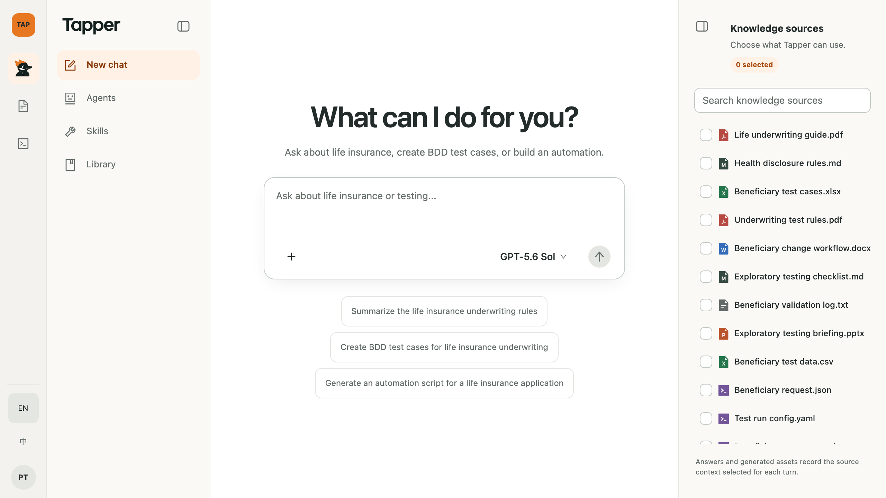

- **页面目的**：提供全产品统一的自然语言入口，并保持与测试管理、低代码自动化一致的视觉体系。
- **界面结构**：最左侧是一级产品 Rail；Tapper 激活后显示二级菜单 `New chat`、`Agents`、`Skills`、`Library`；中间是对话区；右侧是可折叠的 Knowledge sources。
- **演示重点**：输入框底部只显示 `GPT-5.6 Sol` 和下拉箭头，不出现 Fast、Ultra 或闪电图标；`+` 用于添加 Knowledge、AI Agent 或 Skill。
- **品牌与返回**：一级产品栏使用 Listening 图标，二级栏展开时只显示 Tapper wordmark。点击一级 Tapper 回到当前 Conversation 并保留草稿；`New chat` 才开启新会话。
- **建议话术**：“用户可以从一个问题开始，也可以先组合知识、Agent 和 Skill，再让 Tapper 生成测试资产。”

### 2. Conversation 历史与问题 Minimap

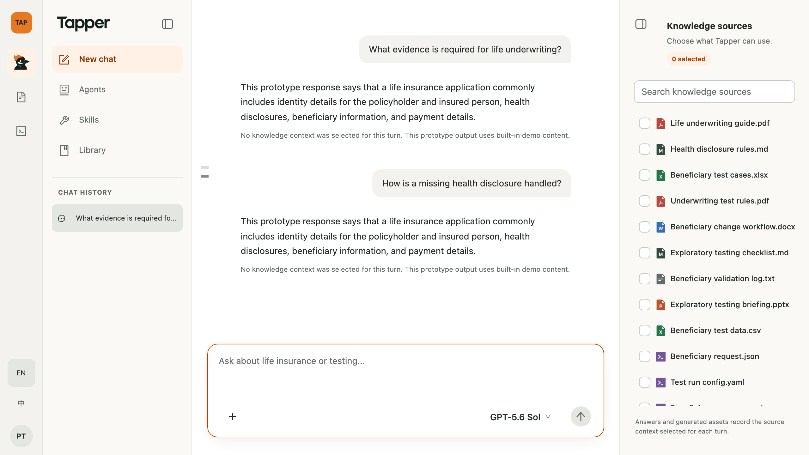

- **Conversation 规则**：未发送消息且未选择上下文的空白 New chat 不显示在历史中；发出消息或选入 Knowledge、Agent、Skill 后，该 Conversation 可显示在历史中。同一 Conversation 的后续问答继续追加，不会一问一条历史。
- **恢复行为**：当前纯前端原型使用版本化浏览器本地存储模拟跨模块和刷新恢复；这是原型恢复，不是服务端持久化。
- **Minimap 规则**：每个刻度对应一条用户问题；刻度集中在对话视口内，当前节点加粗并略微突出；节点很多时显示一个可浏览窗口，不会穿过底部输入框。
- **键盘效率**：当输入框为空且不在输入法组字状态时，按上方向键可召回本 Conversation 最近一次已发送内容，只填入、不自动发送。

### 3. 模型选择器

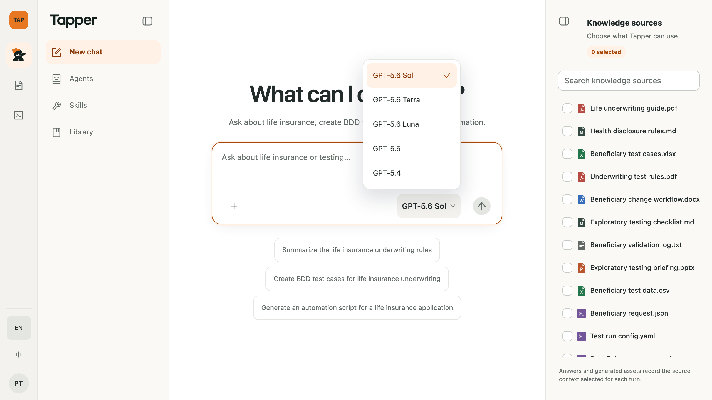

- **可选模型**：原型只展示 Codex 当前模型族，例如 `GPT-5.6 Sol`、`GPT-5.6 Terra`、`GPT-5.6 Luna`、`GPT-5.5` 和 `GPT-5.4`。
- **保存语义**：模型选择属于单个 Conversation；新对话默认回到 `GPT-5.6 Sol`，返回旧 Conversation 时恢复它自己的模型。
- **边界**：选择器验证交互与信息架构，不表示原型已经按该选择真实调用模型。

### 4. Composer 上下文入口

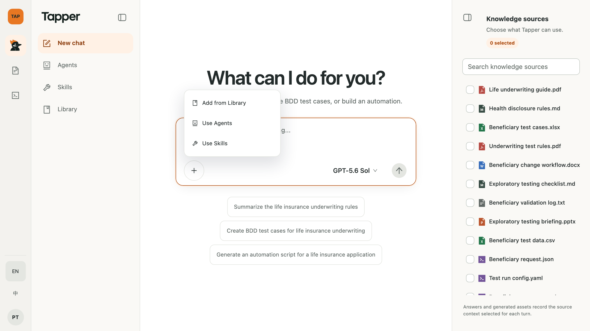

- `Add from Library`：添加本轮可使用的知识来源。
- `Use Agents`：选择负责领域分析和资产生成的 AI Agent。
- `Use Skills`：选择可复用的任务方法或能力包。
- `+` 默认无边框，hover 时显示边框；菜单展开后，点击菜单与触发按钮之外的区域即可收起，Esc 也可关闭。外部点击不会将焦点抢回 `+`。
- 发送后，知识源、Agent 和 Skill 标签从输入框清除；本轮选择保存在可展开的 Message context 中，下一轮按需重新选择。

### 5. 从 Library 选择知识来源

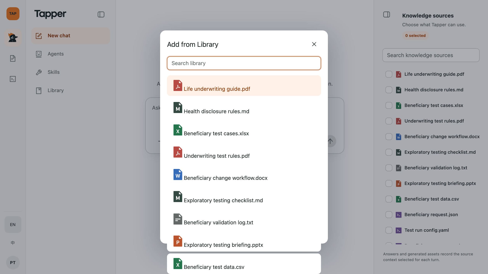

- 弹窗显示当前 Library 中可用来源，并支持关键字搜索。
- 点击来源后立即加入当前 Conversation 的 Composer 上下文。
- 演示时可选择 `Life underwriting guide.pdf`，再说明正式产品会在服务端执行权限校验、revision 绑定和引用溯源。

### 6. 选择 AI Agent


- 选择器突出 Agent 的职责，而不是把它与执行机器混在一起。
- 示例 `Life Underwriting Analyst` 负责寿险核保领域分析。
- 正式产品中 AI Agent 还需要版本、权限、工具白名单、审计和评测；当前为确定性原型目录。

### 7. 选择 Skill

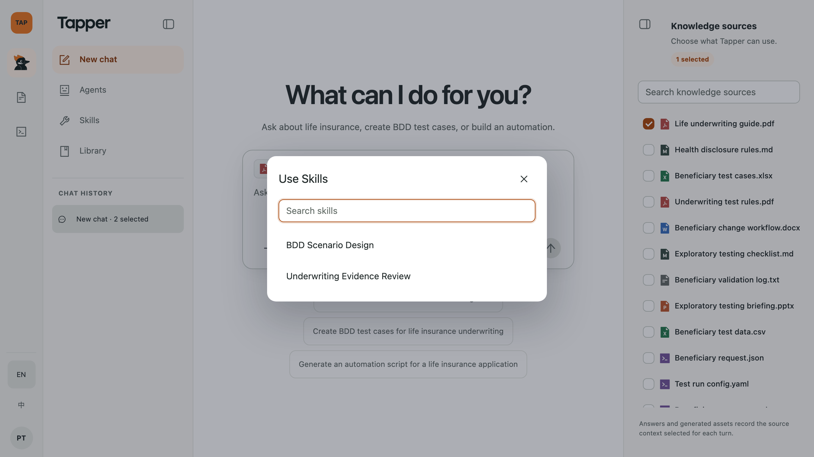

- Skill 表示可复用的方法，例如 `BDD Scenario Design`。
- Agent 回答“由谁分析”，Skill 回答“采用什么方法”，Knowledge 回答“可以依据哪些资料”。
- 三类上下文并列但语义独立，便于后续做权限、版本和溯源。

### 8. 已选择上下文与删除按钮

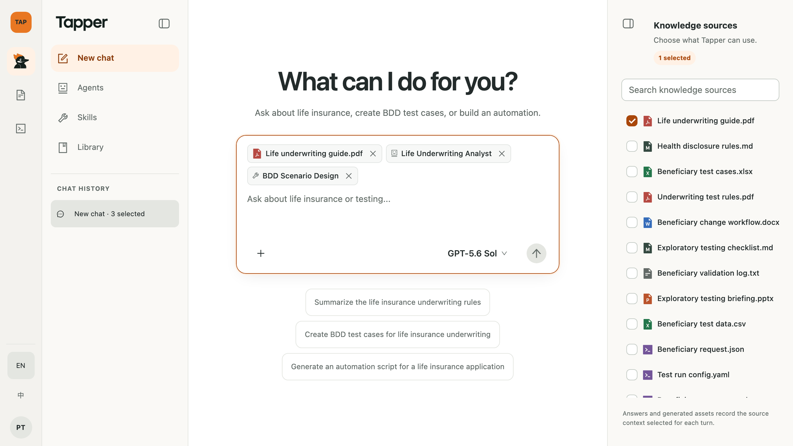

- Composer 同时显示 Knowledge、AI Agent 和 Skill 标签。
- 每个标签都有独立删除按钮，行为与 Codex 的可移除上下文一致。
- 右侧 Knowledge sources 同步显示选中数量和复选状态，让用户能从两个入口检查知识范围。

### 9. Agents 目录

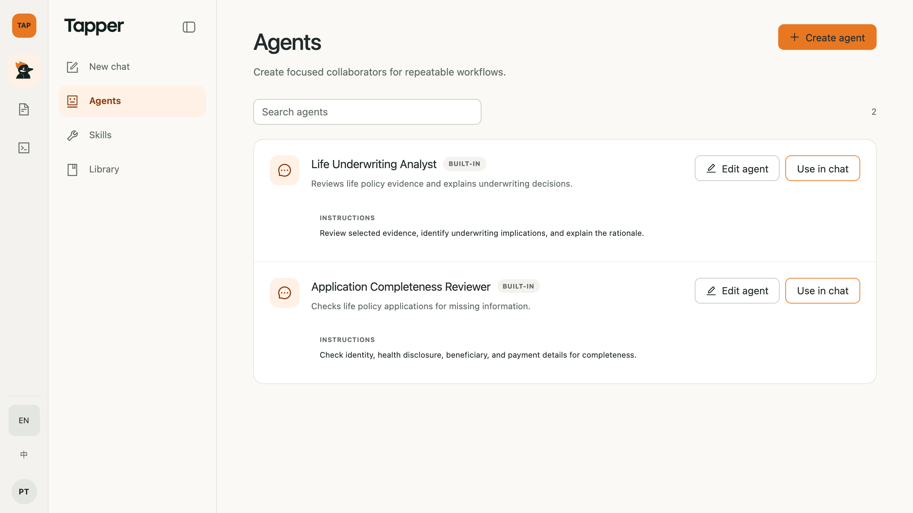

- **页面目的**：集中浏览和管理可用于 Tapper 的 AI Agent。
- **主要动作**：搜索、查看状态、在聊天中使用，以及进入创建流程。
- **演示重点**：该页面管理的是 AI Agent；Web 自动化详情中的 Execution Agent 是 Pipeline Agent，两者在入口、字段和措辞上完全分开。

### 10. 创建 Agent

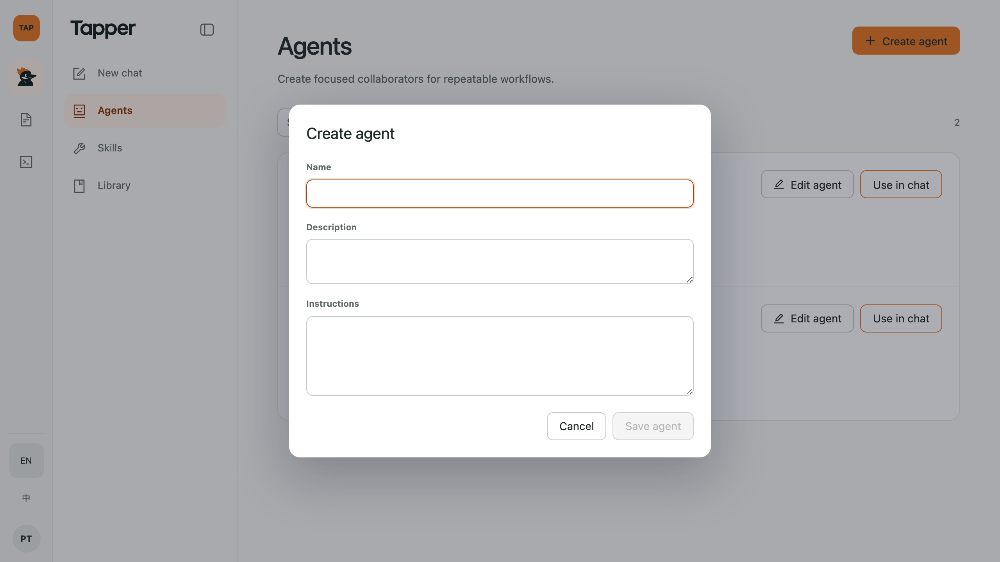

- 创建弹窗收集名称、描述和指令等原型字段。
- 用户完成创建后可以返回 Agent 目录，并在对话中选择该 Agent。
- 正式产品仍需补充版本发布、审批、权限、工具策略、模型策略和质量评测。

### 11. Skill 目录

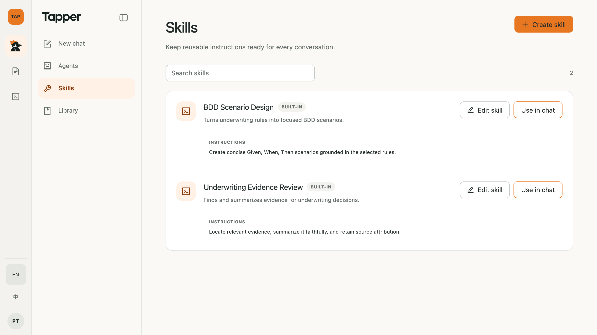

- **页面目的**：统一管理可复用的测试设计和分析方法。
- **主要动作**：搜索、查看状态、在聊天中使用，以及创建新 Skill。
- **客户价值**：把团队方法沉淀为可选择、可复用的资产，而不是依赖每个人重复编写 Prompt。

### 12. 创建 Skill

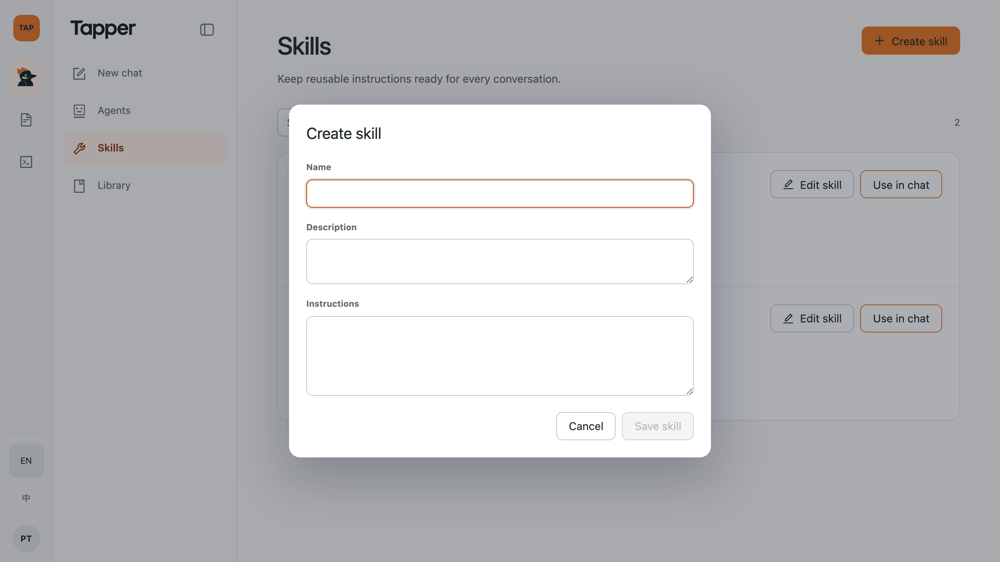

- 创建弹窗验证最小的信息架构和表单节奏。
- 原型中的创建结果是页面状态；生产版需要服务端版本、发布、权限和审计。

## 二、Library 与 Knowledge Graph

### 13. Library 默认图谱与无匹配状态

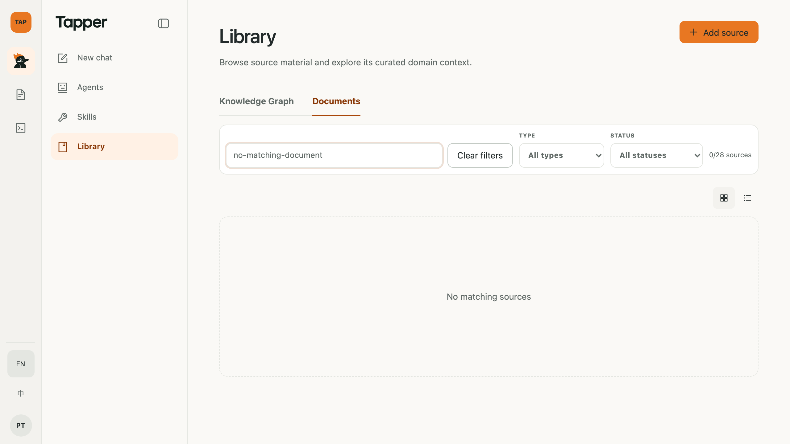

- 进入 Library 默认选中 `Knowledge Graph`；`Documents`（文档列表）位于第二个标签，替代旧的 `All`。
- 原型内置 28 份示例来源；搜索无匹配项时显示空状态并保留 `Add source`，清除筛选后恢复文件。
- 推荐先展示默认图谱，再切到文档列表解释知识来源；添加来源只验证页面级目录交互。

### 14. Documents 文档列表

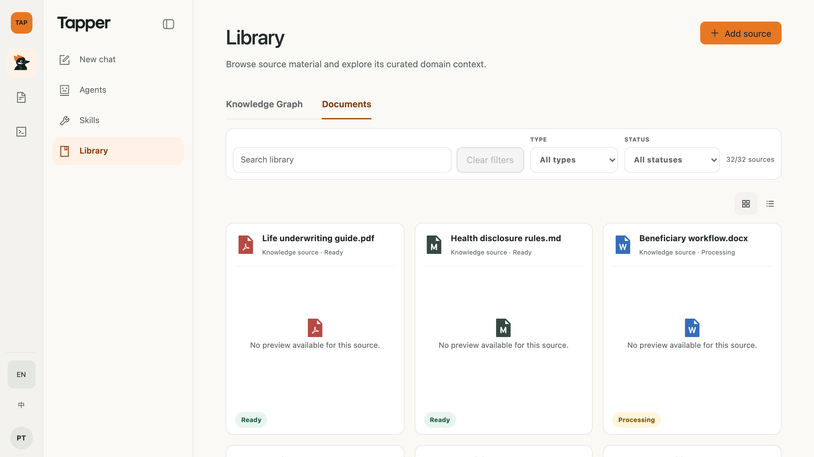

- 点击 `Documents` 默认进入卡片视图，可切换列表视图；展示来源名称、类型、状态和来源范围。
- 顶部同时提供关键字、类型、状态筛选以及 `Clear filters`。
- `32/32 sources` 让用户明确当前结果数和总数。
- 截图中的来源来自隔离截图流程提供的确定性示例目录，包含 ready、processing 和 failed 状态，不代表生产知识库已入库。

### 15. Library 组合筛选

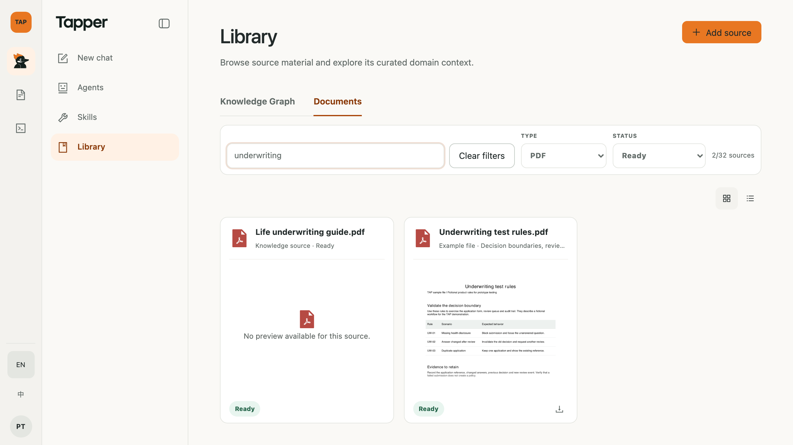

- 示例同时使用关键字 `underwriting`、类型 `PDF` 和状态 `Ready`，结果从 32 个收敛到 2 个。
- 组合筛选用于验证大规模资产目录的查找模式；正式产品的大列表还需要分页或虚拟化。
- `Clear filters` 可一键回到全部来源。

### 16. 添加来源

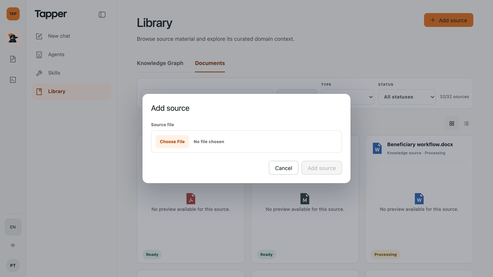

- 弹窗提供文件添加入口，并在提交前明确支持的原型文件类型。
- 添加的来源元数据保存在浏览器本地，刷新后可以恢复；这不代表文件已经上传或完成服务端入库。
- 生产版需要 ingestion 状态机、大小限制、恶意文件检查、权限、revision、删除传播和索引治理。

### 17. 默认 Knowledge Graph 与搜索定位

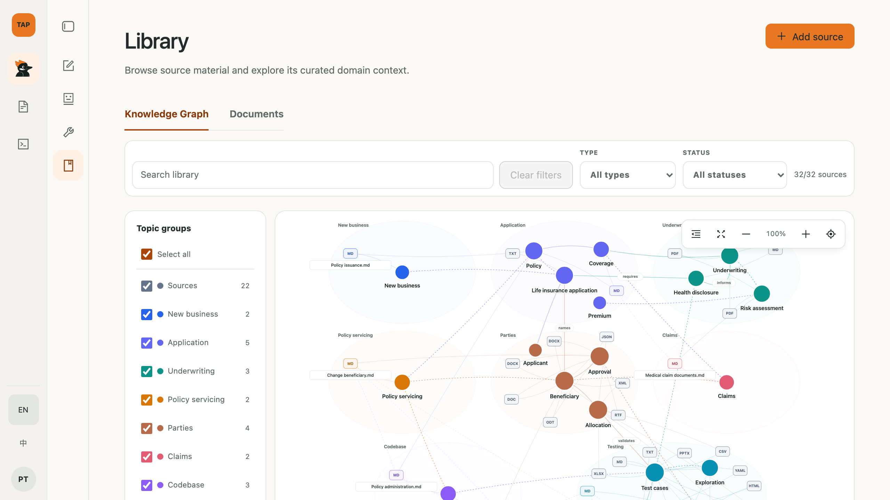

- **默认视图**：Library 首先展示图谱；画布使用页面剩余空间，支持平移、缩放、重置及进入/退出全屏。分类面板可以收起。
- **搜索**：顶部输入关键词后，结果区列出匹配的文档、概念和实体，并显示类型及所属分类。类型、状态筛选作用于来源文档；领域示例节点不因此变成真实来源。
- **定位**：例如输入 `disclosure`，点击结果中的 `Health disclosure`，画布将该节点居中、放大并高亮，同时展示节点详情。检索也会考虑文档描述；当前是本地关键词匹配，不是语义检索。
- **恢复**：清空搜索恢复图谱总览、100% 缩放并关闭节点详情；`Clear filters` 同时清除关键词、类型和状态筛选。没有匹配项时显示明确提示。
- **边界**：节点、关系、分类和布局来自确定性编排，不表示已经运行图谱抽取、生产图数据库或大规模节点聚合。大图分页、按需加载、聚合与容量验证仍未实现。

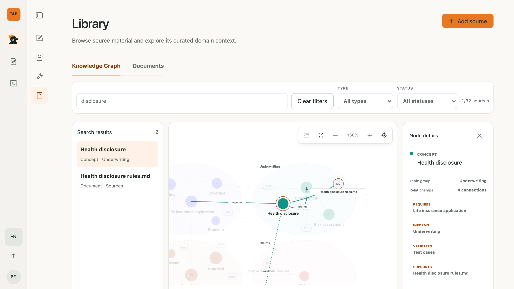

### 18. 节点详情与来源查阅

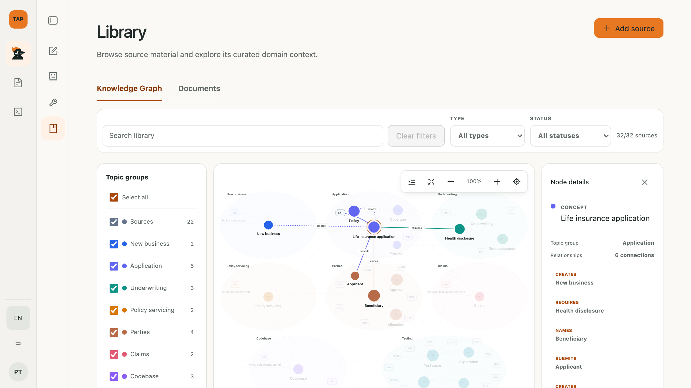

- 点击图中节点或搜索结果后显示详情，包括分类、连接数量、关系和抽取/推断标签；可通过关闭按钮收起详情。
- 文档节点额外显示来源说明；点击 `View source in document list`（在文档列表中查看来源）切换到 `Documents`，按该文档名定位记录。
- 此入口当前查看的是来源记录，不是原文预览、下载、revision 或段落锚点；图中抽取/推断标签也只是示例标注。
- 窄屏按顺序展示搜索结果、画布和节点详情；桌面使用侧栏。全屏适合展示关系结构。

## 三、Test Management

### 19. Test Plan 列表

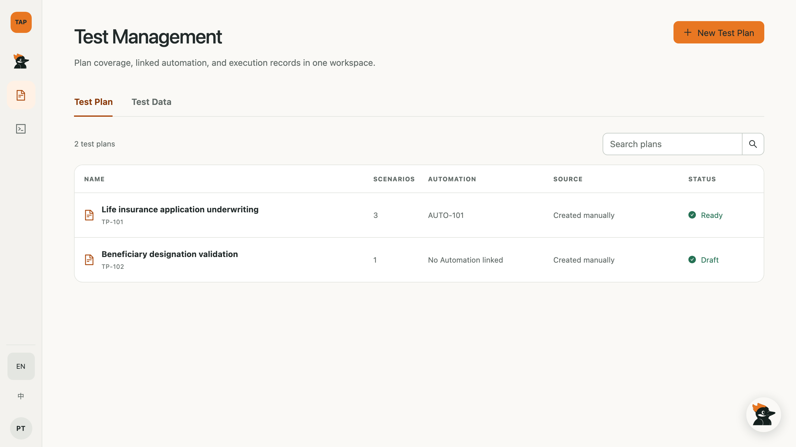

- **页面目的**：统一查看 Test Plan 的数量、状态、场景数和 Automation 关联状态。
- **入口行为**：点击某条 Test Plan 进入详情；顶层切换到 `Test Data` 管理测试数据。
- **核心规则**：一个 Test Plan 最多关联一个 Automation；一个 Automation 也最多关联一个 Test Plan，形成可选的严格 `1:1`。

### 20. 已关联 Automation 的 Test Plan 详情


- 顶部 `Linked Automation` 卡片显示 `AUTO-101`，可直接打开或解除关联。
- 中间 Scenario coverage 展示 BDD 场景和每个 Given/When/And/Then 步骤的稳定 ID。
- `Mapped · AUTO-101` 表示该场景已经映射到 Automation，而不是只有计划级标题关联。
- 右侧是执行配置和 Test Plan execution history；只有已关联 Automation 的运行结果才回写这里。

### 21. 从 Test Plan 配置执行

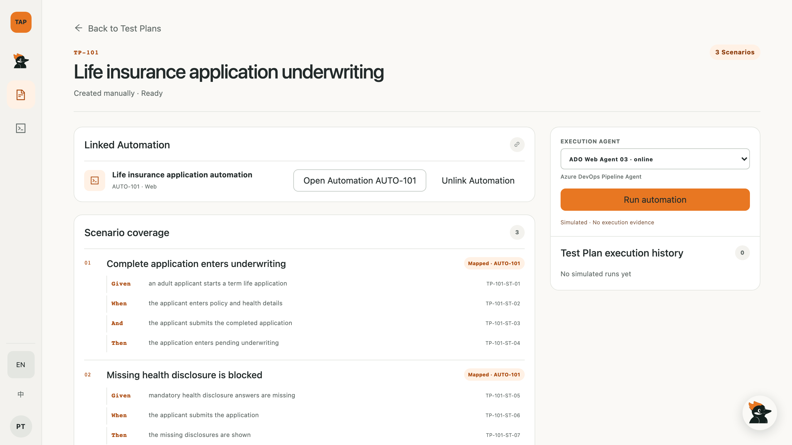

- 该遗留模拟屏幕要求先选择虚构的 Azure DevOps Pipeline Agent（例如 `ADO Web Agent 03`）再启用按钮；它只验证选择门禁交互。现行正式目标改为 Jenkins Pipeline Agent。
- 选择后才允许点击 `Run automation`，避免把 AI Agent 误当执行资源。
- 当前按钮触发的是模拟运行，并在页面上持续显示 `Simulated · No execution evidence`。

### 22. Test Plan 执行结果

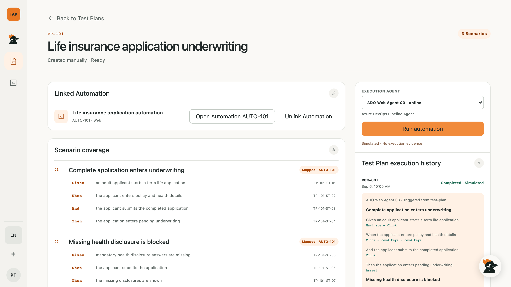

- 新增 Run 后，Test Plan history 记录 Run ID、时间、状态、触发入口和 Pipeline Agent。
- 每个 Scenario 下显示 BDD 步骤及其对应的动作摘要，让客户看到“业务步骤—自动化动作—运行记录”的连续链路。
- 同一份 Run 也会出现在关联 Automation 的历史中，避免两个模块分别生成互不一致的结果。
- 原型结果明确标为 `Completed · Simulated`，不能解读为真实系统通过。

### 23. 未关联 Automation 的 Test Plan

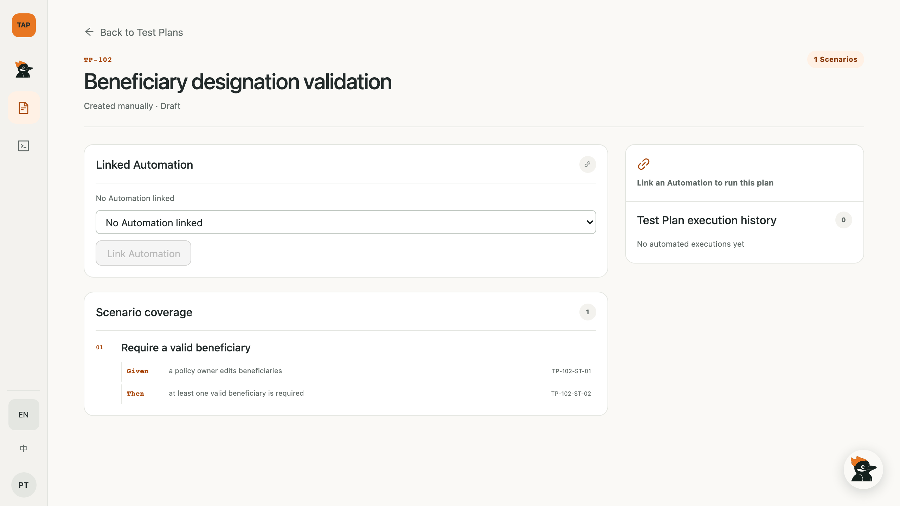

- 未关联时页面不提供可执行的 Automation 结果回写链路。
- 用户可以保留只用于人工评审的 Test Plan，也可以后续选择一个尚未被其他 Test Plan 占用的 Automation。
- 未关联 Automation 独立运行时，其结果不会出现在该 Test Plan 的执行记录中。

### 24. Test Data 页面

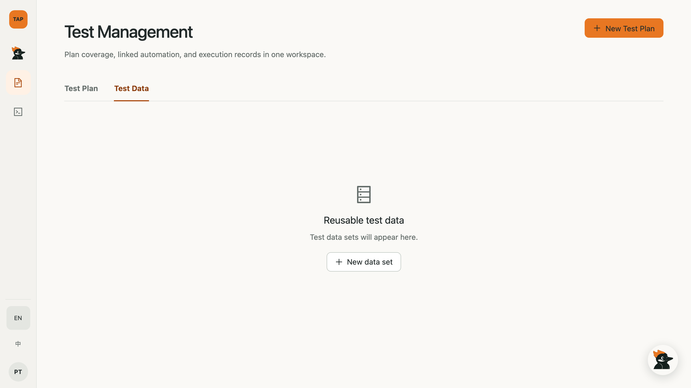

- Test Data 与 Test Plan 同属 Test Management，但保持独立页面语义。
- 当前页面验证数据集目录、数量和入口布局；生产版的数据脱敏、密钥引用、环境隔离和使用追踪仍需单独设计。

## 四、Low Code Automation

### 25. Automation Library

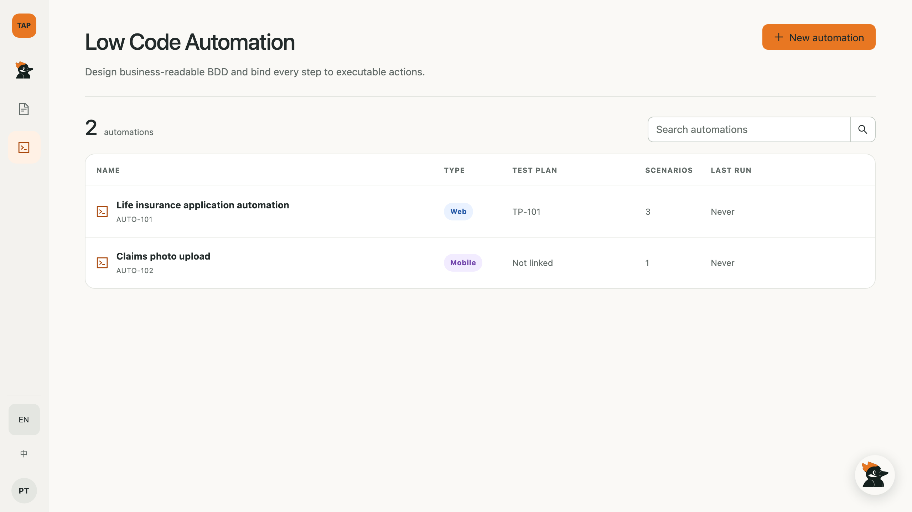

- 点击一级 `Low Code Automation` 后先进入资产列表，而不是直接打开某个寿险 Automation。
- 页面展示资产总数、搜索、类型、状态、关联 Test Plan 和最近更新时间。
- 每一行都是可独立打开、编辑、关联和执行的 Automation 资产。
- `New automation` 进入创建流程。

### 26. 创建 Automation

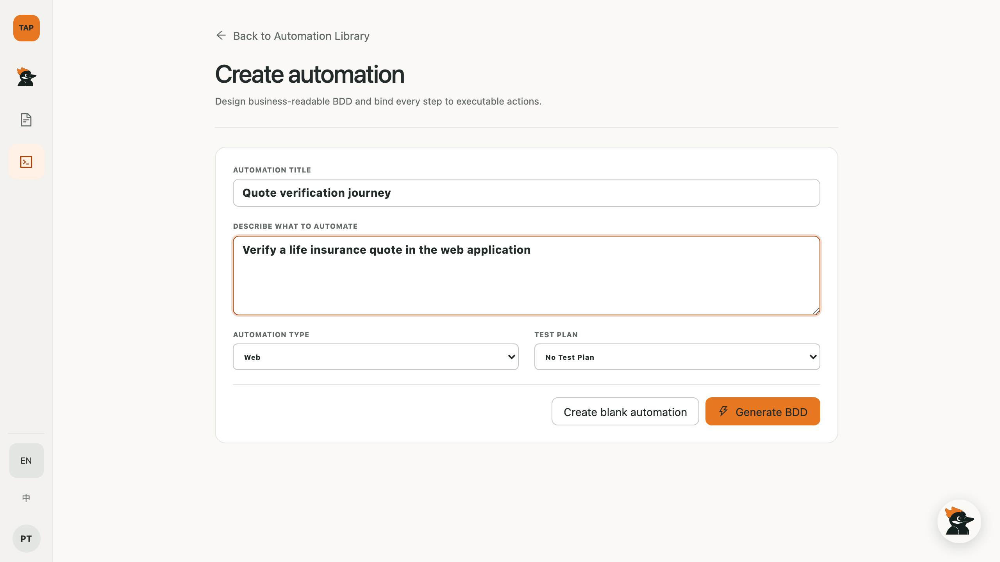

- 该遗留模拟屏幕允许用户选择 Web、Mobile 或让 Tapper 推断类型；现行正式目标只创建 Web Automation，Mobile 入口不属于 V0–P1。
- 用户可以手动编写 BDD，也可以在标题/目标中描述需求并通过 AI 生成草稿。
- 在该遗留原型的 Web/Mobile 双类型假设下，Tapper 无法可靠判断时会让用户明确选择；现行 Web-only 路线不再需要该类型推断。
- Test Plan 关联是可选的，但必须遵守严格 `1:1` 可用性校验。

### 27. Web Automation：BDD 与动作映射

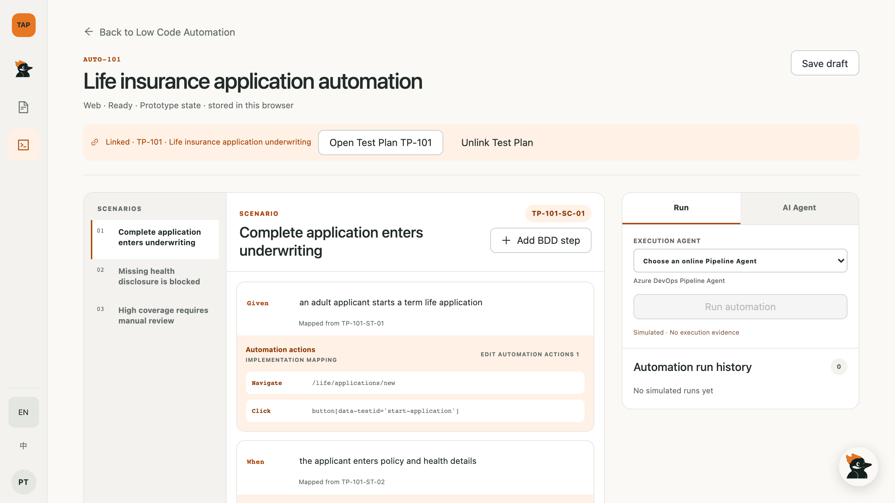

- 左侧列出 Scenario；中间显示当前 BDD 场景和步骤；右侧提供 Run 与 AI Agent 两个工作区。
- 每个 BDD 步骤下方都显示实现映射，例如 `Navigate`、`Click`、`Send keys`、`Assert`，解决“BDD 只是文字、看不到自动化动作”的问题。
- 页面顶部显示与 `TP-101` 的双向关联，并可直接打开 Test Plan。
- `Mapped from TP-101-ST-01` 等标识把 Automation 步骤追溯到 Test Plan 步骤。

### 28. 编辑自动化动作

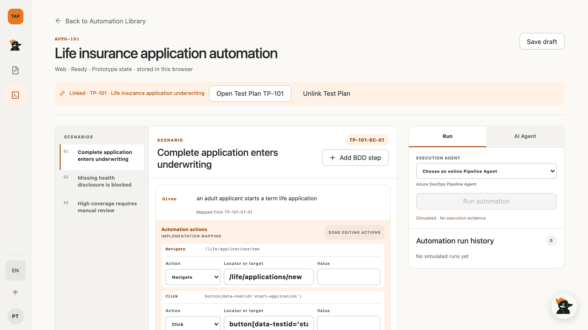

- 点击某个 BDD Step 的 `Edit automation actions` 后，可以调整动作类型、目标 locator 和输入值。
- 一个 BDD Step 可映射多个底层动作，例如先 `Navigate` 再 `Click`。
- 建议客户理解为“BDD 是业务可读层，Automation actions 是可执行实现层”，两层保持显式关联而非互相替代。

### 29. Automation 详情中的 AI Agent 对话

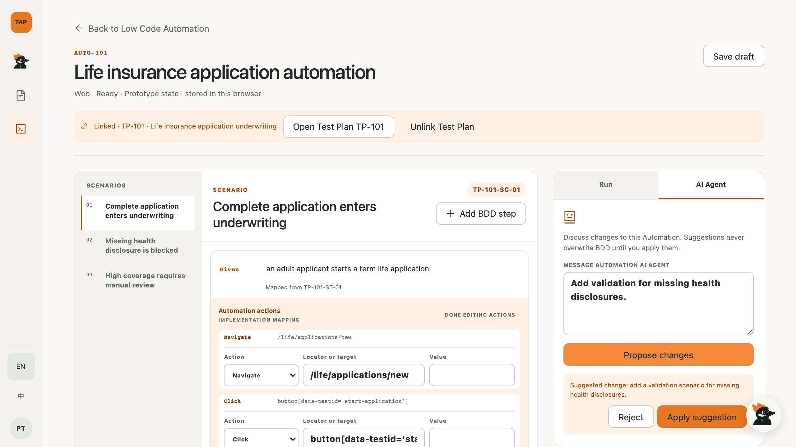

- 每个 Automation 详情都提供专属 AI Agent 区域，用户可以要求解释、补充或调整当前资产。
- 示例中 AI Agent 提议补充 `Missing health disclosure` 场景；用户可以 Review 后接受，也可以继续手动编辑。
- AI Agent 的修改应形成可审查候选，不应绕过权限、版本或人工确认直接修改生产资产。

### 30. Web Automation 执行与历史

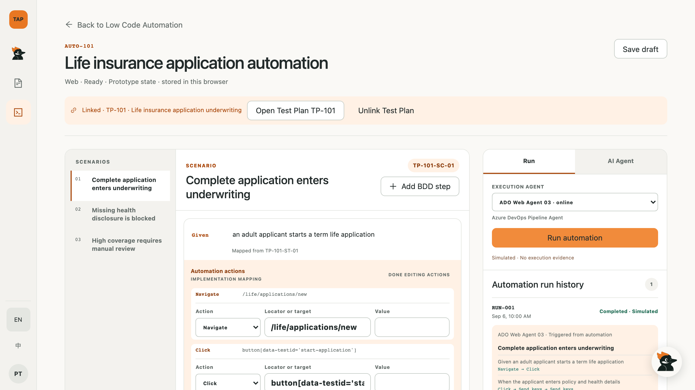

- 该遗留模拟屏幕通过 Execution Agent 下拉框选择 Azure DevOps Pipeline Agent；现行正式目标的 Web 执行使用 Jenkins Pipeline Agent。
- 运行历史显示触发来源：从 Test Plan 触发或从 Automation 详情触发。
- 若 Automation 已关联 Test Plan，两处引用同一 Run；若未关联，则结果只保留在 Automation 历史中。
- 所有当前结果仍标为模拟，且明确说明没有连接 provider、pipeline、browser 或 device。

### 历史附录 A：Mobile Automation 平台与设备（非主线演示）

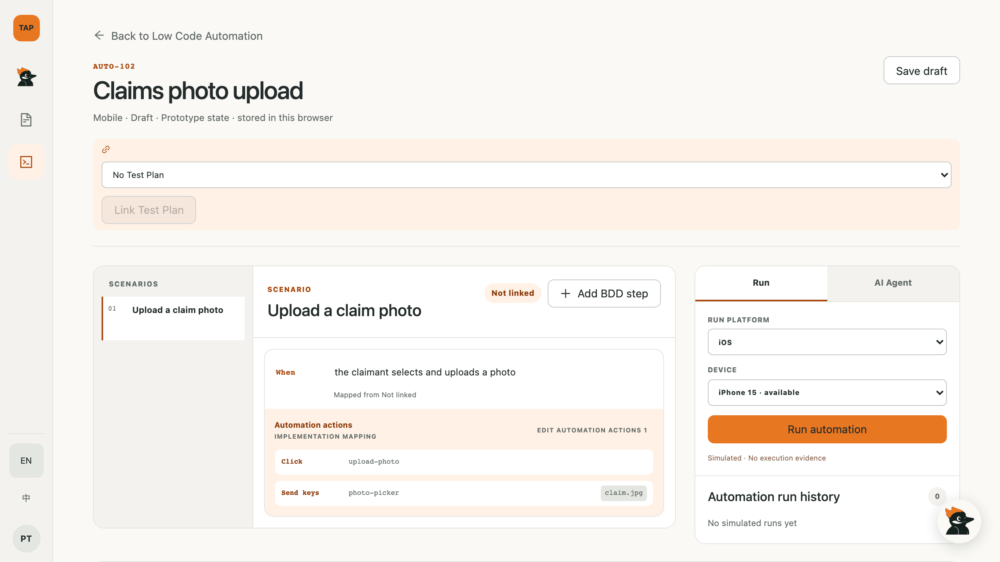

- Mobile 类型不选择 Pipeline Agent，而是先选择 `iOS` 或 `Android`，再选择该平台可用设备。
- 离线设备不可执行；在线设备满足条件后才启用 `Run automation`。
- BDD 步骤同样映射到底层动作，例如图片上传场景中的 `Click` 和 `Send keys`。
- 该 Automation 当前未关联 Test Plan，因此其 Run 不会出现在任何 Test Plan history。

### 历史附录 B：Mobile Automation 模拟运行结果（非主线演示）

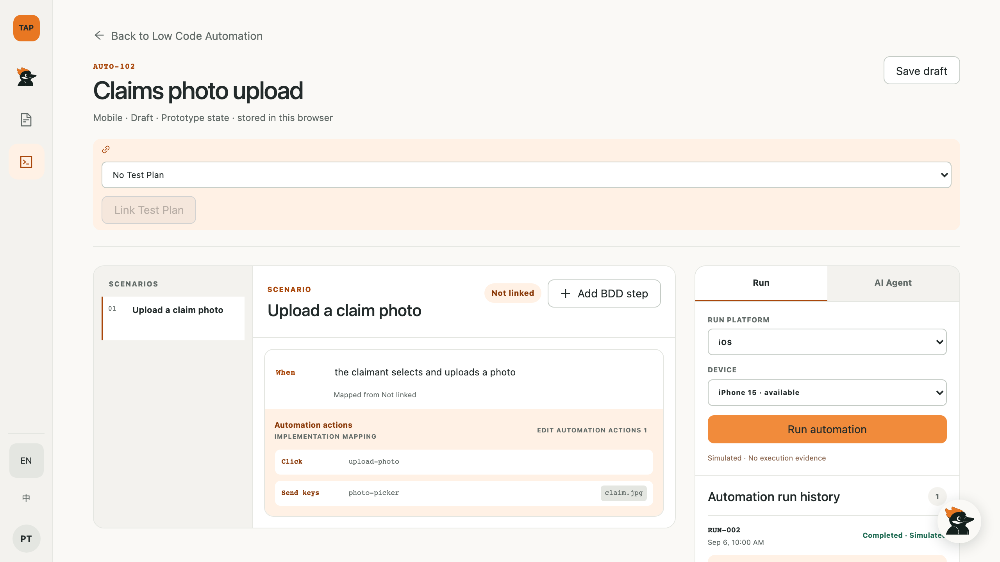

- Run history 记录设备、触发入口、场景、BDD 步骤和动作摘要。
- 未关联状态保持可见，用于向客户说明“Automation 可以独立存在和运行”。
- 原型未连接真实 iPhone、Android 设备云或自动化框架，不产生截图、视频、网络日志或其他真实 Evidence。

## 五、Tapper 生成 Test Plan 与 Automation

这一段建议作为演示高潮，完整展示 Tapper 如何把自然语言意图转换为可评审、可关联、可跳转的测试资产。

### 33. 先询问是否创建 Test Plan

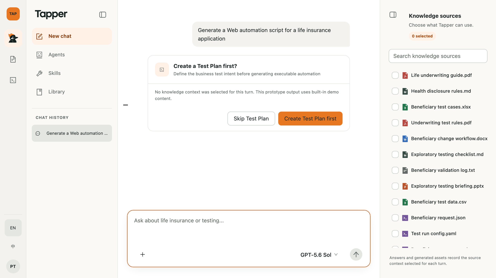

- 用户提出“为寿险投保生成自动化脚本”后，Tapper 不直接跳到代码，而是先询问是否创建 Test Plan。
- 用户可以选择 `Create Test Plan first`，也可以 `Skip Test Plan` 创建独立 Automation。
- 该决策保护业务测试意图：需要治理和结果回写时先建 Test Plan；一次性或独立脚本可以跳过。

### 34. Test Plan 草稿评审

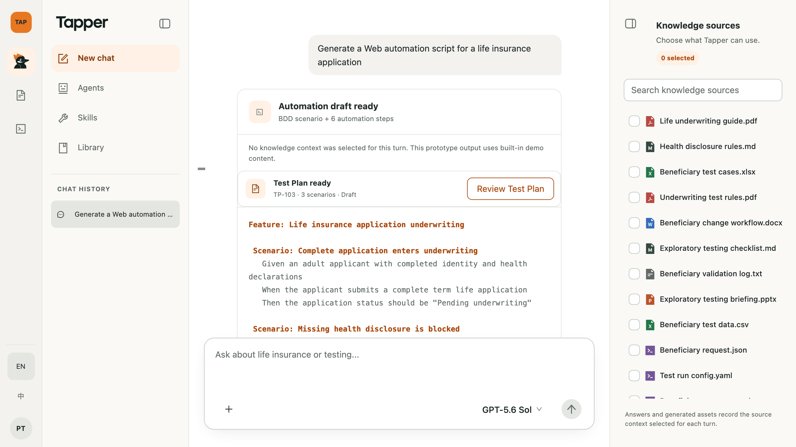

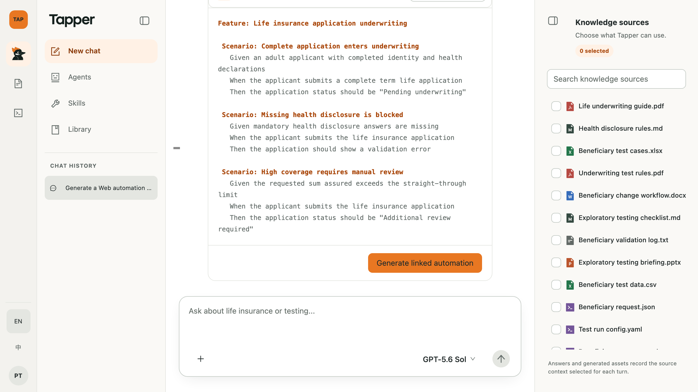

- Tapper 生成 Test Plan 草稿（截图示例为 `TP-103`），并提供三个 BDD Scenario。
- 用户可以先点击 `Review Test Plan` 检查业务覆盖，再继续生成 Automation。
- `Generate linked automation` 会以该 Test Plan 为来源创建 Automation，并建立严格 `1:1` 关联。
- 演示时强调 AI 生成的是可 Review 的资产草稿，不是未经确认的生产变更。

### 35. 遗留探索：无法判断时选择 Web 或 Mobile

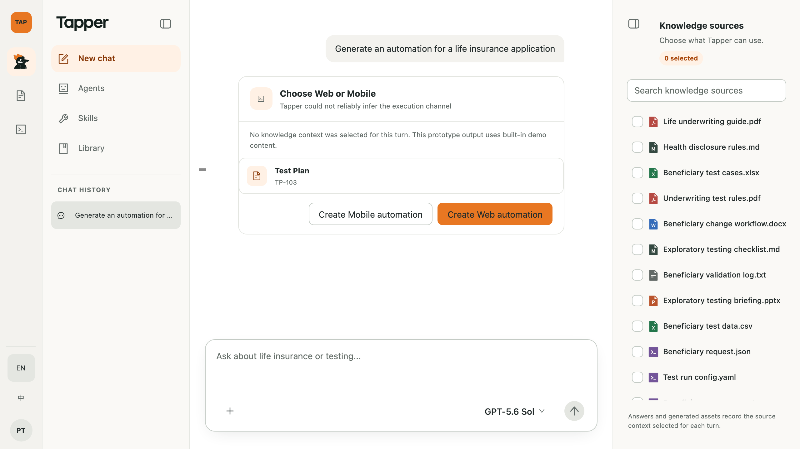

- 该屏幕记录旧的 Web/Mobile 双类型探索：当用户意图无法可靠区分时，Tapper 展示明确选择，不做隐藏推断。
- 遗留原型中 `Create Web automation` 进入 Pipeline Agent 执行模型，`Create Mobile automation` 进入平台和设备选择模型；现行正式路线只保留 Web/Jenkins，Mobile 选择仅供历史交互讲解。
- 这保留了“模型承认不确定性”的历史交互原则，但不构成现行 Mobile 范围。

### 36. 生成关联资产与双向跳转

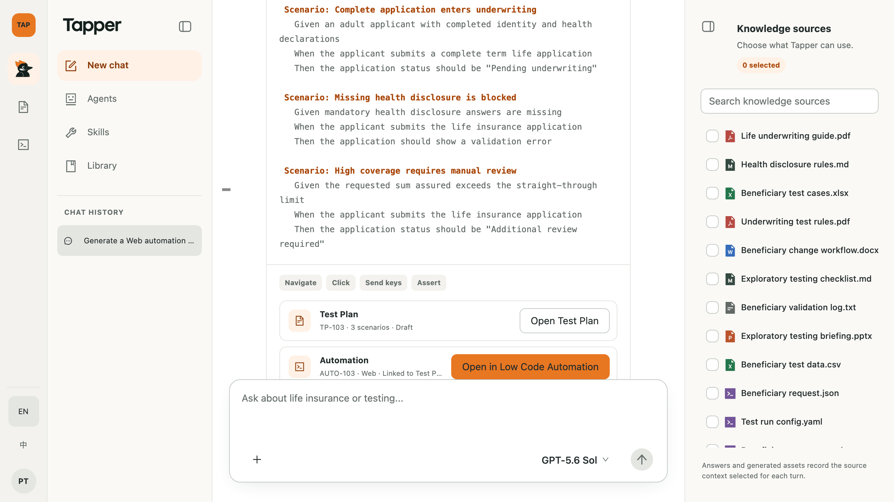

- 最终卡片同时显示 Test Plan 与 Automation（截图示例为 `TP-103` 和 `AUTO-103`），并明确 Automation 类型为 Web、已关联 Test Plan。
- `Open Test Plan` 跳转到 Test Management 详情；`Open in Low Code Automation` 跳转到 Automation 详情。
- BDD 场景和动作类型摘要保留在对话结果中，用户可以先在 Tapper Review，再进入专业工作区继续编辑或执行。
- 后续从任一详情发起的模拟运行会遵守同一关联关系和共享历史语义。

## 六、长对话导航与工作区折叠

### 37. Minimap Hover 预览

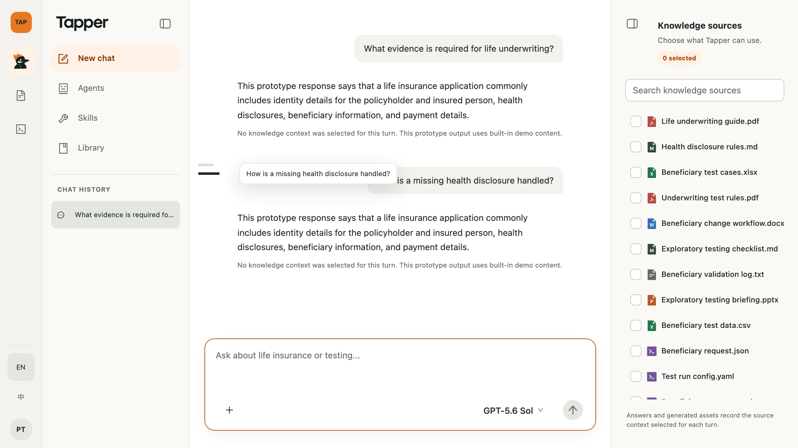

- 每条用户问题生成一条左对齐短刻度。
- Hover 或键盘 Focus 到某个刻度时，该刻度有限加长，并显示对应用户问题的预览卡片。
- 点击节点可直接跳到相应问答位置；当前节点加粗，邻近节点按有限层级变化。
- 问题数量超过视口后，Minimap 使用窗口化浏览，底部边界止于输入框上方。

### 38. 收起 Knowledge sources

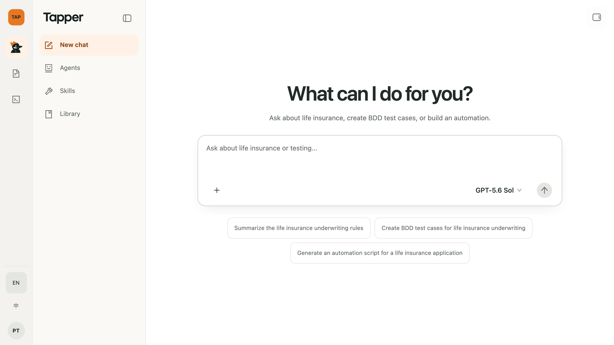

- 点击右侧 Codex 式面板图标后，Knowledge sources 平滑收起，主对话区扩展。
- 收起后图标的内部线条方向发生变化，让用户能从形状判断下一次点击会展开哪一侧。
- 适合长回答、代码或 BDD 内容的专注阅读。

### 39. 同时收起 Tapper 二级菜单

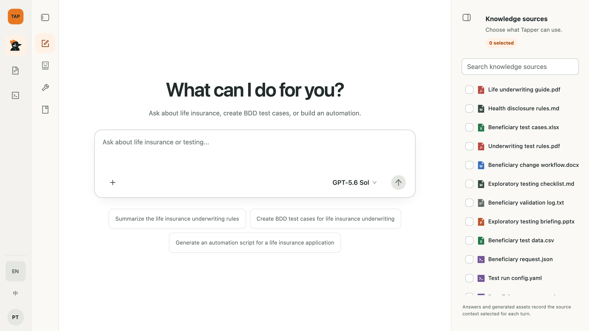

- Tapper 二级 Sidebar 收起后保留窄图标栏：展开按钮、New chat、Agents、Skills 与 Library，当前入口保留选中态，hover 可查看名称。按钮位于导航栏内，不再遮挡页面标题。
- 一级产品 Rail 也保持常驻。点击 Tapper 回到当前对话，保留会话与草稿；进入 Library、Agents 或 Skills 不必先展开菜单。展开后可访问对话历史。
- 左、右面板都收起时，中间获得最大的阅读宽度，Minimap 和固定 Composer 仍保留。
- 两侧使用同一套面板图标语义、动画节奏和选中反馈，避免出现不同组件各自为政的体验。

## 七、跨页面 Tapper 悬浮助手

### 入口与上下文

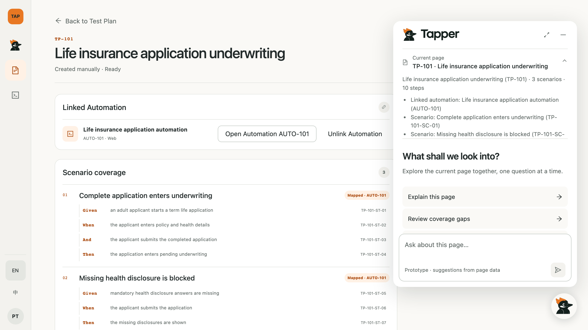

- 只在 **Test Management** 和 **Low Code Automation** 页面右下角展示悬浮入口；Tapper、Agents、Skills、Library 属于 Tapper 工作区，不重复显示入口。
- 默认使用 **Listening** 形象，表示助手等待提问。点击后展开面板，展示当前页面或已打开资产的上下文摘要与事实；空会话中提供三条快捷提问，已有消息时显示会话内容。
- 上下文只使用原型已经加载的页面数据；发送时记录快照，后续切换页面不会改写旧回复依据。新建 Automation 表单尚未保存的输入不属于上下文。

### 建议演示动作

1. 为演示快捷提问，先在 Tapper 中选择 `New chat`，再打开 Test Management 中的 `TP-101`，点击右下角 Tapper。
2. 展开“当前页面”检查资产名称和事实，选择一条快捷提问；提示会填入输入框，点击发送或按 Enter 才提交。
3. 说明回复中的原型提示：建议由页面数据确定性生成，不代表真实模型分析、自动执行或修改资产。
4. 收起面板后若收到新回复，入口切换为 **Aha**；再次打开查看后恢复 Listening。该状态用于表达“有新发现”，不表示缺陷已被真实检测确认。
5. 再输入一段未发送内容，点击 `Continue in Tapper`（在 Tapper 中继续）：同一会话、已有消息、草稿与当前页面上下文一起进入 Tapper；可继续提问或移除上下文标签。

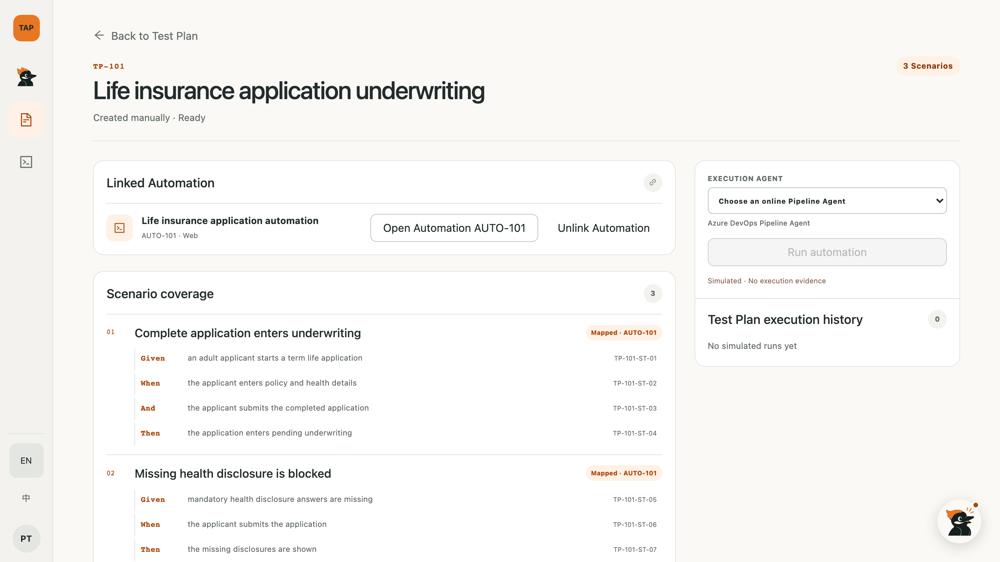

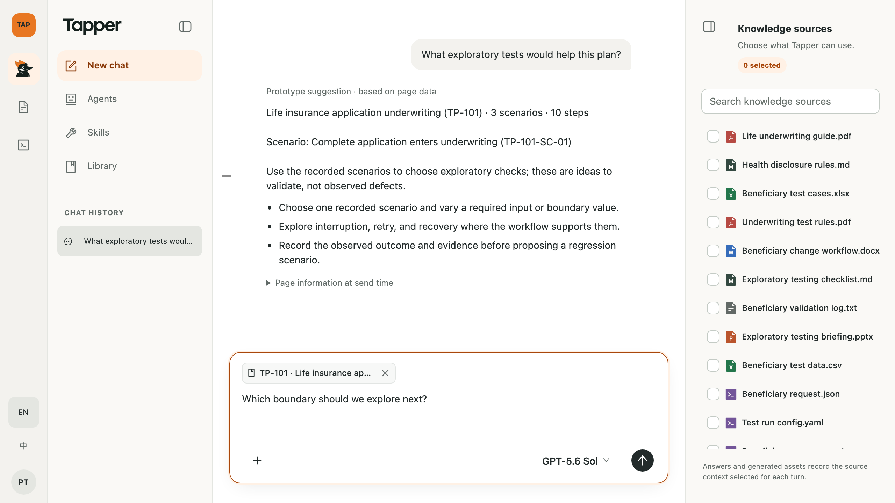

面板收起保留当前草稿，Esc 可关闭并将焦点返回入口；草稿是页面内状态，不承诺刷新恢复。已发送的会话内容沿用原型浏览器本地存储语义。

## 建议的现场演示脚本

### 路线 A：12–15 分钟完整演示

1. 从 Tapper 新对话首页说明一级 Rail、二级 Tapper Sidebar 和三栏布局。
2. 打开模型菜单，说明模型按 Conversation 保存，但当前只是选择器原型。
3. 通过 `+` 依次添加一个 Knowledge、一个 AI Agent 和一个 Skill，再逐个展示可删除按钮。
4. 进入 Library，展示默认图谱；搜索 `disclosure` 并定位 `Health disclosure`。清空搜索后切换 Documents，演示组合筛选与 Add source；收起二级菜单，再点击一级 Tapper 返回原会话。
5. 进入 Test Management，打开 `TP-101`，指出 Scenario、BDD Step ID、`Mapped · AUTO-101` 和 Linked Automation。
6. 如需讲解遗留截图，可选择 `ADO Web Agent 03` 触发模拟运行，同时明确它不是现行 Provider；现行目标使用 Jenkins Pipeline Agent，并保留同一 Run 投影到 Test Plan 与 Automation history 的语义。
7. 进入 Low Code Automation，打开 `AUTO-101`，从 BDD Step 展开 Click、Send keys、Navigate、Assert 映射。
8. 切到 AI Agent 标签，展示“建议—Review—人工决定”的调整方式；再打开右下角 Tapper，检查页面上下文、发送快捷问题，并通过“在 Tapper 中继续”交接同一会话和草稿。
9. Mobile 页面仅作为遗留模拟探索选讲；必须说明 iOS/Android/设备能力不在当前正式路线，P1 后才可能另行设计。未关联时不回写 Test Plan 的规则仍可用于解释产品语义。
10. 回到 Tapper，新建 Conversation，输入 `Generate an automation script for a life insurance application`。
11. 选择先创建 Test Plan，Review BDD 草稿并继续生成关联的 Web Automation；Web/Mobile 不确定提示仅在讲解遗留交互时展示。
12. 用最终两个资产卡片收尾：分别跳转 Test Plan 和 Automation，强调 Tapper 是跨模块编排入口，不是取代专业工作区。

### 路线 B：5 分钟管理层演示

1. 展示 Tapper 新对话首页：统一入口与上下文组合。
2. 进入 Library 的默认图谱，搜索并定位一个节点；说明可从关系探索切换到文档检索。
3. 展示已关联 Test Plan，并打开右下角 Tapper，演示针对当前资产提问及返回完整会话。
4. 展示 Web Automation：BDD 步骤与底层动作一一可见。
5. 展示 Tapper 最终资产卡片：从自然语言得到关联的 Test Plan 和 Automation，并能双向跳转。

## 客户常见问题与回答口径

### “AI Agent 和 Execution Agent 有什么区别？”

AI Agent 在 Tapper 或 Automation 详情中负责理解意图、生成 BDD、提出修改建议和辅助 Review。Execution Agent 是 Pipeline Agent，负责在获得配置后执行 Web Automation；现行首个 Provider 是 Jenkins，Azure DevOps 只存在于遗留模拟截图。生产版中两者的权限、生命周期、审计和故障模型完全不同。

### “一个 Test Plan 能关联多个 Automation 吗？”

当前已确认产品规则是可选的严格 `1:1`：一个 Test Plan 最多关联一个 Automation，一个 Automation 也最多关联一个 Test Plan。未关联资产可以独立存在，但不会把运行结果写入 Test Plan history。

### “Test Plan 中点击运行后，结果在哪里看？”

若已关联 Automation，Test Plan 与 Automation 引用同一个 Run，两个页面都可看到同一份状态和步骤摘要；若没有关联，Test Plan 不显示该 Automation 的结果。原型 Run 明确标为 `Simulated`。

### “BDD 与 Click、Send keys 是什么关系？”

BDD 是业务可读的意图层；每一个 BDD Step 下方有显式 Automation actions 实现映射。一个业务步骤可以对应一个或多个 Navigate、Click、Send keys、Assert 等动作，并记录它来自哪个 Test Plan Step。

### “Conversation 会丢失吗？”

原型使用浏览器本地存储模拟刷新和跨模块恢复；同一 Conversation 的多轮问答保持在一条历史记录中。生产版仍需要服务端 Conversation API、身份、权限、同步、保留策略和审计。

### “Knowledge Graph 已经是生产能力吗？”

不是。当前图谱验证默认入口、关键词搜索定位、全屏探索与来源记录跳转；领域节点、关系、主题分组和布局来自确定性编排，来源节点取自当前目录。搜索不代表真实语义检索，尚未实现大规模图谱聚合与原文证据跳转。已接受的正式方案选择 **MySQL 保存 Knowledge Graph 权威数据、Milvus 保存可重建文档检索投影**，但尚未实现；后续仍需完成抽取、证据绑定、权限、增量更新和质量评测链路。

### “在知识库怎么回到刚才的对话？”

点击最左侧一级产品栏的 Tapper 图标，回到当前 Conversation，保留页面内草稿。二级菜单收起后仍有图标导航；需要换一条历史会话时展开菜单并选择历史记录。`New chat` 用于开启新会话，不是返回按钮。

### “悬浮助手能自动发现缺陷吗？”

当前不能。它基于已加载的页面事实生成确定性原型建议，用于验证上下文提问和跨页面交接；Aha 只表示有未读回复。真实分析、工具调用、缺陷确认和资产修改需要后续服务端能力与相应权限。

### “模型选择会真实调用对应 GPT 吗？”

当前页面只验证模型选择交互和 Conversation 级保存语义，不应据此承诺真实模型调用。生产接入还需要模型网关、配额、成本、数据边界、可用性和回退策略。

## 演示结束时的三句话

1. TAP 把知识上下文、业务测试意图、低代码实现和执行记录放进一条可审查链路。
2. Tapper 负责理解、生成和跨模块引导；Test Management 与 Low Code Automation 仍是专业资产工作区。
3. 当前产品壳中的 Conversation、Test Plan、Automation 和 Run 仍是纯前端交互原型；现有 Tapper 本地知识切片已经具备文档、ingestion 与索引状态持久化，但服务端会话/测试资产、权限、Jenkins、Recorder、真实浏览器执行和 Evidence 仍需后续工程化交付。
