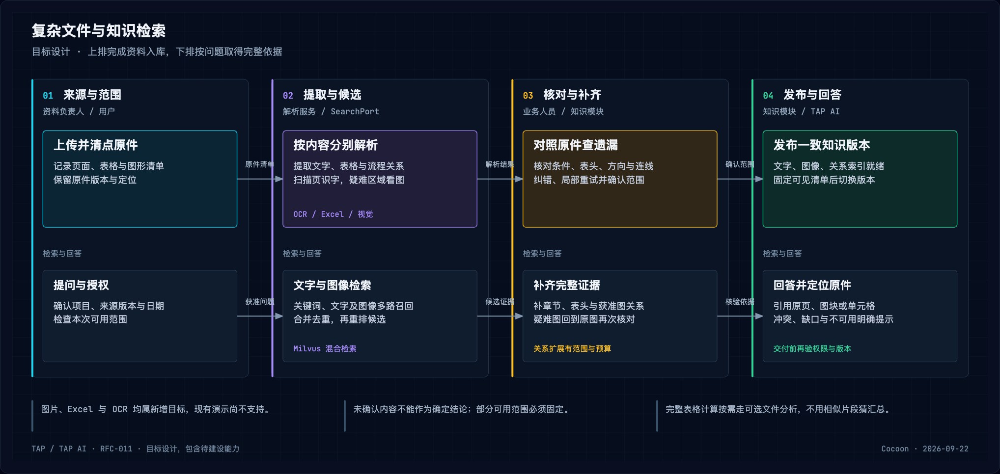
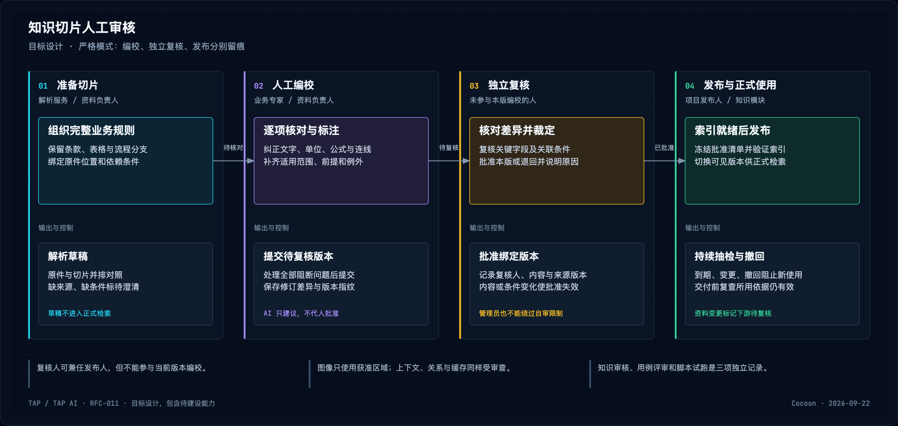
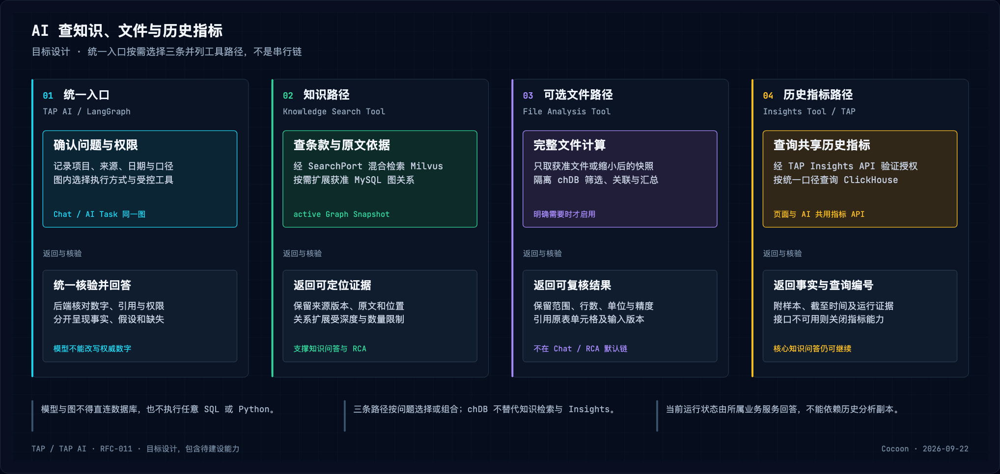
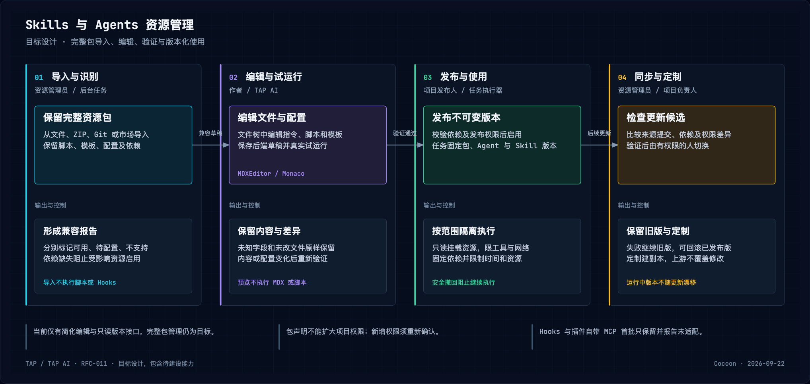

# RFC-011 开发参考：AI 编排、主动 Agent 与知识设计

本文形成于 2026-09-22，是 [RFC-011](../proposals/2026-09-17-rfc-011-rag-test-design-cross-platform-automation.md) 的 `draft` 配套技术说明，不是新 RFC、已接受架构或实施完成声明。以下“采用”“必须”描述提案目标约束；产品边界遵循 ADR-027，统一图目标见 ADR-029，当前完成状态仍以 [V2/V3 更正评审](../reviews/2026-09-14-v2-v3-gate-correction.md) 和代码为准。

相关专题：[测试管理与执行](2026-09-22-rfc-011-testing-execution-design.md)、[Insights、跨产品契约与恢复](2026-09-22-rfc-011-insights-contracts-design.md)。

## 当前基础与目标边界

- 已有 PDF/DOCX/MD/TXT 文字解析、基本结构分段、Milvus 关键词/向量融合、ModelGateway/LiteLLM 和计划生成基础。纯图片 PDF 返回 `ocr-required`；混合 PDF 无文字页可能跳过，DOCX 主要提取段落/表格，长表仍按文字长度分段。
- 图片、Excel 图形、OCR、图像索引、模型重排、统一 LangGraph、主动测试运营与完整 Skills/Agents 包管理均为新增或扩展目标。当前 Skills/Agents 浏览器草稿仅含名称/描述/指令，导出单个 Markdown；后端已有批准版本只读查询。
- TAP AI 自有 Chat/AI Task 共用编排，不建设通用租户 Agent 平台。RFC-006/ADR-018 的 loopback、单操作者、无工具 Codex Answer Adapter 保持独立；不因本提案改写该能力或已有阶段状态。
- 知识库仍位于 Tapper 工具区，问答仍在 Tapper 对话；测试管理直接发起生成与对话发起生成进入同一后台流程，结果链接同一计划。

代码核对：[解析器](../../apps/tap-ai-backend/src/tap/modules/knowledge/adapters/document_parsers.py)、[分段器](../../apps/tap-ai-backend/src/tap/modules/knowledge/adapters/document_chunker.py)、[Milvus](../../apps/tap-ai-backend/src/tap/modules/knowledge/adapters/milvus/transport.py)、[计划生成器](../../apps/tap-ai-backend/src/tap/modules/test_management/adapters/model_gateway_generation.py)、[资源接口](../../apps/tap-ai-backend/src/tap/interfaces/http/routes/ai_assets.py)。

## 统一 AI 编排与领域端口

后端在图外只校验当前用户、项目、Conversation/Turn/Task、授权范围、幂等键与基础输入。固定版本 LangGraph 内的 **Task Classification & Admission** 负责分类与准入，必要的首轮理解也经 ModelGateway→LiteLLM 调模型；不存在图外预分类 LLM、独立 Query Router 或 Model Router。

图记录 `execution_mode=inline|durable`、`reasoning_mode=direct|workflow|agentic`、模型层级建议和预算。执行时长与推理复杂度分别表达，三种剖面共用身份、状态、权限、审计、引用、响应核验及结束处理：

| 剖面 | 用途 | 边界 |
| --- | --- | --- |
| Fast Chat | 澄清、普通知识问答、单次受限检索或生成 | 在线低延迟；不进入反思、修复或多轮 Agentic Loop；仍走统一图与调用预算 |
| Durable Workflow | 已知步骤的计划生成、批量核对、完整文件处理、人工/外部等待 | 类型化节点、Task/GraphRun、MySQL checkpoint、Outbox、Redis 唤醒、独立 Worker；支持进度、暂停、恢复、取消、超时及幂等重试，默认不启用 Agentic Loop |
| Bounded Agentic Task | 多步检索、RCA、工具组合、观察及有限修复 | 限制步骤、时间、工具次数、费用；缺证据/权限、耗尽预算或需人工确认时停止；超在线预算或需等待则使用 durable runtime |

Fast Chat 可在外部副作用前记录提升原因并转 Durable Workflow；不能静默截断或把排队当完成。图状态保存任务类型、计划、工具输入输出、已核事实、待证假设、引用、预算与暂停原因，不保存或展示模型隐藏思维链。任务管理负责队列/租约/领取/终态，图负责节点顺序/条件/暂停继续，领域模块负责正式发布、执行、质量判断与权威数据。

| 端口 | 固定目标路径 | 约束 |
| --- | --- | --- |
| 生成模型 | 图节点→ModelGateway→LiteLLM→获准供应商部署 | Gateway 检查能力、`fast/standard/reasoning/coding` 等逻辑层级、结构化 I/O、超时、重试、费用与用量；后端策略最终裁定，LiteLLM 只映射获准别名 |
| 知识 | Knowledge Search Tool→SearchPort→Milvus hybrid search→按需扩展已授权 active MySQL Graph Snapshot | 限制深度、节点数和关系类型；每次扩展再核项目、来源版本、发布范围、Snapshot 与引用 |
| 历史指标/RCA | Insights Tool→TAP Insights API→ClickHouse | 正式服务身份及 TAP 再授权；指标目录、查询编号和截至时间可追溯；失败明确返回指标能力不可用，核心知识 Chat 可继续 |
| 可选文件计算 | File Analysis Tool→隔离 chDB | 仅当前获准文件/快照；不是 Chat、长任务或 RCA 默认主链，不持平台数据库凭证 |
| 正式领域动作 | TAP Domain APIs/所属领域适配器 | 发布、资产修改、Run、Jira 写入由领域权限和幂等保护；模型不直连数据库、Jenkins 或 Jira |

SearchPort 内部的 query embedding/重排由 ModelGateway 专用能力与适配器记录，自部署图像模型不强行绕行 LiteLLM 未验证接口。OCR/转换由解析服务执行。图版本、原子检查点和副作用对账详见 [恢复契约](2026-09-22-rfc-011-insights-contracts-design.md#任务状态与恢复)。

RCA 示例路径：创建/恢复 Conversation、Turn→图内分类为 `root_cause_analysis` 和受预算 agentic/durable 剖面→Insights 查近 30 天失败率、异常起点及模块/错误样本→SearchPort 查相似 Defect、Troubleshooting KB、Release→图分开保存事实和原因假设→后端核验数字与引用后回答。该链不依赖 chDB。

## 复杂文件解析与检索

[查看 SVG](../assets/rfc-011/2026-09-17-knowledge-processing-retrieval.svg)。解析完成不代表内容完整；逐页/对象清点与原件复核在索引前完成。

### 处理技术与资产模型

| 环节 | 确定选型 | 具体限制 |
| --- | --- | --- |
| 原生文字/预览 | pypdf、python-docx；新增 pypdfium2、LibreOffice headless | PDF 渲染原页，Office 隔离转换并标记差异；保留原件，不执行宏、不刷新外部连接 |
| 扫描/版面/表格 | PaddleOCR PP-StructureV3 | 旋转、纠偏、阅读顺序、坐标、行列与合并单元格；OCR 顺序不能代替箭头方向 |
| Excel 数据/图形 | openpyxl 只读数据＋OOXML/DrawingML | 单元格与文本框/连接线/端点/分组坐标分别解析，并渲染交叉检查；不能仅靠 openpyxl 声称图形完整 |
| 复杂图理解 | Qwen3-VL-Plus，经 ModelGateway/LiteLLM | 输入全图/裁剪、OCR、原生结构；输出带位置的节点、箭头、条件、疑点，仅处理复杂区域 |
| 图像向量/重排 | Qwen3-VL-Embedding-2B、Qwen3-VL-Reranker-2B，自部署专用适配 | 图像向量 2048 维独立索引；文字沿用 text-embedding-v4 的 1536 维索引，不混向量空间 |
| 结构查询 | Milvus BM25＋向量、RRF 融合＋模型重排；MySQL active Graph Snapshot | 图关系有界扩展，不新增图数据库；确定性完整表格计算可选 chDB，复杂公式用已验证函数 |

OCR、Office、图像向量及重排部署独立进程/推理服务，固定依赖与模型版本，不强塞入 Python 3.13 API 环境。视觉调用限制像素、页数、时间和费用；原图外发遵守项目模型与数据区域授权。

原件、图片/获准裁剪、结构化表格和解析产物归对象存储；MySQL 保存来源版本、位置、状态、Node/Edge/Snapshot/Evidence/Provenance 与发布清单；Milvus 保存可重建的文字/关键词及独立图像投影。每条证据保存原页区域或工作表/单元格/对象编号，区分原生提取、模型推断、人工确认；模型描述不得伪装为原文引句。

- 普通 PDF/Word/MD/TXT 保留标题、段落、列表、章节与图表关联，每页仍检查图片；扫描/混合 PDF 逐页渲染、OCR，与文字层去重，无文字不等于空白。
- 流程/泳道图先全图再局部放大，记录起终点、方向、条件、泳道、回路并拼回跨裁剪连接；交叉不等于相连，双向箭头与无方向线分开，不确定关系待确认。
- Excel 保留多级表头、单位、合并单元格、公式、缓存值及跨表依赖；缓存缺失/过期明确标注。隐藏行列/工作表由用户确认范围；公式依赖和业务箭头分别保存，原生端点优先，空间相近的线不自行认定连接。
- 首批新增 PNG/JPEG、扫描 PDF、XLSX、CSV；CSV 确认编码、分隔符、表头、类型并保留原行号。XLS 隔离转 XLSX 后比较工作表/对象清单；SmartArt/OLE、转换失败或无法清点明确待复核。
- 超宽表按表区/图形分块，保留全局概览和坐标，不仅取打印区域。表格按行组切片并重复多级表头/单位/脚注，跨页续表先确认；流程保留完整关系，摘要不能替代原始规则。

解析清单逐项记录“已解析、失败、待确认、用户排除”，检查空提取、乱码、低清晰度、表头缺失、悬空连线、端点不一致及渲染裁切。原件与结果并排核对，局部纠错/补条件/重试形成新版本；模型置信度不单独决定可用，未确认信息不成为确定答案或测试预期。普通模式可发布固定清单的“部分可用”版本。

文件、页/区域与处理配置各有指纹；复用未变内容，变化区域重解析/向量化并重算关系。同版本文字、图像、关系全部就绪再切可见版本；模型、维度或分段规则变化先重建后切换，旧引用继续定位旧原件。

### 查询流程与性能预算

1. 校验项目、来源、版本和访问范围；多轮指代只在该范围内补全。
2. 按问题选择文字、图像、结构或完整表格路径；所选来源含图时并查图像，不只判断问题是否出现“图片”。BM25 保留编号/术语，中文分词及业务词典须验证；不同向量空间分别检索。
3. 各路结果用 RRF 按名次融合，再由 Reranker 比较文字/图片；按证据 ID 去重，同时保留范围内冲突来源/版本。相关性分数不等于事实正确率。
4. 补父章节/相邻段、表头/单位/行、节点前后关系及分支；每次仍核权限/版本，长路径分批，达上限明确不完整。
5. 复杂图用获准原图裁剪和关系共同核对；计算取全所需行/关联表，缺行、单位冲突、未知公式/外部引用缺失时不输出完整汇总。引用可点到页、区域或单元格。

快速/深入检索以合并候选上限 20/50、重排证据上限 10/20 起步评测，图像在同一预算内保留每路最低名额。复杂开放检索最多拆 3 个子问题，共享候选、图扩展、时间和费用预算；普通问答用 Fast Chat，已知长步骤用 Durable Workflow。长表/完整流程不受前 10/20 个相似片段限制，走有独立行数/节点/时间上限的分批结构查询，超限明示。

后台 OCR/入库限并发并与在线检索分队列；重排批量推理且限像素/长度，原图按需取。缓存键包含权限、来源版本、Graph Snapshot、模型与检索配置；删除或撤权立即失效。图像检索失败必须显示降级；问题依赖图片且无可靠文字证据时不输出确定答案。

### 验收与改造位置

至少 100 份代表文件、200 道人工标注问题，每个重点类型至少 20 题；涵盖扫描/混合 PDF、流程回路、复杂 Excel、跨页表、中文术语、版本冲突、无答案、越权。按文件拆调参集/独立验收集，标注证据、答案、连线条件及关键值。

| 目标（均待实测） | 首版标准 |
| --- | --- |
| 完整性 | 人工标注页面/关键区域 100% 有解析或明确失败/待确认记录；文字错误率另报 |
| 表格/流程 | 关键值、单位、表头对应正确率 ≥98%；连线起点/终点/方向/条件全部正确才计正确，精确率、召回率均 ≥95% |
| 检索 | Recall@50 ≥95%，重排后前 10 个证据覆盖 ≥90%；分文件类型和多证据问题统计 |
| 答案/引用 | 人工答案正确且证据充分 ≥90%，引用定位 ≥98%，无答案/冲突正确提示 ≥95%；未知关键条件不生成确定预期 |
| 权限 | 越权命中为 0；删除、撤权、版本切换无过期泄漏；旧会话按当前权限读引用 |
| 性能 | 固定硬件、10 万文本块/1 万图块、10 并发：普通检索 P95 ≤3 秒、含图 ≤8 秒，含重排、不含生成/额外视觉核对；另报完整响应、超时、每页/每问成本 |

同样本比较现有融合、加重排、再加图像/结构查询，区分漏解析、未召回、排序错、回答错；未达标格式不能标完整支持。改动覆盖类型校验/解析 Worker、分段与索引发布/MySQL、SearchPort/适配器、引用校验/`contracts/`/生成类型、现有知识详情与引用查看器。用户纠错进入后续回归集。

## 人工核对、审批与发布

[查看 SVG](../assets/rfc-011/2026-09-17-knowledge-human-review.svg)。知识审核确认读对资料，用例评审确认设计正确，脚本试跑确认操作可执行；三者分别记录。

严格模式流程为解析草稿→人工核对/标注→独立复核→正式索引→发布→正式检索。业务切片按完整条款、表格规则、流程分支组织，可合并/拆分并关联多页/多单元格/连线；下游小块仍绑定批准切片，条件和例外必须补全。

知识详情展示原件定位、原文/修订差异、字段核对、问题与审批记录。核对产品/地区/渠道、有效期、术语、前提/例外、金额/币种/单位、比例、期间、边界和公式；缺来源不能批准，原件未明写的条件标待澄清。人工解释注明作者与依据，不能伪装成条款；全选通过不能替代关键规则核对。

| 控制 | 规则 |
| --- | --- |
| 状态 | 草稿→待核对→待复核→已批准→已发布；退回到待核对；修改、到期、撤回分别为需重审、已过期、已撤回并留原因 |
| 职责分离 | 编校人处理全部阻断问题；复核人不得参与本版编校/最后编辑，管理员不能绕过；复核人可兼发布人，但仅发布批准且索引就绪版本 |
| 批准绑定 | 切片版本、指纹、原件版本/位置、关键标注、依赖条款、审核人/时间；请求带版本，拒绝过期页面审批 |
| 变更 | 原文、切片、公式、连线、适用范围、关键标注变更使相关批准失效，并检查相邻/跨表依赖；相同内容重新向量化可复用批准，语义描述/分段变化须重审 |
| 时间 | 同时保存系统版本和业务有效期；默认当前有效批准版，历史查询须明确日期/产品版本且有权限；撤回不能供新生成使用 |
| 审核范围 | 严格模式缺关键条款、例外、跨表依赖即阻断该范围发布；普通/严格在项目级配置，降低要求须授权和审计，不在单次问答临时绕过 |

待审与正式检索隔离。MySQL 保存切片/标注/问题/审批/依赖/发布清单，对象存储保留不可变原件与对照；只有发布任务可加入正式清单。Milvus 先过滤项目、版本、审核状态、有效期，返回再对照 MySQL 当前清单；父段落、图关系、表格计算及缓存都执行相同检查。

整页图像须所含区域及依赖全部批准；混有未审/过期/撤回区域时，仅以获准裁剪/遮罩图生成向量、描述、重排与视觉核对。每张派生图绑定区域/依赖/版本，任一区域撤回或变化使派生图、描述、向量、缓存失效；裁剪丢关键条件或连线则阻断使用，不能过滤证据 ID 后仍发整页。

发布先冻结清单、写入验证全部索引，再切 MySQL 可见版本；撤回先拒绝读取/失效缓存，再清索引。交付回答前重验所用版本，依据撤回/失效须停止并提示重生成。审核人草稿检索明确“审核预览”，不能直接发布正式用例/脚本。

金额、费率、日期、期间由核对字段/公式按单位、精度、舍入计算；冲突/不完整停止确定结论。严格项目可要求生成结果另经非作者业务复核后才可发布/执行。回答、计划、用例、检查条件记录切片版本、位置、模型/生成配置；资料变化标受影响资产待复核，历史结果与原审批保留。等待人工使用现有任务/MySQL，不占 Worker，不引入审批平台。

审核完成率与知识正确率分开。已发布关键金额/比例/日期/单位/条件/例外在验收集中不得有已知错误，同时保留抽检、投诉、紧急撤回与重生成。回归覆盖自审、并发、条件拆散、半发布、生成中撤回、过期缓存、依赖失效、历史日期。

生成评审记原样采纳、修改后采纳、拒绝、待评审；已评审仅前三类。原样采纳率＝原样采纳/已评审，总采纳率＝（原样＋修改后采纳）/已评审；同对象按最终结果计，回答/用例/脚本分别统计样本、版本和窗口。修改/拒绝区分原件缺失、解析、上下文、检索、生成、规则变化、表达偏好；纠错先入修订草稿，采纳或试跑通过不自动证明原知识正确。

## 受控文件计算与指标查询

[查看 SVG](../assets/rfc-011/2026-09-17-ai-data-query.svg)。知识、历史指标、可选文件计算分别取得事实，图按稳定 ID、版本和时间口径组合类型化结果。

对话临时分析限用户明确选定且有权的文件，核对后标“本次分析”，不自动成为正式知识；正式问答/生成限项目发布范围。入口明确项目、资料版本、日期、应用版本、指标口径，遇到“本月/通过率/金额”先澄清时区、分母、币种。任务当前状态查询所属业务服务，不用可能延迟的 ClickHouse 判断取消是否生效。

可选 chDB 在服务端隔离任务内处理本次 Excel/CSV 或核对后的 PDF 表格、获准平台快照；不是用户电脑组件、多用户主库、检查点库或长期指标库。Excel 样式/图形/连线保留在原解析产物；Parquet 固化表头/类型/单位/公式结果/来源行、指纹及单元格映射，数据说明列名称/别名、含义、主键和允许关联，模型不猜关联键。

- 模型只给来源/字段/筛选/分组/聚合/排序的受控结构；后端用允许模板生成参数化 SQL，不执行模型任意 SQL/Python，不启用 chDB 直接问答执行入口。复杂公式由验证函数处理，不执行 Excel 宏或假装完整公式引擎。
- 正式计算只提已发布且获准行列；临时计算限会话授权，不能夹带其他工作表。只挂载任务只读文件、禁外网与额外凭证，禁止任意路径/URL、远程表函数、系统表、自定义函数；限资源，任务后清理，不在 FastAPI 请求进程加载查询。
- 平台历史筛选/聚合留在 ClickHouse；只有完整文件与平台快照确需关系计算时，才把授权且缩小的快照交 chDB。两者不是主从同步、不要求逐问依次调用，不新增 DuckDB。
- 完整输入超预算转后台或缩范围，不截取前几千行冒充全部。Decimal 精度/单位/舍入、时区、空值、去重键与关联基数须明确，空值不默认为零，一对多关联不得放大金额。
- 工具结果和 Turn 保存查询编号、批准版本、指标版本、筛选、扫描行数、映射、结果及引用；后端核验数字、引用可达性和当前权限/撤回状态。AI 只解释，事实、假设、缺失分开显示。

chDB 与 ClickHouse 固定并验证空值、Decimal、时间及函数子集，不能因同源假定完全一致。文件计算首轮在 10 万/100 万行、1/5 并发下记录耗时/内存/拒绝超限，验证 Python 3.13/Linux 固定包安装、真实引擎计算、取消/回收；覆盖重复行、一对多、空值、舍入、完整范围、撤权及模型改数字。RCA 验收不以 chDB 可用为前提。

## Skills 与 Agents 完整资源包

[查看 SVG](../assets/rfc-011/2026-09-17-skills-agents-management.svg)。Skill 保存方法和资源，Agent 保存角色/模型/工具配置及固定 Skill 引用；不复制完整 Claude Code 宿主环境，不自建公共市场。

| 对象/界面 | 约束 |
| --- | --- |
| Skill | 含 `SKILL.md` 的完整目录，保留 scripts/references/assets/templates、嵌套路径、许可证；单文件合法 |
| Agent/插件 | 保留原配置/未知字段，按来源映射；不同宿主格式不视为统一标准。插件可分别启用资源，但共享文件、清单、包级路径及固定依赖不丢失 |
| 来源 | 文件/文件夹/ZIP、Git、Claude marketplace；分别记录市场目录提交、插件实际提交、依赖锁、文件校验值，目录版本不等于插件版本 |
| 编辑 | Ant Design Tree/配置表单；MDXEditor 可视化 Markdown，Monaco 源码/脚本/JSON/YAML/差异；共享同一 Markdown，表单不得丢 front matter 未知字段，不启用第二套源码编辑器 |
| 预览 | react-markdown＋rehype-sanitize、GFM、高亮、隔离 Mermaid；图片按路径/权限取，Office 受控预览，其他二进制信息/替换/下载，不转 Markdown |

导入先保原包，再映射 TAP 配置，依次识别文件/依赖→兼容报告→草稿→编辑/试运行→发布启用。私有来源用后端凭证引用；拉取限制来源/重定向/大小/超时，不跑安装脚本；解包检查越界、符号链接逃逸、重复路径、文件数量/解压大小。未解析引用、缺/循环依赖、重名冲突在启用前处理。

兼容报告为可用/待配置/不支持，逐项检查 Claude 工具、模型名、Hooks、MCP、环境变量。首批标准 Skill/可映射 Agent；Hooks 和插件 MCP 只保存为未适配、不自动启用，依赖它们的资源不得宣称可运行；Superpowers 按完整包逐项识别，不承诺复制即兼容。

预览不执行 MDX/JSX、原始 HTML、脚本；Mermaid 禁交互和外部资源。未知语法切源码，不静默丢失；未改文件字节保持一致。编辑器按需加载，Monaco 面向桌面，移动端仅预览/下载/简单配置。自动保存有状态，草稿版本冲突须比较后保存；新增/移动/重命名/删除检查可识别引用，ZIP 导出整包和变化清单。

后端草稿与发布分开；试运行固定草稿快照，文件/执行配置变更使验证失效。文件落定并核校验值后，经项目发布权限产生不可变包版本；任务固定包/Agent/Skill/依赖，不读取漂移的 latest。停用阻新任务，安全撤回阻旧任务继续读/执行；包声明只能申请权限，新增权限重确认，不能扩大项目权限。

市场/内置资源默认只读，定制副本保存来源和基准；来源＋包名＋资源路径构成身份。同步分别解析目录、插件、依赖，分支/标签固定实际提交；目录没变也检查跟踪依赖，固定提交仍固定。按解析版本清单/摘要判候选是否变化，相同结果不重复建版，目录检查另存；验证后人工切换，失败保旧版，上游不覆盖定制，允许回滚可用发布版。

运行先加载名称/描述，选中后读指令、按需取参考；Agent 预载另计上下文预算。原路径只读挂载、输出入任务目录；脚本隔离容器固定依赖/镜像、工具/网络/凭据范围及资源时限，取消终止进程；不在 API 或正式测试/压测目录及配额中执行。资源默认不进 Milvus，作为业务知识须显式导入并审核。

资源模块/FastAPI 扩导入、文件树、草稿、兼容、试运行、发布/启停/导出/同步接口；MySQL 管来源/版本/依赖/清单/校验/发布使用记录，对象存储管原包/不可变文件/导出；耗时处理复用任务/Redis。浏览器草稿由用户选迁后端，失败保原稿，持久化成功才停止依赖本地副本。

内部两批：先整包与文件树/草稿/发布/真实执行，再 Git/市场同步/定制差异/回滚，均在范围内。验收含嵌套脚本/图片/Excel 模板、多资源共享插件、固定 Skill 引用、字节/路径/执行属性无损、源码切换、未知字段、并发/依赖、目录未变依赖更新、不重复建版、不覆盖定制、版本不漂移、撤回、路径攻击、注入、跨项目与超时；导入演示不替代真实执行。

## 主动测试运营 Agent

[查看 SVG](../assets/rfc-011/2026-09-22-proactive-agent-flow.svg)。主动表示事件来源与行为，不是第四剖面或另一个平台。首期只观察获准 TAP 领域事件/受控定时检查，不监听私人消息/桌面、不提供后台通用鼠标。

### 触发与项目工作记忆

批准知识/需求发布或撤回→沿需求、计划/用例、Automation 形成影响与独立修订草稿；获准环境的新构建/部署→按变更、覆盖、历史失败与环境推荐固定回归范围/成本/缺项；正式失败→Insights 聚合同源证据并提出产品/脚本/环境候选原因；过期证据/覆盖缺口→明确版本、环境、窗口的补测建议。缺映射/环境/数据时不提交 Run，历史通过不证明新版通过，数据延迟不冒充真实缺口。

MVP 先知识变更影响分析；构建/外部报告先经获准 TAP 连接器验证成领域事件。任意 webhook、消息或文件指令不能成为触发授权，未接源显示未接入。灵感来自 [Yansu 官网](https://yansu.app/) 于 2026-09-22 展示的观察/工作记忆/交接思路，不构成其实现可靠性的验证。

工作记忆保存目标、发布范围、责任人、显式偏好、事件、资产关系、待办、建议决策和结果；每项有项目、来源/资源/事件版本、记录时间、有效期、可见范围、事实/假设。MySQL 是权威，附件在对象存储，摘要可重建；显式偏好与推断分存，用户可查看/纠正/删除/禁用，删除/撤回/撤权使摘要、缓存、待执行建议失效，仅按政策保必要审计。

记忆只解释建议时机，不替代批准知识、确认需求清单或有效执行证据。接受不自动发布模型总结，拒绝不删除反证；进入正式知识仍独立审核。

### 持久化准入与降噪

沿用 `ProjectEventEnvelope`：ID/type/schema version、发生时间、权威项目/身份、aggregate ID/version、correlation/causation ID、幂等键；受信 Adapter 绑定来源连接、接收时间、引用和 digest。仅传必要引用、不传密钥/整篇资料/未授权屏幕消息；新增事件正式登记 schema、消费者和重放政策，本提案不改现有 V1 事件闭集。

订阅固定项目、运行主体、负责人、触发/过滤、Agent/Skill/包版本、策略版本、预算、合并窗、冷却期、通知频率、有效期、启停。主体权限与项目授权取交集；准入验证签名/服务身份、scope/schema、资源版本和有效订阅，未知/失效/跨项目进入审计拒绝或隔离；只做确定性筛选/持久化，不在图外调模型。

MySQL 账本保存接收/准入、消费游标、合并窗口、`next_eligible_at`、抑制原因、预算占用、Task 关联；事件 ID＋订阅 ID＋订阅版本唯一消费。同项目/对象/触发族在明确窗口合并，保留全部引用、最新权威版本和最长等待上限。乱序旧版不覆盖新版；迟到按重放政策再评估；冷却、静音、同源未结建议及项目/个人配额降噪，高风险破冷却由版本化策略决定并留原因。

自生事件携因果链，默认不触发同订阅；结果跟进显式允许后续事件并限深度。准入决定、Task/业务状态、Audit、Domain Event、Outbox 同事务，Redis 至少一次唤醒；重启不丢窗口、不重复扣预算/建 Task。定时检查同样生成信封，按订阅/计划时间槽幂等，不另设无账本轮询。

### 任务、授权与实际动作

主动 Task 固定 `origin=proactive`、触发、订阅/策略、主体/负责人、输入快照、graph_version、包/Agent/Skill/digest，并关联 Task/GraphRun。无用户消息不伪造 Turn；用户从建议继续 Conversation 时才关联真实交互，目标契约须支持此来源。常规影响分析走 Durable Workflow，开放 RCA 走预算 Agentic Task，即时解释可 Fast Chat。

默认订阅仅授权分析、独立待审草稿、内部记忆/收件箱，不能应用既有资产、发布、建 Run/Jira。单次批准前展示对象、差异、动作/参数/版本、风险与预算，批准者须有领域权限。批准绑定方案/输入 digest、来源/资产/环境/配置、权限/策略、预算与有效期；任何内容、授权、目标状态、包或范围变化即失效，到期/撤回/撤权不能靠重试沿用。

每次副作用前重授权，以条件版本/领域幂等键校验。TAP AI 管分析/建议/批准/任务，所属领域 API 管资产、Run、Jira 等实际动作；批准不绕过发布门禁、Jenkins 配置和 Jira 双方权限。响应丢失先按动作键查账，未知保持未知、不盲目重发；Task、建议、批准与实际 Run/缺陷互链。

MVP 不启用预授权。后续低风险白名单仅内部可逆动作（如分配负责人、归档已确认重复建议），须固定授权人/资源/动作/策略/包、次数费用、到期撤销；不含发布、正式 Run、外部消息/工单、凭证和业务预期变更。

暂停订阅只阻新准入，已入任务仍可见且单独暂停/取消；紧急停用撤未用授权并阻新副作用。取消先持久化意图，再停图/工具及通过领域 API 请求停 Run，确认前显示停止中；已发生写入和历史证据不伪装撤销，补偿另行确认。

### 收件箱、反馈与验收

项目收件箱在 Tapper，计划/Automation/Insights 复用同建议入口。展示触发、影响、依据、差异、缺项、负责人、成本/有效期并区分事实与推断；支持接受、编辑后批准、忽略、延后、静音、取消。状态为新建议→待批准→已批准→处理中→完成/失败/过期/已取消，忽略/合并/抑制留原因；Task 与业务结果分开。

外部通知另需显式订阅/渠道授权，按项目/严重度/频率/安静时段汇总去重、可退订；发前重验接收者权限，只发必要摘要和鉴权链接。通知失败不重做分析/动作，重试独立幂等。反馈带版本，显式偏好可写可编辑记忆；排序/阈值/模板优化先离线评估再发策略/Skill 新版，不自动扩权、换包或升级为知识。

随全平台第 1 批交付知识事件、准入/记忆、影响草稿、收件箱/单次批准，第 2 批有真实 Run/Insights 后交付回归/失败 RCA/动作反馈；周期提醒/预授权在降噪试点后逐项启用。按项目开关回滚，保审计/资产。

验收重复/并发/合并/重启不重复逻辑任务、建议、通知和动作；窗口可恢复，乱序/迟到/自触发可追溯；跨项目、撤权、撤回、升级、改方案、过期与撤订阻旧批准；默认订阅无正式写入；可追到事件→证据→差异→批准→图/包→Run/缺陷，停止确认与未知状态真实。

试点前明确场景基线：触发到可审阅建议 P50/P95、有效建议率＝已评审且确认有用/全部已评审、误报/忽略原因、批准后完成率、每项目每周提醒数、单任务费用、变更漏测、失败定位耗时；附样本、未评审比例、窗口，点击/接受率不替代质量收益。订阅负责人、降噪窗、有效期、预算和质量阈值未配置时不开相应订阅/预授权。

## 未决实现与来源

需开发/架构/运维验证 MySQL checkpointer 来源/版本、事务与并发恢复、图保留/迁移、模型别名与端口契约、自部署图像服务容量、Python 3.13/Linux chDB 兼容；BA/QA/业务确认试点文件、完整需求范围、审核强度和预期答案。以上不能用结构原型或模型自评代替实测。

选型依据：[PP-StructureV3](https://www.paddleocr.ai/main/en/version3.x/pipeline_usage/PP-StructureV3.html)、[Qwen Embedding](https://huggingface.co/Qwen/Qwen3-VL-Embedding-2B)、[Qwen Reranker](https://huggingface.co/Qwen/Qwen3-VL-Reranker-2B)、[Milvus hybrid search](https://milvus.io/docs/multi-vector-search.md)、[LangGraph persistence](https://docs.langchain.com/oss/python/langgraph/persistence)、[chDB](https://clickhouse.com/docs/chdb)、[Agent Skills](https://agentskills.io/specification)、[Claude 插件](https://code.claude.com/docs/en/plugins-reference)、[MDXEditor](https://mdxeditor.dev/editor/docs/overview)、[Monaco](https://github.com/microsoft/monaco-editor)。链接记录 RFC 的选型依据，不代表本次重新核验供应商能力。
