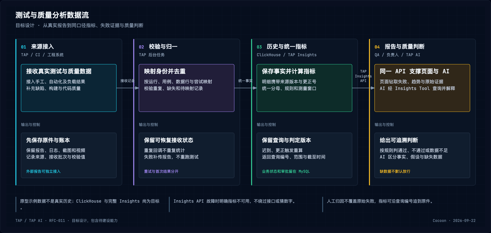
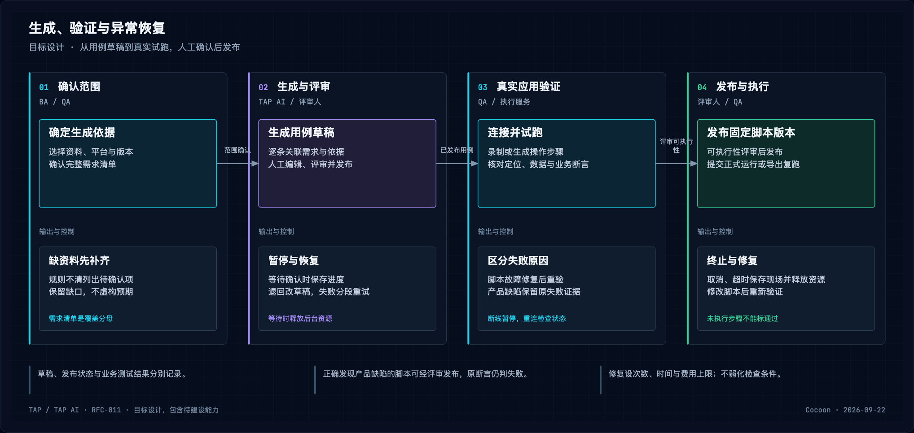

# RFC-011 开发参考：Insights、契约与运行恢复

本文形成于 2026-09-22，是 [RFC-011](../proposals/2026-09-17-rfc-011-rag-test-design-cross-platform-automation.md) 的 `draft` 配套技术说明；不构成新 RFC、已接受架构或实施完成声明。以下描述目标设计，当前状态以 [V2/V3 更正评审](../reviews/2026-09-14-v2-v3-gate-correction.md) 与代码为准。

相关专题：[AI、主动 Agent 与知识](2026-09-22-rfc-011-ai-knowledge-design.md)、[测试管理与执行](2026-09-22-rfc-011-testing-execution-design.md)。

## 当前基础与目标归属

TAP AI 独立前后端管知识、测试管理/手工执行、AI 生成；TAP 独立前后端管自动化/负载、执行资源及 Test Insights，遵循 [ADR-027](../decisions/2026-09-15-adr-027-tap-ai-product-app-boundary.md)。可共用存储服务，但各自只修改自己负责的表/文件，模块方框不要求独立服务。

统一图目标由 [ADR-029](../decisions/2026-09-18-adr-029-langgraph-ai-interaction-task-orchestrator.md) 记录并替代 ADR-028；不代表已部署或 RFC 已实施。现有 loopback 无认证演示仍仅本地，RFC-006/ADR-018 本地 Codex Answer Adapter 保持独立。

当前 Test Analytics 是固定样例，[分析模型](../../apps/web/src/legacy/testAnalyticsModel.ts) 不能用作真实历史。ClickHouse 是 RFC-011 **从基础 Insights 阶段开始的必选目标服务**，不属于 ADR-022 当前 Compose 基线，也不存在先用 MySQL 分析再迁移路线。

## Test Insights 指标与数据链

[查看 SVG](../assets/rfc-011/2026-09-17-insights-data-flow.svg)。报告/API 统一口径；AI 负责解释经核验事实，不生成权威数字或批准发布。

链路为来源连接/报告上传→对象存储原件＋MySQL 接收账本→校验/映射/去重→ClickHouse→TAP Insights API→页面/质量规则；TAP AI 的 Insights Tool 以服务身份调用同一 API，结合 SearchPort 的知识证据。chDB 只用于可选获准文件/快照计算，日常看板与 RCA 不依赖它。

### 视图与五类质量分析

| 视图 | 目标交互与约束 |
| --- | --- |
| 运行报告 | 按项目、稳定构建名、应用版本、分支、平台、环境、时间筛选；批次→实例→数据行/重试→步骤，联动 trace、日志、截图、视频与缺失原因 |
| 失败工作台 | 按错误/步骤/环境分组，比较最近成功与首次失败；负责人、产品/脚本/环境分类、评论/缺陷/复核，保留组内原失败，AI 分类可纠正 |
| 测试健康 | 重试恢复、跨次波动、新/持续失败、耗时异常、隔离和过期项；标签附规则/样本，不用模型判断代替证据 |
| 发布检查 | 固定发布与规则版，核必需运行/完整性/截至时间，输出通过/不通过/数据不足并给 CI 可追溯结果；豁免须人、理由和有效范围 |
| 质量总览/看板 | 产品/团队/发布原始指标、目标、趋势、贡献项/待办，钻取源记录；目录内自选图表/分组/筛选/窗口，个人/共享视图、权限导出/分享，邮件/Slack/Webhook 仅按用户配置 |
| AI 分析 | 先查实际指标再取证据，区分事实/推断/缺失，引用回具体运行；数字/查询编号/引用须后端核验 |

五类质量域：

- **覆盖与需求：** 需求/关键需求覆盖、用例/关键用例自动化比例与变化。需求覆盖＝有发布用例关联的需求/确认范围内需求；验证通过率另算，自动化比例按有效脚本映射，代码覆盖来自代码工具，三者不混。
- **缺陷与质量：** 严重度/环境、逃逸/重开、待解决年龄、修复时间/密度。保存发现阶段、版本与状态历史；逃逸率明确分母/发布窗，密度按需求量或代码量分别命名，缺分母不出数字。
- **自动化效果：** 首次/最终通过、波动/持续失败、耗时、使用/维护与隔离。调试与正式分开；静音/隔离仅改变指定选例/通知/门禁范围，不删失败，展示含/不含隔离分母、负责人、到期/恢复验证。
- **开发测试效率：** 需求/缺陷状态周期、开发到测试等待、作业排队/持续、交付频率、返工；先映射业务状态与开发/测试/部署作业，成功 CI 不等于测试通过，无 JUnit 等真实结果时仅算作业指标。
- **代码质量：** SonarQube 等实际行/分支覆盖、bugs、漏洞、code smells、重复/复杂度、技术债，保规则版本与项目/分支/提交映射；未接入明确缺数，不从测试结果推算。

### 权威公式与异常处理

| 指标/判断 | 规则 |
| --- | --- |
| 首次通过率 | 首次通过实例 / 首次终态为通过、失败或执行错误的实例；跳过、阻塞、取消、未执行、未知另列，缺报告不自动计完成 |
| 最终通过率 | 同执行清单/配置，每实例最后有效尝试；分母实例范围与首次相同，首次失败不覆盖 |
| 重试恢复率 | 首次失败/执行错误且最后有效尝试通过 / 首次失败/执行错误；展示重试开关/次数，不称为 Flaky 真值 |
| 跨次波动 | 同测试身份、可比版本/环境/窗口观察通过失败转换，保存窗口/最小样本/阈值/规则版；条件不可比或样本少仅待调查 |
| 新/持续失败 | 固定窗口比较错误指纹/连续失败次数；归组规则变更保旧标签和生效时间，不重写历史认知 |
| 耗时异常 | 同口径历史分布阈值，展示样本/排除项；样本少不报警，阈值与实际时长分呈 |
| 发布判断 | 固定规则＋固定发布/数据清单，齐全才判；同步延迟、映射不明、缺报告为数据不足，补报/更正新建判断版本而不覆盖 |

质量评分采用 TAP 公开、版本化公式，不声称复现供应商私有归一化。先显示原指标，由项目确认目标/不可接受值/方向，线性归一至 0–100 并截断，再加权。各域及域内权重分别合计 100%，由业务/质量负责人按风险评审，无未经确认默认权重。

目标未配置或必需域缺数据不出总分，不重新分摊剩余权重制造改善；不同规则分数不直接排名。总分只看趋势，关键缺陷/必需测试的发布条件独立，不能被其他高分抵消。

### 接收身份、去重与更正

每条运行携来源系统/项目、稳定构建名/分支、业务周期、技术 Run ID、用例/版本、配置/数据行、尝试号、稳定步骤 ID；应用提交与脚本提交分记。PR/发布检查明确提交关联，不找时间最近的运行替代。未映射外部测试保来源身份并显示待映射，同名不强合并。

证据优先按运行/尝试/请求/trace 关联；仅时间重叠的日志为候选，注明采集等级和缺失范围，共现不是因果。准备/清理钩子另记，不默认增用例分母；分类稳定 code 与显示名分离，改名不改变历史统计。原始执行事实与人工归因/治理结论分存，界面标所用口径，人工不能覆盖原失败。

| 存储层 | 处理规则 |
| --- | --- |
| 接收账本＋原件 | TAP/Jenkins/SDK/JUnit/Allure 先保存；分片/重试带批次和校验值，重复回调不重计；上传失败只补传报告，不重跑测试替代补传 |
| ClickHouse 事实 | 尝试、步骤、缺陷状态、CI 作业、覆盖/代码质量快照、压测时序，携来源版/更正号；查询取唯一最新有效记录，不依赖后台 merge 才去重 |
| 汇总 | 按项目/日期/运行加速；迟到/删除/更正对受影响范围重算或替换，不能对可能重复/更正的明细不可逆累加 |
| MySQL 治理 | 连接配置、项目/用例映射、同步游标、接收状态、归因/负责人、隔离/豁免、评分/门禁及每次判断；原业务表仍各产品拥有 |
| 对象存储 | 原报告、日志、视频/截图、trace/HAR、导出；项目授权与脱敏，事实/日志/视频/附件各自保留期；证据过期明确显示，不删除原结论 |

连接器先 TAP 手工/自动化/负载、Jenkins、JUnit/Allure、Jira、SonarQube，再按统一接口扩 TestRail/Zephyr、GitHub Actions/GitLab/Azure Pipelines/Bitbucket。每个明确增量字段、历史范围、限流、删除/失效；API 没历史不能用当前状态补造，供应商控制台能看不等于公开 API 能全量导附件。

### 模块、权限与验收

TAP FastAPI 建报告/来源连接、Insights API、指标目录/查询、失败处理和规则；Worker 解析/映射/聚合/重算，复用任务、可靠事件、Redis；React/ECharts 复用布局并移除固定数据，不因来源增加引入新消息/工作流平台。

列表、钻取、AI、导出、分享执行相同项目/团队权限，公开链接默认关闭；同步显示最后成功、完整性、待映射数，零数据不能显示正常。汇总卡与明细同筛选，表格独有过滤须标明，不能暗示顶部也变。AI 查询的事实/编号/工具调用/引用写 MySQL Turn/审计。

验收同 Run 多源、同名不同测试、参数化/多重试、乱序迟到更正、SDK 断线/缺附件，逐指标核分母/截至/规则；沿查询编号追原记录。RCA 验证服务身份/项目权限、检查点恢复幂等、工具审计及引用；人工标签/AI 归因分列，隔离/豁免会到期；缺报告不放门禁，缺域不出完整分，跨项目分享/导出/查询隔离。

基础 Insights 必须真实报告进入 ClickHouse 并生成指标，记录数据量、并发、查询延迟、备份/重建结果；不能以安装数据库或有页面代替交付。完整功能与来源限制见 [Insights 研究](../reviews/2026-09-17-browserstack-test-insights-page-analysis.md)。

## 跨产品接口与授权

前端只经各自 HTTPS API，不能直连数据库/供应商；后端校验当前项目权限。TAP AI 用户交互创建/关联 Conversation/Turn/Task 后入固定 LangGraph；Fast Chat 在线，长任务返回 Task/GraphRun 并通过 SSE 发进度。主动来源不伪造用户 Turn，契约详见 [主动 Agent](2026-09-22-rfc-011-ai-knowledge-design.md#主动测试运营-agent)。

| 交接 | 最小内容与责任 |
| --- | --- |
| TAP AI↔TAP 试跑 | 项目、内容/应用版本、请求号、允许范围，返回界面、步骤草稿、状态/证据；TAP 验应用/设备权限，重复请求不重复 Run |
| 测试管理↔执行 | 固定用例/周期/实例/脚本/配置/数据行 ID；按尝试和稳定步骤回结果；手工归测试管理、技术 Run 归 TAP，重复回执不重复计 |
| 调试前端↔服务 | WebSocket 操作/确认、独立视频/截图；每设备单控制者，顺序号幂等，重连确认界面、过期释放 |
| 正式调度 | Jenkins 收固定脚本包/应用/参数/凭据引用，回调＋查询对账；动态 AI 仅显式受限块，机器限获准环境；交互调试不排 Jenkins |
| 执行/外部→Insights | 来源/项目/用例/Run/尝试/时间/原件引用，先收账再解析，可重试/补传/重算 |
| 负载→Insights | 固定 Run/分片/批次、阶段/实际负载/健康、原样本或可合并统计量；同测量窗，缺片/未达不能通过，节点确认停止 |
| 图→领域/Worker | 类型化任务、工具结果、当前节点/checkpoint/租约/待确认；模型只草稿，发布/外部副作用仍领域 API 幂等 |
| 主动事件→准入 | 版本化信封、来源/项目、资源版本、因果链/订阅策略，经持久化确定性准入建 Task；统一分类仍在图内 |

**Insights Tool 的跨产品调用必须 fail closed。** TAP AI 服务身份＋后端确认项目上下文，TAP 再验项目授权；不信模型项目 ID。正式契约版本定义固定指标、筛选、时区/时间窗口、样本、截至、查询 ID 和证据，页面/AI 同目录，不另造同名通过率。

API 以只读身份、项目授权视图/行策略访问 ClickHouse，限制扫描行/字节、内存、并发、输出、时间；超限不把中断部分当总数。鉴权、契约、TAP 或 ClickHouse 不可用返回明确“指标能力不可用”，图审计该结果，不直连或猜数；核心知识 Chat 可继续。图/模型不直连 Milvus、ClickHouse、chDB 或业务库，只用领域工具；可选 chDB 输入前重新授权，不自动继承服务器权限。

最终回答前后端校验指标值、查询 ID、引用可达及当前权限，分别展示事实、假设、缺失；图用稳定 ID/版本/时间组合类型化结果，不按标题相同认映射。操作当前状态由所属业务 API 判断，不用异步分析副本作准。

## 任务状态与恢复

[查看 SVG](../assets/rfc-011/2026-09-17-generation-recovery-flow.svg)。生成失败、业务断言失败、设备/环境故障分别呈现；暂停/取消不把未完成内容标成功。

三剖面共用 Conversation/Turn、Task/GraphRun、图版本、授权/审计/引用与收尾。Durable Workflow 和 durable Agentic Task 要有排队、领取、进度、等待、暂停、恢复、取消、超时及终态的可观测记录；复杂任务可 durable，耗时长不必 agentic。Fast Chat 超预算在副作用前可记录提升原因，不能默默排队又表示完成。

MySQL 保存 Conversation/Turn/Task/GraphRun、graph_version、执行/推理模式、节点状态/checkpoint、策略决定、工具输入输出、模型用量、租约、暂停/恢复、审计与幂等。**检查点/业务状态、Domain Event、Outbox 同事务提交**；Redis 只至少一次唤醒，消费者按幂等键重放，不能把 Redis 作为权威任务账本。

现有计划生成任务领取有效期为 **60 秒**；新 durable runtime 必须分段执行、续租，真实验证超过 60 秒工作。每个 GraphRun 同时仅一个 Worker；并发领取和租约失效不能重复执行。人工/外部等待先持久化 checkpoint 再释放 Worker，确认权限后唤醒；离页、刷新、重启从已保存节点继续，不能仅有一个状态字段就声称恢复完成。

恢复前查询/对账外部副作用：响应丢失不能盲目重跑、发布或写入；未确定保持未知并等待核对，使用请求/动作幂等键。任务取消先持久化意图再停图/工具、经领域 API 停已提交执行，设备和进程需确认释放；已发生写入保真实历史，不能伪装撤销，补偿另行确认。长任务剩余输入、阶段产物与审批上下文必须可恢复。

创建 GraphRun 固定 `graph_version`，对应定义和 state schema 至少保留到终态/取消；升级默认只影响新 Run，不将旧 checkpoint 载入不兼容图。必要迁移须显式、可回滚、验证恢复/幂等，并留迁移前后版本。

优先验证现有 MySQL checkpointer 适配的来源、兼容、并发和恢复，不在本 RFC 默认新增 PostgreSQL；接 LangGraph 库本身不等于持久化能力。任务队列/租约由任务管理负责，节点顺序/条件/暂停由图负责，领域模块仍掌握发布、执行、质量门禁。

验收覆盖超过 60 秒、人工/外部等待、Worker 中断/重启、重复唤醒、并发领取、租约到期、部分失败、取消、外部响应丢失与图升级；检查业务状态/checkpoint/Outbox 原子性、幂等、副作用查询及资源释放。Fast Chat 延迟/调用上限、Bounded Agentic Task 步数/时间/工具/费用边界分别验，原型与真实模型/设备证据分别保存。

## 数据归属、部署与安全

| 存储/资源 | 目标职责 |
| --- | --- |
| 各产品 MySQL 表 | 内容/需求/用例/脚本版本、审核/发布、当前任务和运行、权限、审计/幂等、租约/事件/Outbox、接收账本/治理；TAP AI 另管知识图与资源包元数据、主动记忆/订阅准入/批准 |
| Redis | 任务唤醒、短缓存、设备占用提示；持久状态仍 MySQL，不替代原子事务 |
| 对象存储 | 原件、获准页面/裁剪、表格/解析物、完整资源包、脚本、原始报告、截图视频日志；各产品管自己文件，下载验权限 |
| Milvus＋MySQL active Graph | Milvus 可重建文字/关键词/独立图像投影，MySQL Node/Edge/Snapshot/Evidence/Provenance/发布；模型向量空间不混，图关系不冒充原文事实 |
| ClickHouse | TAP Insights 历史明细/汇总，经 API 暴露获准指标；支持补录、更正与重算，不承担业务当前状态 |
| 可选 chDB | 文件/快照任务隔离进程/容器，输入/可追溯结果按政策存对象、授权记录在 MySQL，临时文件用后清理；不做长期主库/会话/图状态 |

应用继续 React/TypeScript/Vite/Ant Design、Python/FastAPI，Insights 增 ECharts。Linux/Compose 承载应用、Worker 和存储；LangGraph 是 TAP AI 内部库，不按节点拆服务或装用户电脑。ClickHouse 独立目标服务；OCR/Office/图像推理用独立处理资源并固定依赖/模型，避免阻塞 API/污染 Python 3.13 环境。

Web/Android 独立执行节点，iOS 专用 macOS/Xcode；Jenkins 安排正式测试，交互直接会话服务。连接器仅本地 Web 录制所需。账号、设备、数据准备/清理归执行服务；功能执行、AI 文件/脚本隔离任务、k6/浏览器压测和被测系统分别限资源，不共运行目录或压测配额。

不引入 docu.md/通用 IDE、DuckDB、图数据库、Temporal、第二工作流/调度平台，不迁 PostgreSQL＋pgvector 或同时接多负载引擎。Maestro 仅轻量备选评估，不是本项目目标迁移。

团队入口开放前完成 OIDC 统一登录与项目授权；当前 loopback/无认证演示不能直接开放团队或 LAN。模型密钥、设备/服务凭证仅后端管理，步骤/导出/日志不含明文；项目可限制数据/执行区域、模型外发和敏感字段，内网机器或区域内存储不代表模型数据也留本地。

知识、页面截图、界面、原图发视觉模型前同样验外发范围；列表、原件、引用、分享、导出、AI 查询全部校验项目权限与当前撤回状态。不同事实/附件保留期、审计、备份/恢复目标由项目负责人、运维、安全确认。Conversation、Turn、请求、GraphRun、工具、生成任务、测试 Run 关联编号须贯通。

## 交付依赖与未决契约

以下为依赖顺序，非工期承诺；实施按项目增量启用保既有数据，模拟数据不混真实报告。Insights 接入可与自动化并行，不等移动端全部完成。

| 阶段 | 本专题相关完成条件 |
| --- | --- |
| 共同前置（与第 1 批并行） | 登录/项目/用例 ID、Conversation/Turn/Task/GraphRun 与图状态、工具/服务身份/契约版本、凭证与回传、剖面准入/提升、图保留/升级；真实资料/账号/环境、MySQL 原子性/租约幂等、备份和模型范围实测 |
| 第 1 批 | Fast Chat/Durable Workflow、知识/测试管理的可恢复生成；固定图/checkpoint、事件/Outbox 原子提交与重放；不把 RCA/自动结果映射/Forge 算已交付 |
| 第 2 批 | 真实 Web Run→报告→ClickHouse→指标完整链、自动结果映射、Insights Tool/API、RCA agentic loop，重复不重计；RCA 不依赖 chDB |
| 第 3–4 批 | Android/iOS 分别实测；完整五域指标/评分/规则/告警、连接与更正重算、Forge 身份和双方授权逐项验收 |
| 第 5 批 | 负载协议闭环后扩浏览器/混合、分布式/私网；全局统计、失联停止和缺数据门禁接同一 Insights |

AI 改动在 `apps/tap-ai-*`，执行/Insights 在 `apps/backend`、`apps/web`，接口在 `contracts/`、部署在 `deploy/`。架构边界和阶段完成状态不因本参考拆分而变更。

未决输入：开发/架构/运维确认 checkpointer 版本/事务/并发、图保留迁移、ModelGateway 别名、SearchPort 边界、Insights 服务身份/契约及可选 chDB 安装；数据源负责人确认 Jira/CI/代码质量权限、历史窗口/稳定映射；业务/质量确认评分目标/权重、发布门槛和试点成功标准；运维/安全确认规模、区域、保留、恢复与模型外发。缺真实资料/环境可验结构，相关能力仍待验证。

参考：[ClickHouse](https://clickhouse.com/docs/get-started/about/intro)、[查询资源限制](https://clickhouse.com/docs/concepts/features/configuration/settings/query-complexity)、[行策略](https://clickhouse.com/docs/reference/statements/create/row-policy)、[LangGraph persistence](https://docs.langchain.com/oss/python/langgraph/persistence)。这些链接延续 RFC 选型依据，不代表本次重新验证供应商能力。
