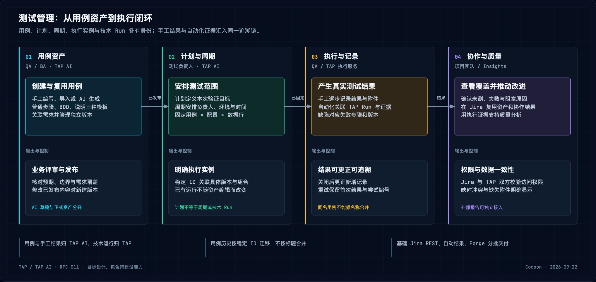
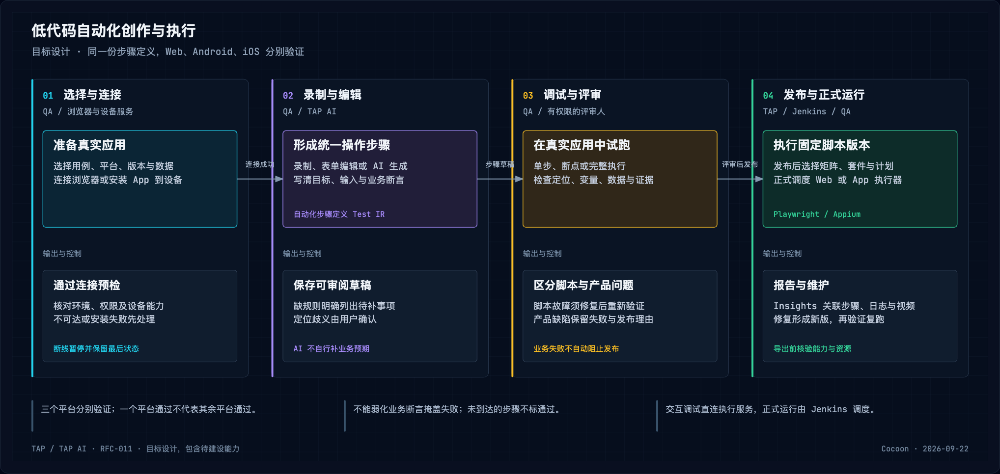
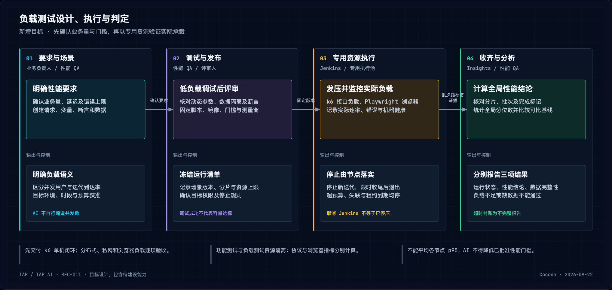

# RFC-011 开发参考：测试管理与执行设计

本文形成于 2026-09-22，是 [RFC-011](../proposals/2026-09-17-rfc-011-rag-test-design-cross-platform-automation.md) 的 `draft` 配套技术说明；不是新 RFC、已接受架构或实施完成声明。以下为目标约束，当前状态仍以 [V2/V3 更正评审](../reviews/2026-09-14-v2-v3-gate-correction.md) 和代码为准。

相关专题：[AI、主动 Agent 与知识](2026-09-22-rfc-011-ai-knowledge-design.md)、[Insights、契约与恢复](2026-09-22-rfc-011-insights-contracts-design.md)。TAP AI 管知识、测试设计与手工执行；TAP 管自动化/负载执行及 Test Insights，两者不互写业务表。

## 测试管理

[查看 SVG](../assets/rfc-011/2026-09-17-test-management-flow.svg)。沿用 TAP AI → 测试管理，在同一份资产上提供 Web/Jira 入口。

当前有计划修订、内嵌 BDD 用例、引用、生成任务及发布校验，尚无完整独立用例库/手工执行系统。代码入口：[领域模型](../../apps/tap-ai-backend/src/tap/modules/test_management/domain/models.py)、[发布校验](../../apps/tap-ai-backend/src/tap/modules/test_management/domain/validation.py)、[评审页](../../apps/tap-ai-frontend/src/features/testManagement/components/TestPlanReview.tsx)。

### 资产、版本与执行实例

| 对象 | 目标规则 |
| --- | --- |
| 独立用例 | 稳定 ID/独立版本；文件夹、标签、搜索、批量编辑、手工/导入/AI 创建、复制/归档；重名不合并，移动不改身份 |
| 三类模板 | 普通步骤＋预期、BDD、文字说明；含前置、数据、优先级、负责人、自定义字段、附件/来源。可执行用例须明确检查条件，模板转换预览损失，富文本不是自动化动作 |
| 共享步骤/数据 | 公共测试设计步骤、参数、数据集固定引用；与执行模块关联但不等同，升级显式确认 |
| 测试计划 | 需求/范围/策略、环境、风险、进入退出条件、负责人/日期及用例；按发布/迭代组织多个周期，计划不是一次执行 |
| 执行周期 | 冻结用例版本、应用版本、配置/设备、数据行、人员/时间；明确逐行配对或多数据集组合，预览用例×数据组合×配置数量并限膨胀；筛选用于下轮，本轮不随 latest 漂移 |
| 执行实例 | 每用例×配置×数据行独立；手工逐步通过/失败/阻塞/跳过、实际结果、附件/缺陷，支持批量领取和恢复；未执行不算通过，关键失败不能汇总通过 |
| 关闭/更正 | 周期关闭锁定结果，更正新增记录并保原因；草稿/发布/归档、待审/通过/退回、执行结果分别保存 |
| 自动化关系 | 关联 Web/App/负载脚本及关键检查步骤；TAP 持技术运行，测试管理持业务实例，按稳定 ID/版本映射，不能按同名或成功 CI 认领通过 |
| 覆盖 | 需求→用例→本次执行→缺陷可追溯，分别显示需求覆盖、自动化比例、验证结果；仅有脚本不代表验证，来源变化标待复核 |

生成前必须确认完整需求清单、范围及版本；覆盖分母用该清单，不能用检索命中的条款替代全部需求。未覆盖和待澄清项保留。新建页同时提供手工/导入/AI，不强迫先聊天；左侧目录/筛选、中间列表/步骤、右侧详情/来源/缺陷。长任务可恢复、部分导入逐行报错，权限不足与无数据分开，保留键盘路径和文字状态。

### 评审、导入与 Jira

AI 可从资料、需求/Jira issue、已有用例生成可编辑草稿，逐条记录采纳/修改/拒绝；不自动批准、覆盖或合并。严格项目关键预期由非作者独立复核；修改已送审内容使审批失效，API/导入同样执行门禁。结构校验与人工批准分存，批注、差异、退回、修订和审批人可追溯；恢复旧版创建新草稿，运行仍绑定原版。

CSV/Excel/API 导入先映射字段、层级、身份、模板、附件并试导入；保留来源系统 ID、批次、去重键、失败清单，允许仅重试失败项。按来源产品/部署版本列可迁对象、时间范围及附件覆盖，无法迁移历史/附件/账号明示，数量相等不等于完整迁移。

导出固定版本及附件清单并带来源；跨项目复制预览依赖、重授权数据/凭证，不共享秘密，也不继承旧项目“已通过”历史。

Jira 连接固定实例、项目、需求/缺陷类型/字段，保存实例＋项目＋issue ID、历史/游标；需求权威归 Jira，用例归 TAP。冲突展示差异，删除/断连不抹历史；webhook＋定期补查处理遗漏、重复和乱序，版本检查防回写循环，失败显示最后成功时间/重试，解绑撤连接并按政策保证据。

Jira Cloud 内嵌采用 **Forge Custom UI＋Remote**，复用 TAP AI 测试管理 API，验证安装身份、Jira 用户和 TAP 项目权限；邮箱一致不能授权，Jira 可读不等于 TAP 可读。Data Center 单独 REST 适配，不宣称复用 Cloud 内嵌应用。

### 数据迁移、接口与验收

TAP AI MySQL 管用例/版本、公共设计步骤、字段/数据集、需求映射、评审、计划、周期、手工结果、Jira 映射，附件在对象存储。TAP 管脚本、调试、实际运行和逐步证据，发布/执行/更正事件进入 Insights，Insights 不修改用例业务状态。

保留 `TestPlanRevision.cases` 历史快照，以“项目＋原计划＋修订＋case ID”映射独立身份/版本，不能合并不同计划的相同标题或局部 ID。新计划固定用例版本并存发布快照，旧引用仍定位原证据；按三模板扩展原 BDD 模型/校验，原 BDD 规则继续有效。

接口补用例/版本、批量导入、评审、周期/结果、映射/共享步骤/同步任务，复用项目授权、版本冲突、幂等和可靠事件。验收跨计划复用、并发编辑、退回重审、普通/BDD 发布、导入部分重试、逐配置执行、关闭更正、重复回调、Jira 断连及跨项目权限。

全平台第 1 批交付用例/评审/计划/手工执行、导入和基础 Jira REST；第 2 批接自动化结果映射；第 4 批交付 Forge 内嵌操作。逐页范围与产品限制见 [测试管理研究](../reviews/2026-09-17-browserstack-test-management-page-analysis.md)。

## Web 与 App 低代码自动化

[查看 SVG](../assets/rfc-011/2026-09-17-lca-authoring-execution.svg)。固定链路为知识→用例→真实应用→Test IR→脚本；资料不能提供当前控件定位，不能承诺上传即得到无需核验的脚本。

当前 [自动化工作台](../../apps/web/src/legacy/automation/AutomationWorkspace.tsx) 主要为 BDD/动作表单和模拟运行；TAP 后端当前入口仅健康检查，真实会话/持久化/执行需建设。入口仍 TAP 自动化工作台，Web 移动浏览器与原生 App 分开配置。

### 工作台、Test IR 与发布

从发布用例、空白测试或模板开始，固定项目/平台/应用/环境/数据，保留需求和批准切片引用。连接先检查可达、安装签名、占用及能力；左侧步骤/模块、中间真实画面、右侧定位/参数/证据。录制、表单、AI 修改同一 Test IR，记录动作、目标、输入、检查条件、超时及失败处理，不另造互不兼容语言。

录制可暂停整理；AI 先展示草稿、规则缺项、拟执行动作，再于真实应用验证定位，严格预期来自批准知识。调试支持从头、单步、执行到选定步骤、断点、暂停/继续、重连，显示变量/具体数据行；跳前置须检查实际登录和数据状态。

连接可取消；断线暂停并显示最后确认状态，重连刷新结构/应用；多元素高亮待选择；不支持能力禁用说明。平台/包/数据变化提示重验证。脚本是工作台切换视图，明确与可视化步骤同步边界。

**脚本可执行性与业务结果分别评审。** 定位、变量、依赖、执行器故障须修复重验；正确脚本发现产品缺陷可由有权限者评审发布，关联缺陷、原失败证据和理由，记录实际验证范围/未到达步骤。后续按原断言继续失败，不能靠发布、删检查或放宽预期制造通过。

发布冻结脚本/测试/模块、App 或网址发布版本、数据、环境、执行器和配置；选择套件、浏览器/设备矩阵、数据、顺序、并发、时间后正式运行。报告展开批次→测试→数据行/尝试→步骤，修复新建版本并复跑。

### 共用动作与执行规则

| 能力 | 规则 |
| --- | --- |
| 步骤 | 插入/删除/复制/排序/启停/备注，前后置清理；失败停止、失败继续、警告继续分开，关键检查失败仍测试失败。按可操作条件等待，固定等待显式；失败/取消后尽力清理，清理失败另记 |
| 检查 | 存在/可见/文本/属性、变量、数值范围、图像；等待与断言分开，金额/日期/比例/业务条件明确；视觉和无障碍状态独立 |
| 定位 | 主定位＋候选＋截图/界面结构；优先稳定标识，再语义/属性，坐标最后且标风险；修复显示新旧目标，不删/弱化关键检查 |
| 数据 | 局部/模块 I/O/项目变量、运行参数、数据集/提取/受控函数；覆盖顺序运行参数→数据行→测试默认→项目默认，模块参数显式传入；密钥只存引用，日志/画面遮挡，结束清理 |
| 控制流 | 可视化 if/else、计次/数据循环，显示块范围/条件取值；限次数/总时长/嵌套，平台不支持在保存和运行前拦截 |
| 模块 | 带 I/O 的公共执行块固定版本，升级预览影响并试跑，不自动改已发布测试 |
| API/准备 | 请求/鉴权引用、状态/响应断言和 JSON 提取；明示执行机器和私网范围，准备/清理独立记录 |
| 组织/协作 | 文件夹/标签/搜索/复制、差异/恢复、测试集/执行块；试跑/发布权限分开；本地/托管、并串行、时区定时、仅失败重跑/取消、服务账号/API token、权限分享/通知/缺陷映射 |
| 并发依赖 | 块依赖和失败传播显式，默认仅影响当前设备；每设备×数据行分别计数，重试不覆盖首次 |

统一能力清单驱动各平台动作/检查/导出，后台策略与 UI 显示限额，不照搬供应商额度。运行前检查模块依赖、控制流、作用域、循环、未定义变量、缺密钥、不支持动作及导出依赖。

### App 适配

Android 为 **Appium＋UiAutomator2**，iOS 为 **Appium＋XCUITest**，通过 **WebdriverIO＋TypeScript** 执行。APK/IPA 不可变存对象存储，保留包名/版本/平台，iOS 签名/权限/app groups 绑定包版本，换包重验。

设备按系统/版本/机型和可用/占用/离线筛选，支持能力内的方向/语言/环境。独占会话与租约，命令和画面分通道，重连刷新界面树/应用状态；安装、启动、权限弹窗和离线分别报告，Android 通过不代表 iOS 通过。

动作包括点击/长按/输入/滑动滚动/返回/隐藏键盘/轮式选择器/深链/等待；原生/WebView 显式切上下文。启动/终止/重置/前后台/系统权限按平台适配，标明清空状态，准备、过程、清理分记。定位歧义须确认，OCR 看到金额不能证明业务规则正确。

生物认证成功/失败模拟、相机扫码/图片注入仅使用设备服务公开支持能力，不凭 Appium 宣称真机通用；不支持阻断，不跳过算通过。React Native、Flutter、Ionic、WebView、自定义/特殊能力分别标支持/实验/不支持，能启动不等于控件可录制。

私网隧道/代理、域名和设备服务凭证按项目配置；App 后端、API 步骤、画面通道分别验连接。调试选具体数据行，首行成功不代表数据集通过，数据/循环上限仍受控。

### Web 与本地连接器

Web 执行采用 **Playwright＋TypeScript**；新增 macOS/Windows **Electron＋Playwright 本地录制/调试连接器**。Electron 管桌面连接/健康/版本/升级，Playwright 启动独立干净测试浏览器，TAP 自建录制事件→Test IR 转换；不能把 codegen 当多人工作台，也不默认复制个人浏览器登录态。

普通网页受同源/权限约束，无法任意接管另站点。连接器主动连接 TAP 会话服务，用授权项目和短期凭证校验命令/来源，不向 LAN 暴露控制端口；页面在隔离浏览器内不能获得桌面 Node 权限。离线/休眠、代理、升级和版本不兼容明确反馈，关闭本机就不能继续依赖其运行。

| 场景 | 位置与网络 |
| --- | --- |
| 本机开发/个人 VPN 内网录制 | 本地连接器控制用户电脑测试浏览器；仅使用本机可达且项目允许的网络 |
| 托管交互录制 | TAP 执行机器浏览器，工作台直接连接，无须本地安装 |
| CI/定时正式回归 | Jenkins 专用节点，独立具备网络/账号/依赖，不依赖个人电脑 |

录制客户端不等于云到内网隧道，不自动共享个人 VPN；平台保存步骤/版本/证据，本机不是唯一副本。正式运行前重新检查节点可达；浏览器、服务端 API、数据库分别检查。BrowserStack LCA 桌面端与 Local binary 也是不同工具，Electron 为 TAP 选型而非供应商实现推断。

Web 动作含点击/双击/悬停、输入/选择/键盘/滚动/拖拽、上传、相似元素选择及弹窗，定位保留 iframe/Shadow DOM/目标上下文。多标签/弹窗关联步骤；富文本保存最终内容不等于验证全部工具栏；canvas 使用锚点、图像/区域或显式坐标，标明比例/稳定性风险，自定义控件先测录制能力。

自定义 JavaScript/受控库版本化、限时/网络；数据库经独立只读连接器，UI 仅存凭证引用；并行数据隔离/共享显式。测试资源服务供邮箱、链接/验证码、测试账号 TOTP、上传下载及文件检查，超时/重复邮件/格式缺失分别报错，不依赖真实用户收信。

环境含浏览器/版本/分辨率、语言/区域/地理位置、代理/参数；提供方能力决定支持范围。Chrome/Edge/Firefox/WebKit 与移动视口可配置；WebKit/移动模拟不叫原生 Safari/真机，真实 Safari/移动浏览器须独立适配验收。

视觉采用 Playwright 截图、明确阈值/遮罩和人工批准基准，首次基准状态待审核，不算视觉通过；设计稿参考、功能断言、视觉及 axe-core 无障碍独立配置/报告，保存规则版本，自动扫描不代替人工完整审查。

### AI、修复、导出与技术归属

固定步骤默认；动态 AI 块回放时观察/决策，须显式启用并显示模型、动作白名单、最大步数、超时/预算、每次实际路径。金额/责任/期间等严格业务断言固定，不能由动态 AI 决定通过。转固定步骤新建版本保原稿，模块升级逐项选择。

自愈先用已批准候选，提新目标有歧义即停；允许试跑修复也单列“修复后通过”、保存原失败/前后图，不能写回已发布版本。改业务检查回用例评审，不能靠修复掩盖产品失败。

导出 TAP 自有 Playwright 或 WebdriverIO＋Appium TypeScript 项目，含依赖锁、数据模板、环境参数和说明；预检动态 AI、私网、专属设备/视觉服务等依赖，不能静默删动作。动态块先转固定或明确依赖 TAP 运行服务；自定义脚本为独立代码步骤，任意手改不保证可逆成可视化。分享默认项目内，对外按政策，批量导出给清单。

BrowserStack Web 的 `.side`/Nightwatch 导出不是其 Playwright/Appium 创作引擎 API，TAP 自建编辑/生成，仅据已证实公开接口集成执行/报告。逐页限制和未核实项见 [LCA 研究](../reviews/2026-09-17-browserstack-lca-page-analysis.md)；用户提供的 Sneak Peak 视频遇访问验证，未取得播放/字幕，不作为已观看依据。

`apps/web` 建真实画面/步骤/模块/数据/套件工作台，`apps/backend` 建业务持久化、权限、App/脚本版本、会话与运行。调试直接 WebSocket 会话命令、独立视频/截图通道；操作带会话/步骤/顺序编号避免重连重复点击，执行端确认状态。正式 Jenkins 调度队列/配额/矩阵/数据/重试，回调丢失查询对账，停止后释放资源，不确定状态保留。

TAP AI 统一图只经 ModelGateway/知识端口及 TAP 正式接口取界面/试跑证据，限定应用/动作/步数/时间/成本，不写执行库。资源服务供 API/数据库/邮箱/TOTP/文件/私网/特殊设备；能力缺失阻断。录制、调试、正式运行共用动作语义/结果格式；事件携测试/数据行/步骤/尝试/时间/证据，报告入 Insights，原日志视频图在对象存储。

### LCA 分层验收

| 深度 | 范围与证据 |
| --- | --- |
| L1 真实创作回放 | 录制/手工/自然语言/固定 AI、定位断言、变量密钥、基础调试、版本/套件；Web、Android、iOS 各有登录→业务→明确检查→失败定位的真实证据 |
| L2 可复用回归 | 模块、条件循环、数据、执行块、API 准备、重置权限、并发定时重跑、CI/导出；模块不污染旧版、行×设备分计、导出复跑且缺依赖可检出 |
| L3 高级集成 | 动态 AI/自愈、特殊移动、数据库/邮件/TOTP/文件、画布、视觉/无障碍、设计稿/缺陷/测试管理；逐项能力清单、失败路径、权限/成本，实验能力明示 |

L1–L3 都在目标范围，不因 L3 延后删除验收。Web 随全平台第 2 批，Android/iOS 第 3 批分别验证，不把三端 L1 当第 2 批条件；供应商容量/成熟度不能替代 TAP 实测。测试应用/账号/数据、私网、iOS 签名/设备仍由开发、QA、运维确认。

## Load Testing

[查看 SVG](../assets/rfc-011/2026-09-17-load-testing-flow.svg)。TAP 新增独立 Load Testing 工作区，复用性能需求/用例/Insights；当前无完整领域与执行链，本节全部是目标。

### 引擎与场景生命周期

协议使用 **k6＋TypeScript/JavaScript**，真实浏览器负载/体验探针用独立 **Playwright 池**；API、浏览器、混合三模式分计结果并关联同 Run。App 服务端接口走协议，不堆 Appium 真机发压。首期不原生执行 JMeter/Gatling/Locust 或承诺无损转换，不新增 Kubernetes/第二调度平台。

从已发布需求/用例或空白创建，明确峰值/业务比例、p95/p99、错误预算、持续时间、目标环境/目的；未知待确认，AI 不编并发。手工请求、OpenAPI、k6 脚本或脱敏 HAR 形成草稿，配置请求顺序、变量、token/CSRF/动态 ID、业务断言、数据清理；剔第三方噪音，URL 不是完整业务流。

选择负载模型、预热/稳定/峰值/恢复/长稳阶段、思考时间、地域、数据分片和预算，预览目标曲线/资源；先 1 VU 或少迭代调试请求、变量、断言、隔离/脱敏，不能由调试成功宣称容量。评审冻结场景、脚本、镜像、数据、环境、门槛、模型、测量窗、授权目标、资源和停止规则后发布。

浏览器可从固定 LCA 导入或录制，校验业务循环/等待/数据隔离，动态 AI 不直接参与正式测量。记录用户数/事务及实际可得 Web Vitals/网络/步骤数据，无交互页面加载不能声称测全体验指标。TAP 自建用户生命周期、循环、并发、计时与采集并校准容量，首批浏览器仅并发用户模型；运行功能脚本不自动具备压测语义。

工作区含场景库、配置/脚本、运行、报告/基线；状态排队→预检→预热→测量→降载→清理，显示目标/实际负载、请求、延迟、错误、发压机 CPU/内存/网络和停止。实时图标暂定，断线留最后时间可重连；显式探索调负载留事件，改过配置不能冒充固定基线验证。

### 负载模型、指标与基线

| 项目 | 必须保持的统计语义 |
| --- | --- |
| 并发用户 | 固定/变化 VU，完成一次业务再开始下一次；服务慢会降低实际到达率，不等于固定请求率 |
| 到达率 | 默认 k6 协议，固定/变化的业务迭代开始数/秒；一迭代可多请求，目标/实际迭代率、HTTP RPS、完成事务率分显，100 迭代/秒不等于 100 RPS |
| 未达目标 | 发压能力不足、丢弃迭代、分片失联标负载未达/数据不足；低压力变快不能通过目标容量 |
| 多机地域 | 同运行清单分配全局负载并核总和，固定数据分片、测量窗/启动条件；不让每节点重放全部负载，展示起跑偏差/地域分布 |
| 延迟 | 分 HTTP、事务、连接/TLS/首字节、浏览器指标；p95/p99 用完整样本或同精度可合并统计量，不能平均节点/分钟分位数，显示统计精度 |
| 错误/均值/吞吐 | 全局错误率＝错误请求总数/请求总数；平均延迟＝总耗时/样本数；吞吐＝同实际测量窗计数/时长。每请求预期 HTTP 与业务断言分计，不默认非 200 都错；重试计实际流量 |
| 阶段 | 预热/降载/准备清理默认不计稳定阶段门槛，但可追查；k6 checks 必须关联阈值，否则不能声称检查失败会阻断 CI |
| 结论 | 完成/不通过/取消/执行故障为运行事实；达标/不达标/无法判定为性能结论。缺数据/必需门槛、提前停止、负载不足不能自动通过 |

基线固定场景、环境、应用/数据、地域、引擎、测量窗；对比先展示差异，不排名不同负载/缺片报告；设/换基线需权限留痕。浏览器探针独立生命周期，短探针结束不能结束协议测量。任何 AI 建议不降低已批准要求，正式测量不由模型改脚本/负载。

### 执行、采集与停止

TAP AI 按批准性能要求生成场景草稿，经统一图/ModelGateway，已知长任务用 Durable Workflow，仅开放规划用 Bounded Agentic Task。TAP MySQL 管目标/环境、场景/数据/凭据引用、运行/分片、配额、门槛、基线和操作，提交/停止/报告各有幂等键。

Jenkins 分配固定 k6 镜像/脚本到专用 Linux 池，CPU/内存/网络与功能测试、AI、TAP 服务及被测系统隔离；Playwright 另池校准。先单机，分布式按同运行清单切分并等各片完成，多个 CLI 不等于完整分布式。私网节点部署在授权网络，主动连控制面、按项目/目标领取；不能从供应商出口 IP 白名单推断已有同类代理。

同节点采集器持续持久化/编号/重传 k6 原始批次，不只上传 summary；ClickHouse 管请求/事务/窗口/机健康，原批次与脱敏样本在对象存储，高负载可用经验证的可合并统计量。连接现有 Prometheus/APM 快照，保来源/采样时间/查询范围，与负载轴关联、缺失延迟明示，不新建通用监控平台。

封账按预期分片、批次和完成标记核完整，在固定时限内收齐后 Insights 统一判门槛并回 Jenkins；超时终态为不完整/无法判定，不无限等或默认成功，单机 exit 0 不等于全局通过。迟到/更正产生新报告/判定版本。

停止由执行节点落实：用户停止、时长/请求/预算上限、服务错误红线、发压机失能、控制面租约到期→停新迭代→限时排空在途→强退。确认或经失联处置前显示停止中；取消 Jenkins 不等于进程停止。心跳、失联上限、收尾时限写运行清单并实测，取消释放资源并保实际状态。

项目登记目标域名/IP/端口/协议、允许时段/资源；运行中 DNS 变化、重定向及脚本外部请求仍核对。凭证短时下发，HAR、请求响应、日志/附件脱敏；固定打包依赖，容器不临时下载任意依赖。查看报告、启动、停止、凭证管理分别授权。

### 分批验收与未决输入

全平台第 5 批内先 k6 HTTP(S)、两模型、低负载调试、发布、专用单机、停止、ClickHouse 指标/门槛/基线；再固定分片/多地域、私网、服务器快照、浏览器/混合及高级能力，逐项标成熟度，单机冒烟不代表全覆盖。

已知请求/事务集核错误率、吞吐、全局分位数；覆盖动态 token、隔离、服务变慢、负载未达、缺分片/补传、停止/Jenkins 取消/控制面失联、不可比基线、凭证脱敏。容量按真实发压机与采集开销测，不复制供应商用户数；性能目标、允许环境/时段、资源预算由业务、性能 QA、运维确认。

研究入口：[负载测试逐页分析](../reviews/2026-09-17-browserstack-load-testing-page-analysis.md)。选型依据：[Forge Remote](https://developer.atlassian.com/platform/forge/remote/)、[Playwright 浏览器范围](https://playwright.dev/docs/browsers)、[Electron 安全](https://www.electronjs.org/docs/latest/tutorial/security)、[k6 模型](https://grafana.com/docs/k6/latest/using-k6/scenarios/concepts/open-vs-closed/)、[k6 阈值](https://grafana.com/docs/k6/latest/using-k6/thresholds/)。链接延续 RFC 依据，不表示本次重新验证供应商。
