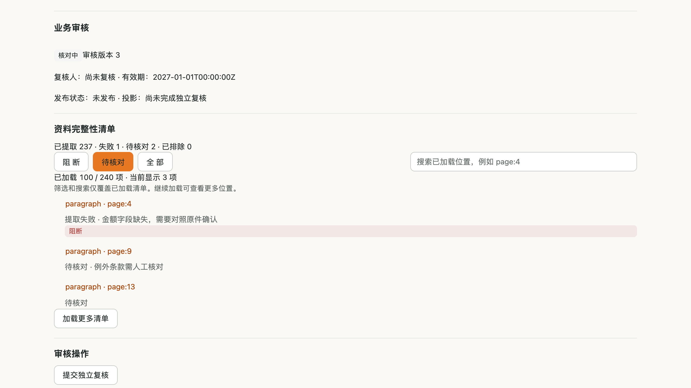
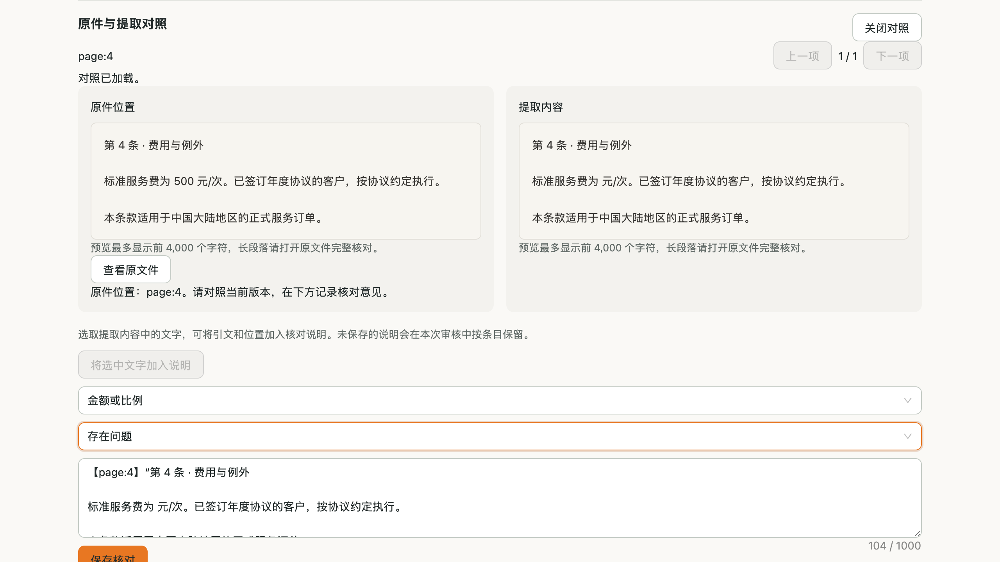
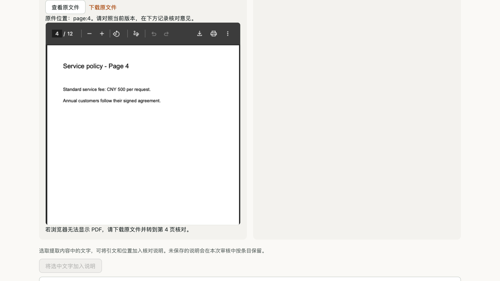
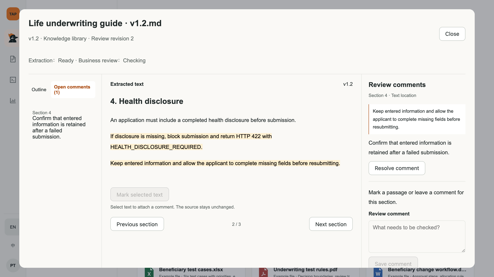

# 知识审核工作台：长文档、PDF 与 Excel

创建日期：2026-09-27。适用于本次工作区实现；完整原型与 TAP AI 运行页面分别说明。扫描件 OCR 尚待运行方式选择，未接入外部识别服务。

> 2026-09-27 流程调整：默认 Library 已改为 [Dify 式切片维护](../proposals/2026-09-27-dify-knowledge-chunk-parity.md)，保存并完成索引后，启用切片即可检索。下文记录旧业务审核工作台及保留的原件能力，独立复核、批准与发布不再是知识使用前置条件，见 [ADR-030](../decisions/2026-09-27-adr-030-direct-knowledge-chunk-lifecycle.md)。

## 为什么审核

上传后由系统解析和切片，用户核对业务条款、数值、单位、适用范围与例外。审核记录决定发布依据；通过审核不等于已测得问答准确率，也不要求用户手工维护每一个技术切片。

## 长文档操作

1. 在 Library 打开文档，进入业务审核。
2. 默认查看“待核对”项；需要时切换“阻断”或“全部”。查看总量、当前加载数量以及筛选结果。
3. 按位置搜索并使用上一项/下一项导航。搜索仅作用于已加载清单；继续加载才能覆盖后续位置，不称全库搜索。
4. 打开对照，选中提取文本，点击引用标记操作，把位置和原句加入核对说明。
5. 选择业务字段及通过/存在问题/人工排除，填写原因后保存。说明包含引文总计最多 1,000 字符；长选区需缩小后标记。
6. 切换条目时，未保存说明在本页面内按条目保留；刷新前应保存。已保存记录由后端留存。
7. 完成问题处置后提交独立复核，再按权限批准和发布。排除必须有理由，不应为了消除阻断排除关键规则。

标记记录在审核意见中，绑定当前审核修订与清单位置；不会修改原文件、自动纠正提取内容或更改切片。需要纠正源资料时，修改源文件后重新上传并对新资料重新审核；此轮没有交付版本差异自动复核。

### 运行界面示例

以下截图为当前 TAP AI 组件，使用固定接口响应和合成 PDF，证明交互与布局，不代表客户资料或真实模型输出。

## PDF 原件核对

对照区点击“查看原文件”，系统按当前项目、审核与条目校验原件权限，并验证文件摘要。文字型 PDF 可在浏览器中打开，具有 `page:n` 位置时定位到对应页；没有页码的位置不推测页码。浏览器不支持内嵌 PDF 时提供原文件下载。

文本对照每侧最多显示前 4,000 字符；长段落应打开完整原件核对。此轮没有实现 PDF 画框坐标批注。原件下载不会把提取文本冒充原 PDF。

扫描 PDF 仍提示需要 OCR。当前解析容器禁网，OCR 的本地运行或 Azure 服务方式待选；没有向外部服务发送文档。

[移动端原 PDF 阅读](../assets/knowledge-review-2026-09-27/runtime-mobile-after-original.png)。完整 Chromium 已实际渲染样本 PDF 第 4 页；其他浏览器可使用下载回退。

## Excel 操作与边界

支持 `.xlsx`，不支持旧 `.xls` 或带宏 `.xlsm`。原型历史列表中的其他格式不代表运行版支持。

- 每个工作表第一条非空行为表头；导入前移除表头前的封面说明、汇总标题或空白装饰区域。多个独立表格应整理为独立工作表。
- 普通行保留表头及单元格范围；长内容拆为带列名/列号和续段标记的片段，避免后半段误配到第一列。
- 工作表名称和范围保留在清单定位中。审核对照区提供提取内容的表格预览；下载原工作簿按位置核对公式、格式与隐藏内容。当前没有直接读取原工作簿的浏览器网格，也不支持点击原件单元格批注。
- 不计算公式、不执行宏、不访问外链；有缓存的公式值也要求核对，无缓存公式明确标为问题。
- 隐藏行/列/工作表、合并单元格以及未支持的工作表内容明确进入待核对清单。
- 百分比、日期、带前导零编号等非通用显示格式保留原始值和格式说明，标为待核对；当前不模拟完整 Excel 显示引擎。
- 超长表头保留文本并提示核对上下文，不承诺所有切片均带完整表头。

每文件 25 MiB；最多 100 个工作表、256 列，按工作表有效矩形范围累计不超过 100,000 个单元格。压缩包另有 32 MiB 总展开量、8 MiB 单条目及压缩比例约束，稀疏超大坐标同样受限。超限应拆分资料，不能把拒绝当作空文档成功。

## 完整原型

`/prototype` 的审核弹窗对长文档、PDF 和 Excel 共用目录、位置搜索、待处理意见导航、选取标记、意见解决和审核历史。文字按章节、PDF 按页、Excel 按工作表行与单元格范围阅读。原型内的四项检查属于整份文档，不要求每段重复勾选；未解决意见会阻止提交。原型仍为示例内容，不代表上传后的真实 PDF/Excel 已在该弹窗渲染。

[手机标记界面](../assets/knowledge-review-2026-09-27/prototype-marked-mobile.png)。原型截图采集条件：1280×720 或 390×844 布局视口、2× 像素密度。

## 借鉴的行业实践

| 来源 | 采用的实践 | 本次实现范围 |
| --- | --- | --- |
| [Dify](https://dify.ai/blog/introducing-parent-child-retrieval-for-enhanced-knowledge) | 内容可见、保留上下文、用户可检查 | 来源对照与条目标记；没有宣称已实现父子检索升级 |
| [Unstructured](https://docs.unstructured.io/open-source/core-functionality/partitioning) | 按格式解析、保留表格与位置 | 复用 openpyxl，按工作表/行/单元格组织 XLSX，不自建 Office 解析器 |
| [Azure 文档布局处理](https://learn.microsoft.com/en-us/azure/search/search-how-to-semantic-chunking) | 结构优先、原始来源与提取内容关联 | 沿用结构切片和来源摘要，不把本地解析器称为 Azure 布局识别 |
| [PDF.js](https://mozilla.github.io/pdf.js/getting_started/) | 原件阅读与提取内容分离 | 本轮复用浏览器原生 PDF 阅读能力；未新增 PDF.js 依赖或坐标标注引擎 |

## 本次验证记录

- 知识领域单元测试、审核 HTTP/权限契约合计 311 项通过。
- 真实禁网解析容器中的 XLSX 中文业务规则、工作表定位及数字格式问题标记验证通过。
- 前端知识功能 162 项测试覆盖导航、上传、原件和标记；完整原型回归 93 项通过。两套前端构建与类型/边界检查通过，契约漂移检查通过。
- 独立审查发现的 Excel 数字显示语义丢失与无页码 PDF 默认第 1 页问题已修复并复验。
- 原型前后截图已保存；运行界面截图使用固定接口样本，不代表真实业务或模型验收。
- 同日统一审核界面修订后，知识审核组件定向测试 30 项、完整产品原型与 TAP Web 单元测试 94 项通过；两套前端检查与构建通过。当前原型三种格式截图见[客户演示指南](2026-09-04-customer-prototype-demo-guide.md#31-同一审核工作台处理长文档pdf-与-excel)。

## 开发与验证

XLSX 依赖已加入冻结锁文件和隔离解析器构建清单，升级后必须执行 `make parser-build` 重建镜像；仅升级 API 环境不会更新解析容器。

原件接口：`GET /api/v1/projects/{project_id}/knowledge/reviews/{review_id}/items/{item_id}/original`，要求 `knowledge.original.read`，响应禁缓存并默认附件下载；前端按需读取 Blob，切换条目/卸载后撤销临时 URL。

测试覆盖格式语义、长单元格续段、公式与隐藏内容、压缩包边界、原件权限与摘要不一致拒绝、分页范围提示、条目草稿隔离和标记保存。真实模型质量、客户业务验收与 OCR 未由这些测试证明。
