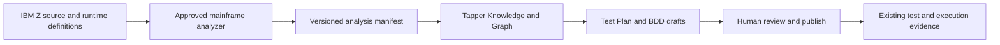

# IBM Bob for COBOL: Procurement and Tapper Capability Assessment

## Executive conclusion

IBM Bob is a broad AI software-development agent. Its ordinary capabilities—asking questions about a repository, planning a change, editing files, running commands, reviewing code, using tools, and following reusable instructions—are useful but not unique. The part that matters for a COBOL estate is the **IBM Bob Premium Package for Z**. It combines Bob with IBM Z-specific modes, workflows, tools, documentation, and, most importantly, the **Z Understand** static-analysis repository. That repository gives Bob structured facts about programs, calls, data, middleware, and dependencies instead of asking a language model to infer the whole estate from source files alone.[^1]

The recommended decision is:

1. **Run a limited, sales-led proof of value for Bob Premium Package for Z if the core system runs on IBM Z/z/OS.** Do not approve a broad rollout before the proof of value establishes accuracy, security, data handling, total cost, and measurable time saved on the company's own applications.
2. **Do not try to reproduce Bob Premium Package for Z inside Tapper now.** Rebuilding its differentiating layer would mean rebuilding or licensing an enterprise mainframe analyzer, its scanners, metadata model, data dictionary, z/OS tool integrations, and years of platform knowledge. That is a separate product line, not a normal Tapper feature.
3. **Adopt selected design patterns in Tapper after the current Tapper validation gates are complete.** The valuable patterns are deterministic analysis before model reasoning, explicit read-only and change-capable modes, versioned skills and workflows, tool-level approvals, pre-action policy checks, and usage/outcome measurement. Several of these already exist in Tapper's architecture.
4. **Investigate a future interoperability path rather than a clone.** A sensible long-term design would let an approved mainframe analyzer export versioned, evidence-bearing application metadata into Tapper. Tapper could then use that evidence to generate and manage test plans and traceability. Public documentation does not establish a supported Bob or Z Understand export API for this purpose, so licensing and API support must be confirmed with IBM before this option is planned.

In short: **Bob is worth a controlled evaluation for an IBM Z estate; wholesale procurement is not yet justified by public evidence; copying Bob into Tapper is not worth doing; selectively borrowing its architecture is worth doing.**

## 1. Scope, terminology, and evidence quality

This assessment treats “COBEL” as a reference to **COBOL**. It is based on public information available on 15 September 2026, including IBM Bob product documentation, IBM Bob Premium Package for Z 3.0 documentation, IBM announcements, published pricing, IBM security guidance, and limited external evidence.

The deployment platform must be confirmed before any buying decision. “A COBOL system” may mean:

- IBM Enterprise COBOL on IBM Z with z/OS, often using CICS, IMS, Db2, JCL, and enterprise schedulers;
- COBOL on IBM i;
- distributed COBOL on Linux or Windows, such as Micro Focus/OpenText environments; or
- a mixed estate with copied source in Git but build and runtime assets on a mainframe.

IBM's deep COBOL proposition is specifically the Premium Package for **IBM Z**. IBM i has a different Premium Package focused mainly on RPG, DDS, SQL, and a native IBM i connection.[^2] Base Bob may still read and edit a COBOL file as source code, but that is not the same as application-wide IBM Z understanding. If the internal platform is not IBM Z/z/OS, the strongest claims in this report do not automatically apply.

The evidence has three important limitations:

- Bob Premium Package for Z became generally available only in June/July 2026. It is a young product with limited independent, COBOL-specific field evidence.[^3]
- Most performance figures are supplied by IBM. IBM reports that surveyed internal users self-reported an average 45% productivity gain, but this is not a controlled independent benchmark. IBM's earlier published study of watsonx Code Assistant also found that perceived productivity gains were not uniform across users.[^4]
- Gartner Peer Insights showed a 4.1/5 score from only 10 ratings when reviewed. This is a small sample and is not evidence of COBOL or IBM Z accuracy.[^5]

The report therefore treats IBM's feature documentation as evidence that a capability is offered, but treats speed, quality, and return-on-investment statements as hypotheses to test locally.

## 2. What IBM Bob is

IBM describes Bob as an AI partner for the software development lifecycle rather than only a code-completion tool. The current product has three primary modes:

- **Ask** explains a codebase without making a change.
- **Plan** designs work before implementation.
- **Agent** writes, modifies, refactors, and validates code.

Bob can read and search files, edit them, run local commands, use Model Context Protocol (MCP) servers, activate reusable skills, start structured workflows, create subtasks, and spawn isolated subagents.[^6] It also supports Bob Shell for command-line work. A task has a documented 270,000-token context limit, with automatic condensation beginning before the hard limit. IBM explicitly advises targeted repository reads and structured analysis for large projects because context is working memory, not a durable knowledge store.[^7]

### 2.1 The reusable control layer

Bob's general control layer is built from several composable concepts:

| Concept          | Purpose                                                             | Enterprise relevance                                             |
| ---------------- | ------------------------------------------------------------------- | ---------------------------------------------------------------- |
| Modes            | Set a role, instructions, and available tool groups                 | Separate read-only analysis from code-changing work              |
| Skills           | Load reusable, version-controlled instructions and supporting files | Standardize reviews, tests, documentation, and platform practice |
| Workflows        | Run ordered, multi-step procedures                                  | Make repeated work more consistent and reviewable                |
| Tools            | Read, edit, execute, query MCP services, switch modes, and delegate | Turn model output into controlled actions                        |
| Repository rules | Persist project instructions, including `AGENTS.md`                 | Apply team standards on every task                               |
| Approvals        | Ask before tool actions or allow selected classes automatically     | Keep a human in the loop according to risk                       |
| Hooks            | Run policy or logging commands before and after key events          | Block a prompt or tool action and add local governance           |
| Bobalytics       | Measure adoption, code contribution, and Bobcoin spend[^27]         | Support rollout and cost management                              |

Custom modes can restrict editing by file pattern and can omit execution or MCP access altogether.[^8] Lifecycle hooks can block a user prompt or a tool call before execution. Enterprise policy can disable auto-approval categories and enforce hooks through MDM, Group Policy, or Linux configuration.[^9] These are useful controls, although hooks run with the developer's full user permissions and are not sandboxed.[^10]

### 2.2 Multi-model operation and consumption

IBM states that Bob routes work across frontier, open-source, IBM Granite, and specialized models according to quality, latency, and cost.[^11] The user buys Bobcoins rather than raw model tokens. Current public individual prices are:

| Plan  | Public monthly price | Included Bobcoins |
| ----- | -------------------: | ----------------: |
| Trial |     Free for 30 days |                50 |
| Pro   |               USD 20 |                50 |
| Pro+  |               USD 60 |               180 |
| Ultra |              USD 200 |             1,000 |

IBM lists enterprise Bobcoin packs at USD 500 per 1,000 coins, expiring after one year, and enterprise overage packs at USD 550 per 1,000 coins.[^12] These figures do not include the enterprise seat price or the Premium Package for Z, which is annual, enterprise-only, and quote-based.[^13] A Bobcoin hides the underlying model/token conversion. That simplifies billing but prevents a buyer from predicting workload cost from source size alone. The proof of value must therefore measure coins consumed per business outcome.

## 3. What makes the COBOL integration different

### 3.1 It is an analysis system plus an agent

The Premium Package for Z is an add-on to Bob and supersedes IBM watsonx Code Assistant for Z. Its central component is Z Understand. Z Understand scans a large application estate and builds a queryable repository of application metadata. Bob can issue deterministic queries against that repository and then use a model to interpret the result.[^1]

This architecture addresses three problems that raw language-model prompting does not solve well:

1. **Scale.** A mainframe application can contain millions of lines and thousands of connected programs, copybooks, jobs, tables, transactions, and scheduler relationships. It cannot be placed reliably into one model context.
2. **Hidden meaning.** Business meaning often sits in cryptic variable names, operational convention, data definitions, and knowledge held by experienced staff.
3. **Correct dependency resolution.** Dynamic calls, preprocessors, middleware, scheduler chains, CICS, IMS, and Db2 relationships require parsers and configured analysis. Statistical similarity is not enough.

The Premium Package answers these with scanners, a metadata database, a shared data dictionary, platform documentation, and tools that let Bob query pre-computed facts. The model still reasons and drafts output, but the factual base is less dependent on model memory or a guessed set of files.

### 3.2 COBOL and mainframe capabilities

IBM documents the following capabilities in the current package:[^14]

| Capability                         | What it does                                                                                                        | Practical value                                     |
| ---------------------------------- | ------------------------------------------------------------------------------------------------------------------- | --------------------------------------------------- |
| Application understanding          | Queries relationships across large sets of programs and dependencies                                                | Faster orientation and change scoping               |
| Impact analysis                    | Finds affected COBOL, PL/I, JCL, Assembler, and REXX assets                                                         | Reduces omissions before a change                   |
| Data dictionary                    | Maps technical variables to reviewed business descriptions                                                          | Preserves knowledge and improves later explanations |
| Documentation                      | Produces program and application documentation, logic flow, business rules, data use, dependencies, and error paths | Reduces manual archaeology and stale documentation  |
| Business-rule extraction           | Identifies business logic in COBOL, PL/I, and Assembler                                                             | Supports modernization analysis and test design     |
| Code explanation                   | Gives role-oriented explanations of source                                                                          | Helps onboarding and review                         |
| Code generation and modification   | Generates or changes COBOL, JCL, PL/I, REXX, and Assembler                                                          | Speeds bounded development tasks                    |
| Refactoring and service extraction | Finds candidate logic and extracts a proposed reusable service                                                      | Supports incremental modernization                  |
| Standards enforcement              | Builds a skill from existing code or a standards document                                                           | Makes generated changes more consistent             |
| Build, scan, and debug integration | Uses Z Open Editor, Dependency Based Build, ZCodeScan, and z/OS debugging capabilities                              | Closes the loop beyond text generation              |

The supplied `/impact-analysis`, `/implementation-planning`, `/explain`, `/refactor`, and data-dictionary commands orchestrate lower-level tools. For example, `scan_program` creates metadata before variable analysis; GraphQL tools discover project-wide assets; SQL queries inspect the metadata database; and refactoring tools select candidate code sections.[^14] This tool-first design is a stronger basis for high-risk mainframe work than directly asking an LLM to rewrite code.

### 3.3 Human review remains part of the design

The product does not remove the mainframe engineer. Refactoring requires source in the local workspace and, for deeper extraction, an available Z Understand project. The workflow presents candidates, asks the user to choose, prepares a summary, and requests approval before creating files.[^15] IBM also says explicitly that developers remain in the loop because “mostly right” is not acceptable for these systems.[^1]

That boundary is important. Bob can accelerate analysis and prepare a change, but it cannot prove that the change preserves business outcomes. Compile, static analysis, unit/component testing, integration testing, performance testing, operational review, and business acceptance remain necessary.

### 3.4 “Natural integration” has prerequisites and limits

The phrase “natural COBOL integration” should not be read as zero-configuration access to any COBOL estate.

- The deeper refactoring flow requires a configured Z Understand server, a built application project, and source files in the local workspace.[^15]
- The SaaS architecture is hybrid: the Bob IDE or Shell interacts with an on-premises Z Understand deployment while model requests are processed by IBM Bob cloud services. IBM documentation names managed model services such as AWS Bedrock in this cloud path.[^16]
- A documented deployment can require a dedicated database server with 64 GB RAM and substantial storage, plus a Z Understand Linux container with at least 32 GB RAM and substantial storage. Exact sizing depends on the estate.[^17]
- Scanner coverage is not uniform. IBM's own comparison lists supported, partially supported, and unsupported constructs for Linux and Windows analysis, including differences for IMS, CICS, embedded SQL, ADABAS, IDMS, compilation directives, and dynamic resolution.[^18]
- The package is designed for IBM Z. It should not be assumed to understand Micro Focus runtime behavior, non-IBM build systems, or IBM i assets unless IBM confirms that exact configuration.

These are not minor implementation details. They determine whether the analysis graph is complete enough to trust.

## 4. Deployment, governance, security, and data questions

### 4.1 Deployment model

Bob is currently offered as SaaS. IBM's April 2026 announcement said on-premises Bob was a future target, while the Premium Package for Z keeps the analysis layer near the mainframe and uses Bob's cloud layer for AI processing.[^11] IBM announced regional options in Japan and Europe in July 2026.[^2]

For a regulated COBOL estate, “the source remains local” is not a sufficient answer. The buyer must know exactly which source fragments, metadata query results, prompts, generated code, data-dictionary entries, logs, and identifiers leave the internal network; where each is processed; how long each is cached; and which model providers receive it. These details should be contractually confirmed, not inferred from a marketing diagram.

### 4.2 Available controls

Public documentation describes useful controls:

- `.bobignore` can prevent Bob tools from reading selected workspace files, although it is not a system sandbox.[^19]
- Read, edit, execute, MCP, skill, subagent, and other approvals are separately configurable. IBM rates edit and execute auto-approval as high risk and advises never enabling auto-approval in production.[^20]
- Enterprise policies can disable selected auto-approval groups and enforce gateway and hook settings.[^9]
- Untrusted folders suspend project configuration, skills, agents, rules, and MCP servers until the user grants trust.[^21]
- Enterprise SAML and OIDC identity providers are supported.[^22]
- Admin activity logs cover authentication and administrative changes. Public documentation reviewed here does not establish that these logs contain every file read, model request, tool argument, command, and resulting code change.[^23]
- Telemetry can be disabled, but Bobalytics requires it. IBM says normal telemetry does not collect code or prompts.[^24]

### 4.3 Security risks that require direct testing

All coding agents face prompt injection and tool-abuse risk because repositories, documentation, command output, and MCP responses are untrusted model inputs. A January 2026 external report demonstrated malware execution and data-exfiltration paths in pre-GA Bob when broad command approval was enabled.[^25] This finding was against a beta version and does not prove the same path exists in the current release. It does prove that policy documentation alone is not enough.

IBM has since documented stronger workspace trust, approval, group-policy, and hook controls. IBM has also published security bulletins for dependency vulnerabilities fixed in Bob 1.0.3 and 2.0.[^26] A pilot should verify the installed version, update policy, prompt-injection behavior, egress restrictions, command parsing, MCP isolation, audit coverage, and incident response in the actual corporate environment.

Minimum pilot posture should be:

- read-only analysis first;
- no production credentials in the developer environment;
- no automatic approval for edit, execute, or MCP;
- a disposable, restricted workspace and endpoint;
- egress limited to approved IBM endpoints;
- mandatory diff, build, and test review by a mainframe engineer;
- complete logging outside the agent's control; and
- no direct deployment to production.

## 5. Procurement assessment

### 5.1 Where Bob is likely to create value

Bob is most promising where work is expensive because knowledge is fragmented rather than because typing is slow:

- onboarding engineers into poorly documented applications;
- answering dependency and data-use questions across many programs;
- producing a first draft of program and business-rule documentation;
- scoping the blast radius of a field, table, copybook, transaction, or program change;
- turning existing coding standards into repeatable checks;
- preparing bounded refactoring candidates;
- generating tests around understood legacy behavior; and
- reducing repeated manual searches across source, JCL, Db2, CICS, IMS, and scheduler assets.

It is less compelling for isolated, well-documented programs, teams with very low change volume, unsupported non-Z COBOL environments, or organizations that cannot allow the required cloud processing.

### 5.2 Decision by option

| Option                                                 | Assessment                                                                                              | Recommendation                                           |
| ------------------------------------------------------ | ------------------------------------------------------------------------------------------------------- | -------------------------------------------------------- |
| Buy Bob broadly now                                    | Product is new; Z pricing and total service cost are not public; internal fit and security are unproven | **No**                                                   |
| Run a bounded Bob Premium Package for Z proof of value | Tests the unique analysis layer against real company ground truth                                       | **Yes, if the estate is IBM Z/z/OS**                     |
| Use base Bob only for COBOL                            | Provides ordinary coding-agent functions but lacks the strongest Z-specific evidence layer              | **Only as a low-cost preliminary trial**                 |
| Rebuild Bob Premium Package for Z inside Tapper        | Requires a mainframe analyzer, data model, toolchain integrations, and deep domain content              | **No**                                                   |
| Add selected Bob-like controls and workflows to Tapper | Builds on Tapper's existing architecture and avoids vendor duplication                                  | **Yes, after current gates**                             |
| Integrate IBM analysis output with Tapper later        | Could join mainframe understanding to Tapper's test/evidence lifecycle                                  | **Investigate; depends on supported APIs and licensing** |

### 5.3 Proposed proof of value

Use a 6–8 week proof of value with 5–10 experienced users and one representative but non-production application slice. The slice should include COBOL, copybooks, JCL, Db2 access, and at least one relevant online or batch integration. Do not choose only clean demonstration code.

#### Phase 0: platform and contract fit

Before installing anything, confirm:

- exact runtime: z/OS release, COBOL compiler, CICS, IMS, Db2, scheduler, source manager, build system, and repository topology;
- supported scanner coverage for the constructs used internally;
- regional processing and every subprocessor/model provider;
- prompt, payload, cache, telemetry, history, backup, and deletion retention;
- whether customer code or prompts are used for training;
- SSO, role, audit, support-access, encryption, key-management, and network options;
- source and output intellectual-property terms and indemnity;
- service levels, support response, upgrade policy, and end-of-support policy;
- full annual price: base seats, Premium Package for Z, Bobcoins, Z Understand, databases, infrastructure, implementation services, and support; and
- supported APIs and export rights for analysis metadata and generated artifacts.

#### Phase 1: establish ground truth

Select 20–30 questions and tasks whose correct answers are already known. Include difficult cases:

- callers and callees of a shared utility;
- all programs affected by a copybook or table-field change;
- batch order and restart behavior;
- CICS/IMS entry points;
- Db2 tables and fields read and written;
- dynamic calls or configured naming rules;
- meanings of cryptic variables;
- extracted business rules with source locations;
- a documentation regeneration task; and
- one bounded, reversible code change with compile and regression tests.

Record the current manual time and error rate before using Bob.

#### Phase 2: evaluate outcomes

Measure outcomes, not generated lines:

| Measure                                        | Suggested gate                                                                       |
| ---------------------------------------------- | ------------------------------------------------------------------------------------ |
| Critical dependency recall                     | 100%; one missed production dependency fails the change-use case                     |
| Factual precision for documented relationships | At least 95%, with every error classified                                            |
| Evidence traceability                          | Every material claim resolves to source or deterministic metadata                    |
| Unsupported assertions                         | Zero accepted without explicit uncertainty                                           |
| Build and static analysis                      | 100% pass for accepted code changes                                                  |
| Regression behavior                            | No unexplained difference on the selected test set                                   |
| Human review effort                            | At least 30% lower than the manual baseline for successful tasks                     |
| End-to-end elapsed time                        | At least 25% lower on repeated representative work                                   |
| Cost                                           | Recorded per completed, accepted task, including Bobcoins and human time             |
| Security                                       | No policy bypass, secret exposure, unapproved egress, or unaudited privileged action |
| Adoption                                       | At least 70% of pilot users choose to continue for the tested tasks                  |

The thresholds are proposed decision gates, not claims about Bob's current performance.

#### Phase 3: decision

Proceed to a limited production rollout only if the proof of value passes the accuracy and security gates and the conservative annual benefit exceeds the fully loaded annual cost by at least 2:1. Calculate benefit from verified hours saved on recurring tasks, using loaded labor cost and a discount for review/rework. Do not count hypothetical staff reduction or all generated code as value.

## 6. Relationship to Tapper

### 6.1 Tapper's current position

Tapper and Bob overlap in presentation but have different product centers.

Tapper is an evidence-led knowledge and test-automation platform. Its accepted architecture uses FastAPI, React/TypeScript, MySQL, Redis, MinIO, Milvus, and a shared LiteLLM Model Gateway. It treats Project as the authorization boundary; stores immutable input and answer/evidence snapshots; requires citations; keeps model output as a draft; and plans a deterministic chain from BDD through Test IR, Playwright, Jenkins, and execution evidence.[Tapper architecture](../architecture/2026-09-04-tapper-knowledge-web-automation-overview.md)

The current repository state is deliberately narrower:

- V0 and V1 gates have passed.
- The Knowledge Graph and AI Test Design implementations exist, but V2 and V3 gates were reopened because multi-revision graph evidence and fresh human-reviewed model outputs were incomplete.
- V4 Web low-code automation, Recorder, canonical Test IR, and Playwright generation are not released to proceed.
- Product identity/RBAC, multi-project operation, Jenkins execution, and production hardening remain future work.

These boundaries are documented in the [current roadmap](../plans/2026-08-20-roadmap.md) and the [V2/V3 correction review](2026-09-14-v2-v3-gate-correction.md). A COBOL development-agent program would materially expand Tapper's scope while core planned gates remain open.

### 6.2 Capability comparison

| Capability                  | Bob / Premium Package for Z                               | Tapper today or planned                                        | Implication                                                                             |
| --------------------------- | --------------------------------------------------------- | -------------------------------------------------------------- | --------------------------------------------------------------------------------------- |
| General model access        | Multi-model routing managed by IBM                        | One provider-neutral Model Gateway through LiteLLM             | No need to copy Bob's basic routing concept                                             |
| Agent and skill definitions | Project/global modes, skills, rules, workflows            | Approved, versioned, non-executable Agent and Skill revisions  | Strong conceptual overlap; Tapper's server-governed model is safer for a shared product |
| Repository actions          | IDE/Shell reads, edits, commands, Git, tools              | Tapper is not a general coding IDE                             | Adding this would be a new product boundary                                             |
| Mainframe understanding     | Z Understand metadata, scanners, data dictionary, Z tools | No COBOL parser or mainframe semantic graph                    | This is Bob's main advantage and Tapper's largest gap                                   |
| Knowledge evidence          | Structured mainframe metadata plus source                 | Document revision, Milvus retrieval, graph evidence, citations | Complementary if metadata can be imported with provenance                               |
| Human control               | Tool approvals, modes, hooks                              | Draft/publish split, immutable revisions, policy checks        | Tapper should preserve its stronger asset-level authority model                         |
| Test generation             | Generates tests and supports modernization workflows      | Grounded Test Plan/BDD generation; future canonical Test IR    | Tapper's natural role is assurance and traceability, not source modernization           |
| Execution                   | Developer commands and z/OS build/debug tooling           | Planned Jenkins-first browser automation execution             | Different execution domains; do not merge them casually                                 |
| Analytics                   | Adoption, generated-code share, spend                     | Audit/usage facts exist; outcome analytics are limited         | Borrow outcome and cost measurement, not “lines generated” as the main KPI              |

### 6.3 What should be adopted

The following ideas are worth adopting into Tapper at the appropriate milestone:

1. **Deterministic analysis before generation.** A model should not discover a system only by retrieving text chunks. For code estates, a parser/static analyzer should create versioned symbols, calls, data access, interfaces, and build relationships. Model output should cite these facts.
2. **Modes with hard capability boundaries.** An Architecture mode should be unable to write code. A Change mode should require an approved plan and limited tools. This should be enforced by the server, not only by prompts.
3. **Versioned, testable workflows.** Skills describe guidance; workflows own ordered states, validation, retries, and stop conditions. Tapper should not turn free-form skill text into unrestricted execution.
4. **Pre-action policy hooks.** Tapper's existing Policy boundary should gain typed pre-tool checks rather than arbitrary shell hooks. Decisions should be logged with actor, scope, tool, arguments digest, and result.
5. **Focused delegated workers.** Parallel analysis can use isolated workers with small, typed results, but they should not inherit broad credentials or bypass Project policy.
6. **Cost and outcome analytics.** Record model usage, latency, accepted/rejected proposals, rework, quality-gate outcomes, and human review time by operation. Generated line count should be secondary.
7. **Workspace/input trust.** Repository rules, skills, documents, tool responses, and imported metadata are untrusted until approved and bound to a revision.

Most of these reinforce Tapper's existing principles: evidence before claims, one Model Gateway, versioned Agent/Skill assets, drafts before authority, and deterministic validators.

### 6.4 What should not be copied

Tapper should not copy:

- a general-purpose local IDE and shell;
- unrestricted command hooks running with a user's full permissions;
- Bobcoin-style opaque billing before Tapper has a business need for metering;
- automatic code authority based on model output;
- a new multi-agent framework before V2–VG evidence gates close;
- COBOL-to-Java transformation as a near-term product promise; or
- a home-grown replacement for Z Understand without a separate market, licensing, and engineering case.

### 6.5 A viable Tapper extension path

If the Bob proof of value succeeds and there is customer demand for mainframe assurance, the smallest defensible Tapper extension is a **read-only COBOL assurance lane**, not a COBOL coding agent.

The manifest would contain stable application and artifact IDs, source revision hashes, symbols, calls, copybook use, table/field access, job relationships, evidence locations, analyzer version, configuration digest, confidence/coverage, and unresolved dynamic links. Tapper would validate and store the manifest, then use it as evidence for impact-oriented test plans. It would not let the model directly change COBOL or claim complete impact when analyzer coverage is partial.

A phased path would be:

1. **After V2/V3 correction and VG:** write an RFC defining the business case, supported platform, analyzer contract, provenance, licensing, and security boundary.
2. **Read-only experiment:** ingest sanitized analysis exports for one application and answer impact questions with citations.
3. **Test-design integration:** generate Test Plan and BDD drafts from a frozen analysis snapshot and existing business documents.
4. **Toolchain link:** attach compile, static-analysis, and regression evidence from an external mainframe pipeline.
5. **Only after P0/P1 controls:** consider proposing source changes, with a separate approval and execution design.

If IBM does not provide a supported export/API license, Tapper should support a provider-neutral manifest and connect to another approved analyzer. It should not scrape Bob's UI or depend on undocumented endpoints.

## 7. Build-versus-buy judgment

### 7.1 Why buying is stronger for immediate COBOL productivity

IBM already owns the platform-specific assets that are hardest to create: parsers, mainframe metadata, middleware mappings, data-dictionary workflows, z/OS editor/build/scan/debug integrations, and maintained product documentation. Reproducing them would require a dedicated mainframe product team and long validation against real estates. A model and a vector database are not substitutes.

For an IBM Z organization that needs results in months, buying a controlled Bob pilot is more rational than building that layer in Tapper.

### 7.2 Why Tapper remains strategically useful

Tapper's value is different. It is designed to make knowledge, test intent, generated automation, execution, and evidence traceable within one governed product. Bob is developer-centered; Tapper can become the place where mainframe analysis is connected to business test coverage and enterprise test assets.

That complement is strategically stronger than making Tapper a second IDE. It also reduces lock-in: Tapper can consume a versioned evidence contract from IBM or another analyzer while keeping test plans, BDD, policy, review, and execution evidence under TAP control.

### 7.3 Final recommendation

Approve the following next decision, not a full purchase:

> Authorize a security-reviewed, quote-capped proof of value for IBM Bob Premium Package for Z, conditional on confirmation that the internal COBOL estate is supported IBM Z/z/OS. Use a representative application, deterministic ground truth, no production write access, and explicit accuracy, cost, and security gates. In parallel, record Bob's analyzer/export interfaces and licensing terms. Do not add COBOL development-agent scope to Tapper before the current V2–VG gates close. After VG, consider a provider-neutral, read-only mainframe analysis manifest feeding Tapper Knowledge, Graph, and Test Plan generation.

This decision preserves optionality. It obtains evidence quickly from the product with the strongest apparent IBM Z specialization, while avoiding an early enterprise commitment and avoiding a costly detour in Tapper.

## 8. Questions to send IBM before the proof of value

### Product and coverage

1. Which exact versions of z/OS, Enterprise COBOL, CICS, IMS, Db2, JCL, schedulers, source managers, and build tools are supported?
2. Which internally used language constructs, preprocessors, dynamic-call patterns, macros, and generated assets are fully, partially, or not supported?
3. How are scanner gaps represented in results? Can Bob state that an impact result is incomplete?
4. What are the measured precision and recall of impact analysis on customer-like estates, and can IBM provide the evaluation method?
5. Which actions are deterministic Z Understand queries and which are model-generated?
6. Can every explanation, business rule, and proposed change expose source and metadata evidence?

### Architecture and integration

7. Is there a supported API or export format for Z Understand symbols, dependencies, data dictionaries, and evidence?
8. May those exports be stored and processed by Tapper under the license?
9. Can the package integrate with the company's source manager, CI/CD pipeline, test tools, and change-management system without copying uncontrolled source?
10. Is headless, service-account, or pipeline operation supported, and how is it licensed and audited?

### Security, privacy, and operations

11. Precisely what payload crosses from the internal environment to Bob cloud and each model provider?
12. What are the retention periods for prompts, payload caches, task history, logs, backups, telemetry, and billing records?
13. Is zero-data-retention available contractually? Are prompts and outputs excluded from all model training?
14. Which regions and subprocessors apply to the proposed tenant, and can processing be restricted to one region?
15. What SOC reports, penetration-test summaries, data-processing terms, IP indemnity, and responsible-AI documentation are available under NDA?
16. Can internet access, models, MCP servers, commands, domains, and file paths be centrally allowlisted?
17. Does the activity log include every model call, file operation, command, MCP action, approval, result, and administrator access?
18. What remediation applies to the pre-GA prompt-injection findings, and will IBM support adversarial testing during the pilot?
19. What is the mandatory update cadence, and how quickly are critical client and container vulnerabilities fixed?

### Commercial terms

20. What is the complete three-year price for seats, Bobcoins, the Z package, Z Understand, infrastructure, database, support, services, and non-production environments?
21. How many Bobcoins do the proposed documentation, impact-analysis, planning, refactoring, and test-generation workloads typically consume?
22. Can unused capacity be reallocated, and what price protections apply at renewal?
23. What proof-of-value support, success criteria, exit rights, and data-return/deletion commitments will IBM include?

## Sources

[^1]: IBM Bob. “[Bob meets the mainframe](https://bob.ibm.com/blog/bob-for-z-announcement/).” 26 June 2026.

[^2]: IBM. “[IBM Bob advances agentic software development with Premium Packages and a new enterprise AI foundation](https://www.ibm.com/new/announcements/ibm-bob-expands-with-premium-packages-new-architecture-and-greater-enterprise-control).” 9 July 2026.

[^3]: IBM. “[Announcing the IBM Bob Premium Package for Z](https://www.ibm.com/new/announcements/announcing-the-ibm-bob-premium-package-for-z).” 9 July 2026.

[^4]: IBM, “[Introducing IBM Bob: AI Development Partner that Takes Enterprises from AI-Assisted Coding to Production-Ready Software](https://newsroom.ibm.com/2026-04-28-introducing-ibm-bob-ai-development-partner-that-takes-enterprises-from-ai-assisted-coding-to-production-ready-software),” 28 April 2026; Justin D. Weisz et al., “[Examining the Use and Impact of an AI Code Assistant on Developer Productivity and Experience in the Enterprise](https://arxiv.org/abs/2412.06603),” 9 December 2024.

[^5]: Gartner Peer Insights. “[IBM Bob Reviews & Ratings 2026](https://www.gartner.com/reviews/product/ibm-bob).” Accessed 15 September 2026. The displayed rating sample was 10.

[^6]: IBM Bob Docs. “[Tools](https://bob.ibm.com/docs/ide/core-concepts/tools).” Accessed 15 September 2026.

[^7]: IBM Bob Docs. “[Context window management](https://bob.ibm.com/docs/ide/core-concepts/context-window-management).” Accessed 15 September 2026.

[^8]: IBM Bob Docs. “[Custom modes](https://bob.ibm.com/docs/ide/configuration/custom-modes)” and “[Skills](https://bob.ibm.com/docs/ide/features/skills).” Accessed 15 September 2026.

[^9]: IBM Bob Docs. “[Group policies](https://bob.ibm.com/docs/ide/security/group-policies).” Accessed 15 September 2026.

[^10]: IBM Bob Docs. “[Lifecycle hooks](https://bob.ibm.com/docs/ide/configuration/lifecycle-hooks).” Accessed 15 September 2026.

[^11]: IBM. “[Introducing IBM Bob](https://newsroom.ibm.com/2026-04-28-introducing-ibm-bob-ai-development-partner-that-takes-enterprises-from-ai-assisted-coding-to-production-ready-software).” 28 April 2026.

[^12]: IBM Bob Docs. “[Bobcoins](https://bob.ibm.com/docs/ide/account/bobcoins).” Accessed 15 September 2026.

[^13]: IBM Bob. “[Pricing](https://bob.ibm.com/pricing).” Accessed 15 September 2026.

[^14]: IBM Documentation. “[Using workflows, skills, tools, and commands](https://www.ibm.com/docs/en/bobz/3.0.0?topic=z-using-workflows-skills-tools-commands).” IBM Bob Premium Package for Z 3.0. Accessed 15 September 2026.

[^15]: IBM Documentation. “[Refactoring COBOL and PL/I programs](https://www.ibm.com/docs/en/bobz/3.0.0?topic=code-refactoring-cobol-pli-programs).” IBM Bob Premium Package for Z 3.0. Accessed 15 September 2026.

[^16]: IBM Documentation. “[Solution architecture](https://www.ibm.com/docs/en/bobz/3.0.0?topic=overview-solution-architecture).” IBM Bob Premium Package for Z 3.0. Accessed 15 September 2026.

[^17]: IBM Documentation. “[Infrastructure requirements](https://www.ibm.com/docs/en/bobz/3.0.0?topic=deployment-infrastructure-requirements).” IBM Bob Premium Package for Z 3.0. Accessed 15 September 2026.

[^18]: IBM Documentation. “[Comparison between Z Understand Linux container and Windows server](https://www.ibm.com/docs/en/bobz/3.0.0?topic=icaac-comparison-between-z-understand-linux-container-windows-server).” IBM Bob Premium Package for Z 3.0. Accessed 15 September 2026.

[^19]: IBM Bob Docs. “[Security guidelines](https://bob.ibm.com/docs/ide/security/bob-security-guidance).” Accessed 15 September 2026.

[^20]: IBM Bob Docs. “[Auto-approve](https://bob.ibm.com/docs/ide/features/auto-approving-actions).” Accessed 15 September 2026.

[^21]: IBM Bob Docs. “[Changelog](https://bob.ibm.com/docs/ide/changelog).” Workspace trust release notes, accessed 15 September 2026.

[^22]: IBM Bob Docs. “[Managing identity providers](https://bob.ibm.com/docs/ide/enterprise/getting-started/identity-providers).” Accessed 15 September 2026.

[^23]: IBM Bob Docs. “[Reviewing the activity log](https://bob.ibm.com/docs/ide/enterprise/getting-started/activity-log).” Accessed 15 September 2026.

[^24]: IBM Bob Docs. “[Telemetry data](https://bob.ibm.com/docs/ide/configuration/telemetry-data).” Accessed 15 September 2026.

[^25]: PromptArmor Threat Intelligence. “[IBM AI ('Bob') Downloads and Executes Malware](<https://www.promptarmor.com/resources/ibm-ai-(-bob-)-downloads-and-executes-malware>).” January 2026. This report evaluated a pre-GA release.

[^26]: IBM Support. “[Security Bulletin: Multiple Vulnerabilities in IBM Bob](https://www.ibm.com/support/pages/node/7274857).” 2 June 2026; IBM Support, “[Security Bulletin: Multiple Vulnerabilities in IBM Bob](https://www.ibm.com/support/pages/node/7279018),” 2026.

[^27]: IBM Bob Docs. “[Bobalytics](https://bob.ibm.com/docs/ide/features/bobalytics).” Accessed 15 September 2026.
