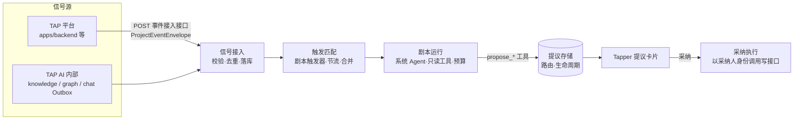
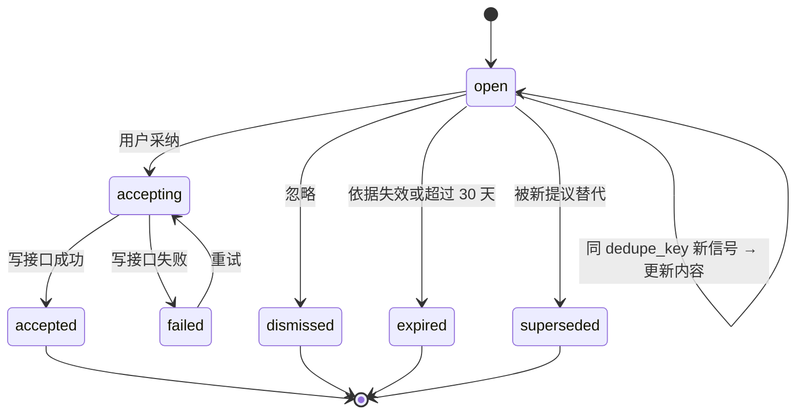

# Tapper 主动 Agent 设计

日期：2026-09-30。V2 方向，不在 [V1 总纲](../plans/2026-09-29-v1-roadmap.md) 范围内。设计参考 Yansu 的 Listen → Crystallize → Solve 模式，按测试平台的审计与权限要求调整。

## 背景

Tapper 目前只在用户提问时工作。平台内已经产生大量可用信号：知识发布与更新、回答“资料不足”、回答纠正、测试运行失败与 flaky、用例变更。这些信号没有被用来主动发现问题，也没有沉淀成团队知识。

## 目标

- 监听 TAP AI 内部信号和 TAP 平台其他功能的信号，自动做只读分析，产出附依据的提议卡片。
- 把对话与平台活动中反复出现的内容沉淀为知识条目或 `SKILL.md` 草稿，审核后进入 Library、Knowledge Graph 或 Skills。
- 提议按类型路由给个人或项目中有权限的人；任何写操作都由用户采纳后以其本人权限执行。
- 每次主动运行可追踪、有预算，提议可度量采纳率，依据失效的提议自动过期。

## 非目标

- 用户自定义剧本和触发器（架构预留，V2 不开放）。
- 自动执行写操作。
- 读取个人 IM、邮件或桌面截屏。
- Jira、Confluence 等外部系统接入（留给 MCP 方向另行设计）。

## 前置条件

- V1 能力 4：Agent 定义、Skills、工具注册表。
- V1 能力 5：每次运行有 trace，token 与成本持久化。
- V1 worker 可靠性修复：租约回收递增 `attempt` 且有上限、退避重试、loop 异常保护。

## 架构

采用“统一框架 + 内置剧本以系统 Agent 交付”。在 `apps/tap-ai-backend` 新增 `proactive` 模块和 `tapper_proactive_worker` 进程。

1. **信号接入**：TAP AI 内部事件从现有 Outbox 订阅；平台事件经接入接口推送。全部落入 MySQL `proactive_signal` 表，作为唯一事实源。
2. **触发匹配**：剧本声明订阅的事件类型、过滤条件和可选定时。同一剧本、同一聚合对象在节流窗口内的多个信号合并为一次运行。
3. **剧本运行**：剧本是标记为 `system` 的能力 4 Agent 定义，只能使用只读工具（授权检索、图谱查询、平台只读 API）和 `propose_*` 工具。每次运行最多 8 个工具步骤，有 token 上限，并生成能力 5 的 trace。
4. **提议存储与执行**：提议持久化依据、路由和状态。采纳时由后端以采纳人身份调用写接口，Agent 不持有写权限。

**跨边界规则**：TAP AI 不读平台数据库，只通过事件和平台只读 API 获取信息，采纳后的写操作调用平台 API。该契约在 V2.2 以 ADR 记录。

## 信号与事件契约

**信封**：使用现有 `tap.contracts.events.ProjectEventEnvelope`。载荷只放标识符和摘要字段，不放正文；剧本需要内容时经只读 API 读取并做权限校验。

**事件目录**：命名为 `<模块>.<对象>.<动作>`，版本化，schema 由 `make contracts` 生成到 `contracts/`。

| 来源 | 事件 | 用途 |
| --- | --- | --- |
| knowledge | `knowledge.document.published` / `.updated` / `.unpublished` | 影响分析、提议失效 |
| graph | `graph.snapshot.published` | 实体变化触发影响分析 |
| chat | `chat.turn.completed`（带 `grounded` / `insufficient` 标记） | 知识缺口、FAQ 沉淀 |
| chat | `chat.answer.feedback`（点踩或纠正） | 纠正沉淀 |
| test_management | `test_case.created` / `.updated`、`test_plan.updated` | 用例与知识对齐 |
| test_insights | `test_run.completed`（附失败摘要）、`test_case.flaky_detected` | 失败与 flaky 分析 |
| low_code | `automation.run.failed` | 失败归因 |

**投递语义**：至少一次投递，接入端按 `idempotency_key` 去重；允许乱序，按 `aggregate_version` 只处理最新版本。平台推送失败由发布方 Outbox 重试，TAP AI 不可用时由发布方积压并补推。

**接入接口**：`POST /internal/proactive/events`，批量，每批最多 100 条。服务间凭据认证，按来源系统白名单限定可发送的 `event_type`。未知类型或版本返回 422 并记录。接口只在内部网络暴露；Tapper Demo 的回环绑定不变，对外暴露需另做安全设计。

**隐私**：信号表只存标识符和摘要，保留 30 天。其他用户的提问原文不进入剧本的模型输入；FAQ 沉淀只使用聚合主题和统计。

## 剧本

| # | 剧本 | 触发 | 分析 | 提议 → 接收人 | 采纳后 |
| --- | --- | --- | --- | --- | --- |
| P1 | 知识缺口 | `chat.turn.completed` 为 insufficient，同一主题 7 天内 ≥ 3 次（按主题聚类，不用原文） | 归纳缺失主题，检索未发布的相关文档 | `knowledge_gap` → 项目知识管理员 | 跳转 Library 上传；有未发布文档时一键提交发布审核 |
| P2 | 文档变更影响 | `knowledge.document.updated`、`graph.snapshot.published` | 对比新旧版本变更实体，经图谱找出受影响的用例和 Skill | `change_impact` → 用例或 Skill 负责人；无负责人时发给项目 | 将选中用例标为“待复核”；Skill 跳转编辑 |
| P3 | 失败 / flaky 分析 | `test_run.completed` 有失败、`test_case.flaky_detected` | 失败聚类，结合知识库和历史运行给出原因假设 | `failure_insight` → 用例负责人 | 创建缺陷草稿，或将 flaky 用例标为隔离 |
| P4 | 回答纠正沉淀 | `chat.answer.feedback` 附纠正内容 | 核对纠正与现有知识的冲突 | `knowledge_draft` → 项目知识管理员 | 草稿进入 Library 待发布 |
| P5 | FAQ 沉淀 | 每周定时 | 统计高频主题（仅计数和来源），生成 FAQ 草稿 | `knowledge_draft` → 项目知识管理员 | 同 P4 |
| P6 | 流程沉淀为 Skill | 每周定时 | 识别同一用户本人对话中重复的多步操作 | `skill_draft` → 该用户 | 生成 Skill 草稿 Revision，本人编辑后发布 |

**通用约束**：

- **有依据**：每条提议必须附依据引用（知识片段、图谱边、事件或运行 ID）及来源版本，无依据不产出。原因类结论区分事实与推断。
- **防噪**：同一剧本、同一对象已有 `open` 提议时更新而不新建；被忽略的对象 14 天内不再对该接收人提出；每个接收人每天最多 10 条，按优先级截断。
- **开关**：项目管理员可逐个剧本启用、停用和调阈值；用户可按类型静音。依赖的信号来源未接入时剧本自动不可用。
- **预算**：项目按天设 token 总预算，超出后运行排队到次日，不丢弃。

## 提议生命周期

**数据模型**：

- `proposal`：项目、剧本、类型、`subject`（聚合对象类型和 ID）、标题、结构化正文（按类型定义 schema）、依据引用（含来源版本）、优先级、状态、`trace_id`、`dedupe_key`（剧本 + subject）、创建与过期时间。
- `proposal_recipient`：接收人（用户或项目角色）、送达状态、已读。
- `proposal_action`：采纳或忽略记录，含操作人、参数、执行结果和平台返回的对象 ID，同时写入 `governance` 审计。

**路由**：个人类提议（`change_impact` 有负责人、`failure_insight`、`skill_draft`）发给具体用户。项目类提议（`knowledge_gap`、`knowledge_draft`）发给项目角色，送达时展开为当时持有权限的用户；任一人处理后，对其他人显示“已由 X 处理”并关闭。读取时再次校验权限，无权访问依据来源的用户看不到该提议。

**失效**：依据来源被删除、取消发布或出现更新版本时，读取时过滤并排入一次重算（受节流约束）；超过 30 天未处理自动过期。

**采纳执行**：

1. 前端提交采纳，可附用户修改的参数（如移除部分用例、编辑草稿）。
2. 后端校验状态与依据仍有效，以采纳人身份和权限调用平台 API 或 TAP AI 内部 Library / Skills 接口。
3. 每个动作使用 `idempotency_key = proposal_id + action`，重复点击或重试不重复写入。
4. 写失败进入 `failed` 并可重试；批量动作逐项记录结果。
5. 草稿类提议（P4–P6）采纳后只生成待审核草稿，仍走目标模块原有发布或审核流程。

**剧本运行失败**：沿用 V1 修复后的 worker 租约与重试机制；超过上限记录失败、不产出提议、不通知用户，可在可观测性面板查看。

## 界面

交互先在 `apps/web` 的 `/prototype`（`TapProductPrototype`）增量设计，`apps/tap-ai-frontend` 按原型实现。不加演示开关。

1. **Tapper 侧栏“动态”入口**：位于 New chat 下方，带未读数。列表分“待我处理 / 项目待处理 / 已处理”。卡片显示类型图标、标题、摘要、来源模块标签和时间。详情区含分析结论、依据引用（知识片段打开来源，图谱边在 Knowledge Graph 高亮，用例或运行跳转对应模块）、事实与推断分栏、“查看调用链”链接。操作区为按类型命名的“采纳”主按钮（可先编辑参数或草稿）、“忽略”（原因选填）和“不再提示此类”。
2. **新对话页“为你准备”区**：位于推荐问题上方，最多 3 张高优先级个人提议，点击进入详情；无提议时不显示。
3. **悬浮助手上下文提示**：在 Test Management、Test Insights、Low Code Automation 中，当前对象有未处理提议时悬浮助手显示圆点；展开后首条为该提议，可直接采纳、忽略，或以提议为上下文开启对话追问。
4. **设置**：项目设置“主动助手”页按剧本启用、停用、调阈值和每日上限；个人设置按类型静音。

原型验收覆盖三条跨模块路径，并对比改动前后截图，确认现有模块不受影响：

- 知识更新 → 动态卡片 → 用例标为待复核 → 跳转 Test Management。
- Test Insights flaky → 悬浮助手提议 → 创建缺陷草稿。
- 回答被纠正 → 知识草稿 → Library 待发布。

## 验证

- **单元测试**：触发过滤、节流合并、按 `aggregate_version` 丢弃旧事件；提议状态机；去重与忽略后 14 天静默；路由展开；读取时失效过滤；每日上限截断。
- **契约**：事件目录 schema 生成与校验（未知类型或版本返回 422）；接入接口认证与来源白名单；各类提议正文 schema；采纳动作请求与响应。
- **集成测试**（MySQL）：事件接入 → 剧本运行（确定性模型替身）→ 提议落库 → 采纳 → 平台 API 替身，覆盖幂等重试和部分成功。缺少 MySQL 时明确报告，不静默跳过。
- **剧本质量**：每个剧本有仓库内 golden 场景（给定事件与知识库，预期是否提议及依据是否正确）；CI 用替身模型，真实模型在 `TAP_RUN_TAPPER_REAL_MODEL_SMOKE=1` 下运行。
- **E2E**：TAP AI 前端一条确定性路径“知识更新 → 动态卡片 → 采纳”，并入 `make demo-e2e` 的隔离环境。
- **前端**：原型与 TAP AI 前端各自的组件测试。
- **可观测性**：每次剧本运行有 trace（触发信号、工具调用、模型调用、token、成本），提议详情可跳转。指标包括各剧本运行次数、失败率、token 消耗，以及提议产出量、采纳率、忽略率（含原因分布）和过期率；采纳率低于阈值的剧本在设置页提示管理员。

## 交付分期

每期各自走 spec → plan → 实施。

1. **V2.1 框架与 TAP AI 内部剧本**：`proactive` 模块、内部 Outbox 订阅、提议存储与路由、采纳执行（仅 TAP AI 内部写接口）、P1、P2（仅 Skill 影响）、P4、P5、P6，界面 1、2、4。
2. **V2.2 平台事件接入**：ADR（TAP AI 与平台的事件及写接口契约）、接入接口、`apps/backend` 的 Outbox 与推送器、Test Insights 事件、P3（先只分析，采纳动作待平台 API 就绪），界面 3。
3. **V2.3 Test Management 与 Low Code Automation**：随两个后端解冻接入，补全 P2 的用例部分、P3 的采纳动作和 `automation.run.failed`。

`docs/architecture.md` 在 V2.1 实施时补充主动 Agent 的数据流。
